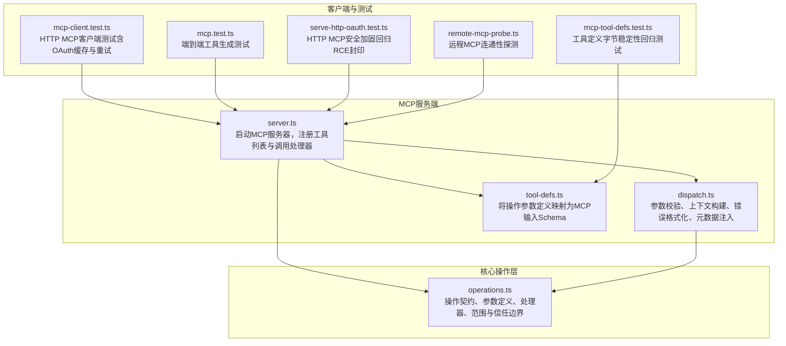
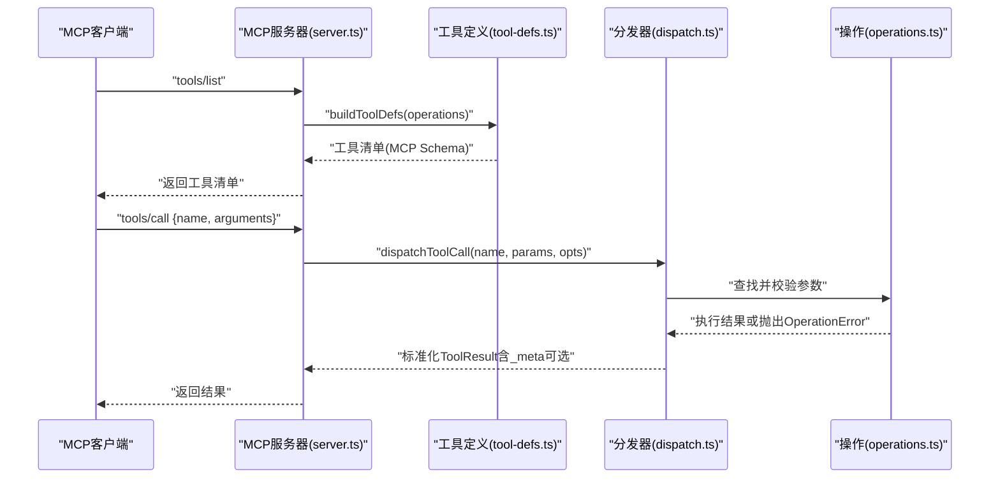
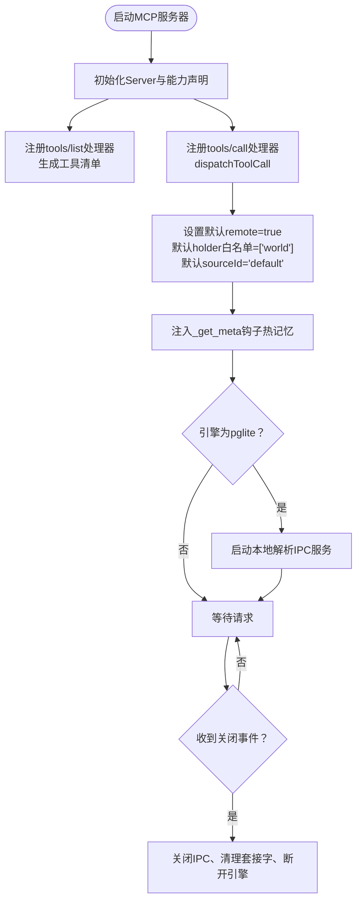
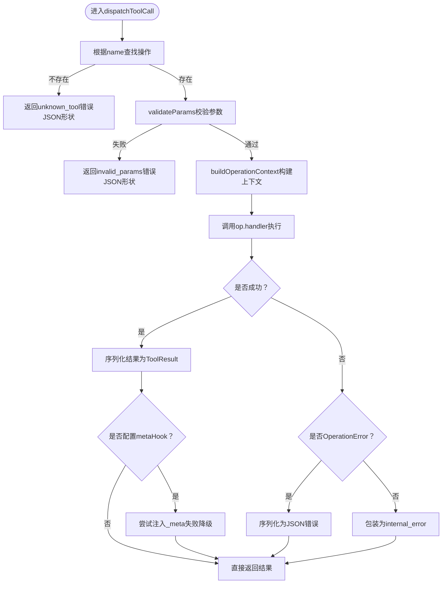
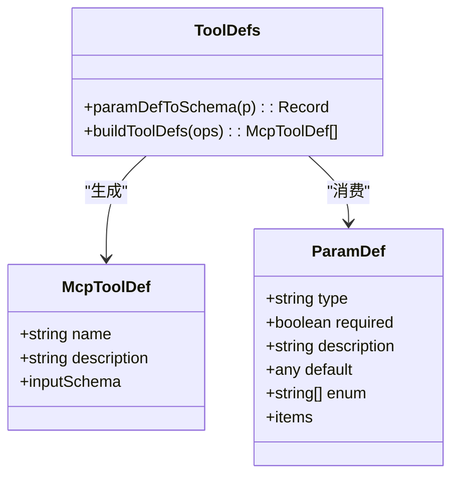
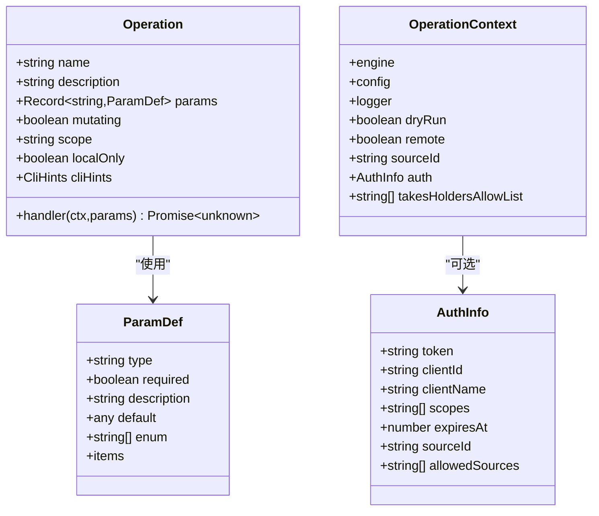
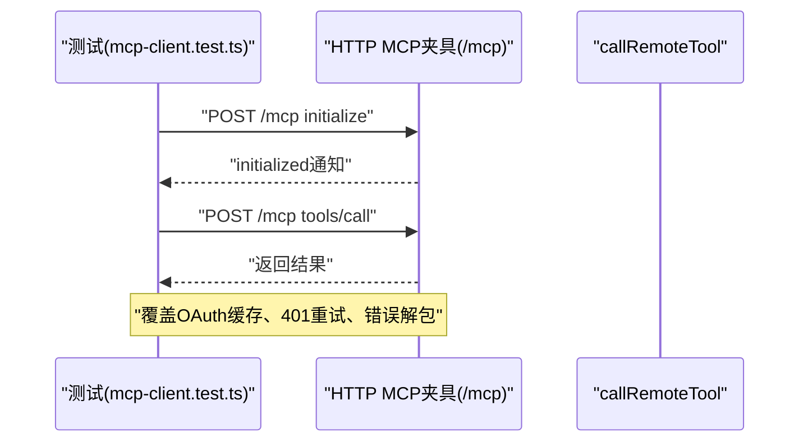
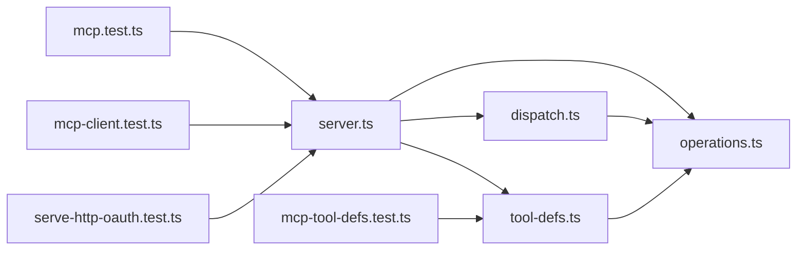

# MCP扩展

<cite>
**本文引用的文件**
- [server.ts](file://src/mcp/server.ts)
- [dispatch.ts](file://src/mcp/dispatch.ts)
- [tool-defs.ts](file://src/mcp/tool-defs.ts)
- [operations.ts](file://src/core/operations.ts)
- [mcp-client.test.ts](file://test/mcp-client.test.ts)
- [mcp.test.ts](file://test/e2e/mcp.test.ts)
- [mcp-tool-defs.test.ts](file://test/mcp-tool-defs.test.ts)
- [serve-http-oauth.test.ts](file://test/e2e/serve-http-oauth.test.ts)
- [remote-mcp-probe.ts](file://src/core/remote-mcp-probe.ts)
</cite>

## 目录
1. [简介](#简介)
2. [项目结构](#项目结构)
3. [核心组件](#核心组件)
4. [架构总览](#架构总览)
5. [详细组件分析](#详细组件分析)
6. [依赖关系分析](#依赖关系分析)
7. [性能考量](#性能考量)
8. [故障排查指南](#故障排查指南)
9. [结论](#结论)
10. [附录](#附录)

## 简介
本文件系统化阐述 gbrain 的 MCP（Model Context Protocol）扩展：从架构设计到扩展机制，从工具定义、参数校验到结果处理；从开发自定义工具到客户端集成与安全控制；从注册与发现到调用流程与互操作性。文档以仓库中的实际实现为依据，辅以可视化图示帮助理解。

## 项目结构
围绕 MCP 的核心代码位于 src/mcp 目录，配合 src/core/operations.ts 提供统一的操作契约与实现。测试覆盖了工具定义生成、HTTP/OAuth 场景以及端到端行为。

图表来源
- [server.ts:18-55](file://src/mcp/server.ts#L18-L55)
- [dispatch.ts:222-283](file://src/mcp/dispatch.ts#L222-L283)
- [tool-defs.ts:40-54](file://src/mcp/tool-defs.ts#L40-L54)
- [operations.ts:589-619](file://src/core/operations.ts#L589-L619)
- [mcp-client.test.ts:1-37](file://test/mcp-client.test.ts#L1-L37)
- [mcp.test.ts:16-37](file://test/e2e/mcp.test.ts#L16-L37)
- [mcp-tool-defs.test.ts:1-27](file://test/mcp-tool-defs.test.ts#L1-L27)
- [serve-http-oauth.test.ts:829-844](file://test/e2e/serve-http-oauth.test.ts#L829-L844)
- [remote-mcp-probe.ts:145-182](file://src/core/remote-mcp-probe.ts#L145-L182)

章节来源
- [server.ts:18-55](file://src/mcp/server.ts#L18-L55)
- [dispatch.ts:1-284](file://src/mcp/dispatch.ts#L1-L284)
- [tool-defs.ts:1-55](file://src/mcp/tool-defs.ts#L1-L55)
- [operations.ts:589-619](file://src/core/operations.ts#L589-L619)

## 核心组件
- MCP 服务器：负责初始化、注册工具清单、处理工具调用请求，并在 stdio 模式下优雅退出与 IPC 解析通道。
- 分发器：统一参数校验、上下文构建、错误格式化与元数据注入，保证 stdio 与 HTTP 两种传输的一致性。
- 工具定义生成器：将操作参数定义转换为 MCP 输入 Schema，确保工具清单稳定且可被子代理注册表复用。
- 操作契约与处理器：定义每个操作的名称、描述、参数、权限范围与处理器，贯穿所有传输路径。

章节来源
- [server.ts:18-55](file://src/mcp/server.ts#L18-L55)
- [dispatch.ts:14-73](file://src/mcp/dispatch.ts#L14-L73)
- [tool-defs.ts:3-11](file://src/mcp/tool-defs.ts#L3-L11)
- [operations.ts:589-619](file://src/core/operations.ts#L589-L619)

## 架构总览
MCP 扩展采用“契约优先”的设计：operations.ts 定义操作契约，server.ts 将其映射为 MCP 工具清单，dispatch.ts 统一执行与错误处理，tool-defs.ts 负责 Schema 映射。HTTP 与 stdio 两种传输共享同一分发逻辑，确保行为一致。

图表来源
- [server.ts:27-55](file://src/mcp/server.ts#L27-L55)
- [tool-defs.ts:40-54](file://src/mcp/tool-defs.ts#L40-L54)
- [dispatch.ts:222-283](file://src/mcp/dispatch.ts#L222-L283)
- [operations.ts:589-619](file://src/core/operations.ts#L589-L619)

## 详细组件分析

### MCP 服务器（server.ts）
- 初始化：创建 Server 实例，声明能力为 tools。
- 工具列表：通过 buildToolDefs 将 operations 映射为 MCP 工具清单。
- 工具调用：注册 CallToolRequestSchema 处理器，使用 dispatchToolCall 执行，设置默认 remote=true、默认 takesHoldersAllowList=['world']、默认 sourceId='default'，并注入 _meta 热记忆钩子。
- IPC 反射：在 PGLite 引擎下启动本地解析服务，支持实体指针解析与投递日志。
- 退出策略：监听 stdin EOF、transport 关闭与信号，清理 IPC 套接字并断开引擎连接。

图表来源
- [server.ts:18-123](file://src/mcp/server.ts#L18-L123)

章节来源
- [server.ts:18-123](file://src/mcp/server.ts#L18-L123)

### 分发器（dispatch.ts）
- 统一入口：dispatchToolCall 接收 name、params 与可选 opts，返回标准化 ToolResult。
- 参数校验：validateParams 对必填项与类型进行严格检查。
- 上下文构建：buildOperationContext 注入 engine、config、logger、dryRun、remote、takesHoldersAllowList、sourceId、auth 等。
- 错误处理：对未知工具返回 JSON 形态的错误内容；对 OperationError 序列化为 JSON；对非 OperationError 包装为内部错误。
- 元数据注入：可选 metaHook 在成功后尝试注入 _meta（如热记忆），失败时降级为无 _meta。
- 参数摘要：summarizeMcpParams 生成隐私安全的参数摘要，避免敏感负载写入日志。

图表来源
- [dispatch.ts:222-283](file://src/mcp/dispatch.ts#L222-L283)

章节来源
- [dispatch.ts:14-73](file://src/mcp/dispatch.ts#L14-L73)
- [dispatch.ts:170-187](file://src/mcp/dispatch.ts#L170-L187)
- [dispatch.ts:195-214](file://src/mcp/dispatch.ts#L195-L214)
- [dispatch.ts:222-283](file://src/mcp/dispatch.ts#L222-L283)

### 工具定义生成（tool-defs.ts）
- 参数到 Schema 映射：paramDefToSchema 将 ParamDef 转换为 JSON Schema 片段，递归处理 items，保持 key 顺序稳定。
- 工具清单生成：buildToolDefs 遍历 operations，输出 name、description 与 inputSchema（properties、required）。

图表来源
- [tool-defs.ts:3-11](file://src/mcp/tool-defs.ts#L3-L11)
- [tool-defs.ts:30-37](file://src/mcp/tool-defs.ts#L30-L37)
- [tool-defs.ts:40-54](file://src/mcp/tool-defs.ts#L40-L54)

章节来源
- [tool-defs.ts:1-55](file://src/mcp/tool-defs.ts#L1-L55)

### 操作契约与处理器（operations.ts）
- Operation 结构：name、description、params（ParamDef）、handler、mutating、scope、localOnly、cliHints。
- ParamDef 字段：type、required、description、default、enum、items。
- 权限与信任：remote 标记决定安全策略（文件上传等在 remote=true 时收紧），scope 控制访问级别（read/write/admin/special）。
- 源作用域：sourceId/sourceIds 决定多源脑的查询范围，resolveRequestedScope 与 sourceScopeOpts 提供统一解析。
- 典型操作：get_page、put_page、delete_page、list_pages、search、query 等均遵循该契约。

图表来源
- [operations.ts:589-619](file://src/core/operations.ts#L589-L619)
- [operations.ts:216-223](file://src/core/operations.ts#L216-L223)
- [operations.ts:277-394](file://src/core/operations.ts#L277-L394)
- [operations.ts:231-275](file://src/core/operations.ts#L231-L275)

章节来源
- [operations.ts:589-619](file://src/core/operations.ts#L589-L619)
- [operations.ts:216-223](file://src/core/operations.ts#L216-L223)
- [operations.ts:277-394](file://src/core/operations.ts#L277-L394)
- [operations.ts:231-275](file://src/core/operations.ts#L231-L275)

### 客户端集成与测试（mcp-client.test.ts、remote-mcp-probe.ts）
- 客户端测试：模拟 HTTP MCP 服务器，验证 callRemoteTool 的 OAuth 缓存、一次 401 刷新重试与 RemoteMcpError 形状。
- 远程探测：remote-mcp-probe 通过 Authorization: Bearer 发起 initialize 请求，判断网络、鉴权与可用性。

图表来源
- [mcp-client.test.ts:68-106](file://test/mcp-client.test.ts#L68-L106)

章节来源
- [mcp-client.test.ts:1-37](file://test/mcp-client.test.ts#L1-L37)
- [mcp-client.test.ts:68-106](file://test/mcp-client.test.ts#L68-L106)
- [remote-mcp-probe.ts:145-182](file://src/core/remote-mcp-probe.ts#L145-L182)

### 端到端与回归测试
- 工具生成测试：验证 operations 生成的工具清单与 server 一致。
- 工具定义字节稳定性：确保 paramDefToSchema 的递归 items 映射不漂移。
- HTTP/OAuth 安全回归：修复 HTTP MCP 中 remote 标记缺失导致的命令执行风险。

章节来源
- [mcp.test.ts:16-37](file://test/e2e/mcp.test.ts#L16-L37)
- [mcp-tool-defs.test.ts:1-27](file://test/mcp-tool-defs.test.ts#L1-L27)
- [serve-http-oauth.test.ts:829-844](file://test/e2e/serve-http-oauth.test.ts#L829-L844)

## 依赖关系分析
- server.ts 依赖 tool-defs.ts 生成工具清单，依赖 dispatch.ts 统一分发与错误处理，依赖 operations.ts 获取操作定义。
- dispatch.ts 依赖 operations.ts 的 Operation/ParamDef/OperationError，依赖 config 加载运行时配置。
- tool-defs.ts 仅依赖 operations.ts 的 ParamDef 定义。
- 测试覆盖 server、dispatch、tool-defs 与 HTTP/OAuth 安全场景。

图表来源
- [server.ts:1-16](file://src/mcp/server.ts#L1-L16)
- [dispatch.ts:9-12](file://src/mcp/dispatch.ts#L9-L12)
- [tool-defs.ts](file://src/mcp/tool-defs.ts#L1)
- [operations.ts:589-619](file://src/core/operations.ts#L589-L619)
- [mcp.test.ts:16-37](file://test/e2e/mcp.test.ts#L16-L37)
- [mcp-tool-defs.test.ts:12-14](file://test/mcp-tool-defs.test.ts#L12-L14)
- [mcp-client.test.ts:18-26](file://test/mcp-client.test.ts#L18-L26)
- [serve-http-oauth.test.ts:829-844](file://test/e2e/serve-http-oauth.test.ts#L829-L844)

章节来源
- [server.ts:1-16](file://src/mcp/server.ts#L1-L16)
- [dispatch.ts:9-12](file://src/mcp/dispatch.ts#L9-L12)
- [tool-defs.ts](file://src/mcp/tool-defs.ts#L1)
- [operations.ts:589-619](file://src/core/operations.ts#L589-L619)

## 性能考量
- 传输一致性：stdio 与 HTTP 共享同一分发逻辑，减少重复校验与上下文构建成本。
- 元数据注入：_meta 注入在成功后异步进行并带 try/catch 降级，避免阻塞主流程。
- 日志与隐私：参数摘要对近似大小进行桶化，防止通过长度侧信道推断敏感信息。
- IPC 最佳努力：实体解析 IPC 失败不阻塞 MCP 服务启动与运行。

章节来源
- [dispatch.ts:255-267](file://src/mcp/dispatch.ts#L255-L267)
- [dispatch.ts:121-126](file://src/mcp/dispatch.ts#L121-L126)
- [server.ts:64-93](file://src/mcp/server.ts#L64-L93)

## 故障排查指南
- 认证失败：remote-mcp-probe 会区分 401/403 并提示令牌被拒；检查 Bearer Token 是否正确、过期与授权范围。
- 网络问题：remote-mcp-probe 使用超时控制，若超时或非 2xx，记录 reason=network。
- 工具调用错误：dispatch 返回 JSON 形态的错误内容（unknown_tool、invalid_params、internal_error），客户端应 JSON.parse 并按 error 字段处理。
- HTTP 安全回归：若出现 HTTP MCP 未设置 remote 导致的命令执行风险，需确认 serve-http 已设置 remote: true，且 operations 层使用 ctx.remote !== false 的防御式判断。

章节来源
- [remote-mcp-probe.ts:145-182](file://src/core/remote-mcp-probe.ts#L145-L182)
- [dispatch.ts:235-247](file://src/mcp/dispatch.ts#L235-L247)
- [serve-http-oauth.test.ts:829-844](file://test/e2e/serve-http-oauth.test.ts#L829-L844)

## 结论
gbrain 的 MCP 扩展以“契约优先”为核心，通过 operations.ts 统一定义操作，server.ts 与 tool-defs.ts 生成工具清单，dispatch.ts 提供跨传输的一致分发与错误处理。结合严格的参数校验、可信上下文、源作用域与元数据注入，既保障了安全性，也提供了良好的可扩展性与可观测性。测试覆盖端到端工具生成、Schema 稳定性与 HTTP/OAuth 安全加固，确保扩展的可靠性与兼容性。

## 附录

### 开发自定义 MCP 工具指南
- 定义操作：在 operations.ts 中新增 Operation，明确 name、description、params（ParamDef）、handler、scope、mutating 等字段。
- 参数校验：利用 validateParams 的规则自动获得 stdio 与 HTTP 一致的参数校验。
- 上下文使用：在 handler 中通过 ctx.engine、ctx.config、ctx.remote、ctx.sourceId、ctx.auth 等完成业务逻辑。
- 权限与信任：根据 remote 标记调整安全策略（如文件上传路径限制），根据 scope 控制访问级别。
- 元数据注入：如需在响应中附加 _meta（如热记忆），在 dispatch opts 中传入 metaHook。

章节来源
- [operations.ts:589-619](file://src/core/operations.ts#L589-L619)
- [operations.ts:277-394](file://src/core/operations.ts#L277-L394)
- [dispatch.ts:30-73](file://src/mcp/dispatch.ts#L30-L73)
- [dispatch.ts:222-283](file://src/mcp/dispatch.ts#L222-L283)

### MCP 客户端集成要点
- HTTP MCP：使用 Bearer Token 进行鉴权，参考 mcp-client.test.ts 的夹具实现，覆盖 OAuth 缓存与 401 重试。
- 远程探测：使用 remote-mcp-probe 对远端 MCP 进行连通性与鉴权探测。
- 错误处理：统一解析 dispatch 返回的 JSON 错误内容，按 error 字段分类处理。

章节来源
- [mcp-client.test.ts:68-106](file://test/mcp-client.test.ts#L68-L106)
- [remote-mcp-probe.ts:145-182](file://src/core/remote-mcp-probe.ts#L145-L182)
- [dispatch.ts:235-247](file://src/mcp/dispatch.ts#L235-L247)

### 工具注册、发现与调用流程
- 注册与发现：server 通过 tools/list 返回由 tool-defs 生成的工具清单。
- 调用：客户端 tools/call，server 调用 dispatchToolCall，最终落到 operations 的 handler。
- 源作用域：通过 sourceScopeOpts/resolveRequestedScope 统一解析 caller 与 grant 的范围，防止越权读取。

章节来源
- [server.ts:27-55](file://src/mcp/server.ts#L27-L55)
- [tool-defs.ts:40-54](file://src/mcp/tool-defs.ts#L40-L54)
- [dispatch.ts:222-283](file://src/mcp/dispatch.ts#L222-L283)
- [operations.ts:417-494](file://src/core/operations.ts#L417-L494)

### 安全考虑与访问控制
- 传输信任：stdio 默认 remote=true，HTTP 通过 OAuth 设置 remote=true，operations 层以 ctx.remote !== false 作为防御。
- 文件系统与路径：upload 路径在 remote=true 时严格限制与防穿越，remote=false 放宽但禁止符号链接最终组件。
- 源作用域：sourceId/sourceIds 严格限定查询范围，resolveRequestedScope 与 sourceScopeOpts 提供统一解析。
- 隐私与可见性：对 takes/facts 的 fence 渲染在 remote 场景下进行剥离，确保不可见内容不泄露。
- 元数据注入：_meta 注入失败降级，不影响主流程。

章节来源
- [server.ts:36-55](file://src/mcp/server.ts#L36-L55)
- [operations.ts:114-149](file://src/core/operations.ts#L114-L149)
- [operations.ts:417-494](file://src/core/operations.ts#L417-L494)
- [operations.ts:674-718](file://src/core/operations.ts#L674-L718)
- [dispatch.ts:255-267](file://src/mcp/dispatch.ts#L255-L267)

### 调试工具与监控
- 参数摘要：summarizeMcpParams 输出 redacted 摘要，避免敏感负载写入日志。
- 连接探测：remote-mcp-probe 提供网络与鉴权探测。
- 端到端测试：mcp.test.ts 与 mcp-tool-defs.test.ts 保证工具生成与 Schema 稳定性。

章节来源
- [dispatch.ts:128-168](file://src/mcp/dispatch.ts#L128-L168)
- [remote-mcp-probe.ts:145-182](file://src/core/remote-mcp-probe.ts#L145-L182)
- [mcp.test.ts:16-37](file://test/e2e/mcp.test.ts#L16-L37)
- [mcp-tool-defs.test.ts:1-27](file://test/mcp-tool-defs.test.ts#L1-L27)

### 与现有 MCP 工具的集成与互操作性
- 工具清单一致性：server 与 HTTP 传输共享同一工具定义生成逻辑，确保 agent 兼容。
- 子代理注册表：tool-defs 的 buildToolDefs 同样被子代理工具注册表复用，保持 MCP 面向的工具 Schema 稳定。

章节来源
- [server.ts:27-29](file://src/mcp/server.ts#L27-L29)
- [tool-defs.ts:16-25](file://src/mcp/tool-defs.ts#L16-L25)