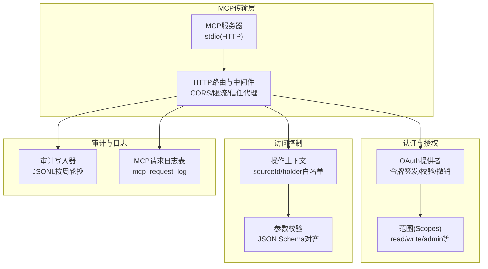
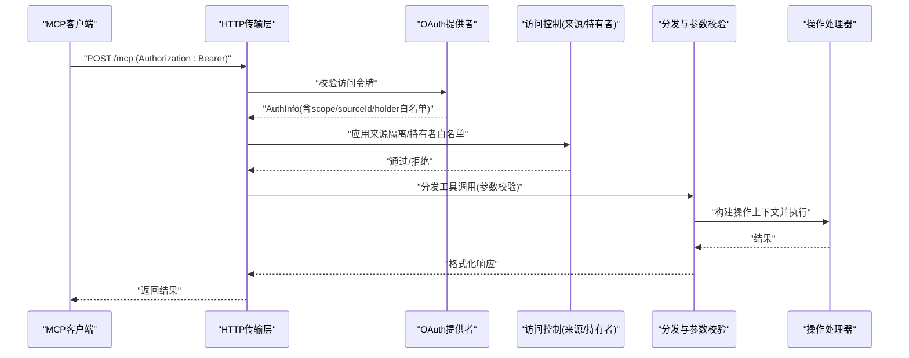
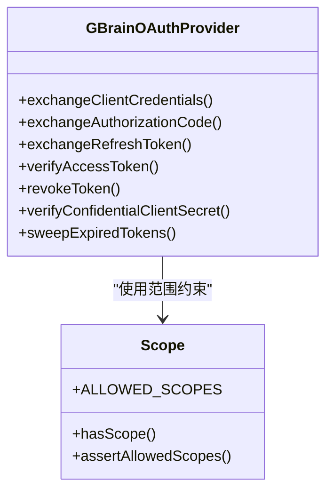
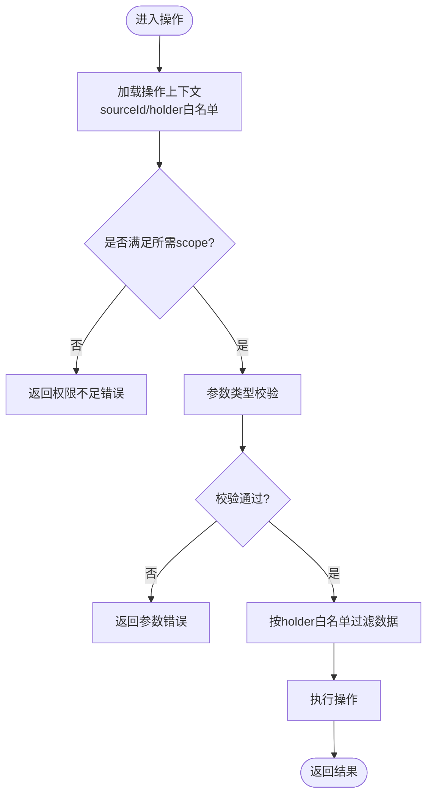
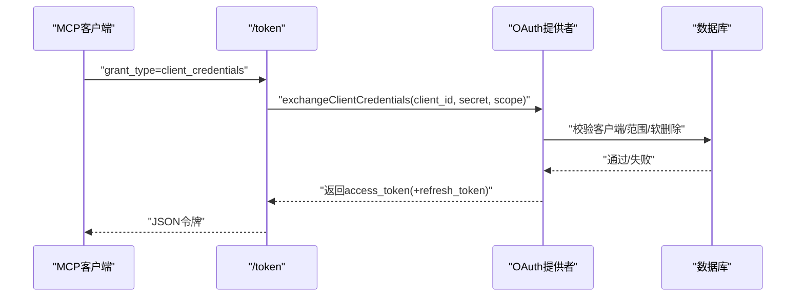
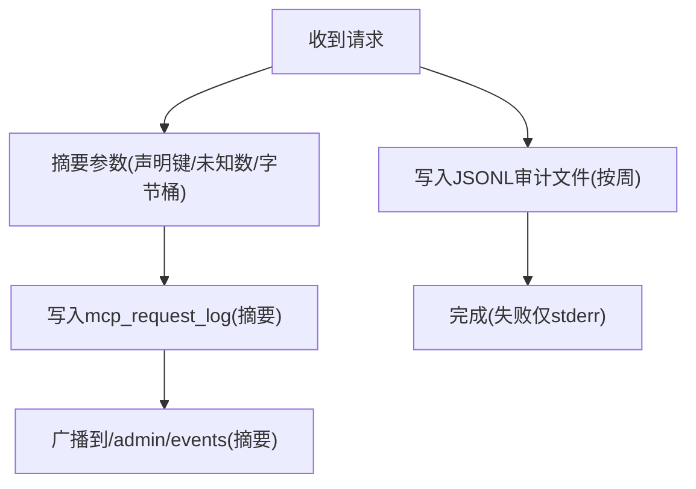
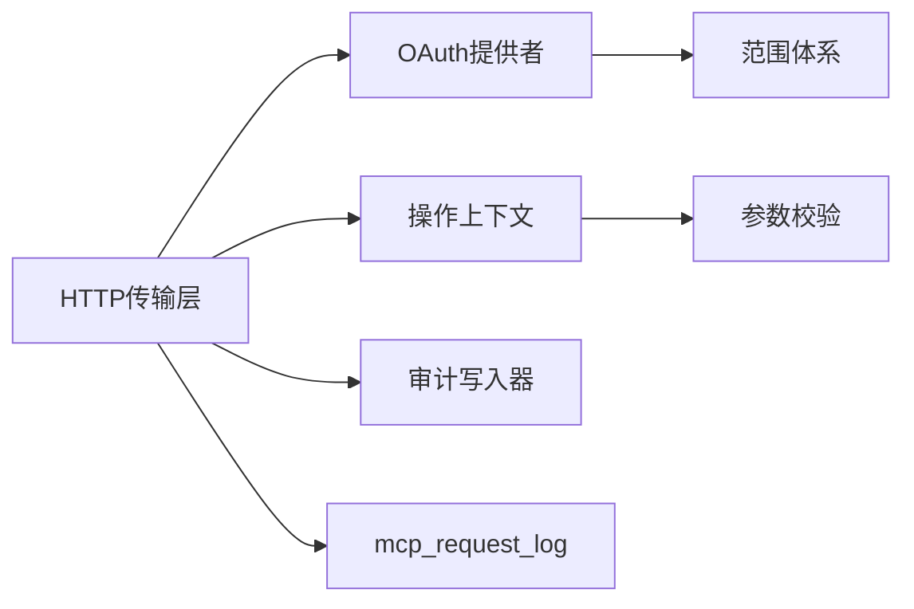

# 安全与访问控制

<cite>
**本文引用的文件**
- [SECURITY.md](file://SECURITY.md)
- [oauth-provider.ts](file://src/core/oauth-provider.ts)
- [scope.ts](file://src/core/scope.ts)
- [serve-http.ts](file://src/commands/serve-http.ts)
- [dispatch.ts](file://src/mcp/dispatch.ts)
- [server.ts](file://src/mcp/server.ts)
- [guardrails.ts](file://src/core/guardrails.ts)
- [audit-writer.ts](file://src/core/audit/audit-writer.ts)
- [shell-audit.ts](file://src/core/minions/handlers/shell-audit.ts)
- [timing-safe.ts](file://src/core/timing-safe.ts)
- [utils.ts](file://src/core/utils.ts)
- [mcp-client.test.ts](file://test/mcp-client.test.ts)
- [serve-http-oauth.test.ts](file://test/e2e/serve-http-oauth.test.ts)
- [oauth.test.ts](file://test/oauth.test.ts)
- [oauth-confidential-client.test.ts](file://test/oauth-confidential-client.test.ts)
</cite>

## 目录
1. [简介](#简介)
2. [项目结构](#项目结构)
3. [核心组件](#核心组件)
4. [架构总览](#架构总览)
5. [详细组件分析](#详细组件分析)
6. [依赖关系分析](#依赖关系分析)
7. [性能考量](#性能考量)
8. [故障排查指南](#故障排查指南)
9. [结论](#结论)
10. [附录](#附录)

## 简介
本文件聚焦于MCP协议在本项目中的安全与访问控制设计，覆盖威胁建模、身份认证与授权、OAuth集成与令牌管理、访问控制清单（ACL）、安全审计与日志、参数校验与输入清理、常见漏洞的缓解策略，以及多租户场景下的安全隔离机制。内容基于仓库中现有的OAuth 2.1服务端、MCP传输层、操作上下文与参数校验、审计与告警等实现进行系统化梳理，并提供可操作的最佳实践。

## 项目结构
围绕MCP安全的关键模块分布如下：
- 身份认证与授权：OAuth 2.1提供者、范围（scope）定义、HTTP传输层路由与中间件
- 访问控制：操作上下文中的来源隔离、持有者白名单、参数校验
- 审计与日志：请求审计写入器、MCP请求日志表、Shell作业审计
- 防护与加固：速率限制、CORS默认拒绝、反向代理信任策略、常量时间比较、令牌哈希存储

图示来源
- [server.ts:18-55](file://src/mcp/server.ts#L18-L55)
- [serve-http.ts:523-747](file://src/commands/serve-http.ts#L523-L747)
- [oauth-provider.ts:344-702](file://src/core/oauth-provider.ts#L344-L702)
- [scope.ts:25-119](file://src/core/scope.ts#L25-L119)
- [dispatch.ts:195-214](file://src/mcp/dispatch.ts#L195-L214)
- [audit-writer.ts:174-254](file://src/core/audit/audit-writer.ts#L174-L254)

章节来源
- [server.ts:18-55](file://src/mcp/server.ts#L18-L55)
- [serve-http.ts:398-747](file://src/commands/serve-http.ts#L398-L747)
- [oauth-provider.ts:344-702](file://src/core/oauth-provider.ts#L344-L702)
- [scope.ts:25-119](file://src/core/scope.ts#L25-L119)
- [dispatch.ts:195-214](file://src/mcp/dispatch.ts#L195-L214)
- [audit-writer.ts:174-254](file://src/core/audit/audit-writer.ts#L174-L254)

## 核心组件
- OAuth 2.1提供者：支持客户端凭据、授权码+PKCE、刷新令牌、动态客户端注册（可禁用）、令牌哈希存储与校验、范围约束与来源隔离
- 范围（Scope）体系：统一的允许范围集合与层级关系，用于授权最小化与能力映射
- HTTP传输层：OAuth端点路由、CORS默认拒绝、速率限制、反向代理信任策略、管理员会话与魔法链接
- 操作上下文与参数校验：统一的参数类型检查、来源隔离、持有者白名单过滤
- 审计与日志：请求摘要与红化、JSONL审计文件、MCP请求日志表
- 防护与加固：常量时间比较、令牌哈希、数组注入防护、重定向URI校验

章节来源
- [oauth-provider.ts:344-702](file://src/core/oauth-provider.ts#L344-L702)
- [scope.ts:25-119](file://src/core/scope.ts#L25-L119)
- [serve-http.ts:523-747](file://src/commands/serve-http.ts#L523-L747)
- [dispatch.ts:170-187](file://src/mcp/dispatch.ts#L170-L187)
- [audit-writer.ts:174-254](file://src/core/audit/audit-writer.ts#L174-L254)
- [timing-safe.ts:31-34](file://src/core/timing-safe.ts#L31-L34)

## 架构总览
下图展示MCP请求从HTTP入口到操作执行的完整链路，以及安全控制点的分布。

图示来源
- [serve-http.ts:596-688](file://src/commands/serve-http.ts#L596-L688)
- [oauth-provider.ts:552-702](file://src/core/oauth-provider.ts#L552-L702)
- [dispatch.ts:222-283](file://src/mcp/dispatch.ts#L222-L283)
- [server.ts:36-55](file://src/mcp/server.ts#L36-L55)

## 详细组件分析

### 身份认证与授权（OAuth 2.1）
- 支持的授权方式
  - 客户端凭据：用于机器到机器（M2M）调用，如Claude、Perplexity
  - 授权码+PKCE：用于浏览器型客户端，如ChatGPT自定义连接器
  - 刷新令牌：支持令牌轮换与范围收紧
- 动态客户端注册（DCR）
  - 可通过配置启用或禁用；禁用后不暴露/register端点
  - 注册时强制HTTPS重定向URI校验与范围白名单
- 令牌存储与校验
  - 仅存储SHA-256哈希；明文令牌仅在创建时返回一次
  - 自动清理过期令牌；支持令牌撤销
  - 严格的时间戳处理，避免字符串BIGINT导致的SDK兼容问题
- 范围与来源隔离
  - 统一的范围集合与层级关系，确保最小权限
  - 通过oauth_clients携带source_id与federated_read，实现来源隔离与联邦读取

图示来源
- [oauth-provider.ts:344-702](file://src/core/oauth-provider.ts#L344-L702)
- [scope.ts:25-119](file://src/core/scope.ts#L25-L119)

章节来源
- [oauth-provider.ts:344-702](file://src/core/oauth-provider.ts#L344-L702)
- [scope.ts:25-119](file://src/core/scope.ts#L25-L119)
- [SECURITY.md:11-97](file://SECURITY.md#L11-L97)

### 访问控制清单（ACL）与来源隔离
- 来源隔离（sourceId）
  - 操作上下文中强制sourceId，默认为"default"，可通过环境变量或调用方指定
  - 多源脑中，不同sourceId对应不同的数据边界
- 持有者白名单（takes holders）
  - HTTP/stdio传输层将per-token的holder白名单注入操作上下文
  - 对涉及“持有者”的查询（如takes_list）必须按白名单过滤
- 参数校验
  - 基于操作声明的参数Schema进行类型检查，缺失必填参数直接拒绝
  - 统一的工具定义生成，确保MCP工具描述与实现一致

图示来源
- [dispatch.ts:195-214](file://src/mcp/dispatch.ts#L195-L214)
- [dispatch.ts:170-187](file://src/mcp/dispatch.ts#L170-L187)
- [server.ts:36-55](file://src/mcp/server.ts#L36-L55)

章节来源
- [dispatch.ts:195-214](file://src/mcp/dispatch.ts#L195-L214)
- [dispatch.ts:170-187](file://src/mcp/dispatch.ts#L170-L187)
- [server.ts:36-55](file://src/mcp/server.ts#L36-L55)

### OAuth端点与令牌管理
- 端点路由
  - /token：自定义客户端凭据处理；授权码/刷新令牌的保密客户端路径
  - /authorize、/register、/revoke：由SDK路由器提供，支持DCR开关
  - /mcp：MCP工具调用，需Bearer令牌
- 令牌发放
  - 客户端凭据：根据客户端范围与资源颁发访问令牌，可选刷新令牌
  - 授权码：绑定client_id与redirect_uri原子删除，防止重放
  - 刷新令牌：范围必须为原授予的子集，过期时间严格校验
- CORS与反向代理信任
  - OAuth端点默认拒绝跨域，需显式配置允许列表
  - 反向代理信任策略默认仅本地回环，可按需放宽

图示来源
- [serve-http.ts:596-614](file://src/commands/serve-http.ts#L596-L614)
- [oauth-provider.ts:771-800](file://src/core/oauth-provider.ts#L771-L800)

章节来源
- [serve-http.ts:596-688](file://src/commands/serve-http.ts#L596-L688)
- [oauth-provider.ts:771-800](file://src/core/oauth-provider.ts#L771-L800)

### 安全审计与日志
- 请求摘要与红化
  - 默认将请求参数摘要写入mcp_request_log，仅保留已声明键名、未知键数量与近似字节大小
  - 支持开启完整参数记录（仅限调试），并发出明显警告
- JSONL审计文件
  - 按ISO周轮换命名，支持最佳努力写入，失败仅输出stderr
  - 提供读取最近N天事件的能力，忽略损坏行
- Shell作业审计
  - 记录命令显示文本、参数截断、继承密钥名称等，避免泄露敏感值

图示来源
- [dispatch.ts:128-168](file://src/mcp/dispatch.ts#L128-L168)
- [audit-writer.ts:174-254](file://src/core/audit/audit-writer.ts#L174-L254)
- [shell-audit.ts:62-71](file://src/core/minions/handlers/shell-audit.ts#L62-L71)

章节来源
- [dispatch.ts:128-168](file://src/mcp/dispatch.ts#L128-L168)
- [audit-writer.ts:174-254](file://src/core/audit/audit-writer.ts#L174-L254)
- [shell-audit.ts:62-71](file://src/core/minions/handlers/shell-audit.ts#L62-L71)

### 参数验证与输入清理
- 类型与必填校验
  - 基于操作定义的参数Schema进行严格类型检查
  - 缺失必填参数或类型不符直接返回错误
- 工具定义一致性
  - 统一的paramDef→JSON Schema转换，确保MCP工具描述与实现一致
- 输入清理
  - 重定向URI强制HTTPS（回环例外）
  - 数组注入防护：Postgres数组字面量转义与校验
  - 令牌哈希存储，避免明文泄露

章节来源
- [dispatch.ts:170-187](file://src/mcp/dispatch.ts#L170-L187)
- [tool-defs.ts:30-38](file://src/mcp/tool-defs.ts#L30-L38)
- [oauth-provider.ts:49-53](file://src/core/oauth-provider.ts#L49-L53)
- [oauth-provider.ts:124-140](file://src/core/oauth-provider.ts#L124-L140)

### 常见安全漏洞与缓解
- OAuth客户端注册滥用
  - 禁用DCR或要求机密参数，限制范围与重定向URI
- 令牌泄露与暴力破解
  - 仅存储哈希；常量时间比较；短生命周期令牌
- 跨域与CSRF
  - OAuth端点默认拒绝跨域；管理员登录使用HttpOnly/SameSite Strict Cookie
- SSRF与URL注入
  - 严格重定向URI校验；反向代理信任策略仅本地回环
- 参数注入与越权
  - 参数类型校验；来源隔离；持有者白名单过滤

章节来源
- [SECURITY.md:11-97](file://SECURITY.md#L11-L97)
- [serve-http.ts:523-570](file://src/commands/serve-http.ts#L523-L570)
- [timing-safe.ts:31-34](file://src/core/timing-safe.ts#L31-L34)
- [utils.ts:8-17](file://src/core/utils.ts#L8-L17)

### 多租户与来源隔离
- 来源维度隔离
  - 每个OAuth客户端可绑定特定source_id与federated_read数组
  - 操作上下文强制sourceId，避免跨源访问
- 持有者维度隔离
  - takes_holder白名单仅允许特定持有者的数据被检索
- 运维建议
  - 不同租户使用独立source_id与范围授权
  - 审计日志保留来源与操作摘要，便于追踪

章节来源
- [oauth-provider.ts:627-642](file://src/core/oauth-provider.ts#L627-L642)
- [dispatch.ts:30-50](file://src/mcp/dispatch.ts#L30-L50)

## 依赖关系分析
- 传输层依赖OAuth提供者进行令牌校验
- 操作上下文依赖范围与来源信息进行访问控制
- 审计模块与日志模块解耦，通过数据库表与文件系统实现
- 工具定义与参数Schema保持一致，减少接口漂移带来的安全风险

图示来源
- [serve-http.ts:523-747](file://src/commands/serve-http.ts#L523-L747)
- [oauth-provider.ts:344-702](file://src/core/oauth-provider.ts#L344-L702)
- [scope.ts:25-119](file://src/core/scope.ts#L25-L119)
- [dispatch.ts:170-187](file://src/mcp/dispatch.ts#L170-L187)
- [audit-writer.ts:174-254](file://src/core/audit/audit-writer.ts#L174-L254)

章节来源
- [serve-http.ts:523-747](file://src/commands/serve-http.ts#L523-L747)
- [oauth-provider.ts:344-702](file://src/core/oauth-provider.ts#L344-L702)
- [scope.ts:25-119](file://src/core/scope.ts#L25-L119)
- [dispatch.ts:170-187](file://src/mcp/dispatch.ts#L170-L187)
- [audit-writer.ts:174-254](file://src/core/audit/audit-writer.ts#L174-L254)

## 性能考量
- 令牌校验与范围判断为O(1)查找，范围层级关系以预计算集合实现
- 审计写入采用最佳努力模式，避免阻塞请求
- 参数摘要与桶化减少日志体积与侧信道风险
- 速率限制与CORS检查在请求早期拦截，降低后端压力

## 故障排查指南
- 令牌无效或过期
  - 检查令牌哈希是否正确；确认expires_at与当前时间
  - 使用verifyAccessToken定位具体错误原因
- 范围不足
  - 确认客户端注册范围与实际请求范围匹配
  - 检查refresh token的范围收紧逻辑
- 跨域与CORS
  - 设置GBRAIN_HTTP_CORS_ORIGIN允许列表；确认OAuth端点未被默认拒绝
- 审计与日志
  - 查看JSONL文件与mcp_request_log摘要；关注stderr写入失败提示
- 常量时间比较
  - 管理员登录与Webhook签名验证均使用常量时间比较，避免时序攻击

章节来源
- [oauth-provider.ts:552-702](file://src/core/oauth-provider.ts#L552-L702)
- [scope.ts:79-86](file://src/core/scope.ts#L79-L86)
- [serve-http.ts:523-570](file://src/commands/serve-http.ts#L523-L570)
- [audit-writer.ts:204-211](file://src/core/audit/audit-writer.ts#L204-L211)
- [timing-safe.ts:31-34](file://src/core/timing-safe.ts#L31-L34)

## 结论
本项目的MCP安全体系以OAuth 2.1为核心，结合严格的范围与来源隔离、参数校验、审计与日志、以及多层防护（速率限制、CORS默认拒绝、反向代理信任策略、常量时间比较）形成闭环。通过禁用DCR、令牌哈希存储、数组注入防护与重定向URI校验等措施，有效降低了常见攻击面。建议在生产环境中遵循默认拒绝策略与最小权限原则，并定期审查范围与来源配置。

## 附录
- 测试参考
  - OAuth端点与令牌流程测试：[mcp-client.test.ts:35-71](file://test/mcp-client.test.ts#L35-L71)、[serve-http-oauth.test.ts:112-146](file://test/e2e/serve-http-oauth.test.ts#L112-L146)、[oauth.test.ts:1-221](file://test/oauth.test.ts#L1-L221)、[oauth-confidential-client.test.ts:31-65](file://test/oauth-confidential-client.test.ts#L31-L65)
- 安全策略参考：[SECURITY.md:11-261](file://SECURITY.md#L11-L261)