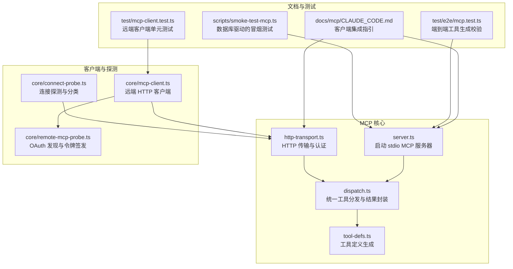
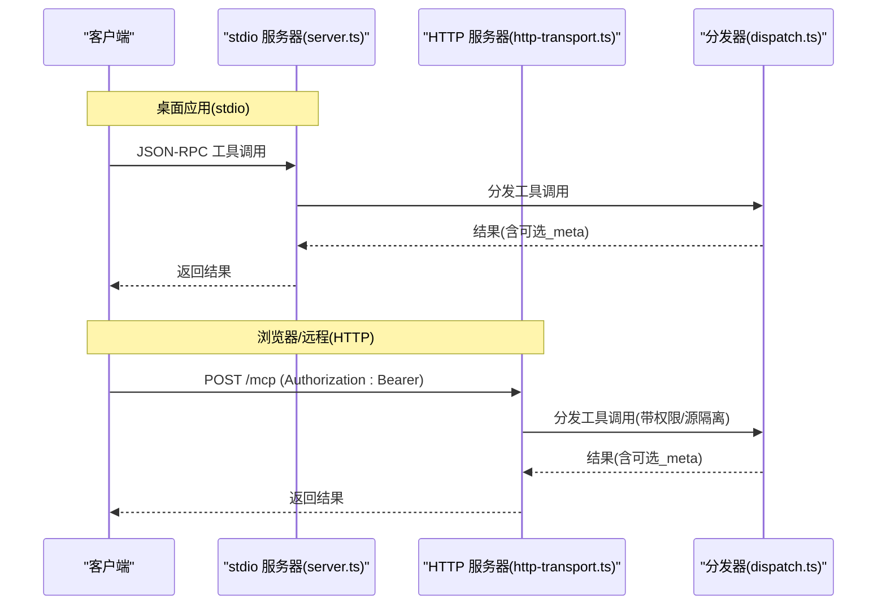
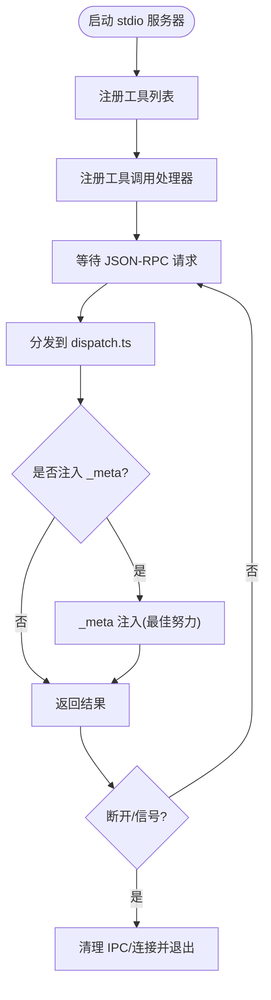
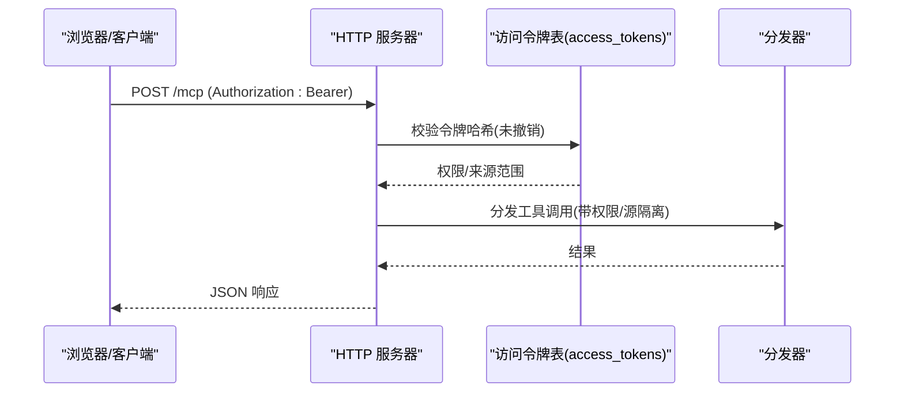
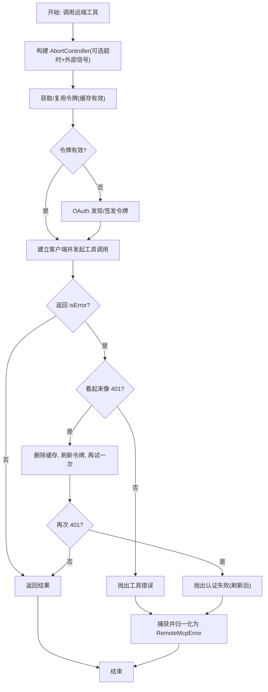
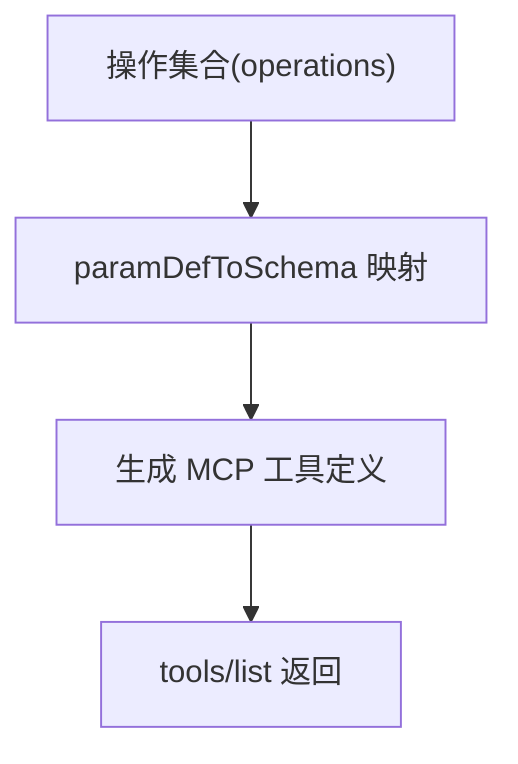
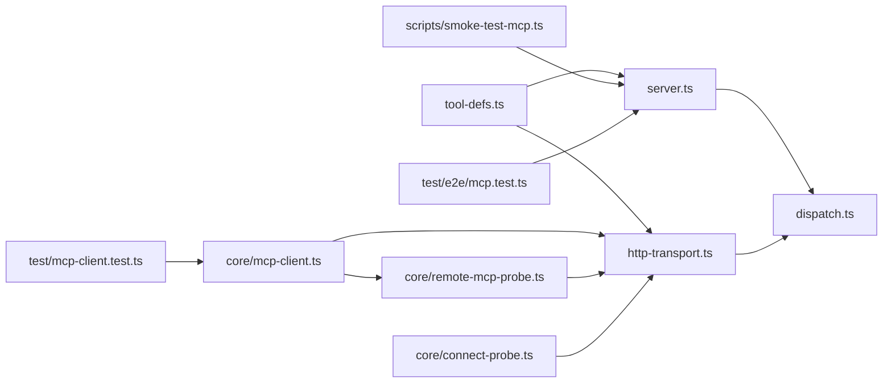

# 客户端集成

<cite>
**本文引用的文件**
- [src/mcp/server.ts](file://src/mcp/server.ts)
- [src/mcp/dispatch.ts](file://src/mcp/dispatch.ts)
- [src/mcp/tool-defs.ts](file://src/mcp/tool-defs.ts)
- [src/mcp/http-transport.ts](file://src/mcp/http-transport.ts)
- [src/core/mcp-client.ts](file://src/core/mcp-client.ts)
- [src/core/remote-mcp-probe.ts](file://src/core/remote-mcp-probe.ts)
- [src/core/connect-probe.ts](file://src/core/connect-probe.ts)
- [scripts/smoke-test-mcp.ts](file://scripts/smoke-test-mcp.ts)
- [docs/mcp/CLAUDE_CODE.md](file://docs/mcp/CLAUDE_CODE.md)
- [test/e2e/mcp.test.ts](file://test/e2e/mcp.test.ts)
- [test/mcp-client.test.ts](file://test/mcp-client.test.ts)
</cite>

## 目录
1. [简介](#简介)
2. [项目结构](#项目结构)
3. [核心组件](#核心组件)
4. [架构总览](#架构总览)
5. [详细组件分析](#详细组件分析)
6. [依赖关系分析](#依赖关系分析)
7. [性能考量](#性能考量)
8. [故障排查指南](#故障排查指南)
9. [结论](#结论)
10. [附录](#附录)

## 简介
本文件面向希望在不同客户端环境（桌面应用、VS Code 扩展、浏览器插件）中集成 MCP 协议的开发者与运维人员。文档系统性阐述了：
- 在桌面应用（本地 stdio）、远程 HTTP 传输以及浏览器插件中的集成方式
- 客户端认证机制与连接管理策略
- 工具发现与调用流程
- 错误处理与重连机制
- 配置项与参数传递
- 调试与监控方法

## 项目结构
围绕 MCP 的核心代码位于 src/mcp 与 src/core 下，分别负责服务端、分发器、HTTP 传输、远端客户端与探测工具；文档与测试覆盖了客户端集成参考与端到端验证。

图示来源
- [src/mcp/server.ts:18-123](file://src/mcp/server.ts#L18-L123)
- [src/mcp/dispatch.ts:222-283](file://src/mcp/dispatch.ts#L222-L283)
- [src/mcp/tool-defs.ts:40-54](file://src/mcp/tool-defs.ts#L40-L54)
- [src/mcp/http-transport.ts:139-420](file://src/mcp/http-transport.ts#L139-L420)
- [src/core/mcp-client.ts:283-374](file://src/core/mcp-client.ts#L283-L374)
- [src/core/remote-mcp-probe.ts:145-182](file://src/core/remote-mcp-probe.ts#L145-L182)
- [src/core/connect-probe.ts:109-121](file://src/core/connect-probe.ts#L109-L121)
- [docs/mcp/CLAUDE_CODE.md:1-91](file://docs/mcp/CLAUDE_CODE.md#L1-L91)
- [test/e2e/mcp.test.ts:16-37](file://test/e2e/mcp.test.ts#L16-L37)
- [scripts/smoke-test-mcp.ts:1-97](file://scripts/smoke-test-mcp.ts#L1-L97)
- [test/mcp-client.test.ts:228-272](file://test/mcp-client.test.ts#L228-L272)

章节来源
- [src/mcp/server.ts:18-123](file://src/mcp/server.ts#L18-L123)
- [src/mcp/http-transport.ts:139-420](file://src/mcp/http-transport.ts#L139-L420)
- [src/core/mcp-client.ts:283-374](file://src/core/mcp-client.ts#L283-L374)
- [docs/mcp/CLAUDE_CODE.md:1-91](file://docs/mcp/CLAUDE_CODE.md#L1-L91)

## 核心组件
- MCP 服务器（stdio）
  - 启动服务、注册工具列表与工具调用处理器，支持本地 IPC 与反射通道。
- 统一分发器
  - 参数校验、构建操作上下文、执行操作、格式化结果、注入元数据。
- 工具定义生成
  - 将操作定义映射为 MCP 工具输入模式，确保多路径一致性。
- HTTP 传输
  - 提供 /mcp 接口，基于 Bearer 令牌认证，内置速率限制、CORS、请求体上限与日志记录。
- 远端 MCP 客户端
  - 基于官方 SDK 的 HTTP 客户端，支持 OAuth client_credentials、令牌缓存、401 自动刷新与错误归一化。
- 连接探测与错误分类
  - 对初始化握手进行探测，区分认证失败、网络不可达、解析错误等类别。

章节来源
- [src/mcp/server.ts:18-123](file://src/mcp/server.ts#L18-L123)
- [src/mcp/dispatch.ts:222-283](file://src/mcp/dispatch.ts#L222-L283)
- [src/mcp/tool-defs.ts:40-54](file://src/mcp/tool-defs.ts#L40-L54)
- [src/mcp/http-transport.ts:139-420](file://src/mcp/http-transport.ts#L139-L420)
- [src/core/mcp-client.ts:283-374](file://src/core/mcp-client.ts#L283-L374)
- [src/core/connect-probe.ts:109-121](file://src/core/connect-probe.ts#L109-L121)

## 架构总览
下图展示从客户端到服务端的关键交互：本地 stdio（桌面应用）与远程 HTTP（浏览器/外部客户端）两条路径，均通过统一分发器执行操作。

图示来源
- [src/mcp/server.ts:36-55](file://src/mcp/server.ts#L36-L55)
- [src/mcp/http-transport.ts:374-396](file://src/mcp/http-transport.ts#L374-L396)
- [src/mcp/dispatch.ts:222-283](file://src/mcp/dispatch.ts#L222-L283)

## 详细组件分析

### 组件A：MCP 服务器（stdio）
- 功能要点
  - 注册工具列表与工具调用处理器，使用统一分发器保证与 HTTP 一致的行为。
  - 支持本地 IPC 反射通道，便于上下文引擎在 PGLite 场景下解析实体指针。
  - 优雅关闭：监听 stdin EOF、传输关闭与信号，清理资源。
- 关键实现路径
  - [startMcpServer:18-123](file://src/mcp/server.ts#L18-L123)
  - [handleToolCall:129-148](file://src/mcp/server.ts#L129-L148)

图示来源
- [src/mcp/server.ts:18-123](file://src/mcp/server.ts#L18-L123)
- [src/mcp/dispatch.ts:255-267](file://src/mcp/dispatch.ts#L255-L267)

章节来源
- [src/mcp/server.ts:18-123](file://src/mcp/server.ts#L18-L123)
- [src/mcp/dispatch.ts:222-283](file://src/mcp/dispatch.ts#L222-L283)

### 组件B：HTTP 传输与认证
- 功能要点
  - /mcp 接口：支持 initialize、tools/list、tools/call。
  - 认证：基于 Bearer 令牌，令牌哈希存储于 access_tokens 表。
  - 安全加固：CORS 白名单、预检安全合并、速率限制（IP 与令牌维度）、请求体上限、最后使用时间去抖更新、请求日志表。
- 关键实现路径
  - [startHttpTransport:139-420](file://src/mcp/http-transport.ts#L139-L420)
  - [validateToken:188-236](file://src/mcp/http-transport.ts#L188-L236)

图示来源
- [src/mcp/http-transport.ts:188-236](file://src/mcp/http-transport.ts#L188-L236)
- [src/mcp/http-transport.ts:374-396](file://src/mcp/http-transport.ts#L374-L396)
- [src/mcp/dispatch.ts:222-283](file://src/mcp/dispatch.ts#L222-L283)

章节来源
- [src/mcp/http-transport.ts:139-420](file://src/mcp/http-transport.ts#L139-L420)

### 组件C：远端 MCP 客户端与认证刷新
- 功能要点
  - 使用官方 SDK 的 HTTP 客户端，支持 OAuth client_credentials 发现与签发、令牌缓存（按 mcp_url）、401 自动刷新一次、错误归一化为 RemoteMcpError。
  - 支持超时与外部中断信号组合，提供工具结果解包辅助函数。
- 关键实现路径
  - [callRemoteTool:283-374](file://src/core/mcp-client.ts#L283-374)
  - [getAccessToken:170-202](file://src/core/mcp-client.ts#L170-202)
  - [toRemoteMcpError:94-120](file://src/core/mcp-client.ts#L94-120)

图示来源
- [src/core/mcp-client.ts:283-374](file://src/core/mcp-client.ts#L283-L374)
- [src/core/mcp-client.ts:94-120](file://src/core/mcp-client.ts#L94-L120)

章节来源
- [src/core/mcp-client.ts:283-374](file://src/core/mcp-client.ts#L283-L374)

### 组件D：工具定义与参数校验
- 功能要点
  - 将操作定义映射为 MCP 工具输入模式，确保 stdio 与 HTTP 两路一致。
  - 统一参数校验逻辑，返回结构化错误。
- 关键实现路径
  - [buildToolDefs:40-54](file://src/mcp/tool-defs.ts#L40-54)
  - [validateParams:170-187](file://src/mcp/dispatch.ts#L170-187)

图示来源
- [src/mcp/tool-defs.ts:30-54](file://src/mcp/tool-defs.ts#L30-L54)
- [src/mcp/dispatch.ts:170-187](file://src/mcp/dispatch.ts#L170-L187)

章节来源
- [src/mcp/tool-defs.ts:40-54](file://src/mcp/tool-defs.ts#L40-L54)
- [src/mcp/dispatch.ts:170-187](file://src/mcp/dispatch.ts#L170-L187)

### 组件E：连接探测与错误分类
- 功能要点
  - 以初始化握手探测远端 MCP，区分认证失败、网络不可达、超时、解析错误等。
  - 提供错误原因提取与文本抽取工具，便于诊断。
- 关键实现路径
  - [probeBrainIdentity:109-121](file://src/core/connect-probe.ts#L109-121)
  - [extractResultText:67-76](file://src/core/connect-probe.ts#L67-76)

章节来源
- [src/core/connect-probe.ts:109-121](file://src/core/connect-probe.ts#L109-L121)
- [src/core/connect-probe.ts:67-76](file://src/core/connect-probe.ts#L67-L76)

## 依赖关系分析
- 服务器与分发器
  - stdio 服务器与 HTTP 服务器共享同一分发器，确保行为一致。
- 工具定义
  - 工具定义生成由工具定义模块提供，被 stdio 与 HTTP 两路复用。
- 客户端与远端
  - 远端客户端依赖 OAuth 发现与令牌签发，再以 HTTP 客户端发起工具调用。
- 探测与测试
  - 连接探测用于安装阶段快速定位问题；端到端测试验证工具生成正确性；冒烟测试验证数据库驱动场景。

图示来源
- [src/mcp/server.ts:18-123](file://src/mcp/server.ts#L18-L123)
- [src/mcp/http-transport.ts:139-420](file://src/mcp/http-transport.ts#L139-L420)
- [src/mcp/dispatch.ts:222-283](file://src/mcp/dispatch.ts#L222-L283)
- [src/mcp/tool-defs.ts:40-54](file://src/mcp/tool-defs.ts#L40-L54)
- [src/core/mcp-client.ts:283-374](file://src/core/mcp-client.ts#L283-L374)
- [src/core/remote-mcp-probe.ts:145-182](file://src/core/remote-mcp-probe.ts#L145-L182)
- [src/core/connect-probe.ts:109-121](file://src/core/connect-probe.ts#L109-L121)
- [scripts/smoke-test-mcp.ts:1-97](file://scripts/smoke-test-mcp.ts#L1-L97)
- [test/e2e/mcp.test.ts:16-37](file://test/e2e/mcp.test.ts#L16-L37)
- [test/mcp-client.test.ts:228-272](file://test/mcp-client.test.ts#L228-L272)

章节来源
- [src/mcp/server.ts:18-123](file://src/mcp/server.ts#L18-L123)
- [src/mcp/http-transport.ts:139-420](file://src/mcp/http-transport.ts#L139-L420)
- [src/core/mcp-client.ts:283-374](file://src/core/mcp-client.ts#L283-L374)

## 性能考量
- 令牌缓存
  - 远端客户端按 mcp_url 缓存令牌，减少频繁签发开销；到期前保守缓冲避免时钟偏差导致的过期。
- 速率限制
  - HTTP 传输在 IP 与令牌两个维度实施速率限制，防止滥用与暴力破解。
- 请求体上限
  - 默认 1 MiB，流式计数，支持无 Content-Length 的分块传输但同样受控。
- 日志与可观测性
  - 访问令牌表与请求日志表记录令牌名称、操作、状态与延迟，便于审计与排障。

章节来源
- [src/core/mcp-client.ts:170-202](file://src/core/mcp-client.ts#L170-L202)
- [src/mcp/http-transport.ts:148-149](file://src/mcp/http-transport.ts#L148-L149)
- [src/mcp/http-transport.ts:92-122](file://src/mcp/http-transport.ts#L92-L122)
- [src/mcp/http-transport.ts:238-242](file://src/mcp/http-transport.ts#L238-L242)

## 故障排查指南
- 常见错误类型与处理
  - 配置缺失：检查 remote_mcp 配置与客户端密钥环境变量。
  - 发现失败：OAuth 发现端点不可达或响应异常，确认 issuer_url 与网络。
  - 认证失败：令牌无效或作用域不足；刷新后仍失败需重新注册客户端。
  - 网络错误：DNS、连接拒绝、TLS、超时等；结合探测结果定位。
  - 工具错误：服务器返回 isError，解析内容提取结构化 code（如 missing_scope）。
  - 解析错误：非 JSON 或内容形状不符合预期。
- 诊断步骤
  - 使用连接探测对远端 URL 与令牌进行初始化握手探测，查看原因分类。
  - 在 HTTP 传输侧检查 /health 与访问令牌表状态。
  - 查看请求日志表与服务器日志，定位具体失败点。
- 重试与恢复
  - 远端客户端在 401 形状错误时自动刷新一次令牌并重试；若仍失败，提示“刷新后认证失败”。

章节来源
- [src/core/mcp-client.ts:56-83](file://src/core/mcp-client.ts#L56-L83)
- [src/core/mcp-client.ts:94-120](file://src/core/mcp-client.ts#L94-L120)
- [src/core/mcp-client.ts:283-374](file://src/core/mcp-client.ts#L283-L374)
- [src/core/connect-probe.ts:109-121](file://src/core/connect-probe.ts#L109-L121)
- [src/mcp/http-transport.ts:257-272](file://src/mcp/http-transport.ts#L257-L272)

## 结论
该 MCP 客户端集成方案通过统一分发器与工具定义，确保本地 stdio 与远程 HTTP 两种路径的一致性；借助远端客户端的令牌缓存与 401 自动刷新、连接探测与错误分类，显著提升了跨客户端部署与运维的稳定性与可诊断性。配合安全加固与可观测性设计，可在多种客户端环境中可靠运行。

## 附录

### 不同客户端环境集成要点
- 桌面应用（本地 stdio）
  - 通过 Claude Code 等客户端直接启动本地进程，无需网络与令牌。
  - 参考：[CLAUDE_CODE.md:8-16](file://docs/mcp/CLAUDE_CODE.md#L8-L16)
- VS Code 扩展
  - 若采用 HTTP 传输，建议使用 OAuth client_credentials 并在扩展内管理令牌缓存与刷新。
- 浏览器插件
  - 通过 HTTP 传输，设置 CORS 白名单与安全头；令牌建议短生命周期并具备明确作用域。

章节来源
- [docs/mcp/CLAUDE_CODE.md:1-91](file://docs/mcp/CLAUDE_CODE.md#L1-L91)

### 客户端认证机制与连接管理
- 本地 stdio
  - 无令牌，直接通过进程管道通信；服务器默认对 takes_holder 进行白名单过滤。
- 远程 HTTP
  - Bearer 令牌认证，令牌哈希存储于 access_tokens 表；支持 CORS 白名单、速率限制、请求体上限与请求日志。
- 远端客户端
  - OAuth client_credentials：发现端点 -> 签发令牌 -> 缓存 -> 调用工具 -> 401 自动刷新 -> 错误归一化。

章节来源
- [src/mcp/server.ts:36-55](file://src/mcp/server.ts#L36-L55)
- [src/mcp/http-transport.ts:188-236](file://src/mcp/http-transport.ts#L188-L236)
- [src/core/mcp-client.ts:170-202](file://src/core/mcp-client.ts#L170-L202)

### 工具发现与调用流程
- 工具发现
  - stdio 与 HTTP 均通过 tools/list 获取工具清单；清单由工具定义模块生成。
- 工具调用
  - 参数先经统一校验，再构建操作上下文，交由操作处理器执行，最终以统一结果封装返回。

章节来源
- [src/mcp/server.ts:27-55](file://src/mcp/server.ts#L27-L55)
- [src/mcp/http-transport.ts:365-396](file://src/mcp/http-transport.ts#L365-L396)
- [src/mcp/tool-defs.ts:40-54](file://src/mcp/tool-defs.ts#L40-L54)
- [src/mcp/dispatch.ts:170-187](file://src/mcp/dispatch.ts#L170-L187)

### 客户端错误处理与重连机制
- 远端客户端
  - 401 形状错误自动刷新一次令牌并重试；其他错误统一归一化为 RemoteMcpError，包含原因与细节。
- 连接探测
  - 初始化握手探测，区分 auth、unreachable、timeout、parse 等原因，便于前端提示用户。

章节来源
- [src/core/mcp-client.ts:283-374](file://src/core/mcp-client.ts#L283-L374)
- [src/core/connect-probe.ts:109-121](file://src/core/connect-probe.ts#L109-L121)

### 客户端配置与参数传递
- 远端客户端
  - 配置项：issuer_url、mcp_url、oauth_client_id、oauth_client_secret；可通过环境变量覆盖密钥。
  - 选项：超时与外部中断信号组合，支持取消与超时提示。
- HTTP 传输
  - 环境变量：CORS 白名单、最大请求体、代理信任、速率限制阈值等。

章节来源
- [src/core/mcp-client.ts:145-164](file://src/core/mcp-client.ts#L145-L164)
- [src/core/mcp-client.ts:235-240](file://src/core/mcp-client.ts#L235-L240)
- [src/mcp/http-transport.ts:46-57](file://src/mcp/http-transport.ts#L46-L57)

### 客户端调试与监控方法
- 冒烟测试
  - 使用数据库驱动的工具调用冒烟测试脚本，验证基本功能。
- 端到端测试
  - 验证工具定义生成逻辑与清单一致性。
- 连接探测
  - 在安装阶段对远端 URL 与令牌进行握手探测，输出原因分类。
- 观测性
  - 访问令牌表与请求日志表记录令牌名称、操作、状态与延迟；健康检查接口返回数据库可达性。

章节来源
- [scripts/smoke-test-mcp.ts:1-97](file://scripts/smoke-test-mcp.ts#L1-L97)
- [test/e2e/mcp.test.ts:16-37](file://test/e2e/mcp.test.ts#L16-L37)
- [src/core/connect-probe.ts:109-121](file://src/core/connect-probe.ts#L109-L121)
- [src/mcp/http-transport.ts:257-272](file://src/mcp/http-transport.ts#L257-L272)