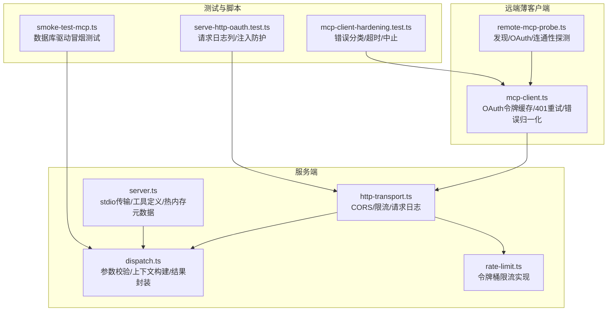
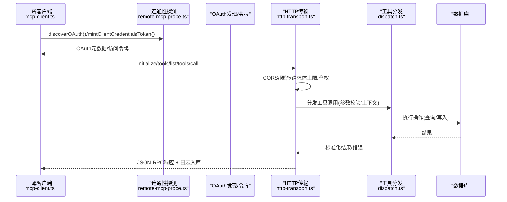
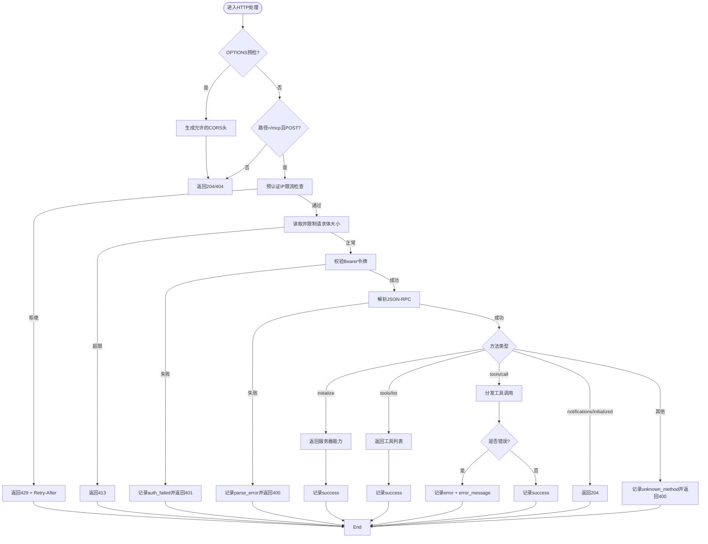
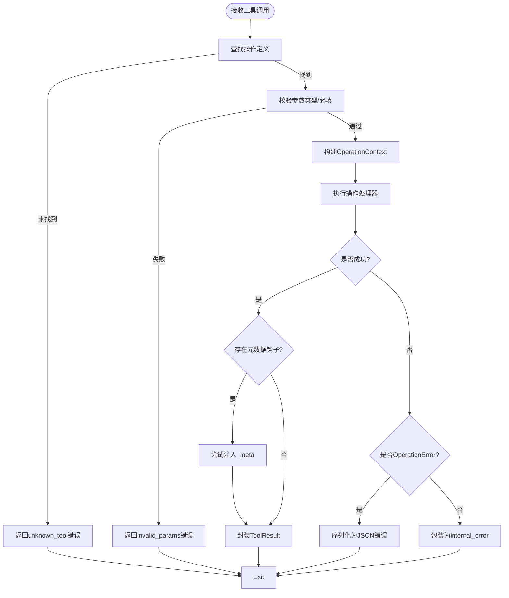
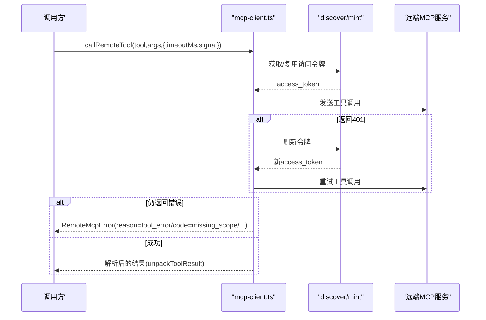
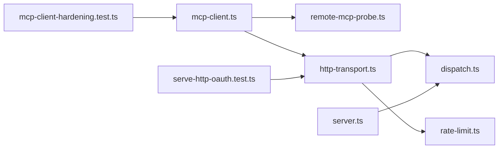

# 监控与调试

<cite>
**本文引用的文件**
- [src/core/remote-mcp-probe.ts](file://src/core/remote-mcp-probe.ts)
- [src/mcp/dispatch.ts](file://src/mcp/dispatch.ts)
- [src/mcp/http-transport.ts](file://src/mcp/http-transport.ts)
- [src/mcp/server.ts](file://src/mcp/server.ts)
- [src/mcp/rate-limit.ts](file://src/mcp/rate-limit.ts)
- [src/core/mcp-client.ts](file://src/core/mcp-client.ts)
- [scripts/smoke-test-mcp.ts](file://scripts/smoke-test-mcp.ts)
- [test/e2e/serve-http-oauth.test.ts](file://test/e2e/serve-http-oauth.test.ts)
- [test/mcp-client-hardening.test.ts](file://test/mcp-client-hardening.test.ts)
</cite>

## 目录
1. [简介](#简介)
2. [项目结构](#项目结构)
3. [核心组件](#核心组件)
4. [架构总览](#架构总览)
5. [详细组件分析](#详细组件分析)
6. [依赖关系分析](#依赖关系分析)
7. [性能考量](#性能考量)
8. [故障排查指南](#故障排查指南)
9. [结论](#结论)
10. [附录](#附录)

## 简介
本指南聚焦于MCP（Model Context Protocol）在本项目的可观测性与调试实践，覆盖以下主题：
- 请求日志结构与内容：参数摘要、响应时间、状态与错误信息
- 监控指标与性能分析方法：延迟分布、吞吐、错误率、速率限制
- 调试工具与技术：日志分析、错误追踪、端到端冒烟测试
- 常见MCP集成问题与性能瓶颈诊断
- 监控仪表板配置与告警建议
- 可观测性最佳实践与系统化故障排除流程

## 项目结构
围绕MCP的监控与调试，相关代码主要分布在如下模块：
- 远端探测与连通性验证：remote-mcp-probe.ts
- 工具分发与参数摘要：dispatch.ts
- HTTP传输层与请求日志：http-transport.ts
- 标准输入传输（本地CLI）：server.ts
- 速率限制：rate-limit.ts
- 远端MCP客户端与错误归一化：mcp-client.ts
- 冒烟测试脚本：scripts/smoke-test-mcp.ts
- E2E测试（含请求日志列持久化与注入防护）：test/e2e/serve-http-oauth.test.ts
- 客户端健壮性测试：test/mcp-client-hardening.test.ts

图表来源
- [src/core/remote-mcp-probe.ts:1-183](file://src/core/remote-mcp-probe.ts#L1-L183)
- [src/core/mcp-client.ts:1-397](file://src/core/mcp-client.ts#L1-L397)
- [src/mcp/http-transport.ts:1-421](file://src/mcp/http-transport.ts#L1-L421)
- [src/mcp/dispatch.ts:1-284](file://src/mcp/dispatch.ts#L1-L284)
- [src/mcp/server.ts:1-149](file://src/mcp/server.ts#L1-L149)
- [src/mcp/rate-limit.ts:1-143](file://src/mcp/rate-limit.ts#L1-L143)
- [scripts/smoke-test-mcp.ts:1-97](file://scripts/smoke-test-mcp.ts#L1-L97)
- [test/e2e/serve-http-oauth.test.ts:538-603](file://test/e2e/serve-http-oauth.test.ts#L538-L603)
- [test/mcp-client-hardening.test.ts:31-152](file://test/mcp-client-hardening.test.ts#L31-L152)

章节来源
- [src/core/remote-mcp-probe.ts:1-183](file://src/core/remote-mcp-probe.ts#L1-L183)
- [src/mcp/http-transport.ts:1-421](file://src/mcp/http-transport.ts#L1-L421)
- [src/mcp/dispatch.ts:1-284](file://src/mcp/dispatch.ts#L1-L284)
- [src/mcp/server.ts:1-149](file://src/mcp/server.ts#L1-L149)
- [src/mcp/rate-limit.ts:1-143](file://src/mcp/rate-limit.ts#L1-L143)
- [src/core/mcp-client.ts:1-397](file://src/core/mcp-client.ts#L1-L397)
- [scripts/smoke-test-mcp.ts:1-97](file://scripts/smoke-test-mcp.ts#L1-L97)
- [test/e2e/serve-http-oauth.test.ts:538-603](file://test/e2e/serve-http-oauth.test.ts#L538-L603)
- [test/mcp-client-hardening.test.ts:31-152](file://test/mcp-client-hardening.test.ts#L31-L152)

## 核心组件
- 远端连通性探测：提供OAuth发现、令牌签发、MCP初始化探测，统一返回原因码，便于UI与CLI渲染一致。
- 工具分发与参数摘要：对工具参数进行类型校验、构建操作上下文、生成隐私安全的参数摘要；对未知工具与无效参数返回标准化错误。
- HTTP传输层：CORS白名单、预检安全、速率限制、请求体上限、请求日志入库（含agent_name、params、error_message），健康检查直连数据库。
- 标准输入传输：本地CLI路径，直接调用工具处理器，支持热内存元数据注入。
- 速率限制：双桶策略（IP前认证、令牌后认证），带LRU与TTL清理，避免内存膨胀。
- 远端MCP客户端：OAuth client_credentials令牌缓存、401自动刷新重试、错误归一化为结构化RemoteMcpError，支持超时与中止信号。

章节来源
- [src/core/remote-mcp-probe.ts:17-182](file://src/core/remote-mcp-probe.ts#L17-L182)
- [src/mcp/dispatch.ts:100-283](file://src/mcp/dispatch.ts#L100-L283)
- [src/mcp/http-transport.ts:139-421](file://src/mcp/http-transport.ts#L139-L421)
- [src/mcp/server.ts:18-149](file://src/mcp/server.ts#L18-L149)
- [src/mcp/rate-limit.ts:46-143](file://src/mcp/rate-limit.ts#L46-L143)
- [src/core/mcp-client.ts:26-397](file://src/core/mcp-client.ts#L26-L397)

## 架构总览
下图展示从薄客户端到服务端的典型MCP调用链路，以及关键可观测点（日志、限流、错误归一化）：

图表来源
- [src/core/mcp-client.ts:170-374](file://src/core/mcp-client.ts#L170-L374)
- [src/core/remote-mcp-probe.ts:36-126](file://src/core/remote-mcp-probe.ts#L36-L126)
- [src/mcp/http-transport.ts:238-403](file://src/mcp/http-transport.ts#L238-L403)
- [src/mcp/dispatch.ts:222-283](file://src/mcp/dispatch.ts#L222-L283)

## 详细组件分析

### 组件A：HTTP传输层与请求日志
- 关键职责
  - CORS默认拒绝，通过环境变量配置白名单
  - 预认证IP限流与后认证令牌限流，防止暴力破解与滥用
  - 请求体大小上限，避免内存压力
  - 对每个请求写入mcp_request_log：token_name、operation、latency_ms、status
  - 健康检查直连数据库，确保DB可用性
- 日志字段
  - agent_name：来自oauth_clients.client_name（或回填）
  - params：当启用全量参数记录时写入原始JSON（默认使用参数摘要以保护隐私）
  - error_message：失败场景下的错误文本
- 安全加固
  - SQL注入防护：使用参数化查询，拒绝恶意注入载荷
  - 令牌最后使用时间去抖更新，降低写放大

图表来源
- [src/mcp/http-transport.ts:238-403](file://src/mcp/http-transport.ts#L238-L403)
- [src/mcp/dispatch.ts:222-283](file://src/mcp/dispatch.ts#L222-L283)
- [test/e2e/serve-http-oauth.test.ts:538-603](file://test/e2e/serve-http-oauth.test.ts#L538-L603)

章节来源
- [src/mcp/http-transport.ts:139-421](file://src/mcp/http-transport.ts#L139-L421)
- [test/e2e/serve-http-oauth.test.ts:538-603](file://test/e2e/serve-http-oauth.test.ts#L538-L603)

### 组件B：工具分发与参数摘要
- 参数摘要策略
  - 仅记录声明参数键集合、未知键计数、近似字节数（按KB上取整，避免侧信道）
  - 对数组/对象/标量分别统计形状与长度
  - 默认不记录原始值，除非显式开启“全量参数”模式
- 错误处理
  - 未知工具：返回标准化错误内容
  - 参数校验失败：返回标准化错误内容
  - 操作异常：包装为OperationError并序列化
  - 其他异常：包装为内部错误
- 热内存元数据注入
  - 成功时可选注入_meta.brain_hot_memory，失败时降级为无_meta

图表来源
- [src/mcp/dispatch.ts:100-283](file://src/mcp/dispatch.ts#L100-L283)

章节来源
- [src/mcp/dispatch.ts:100-283](file://src/mcp/dispatch.ts#L100-L283)

### 组件C：远端MCP客户端与错误归一化
- 功能要点
  - OAuth discovery与client_credentials令牌缓存（带过期安全边界）
  - 401自动刷新一次并重试
  - 将任意抛出物归一化为RemoteMcpError，包含reason与detail（含status、kind、code等）
  - 支持超时与外部AbortSignal组合
  - 提供unpackToolResult解析标准内容结构
- 错误原因码
  - config、discovery、auth、auth_after_refresh、network、tool_error、parse
- 网络错误细粒度
  - kind：timeout、aborted、unreachable
- 工具错误代码提取
  - 优先解析JSON错误包中的code，否则基于消息正则匹配（如missing_scope）

图表来源
- [src/core/mcp-client.ts:283-397](file://src/core/mcp-client.ts#L283-L397)
- [test/mcp-client-hardening.test.ts:31-152](file://test/mcp-client-hardening.test.ts#L31-L152)

章节来源
- [src/core/mcp-client.ts:26-397](file://src/core/mcp-client.ts#L26-L397)
- [test/mcp-client-hardening.test.ts:31-152](file://test/mcp-client-hardening.test.ts#L31-L152)

### 组件D：速率限制
- 双桶策略
  - IP桶：预认证阶段限制暴力尝试
  - 令牌桶：认证后按令牌维度限制
- LRU与TTL
  - 限制不同键数量上限，定期清理过期条目
- 环境变量
  - GBRAIN_HTTP_RATE_LIMIT_IP、GBRAIN_HTTP_RATE_LIMIT_TOKEN、GBRAIN_HTTP_RATE_LIMIT_LRU

章节来源
- [src/mcp/rate-limit.ts:46-143](file://src/mcp/rate-limit.ts#L46-L143)
- [src/mcp/http-transport.ts:139-421](file://src/mcp/http-transport.ts#L139-L421)

### 组件E：冒烟测试脚本
- 目的：验证MCP工具调用在真实数据库上的基本功能
- 覆盖：统计、页面增删改查、标签、搜索、干运行等
- 输出：通过/失败计数与最终状态

章节来源
- [scripts/smoke-test-mcp.ts:1-97](file://scripts/smoke-test-mcp.ts#L1-L97)

## 依赖关系分析
- thin-client模式
  - mcp-client.ts依赖remote-mcp-probe.ts进行OAuth发现与令牌签发
  - mcp-client.ts通过StreamableHTTPClientTransport连接HTTP传输层
- 服务端
  - http-transport.ts依赖dispatch.ts进行参数校验与工具分发
  - server.ts同样依赖dispatch.ts，但走stdio传输
  - rate-limit.ts被http-transport.ts消费
- 测试
  - serve-http-oauth.test.ts验证mcp_request_log新增列的持久化与注入防护
  - mcp-client-hardening.test.ts验证错误归一化与网络错误细分

图表来源
- [src/core/mcp-client.ts:21-397](file://src/core/mcp-client.ts#L21-L397)
- [src/core/remote-mcp-probe.ts:24-126](file://src/core/remote-mcp-probe.ts#L24-L126)
- [src/mcp/http-transport.ts:34-421](file://src/mcp/http-transport.ts#L34-L421)
- [src/mcp/dispatch.ts:10-284](file://src/mcp/dispatch.ts#L10-L284)
- [src/mcp/server.ts:8-149](file://src/mcp/server.ts#L8-L149)
- [src/mcp/rate-limit.ts:46-143](file://src/mcp/rate-limit.ts#L46-L143)
- [test/e2e/serve-http-oauth.test.ts:538-603](file://test/e2e/serve-http-oauth.test.ts#L538-L603)
- [test/mcp-client-hardening.test.ts:31-152](file://test/mcp-client-hardening.test.ts#L31-L152)

章节来源
- [src/core/mcp-client.ts:21-397](file://src/core/mcp-client.ts#L21-L397)
- [src/mcp/http-transport.ts:34-421](file://src/mcp/http-transport.ts#L34-L421)
- [src/mcp/dispatch.ts:10-284](file://src/mcp/dispatch.ts#L10-L284)
- [src/mcp/server.ts:8-149](file://src/mcp/server.ts#L8-L149)
- [src/mcp/rate-limit.ts:46-143](file://src/mcp/rate-limit.ts#L46-L143)
- [test/e2e/serve-http-oauth.test.ts:538-603](file://test/e2e/serve-http-oauth.test.ts#L538-L603)
- [test/mcp-client-hardening.test.ts:31-152](file://test/mcp-client-hardening.test.ts#L31-L152)

## 性能考量
- 延迟与吞吐
  - 使用latency_ms记录每请求耗时，可用于P50/P95/P99计算
  - 通过rate-limit.ts的双桶策略控制并发与突发，避免DB过载
- 数据库健康
  - /health直连DB检查，确保服务端可用性
- 参数摘要与隐私
  - 默认不记录原始参数值，仅记录形状与近似大小，降低侧信道风险
- 速率限制配置
  - 通过环境变量调节IP与令牌桶容量、窗口与LRU上限

章节来源
- [src/mcp/http-transport.ts:257-272](file://src/mcp/http-transport.ts#L257-L272)
- [src/mcp/rate-limit.ts:135-143](file://src/mcp/rate-limit.ts#L135-L143)
- [src/mcp/dispatch.ts:128-168](file://src/mcp/dispatch.ts#L128-L168)

## 故障排查指南
- 快速自检
  - thin-client模式：使用remote-mcp-probe.ts进行OAuth发现与MCP初始化探测，确认URL可达、令牌有效
  - 服务端：访问/health确认DB连通
- 日志定位
  - 查看mcp_request_log：operation、status、latency_ms、agent_name、error_message
  - 若启用全量参数记录，可核对params字段（默认不记录）
- 常见问题与对策
  - 认证失败（401/403）
    - 检查client_id/client_secret与scope
    - 若为refresh后仍失败，考虑重新注册客户端
  - 网络错误（超时/中止/不可达）
    - 检查超时设置与网络连通性；区分AbortError与DNS/TLS错误
  - 工具错误（missing_scope等）
    - 根据错误码调整scope或权限
  - 速率限制（429）
    - 调整环境变量或等待冷却
- 冒烟测试
  - 使用scripts/smoke-test-mcp.ts快速验证核心工具链路

章节来源
- [src/core/remote-mcp-probe.ts:36-182](file://src/core/remote-mcp-probe.ts#L36-L182)
- [src/mcp/http-transport.ts:257-403](file://src/mcp/http-transport.ts#L257-L403)
- [src/core/mcp-client.ts:94-143](file://src/core/mcp-client.ts#L94-L143)
- [test/mcp-client-hardening.test.ts:31-152](file://test/mcp-client-hardening.test.ts#L31-L152)
- [scripts/smoke-test-mcp.ts:18-97](file://scripts/smoke-test-mcp.ts#L18-L97)

## 结论
本项目的MCP可观测性体系通过“参数摘要+标准化错误+请求日志+速率限制+健康检查”形成闭环。结合E2E测试与冒烟脚本，可在开发与生产环境中高效定位问题、评估性能并持续改进。

## 附录

### 请求日志字段与含义
- 字段
  - token_name：令牌名称（用于审计与聚合）
  - operation：JSON-RPC方法名或工具名（如tools/list、tools/call:具体工具）
  - status：success/error/unknown_method/body_too_large/auth_failed/parse_error/rate_limited
  - latency_ms：请求耗时（毫秒）
  - agent_name：来自oauth_clients.client_name（或回填）
  - params：默认不记录原始值；启用全量参数记录时写入
  - error_message：失败场景的错误文本（如unknown_operation等）

章节来源
- [src/mcp/http-transport.ts:238-403](file://src/mcp/http-transport.ts#L238-L403)
- [test/e2e/serve-http-oauth.test.ts:538-603](file://test/e2e/serve-http-oauth.test.ts#L538-L603)

### 监控仪表板与告警建议
- 指标建议
  - 吞吐：QPS（按operation分组）、按token_name分组
  - 延迟：P50/P95/P99（按operation/token_name分组）
  - 错误率：按status分类（auth_failed/parse_error/unknown_method/error）
  - 速率限制：429占比与Retry-After分布
  - 数据库健康：/health成功率与错误类型
- 告警建议
  - 延迟P99超过阈值（如5s）持续N分钟
  - 错误率突增（如unknown_tool/error占比>5%）
  - 速率限制触发率>1%
  - /health连续失败或响应时间异常

[本节为通用指导，无需特定文件来源]