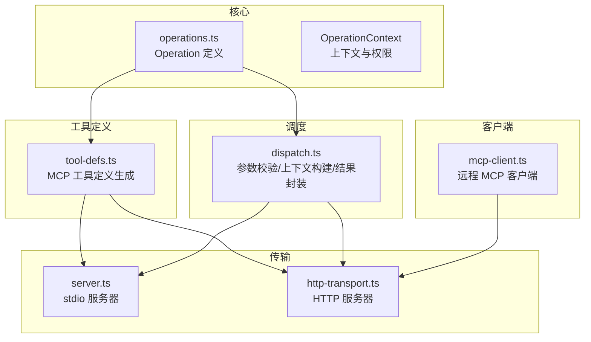
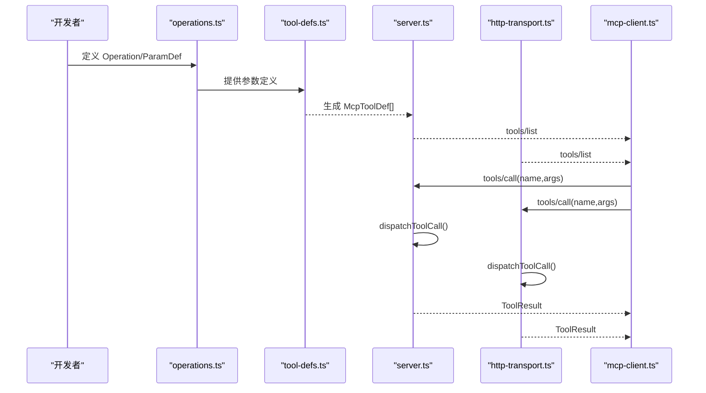
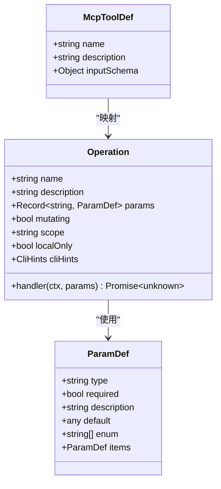
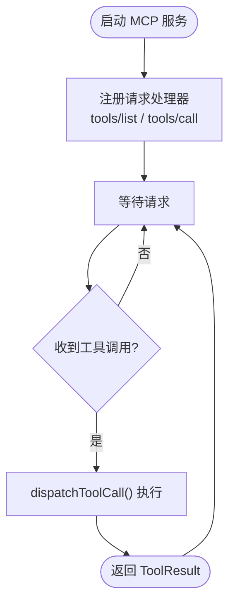
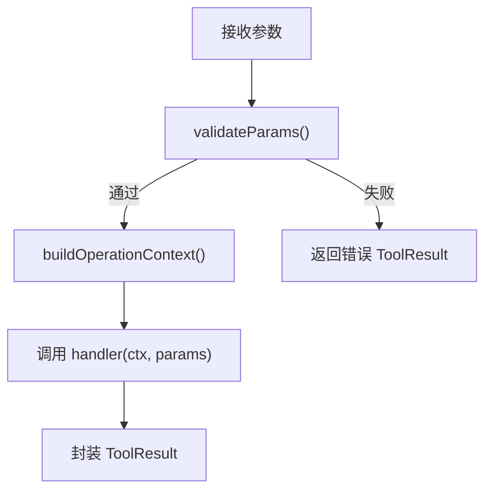
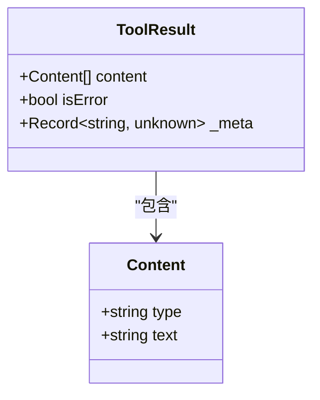
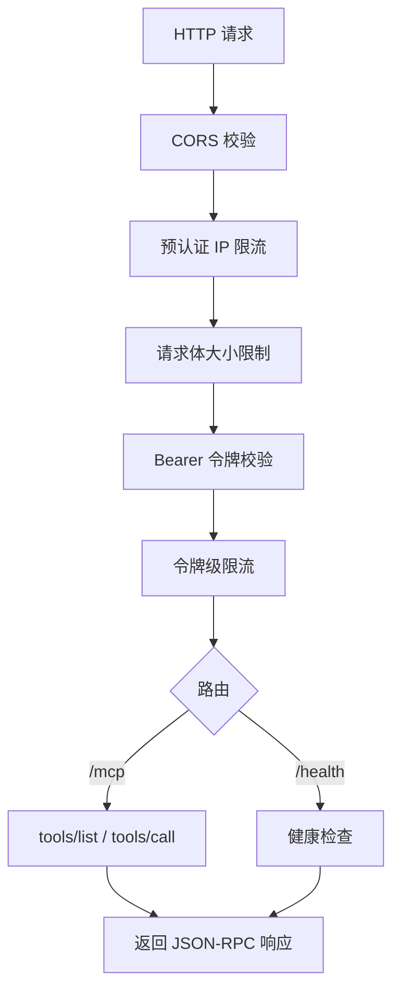
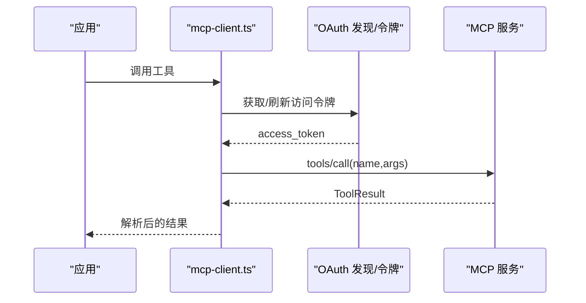
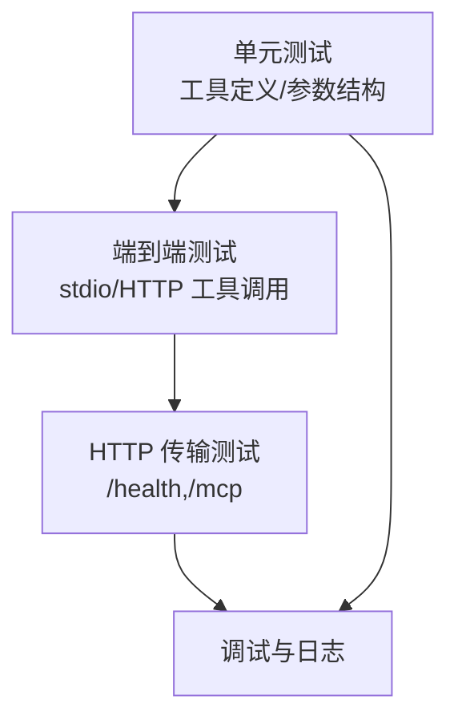
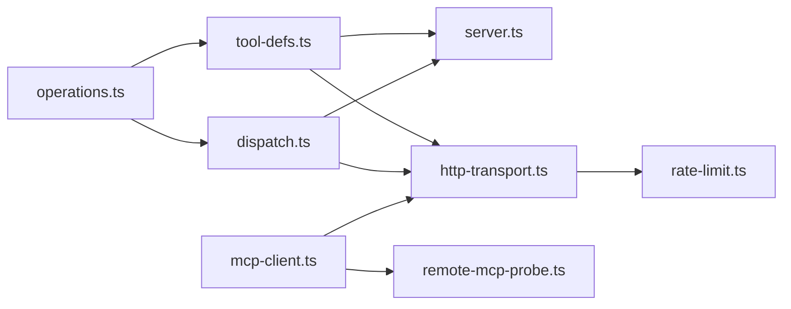

# 自定义工具开发

<cite>
**本文档引用的文件**
- [src/mcp/server.ts](file://src/mcp/server.ts)
- [src/mcp/tool-defs.ts](file://src/mcp/tool-defs.ts)
- [src/mcp/dispatch.ts](file://src/mcp/dispatch.ts)
- [src/mcp/http-transport.ts](file://src/mcp/http-transport.ts)
- [src/core/operations.ts](file://src/core/operations.ts)
- [src/mcp/rate-limit.ts](file://src/mcp/rate-limit.ts)
- [src/core/mcp-client.ts](file://src/core/mcp-client.ts)
- [test/mcp-tool-defs.test.ts](file://test/mcp-tool-defs.test.ts)
- [test/mcp.test.ts](file://test/mcp.test.ts)
- [test/e2e/http-transport.test.ts](file://test/e2e/http-transport.test.ts)
- [test/mcp-client.test.ts](file://test/mcp-client.test.ts)
- [src/core/remote-mcp-probe.ts](file://src/core/remote-mcp-probe.ts)
</cite>

## 目录
1. [简介](#简介)
2. [项目结构](#项目结构)
3. [核心组件](#核心组件)
4. [架构总览](#架构总览)
5. [详细组件分析](#详细组件分析)
6. [依赖关系分析](#依赖关系分析)
7. [性能考量](#性能考量)
8. [故障排查指南](#故障排查指南)
9. [结论](#结论)
10. [附录](#附录)

## 简介
本指南面向希望在 gbrain 平台上创建自定义 MCP 工具的开发者。文档从工具定义、参数规范、返回值结构、注册与生命周期、最佳实践、错误处理与异常管理、测试策略与调试方法、与操作系统集成以及性能优化与安全考虑等维度，提供系统化说明，并结合仓库中的实际实现进行深入解析。

## 项目结构
围绕 MCP 工具开发的核心模块分布如下：
- 核心操作定义：统一的 Operation 接口与参数规范，位于 core 层
- 工具定义生成：将 Operation 映射为 MCP 工具定义
- 调度分发：统一处理 stdio 与 HTTP 两种传输的工具调用
- 传输层：stdio 与 HTTP 两种 MCP 服务端实现
- 客户端：远程 MCP 客户端与认证缓存
- 测试：覆盖工具定义生成、协议交互、速率限制、客户端行为等

**图表来源**
- [src/core/operations.ts](file://src/core/operations.ts)
- [src/mcp/tool-defs.ts](file://src/mcp/tool-defs.ts)
- [src/mcp/dispatch.ts](file://src/mcp/dispatch.ts)
- [src/mcp/server.ts](file://src/mcp/server.ts)
- [src/mcp/http-transport.ts](file://src/mcp/http-transport.ts)
- [src/core/mcp-client.ts](file://src/core/mcp-client.ts)

**章节来源**
- [src/mcp/server.ts](file://src/mcp/server.ts)
- [src/mcp/tool-defs.ts](file://src/mcp/tool-defs.ts)
- [src/mcp/dispatch.ts](file://src/mcp/dispatch.ts)
- [src/mcp/http-transport.ts](file://src/mcp/http-transport.ts)
- [src/core/operations.ts](file://src/core/operations.ts)
- [src/core/mcp-client.ts](file://src/core/mcp-client.ts)

## 核心组件
- Operation 与 ParamDef：定义工具名称、描述、参数类型、是否必填、枚举值、默认值、数组项结构等
- McpToolDef：将 Operation 映射为 MCP 工具定义（含 inputSchema）
- ToolResult：统一的工具调用结果封装（content、isError、元数据 _meta）
- DispatchOpts：调度选项（remote、takesHoldersAllowList、sourceId、metaHook、auth）
- 传输层：stdio 与 HTTP 两种 MCP 服务端；HTTP 还包含速率限制、CORS、令牌校验等安全机制
- 客户端：远程 MCP 客户端，支持 OAuth 发现、令牌缓存、401 刷新重试

**章节来源**
- [src/core/operations.ts](file://src/core/operations.ts)
- [src/mcp/tool-defs.ts](file://src/mcp/tool-defs.ts)
- [src/mcp/dispatch.ts](file://src/mcp/dispatch.ts)
- [src/mcp/server.ts](file://src/mcp/server.ts)
- [src/mcp/http-transport.ts](file://src/mcp/http-transport.ts)
- [src/core/mcp-client.ts](file://src/core/mcp-client.ts)

## 架构总览
MCP 工具的生命周期从“定义”到“注册”再到“调用”，贯穿参数校验、上下文构建、执行与结果封装、安全过滤与日志记录。

**图表来源**
- [src/core/operations.ts](file://src/core/operations.ts)
- [src/mcp/tool-defs.ts](file://src/mcp/tool-defs.ts)
- [src/mcp/server.ts](file://src/mcp/server.ts)
- [src/mcp/http-transport.ts](file://src/mcp/http-transport.ts)
- [src/core/mcp-client.ts](file://src/core/mcp-client.ts)

## 详细组件分析

### 工具定义与参数规范
- Operation 接口包含 name、description、params（ParamDef 映射）、handler、scope、localOnly、cliHints 等字段
- ParamDef 支持基础类型（string/number/boolean/object/array）与嵌套数组 items 的递归定义
- McpToolDef 将每个 Operation 映射为 MCP 工具定义，inputSchema 采用 JSON Schema 结构，properties 与 required 数组由 ParamDef 生成

**图表来源**
- [src/core/operations.ts](file://src/core/operations.ts)
- [src/mcp/tool-defs.ts](file://src/mcp/tool-defs.ts)

**章节来源**
- [src/core/operations.ts](file://src/core/operations.ts)
- [src/mcp/tool-defs.ts](file://src/mcp/tool-defs.ts)
- [test/mcp-tool-defs.test.ts](file://test/mcp-tool-defs.test.ts)

### 工具注册与生命周期
- stdio 服务器通过 Server 注册 tools/list 与 tools/call 请求处理器，启动时即完成工具清单注册
- HTTP 服务器在路由中暴露 /mcp/tools/list 与 /mcp/tools/call，并在握手阶段返回能力声明
- 生命周期管理：stdio 服务器监听 stdin 关闭与信号，优雅退出并清理 IPC 资源

**图表来源**
- [src/mcp/server.ts](file://src/mcp/server.ts)
- [src/mcp/http-transport.ts](file://src/mcp/http-transport.ts)
- [src/mcp/dispatch.ts](file://src/mcp/dispatch.ts)

**章节来源**
- [src/mcp/server.ts](file://src/mcp/server.ts)
- [src/mcp/http-transport.ts](file://src/mcp/http-transport.ts)

### 参数校验与上下文构建
- validateParams 对必填参数与类型进行严格校验，返回 null 或错误信息
- buildOperationContext 构建 OperationContext，注入 engine、config、logger、dryRun、remote、takesHoldersAllowList、sourceId、auth 等
- summarizeMcpParams 用于生成隐私安全的参数摘要，避免敏感信息写入日志

**图表来源**
- [src/mcp/dispatch.ts](file://src/mcp/dispatch.ts)
- [src/core/operations.ts](file://src/core/operations.ts)

**章节来源**
- [src/mcp/dispatch.ts](file://src/mcp/dispatch.ts)
- [src/core/operations.ts](file://src/core/operations.ts)

### 返回值结构与元数据
- ToolResult 固定包含 content（文本数组）、isError 标记，以及可选的 _meta 元数据
- _meta 由 metaHook 在成功后注入，当前用于向客户端提供“热记忆”等上下文信息
- 错误路径统一包装为 JSON 可解析的错误对象，便于客户端解析

**图表来源**
- [src/mcp/dispatch.ts](file://src/mcp/dispatch.ts)

**章节来源**
- [src/mcp/dispatch.ts](file://src/mcp/dispatch.ts)

### HTTP 传输与安全机制
- 认证：Bearer 令牌校验，令牌哈希存储于数据库，支持 per-IP 与 per-token 两阶段速率限制
- CORS：默认拒绝，需通过环境变量配置允许列表
- 速率限制：基于令牌桶与 LRU，防止滥用与资源耗尽
- 日志：每条请求记录 token_name、operation、status、latency

**图表来源**
- [src/mcp/http-transport.ts](file://src/mcp/http-transport.ts)
- [src/mcp/rate-limit.ts](file://src/mcp/rate-limit.ts)

**章节来源**
- [src/mcp/http-transport.ts](file://src/mcp/http-transport.ts)
- [src/mcp/rate-limit.ts](file://src/mcp/rate-limit.ts)

### 远程 MCP 客户端与 OAuth 集成
- 客户端负责 OAuth 发现、令牌获取与缓存、工具调用与错误分类（网络、认证、工具错误等）
- 支持一次性 401 刷新重试，确保在令牌过期场景下的健壮性
- 提供工具结果解包工具，确保返回内容符合预期格式

**图表来源**
- [src/core/mcp-client.ts](file://src/core/mcp-client.ts)
- [test/mcp-client.test.ts](file://test/mcp-client.test.ts)

**章节来源**
- [src/core/mcp-client.ts](file://src/core/mcp-client.ts)
- [test/mcp-client.test.ts](file://test/mcp-client.test.ts)

### 工具实现最佳实践
- 使用 Contract-first 设计：先定义 Operation/ParamDef，再实现 handler，保证接口稳定
- 参数设计：优先使用 required、enum、default、items 等字段明确约束，提升工具可用性与安全性
- 权限与隔离：利用 OperationContext 的 remote、takesHoldersAllowList、sourceId 实现最小权限与多源隔离
- 错误处理：抛出 OperationError 或返回标准化错误对象，避免泄露内部细节
- 元数据：在成功路径注入 _meta，增强客户端体验但不影响核心内容

**章节来源**
- [src/core/operations.ts](file://src/core/operations.ts)
- [src/mcp/dispatch.ts](file://src/mcp/dispatch.ts)

### 错误处理与异常管理
- 已知工具名缺失：返回 JSON 可解析的错误对象，标记为 isError
- 参数校验失败：返回 JSON 可解析的错误对象，标记为 isError
- 未知异常：捕获非 OperationError 异常，包装为统一错误对象
- 客户端侧：RemoteMcpError 按原因分类（config、auth、network、tool_error、parse），便于定位问题

**章节来源**
- [src/mcp/dispatch.ts](file://src/mcp/dispatch.ts)
- [test/mcp-client.test.ts](file://test/mcp-client.test.ts)

### 测试策略与调试方法
- 单元测试：验证工具定义生成一致性、参数 schema 结构完整性、数组 items 类型约束
- 端到端测试：验证 stdio 与 HTTP 传输的工具清单与调用流程
- HTTP 传输测试：验证 /health、/mcp/tools/list、/mcp/tools/call 的正确性
- 客户端测试：覆盖 OAuth 发现、令牌缓存、401 刷新重试、错误分类与结果解包

**图表来源**
- [test/mcp-tool-defs.test.ts](file://test/mcp-tool-defs.test.ts)
- [test/mcp.test.ts](file://test/mcp.test.ts)
- [test/e2e/http-transport.test.ts](file://test/e2e/http-transport.test.ts)
- [test/mcp-client.test.ts](file://test/mcp-client.test.ts)

**章节来源**
- [test/mcp-tool-defs.test.ts](file://test/mcp-tool-defs.test.ts)
- [test/mcp.test.ts](file://test/mcp.test.ts)
- [test/e2e/http-transport.test.ts](file://test/e2e/http-transport.test.ts)
- [test/mcp-client.test.ts](file://test/mcp-client.test.ts)

### 与操作系统集成
- stdio 传输：通过进程标准输入输出与 MCP 客户端通信，适合本地可信环境
- HTTP 传输：通过本地或网络端口提供 MCP 服务，适合跨进程/跨主机场景
- 进程生命周期：stdio 服务器监听 stdin EOF 与信号，确保干净退出并释放 IPC 资源

**章节来源**
- [src/mcp/server.ts](file://src/mcp/server.ts)
- [src/mcp/http-transport.ts](file://src/mcp/http-transport.ts)

## 依赖关系分析
- operations.ts 是所有工具定义的单一真相来源，被 tool-defs.ts 与 HTTP/stdio 服务器共同消费
- dispatch.ts 作为共享分发器，确保两种传输的一致性与安全性
- http-transport.ts 依赖 rate-limit.ts 实现速率限制
- mcp-client.ts 依赖 core 层的配置与远程探测

**图表来源**
- [src/core/operations.ts](file://src/core/operations.ts)
- [src/mcp/tool-defs.ts](file://src/mcp/tool-defs.ts)
- [src/mcp/dispatch.ts](file://src/mcp/dispatch.ts)
- [src/mcp/server.ts](file://src/mcp/server.ts)
- [src/mcp/http-transport.ts](file://src/mcp/http-transport.ts)
- [src/mcp/rate-limit.ts](file://src/mcp/rate-limit.ts)
- [src/core/mcp-client.ts](file://src/core/mcp-client.ts)
- [src/core/remote-mcp-probe.ts](file://src/core/remote-mcp-probe.ts)

**章节来源**
- [src/core/operations.ts](file://src/core/operations.ts)
- [src/mcp/tool-defs.ts](file://src/mcp/tool-defs.ts)
- [src/mcp/dispatch.ts](file://src/mcp/dispatch.ts)
- [src/mcp/server.ts](file://src/mcp/server.ts)
- [src/mcp/http-transport.ts](file://src/mcp/http-transport.ts)
- [src/mcp/rate-limit.ts](file://src/mcp/rate-limit.ts)
- [src/core/mcp-client.ts](file://src/core/mcp-client.ts)
- [src/core/remote-mcp-probe.ts](file://src/core/remote-mcp-probe.ts)

## 性能考量
- 速率限制：双层限流（IP 与令牌）降低恶意请求与资源争用风险
- 请求体上限：防止超大负载导致内存压力
- 日志与审计：仅记录必要信息，避免敏感数据泄露
- 元数据注入：_meta 采用最佳努力策略，异常不阻断主流程

**章节来源**
- [src/mcp/http-transport.ts](file://src/mcp/http-transport.ts)
- [src/mcp/rate-limit.ts](file://src/mcp/rate-limit.ts)
- [src/mcp/dispatch.ts](file://src/mcp/dispatch.ts)

## 故障排查指南
- 工具清单为空或不完整：检查 operations.ts 中的工具定义与 tool-defs.ts 的映射逻辑
- 参数校验失败：确认客户端传参类型与必填字段，参考 validateParams 的错误消息
- HTTP 401/403：检查 Bearer 令牌有效性与权限范围
- 429 速率限制：调整环境变量或等待冷却时间
- 客户端错误分类：根据 RemoteMcpError.reason 快速定位（config/auth/network/tool_error/parse）

**章节来源**
- [test/mcp-tool-defs.test.ts](file://test/mcp-tool-defs.test.ts)
- [test/mcp.test.ts](file://test/mcp.test.ts)
- [test/e2e/http-transport.test.ts](file://test/e2e/http-transport.test.ts)
- [test/mcp-client.test.ts](file://test/mcp-client.test.ts)
- [src/mcp/http-transport.ts](file://src/mcp/http-transport.ts)
- [src/mcp/dispatch.ts](file://src/mcp/dispatch.ts)

## 结论
通过统一的 Operation/ParamDef 合约、稳定的工具定义生成、严格的参数校验与上下文构建、以及完备的安全与测试体系，gbrain 为自定义 MCP 工具提供了清晰、可扩展且安全的开发框架。遵循本文档的最佳实践，可在保证安全与一致性的前提下快速迭代工具能力。

## 附录
- 开发步骤建议
  1) 在 operations.ts 中新增 Operation/ParamDef 定义
  2) 使用 tool-defs.ts 生成工具定义，确保 inputSchema 符合 JSON Schema 规范
  3) 实现 handler，严格使用 OperationContext 的 remote、sourceId、takesHoldersAllowList 等字段
  4) 编写单元与端到端测试，覆盖工具清单与调用流程
  5) 在 HTTP 与 stdio 两种传输上分别验证功能与安全策略
  6) 使用客户端测试覆盖 OAuth、令牌缓存与错误分类场景

**章节来源**
- [src/core/operations.ts](file://src/core/operations.ts)
- [src/mcp/tool-defs.ts](file://src/mcp/tool-defs.ts)
- [src/mcp/dispatch.ts](file://src/mcp/dispatch.ts)
- [src/mcp/server.ts](file://src/mcp/server.ts)
- [src/mcp/http-transport.ts](file://src/mcp/http-transport.ts)
- [test/mcp-tool-defs.test.ts](file://test/mcp-tool-defs.test.ts)
- [test/mcp.test.ts](file://test/mcp.test.ts)
- [test/e2e/http-transport.test.ts](file://test/e2e/http-transport.test.ts)
- [test/mcp-client.test.ts](file://test/mcp-client.test.ts)