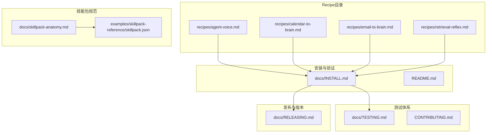
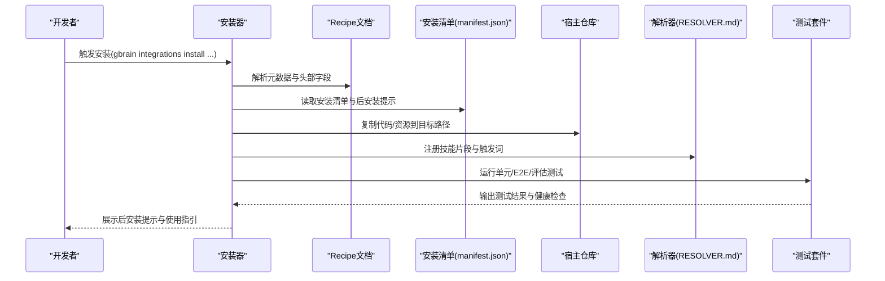
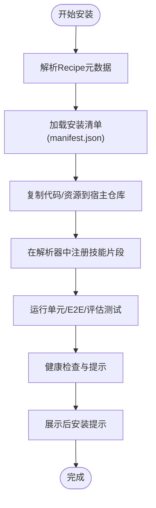
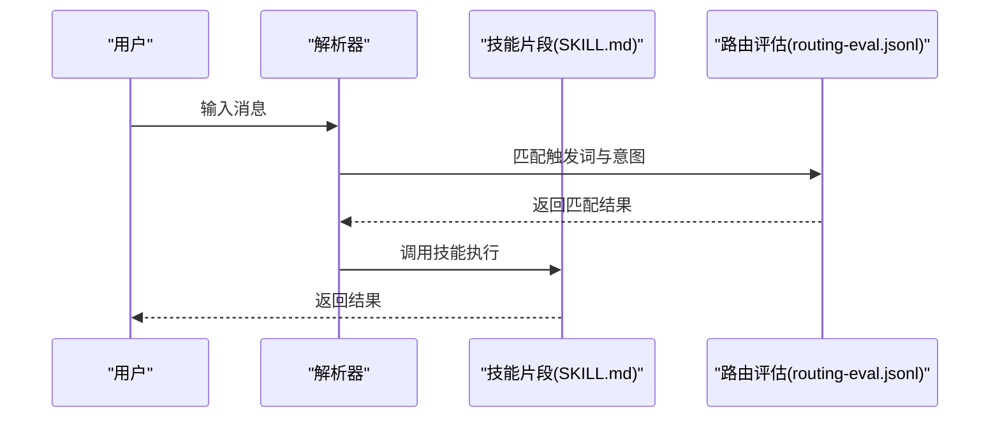
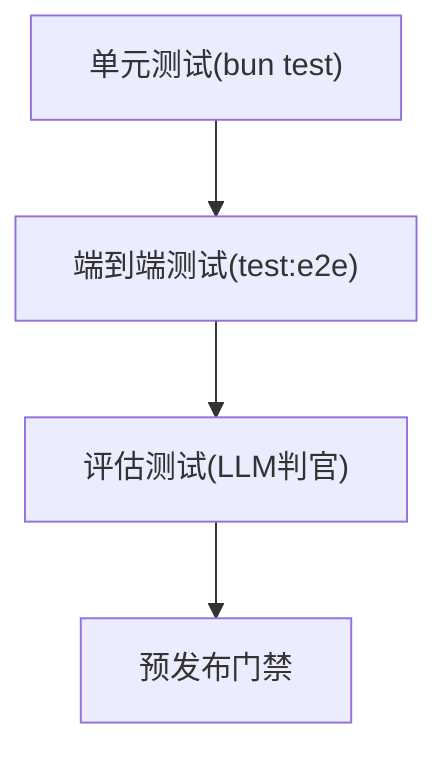
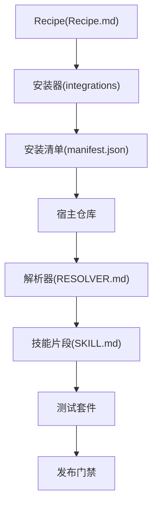

# Recipe开发指南

<cite>
**本文档引用的文件**
- [README.md](file://README.md)
- [CONTRIBUTING.md](file://CONTRIBUTING.md)
- [docs/INSTALL.md](file://docs/INSTALL.md)
- [docs/TESTING.md](file://docs/TESTING.md)
- [docs/RELEASING.md](file://docs/RELEASING.md)
- [docs/skillpack-anatomy.md](file://docs/skillpack-anatomy.md)
- [examples/skillpack-reference/skillpack.json](file://examples/skillpack-reference/skillpack.json)
- [recipes/agent-voice.md](file://recipes/agent-voice.md)
- [recipes/calendar-to-brain.md](file://recipes/calendar-to-brain.md)
- [recipes/email-to-brain.md](file://recipes/email-to-brain.md)
- [recipes/retrieval-reflex.md](file://recipes/retrieval-reflex.md)
</cite>

## 目录
1. [简介](#简介)
2. [项目结构](#项目结构)
3. [核心组件](#核心组件)
4. [架构总览](#架构总览)
5. [详细组件分析](#详细组件分析)
6. [依赖关系分析](#依赖关系分析)
7. [性能考虑](#性能考虑)
8. [故障排查指南](#故障排查指南)
9. [结论](#结论)
10. [附录](#附录)

## 简介
本指南面向Recipe开发者，系统阐述GBrain中Recipe（集成配方）的标准架构与开发框架，覆盖manifest.json配置、安装脚本与后安装提示；详述Recipe的测试策略（端到端、单元、评估测试）；提供Recipe模板与代码示例；说明Recipe的打包、发布与版本管理流程；并总结调试技巧、性能优化与错误处理最佳实践。

## 项目结构
- Recipe位于recipes目录，每个Recipe以独立Markdown文档形式呈现，并可包含install子目录（用于定义安装清单与后安装提示）、skills子目录（技能片段）、tests（单元与E2E测试）等。
- 安装与验证路径参考安装文档，测试体系参考测试文档，发布与版本管理参考发布文档。
- 技能包（Skillpack）作为Recipe的承载容器，其树形结构与清单字段在技能包文档中有明确规范。

**图表来源**
- [recipes/agent-voice.md](file://recipes/agent-voice.md)
- [recipes/calendar-to-brain.md](file://recipes/calendar-to-brain.md)
- [recipes/email-to-brain.md](file://recipes/email-to-brain.md)
- [recipes/retrieval-reflex.md](file://recipes/retrieval-reflex.md)
- [docs/INSTALL.md](file://docs/INSTALL.md)
- [docs/TESTING.md](file://docs/TESTING.md)
- [docs/RELEASING.md](file://docs/RELEASING.md)
- [docs/skillpack-anatomy.md](file://docs/skillpack-anatomy.md)
- [examples/skillpack-reference/skillpack.json](file://examples/skillpack-reference/skillpack.json)

**章节来源**
- [README.md:1-443](file://README.md#L1-L443)
- [docs/INSTALL.md:1-114](file://docs/INSTALL.md#L1-L114)
- [docs/TESTING.md:1-304](file://docs/TESTING.md#L1-L304)
- [docs/RELEASING.md:1-436](file://docs/RELEASING.md#L1-L436)
- [docs/skillpack-anatomy.md:1-113](file://docs/skillpack-anatomy.md#L1-L113)
- [examples/skillpack-reference/skillpack.json:1-30](file://examples/skillpack-reference/skillpack.json#L1-L30)

## 核心组件
- Recipe清单与元数据：每个Recipe以YAML头部（或类似头部）声明id、name、version、description、category、install_kind、requires、secrets、health_checks、setup_time、cost_estimate等字段，用于安装器识别与健康检查。
- 安装清单（install/manifest.json）：定义安装阶段的清单项、后安装提示、刷新算法等，支持“复制到宿主仓库”模式与“托管技能包”模式。
- 技能片段（skills/*/SKILL.md）：在宿主解析器中注册触发词与路由逻辑，配合routing-eval.jsonl进行意图校验。
- 测试套件（tests/）：包含unit、e2e、evals等子目录，分别对应单元测试、端到端测试与LLM评估配置。
- 示例技能包（examples/skillpack-reference/）：提供完整的技能包树形结构与清单样例，作为Recipe开发的参考模板。

**章节来源**
- [recipes/agent-voice.md:1-162](file://recipes/agent-voice.md#L1-L162)
- [recipes/calendar-to-brain.md:1-405](file://recipes/calendar-to-brain.md#L1-L405)
- [recipes/email-to-brain.md:1-342](file://recipes/email-to-brain.md#L1-L342)
- [recipes/retrieval-reflex.md:1-55](file://recipes/retrieval-reflex.md#L1-L55)
- [docs/skillpack-anatomy.md:1-113](file://docs/skillpack-anatomy.md#L1-L113)
- [examples/skillpack-reference/skillpack.json:1-30](file://examples/skillpack-reference/skillpack.json#L1-L30)

## 架构总览
Recipe的典型生命周期包括：安装器读取Recipe元数据与安装清单、执行安装脚本、生成后安装提示、在宿主解析器中注册技能片段、运行测试与健康检查、最终进入运维监控。

**图表来源**
- [recipes/agent-voice.md:49-79](file://recipes/agent-voice.md#L49-L79)
- [recipes/calendar-to-brain.md:109-285](file://recipes/calendar-to-brain.md#L109-L285)
- [recipes/email-to-brain.md:109-240](file://recipes/email-to-brain.md#L109-L240)
- [recipes/retrieval-reflex.md:40-55](file://recipes/retrieval-reflex.md#L40-L55)

## 详细组件分析

### 组件A：安装清单与后安装提示
- 安装清单（install/manifest.json）：定义安装阶段的清单项、后安装提示、刷新算法等，支持“复制到宿主仓库”模式与“托管技能包”模式。
- 后安装提示（post-install-hint.md）：在安装完成后向用户展示下一步操作建议与注意事项。
- 刷新算法（refresh-algorithm.md）：在“复制到宿主仓库”模式下，提供与上游参考的差异对比与合并策略。

**图表来源**
- [recipes/agent-voice.md:80-97](file://recipes/agent-voice.md#L80-L97)
- [recipes/calendar-to-brain.md:275-285](file://recipes/calendar-to-brain.md#L275-L285)
- [recipes/email-to-brain.md:233-240](file://recipes/email-to-brain.md#L233-L240)

**章节来源**
- [recipes/agent-voice.md:1-162](file://recipes/agent-voice.md#L1-L162)
- [recipes/calendar-to-brain.md:1-405](file://recipes/calendar-to-brain.md#L1-L405)
- [recipes/email-to-brain.md:1-342](file://recipes/email-to-brain.md#L1-L342)

### 组件B：技能片段与路由评估
- 技能片段（skills/*/SKILL.md）：定义触发词、能力边界与上下文指令，供解析器在消息匹配时调用。
- 路由评估（routing-eval.jsonl）：至少包含5个意图样本，确保触发词与技能的映射准确。
- 解析器集成：安装后在宿主解析器中生效，支持“复制到宿主仓库”与“托管技能包”两种模式。

**图表来源**
- [docs/skillpack-anatomy.md:37-50](file://docs/skillpack-anatomy.md#L37-L50)
- [examples/skillpack-reference/skillpack.json:10-28](file://examples/skillpack-reference/skillpack.json#L10-L28)

**章节来源**
- [docs/skillpack-anatomy.md:1-113](file://docs/skillpack-anatomy.md#L1-L113)
- [examples/skillpack-reference/skillpack.json:1-30](file://examples/skillpack-reference/skillpack.json#L1-L30)

### 组件C：测试策略与评估
- 单元测试：针对技能包中的纯函数与模块进行快速验证，遵循隔离规则与并发安全约束。
- 端到端测试：需要真实数据库环境，覆盖同步、升级、HTTP传输等关键路径。
- 评估测试：通过LLM判官配置与基准数据集进行质量评估，确保召回与稳定性指标达标。

**图表来源**
- [docs/TESTING.md:6-18](file://docs/TESTING.md#L6-L18)
- [docs/TESTING.md:20-26](file://docs/TESTING.md#L20-L26)
- [docs/TESTING.md:116-215](file://docs/TESTING.md#L116-L215)
- [docs/TESTING.md:217-247](file://docs/TESTING.md#L217-L247)

**章节来源**
- [docs/TESTING.md:1-304](file://docs/TESTING.md#L1-L304)
- [CONTRIBUTING.md:52-77](file://CONTRIBUTING.md#L52-L77)

### 组件D：打包、发布与版本管理
- 打包：使用技能包工具生成确定性tarball与SHA-256摘要，便于注册表分发。
- 发布：遵循本地CI门禁与变更日志规范，确保类型检查与全量测试通过。
- 版本：按分支范围维护版本与变更记录，发布摘要需面向用户可读，避免内部术语。

**图表来源**
- [docs/skillpack-anatomy.md:92-106](file://docs/skillpack-anatomy.md#L92-L106)
- [docs/RELEASING.md:14-33](file://docs/RELEASING.md#L14-L33)
- [docs/RELEASING.md:53-98](file://docs/RELEASING.md#L53-L98)

**章节来源**
- [docs/skillpack-anatomy.md:1-113](file://docs/skillpack-anatomy.md#L1-L113)
- [docs/RELEASING.md:1-436](file://docs/RELEASING.md#L1-L436)

## 依赖关系分析
- Recipe与安装器：安装器依赖Recipe元数据与安装清单，决定复制策略与注册方式。
- Recipe与解析器：技能片段在解析器中注册，路由评估保障触发词与技能的一致性。
- Recipe与测试：单元/E2E/评估测试共同构成质量保障闭环。
- Recipe与发布：技能包打包与注册表分发是发布流程的关键环节。

**图表来源**
- [recipes/agent-voice.md:49-79](file://recipes/agent-voice.md#L49-L79)
- [recipes/retrieval-reflex.md:40-55](file://recipes/retrieval-reflex.md#L40-L55)
- [docs/skillpack-anatomy.md:37-50](file://docs/skillpack-anatomy.md#L37-L50)
- [docs/TESTING.md:217-247](file://docs/TESTING.md#L217-L247)
- [docs/RELEASING.md:14-33](file://docs/RELEASING.md#L14-L33)

**章节来源**
- [recipes/agent-voice.md:1-162](file://recipes/agent-voice.md#L1-L162)
- [recipes/retrieval-reflex.md:1-55](file://recipes/retrieval-reflex.md#L1-L55)
- [docs/skillpack-anatomy.md:1-113](file://docs/skillpack-anatomy.md#L1-L113)
- [docs/TESTING.md:1-304](file://docs/TESTING.md#L1-L304)
- [docs/RELEASING.md:1-436](file://docs/RELEASING.md#L1-L436)

## 性能考虑
- 安装阶段：优先采用“复制到宿主仓库”模式，减少运行时依赖，提升可维护性与可审计性。
- 测试阶段：利用并行单元测试与隔离规则，缩短反馈周期；端到端测试仅在必要时运行，降低CI成本。
- 评估阶段：通过LLM判官与基准数据集评估召回与稳定性，确保回归不恶化。
- 运维阶段：健康检查与心跳日志有助于早期发现异常，降低故障恢复时间。

[本节为通用指导，无需特定文件来源]

## 故障排查指南
- 安装失败：检查API密钥、网络连通性与健康检查项；参考安装文档中的验证步骤。
- 测试失败：根据失败日志定位问题，必要时启用更详细的日志输出；确保测试隔离与并发安全。
- 发布受阻：遵循本地CI门禁与类型检查；变更日志需面向用户可读，避免内部术语。
- 集成异常：核对解析器注册状态与路由评估结果，确认触发词与技能映射正确。

**章节来源**
- [docs/INSTALL.md:105-114](file://docs/INSTALL.md#L105-L114)
- [docs/TESTING.md:27-37](file://docs/TESTING.md#L27-L37)
- [docs/RELEASING.md:34-51](file://docs/RELEASING.md#L34-L51)

## 结论
Recipe开发应遵循标准化的清单与元数据规范，结合安装清单与后安装提示实现可复现的安装体验；通过单元、端到端与评估测试构建质量保障闭环；采用技能包打包与注册表分发实现可追溯的发布流程；并在调试、性能与错误处理方面形成最佳实践，确保Recipe在生产环境中稳定运行。

[本节为总结性内容，无需特定文件来源]

## 附录

### Recipe模板与代码示例
- 语音人设Recipe模板：包含WebRTC客户端、工具路由器、Persona提示构建器与可选Twilio适配器，以及单元/E2E测试与路由评估。
- 日历到脑Recipe模板：提供Google Calendar事件到脑页的收集与导入流程，包含历史回填、索引生成与每周同步。
- 邮件到脑Recipe模板：提供Gmail消息收集、摘要生成与实体检测流程，包含噪声过滤与去重策略。
- 检索反射Recipe模板：提供“何时检索”与“检索什么”的策略技能，配合确定性指针层自动注入上下文。

**章节来源**
- [recipes/agent-voice.md:1-162](file://recipes/agent-voice.md#L1-L162)
- [recipes/calendar-to-brain.md:1-405](file://recipes/calendar-to-brain.md#L1-L405)
- [recipes/email-to-brain.md:1-342](file://recipes/email-to-brain.md#L1-L342)
- [recipes/retrieval-reflex.md:1-55](file://recipes/retrieval-reflex.md#L1-L55)