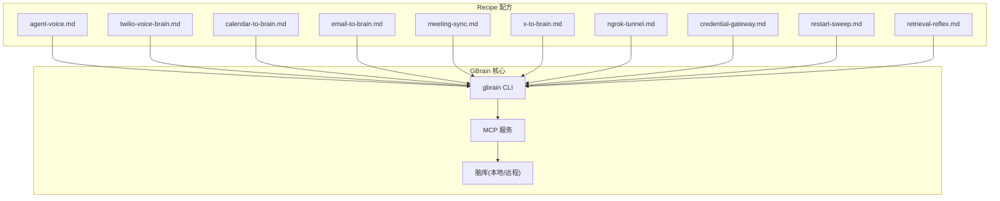
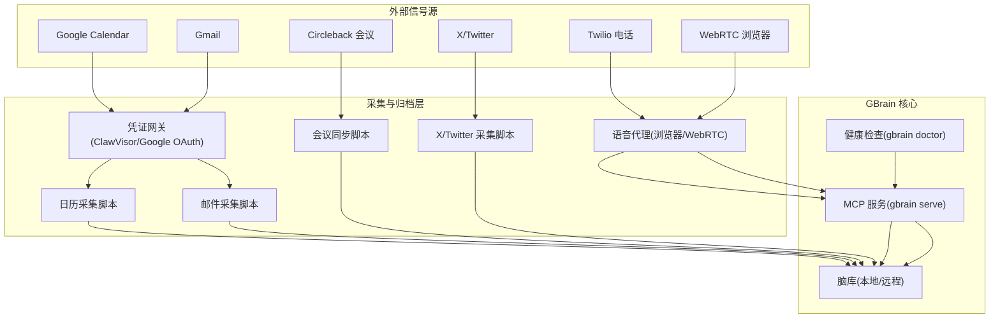
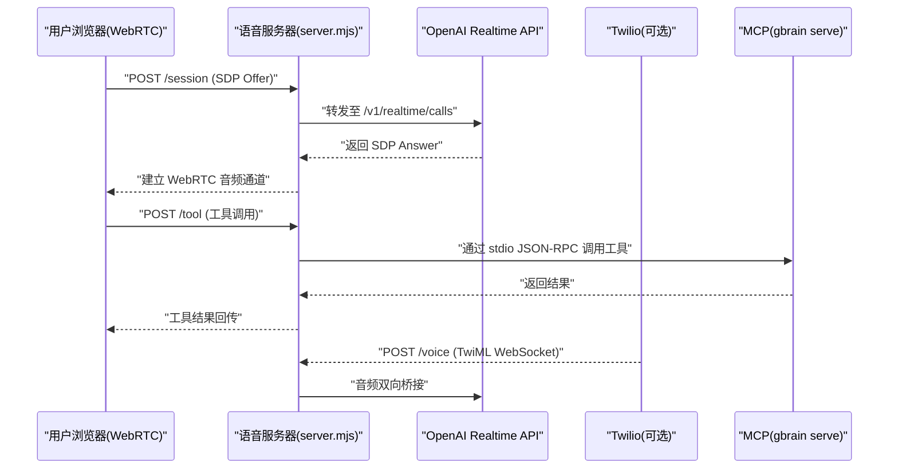
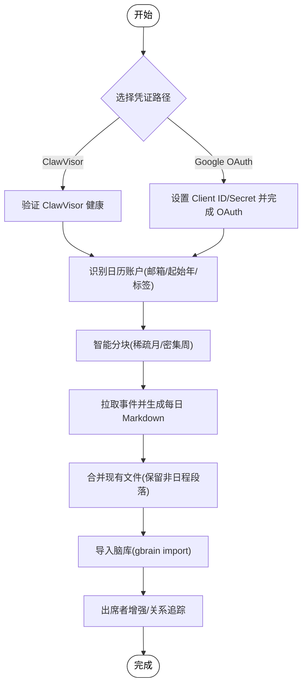
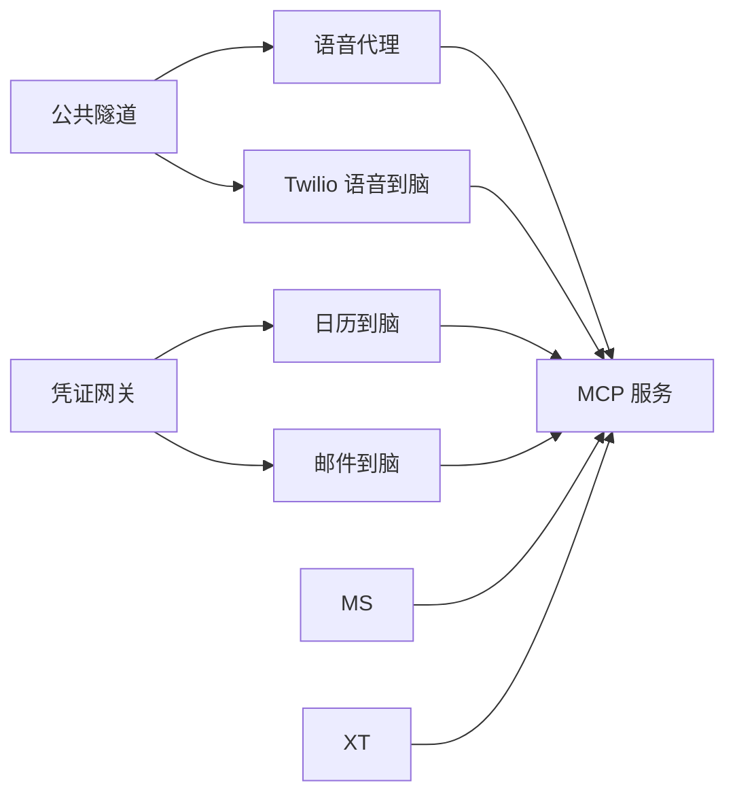

# Recipe系统

<cite>
**本文档引用的文件**
- [README.md](file://README.md)
- [agent-voice.md](file://recipes/agent-voice.md)
- [twilio-voice-brain.md](file://recipes/twilio-voice-brain.md)
- [calendar-to-brain.md](file://recipes/calendar-to-brain.md)
- [email-to-brain.md](file://recipes/email-to-brain.md)
- [meeting-sync.md](file://recipes/meeting-sync.md)
- [x-to-brain.md](file://recipes/x-to-brain.md)
- [ngrok-tunnel.md](file://recipes/ngrok-tunnel.md)
- [credential-gateway.md](file://recipes/credential-gateway.md)
- [restart-sweep.md](file://recipes/restart-sweep.md)
- [retrieval-reflex.md](file://recipes/retrieval-reflex.md)
</cite>

## 目录
1. [简介](#简介)
2. [项目结构](#项目结构)
3. [核心组件](#核心组件)
4. [架构总览](#架构总览)
5. [详细组件分析](#详细组件分析)
6. [依赖分析](#依赖分析)
7. [性能考虑](#性能考虑)
8. [故障排除指南](#故障排除指南)
9. [结论](#结论)
10. [附录](#附录)

## 简介
本文件系统性阐述 GBrain 的 Recipe（配方）体系：设计理念、架构模式、工作流与集成方案，并围绕现有 Recipe 的功能特性进行深入解析，包括语音代理、日历同步、Twilio 集成、邮件到脑、会议同步、X/Twitter 监控、公共隧道与凭证网关等。同时提供 Recipe 定制与扩展方法、安装配置与管理流程、开发指南与最佳实践、依赖关系与冲突处理策略，以及故障排除与性能优化建议。

## 项目结构
Recipe 是以 Markdown 文档形式提供的“配方”，描述数据源接入、安装步骤、健康检查、成本估算与生产注意事项。它们通过 gbrain CLI 的集成子命令被发现、安装与刷新，作为“参考式复制”或“本地化复制”的方式进入宿主 Agent 仓库，实现“用户拥有、按需更新”的演进模式。

图示来源
- [README.md](file://README.md)
- [agent-voice.md](file://recipes/agent-voice.md)
- [twilio-voice-brain.md](file://recipes/twilio-voice-brain.md)
- [calendar-to-brain.md](file://recipes/calendar-to-brain.md)
- [email-to-brain.md](file://recipes/email-to-brain.md)
- [meeting-sync.md](file://recipes/meeting-sync.md)
- [x-to-brain.md](file://recipes/x-to-brain.md)
- [ngrok-tunnel.md](file://recipes/ngrok-tunnel.md)
- [credential-gateway.md](file://recipes/credential-gateway.md)
- [restart-sweep.md](file://recipes/restart-sweep.md)
- [retrieval-reflex.md](file://recipes/retrieval-reflex.md)

章节来源
- [README.md](file://README.md)

## 核心组件
- 预配置工作流与集成方案
  - 每个 Recipe 以“步骤化安装流程 + 健康检查 + 成本估算 + 生产清单”为骨架，确保可重复部署与可观测性。
  - “参考式复制”范式：Recipe 不作为运行时依赖，而是安装时将参考内容复制到宿主仓库，由用户在自己的发布节奏上维护与迭代。
- 关键能力
  - 语音代理：WebRTC 优先的浏览器端体验，支持 OpenAI Realtime API；可选 Twilio 入站桥接。
  - 多源感知：日历、邮件、会议、社交平台（X/Twitter）等信号自动归档为可检索的脑页。
  - 基础设施：公共隧道（ngrok 固定域名）、凭证网关（ClawVisor 或直接 OAuth），保障外部服务访问的安全与稳定。
  - 运维反射：Retrieval Reflex 自动注入“何时检索、检索什么”的策略；Restart Sweep 检测重启导致的消息丢失风险。

章节来源
- [agent-voice.md](file://recipes/agent-voice.md)
- [calendar-to-brain.md](file://recipes/calendar-to-brain.md)
- [email-to-brain.md](file://recipes/email-to-brain.md)
- [meeting-sync.md](file://recipes/meeting-sync.md)
- [x-to-brain.md](file://recipes/x-to-brain.md)
- [ngrok-tunnel.md](file://recipes/ngrok-tunnel.md)
- [credential-gateway.md](file://recipes/credential-gateway.md)
- [restart-sweep.md](file://recipes/restart-sweep.md)
- [retrieval-reflex.md](file://recipes/retrieval-reflex.md)

## 架构总览
Recipe 的整体架构围绕“信号采集 → 结构化归档 → 脑页合成 → 可检索查询”展开。外部服务通过凭证网关安全访问，本地或云端服务通过公共隧道暴露给外部系统（如 Twilio、Claude 桌面客户端）。MCP 服务作为统一工具面，向 Agent 与客户端提供检索、查询、写入等能力。

图示来源
- [credential-gateway.md](file://recipes/credential-gateway.md)
- [calendar-to-brain.md](file://recipes/calendar-to-brain.md)
- [email-to-brain.md](file://recipes/email-to-brain.md)
- [meeting-sync.md](file://recipes/meeting-sync.md)
- [x-to-brain.md](file://recipes/x-to-brain.md)
- [agent-voice.md](file://recipes/agent-voice.md)
- [ngrok-tunnel.md](file://recipes/ngrok-tunnel.md)
- [README.md](file://README.md)

## 详细组件分析

### 语音代理：WebRTC 优先的 Mars/Venus 人设
- 设计理念
  - WebRTC 优先：浏览器端音视频双向流直连 OpenAI Realtime API，降低中间环节复杂度。
  - 人设驱动：Mars（内省型思维伙伴）、Venus（干练执行助理），分别对应不同声音与行为风格。
  - 工具路由：只读白名单默认开启，写操作需显式授权；支持本地覆盖扩展。
- 安装与刷新
  - 使用“参考式复制”安装到宿主仓库，后续通过 refresh 对比 SHA 并差异化更新。
  - 提供测试模式（?test=1）与端到端测试套件，CI 保护 PII 清洗与上游稳定性。
- 生产清单
  - Twilio 签名校验、速率限制、CORS 白名单、/tool 认证、HTTPS、回退 TwiML、PII 清洗等。

图示来源
- [agent-voice.md](file://recipes/agent-voice.md)

章节来源
- [agent-voice.md](file://recipes/agent-voice.md)

### 日历到脑：多账户历史回填与每日索引
- 功能特性
  - 支持 ClawVisor（推荐）与 Google OAuth 两种凭证路径；多账户聚合；智能分块（稀疏期月级、密集期周级）。
  - 输出每日 Markdown 文件（含事件、出席者、地点），保留手动注释；生成 INDEX.md 与原始响应缓存。
  - 与脑库集成后，支持基于会议准备、关系追踪与模式检测的智能应用。
- 实现要点
  - 分块策略、出席者过滤（会议室/群组/内部分发列表剔除）、合并现有文件（仅替换日程段落）、时间解析边界处理。
  - 历史回填与增量同步结合，配合每周定时任务保持最新。

图示来源
- [calendar-to-brain.md](file://recipes/calendar-to-brain.md)

章节来源
- [calendar-to-brain.md](file://recipes/calendar-to-brain.md)

### 邮件到脑：确定性收集与代理判断
- 核心模式
  - 确定性收集（代码负责数据抓取、链接生成、去噪）+ 代理判断（LLM 负责实体检测、页面更新、优先级分类）。
  - 支持 ClawVisor（推荐）与 Google OAuth；噪声过滤（noreply/通知/日历提醒）、签名请求识别（DocuSign 等）。
- 实施要点
  - 消息去重（按消息 ID）、状态持久化（state.json）、Gmail 链接生成（authuser 参数正确性）、每日摘要（digest）。
  - 定时采集与人工增强相结合，保证覆盖率与准确性。

章节来源
- [email-to-brain.md](file://recipes/email-to-brain.md)

### 会议同步：Circleback 自动导入与实体传播
- 数据流
  - Circleback 录制/转写/摘要 → 同步脚本拉取 → 生成会议脑页（带出席者、标签、时间戳）→ 代理传播到人员/公司页面。
- 实施要点
  - SSE 流解析（JSONRPC 包裹）、幂等性校验（source_id/文件名双保险）、自动打标签、Git 提交触发索引。
  - 推荐在工作日高频同步，确保会议信号及时进入脑库。

章节来源
- [meeting-sync.md](file://recipes/meeting-sync.md)

### X/Twitter 到脑：关键词监控与删除检测
- 特性
  - 三路采集：自推时间线、提及、关键词搜索；删除检测（缺失 ID + 个别查询确认）、参与度速度阈值告警。
  - 图像 OCR（可选）提取视觉文本；实时流（Filtered Stream，Basic tier 起）近实时监控。
- 实施要点
  - 原子写入（.tmp+rename）、速率限制感知与退避、输出结构化日志便于 Cron Agent 解析。

章节来源
- [x-to-brain.md](file://recipes/x-to-brain.md)

### 公共隧道：固定域名与多服务路由
- 价值
  - 为 MCP 服务、语音代理、远端客户端（Claude Desktop、Perplexity）提供稳定外网入口；Hobby tier 固定域名避免 URL 变更带来的集成失效。
- 实施要点
  - watchdog 自动重启 ngrok；无固定域名时自动更新 Twilio webhook；支持多服务路径路由（/mcp、/voice）。

章节来源
- [ngrok-tunnel.md](file://recipes/ngrok-tunnel.md)

### 凭证网关：安全访问 Google 服务
- 价值
  - 统一的 OAuth 管理与令牌刷新，ClawVisor 可集中管理多个服务（Gmail、日历、联系人），减少令牌泄露与过期风险。
- 实施要点
  - ClawVisor 任务目的需“足够宽泛”以避免请求被拒；Google OAuth 需启用相应 API 并配置同意屏幕。

章节来源
- [credential-gateway.md](file://recipes/credential-gateway.md)

### 运维反射：Retrieval Reflex 自动检索策略
- 价值
  - 将“何时检索、检索什么”的策略注入到主机解析器中，与上下文引擎的确定性指针层协同，避免“知道有页面却不去看”的情况。
- 实施要点
  - 默认开启的确定性层无需安装；策略技能通过 Recipe 复制到宿主仓库，随宿主发布节奏演进。

章节来源
- [retrieval-reflex.md](file://recipes/retrieval-reflex.md)

### 运维反射：Restart Sweep 检测重启丢信
- 价值
  - 在 OpenClaw 网关重启后，Webhook 无法重放的 Telegram 消息可能丢失；该 Recipe 通过读取会话状态检测异常并告警，配合冷却抑制重复告警。
- 实施要点
  - 读取启动日志定位重启时间窗；过滤目标 Telegram 群组会话；可选“活跃-静默”启发式；cooldown 6 小时抑制重复。

章节来源
- [restart-sweep.md](file://recipes/restart-sweep.md)

## 依赖分析
- 依赖关系
  - 语音代理依赖 ngrok（公共隧道）与 OpenAI Realtime API；可选 Twilio 入站桥接。
  - 日历/邮件/会议/X 等 Recipe 依赖凭证网关；其中日历与邮件还依赖本地 Node.js 脚本。
  - 所有 Recipe 最终通过 MCP 服务与脑库交互，形成统一工具面。
- 冲突与兼容
  - 多个 Recipe 同时使用 ngrok 时，建议使用 Hobby tier 固定域名或第二域名，避免端口/路径冲突。
  - 语音代理与 Twilio Voice-Brain Recipe 存在版本迁移关系：新安装推荐使用 agent-voice，twilio-voice-brain 标记为弃用。

图示来源
- [credential-gateway.md](file://recipes/credential-gateway.md)
- [ngrok-tunnel.md](file://recipes/ngrok-tunnel.md)
- [agent-voice.md](file://recipes/agent-voice.md)
- [twilio-voice-brain.md](file://recipes/twilio-voice-brain.md)
- [calendar-to-brain.md](file://recipes/calendar-to-brain.md)
- [email-to-brain.md](file://recipes/email-to-brain.md)
- [meeting-sync.md](file://recipes/meeting-sync.md)
- [x-to-brain.md](file://recipes/x-to-brain.md)

章节来源
- [agent-voice.md](file://recipes/agent-voice.md)
- [twilio-voice-brain.md](file://recipes/twilio-voice-brain.md)
- [ngrok-tunnel.md](file://recipes/ngrok-tunnel.md)
- [credential-gateway.md](file://recipes/credential-gateway.md)

## 性能考虑
- 采集与同步
  - 智能分块与幂等性：日历与会议同步采用分块与幂等策略，避免重复处理与 API 限额压力。
  - 速率限制感知：X 采集脚本内置速率限制跟踪与退避，防止频繁 429。
- 传输与延迟
  - WebRTC 直连 OpenAI Realtime API，减少中间层开销；Twilio WebSocket 采用 g711_ulaw，避免编解码损耗。
- 存储与检索
  - 脑库采用混合检索（向量+BM25+RRF+来源层级+意图重写），默认平衡模式兼顾成本与质量；必要时切换到 tokenmax 模式提升召回。
- 运维稳定性
  - watchdog 自动重启 ngrok 与服务；Restart Sweep 抑制重复告警，避免噪音干扰。

## 故障排除指南
- 通用诊断
  - 使用 `gbrain doctor` 查看健康检查；对每个 Recipe 的健康检查项逐一验证。
- 语音代理
  - WebRTC 无法连接：检查 ngrok 是否运行、OpenAI 密钥是否有效、浏览器麦克风权限。
  - Twilio 入站失败：核对 X-Twilio-Signature 校验、回退 TwiML、HTTPS 部署。
- 日历/邮件/会议/X
  - 凭证问题：ClawVisor 不可达或任务目的过窄；Google OAuth 令牌过期或作用域不全。
  - 数据为空：检查日期范围、过滤规则（会议/出席者/X 删除检测启发式）。
- 公共隧道
  - URL 变更导致集成失效：升级 Hobby tier 获取固定域名；watchdog 自动更新 Twilio webhook。
- 运维反射
  - Restart Sweep 未触发或重复告警：检查会话状态、冷却抑制、启动日志路径。

章节来源
- [agent-voice.md](file://recipes/agent-voice.md)
- [calendar-to-brain.md](file://recipes/calendar-to-brain.md)
- [email-to-brain.md](file://recipes/email-to-brain.md)
- [meeting-sync.md](file://recipes/meeting-sync.md)
- [x-to-brain.md](file://recipes/x-to-brain.md)
- [ngrok-tunnel.md](file://recipes/ngrok-tunnel.md)
- [restart-sweep.md](file://recipes/restart-sweep.md)

## 结论
Recipe 系统以“配方即文档”的方式，将复杂的外部服务接入、安装流程与生产注意事项标准化，辅以参考式复制范式，使用户在拥有完全控制权的前提下，快速、安全地构建从信号采集到知识合成的完整闭环。通过统一的 MCP 工具面与健康检查机制，Recipe 既可独立运行，也可协同工作，满足个人与团队的多样化需求。

## 附录
- 定制与扩展
  - 参数配置：在宿主仓库中根据 Recipe 注释调整环境变量、路径与阈值；必要时覆盖工具路由白名单。
  - 行为修改：在复制到宿主仓库的代码中进行本地化增强（例如上下文构建器、提示工程、实体过滤规则）。
  - 新 Recipe 开发：遵循现有 Recipe 的结构（元数据、步骤、健康检查、成本估算、生产清单），并通过 gbrain CLI 发现与安装。
- 安装与管理
  - 使用 `gbrain integrations list/install/refresh` 管理 Recipe 生命周期；结合 `gbrain doctor` 与各 Recipe 的健康检查项进行验证。
- 最佳实践
  - 优先使用固定域名的公共隧道；为关键服务启用速率限制与 CORS 白名单；严格 PII 清洗；定期审查与更新凭证。
  - 采用幂等性设计与原子写入，确保大规模数据处理的可靠性；利用冷却抑制与 watchdog 降低运维噪音。