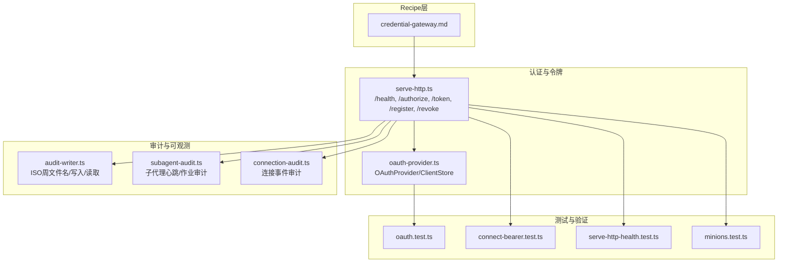
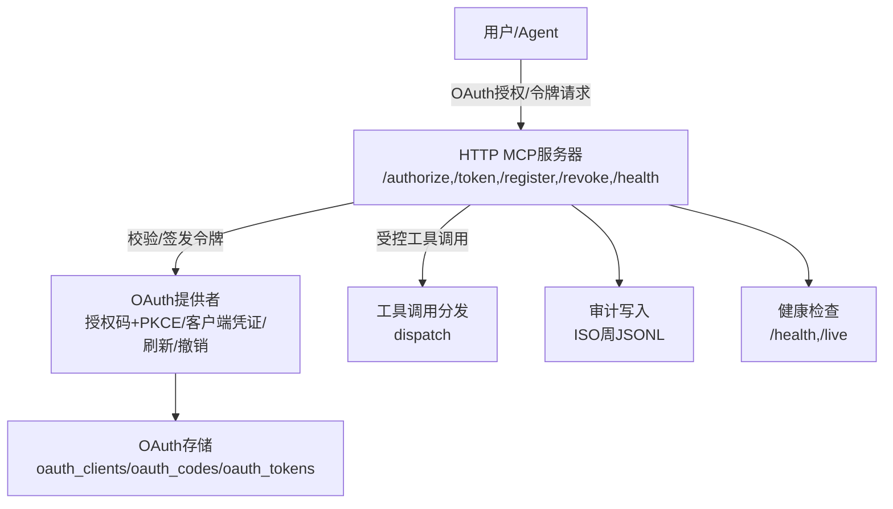
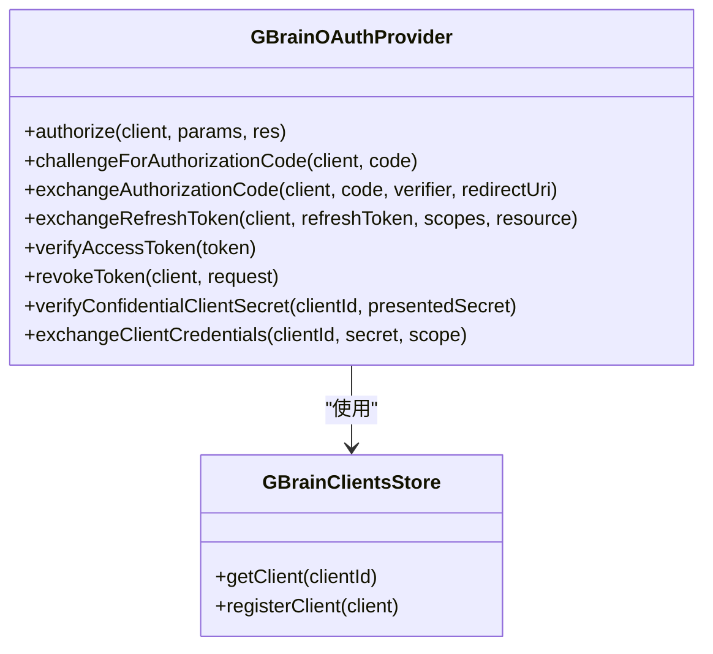
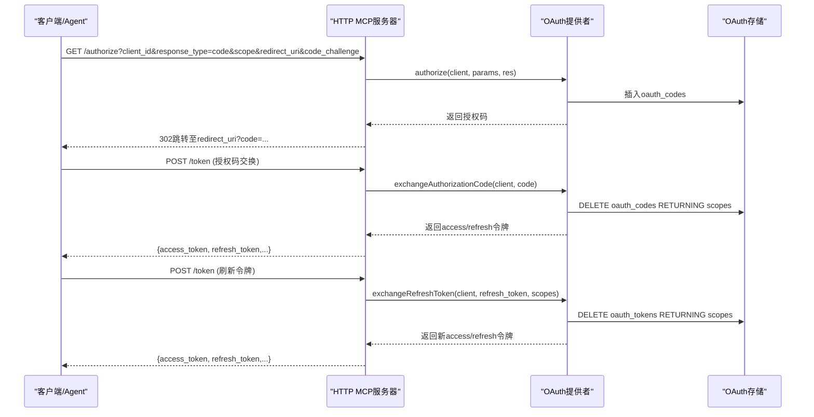
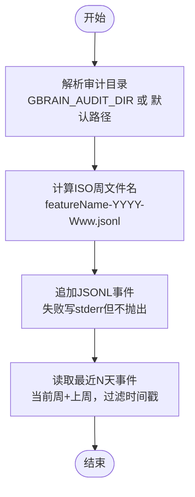
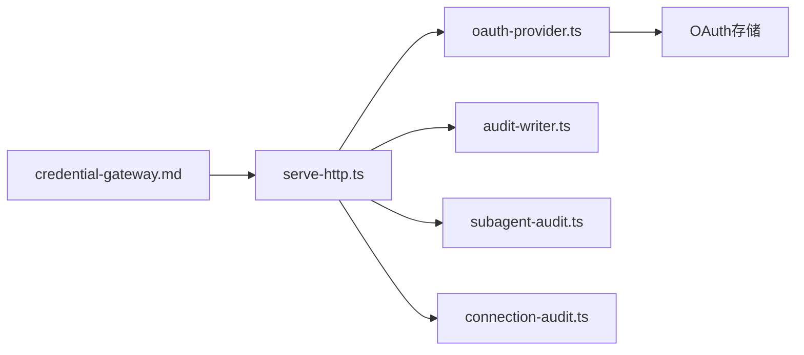

# 凭证网关Recipe

<cite>
**本文档引用的文件**
- [credential-gateway.md](file://recipes/credential-gateway.md)
- [oauth-provider.ts](file://src/core/oauth-provider.ts)
- [serve-http.ts](file://src/commands/serve-http.ts)
- [audit-writer.ts](file://src/core/audit/audit-writer.ts)
- [subagent-audit.ts](file://src/core/minions/handlers/subagent-audit.ts)
- [connection-audit.ts](file://src/core/connection-audit.ts)
- [features.ts](file://src/commands/features.ts)
- [oauth.test.ts](file://test/oauth.test.ts)
- [connect-bearer.test.ts](file://test/e2e/connect-bearer.test.ts)
- [serve-http-health.test.ts](file://test/serve-http-health.test.ts)
- [minions.test.ts](file://test/minions.test.ts)
</cite>

## 目录
1. [简介](#简介)
2. [项目结构](#项目结构)
3. [核心组件](#核心组件)
4. [架构总览](#架构总览)
5. [详细组件分析](#详细组件分析)
6. [依赖关系分析](#依赖关系分析)
7. [性能考量](#性能考量)
8. [故障排查指南](#故障排查指南)
9. [结论](#结论)
10. [附录](#附录)

## 简介
本文件为“凭证网关Recipe”的技术文档，面向需要在系统中安全接入Google服务（如Gmail、Google Calendar、Google Contacts）的用户与工程师。该Recipe提供两种可选的网关模式：  
- 选项A：ClawVisor托管网关（推荐），由第三方服务统一处理OAuth、令牌刷新与加密，安装一次即可被多个Google服务Recipe共享使用。  
- 选项B：直接Google OAuth2（无额外服务依赖），由本地自行管理令牌生命周期。

本Recipe还配套了安全架构、认证机制、凭据存储、访问控制、安全传输、配置项、API接口、集成方法、安全最佳实践、威胁防护、凭证轮换、审计日志、合规性、监控告警与故障恢复等完整说明，帮助您构建高可用、可审计、可合规的凭证基础设施。

## 项目结构
与凭证网关Recipe直接相关的代码与文档主要分布在以下位置：
- Recipe定义与使用说明：recipes/credential-gateway.md
- OAuth 2.1/2023-2024规范实现与令牌管理：src/core/oauth-provider.ts
- HTTP MCP服务器与健康检查：src/commands/serve-http.ts
- 审计日志基础设施：src/core/audit/audit-writer.ts、src/core/minions/handlers/subagent-audit.ts、src/core/connection-audit.ts
- 功能注册与密钥清单：src/commands/features.ts
- 单元测试与端到端测试：test/oauth.test.ts、test/e2e/connect-bearer.test.ts、test/serve-http-health.test.ts、test/minions.test.ts

图示来源
- [credential-gateway.md:1-189](file://recipes/credential-gateway.md#L1-L189)
- [oauth-provider.ts:1-990](file://src/core/oauth-provider.ts#L1-L990)
- [serve-http.ts:1-200](file://src/commands/serve-http.ts#L1-L200)
- [audit-writer.ts:1-255](file://src/core/audit/audit-writer.ts#L1-L255)
- [subagent-audit.ts:88-125](file://src/core/minions/handlers/subagent-audit.ts#L88-L125)
- [connection-audit.ts:67-104](file://src/core/connection-audit.ts#L67-L104)
- [oauth.test.ts:28-65](file://test/oauth.test.ts#L28-L65)
- [connect-bearer.test.ts:203-213](file://test/e2e/connect-bearer.test.ts#L203-L213)
- [serve-http-health.test.ts:60-146](file://test/serve-http-health.test.ts#L60-L146)
- [minions.test.ts:2575-2617](file://test/minions.test.ts#L2575-L2617)

章节来源
- [credential-gateway.md:1-189](file://recipes/credential-gateway.md#L1-L189)
- [oauth-provider.ts:1-990](file://src/core/oauth-provider.ts#L1-L990)
- [serve-http.ts:1-200](file://src/commands/serve-http.ts#L1-L200)
- [audit-writer.ts:1-255](file://src/core/audit/audit-writer.ts#L1-L255)
- [subagent-audit.ts:88-125](file://src/core/minions/handlers/subagent-audit.ts#L88-L125)
- [connection-audit.ts:67-104](file://src/core/connection-audit.ts#L67-L104)
- [oauth.test.ts:28-65](file://test/oauth.test.ts#L28-L65)
- [connect-bearer.test.ts:203-213](file://test/e2e/connect-bearer.test.ts#L203-L213)
- [serve-http-health.test.ts:60-146](file://test/serve-http-health.test.ts#L60-L146)
- [minions.test.ts:2575-2617](file://test/minions.test.ts#L2575-L2617)

## 核心组件
- 凭证网关Recipe：定义两种接入方案（ClawVisor托管或直接OAuth2），提供健康检查与设置流程。
- OAuth 2.1提供者：实现授权码+PKCE、客户端凭证、令牌刷新与轮换、令牌撤销、范围校验、客户端注册（DCR）等。
- HTTP MCP服务器：暴露OAuth端点与工具调用入口，内置健康检查与限流、CORS、Cookie认证等。
- 审计日志：统一ISO周命名的JSONL审计文件，支持子代理心跳、连接事件等多类审计。
- 测试与验证：覆盖OAuth流程、健康检查、最小化故障恢复行为等。

章节来源
- [credential-gateway.md:1-189](file://recipes/credential-gateway.md#L1-L189)
- [oauth-provider.ts:1-990](file://src/core/oauth-provider.ts#L1-L990)
- [serve-http.ts:1-200](file://src/commands/serve-http.ts#L1-L200)
- [audit-writer.ts:1-255](file://src/core/audit/audit-writer.ts#L1-L255)

## 架构总览
凭证网关Recipe通过HTTP MCP服务器对外提供OAuth端点与受控工具调用能力；OAuth提供者负责令牌签发、刷新与验证；审计模块记录运行期关键事件；测试用例覆盖端到端连通性与健康检查稳定性。

图示来源
- [serve-http.ts:1-200](file://src/commands/serve-http.ts#L1-L200)
- [oauth-provider.ts:344-800](file://src/core/oauth-provider.ts#L344-L800)
- [audit-writer.ts:174-255](file://src/core/audit/audit-writer.ts#L174-L255)

## 详细组件分析

### 组件A：OAuth 2.1提供者（令牌全生命周期）
- 支持授权码+PKCE（浏览器/桌面应用）、客户端凭证（机器对机器）、令牌刷新与轮换、令牌撤销、动态客户端注册（DCR）。
- 范围校验与最小权限：授权码交换时按客户端已注册范围进行钳制；刷新时严格限制为原始授予范围的子集。
- 安全强化：
  - 授权码一次性使用与原子销毁（DELETE RETURNING）。
  - 刷新令牌防重放：错误使用会消耗该行，合法持有者无法重复使用。
  - 客户端机密比对采用哈希存储与常量时间比较。
  - 客户端注册时强制HTTPS重定向URI（除CLI注册场景）。
- 数据模型要点：
  - oauth_clients：客户端信息、允许的token_endpoint_auth_method、grant_types、scope、redirect_uris等。
  - oauth_codes：授权码哈希、挑战值、过期时间、状态参数等。
  - oauth_tokens：访问/刷新令牌哈希、过期时间、作用域、资源标识等。

图示来源
- [oauth-provider.ts:344-800](file://src/core/oauth-provider.ts#L344-L800)
- [oauth-provider.ts:192-338](file://src/core/oauth-provider.ts#L192-L338)

章节来源
- [oauth-provider.ts:1-990](file://src/core/oauth-provider.ts#L1-L990)
- [oauth.test.ts:28-65](file://test/oauth.test.ts#L28-L65)
- [oauth.test.ts:853-881](file://test/oauth.test.ts#L853-L881)

### 组件B：HTTP MCP服务器与健康检查
- 暴露OAuth端点：/authorize、/token、/register（DCR）、/revoke。
- 工具调用入口：/mcp，配合Bearer认证与范围校验中间件。
- 健康检查：/health（带超时保护）、/live（轻量存活探针）。
- 安全与可靠性：
  - 健康检查超时控制，避免与编排器超时边界竞争。
  - CORS、速率限制、Cookie解析等中间件。
  - 连接失败与超时的标准化错误描述。

图示来源
- [serve-http.ts:1-200](file://src/commands/serve-http.ts#L1-L200)
- [oauth-provider.ts:377-546](file://src/core/oauth-provider.ts#L377-L546)

章节来源
- [serve-http.ts:1-200](file://src/commands/serve-http.ts#L1-L200)
- [serve-http-health.test.ts:60-146](file://test/serve-http-health.test.ts#L60-L146)

### 组件C：审计日志与合规
- 统一审计写入器：ISO-8601周命名文件，支持当前周与前一周回溯读取，写入失败静默但输出stderr警告。
- 子代理审计：心跳事件、作业统计、错误截断等。
- 连接审计：连接事件记录与最近错误尾读取，便于诊断路由与连接问题。
- 合规建议：审计目录可通过环境变量覆盖；敏感字段不落盘（如提示词原文仅以字节计数形式记录）。

图示来源
- [audit-writer.ts:61-91](file://src/core/audit/audit-writer.ts#L61-L91)
- [audit-writer.ts:186-254](file://src/core/audit/audit-writer.ts#L186-L254)
- [subagent-audit.ts:88-125](file://src/core/minions/handlers/subagent-audit.ts#L88-L125)
- [connection-audit.ts:85-104](file://src/core/connection-audit.ts#L85-L104)

章节来源
- [audit-writer.ts:1-255](file://src/core/audit/audit-writer.ts#L1-L255)
- [subagent-audit.ts:88-125](file://src/core/minions/handlers/subagent-audit.ts#L88-L125)
- [connection-audit.ts:67-104](file://src/core/connection-audit.ts#L67-L104)

### 组件D：凭证网关Recipe（ClawVisor/直接OAuth）
- 选项A（ClawVisor）：无需本地维护令牌，由ClawVisor统一处理OAuth、令牌刷新与加密；需提供网关URL与Agent Token，并通过健康检查确认可达。
- 选项B（直接OAuth2）：在Google Cloud Console创建OAuth2客户端，启用所需API，首次运行触发授权流程，令牌持久化于本地文件；定期自动刷新。
- 设置完成后的验证：ClawVisor健康检查、本地令牌文件存在、典型服务（Gmail/Calendar）拉取验证。

章节来源
- [credential-gateway.md:1-189](file://recipes/credential-gateway.md#L1-L189)

## 依赖关系分析
- Recipe依赖HTTP MCP服务器提供的OAuth端点与健康检查。
- OAuth提供者依赖SQL查询接口与范围校验模块，数据存储于oauth_clients/oauth_codes/oauth_tokens表。
- 审计模块被HTTP服务器与子代理模块共同使用，形成统一的运行期观测面。
- 测试覆盖OAuth端到端流程、健康检查超时与恢复、最小化故障退出策略。

图示来源
- [credential-gateway.md:1-189](file://recipes/credential-gateway.md#L1-L189)
- [serve-http.ts:1-200](file://src/commands/serve-http.ts#L1-L200)
- [oauth-provider.ts:1-990](file://src/core/oauth-provider.ts#L1-L990)
- [audit-writer.ts:1-255](file://src/core/audit/audit-writer.ts#L1-L255)
- [subagent-audit.ts:88-125](file://src/core/minions/handlers/subagent-audit.ts#L88-L125)
- [connection-audit.ts:67-104](file://src/core/connection-audit.ts#L67-L104)

章节来源
- [credential-gateway.md:1-189](file://recipes/credential-gateway.md#L1-L189)
- [serve-http.ts:1-200](file://src/commands/serve-http.ts#L1-L200)
- [oauth-provider.ts:1-990](file://src/core/oauth-provider.ts#L1-L990)
- [audit-writer.ts:1-255](file://src/core/audit/audit-writer.ts#L1-L255)

## 性能考量
- 健康检查超时：/health采用较短超时阈值，避免与编排器超时边界竞争，减少误判。
- 查询优化：/health返回引擎统计信息，而/liveness仅执行轻量SELECT 1，避免高负载场景下的误报。
- 审计写入：采用追加写且失败静默，降低IO阻塞风险；按ISO周切分文件，便于滚动清理与归档。

章节来源
- [serve-http.ts:93-188](file://src/commands/serve-http.ts#L93-L188)
- [audit-writer.ts:186-254](file://src/core/audit/audit-writer.ts#L186-L254)

## 故障排查指南
- 健康检查失败
  - 现象：/health返回503，描述为“数据库连接失败”或“健康检查超时”。
  - 处理：检查数据库池饱和、网络波动；观察超时是否与编排器边界接近；必要时提升超时阈值或扩容数据库连接池。
- OAuth刷新失败
  - 现象：刷新令牌时报错“未找到或已过期”，或“请求范围超出原始授权”。
  - 处理：确认刷新令牌未被他人使用；确保请求范围是原始授权范围的子集；检查令牌过期时间与服务器时间同步。
- 审计写入失败
  - 现象：stderr出现“write failed”警告。
  - 处理：检查磁盘空间与权限；确认GBRAIN_AUDIT_DIR路径有效；审计模块不会中断主流程。
- 最小化故障恢复
  - 现象：间歇性数据库错误后仍保持运行，不因连续失败退出。
  - 处理：遵循最小化失败退出策略，恢复后重置失败计数，避免误报重启。

章节来源
- [serve-http-health.test.ts:60-146](file://test/serve-http-health.test.ts#L60-L146)
- [oauth.test.ts:853-881](file://test/oauth.test.ts#L853-L881)
- [minions.test.ts:2575-2617](file://test/minions.test.ts#L2575-L2617)
- [audit-writer.ts:186-254](file://src/core/audit/audit-writer.ts#L186-L254)

## 结论
凭证网关Recipe提供了两种安全可控的Google服务接入路径：ClawVisor托管与直接OAuth2。其核心由OAuth 2.1提供者与HTTP MCP服务器构成，辅以统一审计与健康检查机制，既满足安全与合规要求，又具备良好的可观测性与可维护性。结合本文档的安全最佳实践、威胁防护、凭证轮换、审计日志与监控告警建议，可帮助团队在生产环境中稳定运行。

## 附录

### 配置选项与API接口
- 环境变量（Recipe）
  - CLAWVISOR_URL、CLAWVISOR_AGENT_TOKEN（ClawVisor模式）
  - GOOGLE_CLIENT_ID、GOOGLE_CLIENT_SECRET（直接OAuth2模式）
- OAuth端点（HTTP MCP服务器）
  - /authorize：授权码发起
  - /token：授权码交换、刷新令牌、客户端凭证
  - /register：动态客户端注册（默认关闭，需显式开启）
  - /revoke：令牌撤销
  - /health、/live：健康检查
- 工具调用
  - /mcp：受Bearer认证与范围控制

章节来源
- [credential-gateway.md:8-32](file://recipes/credential-gateway.md#L8-L32)
- [serve-http.ts:1-200](file://src/commands/serve-http.ts#L1-L200)

### 集成方法与最佳实践
- 选择接入模式
  - 多服务共享、简化运维：优先ClawVisor。
  - 低耦合、自控性强：直接OAuth2。
- 安全最佳实践
  - 使用HTTPS重定向URI（除本地环回）。
  - 令牌存储最小化，避免明文泄露。
  - 定期轮换客户端机密与令牌。
  - 严格范围最小化与动态授权。
- 合规与审计
  - 开启并维护审计日志，保留至少7天窗口。
  - 对敏感字段进行脱敏处理（如提示词原文不落盘）。
  - 定期审查OAuth客户端与令牌使用情况。

章节来源
- [oauth-provider.ts:114-140](file://src/core/oauth-provider.ts#L114-L140)
- [audit-writer.ts:1-255](file://src/core/audit/audit-writer.ts#L1-L255)

### 监控、告警与故障恢复
- 监控
  - /health与/liveness作为Kubernetes/编排器健康探针。
  - 审计文件作为运行期事件源，结合外部日志系统聚合。
- 告警
  - 健康检查持续失败触发告警。
  - 审计中出现高频错误事件触发告警。
- 故障恢复
  - 间歇性数据库错误不立即退出，恢复后重置失败计数。
  - 刷新令牌防重放与授权码一次性使用，降低令牌滥用风险。

章节来源
- [serve-http-health.test.ts:60-146](file://test/serve-http-health.test.ts#L60-L146)
- [minions.test.ts:2575-2617](file://test/minions.test.ts#L2575-L2617)
- [oauth-provider.ts:494-546](file://src/core/oauth-provider.ts#L494-L546)