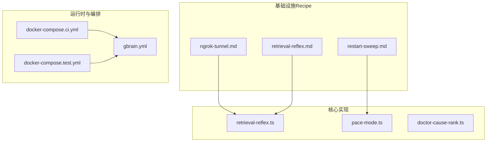
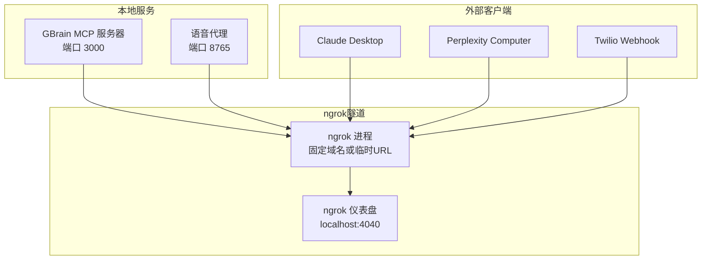
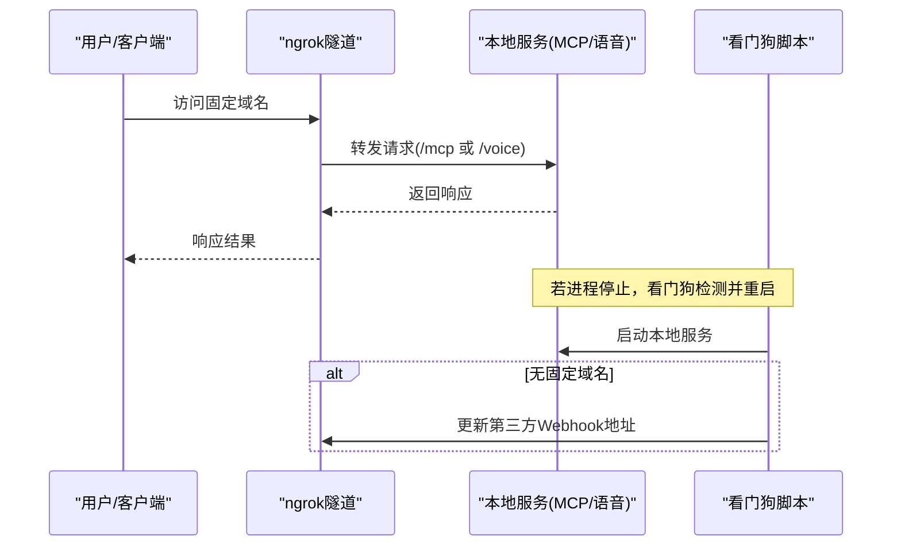
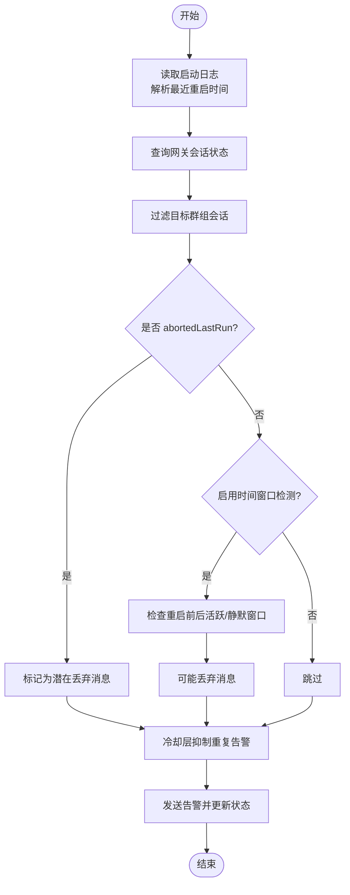
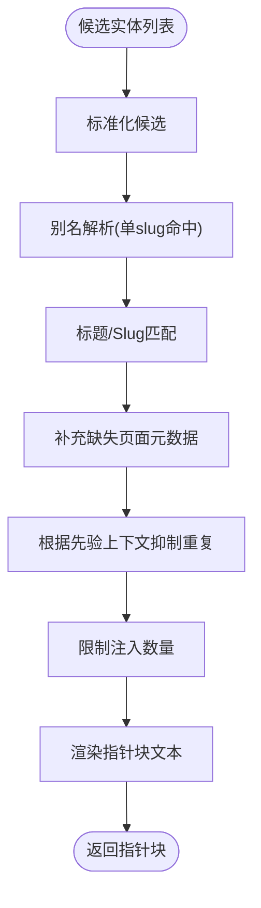
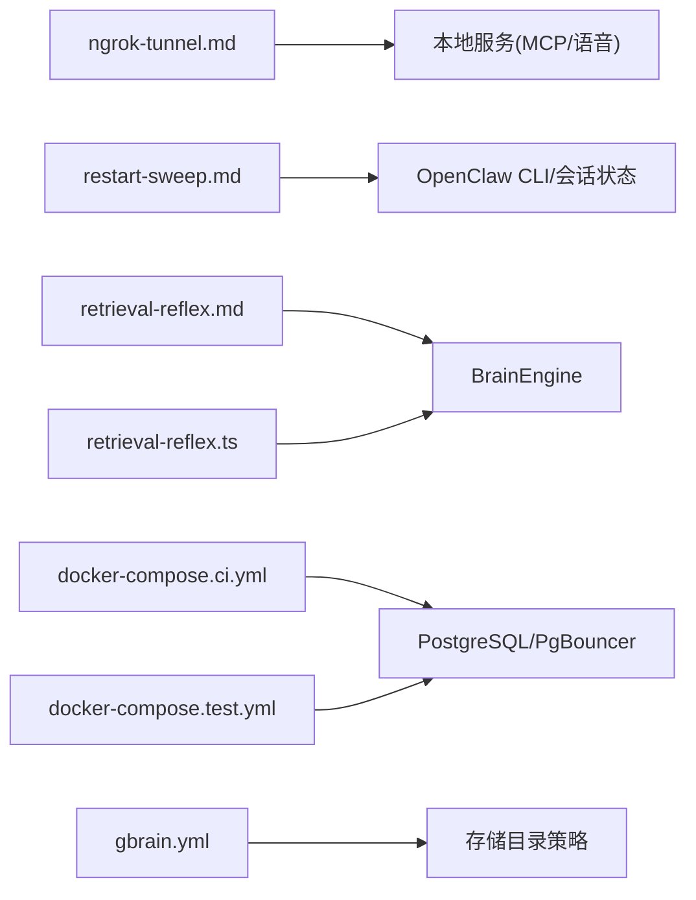

# 基础设施Recipe

<cite>
**本文引用的文件**
- [ngrok-tunnel.md](file://recipes/ngrok-tunnel.md)
- [restart-sweep.md](file://recipes/restart-sweep.md)
- [retrieval-reflex.md](file://recipes/retrieval-reflex.md)
- [retrieval-reflex.ts](file://src/core/context/retrieval-reflex.ts)
- [docker-compose.ci.yml](file://docker-compose.ci.yml)
- [docker-compose.test.yml](file://docker-compose.test.yml)
- [gbrain.yml](file://gbrain.yml)
- [pace-mode.ts](file://src/core/pace-mode.ts)
- [doctor-cause-rank.ts](file://src/core/doctor-cause-rank.ts)
- [restart-sweep.test.ts](file://test/restart-sweep.test.ts)
</cite>

## 目录
1. [简介](#简介)
2. [项目结构](#项目结构)
3. [核心组件](#核心组件)
4. [架构总览](#架构总览)
5. [详细组件分析](#详细组件分析)
6. [依赖关系分析](#依赖关系分析)
7. [性能考虑](#性能考虑)
8. [故障排查指南](#故障排查指南)
9. [结论](#结论)
10. [附录](#附录)

## 简介
本技术文档聚焦于基础设施Recipe，围绕以下主题展开：ngrok隧道与远程访问配置（端口转发、域名绑定、安全与健康检查）、重启扫描机制（实现原理与应用场景）、检索反射功能（配置与使用）、部署策略、监控与健康检查、性能调优以及不同环境下的配置差异与最佳实践。文档以仓库中的Recipe与核心实现为依据，提供可操作的步骤、可视化图示与排障指引。

## 项目结构
本仓库中与基础设施Recipe直接相关的核心位置如下：
- recipes：包含基础设施Recipe文档，如ngrok隧道、重启扫描、检索反射等
- src/core：包含检索反射的核心实现与上下文逻辑
- test：包含对重启扫描等Recipe的测试用例
- docker-compose.*.yml：容器化与数据库服务编排样例
- gbrain.yml：存储目录与版本控制策略配置

**图表来源**
- [ngrok-tunnel.md](file://recipes/ngrok-tunnel.md)
- [restart-sweep.md](file://recipes/restart-sweep.md)
- [retrieval-reflex.md](file://recipes/retrieval-reflex.md)
- [retrieval-reflex.ts](file://src/core/context/retrieval-reflex.ts)
- [pace-mode.ts](file://src/core/pace-mode.ts)
- [doctor-cause-rank.ts](file://src/core/doctor-cause-rank.ts)
- [docker-compose.ci.yml](file://docker-compose.ci.yml)
- [docker-compose.test.yml](file://docker-compose.test.yml)
- [gbrain.yml](file://gbrain.yml)

**章节来源**
- [ngrok-tunnel.md](file://recipes/ngrok-tunnel.md)
- [restart-sweep.md](file://recipes/restart-sweep.md)
- [retrieval-reflex.md](file://recipes/retrieval-reflex.md)
- [retrieval-reflex.ts](file://src/core/context/retrieval-reflex.ts)
- [docker-compose.ci.yml](file://docker-compose.ci.yml)
- [docker-compose.test.yml](file://docker-compose.test.yml)
- [gbrain.yml](file://gbrain.yml)

## 核心组件
- ngrok隧道与远程访问：提供固定域名的公网入口，支持路径路由到不同服务，并内置健康检查与看门狗模式
- 重启扫描：检测网关重启后被丢弃的消息，基于会话状态与时间窗口进行判定，带冷却抑制与告警输出
- 检索反射：在每轮对话中自动识别存在页面的实体并注入指针块，指导代理在需要时再主动获取页面内容
- 部署与监控：通过健康检查、日志与定时任务保障可用性；结合容器编排与超时参数优化稳定性
- 性能调优：通过节流模式（pace mode）与连接池参数控制并发与延迟，避免资源争用

**章节来源**
- [ngrok-tunnel.md](file://recipes/ngrok-tunnel.md)
- [restart-sweep.md](file://recipes/restart-sweep.md)
- [retrieval-reflex.md](file://recipes/retrieval-reflex.md)
- [retrieval-reflex.ts](file://src/core/context/retrieval-reflex.ts)
- [pace-mode.ts](file://src/core/pace-mode.ts)

## 架构总览
下图展示了基础设施Recipe在系统中的角色与交互：

**图表来源**
- [ngrok-tunnel.md](file://recipes/ngrok-tunnel.md)

**章节来源**
- [ngrok-tunnel.md](file://recipes/ngrok-tunnel.md)

## 详细组件分析

### 组件A：ngrok隧道与远程访问
- 端口转发与路径路由
  - 将本地服务（MCP服务器、语音代理）映射至ngrok隧道，通过路径区分不同服务（例如/mcp、/voice）
- 固定域名与健康检查
  - Hobby层级提供固定域名，避免每次重启导致URL变化
  - 提供进程与HTTP健康检查（进程名匹配、本地API端点）
- 安全与看门狗
  - 自动重启机制：若进程停止，看门狗脚本检测并启动，必要时更新第三方平台Webhook地址
  - 推荐使用cron或systemd定时任务保证开机自启
- 使用验证
  - 浏览器访问域名确认可达
  - 在客户端执行搜索/调用验证连通性
  - 故障模拟：断开ngrok，等待看门狗恢复并验证

**图表来源**
- [ngrok-tunnel.md](file://recipes/ngrok-tunnel.md)

**章节来源**
- [ngrok-tunnel.md](file://recipes/ngrok-tunnel.md)

### 组件B：重启扫描机制
- 实现原理
  - 从启动日志中解析最近一次重启时间，作为时间锚点
  - 读取网关会话状态，筛选目标群组的会话
  - 主信号：上一轮被中断的会话（abortedLastRun）
  - 可选次信号：重启前活跃、重启后静默的时间窗口检测（可开关）
  - 冷却层：按会话键抑制重复告警，避免日志风暴
  - 输出：向Telegram或标准输出发送告警，并记录状态文件
- 应用场景
  - 网关重启后，Webhook消息可能丢失，该机制用于发现并提醒
  - 适用于长期运行且依赖Webhook的群组机器人
- 关键流程

**图表来源**
- [restart-sweep.md](file://recipes/restart-sweep.md)

**章节来源**
- [restart-sweep.md](file://recipes/restart-sweep.md)
- [restart-sweep.test.ts](file://test/restart-sweep.test.ts)

### 组件C：检索反射（Retrieval Reflex）
- 功能概述
  - 在每轮对话中识别存在页面的实体，生成“指针块”（包含显示名、slug、简述），注入系统提示，引导代理在需要时再主动获取页面
  - 解析策略包含别名优先、标题精确匹配、slug后缀匹配，具备隐私边界（摘要来自受保护字段或清理后的正文）
- 核心流程

**图表来源**
- [retrieval-reflex.ts](file://src/core/context/retrieval-reflex.ts)

**章节来源**
- [retrieval-reflex.md](file://recipes/retrieval-reflex.md)
- [retrieval-reflex.ts](file://src/core/context/retrieval-reflex.ts)

## 依赖关系分析
- ngrok隧道依赖本地服务进程与第三方平台（如Twilio）的Webhook配置
- 重启扫描依赖网关CLI与会话状态，同时依赖定时任务确保持续监控
- 检索反射依赖脑引擎的解析能力与隐私边界处理函数
- 容器编排与数据库服务为整体运行提供稳定环境

**图表来源**
- [ngrok-tunnel.md](file://recipes/ngrok-tunnel.md)
- [restart-sweep.md](file://recipes/restart-sweep.md)
- [retrieval-reflex.md](file://recipes/retrieval-reflex.md)
- [retrieval-reflex.ts](file://src/core/context/retrieval-reflex.ts)
- [docker-compose.ci.yml](file://docker-compose.ci.yml)
- [docker-compose.test.yml](file://docker-compose.test.yml)
- [gbrain.yml](file://gbrain.yml)

**章节来源**
- [ngrok-tunnel.md](file://recipes/ngrok-tunnel.md)
- [restart-sweep.md](file://recipes/restart-sweep.md)
- [retrieval-reflex.md](file://recipes/retrieval-reflex.md)
- [retrieval-reflex.ts](file://src/core/context/retrieval-reflex.ts)
- [docker-compose.ci.yml](file://docker-compose.ci.yml)
- [docker-compose.test.yml](file://docker-compose.test.yml)
- [gbrain.yml](file://gbrain.yml)

## 性能考虑
- 节流模式（Pace Mode）
  - 通过最大并发、延迟阈值、睡眠上限与EWMA平滑因子控制数据库写入节奏，避免连接池饥饿
  - 支持多档位（关闭/温和/平衡/激进），并允许配置表与环境变量覆盖
- 会话超时与连接检查
  - 通过环境变量设置语句超时、空闲事务超时与客户端连接检查间隔，提升长事务稳定性
- 数据库连接池
  - CI编排中使用PgBouncer事务模式，隔离不同分片，减少竞争
- 存储策略
  - gbrain.yml定义了版本控制与仅数据库持久化的目录清单，便于备份与恢复

**章节来源**
- [pace-mode.ts](file://src/core/pace-mode.ts)
- [docker-compose.ci.yml](file://docker-compose.ci.yml)
- [docker-compose.test.yml](file://docker-compose.test.yml)
- [gbrain.yml](file://gbrain.yml)

## 故障排查指南
- ngrok隧道
  - 看门狗未生效：检查cron/systemd任务是否正确加载环境变量与可执行路径
  - 固定域名变更：Hobby层级提供固定域名；免费层级URL随重启变化，需手动更新第三方Webhook
  - 健康检查失败：确认进程名匹配与本地API端点可达
- 重启扫描
  - 告警频繁或不触发：检查冷却层状态文件、启动日志路径、会话状态CLI可用性
  - Telegram告警失败：核对机器人令牌、群组ID与线程ID；尝试手动发送测试消息
  - Cron环境问题：wrapper脚本显式加载.env并设置PATH，避免“命令未找到”
- 检索反射
  - 指针块为空：确认候选实体解析、页面存在性与隐私边界摘要生成逻辑
  - 多轮抑制异常：检查“仅slug抑制”模式与先验上下文拼接范围
- 健康检查排序
  - gbrain doctor的检查项按根因优先级排序，便于快速定位真实原因

**章节来源**
- [ngrok-tunnel.md](file://recipes/ngrok-tunnel.md)
- [restart-sweep.md](file://recipes/restart-sweep.md)
- [retrieval-reflex.ts](file://src/core/context/retrieval-reflex.ts)
- [doctor-cause-rank.ts](file://src/core/doctor-cause-rank.ts)

## 结论
基础设施Recipe为远程访问、消息可靠性与检索决策提供了关键支撑。通过固定域名的ngrok隧道、可靠的看门狗与健康检查、针对重启场景的扫描告警，以及零LLM的检索反射，系统在易用性与稳定性之间取得平衡。配合容器化编排、节流模式与超时参数，可在不同环境中实现可预期的性能与可观测性。

## 附录
- 不同环境下的配置差异与最佳实践
  - 开发/本地：使用免费ngrok，便于快速验证；生产/线上：升级Hobby层级获得固定域名
  - 定时任务：统一使用wrapper脚本加载环境变量与PATH，避免cron默认环境差异
  - 并发与延迟：根据数据库负载选择合适的Pace Mode档位，必要时调整连接池参数
  - 存储策略：遵循gbrain.yml的目录划分，确保可恢复性与一致性