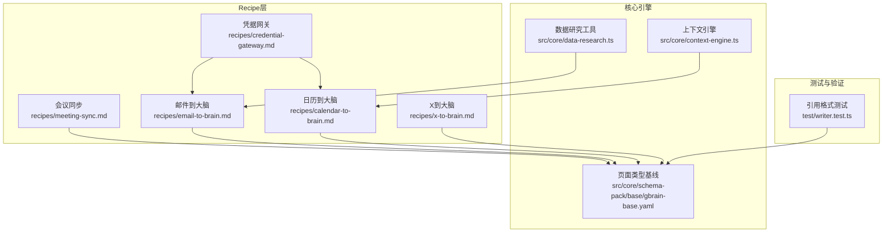
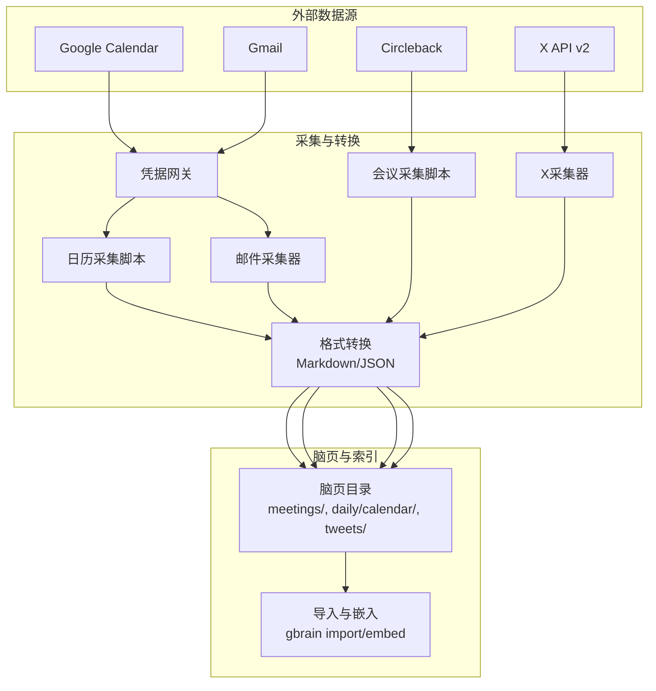
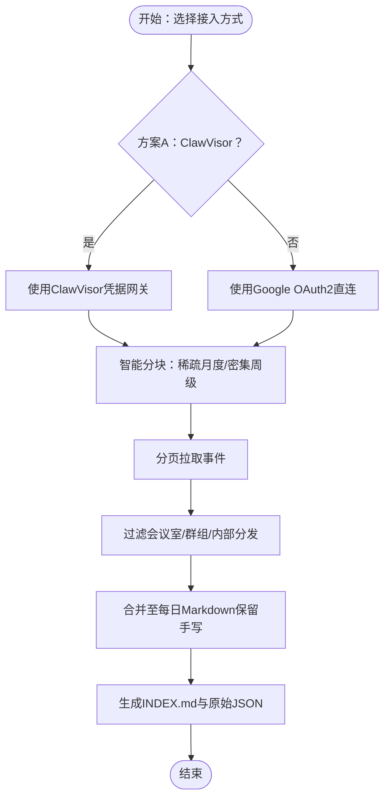
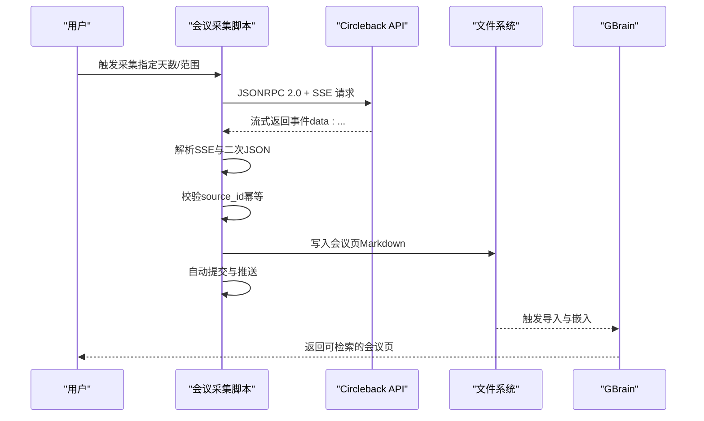
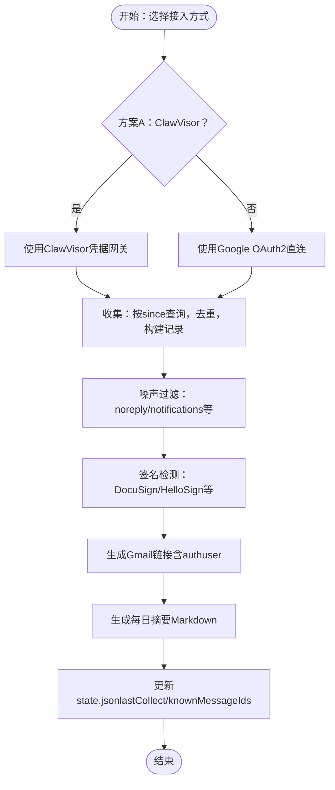
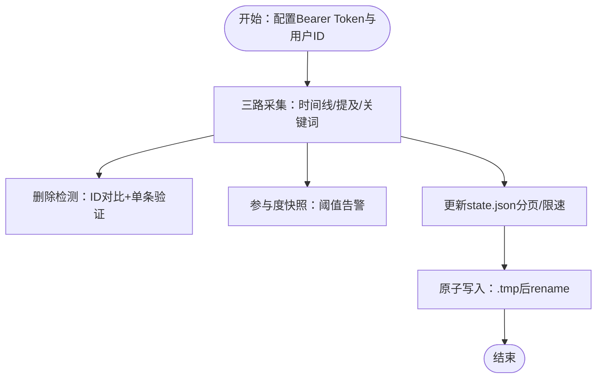
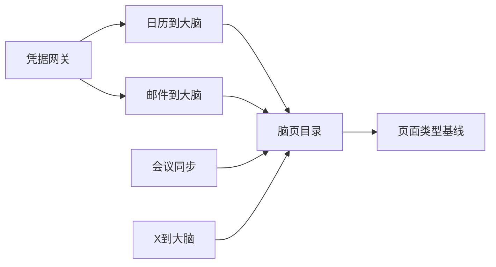

# 数据同步Recipe

<cite>
**本文引用的文件**
- [calendar-to-brain.md](file://recipes/calendar-to-brain.md)
- [meeting-sync.md](file://recipes/meeting-sync.md)
- [email-to-brain.md](file://recipes/email-to-brain.md)
- [x-to-brain.md](file://recipes/x-to-brain.md)
- [credential-gateway.md](file://recipes/credential-gateway.md)
- [context-engine.ts](file://src/core/context-engine.ts)
- [data-research.ts](file://src/core/data-research.ts)
- [writer.test.ts](file://test/writer.test.ts)
- [gbrain-base.yaml](file://src/core/schema-pack/base/gbrain-base.yaml)
</cite>

## 目录
1. [简介](#简介)
2. [项目结构](#项目结构)
3. [核心组件](#核心组件)
4. [架构总览](#架构总览)
5. [详细组件分析](#详细组件分析)
6. [依赖关系分析](#依赖关系分析)
7. [性能考量](#性能考量)
8. [故障排除指南](#故障排除指南)
9. [结论](#结论)
10. [附录](#附录)

## 简介
本技术文档围绕“数据同步Recipe”展开，系统性阐述四类数据源的接入与同步机制：日历到大脑（Google Calendar）、会议同步（Circleback）、邮件到大脑（Gmail）以及社交媒体数据同步（X/Twitter）。文档覆盖接入方式、数据格式转换、增量同步策略、配置参数、安全考虑、常见集成示例与故障排除，并给出性能优化与批量处理建议。

## 项目结构
- Recipe层：recipes目录下提供四个Recipe文档，分别定义了各数据源的接入流程、输出格式、健康检查与成本估算。
- 核心引擎与基础设施：src/core中包含上下文解析、日期窗口化等通用能力；测试用例验证引用格式与页面类型等。
- 集成前置条件：credential-gateway为依赖项，统一管理Google服务的凭据网关（ClawVisor或直接OAuth）。

**图表来源**
- [calendar-to-brain.md:57-73](file://recipes/calendar-to-brain.md#L57-L73)
- [meeting-sync.md:49-69](file://recipes/meeting-sync.md#L49-L69)
- [email-to-brain.md:63-80](file://recipes/email-to-brain.md#L63-L80)
- [x-to-brain.md:46-68](file://recipes/x-to-brain.md#L46-L68)
- [credential-gateway.md:35-44](file://recipes/credential-gateway.md#L35-L44)
- [context-engine.ts:401-430](file://src/core/context-engine.ts#L401-L430)
- [data-research.ts:334-368](file://src/core/data-research.ts#L334-L368)
- [gbrain-base.yaml:397-417](file://src/core/schema-pack/base/gbrain-base.yaml#L397-L417)
- [writer.test.ts:84-117](file://test/writer.test.ts#L84-L117)

**章节来源**
- [calendar-to-brain.md:1-405](file://recipes/calendar-to-brain.md#L1-L405)
- [meeting-sync.md:1-388](file://recipes/meeting-sync.md#L1-L388)
- [email-to-brain.md:1-342](file://recipes/email-to-brain.md#L1-L342)
- [x-to-brain.md:1-450](file://recipes/x-to-brain.md#L1-L450)
- [credential-gateway.md:1-189](file://recipes/credential-gateway.md#L1-L189)

## 核心组件
- 凭据网关（Credential Gateway）
  - 支持ClawVisor统一代理与直接Google OAuth两种模式，负责OAuth授权、令牌刷新与加密存储。
  - 健康检查通过HTTP可达性或环境变量存在性验证。
- 日历到大脑（Calendar-to-Brain）
  - 输出每日Markdown文件，按日期聚合事件、参会者与地点；支持历史回填与每周增量同步。
  - 提供智能分块（稀疏期月度、密集期周级）、参会者过滤、合并现有文件保留手写内容等生产级特性。
- 会议同步（Meeting Sync）
  - 从Circleback拉取已完成会议，生成带前置信息的会议页，支持SSE流式响应解析、幂等性校验与自动标签推断。
- 邮件到大脑（Email-to-Brain）
  - 结构化消息JSON与Agent可读摘要双轨输出；确定性噪声过滤、签名检测、Gmail链接生成与去重。
- 社交媒体数据同步（X到大脑）
  - 三路采集（时间线、提及、关键词），删除检测、参与度速率监控、原子写入与限速处理；支持OCR增强与实时流监控。

**章节来源**
- [credential-gateway.md:1-189](file://recipes/credential-gateway.md#L1-L189)
- [calendar-to-brain.md:286-405](file://recipes/calendar-to-brain.md#L286-L405)
- [meeting-sync.md:239-388](file://recipes/meeting-sync.md#L239-L388)
- [email-to-brain.md:240-342](file://recipes/email-to-brain.md#L240-L342)
- [x-to-brain.md:303-450](file://recipes/x-to-brain.md#L303-L450)

## 架构总览
四类Recipe均遵循“确定性数据采集 + LLM判断”的分层模式：
- 数据采集层：Node脚本或API调用，保证幂等、可重复与可审计。
- 内容格式层：标准化Markdown或JSON，确保后续索引与检索一致。
- 脑页填充层：Agent基于实体识别、关系追踪与行动项提取进行知识注入。

**图表来源**
- [calendar-to-brain.md:57-73](file://recipes/calendar-to-brain.md#L57-L73)
- [email-to-brain.md:63-80](file://recipes/email-to-brain.md#L63-L80)
- [meeting-sync.md:49-69](file://recipes/meeting-sync.md#L49-L69)
- [x-to-brain.md:46-68](file://recipes/x-to-brain.md#L46-L68)

## 详细组件分析

### 日历到大脑（Calendar-to-Brain）
- 接入方式
  - 方案A：ClawVisor统一代理，自动处理OAuth与令牌刷新，推荐用于多Google服务场景。
  - 方案B：直接Google OAuth2，自行管理令牌。
- 数据格式与输出
  - 每日Markdown文件，包含日期标题、事件列表（时间、主题、参会者、地点、标签）。
  - 原始API响应保存在.raw目录，便于溯源。
- 增量同步机制
  - 智能分块：稀疏期（如2014-2023）采用月度分块，密集期采用周级分块，避免空查询。
  - 参会者过滤：剔除会议室、群组与内部分发列表，仅保留真实人员。
  - 合并策略：仅替换“## Calendar”段落，保留其他手写内容。
  - 时间解析：区分全天与定时事件，处理ISO时标与12小时制显示。
- 配置参数与安全
  - 环境变量：CLAWVISOR_URL、CLAWVISOR_AGENT_TOKEN、GOOGLE_CLIENT_ID、GOOGLE_CLIENT_SECRET。
  - 安全建议：ClawVisor模式无需本地存储密钥；OAuth模式需妥善保管令牌文件权限。
- 常见问题
  - 无事件返回：检查账户邮箱、ClawVisor服务激活与任务目的描述是否足够宽泛。
  - 参会者姓名缺失：确认从参会者对象提取显示名，必要时回退到邮箱前缀。
  - 重复事件：脚本幂等，多次运行应保持相同输出；若出现重复，检查合并逻辑。

**图表来源**
- [calendar-to-brain.md:290-350](file://recipes/calendar-to-brain.md#L290-L350)

**章节来源**
- [calendar-to-brain.md:101-285](file://recipes/calendar-to-brain.md#L101-L285)
- [calendar-to-brain.md:286-405](file://recipes/calendar-to-brain.md#L286-L405)

### 会议同步（Meeting Sync）
- 接入方式
  - Circleback API（JSONRPC 2.0 over HTTP + SSE），需Bearer Token。
- 数据格式与输出
  - 会议页Markdown，包含前置信息（source_id、date、duration、attendees、location、tags）与正文（关键点、行动项、转录）。
- 增量同步机制
  - SSE流式解析：剥离"data: "前缀后二次JSON解析，提取结果文本并再次解析为JSON。
  - 幂等性：以source_id与文件名双重校验，避免重复创建。
  - 自动标签：根据会议名称关键字推断标签（如standup、1on1、board）。
  - Git提交：新会议创建后自动提交并推送，触发Live同步。
- 配置参数与安全
  - 环境变量：CIRCLEBACK_TOKEN。
  - 安全建议：Token最小权限，定期轮换。
- 常见问题
  - 无会议：检查Circleback是否有录制记录，机器人是否加入会议。
  - 转录为空：部分会议可能无音频或机器人被移除。
  - 重复会议：幂等性检查失败，需清理重复文件后重试。

**图表来源**
- [meeting-sync.md:243-287](file://recipes/meeting-sync.md#L243-L287)

**章节来源**
- [meeting-sync.md:114-238](file://recipes/meeting-sync.md#L114-L238)
- [meeting-sync.md:239-388](file://recipes/meeting-sync.md#L239-L388)

### 邮件到大脑（Email-to-Brain）
- 接入方式
  - 支持ClawVisor、Google OAuth或内置Hermes网关。
- 数据格式与输出
  - 结构化消息JSON与每日摘要Markdown，摘要按“待处理签名、待分类邮件、噪声”分组。
- 增量同步机制
  - 去重：基于messageId与已知ID集合，避免重复处理。
  - 噪声过滤：确定性规则（noreply、notifications等）与签名请求模式匹配。
  - Gmail链接：由代码生成，包含authuser参数，确保正确账户打开。
  - 状态持久化：lastCollect时间戳与knownMessageIds写入state.json。
- 配置参数与安全
  - 环境变量：CLAWVISOR_URL、CLAWVISOR_AGENT_TOKEN、GOOGLE_CLIENT_ID、GOOGLE_CLIENT_SECRET。
  - 安全建议：ClawVisor模式无需本地密钥；OAuth模式注意令牌有效期与刷新。
- 常见问题
  - 无邮件：检查ClawVisor健康状态、任务目的是否过窄、API是否启用。
  - 链接失效：确认authuser与账户匹配，需登录对应Google账号。
  - 摘要为空：检查消息JSON是否存在，或全部被噪声过滤。

**图表来源**
- [email-to-brain.md:244-319](file://recipes/email-to-brain.md#L244-L319)

**章节来源**
- [email-to-brain.md:100-239](file://recipes/email-to-brain.md#L100-L239)
- [email-to-brain.md:240-342](file://recipes/email-to-brain.md#L240-L342)

### 社交媒体数据同步（X到大脑）
- 接入方式
  - X API v2 Bearer Token认证，支持时间线、提及与关键词搜索三路采集。
- 数据格式与输出
  - Tweet JSON、删除检测记录、参与度快照与state.json。
- 增量同步机制
  - 删除检测：比较前后ID集，对缺失且近期内的Tweet进行单条验证，404确认删除。
  - 参与度速率：对点赞/转发/回复快照进行阈值告警（倍增或绝对跳变）。
  - 限速处理：跟踪各端点剩余配额与重置时间，预留最小额度保障其他流正常运行。
  - 原子写入：先写.tmp再rename，避免崩溃导致的数据损坏。
- 配置参数与安全
  - 环境变量：X_BEARER_TOKEN。
  - 安全建议：Bearer Token最小权限，Basic Tier以上解锁搜索与更高限额。
- 常见问题
  - 403：检查应用访问级别（只读/读写），部分端点需要Basic或Pro。
  - 429：频繁限速时延长采集间隔，检查state.json中的限速跟踪。
  - 无推文：核对用户ID（数字而非用户名），验证Bearer Token有效性。

**图表来源**
- [x-to-brain.md:307-398](file://recipes/x-to-brain.md#L307-L398)

**章节来源**
- [x-to-brain.md:94-210](file://recipes/x-to-brain.md#L94-L210)
- [x-to-brain.md:303-450](file://recipes/x-to-brain.md#L303-L450)

## 依赖关系分析
- 依赖链
  - 日历与邮件Recipe依赖credential-gateway提供统一凭据入口。
  - 会议与X Recipe各自独立，但都遵循“采集-转换-脑页”的通用模式。
- 页面类型与目录
  - 会议页位于meetings/目录，符合schema-pack基线定义。
  - 日历页位于daily/calendar/目录，X页位于tweets/目录，均面向检索与交叉引用。

**图表来源**
- [credential-gateway.md:35-44](file://recipes/credential-gateway.md#L35-L44)
- [gbrain-base.yaml:397-417](file://src/core/schema-pack/base/gbrain-base.yaml#L397-L417)

**章节来源**
- [credential-gateway.md:1-189](file://recipes/credential-gateway.md#L1-L189)
- [gbrain-base.yaml:397-417](file://src/core/schema-pack/base/gbrain-base.yaml#L397-L417)

## 性能考量
- 分块与限速
  - 日历：稀疏期月度、密集期周级分块，减少API调用次数与空查询。
  - X：Basic Tier限速明确，预留最小额度，避免阻塞其他流。
- 去重与幂等
  - 邮件与会议均以messageId/source_id为基准，避免重复处理。
- 批量与原子写入
  - X采用原子写入，降低崩溃风险；会议采集后自动提交，提升Live同步效率。
- 引用与索引
  - 测试用例验证引用格式一致性，确保跨源引用稳定可靠。

**章节来源**
- [calendar-to-brain.md:290-350](file://recipes/calendar-to-brain.md#L290-L350)
- [x-to-brain.md:380-398](file://recipes/x-to-brain.md#L380-L398)
- [meeting-sync.md:270-287](file://recipes/meeting-sync.md#L270-L287)
- [writer.test.ts:84-117](file://test/writer.test.ts#L84-L117)

## 故障排除指南
- 日历到大脑
  - 无事件：检查账户邮箱、ClawVisor服务激活与任务目的描述。
  - 参会者姓名缺失：确认显示名提取与回退策略。
  - 重复事件：确认幂等与合并逻辑。
- 会议同步
  - 无会议：确认Circleback有录制记录与机器人加入。
  - 转录为空：检查会议状态。
  - 重复会议：清理重复文件后重试。
- 邮件到大脑
  - 无邮件：检查ClawVisor健康、任务目的与API启用。
  - 链接失效：确认authuser与账户匹配。
  - 摘要为空：检查消息JSON与噪声过滤规则。
- X到大脑
  - 403：检查应用访问级别与端点权限。
  - 429：延长采集间隔，检查限速跟踪。
  - 无推文：核对用户ID与Bearer Token。

**章节来源**
- [calendar-to-brain.md:389-405](file://recipes/calendar-to-brain.md#L389-L405)
- [meeting-sync.md:373-388](file://recipes/meeting-sync.md#L373-L388)
- [email-to-brain.md:328-342](file://recipes/email-to-brain.md#L328-L342)
- [x-to-brain.md:434-450](file://recipes/x-to-brain.md#L434-L450)

## 结论
本Recipe体系通过“确定性采集 + LLM判断”的分层设计，实现了日历、会议、邮件与社交媒体数据的高效同步与知识注入。凭据网关统一管理外部服务访问，页面类型基线确保跨源一致性，测试用例保障引用与页面结构的稳定性。结合智能分块、幂等性与原子写入等工程实践，可在保证可靠性的同时显著降低运维成本。

## 附录
- 健康检查与成本估算
  - 日历/邮件：ClawVisor健康检查或OAuth凭据存在性检查。
  - 会议：Circleback API可用性与Token有效性检查。
  - X：Bearer Token认证与用户信息接口验证。
  - 成本：多数场景免费，高级Tier用于扩展搜索与更高限额。

**章节来源**
- [calendar-to-brain.md:21-32](file://recipes/calendar-to-brain.md#L21-L32)
- [meeting-sync.md:8-22](file://recipes/meeting-sync.md#L8-L22)
- [email-to-brain.md:21-32](file://recipes/email-to-brain.md#L21-L32)
- [x-to-brain.md:12-19](file://recipes/x-to-brain.md#L12-L19)