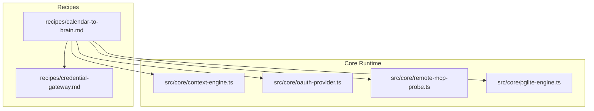
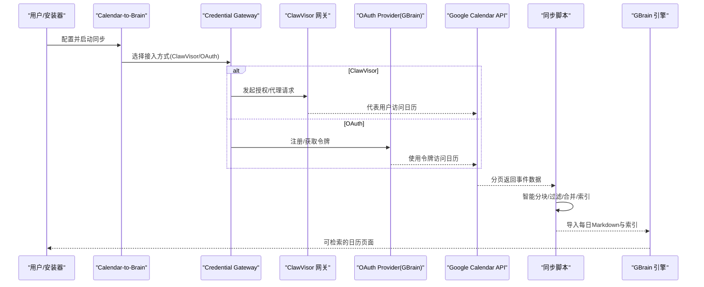
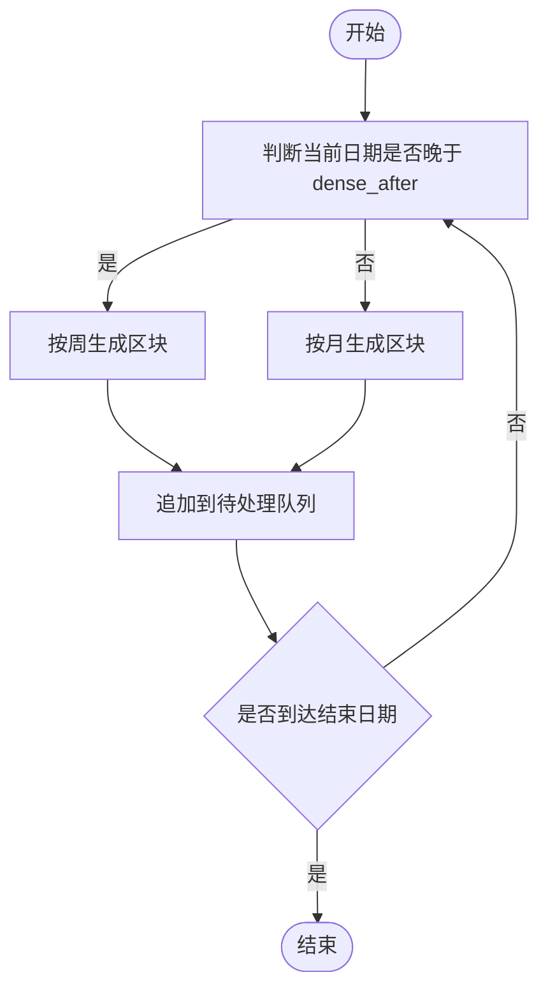
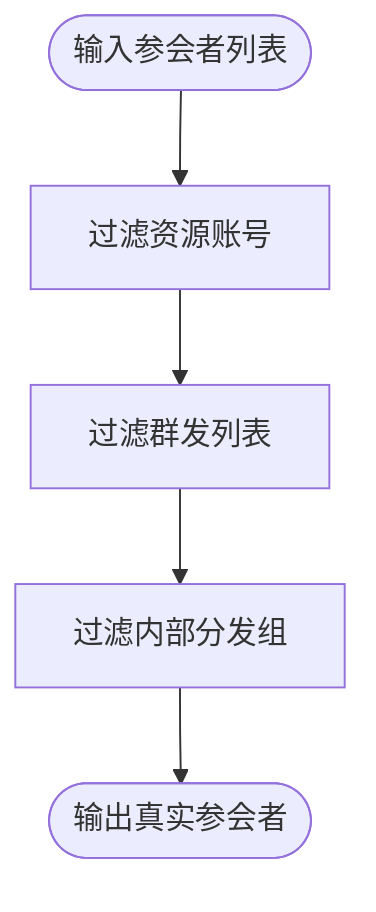
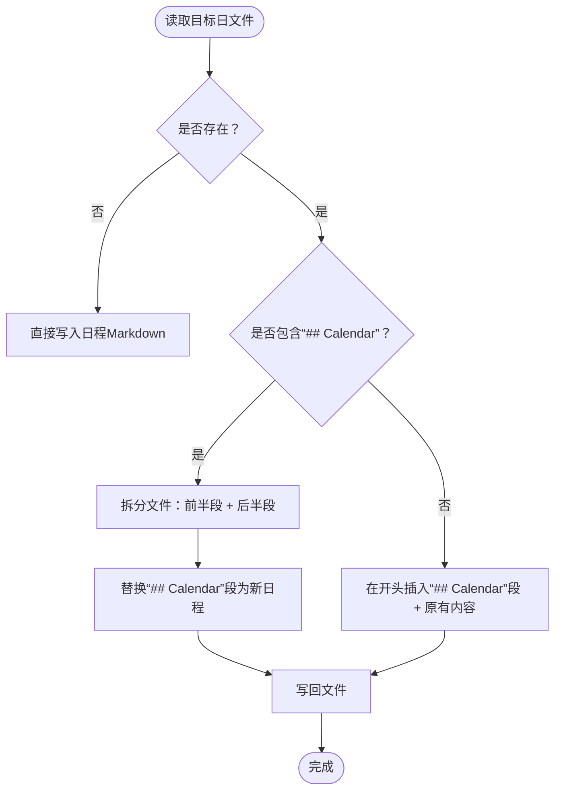
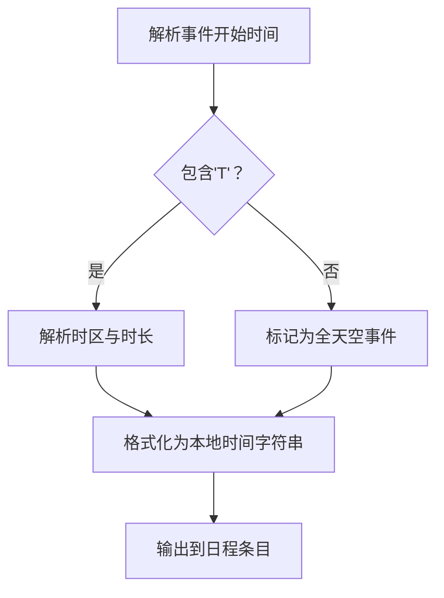
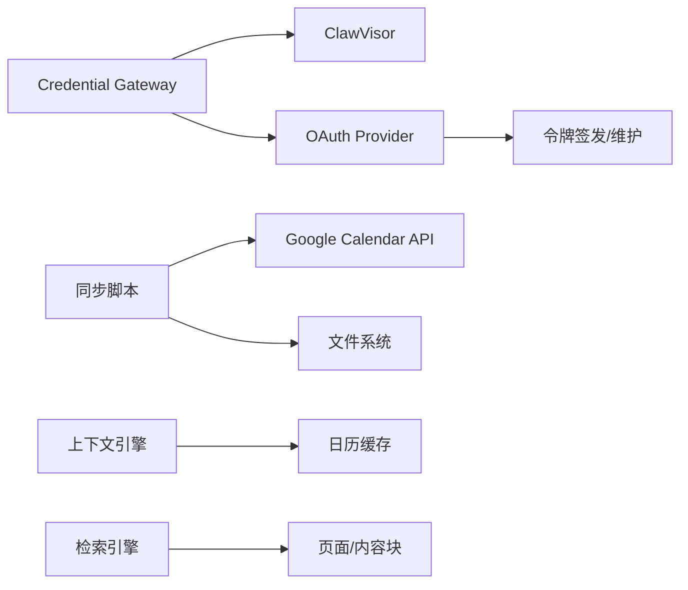

# 日历同步Recipe

<cite>
**本文引用的文件**
- [calendar-to-brain.md](file://recipes/calendar-to-brain.md)
- [credential-gateway.md](file://recipes/credential-gateway.md)
- [context-engine.ts](file://src/core/context-engine.ts)
- [oauth-provider.ts](file://src/core/oauth-provider.ts)
- [remote-mcp-probe.ts](file://src/core/remote-mcp-probe.ts)
- [pglite-engine.ts](file://src/core/pglite-engine.ts)
</cite>

## 目录
1. [简介](#简介)
2. [项目结构](#项目结构)
3. [核心组件](#核心组件)
4. [架构总览](#架构总览)
5. [详细组件分析](#详细组件分析)
6. [依赖关系分析](#依赖关系分析)
7. [性能考量](#性能考量)
8. [故障排除指南](#故障排除指南)
9. [结论](#结论)
10. [附录](#附录)

## 简介
本技术文档面向“日历同步Recipe”，系统性阐述从Google Calendar到GBrain的同步实现原理与最佳实践，覆盖以下关键主题：
- 接入方式：ClawVisor网关认证与OAuth2直接认证两种路径
- 智能分块策略：稀疏期（sparse）与稠密期（dense）的时间窗口划分
- 参会者过滤机制：去除资源账号、群发列表等非人员实体
- 每日文件合并逻辑：保留既有手写内容，仅更新日程部分
- 日期时间解析的边缘情况处理：全天空与有时空事件、时区转换与格式化
- 配置参数说明、成本估算与故障排除
- 历史回填、增量同步与每周同步的最佳实践

## 项目结构
与日历同步相关的核心位置如下：
- recipes：定义Recipe与使用说明（含ClawVisor与OAuth2两种接入方式）
- src/core：运行时上下文引擎、OAuth服务端能力、远程探测与PGlite检索引擎
- 测试与示例：验证时间解析、活动识别、搜索排序等行为

图表来源
- [calendar-to-brain.md:1-405](file://recipes/calendar-to-brain.md#L1-L405)
- [credential-gateway.md:1-189](file://recipes/credential-gateway.md#L1-L189)
- [context-engine.ts:400-709](file://src/core/context-engine.ts#L400-L709)
- [oauth-provider.ts:57-353](file://src/core/oauth-provider.ts#L57-L353)
- [remote-mcp-probe.ts:55-87](file://src/core/remote-mcp-probe.ts#L55-L87)
- [pglite-engine.ts:1536-1767](file://src/core/pglite-engine.ts#L1536-L1767)

章节来源
- [calendar-to-brain.md:1-405](file://recipes/calendar-to-brain.md#L1-L405)
- [credential-gateway.md:1-189](file://recipes/credential-gateway.md#L1-L189)
- [context-engine.ts:400-709](file://src/core/context-engine.ts#L400-L709)
- [oauth-provider.ts:57-353](file://src/core/oauth-provider.ts#L57-L353)
- [remote-mcp-probe.ts:55-87](file://src/core/remote-mcp-probe.ts#L55-L87)
- [pglite-engine.ts:1536-1767](file://src/core/pglite-engine.ts#L1536-L1767)

## 核心组件
- 接入层（Credential Gateway）
  - 支持ClawVisor网关或直接OAuth2两种模式；前者由ClawVisor代理授权与刷新，后者由脚本自行管理令牌。
- 同步脚本（Calendar-to-Brain）
  - 实现智能分块、参会者过滤、每日Markdown生成与合并、索引生成与原始响应保存。
- 上下文引擎（Context Engine）
  - 提供“当前/即将”日程解析与提示注入，支持全天空事件过滤与时间格式化。
- OAuth Provider（GBrain）
  - 提供OAuth客户端注册、令牌签发与维护能力，支撑内部令牌链路与外部集成。
- 检索引擎（PGlite）
  - 提供按日期范围、类型、来源等条件的检索能力，支持时间线优先排序。

章节来源
- [credential-gateway.md:1-189](file://recipes/credential-gateway.md#L1-L189)
- [calendar-to-brain.md:286-405](file://recipes/calendar-to-brain.md#L286-L405)
- [context-engine.ts:400-599](file://src/core/context-engine.ts#L400-L599)
- [oauth-provider.ts:344-989](file://src/core/oauth-provider.ts#L344-L989)
- [pglite-engine.ts:1536-1767](file://src/core/pglite-engine.ts#L1536-L1767)

## 架构总览
下图展示从Google Calendar到GBrain的端到端流程，涵盖两种接入路径与关键处理节点。

图表来源
- [calendar-to-brain.md:57-73](file://recipes/calendar-to-brain.md#L57-L73)
- [credential-gateway.md:55-96](file://recipes/credential-gateway.md#L55-L96)
- [oauth-provider.ts:344-989](file://src/core/oauth-provider.ts#L344-L989)
- [context-engine.ts:400-599](file://src/core/context-engine.ts#L400-L599)

## 详细组件分析

### 接入方式一：ClawVisor网关认证
- 适用场景
  - 无需管理OAuth令牌，由ClawVisor统一代理授权、刷新与加密。
- 关键点
  - Health检查：通过网关健康端点确认可达性。
  - 任务目的：需具备广泛用途描述以避免被意图校验拦截。
  - 多账户：网关自动处理多个Google账户的授权与数据聚合。
- 安全与可用性
  - 令牌生命周期与刷新由ClawVisor负责，减少本地存储风险。

章节来源
- [credential-gateway.md:70-96](file://recipes/credential-gateway.md#L70-L96)
- [calendar-to-brain.md:123-141](file://recipes/calendar-to-brain.md#L123-L141)

### 接入方式二：OAuth2直接认证
- 适用场景
  - 不希望引入第三方网关，自行管理OAuth令牌。
- 关键点
  - 客户端ID/密钥：在Google Cloud Console创建OAuth客户端，启用所需API。
  - 初次授权：打开浏览器完成同意流程，换取授权码并交换访问/刷新令牌。
  - 令牌持久化：存储于本地安全位置，支持自动刷新。
- 安全与可用性
  - 访问令牌约1小时过期，刷新令牌长期有效但可撤销；应妥善保管并限制权限范围。

章节来源
- [credential-gateway.md:98-142](file://recipes/credential-gateway.md#L98-L142)
- [calendar-to-brain.md:143-183](file://recipes/calendar-to-brain.md#L143-L183)

### 智能分块策略（稀疏期 vs 稠密期）
- 目标
  - 在历史回填阶段平衡API调用次数与数据完整性。
- 策略
  - 稀疏期（例如2014-2023）：按月分块，避免对空月份的无效查询。
  - 稠密期（例如2023年之后）：按周分块，确保近期事件及时同步。
- 参数
  - dense_after：用于界定稀疏期与稠密期的分界日期。
  - per-calendar startYear：避免对未创建之前的年份发起查询。

图表来源
- [calendar-to-brain.md:290-312](file://recipes/calendar-to-brain.md#L290-L312)

章节来源
- [calendar-to-brain.md:290-312](file://recipes/calendar-to-brain.md#L290-L312)

### 参会者过滤机制
- 目标
  - 过滤掉会议室、群发列表等非人员实体，仅保留真实参会人。
- 规则
  - 排除邮箱域包含“resource.calendar.google.com”的实体。
  - 排除邮箱域包含“group.calendar.google.com”的实体。
  - 排除名称前缀为特定内部分发组的实体（如“YC-SF-”）。
- 输出
  - 最终仅保留人类姓名，避免污染日程摘要。

图表来源
- [calendar-to-brain.md:313-326](file://recipes/calendar-to-brain.md#L313-L326)

章节来源
- [calendar-to-brain.md:313-326](file://recipes/calendar-to-brain.md#L313-L326)

### 每日文件合并逻辑（保留手写内容）
- 目标
  - 在重新同步时保留用户手写的备注与笔记，仅替换日程部分。
- 策略
  - 若目标日文件已存在且包含“## Calendar”标题，则仅替换该节内容，其余保持不变。
  - 若不存在该标题，则在文件开头插入“## Calendar”节，并在下方追加原有内容。
- 边界
  - 严格限定只修改“## Calendar”段落，其他内容（如“## Notes”）不被改动。

图表来源
- [calendar-to-brain.md:327-350](file://recipes/calendar-to-brain.md#L327-L350)

章节来源
- [calendar-to-brain.md:327-350](file://recipes/calendar-to-brain.md#L327-L350)

### 日期时间解析的边缘情况处理
- 全天空事件
  - 以“YYYY-MM-DD”形式出现，不含“T”，需单独处理并排在当日首位。
- 有时空事件
  - 以“YYYY-MM-DDTHH:mm:ss±HH:MM”形式出现，需解析时区与时长。
- 时间格式化
  - 将ISO字符串转换为12小时制本地时间字符串，处理边界：00:00显示为12:00 AM，12:00为12:00 PM。
- 当前/即将事件识别
  - 上下文引擎会跳过全天空事件，过滤无摘要或“在家/外出”等占位事件，仅保留有意义的会议。

图表来源
- [calendar-to-brain.md:351-366](file://recipes/calendar-to-brain.md#L351-L366)
- [context-engine.ts:400-599](file://src/core/context-engine.ts#L400-L599)

章节来源
- [calendar-to-brain.md:351-366](file://recipes/calendar-to-brain.md#L351-L366)
- [context-engine.ts:400-599](file://src/core/context-engine.ts#L400-L599)

### 同步脚本与导入流程
- 历史回填
  - 使用智能分块策略进行大规模历史数据拉取，生成每日Markdown与索引文件。
- 增量同步
  - 每周执行一次，覆盖最近一周的日期范围，避免过度API调用。
- 导入与嵌入
  - 将生成的目录导入GBrain，随后对新增/变更内容进行嵌入。

章节来源
- [calendar-to-brain.md:218-274](file://recipes/calendar-to-brain.md#L218-L274)

### 上下文引擎中的日程解析与提示注入
- 解析逻辑
  - 跳过全天空事件与无摘要/占位事件；计算当前进行中与未来4小时内即将开始的事件。
- 提示注入
  - 将当前/即将事件与时间、地点、行程等信息注入到系统提示中，辅助Agent决策。

章节来源
- [context-engine.ts:400-599](file://src/core/context-engine.ts#L400-L599)
- [context-engine.ts:599-709](file://src/core/context-engine.ts#L599-L709)

### OAuth Provider与令牌管理
- 客户端注册
  - 支持三种令牌端点认证方式：client_secret_post、client_secret_basic、none（公共客户端）。
- 令牌签发
  - 客户端凭证模式签发访问令牌（及可选刷新令牌），支持按客户端配置覆盖TTL。
- 维护清理
  - 定期清理过期令牌，保障数据库整洁。

章节来源
- [oauth-provider.ts:57-353](file://src/core/oauth-provider.ts#L57-L353)
- [oauth-provider.ts:344-989](file://src/core/oauth-provider.ts#L344-L989)

### 检索引擎与日期过滤
- 日期范围过滤
  - 支持afterDate/beforeDate参数，基于页面生效日期/更新时间/创建时间三者取最大值进行比较。
- 类型与来源过滤
  - 支持多类型过滤与来源隔离，确保结果符合预期。
- 排序与优先级
  - 支持按时间线优先的排序策略，便于日历类内容的优先召回。

章节来源
- [pglite-engine.ts:1536-1767](file://src/core/pglite-engine.ts#L1536-L1767)

## 依赖关系分析
- 接入层依赖
  - ClawVisor：通过HTTP健康检查与代理访问Google Calendar。
  - OAuth Provider：为直接OAuth路径提供令牌签发与维护。
- 同步脚本依赖
  - Google Calendar API：分页获取事件数据。
  - 文件系统：生成每日Markdown、索引与原始响应备份。
- 上下文引擎依赖
  - 日历缓存：解析当前/即将事件，注入系统提示。
- 检索引擎依赖
  - 页面与内容块：按日期与类型过滤，支持时间线优先排序。

图表来源
- [credential-gateway.md:55-96](file://recipes/credential-gateway.md#L55-L96)
- [oauth-provider.ts:344-989](file://src/core/oauth-provider.ts#L344-L989)
- [context-engine.ts:400-599](file://src/core/context-engine.ts#L400-L599)
- [pglite-engine.ts:1536-1767](file://src/core/pglite-engine.ts#L1536-L1767)

## 性能考量
- API调用控制
  - 稀疏期按月、稠密期按周分块，显著降低API调用次数。
- 写入幂等
  - 同步脚本保证同一天同一范围的重复执行产生相同输出，避免重复写入。
- 检索优化
  - 按日期范围与来源隔离过滤，减少无关扫描；时间线优先排序提升相关性。

## 故障排除指南
- 无事件返回
  - 检查账户邮箱是否正确、ClawVisor是否已激活Google Calendar服务、任务目的是否过于狭隘。
- 参会者姓名缺失
  - Google Calendar可能返回邮箱而非显示名，脚本应提取显示名；若无则使用邮箱前缀。
- 重复事件
  - 同步脚本应幂等；多次运行不会追加，仅覆盖现有日程段。
- 令牌问题（OAuth直连）
  - 访问令牌约1小时过期，刷新令牌长期有效；确保本地令牌文件存在且权限安全。

章节来源
- [calendar-to-brain.md:389-405](file://recipes/calendar-to-brain.md#L389-L405)
- [credential-gateway.md:154-177](file://recipes/credential-gateway.md#L154-L177)

## 结论
本Recipe通过“ClawVisor网关认证”与“OAuth2直接认证”两条路径，结合智能分块、参会者过滤、每日文件合并与边缘时间解析，实现了从Google Calendar到GBrain的高可靠、低摩擦同步。配合每周增量同步与历史回填策略，可在保证成本可控的前提下构建高质量的日程知识库。

## 附录

### 配置参数说明
- ClawVisor方式
  - CLAWVISOR_URL：ClawVisor网关地址
  - CLAWVISOR_AGENT_TOKEN：Agent令牌
- OAuth2直连方式
  - GOOGLE_CLIENT_ID：OAuth客户端ID
  - GOOGLE_CLIENT_SECRET：OAuth客户端密钥
- 同步脚本参数
  - --start/--end：回填起止日期
  - dense_after：稀疏期/稠密期分界日期
  - per-calendar startYear：每账户起始年份

章节来源
- [calendar-to-brain.md:8-32](file://recipes/calendar-to-brain.md#L8-L32)
- [calendar-to-brain.md:286-312](file://recipes/calendar-to-brain.md#L286-L312)

### 成本估算
- ClawVisor（免费）
- Google Calendar API（在免费配额内）
- 总计：$0

章节来源
- [calendar-to-brain.md:381-388](file://recipes/calendar-to-brain.md#L381-L388)
- [credential-gateway.md:179-186](file://recipes/credential-gateway.md#L179-L186)