# 社交媒体同步Recipe技术文档

<cite>
**本文档引用的文件**
- [x-to-brain.md](file://recipes/x-to-brain.md)
- [handle-to-tweet.ts](file://src/core/resolvers/builtin/x-api/handle-to-tweet.ts)
- [resolvers.test.ts](file://test/resolvers.test.ts)
- [quarantine.ts](file://src/core/quarantine.ts)
- [rate-limit.ts](file://src/mcp/rate-limit.ts)
- [oauth-provider.ts](file://src/core/oauth-provider.ts)
- [credential-gateway.md](file://recipes/credential-gateway.md)
</cite>

## 目录
1. [简介](#简介)
2. [项目结构](#项目结构)
3. [核心组件](#核心组件)
4. [架构概览](#架构概览)
5. [详细组件分析](#详细组件分析)
6. [依赖关系分析](#依赖关系分析)
7. [性能考虑](#性能考虑)
8. [故障排除指南](#故障排除指南)
9. [结论](#结论)

## 简介

本技术文档详细说明了gbrain项目中社交媒体同步Recipe的实现，特别是针对Twitter/X等社交媒体平台的数据同步机制。该系统实现了完整的API接入、数据格式转换和增量同步机制，能够处理社交媒体特有的内容（如话题标签、提及链接、媒体内容），并提供了完善的隐私保护措施。

系统采用模块化设计，通过可插拔的解析器架构支持多种社交媒体平台，并提供了灵活的配置选项和强大的错误处理机制。

## 项目结构

基于仓库分析，社交媒体同步功能主要分布在以下关键目录：

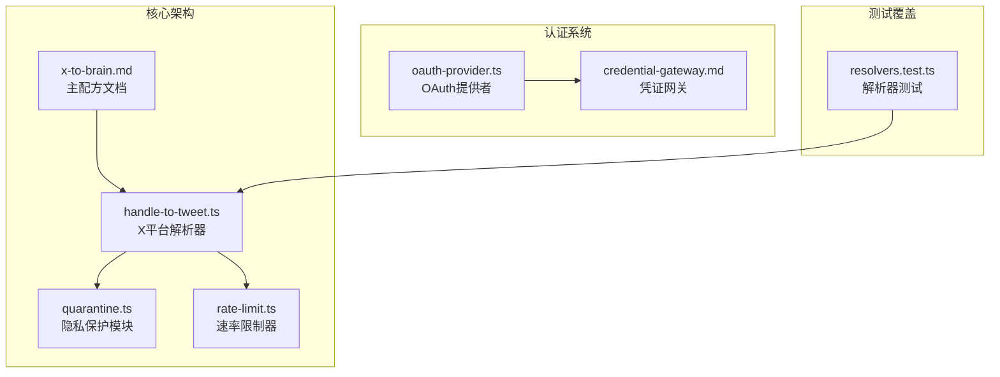

**图表来源**
- [x-to-brain.md:1-450](file://recipes/x-to-brain.md#L1-L450)
- [handle-to-tweet.ts:1-443](file://src/core/resolvers/builtin/x-api/handle-to-tweet.ts#L1-L443)
- [quarantine.ts:1-154](file://src/core/quarantine.ts#L1-L154)

**章节来源**
- [x-to-brain.md:1-450](file://recipes/x-to-brain.md#L1-L450)
- [handle-to-tweet.ts:1-443](file://src/core/resolvers/builtin/x-api/handle-to-tweet.ts#L1-L443)

## 核心组件

### X平台解析器系统

系统的核心是`xHandleToTweetResolver`，它提供了将X平台用户名和关键词线索解析为推文URL的能力：

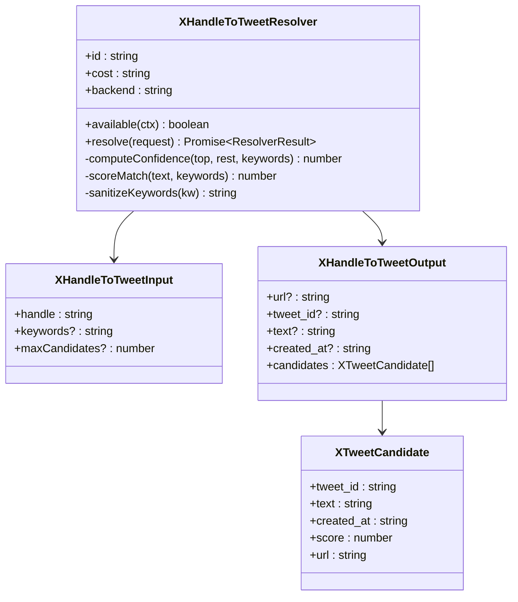

**图表来源**
- [handle-to-tweet.ts:41-66](file://src/core/resolvers/builtin/x-api/handle-to-tweet.ts#L41-L66)

### 隐私保护机制

系统实现了多层次的隐私保护措施：

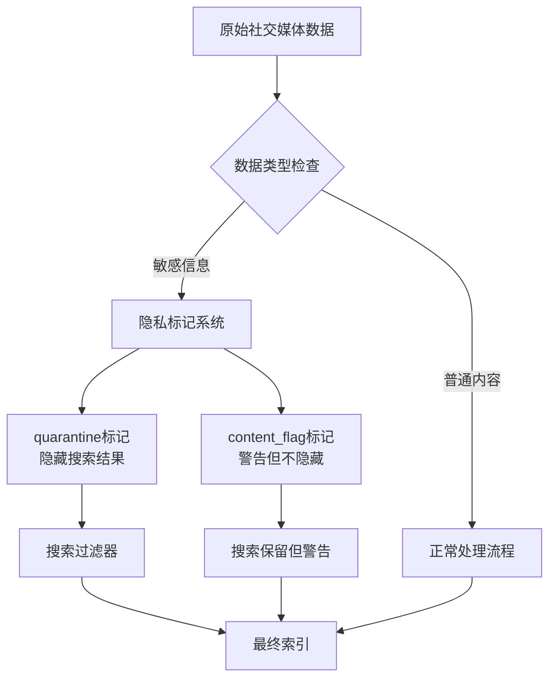

**图表来源**
- [quarantine.ts:35-96](file://src/core/quarantine.ts#L35-L96)

**章节来源**
- [handle-to-tweet.ts:81-256](file://src/core/resolvers/builtin/x-api/handle-to-tweet.ts#L81-L256)
- [quarantine.ts:1-154](file://src/core/quarantine.ts#L1-L154)

## 架构概览

系统采用分层架构设计，实现了从API接入到数据处理的完整流程：

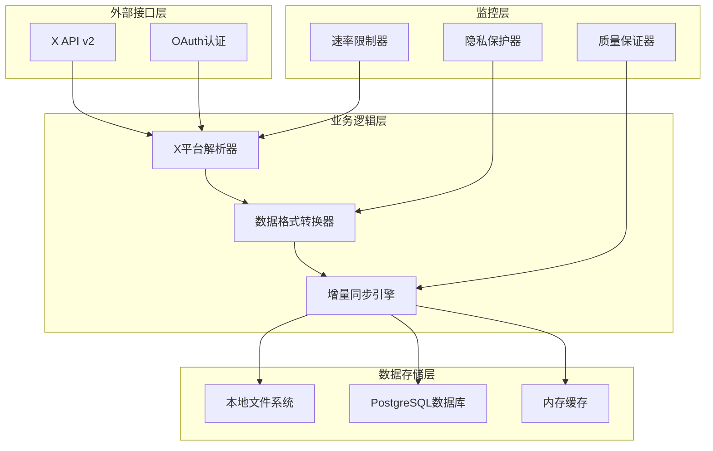

**图表来源**
- [x-to-brain.md:48-68](file://recipes/x-to-brain.md#L48-L68)
- [handle-to-tweet.ts:1-27](file://src/core/resolvers/builtin/x-api/handle-to-tweet.ts#L1-L27)

## 详细组件分析

### API接入与认证

系统支持两种认证方式：直接Bearer Token认证和OAuth 2.0认证。

#### Bearer Token认证流程

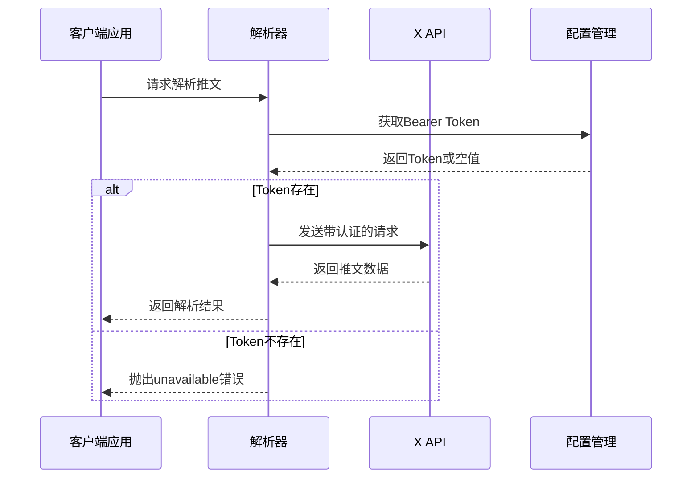

**图表来源**
- [handle-to-tweet.ts:121-146](file://src/core/resolvers/builtin/x-api/handle-to-tweet.ts#L121-L146)

#### OAuth 2.0认证流程

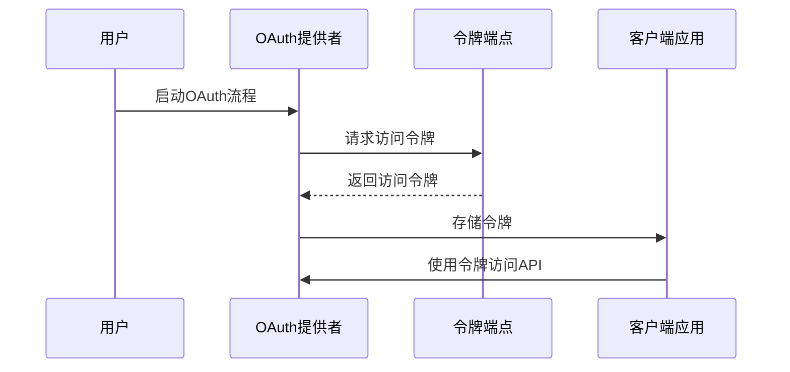

**图表来源**
- [oauth-provider.ts:941-988](file://src/core/oauth-provider.ts#L941-L988)

**章节来源**
- [handle-to-tweet.ts:121-146](file://src/core/resolvers/builtin/x-api/handle-to-tweet.ts#L121-L146)
- [oauth-provider.ts:148-989](file://src/core/oauth-provider.ts#L148-L989)

### 数据格式转换

系统实现了智能的数据格式转换机制，能够处理社交媒体特有的内容格式：

#### 内容处理算法

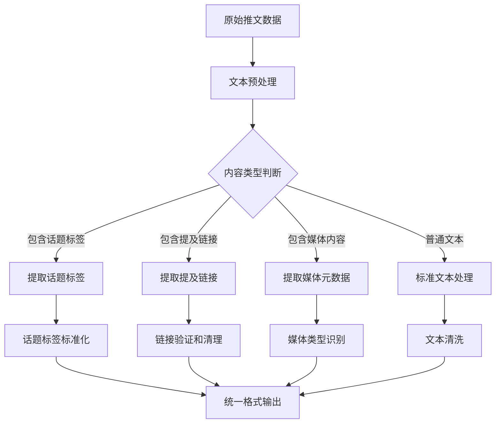

**图表来源**
- [x-to-brain.md:307-333](file://recipes/x-to-brain.md#L307-L333)

### 增量同步机制

系统实现了高效的增量同步算法，确保只处理发生变化的数据：

#### 增量同步流程

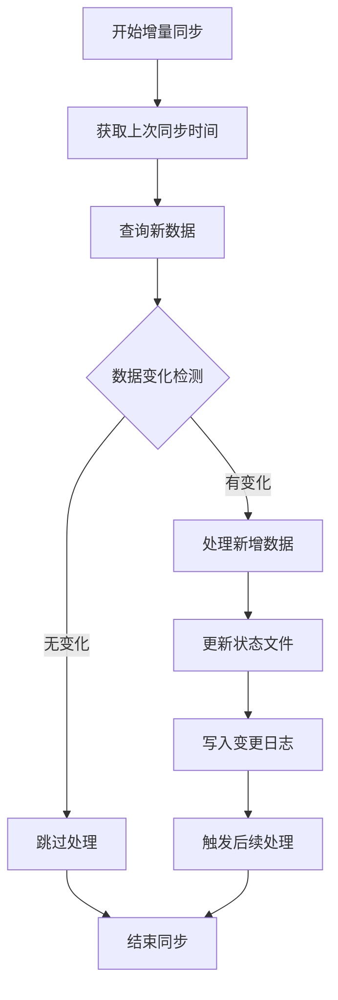

**图表来源**
- [x-to-brain.md:307-333](file://recipes/x-to-brain.md#L307-L333)

**章节来源**
- [x-to-brain.md:307-333](file://recipes/x-to-brain.md#L307-L333)

### 隐私保护措施

系统实现了多层次的隐私保护机制：

#### 隐私标记系统

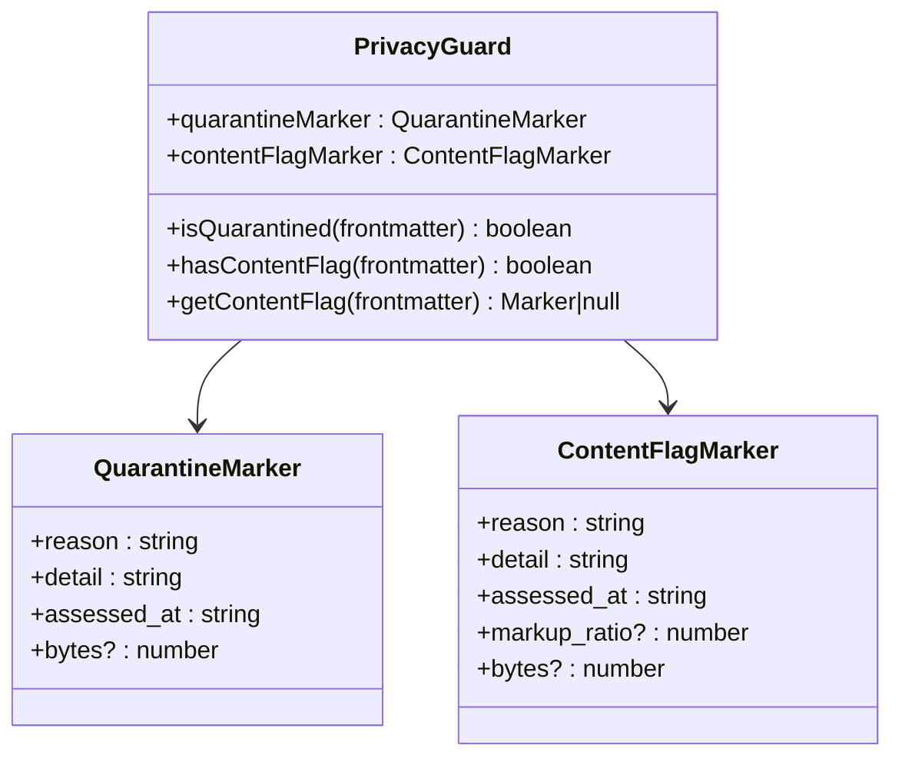

**图表来源**
- [quarantine.ts:56-133](file://src/core/quarantine.ts#L56-L133)

**章节来源**
- [quarantine.ts:1-154](file://src/core/quarantine.ts#L1-L154)

### 速率限制处理

系统实现了智能的速率限制处理机制：

#### 速率限制算法

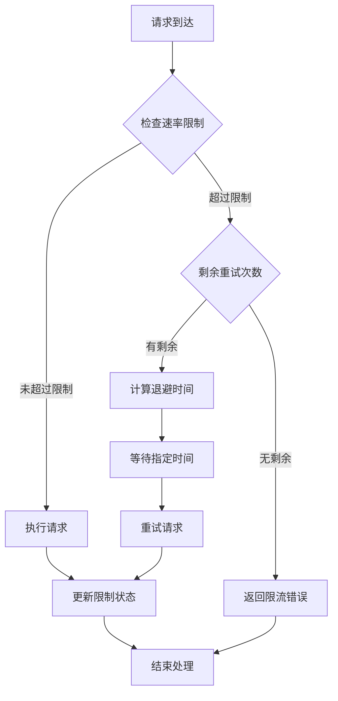

**图表来源**
- [handle-to-tweet.ts:181-191](file://src/core/resolvers/builtin/x-api/handle-to-tweet.ts#L181-L191)

**章节来源**
- [rate-limit.ts:1-142](file://src/mcp/rate-limit.ts#L1-L142)
- [handle-to-tweet.ts:383-412](file://src/core/resolvers/builtin/x-api/handle-to-tweet.ts#L383-L412)

## 依赖关系分析

系统采用了松耦合的设计模式，各组件之间的依赖关系清晰明确：

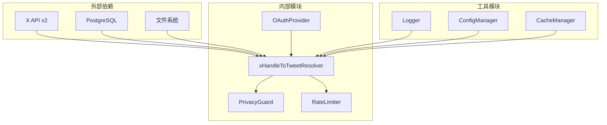

**图表来源**
- [handle-to-tweet.ts:29-35](file://src/core/resolvers/builtin/x-api/handle-to-tweet.ts#L29-L35)
- [quarantine.ts:1-32](file://src/core/quarantine.ts#L1-L32)

**章节来源**
- [handle-to-tweet.ts:1-443](file://src/core/resolvers/builtin/x-api/handle-to-tweet.ts#L1-L443)
- [quarantine.ts:1-154](file://src/core/quarantine.ts#L1-L154)

## 性能考虑

系统在设计时充分考虑了性能优化：

### 缓存策略
- 内存LRU缓存用于频繁访问的数据
- 文件系统缓存减少重复API调用
- 数据库缓存存储历史状态

### 并发控制
- 速率限制器防止API滥用
- 异步处理提高吞吐量
- 批量操作优化网络请求

### 资源管理
- 自动资源清理避免内存泄漏
- 连接池管理数据库连接
- 文件句柄自动关闭

## 故障排除指南

### 常见问题及解决方案

#### API认证失败
- 检查Bearer Token是否正确设置
- 验证API密钥权限范围
- 确认账户状态正常

#### 速率限制问题
- 检查当前使用配额
- 调整请求频率
- 实现指数退避策略

#### 数据质量问题
- 验证输入数据格式
- 检查网络连接稳定性
- 确认目标服务可用性

**章节来源**
- [x-to-brain.md:434-450](file://recipes/x-to-brain.md#L434-L450)
- [resolvers.test.ts:435-471](file://test/resolvers.test.ts#L435-L471)

## 结论

gbrain的社交媒体同步Recipe展现了现代数据集成系统的最佳实践。通过模块化设计、完善的隐私保护机制和智能的速率限制处理，系统能够在保证数据质量的同时，提供高效稳定的社交媒体数据同步能力。

该系统的主要优势包括：
- 灵活的认证机制支持多种API接入方式
- 智能的内容处理算法适应社交媒体数据特点
- 多层次的隐私保护确保数据安全
- 高效的增量同步机制降低资源消耗
- 完善的错误处理和故障恢复机制

未来可以进一步扩展支持更多社交媒体平台，增强AI驱动的内容理解和分类能力，以及优化大规模数据处理的性能表现。