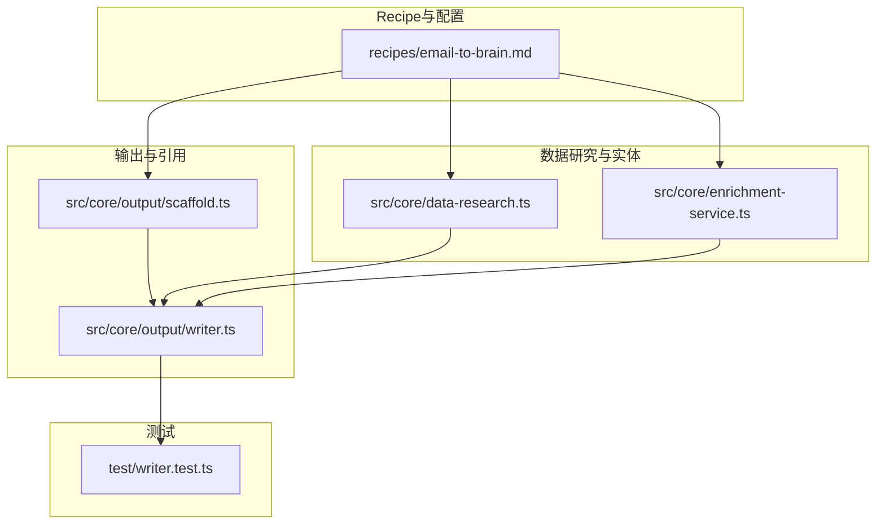
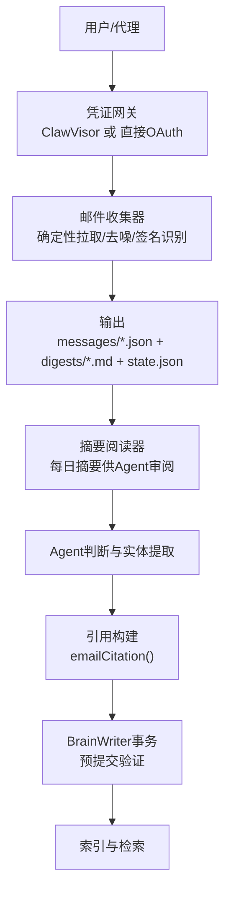
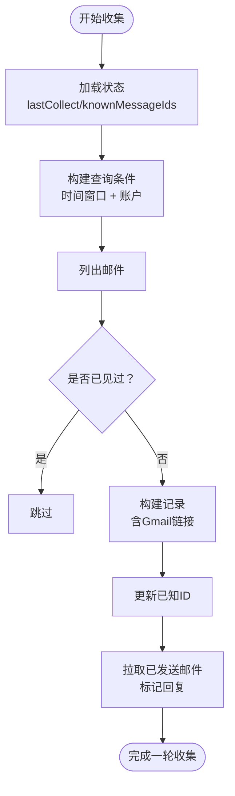
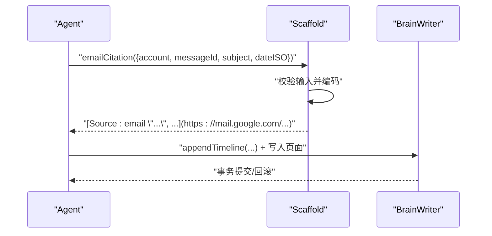
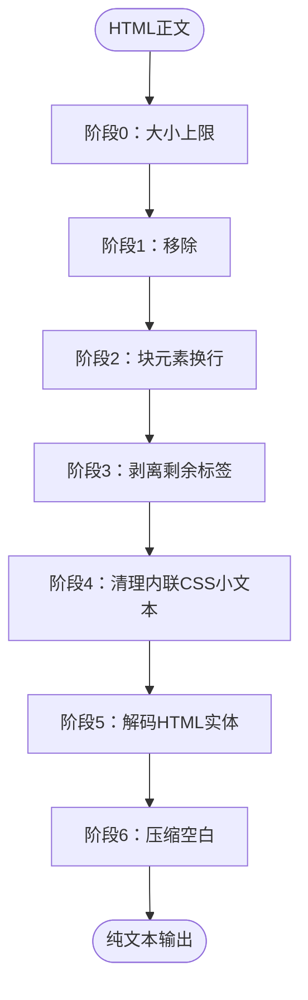
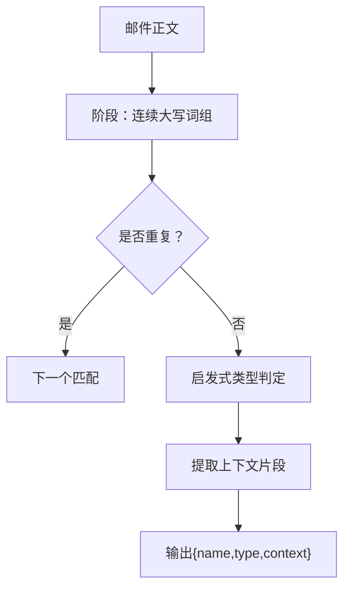
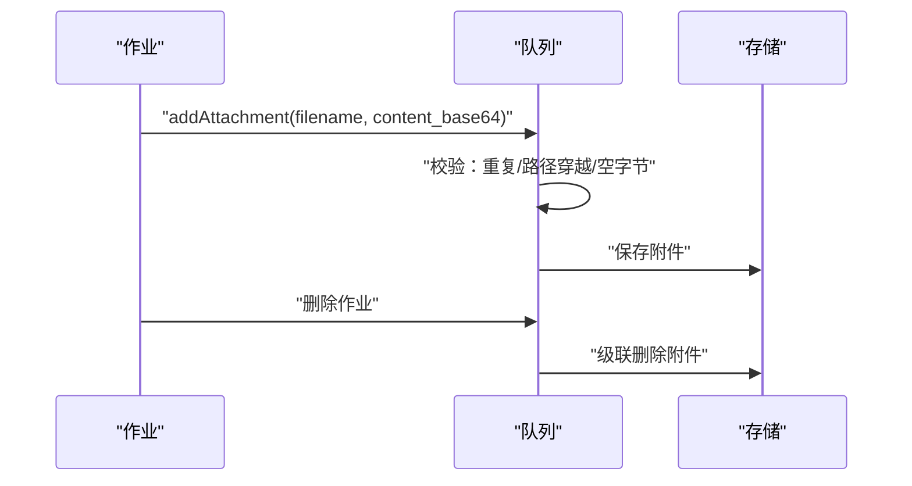
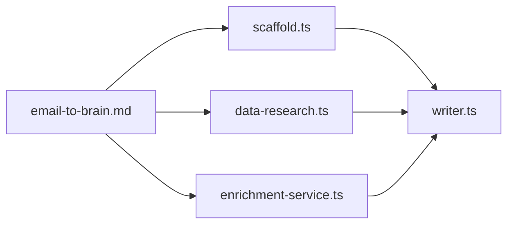

# 邮件同步Recipe

<cite>
**本文档引用的文件**   
- [email-to-brain.md](file://recipes/email-to-brain.md)
- [scaffold.ts](file://src/core/output/scaffold.ts)
- [writer.ts](file://src/core/output/writer.ts)
- [data-research.ts](file://src/core/data-research.ts)
- [enrichment-service.ts](file://src/core/enrichment-service.ts)
- [writer.test.ts](file://test/writer.test.ts)
</cite>

## 目录
1. [简介](#简介)
2. [项目结构](#项目结构)
3. [核心组件](#核心组件)
4. [架构总览](#架构总览)
5. [详细组件分析](#详细组件分析)
6. [依赖关系分析](#依赖关系分析)
7. [性能考量](#性能考量)
8. [故障排查指南](#故障排查指南)
9. [结论](#结论)
10. [附录](#附录)

## 简介
本文件为“邮件同步Recipe”的综合技术文档，围绕邮件数据到GBrain的同步机制进行系统化说明。重点覆盖以下方面：
- 协议接入：基于Gmail的两种接入路径（ClawVisor网关与直接OAuth），以及确定性收集流程
- 邮件解析与索引：消息去噪、签名识别、结构化存储、摘要生成
- HTML内容清洗：6阶段管道与安全控制
- 附件处理：作业队列与附件安全校验
- 联系人与实体提取：基于正则的简单实体抽取
- 引用与链接：规范化的邮件引用与时间线条目
- 同步频率与数据保留：建议的运行节奏与验证步骤
- 分类、标签与搜索优化：基于规则的分类与检索策略

## 项目结构
与邮件同步Recipe直接相关的文件与模块分布如下：
- Recipe定义与安装指引：recipes/email-to-brain.md
- 引用与链接构建：src/core/output/scaffold.ts
- 写入事务与验证：src/core/output/writer.ts
- HTML清洗与实体抽取：src/core/data-research.ts、src/core/enrichment-service.ts
- 测试用例：test/writer.test.ts

**图示来源**
- [email-to-brain.md:1-342](file://recipes/email-to-brain.md#L1-L342)
- [scaffold.ts:1-237](file://src/core/output/scaffold.ts#L1-L237)
- [writer.ts:1-331](file://src/core/output/writer.ts#L1-L331)
- [data-research.ts:370-417](file://src/core/data-research.ts#L370-L417)
- [enrichment-service.ts:245-273](file://src/core/enrichment-service.ts#L245-L273)
- [writer.test.ts:84-150](file://test/writer.test.ts#L84-L150)

**章节来源**
- [email-to-brain.md:100-238](file://recipes/email-to-brain.md#L100-L238)

## 核心组件
- 收集器与摘要生成：确定性地从Gmail拉取邮件，去噪与签名识别，生成结构化JSON与Markdown摘要，并持久化状态
- 引用与链接：通过Scaffold模块构建标准化的邮件引用与内部wikilink，确保URL与引用不可伪造
- 写入事务：BrainWriter在提交前执行严格验证，保证页面完整性与一致性
- HTML清洗：针对邮件正文的6阶段清洗流水线，兼顾性能与安全性
- 实体抽取：基于正则的简单命名实体抽取，辅助联系人与公司页面的创建与更新
- 附件处理：作业队列对附件进行安全校验与级联删除

**章节来源**
- [email-to-brain.md:178-228](file://recipes/email-to-brain.md#L178-L228)
- [scaffold.ts:50-80](file://src/core/output/scaffold.ts#L50-L80)
- [writer.ts:219-274](file://src/core/output/writer.ts#L219-L274)
- [data-research.ts:376-416](file://src/core/data-research.ts#L376-L416)
- [enrichment-service.ts:245-273](file://src/core/enrichment-service.ts#L245-L273)

## 架构总览
下图展示了从Gmail到GBrain的端到端流程，包括确定性收集、摘要生成、引用构建与写入验证。

**图示来源**
- [email-to-brain.md:63-80](file://recipes/email-to-brain.md#L63-L80)
- [email-to-brain.md:178-228](file://recipes/email-to-brain.md#L178-L228)
- [scaffold.ts:72-80](file://src/core/output/scaffold.ts#L72-L80)
- [writer.ts:240-264](file://src/core/output/writer.ts#L240-L264)

## 详细组件分析

### 组件A：邮件收集与摘要生成
- 确定性收集：按账户轮询，使用时间窗口查询，避免重复；同时拉取已发送邮件以识别回复
- 去噪规则：基于发件人关键字的简单子串匹配
- 签名识别：基于主题与发件地址的关键词匹配
- 摘要生成：按“待签名/需分流/噪声”分组，输出Markdown摘要
- 状态持久化：记录上次收集时间戳与已知消息ID

**图示来源**
- [email-to-brain.md:287-309](file://recipes/email-to-brain.md#L287-L309)

**章节来源**
- [email-to-brain.md:178-228](file://recipes/email-to-brain.md#L178-L228)
- [email-to-brain.md:244-286](file://recipes/email-to-brain.md#L244-L286)

### 组件B：引用与链接构建（emailCitation）
- 输入：账户、消息ID、主题、日期
- 输出：带深链的标准化引用，支持URL编码与主题截断
- 校验：消息ID长度与格式、日期格式、非空字段

**图示来源**
- [scaffold.ts:72-80](file://src/core/output/scaffold.ts#L72-L80)
- [writer.ts:240-264](file://src/core/output/writer.ts#L240-L264)
- [writer.test.ts:109-119](file://test/writer.test.ts#L109-L119)

**章节来源**
- [scaffold.ts:50-80](file://src/core/output/scaffold.ts#L50-L80)
- [writer.test.ts:109-119](file://test/writer.test.ts#L109-L119)

### 组件C：HTML正文清洗（6阶段管道）
- 安全上限：输入大小限制，防止ReDoS
- 清洗阶段：移除样式与脚本块、块元素换行、剥离标签、清理内联CSS、解码实体、压缩空白
- 性能权衡：在大文本上跳过部分清理以提升性能

**图示来源**
- [data-research.ts:376-416](file://src/core/data-research.ts#L376-L416)

**章节来源**
- [data-research.ts:370-417](file://src/core/data-research.ts#L370-L417)

### 组件D：实体抽取与联系人信息
- 抽取策略：基于连续大写字母词组的简单正则，结合后缀启发式判断公司/个人
- 上下文截取：围绕匹配点提取上下文片段
- 精度与扩展：可作为Agent进一步精炼的基础

**图示来源**
- [enrichment-service.ts:245-273](file://src/core/enrichment-service.ts#L245-L273)

**章节来源**
- [enrichment-service.ts:220-273](file://src/core/enrichment-service.ts#L220-L273)

### 组件E：附件处理与安全校验
- 作业队列：为每个任务维护附件集合
- 安全校验：拒绝重复文件名、路径穿越、空字节等
- 级联删除：当作业被删除时，附件一并清理

**图示来源**
- [test/minions.test.ts:1678-1722](file://test/minions.test.ts#L1678-L1722)

**章节来源**
- [test/minions.test.ts:1678-1722](file://test/minions.test.ts#L1678-L1722)

## 依赖关系分析
- Recipe依赖：引用构建依赖于Scaffold；写入依赖于BrainWriter；HTML清洗与实体抽取服务于Agent的后续处理
- 外部接口：Gmail API（经由ClawVisor或直接OAuth）；本地文件系统（消息JSON、摘要、状态）

**图示来源**
- [email-to-brain.md:178-228](file://recipes/email-to-brain.md#L178-L228)
- [scaffold.ts:50-80](file://src/core/output/scaffold.ts#L50-L80)
- [writer.ts:219-274](file://src/core/output/writer.ts#L219-L274)
- [data-research.ts:376-416](file://src/core/data-research.ts#L376-L416)
- [enrichment-service.ts:245-273](file://src/core/enrichment-service.ts#L245-L273)

**章节来源**
- [email-to-brain.md:178-228](file://recipes/email-to-brain.md#L178-L228)

## 性能考量
- 清洗性能：在超大文本上跳过部分清理步骤，平衡安全与吞吐
- 查询粒度：分账户、分时间段拉取，减少重复与遗漏
- 去重与状态：通过已知ID与时间戳避免重复处理
- 事务验证：批量写入前统一验证，降低失败成本

## 故障排查指南
- 无邮件收集
  - 检查ClawVisor健康状态与任务激活
  - 确认任务目的描述足够宽泛
- Gmail链接失效
  - 核对authuser参数与账户一致
  - 确保已在正确Google账号登录
- 摘要为空但收集成功
  - 检查消息JSON是否生成
  - 排查去噪规则是否误判
- 引用格式异常
  - 校验消息ID长度与格式
  - 确认日期格式与主题截断

**章节来源**
- [email-to-brain.md:328-342](file://recipes/email-to-brain.md#L328-L342)
- [writer.test.ts:109-119](file://test/writer.test.ts#L109-L119)

## 结论
该Recipe通过“确定性收集 + LLM判断”的双层设计，实现了从Gmail到GBrain的稳健同步。Scaffold与BrainWriter确保引用与写入的规范化与一致性；HTML清洗与实体抽取为后续的索引与检索提供高质量输入；附件安全校验与作业队列保障了数据完整性与可维护性。配合合理的同步频率与验证流程，可在不牺牲隐私与准确性的前提下，持续增强GBrain的知识库。

## 附录

### 配置与运行要点
- 凭证选项：ClawVisor（推荐）、直接OAuth、Hermes网关
- 收集频率：每30分钟一次
- 验证清单：去噪、链接、去重、回复识别

**章节来源**
- [email-to-brain.md:100-238](file://recipes/email-to-brain.md#L100-L238)