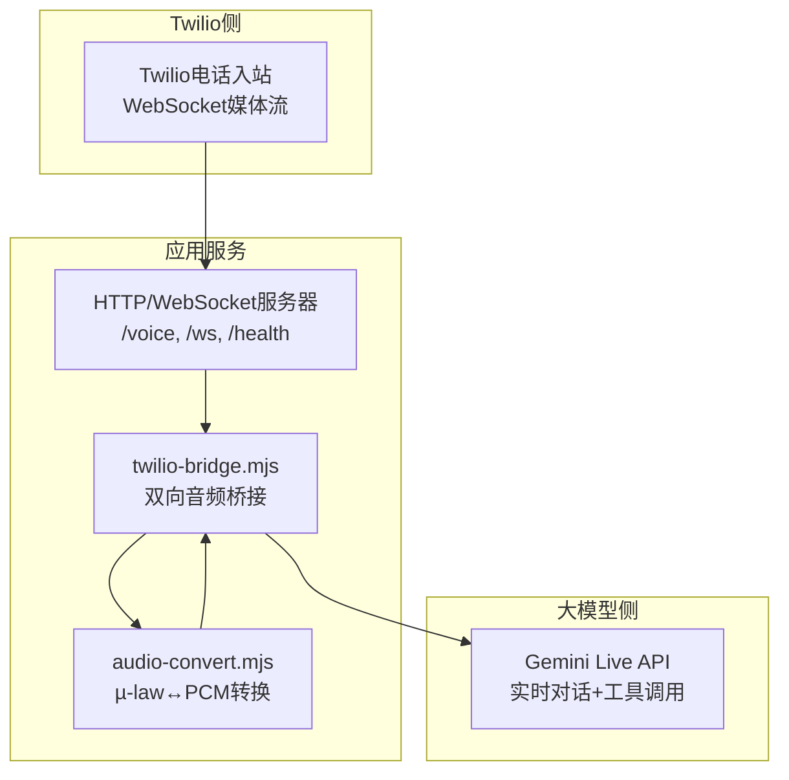
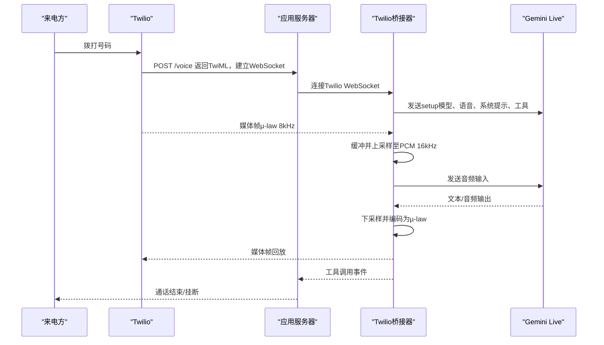
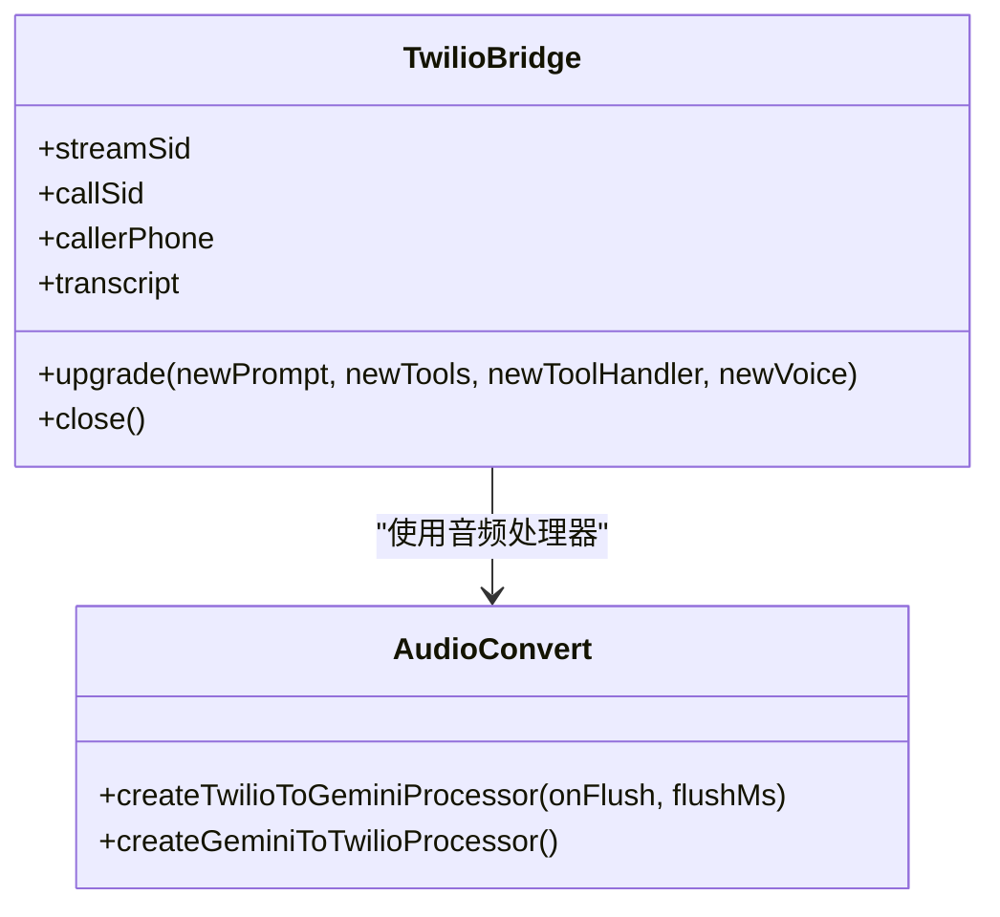
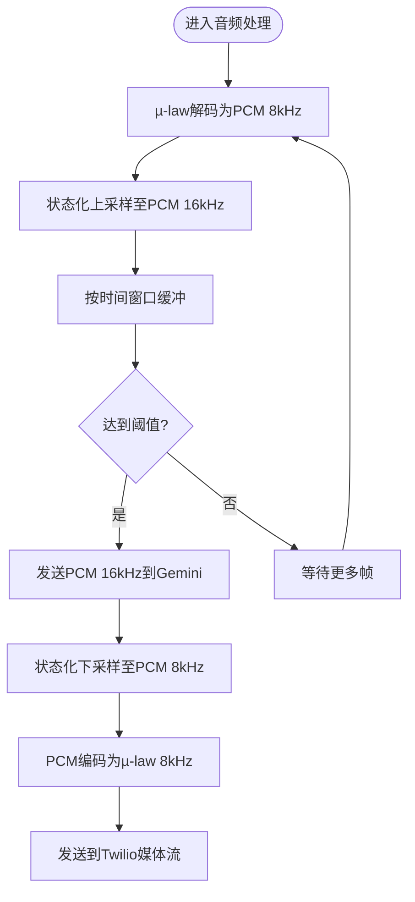
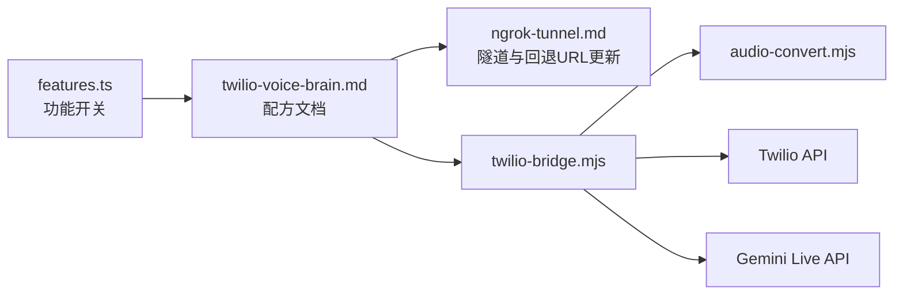

# Twilio集成

<cite>
**本文档引用的文件**
- [twilio-bridge.mjs](file://recipes/agent-voice/code/lib/twilio-bridge.mjs)
- [audio-convert.mjs](file://recipes/agent-voice/code/lib/audio-convert.mjs)
- [twilio-voice-brain.md](file://recipes/twilio-voice-brain.md)
- [ngrok-tunnel.md](file://recipes/ngrok-tunnel.md)
- [features.ts](file://src/commands/features.ts)
- [integrations.test.ts](file://test/integrations.test.ts)
</cite>

## 目录
1. [简介](#简介)
2. [项目结构](#项目结构)
3. [核心组件](#核心组件)
4. [架构总览](#架构总览)
5. [详细组件分析](#详细组件分析)
6. [依赖关系分析](#依赖关系分析)
7. [性能考虑](#性能考虑)
8. [故障排查指南](#故障排查指南)
9. [结论](#结论)
10. [附录](#附录)

## 简介
本技术文档面向在生产环境中部署Twilio电话入站与WebRTC通话能力的团队，系统性阐述基于仓库中现有实现的Twilio集成方案。内容覆盖：
- 可选集成路径：TwiML处理、WSS桥接（Twilio WebSocket ↔ Gemini Live）、电话入站支持
- 安全与合规：签名验证、速率限制、错误处理与回退策略
- 配置与部署：Twilio号码配置、Webhook与回退URL设置、ngrok隧道与健康检查
- 生产加固：身份分离、工具集分层、认证路由、端点对齐与后处理保障
- 监控与可观测性：日志、转写与统计指标

## 项目结构
Twilio相关能力主要由两部分构成：
- 语音桥接库：负责将Twilio媒体流与Gemini Live API双向桥接，并支持“门卫→全功能”的两阶段升级
- 集成文档与脚手架：提供Twilio号码购买、Webhook配置、回退URL、健康检查与部署流程

图表来源
- [twilio-bridge.mjs:1-282](file://recipes/agent-voice/code/lib/twilio-bridge.mjs#L1-L282)
- [audio-convert.mjs:1-217](file://recipes/agent-voice/code/lib/audio-convert.mjs#L1-L217)

章节来源
- [twilio-bridge.mjs:1-282](file://recipes/agent-voice/code/lib/twilio-bridge.mjs#L1-L282)
- [audio-convert.mjs:1-217](file://recipes/agent-voice/code/lib/audio-convert.mjs#L1-L217)

## 核心组件
- Twilio桥接器（createBridge）
  - 维护Twilio会话状态（streamSid、callSid、callerPhone）
  - 建立到Gemini的WebSocket连接，发送setup消息
  - 处理工具调用、文本与音频往返
  - 提供upgrade方法进行两阶段认证升级
  - 提供close方法优雅关闭
- 音频转换器
  - Twilio→Gemini：µ-law 8kHz → PCM 16kHz（带状态的上采样与缓冲）
  - Gemini→Twilio：PCM 24kHz → µ-law 8kHz（带状态的下采样）
- 服务器端点
  - /voice：返回TwiML以建立WebSocket媒体流
  - /ws：处理媒体流与Gemini交互
  - /health：健康检查
  - /fallback：回退Twiml（可配置为Twilio回退URL）

章节来源
- [twilio-bridge.mjs:30-282](file://recipes/agent-voice/code/lib/twilio-bridge.mjs#L30-L282)
- [audio-convert.mjs:160-216](file://recipes/agent-voice/code/lib/audio-convert.mjs#L160-L216)

## 架构总览
Twilio电话入站通过WebSocket直连应用服务，应用服务再与Gemini Live API进行实时双向通信。音频在两端之间保持无损或低延迟转换。

图表来源
- [twilio-bridge.mjs:83-198](file://recipes/agent-voice/code/lib/twilio-bridge.mjs#L83-L198)
- [audio-convert.mjs:160-216](file://recipes/agent-voice/code/lib/audio-convert.mjs#L160-L216)

## 详细组件分析

### 组件A：Twilio桥接器（createBridge）
- 职责
  - 接收Twilio WebSocket消息，解析start/media/stop事件
  - 将音频数据按约200ms缓冲并上采样后发送给Gemini
  - 接收Gemini返回的音频与文本，下采样后回放到Twilio
  - 支持工具调用（函数式工具声明与执行）
  - 提供upgrade方法在认证完成后切换到全功能上下文
- 关键行为
  - 初始化时连接Gemini并发送setup
  - 工具调用采用并发批量处理，失败时返回错误响应
  - 通话结束或Twilio断开时触发onCallEnd回调
- 错误处理
  - 解析异常记录日志
  - Gemini连接关闭/错误事件统一记录
  - 工具调用异常捕获并返回错误对象

图表来源
- [twilio-bridge.mjs:30-282](file://recipes/agent-voice/code/lib/twilio-bridge.mjs#L30-L282)
- [audio-convert.mjs:160-216](file://recipes/agent-voice/code/lib/audio-convert.mjs#L160-L216)

章节来源
- [twilio-bridge.mjs:30-282](file://recipes/agent-voice/code/lib/twilio-bridge.mjs#L30-L282)

### 组件B：音频转换器（audio-convert）
- 职责
  - 提供µ-law与PCM之间的无损/近似转换
  - 提供状态化上采样（8kHz→16kHz）与下采样（24kHz→8kHz）
  - 提供缓冲式处理器，按时间窗口批量flush
- 性能特性
  - 上采样/下采样均保留跨块状态，避免边界爆破
  - 缓冲阈值按目标采样率与窗口计算，降低网络包数量

图表来源
- [audio-convert.mjs:160-216](file://recipes/agent-voice/code/lib/audio-convert.mjs#L160-L216)

章节来源
- [audio-convert.mjs:1-217](file://recipes/agent-voice/code/lib/audio-convert.mjs#L1-L217)

### 组件C：服务器端点与Webhook
- /voice
  - 返回TwiML，指示Twilio将媒体流转发到应用服务器的/ws端点
  - 建议在此处进行Twilio签名验证（X-Twilio-Signature）
- /ws
  - 接受Twilio媒体WebSocket，内部桥接到Gemini
  - 处理工具调用、文本与音频往返
- /health
  - 返回健康状态，便于外部监控
- /fallback
  - 回退Twiml，建议配置为Twilio回退URL，用于主服务不可用时转接

章节来源
- [twilio-voice-brain.md:295-334](file://recipes/twilio-voice-brain.md#L295-L334)

## 依赖关系分析
- 内部依赖
  - twilio-bridge.mjs依赖audio-convert.mjs提供的音频编解码与缓冲逻辑
- 外部依赖
  - Twilio API（号码购买、Webhook配置、回退URL）
  - Gemini Live API（实时对话与工具调用）
  - ngrok（本地开发与测试的公网隧道）
- 配置与安装
  - 功能开关：twilio-voice-brain在功能列表中注册为可选集成
  - 测试覆盖：集成测试验证配方解析与元信息

图表来源
- [features.ts:45-45](file://src/commands/features.ts#L45-L45)
- [integrations.test.ts:191-255](file://test/integrations.test.ts#L191-L255)
- [twilio-voice-brain.md:1-800](file://recipes/twilio-voice-brain.md#L1-L800)
- [ngrok-tunnel.md:53-201](file://recipes/ngrok-tunnel.md#L53-L201)
- [twilio-bridge.mjs:1-282](file://recipes/agent-voice/code/lib/twilio-bridge.mjs#L1-L282)
- [audio-convert.mjs:1-217](file://recipes/agent-voice/code/lib/audio-convert.mjs#L1-L217)

章节来源
- [features.ts:45-45](file://src/commands/features.ts#L45-L45)
- [integrations.test.ts:191-255](file://test/integrations.test.ts#L191-L255)

## 性能考虑
- 音频缓冲与采样率转换
  - 使用状态化上/下采样避免边界爆破
  - 200ms窗口减少网络包数量，平衡延迟与吞吐
- 工具调用并发
  - 并发批量处理工具调用，失败时返回错误对象，避免阻塞后续音频
- 连接管理
  - 升级时复用Twilio WebSocket，仅重建Gemini会话，降低中断概率
- 后处理保障
  - 强制三步后处理：消息通知、转录入库、音频归档，确保每通电话都有可恢复的证据链

## 故障排查指南
- 无法接通电话
  - 检查ngrok是否运行、/health是否可达
  - 检查Twilio调试台（Debugger）中的Webhook错误
  - 确认Webhook URL与当前ngrok地址一致
- 语音无响应
  - 检查Gemini密钥与网络连通性
  - 查看服务器日志中的连接拒绝或401错误
- 未生成脑页
  - 执行健康检查与同步命令
  - 检查文件权限与存储路径
- ngrok地址变更
  - 使用watchdog自动检测并更新Twilio回退URL
  - 或手动更新Webhook与回退URL
- 回退策略
  - 配置/fallback端点返回转接指令，作为主服务不可用时的兜底

章节来源
- [twilio-voice-brain.md:501-528](file://recipes/twilio-voice-brain.md#L501-L528)
- [twilio-voice-brain.md:711-714](file://recipes/twilio-voice-brain.md#L711-L714)

## 结论
本方案提供了从Twilio电话入站到Gemini实时对话的完整链路，具备：
- 可靠的音频桥接与工具调用能力
- 两阶段认证升级路径
- 回退URL与多层后处理保障
- 生产级的缓冲与采样策略
建议在生产环境中结合ngrok隧道、健康检查与回退URL，并完善监控与告警体系，确保高可用与可恢复性。

## 附录

### 安全加固清单
- 签名验证
  - 在/voice端点校验X-Twilio-Signature头，拒绝伪造请求
- 认证与授权
  - 工具集分层：只读工具对未知来电，全量工具对已认证用户
  - 基于callerPhone的路由规则，区分不同体验
- 数据保护
  - 身份优先的系统提示，避免泄露敏感上下文
  - 对语音上下文进行PII清洗（电话、邮箱、URL等）
- 运行时健壮性
  - 工具调用超时与取消机制
  - 通话静默检测与注入提示，防止卡死

章节来源
- [twilio-voice-brain.md:127-131](file://recipes/twilio-voice-brain.md#L127-L131)
- [twilio-voice-brain.md:535-568](file://recipes/twilio-voice-brain.md#L535-L568)
- [twilio-voice-brain.md:711-714](file://recipes/twilio-voice-brain.md#L711-L714)

### 部署与配置步骤
- 准备工作
  - 安装Node.js 18+
  - 准备Twilio账号与认证令牌
  - 准备Gemini API密钥
- 启动ngrok隧道
  - 使用固定域名（推荐Hobby套餐）或接受动态URL
- 创建语音服务器
  - 实现/voice、/ws、/health端点
  - 在/voice中加入签名验证
- 配置Twilio号码
  - 设置Webhook为https://YOUR-NGROK-URL/voice
  - 设置回退URL为/fallback
- 启动服务并自检
  - /health检查
  - 外呼自检（Outbound Call）
- 生产加固
  - watchdog定时重启
  - 自动检测ngrok地址变化并更新Webhook
  - 三步后处理：消息通知、转录入库、音频归档

章节来源
- [twilio-voice-brain.md:134-489](file://recipes/twilio-voice-brain.md#L134-L489)
- [ngrok-tunnel.md:53-201](file://recipes/ngrok-tunnel.md#L53-L201)