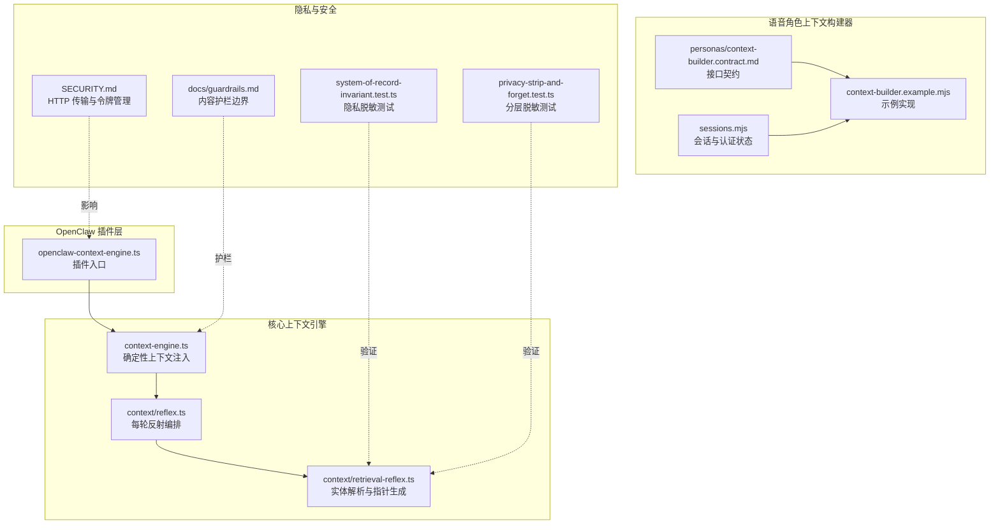
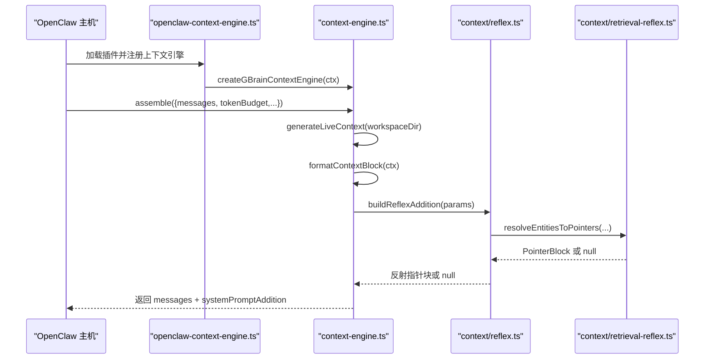
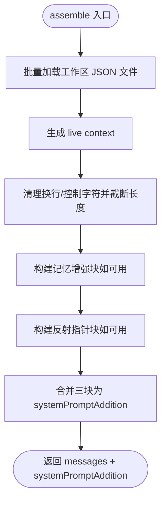
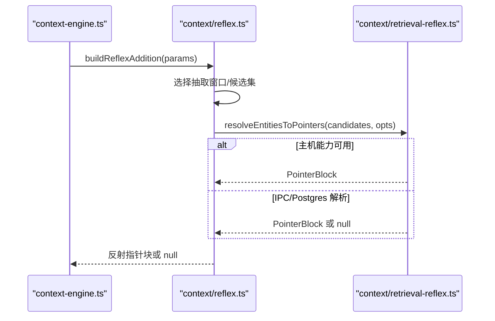
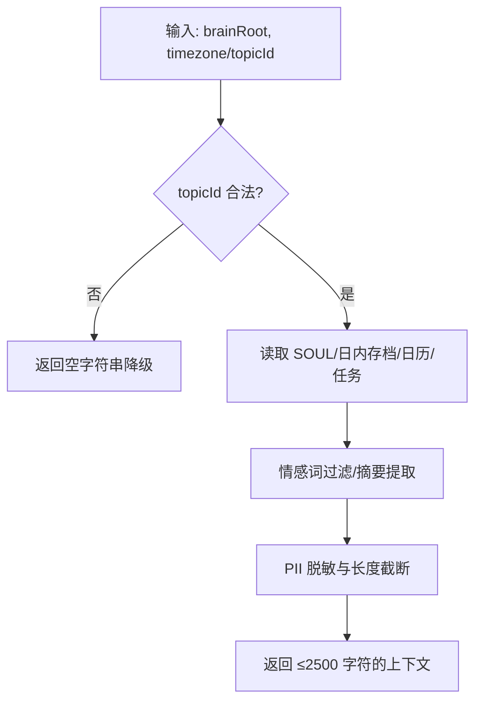
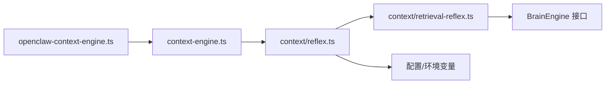

# 上下文管理系统

<cite>
**本文档引用的文件**
- [src/core/context-engine.ts](file://src/core/context-engine.ts)
- [src/core/context/reflex.ts](file://src/core/context/reflex.ts)
- [src/core/context/retrieval-reflex.ts](file://src/core/context/retrieval-reflex.ts)
- [src/openclaw-context-engine.ts](file://src/openclaw-context-engine.ts)
- [recipes/agent-voice/code/lib/personas/context-builder.contract.md](file://recipes/agent-voice/code/lib/personas/context-builder.contract.md)
- [recipes/agent-voice/code/lib/context-builder.example.mjs](file://recipes/agent-voice/code/lib/context-builder.example.mjs)
- [recipes/agent-voice/code/lib/sessions.mjs](file://recipes/agent-voice/code/lib/sessions.mjs)
- [recipes/agent-voice/code/lib/personas/private-name-blocklist.json](file://recipes/agent-voice/code/lib/personas/private-name-blocklist.json)
- [SECURITY.md](file://SECURITY.md)
- [docs/guardrails.md](file://docs/guardrails.md)
- [test/e2e/system-of-record-invariant.test.ts](file://test/e2e/system-of-record-invariant.test.ts)
- [test/privacy-strip-and-forget.test.ts](file://test/privacy-strip-and-forget.test.ts)
</cite>

## 目录
1. [简介](#简介)
2. [项目结构](#项目结构)
3. [核心组件](#核心组件)
4. [架构总览](#架构总览)
5. [详细组件分析](#详细组件分析)
6. [依赖关系分析](#依赖关系分析)
7. [性能考量](#性能考量)
8. [故障排查指南](#故障排查指南)
9. [结论](#结论)
10. [附录](#附录)

## 简介
本文件系统性阐述 GBrain 的上下文管理系统，覆盖以下关键主题：
- 上下文构建器的接口契约与实现要求：包括个人信息脱敏（PII）、PII 模式匹配、动态上下文生成。
- 上下文注入机制：确定性时间/地点/活动上下文注入、检索反射（Retrieval Reflex）指针注入。
- 实时信息更新与会话状态管理：心跳状态、日历缓存、任务解析、旅行状态等。
- 自定义上下文构建器开发指南与最佳实践：接口约束、输出规范、隐私策略。
- 隐私保护策略与数据安全考虑：脱敏边界、最小暴露原则、审计与限流。

## 项目结构
上下文管理相关的核心代码分布在两个主要区域：
- 核心引擎与反射层：位于 src/core/context-engine.ts、src/core/context/reflex.ts、src/core/context/retrieval-reflex.ts。
- 语音角色上下文构建器：位于 recipes/agent-voice/code/lib 下的上下文构建器契约与示例实现。
- OpenClaw 插件入口：src/openclaw-context-engine.ts 将核心引擎注册为插件。
- 安全与隐私：SECURITY.md、docs/guardrails.md、隐私测试用例等。

**图表来源**
- [src/openclaw-context-engine.ts:1-88](file://src/openclaw-context-engine.ts#L1-L88)
- [src/core/context-engine.ts:1-709](file://src/core/context-engine.ts#L1-L709)
- [src/core/context/reflex.ts:1-271](file://src/core/context/reflex.ts#L1-L271)
- [src/core/context/retrieval-reflex.ts:1-368](file://src/core/context/retrieval-reflex.ts#L1-L368)
- [recipes/agent-voice/code/lib/personas/context-builder.contract.md:1-79](file://recipes/agent-voice/code/lib/personas/context-builder.contract.md#L1-L79)
- [recipes/agent-voice/code/lib/context-builder.example.mjs:1-264](file://recipes/agent-voice/code/lib/context-builder.example.mjs#L1-L264)
- [recipes/agent-voice/code/lib/sessions.mjs:47-151](file://recipes/agent-voice/code/lib/sessions.mjs#L47-L151)
- [SECURITY.md:1-261](file://SECURITY.md#L1-L261)
- [docs/guardrails.md:1-103](file://docs/guardrails.md#L1-L103)
- [test/e2e/system-of-record-invariant.test.ts:293-313](file://test/e2e/system-of-record-invariant.test.ts#L293-L313)
- [test/privacy-strip-and-forget.test.ts:31-63](file://test/privacy-strip-and-forget.test.ts#L31-L63)

**章节来源**
- [src/core/context-engine.ts:1-709](file://src/core/context-engine.ts#L1-L709)
- [src/core/context/reflex.ts:1-271](file://src/core/context/reflex.ts#L1-L271)
- [src/core/context/retrieval-reflex.ts:1-368](file://src/core/context/retrieval-reflex.ts#L1-L368)
- [src/openclaw-context-engine.ts:1-88](file://src/openclaw-context-engine.ts#L1-L88)
- [recipes/agent-voice/code/lib/personas/context-builder.contract.md:1-79](file://recipes/agent-voice/code/lib/personas/context-builder.contract.md#L1-L79)
- [recipes/agent-voice/code/lib/context-builder.example.mjs:1-264](file://recipes/agent-voice/code/lib/context-builder.example.mjs#L1-L264)
- [recipes/agent-voice/code/lib/sessions.mjs:47-151](file://recipes/agent-voice/code/lib/sessions.mjs#L47-L151)
- [SECURITY.md:1-261](file://SECURITY.md#L1-L261)
- [docs/guardrails.md:1-103](file://docs/guardrails.md#L1-L103)
- [test/e2e/system-of-record-invariant.test.ts:293-313](file://test/e2e/system-of-record-invariant.test.ts#L293-L313)
- [test/privacy-strip-and-forget.test.ts:31-63](file://test/privacy-strip-and-forget.test.ts#L31-L63)

## 核心组件
- 确定性上下文引擎（GBrain Context Engine）
  - 在每次组装（assemble）时注入结构化的时空与操作上下文到系统提示中，防止“时间漂移”问题。
  - 不进行 LLM 调用，仅在 assemble 时生成并拼接 live context、记忆增强块与反射指针块。
- 检索反射（Retrieval Reflex）
  - 每轮抽取当前用户输入中的“显著实体”，解析为已存在脑页的指针，并以紧凑 Markdown 注入系统提示。
  - 支持主机提供的 resolveEntities 能力或通过 IPC/Postgres 解析，具备超时与失败开路保障。
- 语音角色上下文构建器
  - 提供 buildMarsContext、buildVenusContext、buildTopicContext 三个函数的接口契约与示例实现。
  - 强制 PII 脱敏、长度上限、路径遍历防御、话题 ID 严格校验等。
- 会话与认证状态管理
  - 维护会话生命周期、一次性验证码、预认证与身份标识，支持清理过期会话与令牌管理。

**章节来源**
- [src/core/context-engine.ts:52-72](file://src/core/context-engine.ts#L52-L72)
- [src/core/context/reflex.ts:118-159](file://src/core/context/reflex.ts#L118-L159)
- [src/core/context/retrieval-reflex.ts:124-129](file://src/core/context/retrieval-reflex.ts#L124-L129)
- [recipes/agent-voice/code/lib/personas/context-builder.contract.md:16-79](file://recipes/agent-voice/code/lib/personas/context-builder.contract.md#L16-L79)
- [recipes/agent-voice/code/lib/context-builder.example.mjs:116-166](file://recipes/agent-voice/code/lib/context-builder.example.mjs#L116-L166)
- [recipes/agent-voice/code/lib/sessions.mjs:47-117](file://recipes/agent-voice/code/lib/sessions.mjs#L47-L117)

## 架构总览
下图展示从 OpenClaw 插件入口到核心引擎与反射层的整体调用链，以及与外部系统（Postgres、IPC、主机能力）的交互。

**图表来源**
- [src/openclaw-context-engine.ts:66-87](file://src/openclaw-context-engine.ts#L66-L87)
- [src/core/context-engine.ts:653-697](file://src/core/context-engine.ts#L653-L697)
- [src/core/context/reflex.ts:118-159](file://src/core/context/reflex.ts#L118-L159)
- [src/core/context/retrieval-reflex.ts:124-129](file://src/core/context/retrieval-reflex.ts#L124-L129)

## 详细组件分析

### 确定性上下文引擎（GBrain Context Engine）
- 职责
  - 在 assemble 阶段生成 live context 块（时间、地点、活动、任务），并可选地合并记忆增强块与反射指针块。
  - compact 阶段委托给旧运行时，避免重复实现压缩逻辑。
- 关键流程
  - 读取 heartbeat-state.json、upcoming-flights.json、calendar-cache.json 等工作区文件，解析位置、时间、活动、任务。
  - 对日历事件进行去噪与排序，限制未来窗口内的事件数量；对任务列表进行大小限制与清洗。
  - 将结果格式化为系统提示块，确保换行与控制字符被清理，避免注入风险。
- 性能与并发
  - 所有磁盘读取在一次 assemble 中批量完成，使用原子重命名写入以避免部分 JSON 文档导致解析失败。
  - 窗口化抽取限制最近若干轮对话，避免长会话带来的扫描成本增长。

**图表来源**
- [src/core/context-engine.ts:653-697](file://src/core/context-engine.ts#L653-L697)
- [src/core/context-engine.ts:137-144](file://src/core/context-engine.ts#L137-L144)
- [src/core/context-engine.ts:154-156](file://src/core/context-engine.ts#L154-L156)

**章节来源**
- [src/core/context-engine.ts:480-546](file://src/core/context-engine.ts#L480-L546)
- [src/core/context-engine.ts:566-620](file://src/core/context-engine.ts#L566-L620)
- [src/core/context-engine.ts:653-697](file://src/core/context-engine.ts#L653-L697)

### 检索反射（Retrieval Reflex）
- 抽取与解析
  - 从当前轮次用户文本或滚动窗口内最近 N 轮对话中抽取“显著候选实体”，通过别名优先、标题精确匹配、slug 后缀匹配的三级解析臂定位已有页面。
  - 解析结果按置信度排序，应用“slug-only”或“slug-and-title”抑制策略，避免重复注入。
- 分层解析链路
  - 主机能力（resolveEntities）> PGLite IPC > Postgres 直连 > 禁用（策略技能承载）。
  - 支持超时（默认 1500ms）与失败开路，保证每轮成本可控。
- 隐私与边界
  - 摘要来自 frontmatter summary 或经脱敏后的页面正文，不直接注入原始 compiled_truth。
  - 仅在成功注入后记录“交付”事件，避免超时导致的误统计。

**图表来源**
- [src/core/context/reflex.ts:118-159](file://src/core/context/reflex.ts#L118-L159)
- [src/core/context/reflex.ts:161-187](file://src/core/context/reflex.ts#L161-L187)
- [src/core/context/retrieval-reflex.ts:124-129](file://src/core/context/retrieval-reflex.ts#L124-L129)

**章节来源**
- [src/core/context/reflex.ts:118-159](file://src/core/context/reflex.ts#L118-L159)
- [src/core/context/reflex.ts:161-187](file://src/core/context/reflex.ts#L161-L187)
- [src/core/context/retrieval-reflex.ts:288-312](file://src/core/context/retrieval-reflex.ts#L288-L312)

### 语音角色上下文构建器（Agent Voice）
- 接口契约
  - buildMarsContext：情感相关上下文，≤2500 字符，强制 PII 脱敏与截断。
  - buildVenusContext：日程与任务摘要，≤2500 字符，强制 PII 脱敏与截断。
  - buildTopicContext：话题上下文，仅接受严格 slug 的 topicId，路径受限于 topics 目录，返回空字符串表示降级。
- 示例实现要点
  - 使用正则表达式进行 PII 模式匹配与替换（邮箱、电话）。
  - 日期时间根据心跳状态中的时区计算，若无效则降级处理。
  - 话题 ID 严格正则校验与路径规范化，防御路径遍历攻击。
- 会话与认证
  - 会话管理支持一次性验证码生成与校验、预认证与身份设置、过期清理与硬上限清理。

**图表来源**
- [recipes/agent-voice/code/lib/personas/context-builder.contract.md:16-79](file://recipes/agent-voice/code/lib/personas/context-builder.contract.md#L16-L79)
- [recipes/agent-voice/code/lib/context-builder.example.mjs:116-166](file://recipes/agent-voice/code/lib/context-builder.example.mjs#L116-L166)
- [recipes/agent-voice/code/lib/context-builder.example.mjs:188-210](file://recipes/agent-voice/code/lib/context-builder.example.mjs#L188-L210)

**章节来源**
- [recipes/agent-voice/code/lib/personas/context-builder.contract.md:16-79](file://recipes/agent-voice/code/lib/personas/context-builder.contract.md#L16-L79)
- [recipes/agent-voice/code/lib/context-builder.example.mjs:67-83](file://recipes/agent-voice/code/lib/context-builder.example.mjs#L67-L83)
- [recipes/agent-voice/code/lib/context-builder.example.mjs:188-210](file://recipes/agent-voice/code/lib/context-builder.example.mjs#L188-L210)
- [recipes/agent-voice/code/lib/sessions.mjs:47-117](file://recipes/agent-voice/code/lib/sessions.mjs#L47-L117)

### OpenClaw 插件入口
- 将核心上下文引擎注册为 OpenClaw 的上下文引擎槽位，支持主机注入的 resolveEntities 能力，兼容旧版主机。
- 插件导出对象包含 id、name、description 与 register 方法，遵循 OpenClaw 插件约定。

**章节来源**
- [src/openclaw-context-engine.ts:66-87](file://src/openclaw-context-engine.ts#L66-L87)

## 依赖关系分析
- 组件耦合
  - context-engine.ts 依赖 reflex.ts 与 retrieval-reflex.ts，形成“确定性上下文 + 反射指针”的组合。
  - reflex.ts 通过配置与环境变量决定是否启用反射、最大指针数、抽取窗口等。
  - retrieval-reflex.ts 依赖引擎抽象（BrainEngine）执行 SQL 查询，解析候选实体并生成指针块。
- 外部集成点
  - OpenClaw 主机通过 resolveEntities 注入解析能力，实现跨引擎一致性。
  - Postgres 连接采用进程单例复用，避免连接爆炸；IPC 路径用于 PGLite 场景。
- 循环依赖
  - 未发现循环依赖；模块职责清晰，接口契约明确。

**图表来源**
- [src/core/context-engine.ts:624-708](file://src/core/context-engine.ts#L624-L708)
- [src/core/context/reflex.ts:118-159](file://src/core/context/reflex.ts#L118-L159)
- [src/core/context/retrieval-reflex.ts:124-129](file://src/core/context/retrieval-reflex.ts#L124-L129)
- [src/openclaw-context-engine.ts:71-84](file://src/openclaw-context-engine.ts#L71-L84)

**章节来源**
- [src/core/context-engine.ts:624-708](file://src/core/context-engine.ts#L624-L708)
- [src/core/context/reflex.ts:189-226](file://src/core/context/reflex.ts#L189-L226)
- [src/core/context/retrieval-reflex.ts:124-129](file://src/core/context/retrieval-reflex.ts#L124-L129)

## 性能考量
- 时间复杂度
  - assemble 热路径：时间/地点/活动解析与格式化为 O(N)（N 为消息条目数），受 WINDOW_TURNS_HARD_CAP 控制。
  - 反射解析：候选集抽取与解析臂查询为 O(C)（C 为候选数），受 maxPointers 与窗口大小限制。
- 并发与资源
  - Postgres 连接采用进程单例，避免每轮新建连接带来的放大效应。
  - 反射解析带超时，失败开路，不影响主流程。
- I/O 与磁盘
  - 工作区 JSON 文件读取采用原子重命名写入，避免部分文档导致解析失败。
  - 任务文件大小上限与日志/剪贴板粘贴防护，防止异常大文件阻塞。

[本节为通用性能讨论，无需具体文件分析]

## 故障排查指南
- 上下文为空或降级
  - 检查工作区 JSON 文件是否存在且可解析；确认原子重命名写入是否正确。
  - 若 topicId 非法或路径越界，buildTopicContext 将返回空字符串，检查正则与路径规范化。
- 反射未注入指针
  - 确认反射开关与环境变量、最大指针数配置；检查 resolveEntities 是否可用或 IPC/Postgres 连通性。
  - 观察超时日志与心跳文件，确认解析是否在 1500ms 内完成。
- 隐私泄露风险
  - 确保 PII 脱敏规则覆盖邮箱、电话、SSN、JWT、Bearer Token 等形状；CI 中使用 AGENT_VOICE_PII_BLOCKLIST 环境变量强化检测。
  - 页面摘要来自 frontmatter summary 或经脱敏后的正文，避免直接注入原始 compiled_truth。

**章节来源**
- [src/core/context-engine.ts:137-144](file://src/core/context-engine.ts#L137-L144)
- [recipes/agent-voice/code/lib/context-builder.example.mjs:67-83](file://recipes/agent-voice/code/lib/context-builder.example.mjs#L67-L83)
- [src/core/context/reflex.ts:118-159](file://src/core/context/reflex.ts#L118-L159)
- [test/e2e/system-of-record-invariant.test.ts:293-313](file://test/e2e/system-of-record-invariant.test.ts#L293-L313)

## 结论
GBrain 的上下文管理系统通过“确定性上下文 + 检索反射”的双层设计，在保证低延迟与高可靠的同时，实现了对时间、地点、活动与实体指针的精准注入。结合严格的隐私脱敏与护栏边界，系统在开放生态中保持了稳健的安全性与可扩展性。对于自定义上下文构建器，应严格遵循接口契约、PII 脱敏与长度限制，并利用现有测试与护栏工具进行持续验证。

[本节为总结性内容，无需具体文件分析]

## 附录

### 自定义上下文构建器开发指南与最佳实践
- 接口契约
  - 严格遵守 buildMarsContext/buildVenusContext/buildTopicContext 的参数与返回值约束，输出 ≤2500 字符。
  - topicId 必须是严格 slug，路径必须受限于 topics 目录，防御路径遍历。
- PII 脱敏与模式匹配
  - 使用统一的 PII 正则集合进行脱敏（邮箱、电话、SSN、JWT、Bearer Token）。
  - 利用 AGENT_VOICE_PII_BLOCKLIST 环境变量扩展个人名称黑名单。
- 输出质量
  - 采用情感词过滤、摘要截断与换行清理，确保注入内容简洁、可读且无注入风险。
- 测试与验证
  - 使用隐私测试脚本与护栏测试，确保无敏感形状泄漏与路径泄露。
  - 在 CI 中启用 PII 模式检测，及时发现回归。

**章节来源**
- [recipes/agent-voice/code/lib/personas/context-builder.contract.md:16-79](file://recipes/agent-voice/code/lib/personas/context-builder.contract.md#L16-L79)
- [recipes/agent-voice/code/lib/context-builder.example.mjs:67-83](file://recipes/agent-voice/code/lib/context-builder.example.mjs#L67-L83)
- [recipes/agent-voice/code/lib/personas/private-name-blocklist.json:1-29](file://recipes/agent-voice/code/lib/personas/private-name-blocklist.json#L1-L29)
- [docs/guardrails.md:52-103](file://docs/guardrails.md#L52-L103)

### 隐私保护策略与数据安全考虑
- 隐私边界
  - 页面摘要优先使用 frontmatter summary；否则对页面正文进行脱敏（stripFactsFence、stripTakesFence），保留可见性为 world 的事实。
  - 不在系统提示中直接注入原始 compiled_truth。
- 传输与访问控制
  - 推荐使用内置 HTTP 传输并通过 access_tokens 管理令牌，避免 OAuth 自注册与 client_credentials 泄露。
  - 默认拒绝 CORS，需显式配置允许列表；支持速率限制与反向代理信任策略。
- 护栏与观察
  - 在文件导入、聊天、扩展查询、工具输入等边界注册护栏提供者，实现“只观察、不干预”的 fail-open 设计。

**章节来源**
- [src/core/context/retrieval-reflex.ts:288-312](file://src/core/context/retrieval-reflex.ts#L288-L312)
- [SECURITY.md:102-261](file://SECURITY.md#L102-L261)
- [docs/guardrails.md:12-32](file://docs/guardrails.md#L12-L32)
- [test/e2e/system-of-record-invariant.test.ts:293-313](file://test/e2e/system-of-record-invariant.test.ts#L293-L313)
- [test/privacy-strip-and-forget.test.ts:31-63](file://test/privacy-strip-and-forget.test.ts#L31-L63)