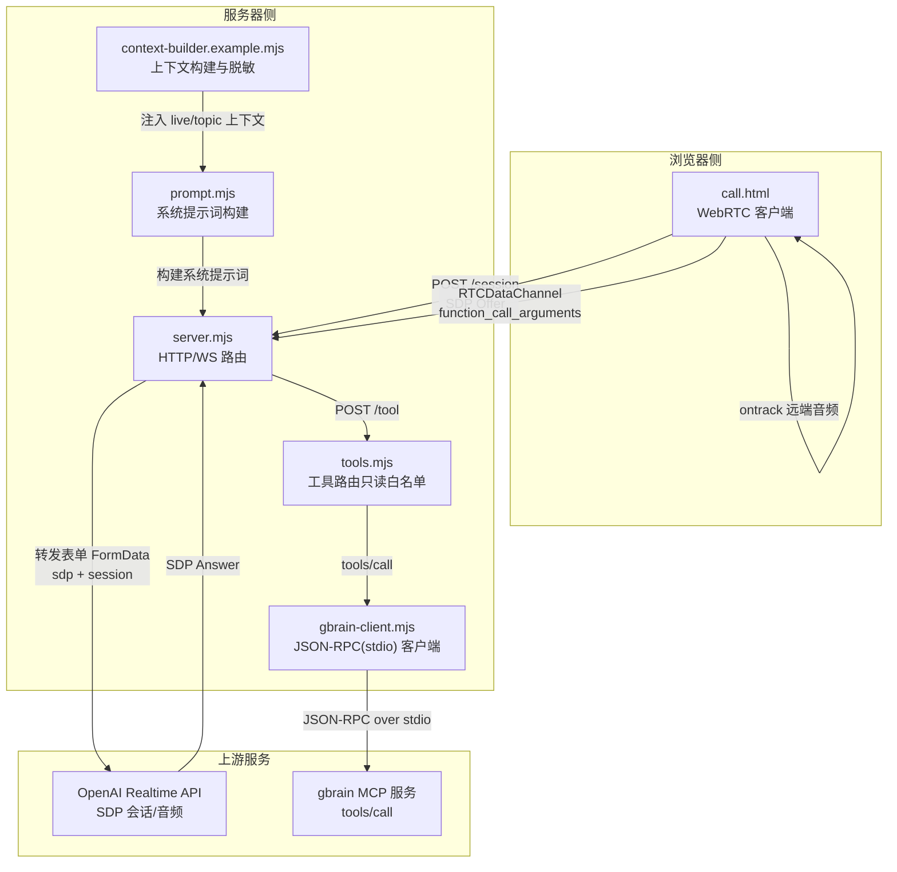
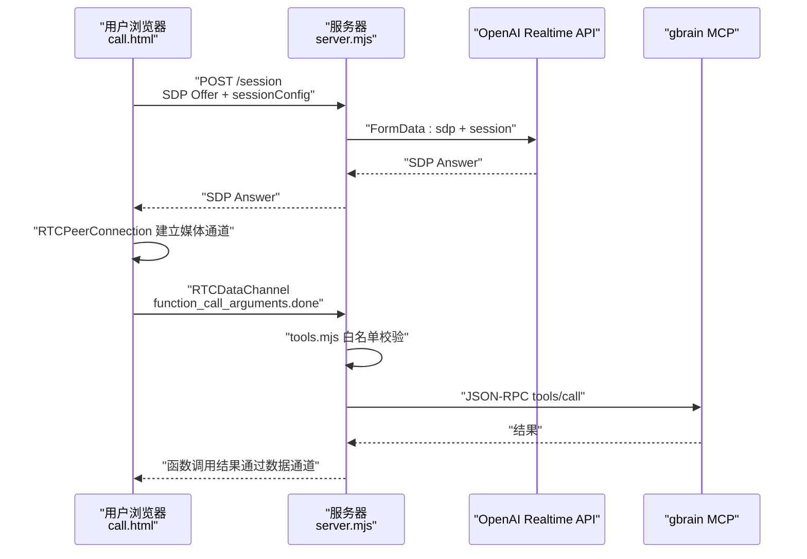
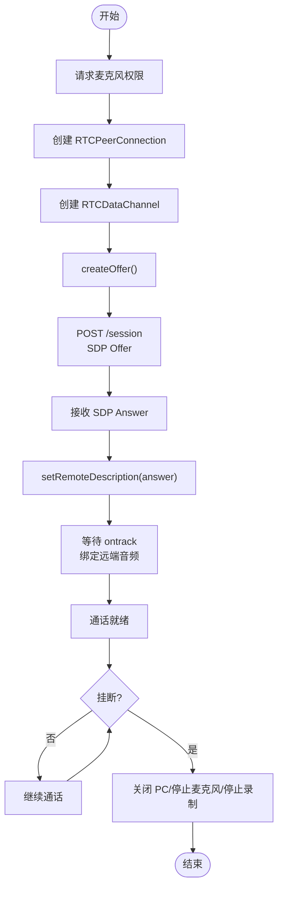
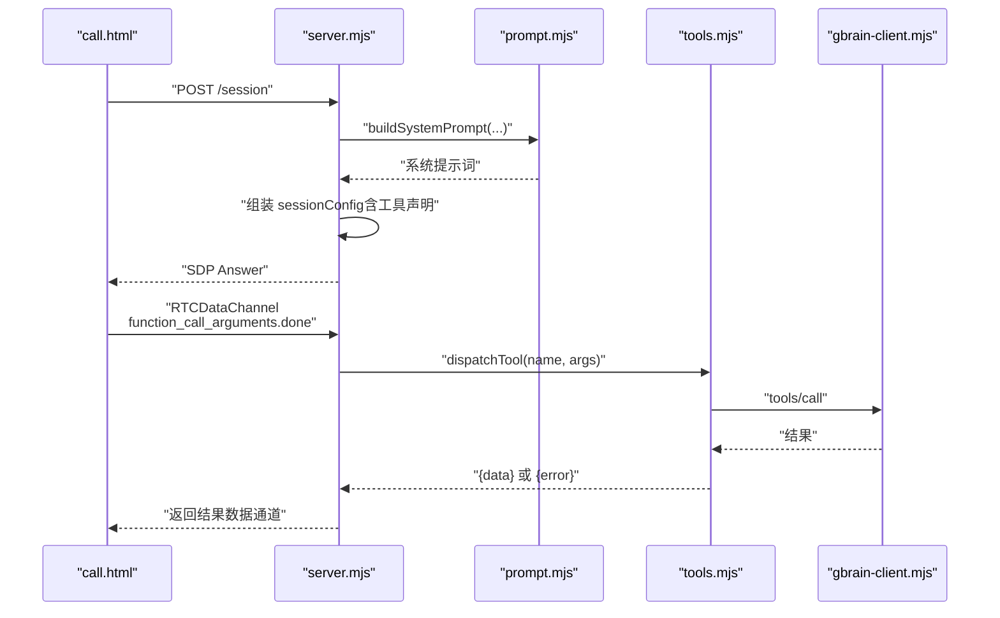
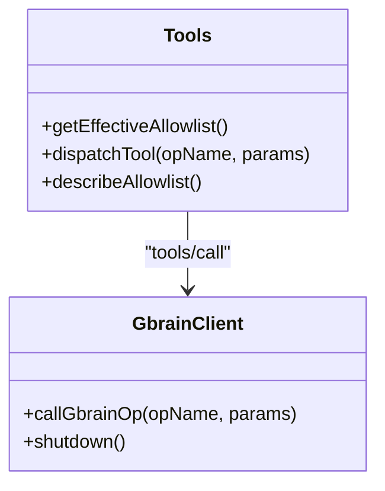
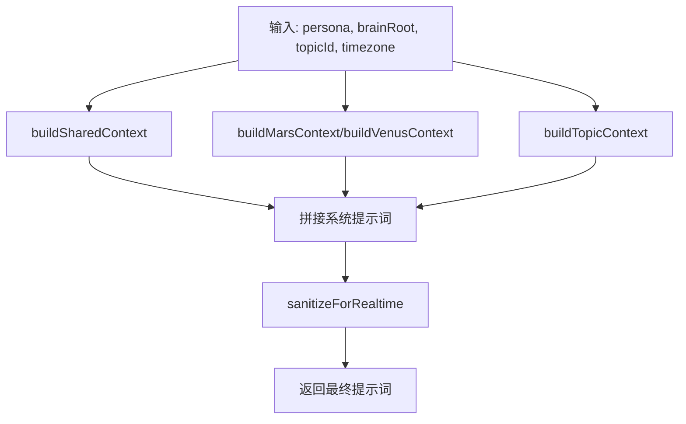
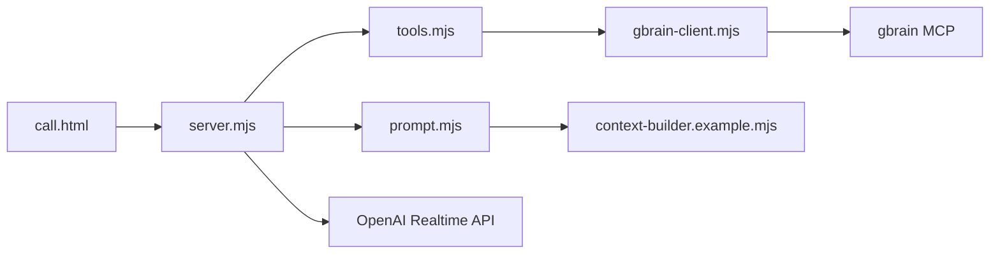

# 架构设计

<cite>
**本文引用的文件**
- [agent-voice.md](file://recipes/agent-voice.md)
- [twilio-voice-brain.md](file://recipes/twilio-voice-brain.md)
- [call.html](file://recipes/agent-voice/code/public/call.html)
- [server.mjs](file://recipes/agent-voice/code/server.mjs)
- [tools.mjs](file://recipes/agent-voice/code/tools.mjs)
- [gbrain-client.mjs](file://recipes/agent-voice/code/gbrain-client.mjs)
- [prompt.mjs](file://recipes/agent-voice/code/prompt.mjs)
- [context-builder.example.mjs](file://recipes/agent-voice/code/lib/context-builder.example.mjs)
- [twilio-bridge.mjs](file://recipes/agent-voice/code/lib/twilio-bridge.mjs)
</cite>

## 目录
1. [引言](#引言)
2. [项目结构](#项目结构)
3. [核心组件](#核心组件)
4. [架构总览](#架构总览)
5. [详细组件分析](#详细组件分析)
6. [依赖关系分析](#依赖关系分析)
7. [性能考量](#性能考量)
8. [故障排查指南](#故障排查指南)
9. [结论](#结论)
10. [附录](#附录)

## 引言
本文件面向语音代理（WebRTC-first）的整体架构设计，聚焦浏览器客户端（call.html）、服务器端（server.mjs）与 gbrain MCP 服务之间的交互模式，系统性阐述：
- WebRTC 首选的 SDP 交换流程与实时音频传输机制
- JSON-RPC over stdio 的工具调用协议
- 可选 Twilio 适配器（TwiML 处理与 WSS 桥接）
- 生产环境部署与安全加固要点

该架构以“浏览器 WebRTC 客户端 + 服务器中转 + gbrain MCP 工具路由”为核心，辅以可选的 Twilio 入站电话桥接路径。

## 项目结构
- 浏览器静态资源位于 public/，其中 call.html 是 WebRTC 客户端入口
- 服务器端逻辑集中在 server.mjs，负责 HTTP 路由、/session SDP 交换、/tool 工具分发、可选 Twilio 端点
- 工具路由在 tools.mjs，采用只读白名单策略，通过 gbrain-client.mjs 与 gbrain MCP 交互
- prompt.mjs 与 context-builder.example.mjs 组合构建会话系统提示词，确保身份优先与上下文安全
- twilio-bridge.mjs 提供 Twilio 媒体流到其他模型（如 Gemini）的桥接能力（参考旧版 recipe）

图示来源
- [server.mjs:107-189](file://recipes/agent-voice/code/server.mjs#L107-L189)
- [call.html:235-254](file://recipes/agent-voice/code/public/call.html#L235-L254)
- [tools.mjs:138-163](file://recipes/agent-voice/code/tools.mjs#L138-L163)
- [gbrain-client.mjs:94-140](file://recipes/agent-voice/code/gbrain-client.mjs#L94-L140)
- [prompt.mjs:43-111](file://recipes/agent-voice/code/prompt.mjs#L43-L111)
- [context-builder.example.mjs:116-166](file://recipes/agent-voice/code/lib/context-builder.example.mjs#L116-L166)

章节来源
- [agent-voice.md:98-127](file://recipes/agent-voice.md#L98-L127)
- [server.mjs:223-267](file://recipes/agent-voice/code/server.mjs#L223-L267)

## 核心组件
- 浏览器 WebRTC 客户端（call.html）
  - 创建 RTCPeerConnection，添加本地麦克风轨道
  - 建立 RTCDataChannel 用于函数调用事件传递
  - 发送 SDP Offer 至 /session，接收 SDP Answer 后开始双向音频
  - 可选测试模式：WebAudio-tee + MediaRecorder 捕获回放音频
- 服务器端（server.mjs）
  - HTTP 路由：/call、/session、/tool、/voice、/health、静态资源
  - /session 使用 FormData 将 SDP Offer 与会话配置转发至 OpenAI Realtime API，返回 SDP Answer
  - /tool 接收来自数据通道的函数调用请求，经 tools.mjs 白名单校验后转发至 gbrain MCP
  - 可选 Twilio 端点：/voice 返回 TwiML，/ws 为 WSS 桥接（recipe 选项）
- 工具路由（tools.mjs）
  - 默认只读白名单（搜索、查询、读取页面等），拒绝写操作
  - 支持本地覆盖扩展有限写操作（受限制的“可选写”）
  - 永远拒绝高危操作（denylist）
- gbrain 客户端（gbrain-client.mjs）
  - 以 stdio JSON-RPC 方式与 gbrain serve 通信
  - 单次初始化后复用连接，按需发送 tools/call
- 提示词与上下文（prompt.mjs、context-builder.example.mjs）
  - 身份优先的系统提示词构建
  - live 上下文与 topic 上下文注入，严格脱敏与长度控制

章节来源
- [call.html:138-271](file://recipes/agent-voice/code/public/call.html#L138-L271)
- [server.mjs:107-189](file://recipes/agent-voice/code/server.mjs#L107-L189)
- [tools.mjs:38-112](file://recipes/agent-voice/code/tools.mjs#L38-L112)
- [gbrain-client.mjs:94-140](file://recipes/agent-voice/code/gbrain-client.mjs#L94-L140)
- [prompt.mjs:43-111](file://recipes/agent-voice/code/prompt.mjs#L43-L111)
- [context-builder.example.mjs:116-166](file://recipes/agent-voice/code/lib/context-builder.example.mjs#L116-L166)

## 架构总览
WebRTC-first 的核心交互链路如下：
- 浏览器发起 /session，携带 SDP Offer 与会话配置（含工具声明）
- 服务器向 OpenAI Realtime API 提交 FormData，获得 SDP Answer 并返回给浏览器
- 浏览器完成 ICE/DTLS 握手，建立双向音频通道
- 数据通道事件（函数调用参数完成）触发 /tool 请求，服务器在白名单内进行路由
- 工具执行通过 gbrain-client.mjs 以 JSON-RPC over stdio 调用 gbrain MCP

图示来源
- [server.mjs:107-189](file://recipes/agent-voice/code/server.mjs#L107-L189)
- [call.html:274-305](file://recipes/agent-voice/code/public/call.html#L274-L305)
- [tools.mjs:138-163](file://recipes/agent-voice/code/tools.mjs#L138-L163)
- [gbrain-client.mjs:94-140](file://recipes/agent-voice/code/gbrain-client.mjs#L94-L140)

章节来源
- [agent-voice.md:98-127](file://recipes/agent-voice.md#L98-L127)
- [server.mjs:223-267](file://recipes/agent-voice/code/server.mjs#L223-L267)

## 详细组件分析

### 浏览器 WebRTC 客户端（call.html）
- 功能要点
  - 获取麦克风权限，创建 RTCPeerConnection，添加本地音频轨道
  - 创建 RTCDataChannel 用于与服务器交换函数调用事件
  - ontrack 回调中将远端音频流绑定到 <audio> 播放；测试模式下通过 WebAudio-tee 与 MediaRecorder 捕获回放
  - 发起 /session，提交 SDP Offer，解析 SDP Answer 并设置远端描述
- 关键流程（SDP 交换）
  - 创建 Offer -> setLocalDescription -> POST /session -> setRemoteDescription -> 建立媒体
- 数据通道消息处理
  - 解析 function_call_arguments.done，构造 /tool 请求，收到结果后通过数据通道回传

图示来源
- [call.html:138-271](file://recipes/agent-voice/code/public/call.html#L138-L271)
- [call.html:274-305](file://recipes/agent-voice/code/public/call.html#L274-L305)

章节来源
- [call.html:138-271](file://recipes/agent-voice/code/public/call.html#L138-L271)
- [call.html:274-305](file://recipes/agent-voice/code/public/call.html#L274-L305)

### 服务器端（server.mjs）
- HTTP 路由职责
  - /call：提供静态页面（浏览器客户端）
  - /session：接收 SDP Offer，拼装 sessionConfig（含工具声明），使用 FormData 转发至 OpenAI Realtime API，返回 SDP Answer
  - /tool：接收来自数据通道的函数调用，校验参数后交由 tools.mjs 分发
  - /voice：可选 Twilio 入站 TwiML（返回 <Stream wss://.../ws/>）
  - /health：健康检查
- /session 关键点
  - 从 URL 查询参数解析 persona/topicId/topicName
  - 构建系统提示词（prompt.mjs），包含 live/topic 上下文
  - 以 FormData 形式提交 sdp 与 session（注意 voice 在 audio.output.voice 下）
- /tool 关键点
  - 校验 JSON 结构与工具名
  - 通过 tools.mjs 的 getEffectiveAllowlist 决定是否允许
- CORS 与安全
  - 默认允许同源；生产应收紧为白名单域名
  - 缺省未实现速率限制、签名验证、鉴权等（需按生产清单自行增强）

图示来源
- [server.mjs:107-189](file://recipes/agent-voice/code/server.mjs#L107-L189)
- [prompt.mjs:43-111](file://recipes/agent-voice/code/prompt.mjs#L43-L111)
- [tools.mjs:138-163](file://recipes/agent-voice/code/tools.mjs#L138-L163)
- [gbrain-client.mjs:94-140](file://recipes/agent-voice/code/gbrain-client.mjs#L94-L140)

章节来源
- [server.mjs:107-189](file://recipes/agent-voice/code/server.mjs#L107-L189)
- [server.mjs:223-267](file://recipes/agent-voice/code/server.mjs#L223-L267)

### 工具路由与 gbrain 客户端（tools.mjs、gbrain-client.mjs）
- 工具路由
  - 默认只读白名单（READ_ONLY_OPS），拒绝写操作
  - 支持本地覆盖 tools-allowlist.local.json 扩展有限写（OPTIONAL_OPS），但不可绕过 DENYLIST
  - 对未知或拒绝项返回结构化错误，不抛异常
- gbrain 客户端
  - 以 stdio JSON-RPC 与 gbrain serve 通信
  - 初始化一次，后续复用连接；tools/call 返回内容可能为文本型 JSON，自动解析
  - 提供测试桩接口，便于单元测试

图示来源
- [tools.mjs:38-112](file://recipes/agent-voice/code/tools.mjs#L38-L112)
- [gbrain-client.mjs:94-140](file://recipes/agent-voice/code/gbrain-client.mjs#L94-L140)

章节来源
- [tools.mjs:38-112](file://recipes/agent-voice/code/tools.mjs#L38-L112)
- [gbrain-client.mjs:94-140](file://recipes/agent-voice/code/gbrain-client.mjs#L94-L140)

### 提示词与上下文（prompt.mjs、context-builder.example.mjs）
- 身份优先：先注入“你是谁”的角色定义，再叠加共享上下文、实时上下文、工具列表与硬规则
- 上下文构建
  - buildMarsContext：情感与记忆背景
  - buildVenusContext：日程与任务摘要
  - buildTopicContext：从话题 ID 解析最近对话摘要（仅注入 ID，不注入内容，避免泄露与注入）
- 脱敏与截断
  - sanitizeForRealtime：替换或移除历史导致 Realtime 连接问题的 Unicode 字符
  - 上下文最大字符数与换行边界截断
  - PII 正则脱敏（邮箱、电话）

图示来源
- [prompt.mjs:43-111](file://recipes/agent-voice/code/prompt.mjs#L43-L111)
- [context-builder.example.mjs:116-166](file://recipes/agent-voice/code/lib/context-builder.example.mjs#L116-L166)
- [context-builder.example.mjs:188-210](file://recipes/agent-voice/code/lib/context-builder.example.mjs#L188-L210)

章节来源
- [prompt.mjs:43-111](file://recipes/agent-voice/code/prompt.mjs#L43-L111)
- [context-builder.example.mjs:116-166](file://recipes/agent-voice/code/lib/context-builder.example.mjs#L116-L166)
- [context-builder.example.mjs:188-210](file://recipes/agent-voice/code/lib/context-builder.example.mjs#L188-L210)

### Twilio 适配器（可选）
- TwiML 处理
  - /voice 返回 TwiML，指示 Twilio 连接到 WSS 地址 /ws
- WSS 桥接
  - 服务器端可实现 /ws（recipe 选项），将 Twilio 媒体流与上游模型（如 Gemini）桥接
  - twilio-bridge.mjs 展示了桥接模式：音频编解码、工具调用、转录记录与升级支持
- 注意事项
  - 旧版 recipe 提供了更完整的 Twilio→OpenAI Realtime 流程（见 twilio-voice-brain.md），当前 agent-voice 仍保留可选桥接能力

章节来源
- [server.mjs:209-220](file://recipes/agent-voice/code/server.mjs#L209-L220)
- [twilio-bridge.mjs:30-201](file://recipes/agent-voice/code/lib/twilio-bridge.mjs#L30-L201)
- [twilio-voice-brain.md:73-116](file://recipes/twilio-voice-brain.md#L73-L116)

## 依赖关系分析
- 组件耦合
  - call.html 与 server.mjs：通过 /session 与数据通道事件耦合
  - server.mjs 与 tools.mjs：路由层依赖工具白名单策略
  - tools.mjs 与 gbrain-client.mjs：工具层依赖 MCP 客户端
  - prompt.mjs 与 context-builder.example.mjs：提示词层依赖上下文构建
- 外部依赖
  - OpenAI Realtime API（SDP 会话与音频）
  - gbrain MCP（tools/call）
  - Twilio（可选，入站电话桥接）

图示来源
- [server.mjs:107-189](file://recipes/agent-voice/code/server.mjs#L107-L189)
- [tools.mjs:138-163](file://recipes/agent-voice/code/tools.mjs#L138-L163)
- [gbrain-client.mjs:94-140](file://recipes/agent-voice/code/gbrain-client.mjs#L94-L140)
- [prompt.mjs:43-111](file://recipes/agent-voice/code/prompt.mjs#L43-L111)
- [context-builder.example.mjs:116-166](file://recipes/agent-voice/code/lib/context-builder.example.mjs#L116-L166)

章节来源
- [server.mjs:223-267](file://recipes/agent-voice/code/server.mjs#L223-L267)
- [tools.mjs:38-112](file://recipes/agent-voice/code/tools.mjs#L38-L112)

## 性能考量
- WebRTC 音频
  - 使用浏览器原生音频路径，避免额外转码
  - MediaRecorder 测试捕获按块写入，降低内存峰值
- 工具调用
  - gbrain-client.mjs 采用一次性初始化与复用连接，减少进程启动开销
  - tools.mjs 白名单快速判定，拒绝无效/危险调用
- 提示词与上下文
  - 上下文长度上限与截断策略，避免提示词过长影响延迟与成本
  - sanitizeForRealtime 移除可能导致 Realtime 连接异常的字符，提升稳定性

## 故障排查指南
- /session 失败
  - 检查 OPENAI_API_KEY 是否设置
  - 确认 SDP Offer 格式正确
  - 查看服务器日志中的上游错误信息
- 工具调用失败
  - 确认工具名在有效白名单内
  - 检查 gbrain MCP 是否正常运行（stdio JSON-RPC）
  - 查看 gbrain-client.mjs 的 stderr 输出
- 浏览器端无回放或回放为空
  - 确认测试模式参数 ?test=1 已启用
  - 检查 WebAudio-tee 与 MediaRecorder 初始化是否成功
- Twilio 入站
  - /voice 返回的 WSS 地址是否可达
  - /ws 是否保持连接，音频编解码是否匹配
  - 参考 twilio-bridge.mjs 的日志输出定位问题

章节来源
- [server.mjs:107-189](file://recipes/agent-voice/code/server.mjs#L107-L189)
- [gbrain-client.mjs:75-89](file://recipes/agent-voice/code/gbrain-client.mjs#L75-L89)
- [call.html:164-194](file://recipes/agent-voice/code/public/call.html#L164-L194)
- [twilio-bridge.mjs:204-236](file://recipes/agent-voice/code/lib/twilio-bridge.mjs#L204-L236)

## 结论
该语音代理架构以 WebRTC 为首要入口，结合 OpenAI Realtime API 实现低延迟双向音频，通过只读工具白名单与严格的上下文脱敏保障安全性，借助 JSON-RPC over stdio 与 gbrain MCP 实现语义检索与工具调用。可选的 Twilio 适配器为入站电话提供了成熟的桥接路径。生产部署建议补齐速率限制、签名验证、CORS 白名单与鉴权等安全措施，并根据业务场景选择是否启用 Twilio 入站。

## 附录
- 生产环境部署清单（摘自 recipe）
  - Twilio 签名验证（/voice）
  - /session 与 /tool 速率限制
  - CORS 白名单
  - /tool 认证（若暴露公网）
  - HTTPS（浏览器麦克风要求）
  - Twilio 回退 URL（/fallback）
  - 上下文 PII 脱敏强化
- 术语
  - SDP：Session Description Protocol，WebRTC 会话描述
  - JSON-RPC：基于 JSON 的远程过程调用协议
  - MCP：Model Context Protocol，gbrain 的工具/操作协议

章节来源
- [agent-voice.md:129-140](file://recipes/agent-voice.md#L129-L140)