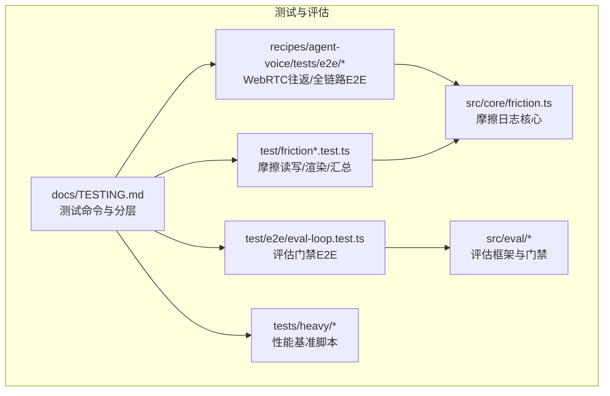
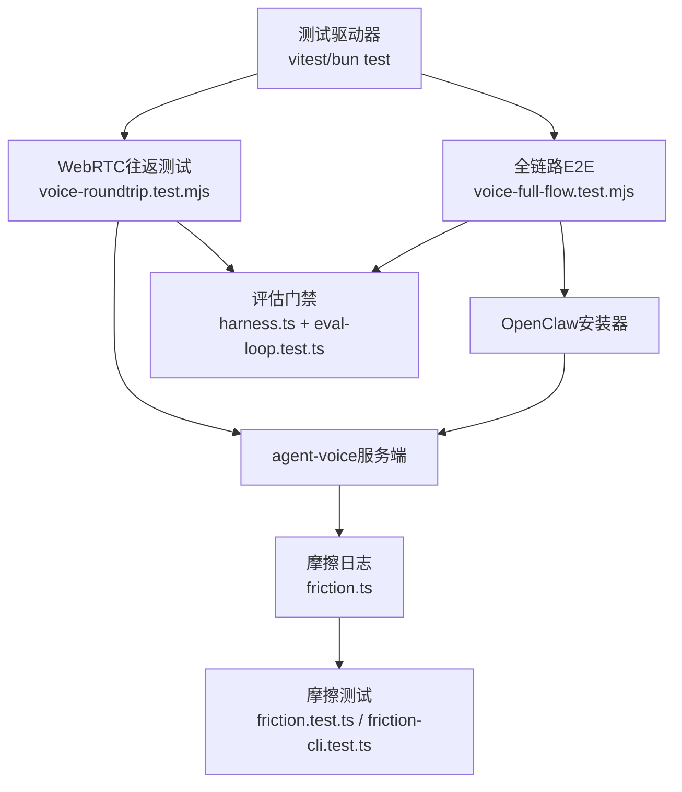
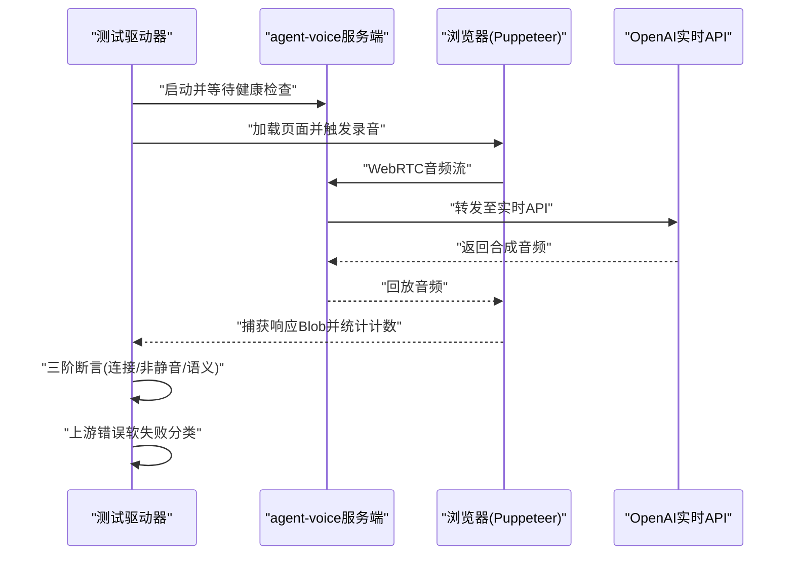
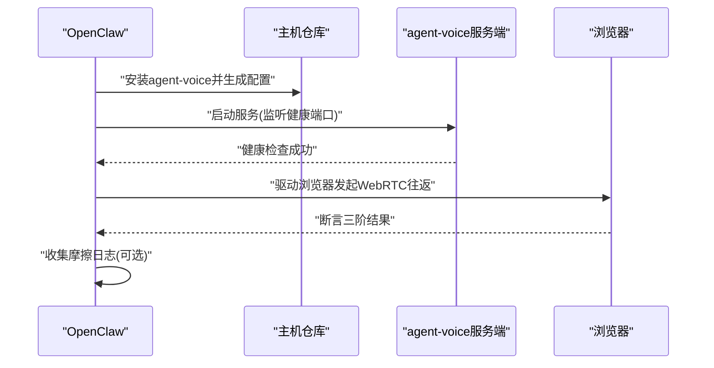
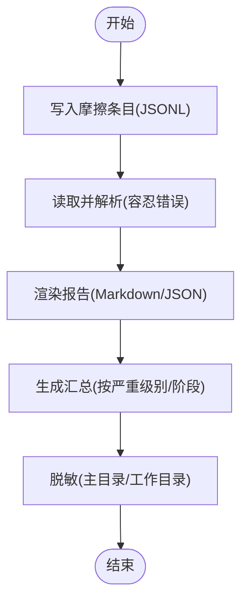
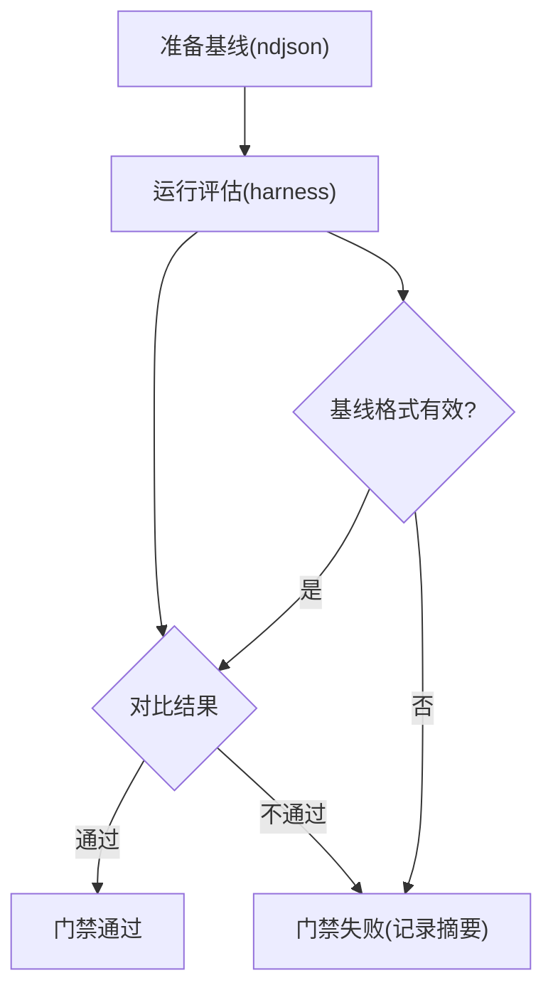
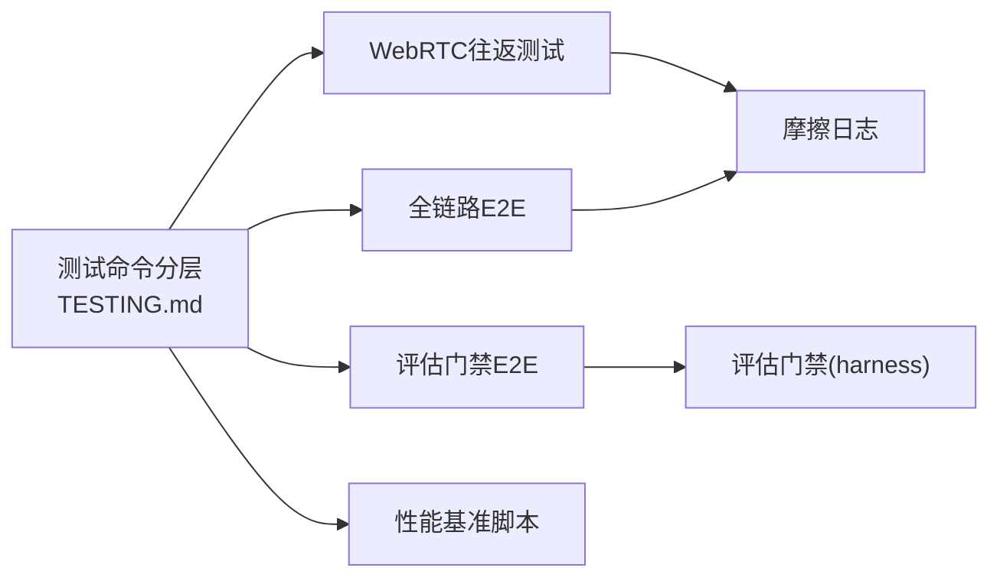

# 测试与评估

<cite>
**本文引用的文件**
- [README.md](file://README.md)
- [TESTING.md](file://docs/TESTING.md)
- [voice-roundtrip.test.mjs](file://recipes/agent-voice/tests/e2e/voice-roundtrip.test.mjs)
- [voice-full-flow.test.mjs](file://recipes/agent-voice/tests/e2e/voice-full-flow.test.mjs)
- [friction.ts](file://src/core/friction.ts)
- [friction.test.ts](file://test/friction.test.ts)
- [friction-cli.test.ts](file://test/friction-cli.test.ts)
- [harness.ts](file://src/eval/code-retrieval/harness.ts)
- [eval-loop.test.ts](file://test/e2e/eval-loop.test.ts)
- [_read_latency_workload.ts](file://tests/heavy/_read_latency_workload.ts)
</cite>

## 目录
1. [简介](#简介)
2. [项目结构](#项目结构)
3. [核心组件](#核心组件)
4. [架构总览](#架构总览)
5. [详细组件分析](#详细组件分析)
6. [依赖关系分析](#依赖关系分析)
7. [性能考量](#性能考量)
8. [故障排查指南](#故障排查指南)
9. [结论](#结论)
10. [附录](#附录)

## 简介
本文件面向语音代理（agent-voice）的测试与评估，系统化阐述以下内容：
- 单元测试、端到端测试与完整流程测试的执行方式与预期结果
- WebRTC 往返测试、OpenAI 实时 API 测试与摩擦发现测试的配置方法
- 测试环境搭建、测试数据准备与结果分析
- 性能基准测试与质量门禁标准

## 项目结构
围绕语音代理的测试与评估，仓库中与之直接相关的测试与文档主要分布在如下位置：
- 文档与测试规范：docs/TESTING.md
- 语音代理 E2E 测试：recipes/agent-voice/tests/e2e/*
- 摩擦发现核心实现与测试：src/core/friction.ts 与 test/friction*.test.ts
- 评估框架与质量门禁：src/eval/* 与 test/e2e/eval-loop.test.ts
- 性能基准脚本：tests/heavy/*

图表来源
- [TESTING.md:1-304](file://docs/TESTING.md#L1-L304)
- [voice-roundtrip.test.mjs:1-161](file://recipes/agent-voice/tests/e2e/voice-roundtrip.test.mjs#L1-L161)
- [voice-full-flow.test.mjs:1-238](file://recipes/agent-voice/tests/e2e/voice-full-flow.test.mjs#L1-L238)
- [friction.ts:1-205](file://src/core/friction.ts#L1-L205)
- [friction.test.ts:1-233](file://test/friction.test.ts#L1-L233)
- [friction-cli.test.ts:1-197](file://test/friction-cli.test.ts#L1-L197)
- [harness.ts:304-338](file://src/eval/code-retrieval/harness.ts#L304-L338)
- [eval-loop.test.ts:208-243](file://test/e2e/eval-loop.test.ts#L208-L243)
- [_read_latency_workload.ts:27-74](file://tests/heavy/_read_latency_workload.ts#L27-L74)

章节来源
- [TESTING.md:1-304](file://docs/TESTING.md#L1-L304)

## 核心组件
- 测试命令与分层：本地快速循环、CI 预检、慢路径、串行隔离、真实数据库 E2E、重负载脚本等。
- WebRTC 往返与全链路 E2E：验证从浏览器麦克风采集到服务端实时处理再到播放的完整链路。
- 摩擦发现（Friction）：统一记录“困惑点”与“愉悦点”，支持日志、渲染、汇总与隐私脱敏。
- 评估框架与质量门禁：以检索质量为基线，通过对比与稳定性指标判定是否通过。

章节来源
- [TESTING.md:6-46](file://docs/TESTING.md#L6-L46)
- [voice-roundtrip.test.mjs:1-161](file://recipes/agent-voice/tests/e2e/voice-roundtrip.test.mjs#L1-L161)
- [voice-full-flow.test.mjs:1-238](file://recipes/agent-voice/tests/e2e/voice-full-flow.test.mjs#L1-L238)
- [friction.ts:1-205](file://src/core/friction.ts#L1-L205)
- [harness.ts:304-338](file://src/eval/code-retrieval/harness.ts#L304-L338)

## 架构总览
下图展示语音代理测试与评估的关键交互：测试驱动器调用被测模块，模块间通过明确接口传递数据；评估门禁对输出进行判定；摩擦日志贯穿全流程用于问题定位与改进。

图表来源
- [voice-roundtrip.test.mjs:1-161](file://recipes/agent-voice/tests/e2e/voice-roundtrip.test.mjs#L1-L161)
- [voice-full-flow.test.mjs:1-238](file://recipes/agent-voice/tests/e2e/voice-full-flow.test.mjs#L1-L238)
- [friction.ts:1-205](file://src/core/friction.ts#L1-L205)
- [friction.test.ts:1-233](file://test/friction.test.ts#L1-L233)
- [friction-cli.test.ts:1-197](file://test/friction-cli.test.ts#L1-L197)
- [harness.ts:304-338](file://src/eval/code-retrieval/harness.ts#L304-L338)
- [eval-loop.test.ts:208-243](file://test/e2e/eval-loop.test.ts#L208-L243)

## 详细组件分析

### WebRTC 往返测试（recipes/agent-voice/tests/e2e）
目标：验证浏览器麦克风采集、WebRTC 传输、服务端实时处理与音频回放的端到端链路，并对连接性、非静音性与语义正确性进行分级断言。

- 执行方式
  - 设置环境变量启用测试并提供 OpenAI 密钥
  - 启动 agent-voice 服务端进程并通过健康检查
  - 使用 Puppeteer 驱动浏览器完成一次往返音频采集与播放
  - 记录诊断信息并进行三阶断言

- 预期结果
  - 连接性（硬性）：发送/接收音频帧计数大于零
  - 非静音（硬性）：响应 Blob 大于阈值；若为 WAV 则进一步校验 RMS 方差
  - 语义（软性）：Whisper 转写 + LLM 判定回答是否符合预期

- 上游错误分类
  - 对上游（如 OpenAI 实时 API）的 429/500/503 或 WS 异常按软失败处理，避免 CI 波动

图表来源
- [voice-roundtrip.test.mjs:63-154](file://recipes/agent-voice/tests/e2e/voice-roundtrip.test.mjs#L63-L154)

章节来源
- [voice-roundtrip.test.mjs:1-161](file://recipes/agent-voice/tests/e2e/voice-roundtrip.test.mjs#L1-L161)

### 全链路 E2E（OpenClaw 安装 + WebRTC 往返）
目标：验证从 OpenClaw 安装 agent-voice 到服务端启动、文件系统完整性与 WebRTC 往返的完整流程。

- 执行方式
  - 准备临时工作区并初始化 Git 仓库
  - 编写简报（BRIEF.md），指导 OpenClaw 安装 agent-voice 并启动服务
  - 等待健康检查或 OpenClaw 退出
  - 断言文件系统完整性（服务端入口、源配置、路由注入）、无敏感信息泄露
  - 执行 WebRTC 往返并进行三阶断言

- 预期结果
  - 文件系统：存在服务端入口与源配置文件，路由注入成功
  - 安装产物：复制文件数量满足阈值，无敏感词泄漏
  - 往返：连接性与非静音性断言通过，语义断言软通过并收集摩擦日志

图表来源
- [voice-full-flow.test.mjs:73-232](file://recipes/agent-voice/tests/e2e/voice-full-flow.test.mjs#L73-L232)

章节来源
- [voice-full-flow.test.mjs:1-238](file://recipes/agent-voice/tests/e2e/voice-full-flow.test.mjs#L1-L238)

### 摩擦发现测试（src/core/friction.ts 与 test/friction*.test.ts）
目标：统一记录“困惑点”与“愉悦点”，确保在不同运行上下文中（独立运行或测试夹具）均能可靠落盘与解析。

- 核心能力
  - 写入：按运行 ID 将 JSONL 条目追加到摩擦目录
  - 读取：容忍部分行格式错误，统计异常行数
  - 渲染：支持 Markdown 与 JSON 输出，含严重级别与阶段分组
  - 汇总：列出运行集合及其计数（困惑/愉悦/中断/按严重级别）
  - 隐私：自动脱敏用户主目录与当前工作目录

- 测试覆盖
  - 写入/读取/列表/渲染/摘要等行为
  - 长消息截断与错误字段扁平化
  - 运行 ID 合法性校验与回退策略

图表来源
- [friction.ts:119-205](file://src/core/friction.ts#L119-L205)
- [friction.test.ts:35-233](file://test/friction.test.ts#L35-L233)
- [friction-cli.test.ts:45-197](file://test/friction-cli.test.ts#L45-L197)

章节来源
- [friction.ts:1-205](file://src/core/friction.ts#L1-L205)
- [friction.test.ts:1-233](file://test/friction.test.ts#L1-L233)
- [friction-cli.test.ts:1-197](file://test/friction-cli.test.ts#L1-L197)

### 评估框架与质量门禁（src/eval/* 与 test/e2e/eval-loop.test.ts）
目标：以检索质量为基线，通过对比与稳定性指标判定是否通过，形成可重复的质量门禁。

- 关键指标与门禁参数
  - 精度提升（precision@K）与 Top-1 稳定率作为双轨判定
  - 最少问题通过数（最小清除数）
  - 基线文件格式与解析严格性（错误即失败）

- E2E 门禁流程
  - 生成/发布基线文件
  - 运行评估并比较当前与基线
  - 对比不匹配或基线格式错误时，强制失败并给出说明

图表来源
- [harness.ts:304-338](file://src/eval/code-retrieval/harness.ts#L304-L338)
- [eval-loop.test.ts:208-243](file://test/e2e/eval-loop.test.ts#L208-L243)

章节来源
- [harness.ts:304-338](file://src/eval/code-retrieval/harness.ts#L304-L338)
- [eval-loop.test.ts:208-243](file://test/e2e/eval-loop.test.ts#L208-L243)

### 性能基准测试（tests/heavy/*）
目标：在真实数据库上测量读延迟等关键指标，建立回归阈值与稳定判据。

- 读延迟工作负载
  - 支持严格模式与阈值百分比控制
  - 输出包含平台、脑页数、阶段 A/B 的分位数、写入成功/失败、耗时、阈值、最终判定与备注/错误

- 使用建议
  - 在 CI 中定期运行，结合阈值与平台差异进行解读
  - 将异常归因到具体查询/写入阶段，定位瓶颈

章节来源
- [_read_latency_workload.ts:27-74](file://tests/heavy/_read_latency_workload.ts#L27-L74)

## 依赖关系分析
- 测试命令与分层定义了测试矩阵与运行策略，决定哪些测试参与本地快速循环、CI 并行与 E2E 执行。
- 语音代理 E2E 依赖 OpenAI 实时 API 与浏览器自动化，同时与摩擦日志协同用于问题追踪。
- 评估门禁依赖严格的基线解析与对比逻辑，确保回归不被静默通过。
- 性能基准脚本独立于业务逻辑，专注于数据库读取路径的稳定性与可重复性。

图表来源
- [TESTING.md:6-46](file://docs/TESTING.md#L6-L46)
- [voice-roundtrip.test.mjs:1-161](file://recipes/agent-voice/tests/e2e/voice-roundtrip.test.mjs#L1-L161)
- [voice-full-flow.test.mjs:1-238](file://recipes/agent-voice/tests/e2e/voice-full-flow.test.mjs#L1-L238)
- [friction.ts:1-205](file://src/core/friction.ts#L1-L205)
- [harness.ts:304-338](file://src/eval/code-retrieval/harness.ts#L304-L338)

章节来源
- [TESTING.md:1-304](file://docs/TESTING.md#L1-L304)

## 性能考量
- WebRTC 往返测试成本较低（约 $0.10/次），适合高频回归与上游状态监控。
- 全链路 E2E 成本更高（约 $1–2/次），建议预发与夜间运行，不作为每日快照门禁。
- 评估门禁与摩擦日志应纳入每日 CI，确保回归不被静默通过且问题可追溯。
- 性能基准脚本建议在变更窗口后运行，结合阈值与平台差异进行解读。

## 故障排查指南
- WebRTC 往返测试
  - 若上游（OpenAI 实时 API）出现 429/500/503 或 WS 异常，测试按软失败处理，避免 CI 波动。
  - 检查浏览器健康检查与服务端日志，确认音频发送/接收计数是否大于零。
  - 若响应 Blob 过小或 RMS 过低，优先检查麦克风权限、浏览器音频解码与 Whisper 转写链路。

- 全链路 E2E
  - OpenClaw 安装失败时，测试会记录警告但仍尝试后续步骤；可使用 gbrain 摩擦日志查看具体阶段与错误。
  - 断言文件系统完整性与路由注入，确保服务端入口与源配置存在且无敏感信息泄露。

- 摩擦日志
  - 若渲染报告缺失或计数异常，检查 JSONL 文件是否存在、是否包含非法行以及运行 ID 是否合法。
  - 使用 gbrain friction 子命令进行日志、渲染、列表与摘要操作，必要时开启脱敏开关。

- 评估门禁
  - 基线文件格式错误将导致强制失败；请核对 ndjson 结构与字段一致性。
  - 对比不匹配时，关注精度提升与 Top-1 稳定率是否达到门禁阈值。

章节来源
- [voice-roundtrip.test.mjs:109-154](file://recipes/agent-voice/tests/e2e/voice-roundtrip.test.mjs#L109-L154)
- [voice-full-flow.test.mjs:197-232](file://recipes/agent-voice/tests/e2e/voice-full-flow.test.mjs#L197-L232)
- [friction.ts:119-205](file://src/core/friction.ts#L119-L205)
- [friction-cli.test.ts:45-197](file://test/friction-cli.test.ts#L45-L197)
- [eval-loop.test.ts:208-243](file://test/e2e/eval-loop.test.ts#L208-L243)

## 结论
本文件梳理了语音代理测试与评估的完整体系：从命令分层、WebRTC 往返与全链路 E2E，到摩擦发现与评估门禁，再到性能基准脚本。通过分级断言与严格门禁，确保功能正确性、用户体验与系统稳定性得到持续保障。

## 附录
- 测试环境搭建与运行
  - 参考测试命令分层与环境变量要求，准备数据库、API 密钥与浏览器驱动
  - WebRTC 往返与全链路 E2E 需要 OpenAI 实时 API 密钥
  - 摩擦日志与评估门禁可在本地独立运行，无需外部服务

- 测试数据准备
  - WebRTC 往返使用预录制音频片段
  - 评估门禁使用标准基线文件（ndjson）
  - 性能基准脚本自动生成工作负载并输出标准化结果

- 结果分析
  - WebRTC：连接性/非静音/语义三阶断言；上游异常软失败
  - 摩擦：按严重级别与阶段分组渲染报告，支持脱敏
  - 评估：精度提升与稳定性双轨判定，基线格式错误强制失败
  - 性能：读延迟分位数与阈值对比，严格模式下回归即失败

章节来源
- [TESTING.md:249-304](file://docs/TESTING.md#L249-L304)
- [voice-roundtrip.test.mjs:18-23](file://recipes/agent-voice/tests/e2e/voice-roundtrip.test.mjs#L18-L23)
- [voice-full-flow.test.mjs:21-24](file://recipes/agent-voice/tests/e2e/voice-full-flow.test.mjs#L21-L24)
- [harness.ts:328-338](file://src/eval/code-retrieval/harness.ts#L328-L338)
- [_read_latency_workload.ts:27-74](file://tests/heavy/_read_latency_workload.ts#L27-L74)