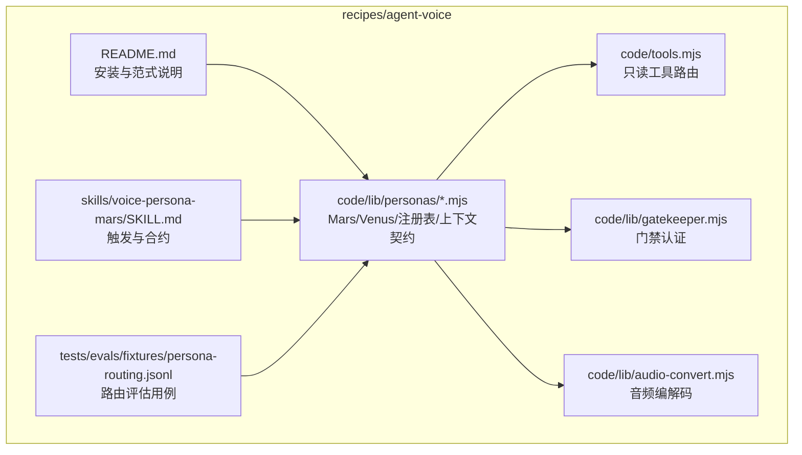
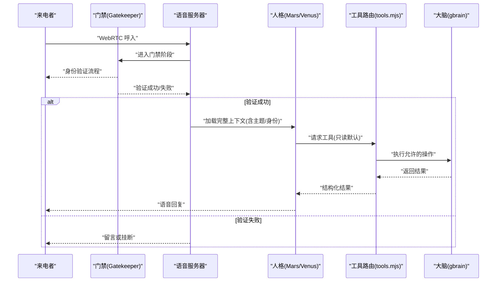
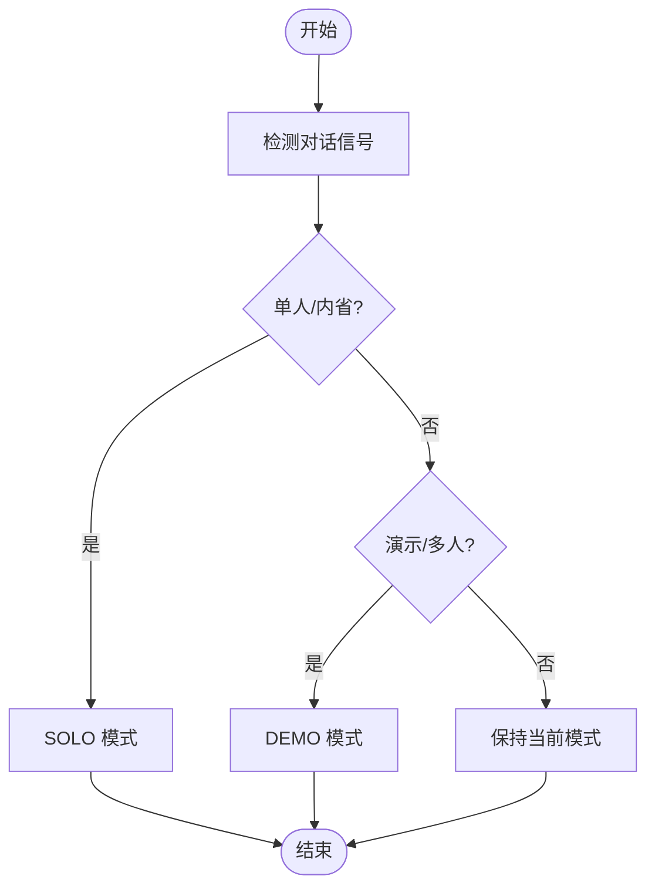
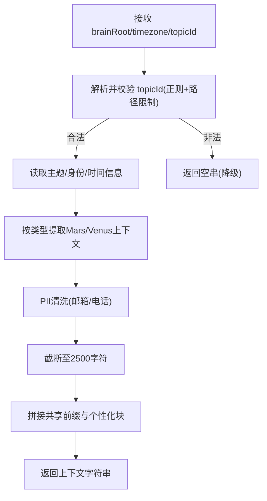
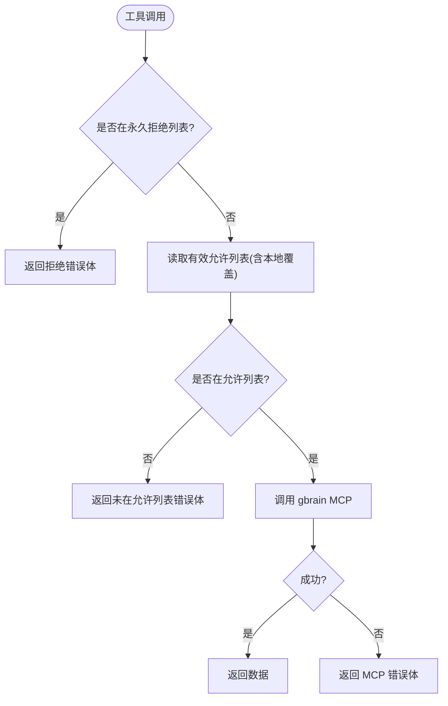
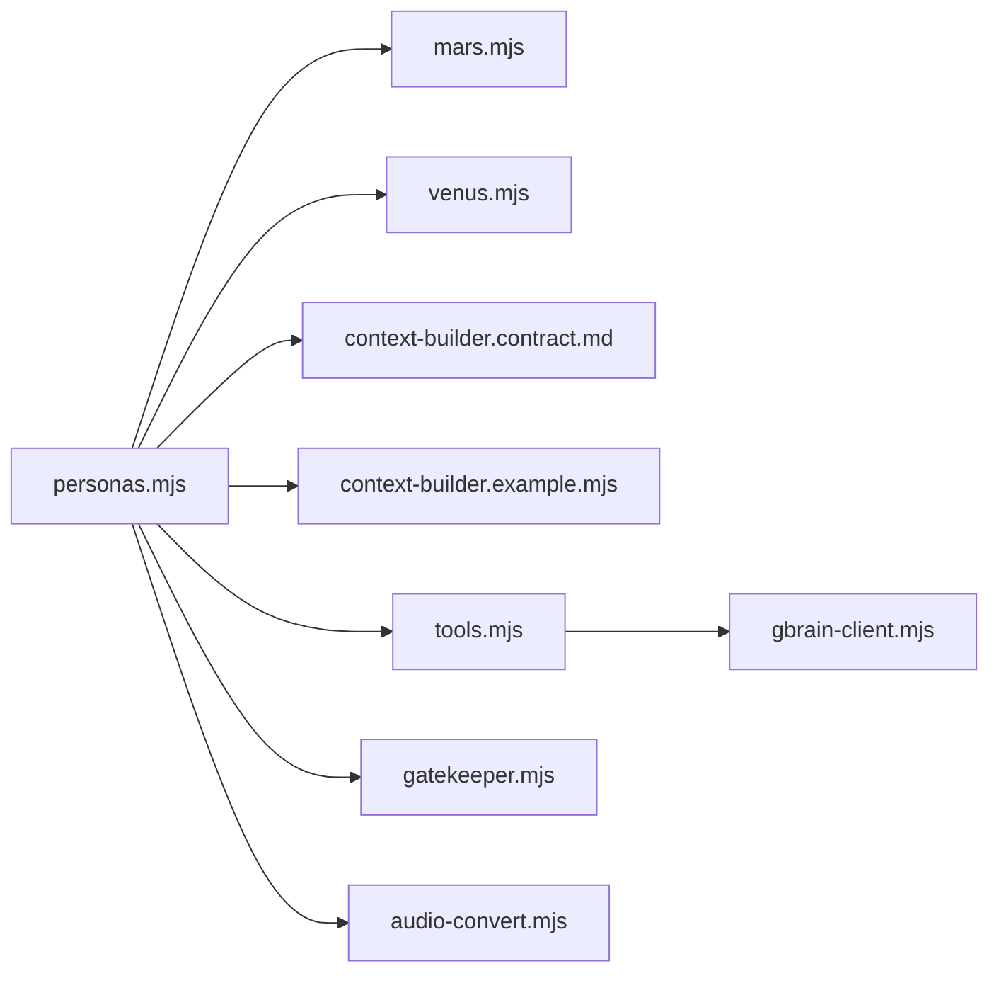

# 语音人格系统

<cite>
**本文引用的文件**
- [recipes/agent-voice/README.md](file://recipes/agent-voice/README.md)
- [recipes/agent-voice/code/lib/personas/mars.mjs](file://recipes/agent-voice/code/lib/personas/mars.mjs)
- [recipes/agent-voice/code/lib/personas/venus.mjs](file://recipes/agent-voice/code/lib/personas/venus.mjs)
- [recipes/agent-voice/code/lib/personas/personas.mjs](file://recipes/agent-voice/code/lib/personas/personas.mjs)
- [recipes/agent-voice/code/lib/personas/context-builder.contract.md](file://recipes/agent-voice/code/lib/personas/context-builder.contract.md)
- [recipes/agent-voice/code/lib/context-builder.example.mjs](file://recipes/agent-voice/code/lib/context-builder.example.mjs)
- [recipes/agent-voice/code/lib/gatekeeper.mjs](file://recipes/agent-voice/code/lib/gatekeeper.mjs)
- [recipes/agent-voice/code/lib/audio-convert.mjs](file://recipes/agent-voice/code/lib/audio-convert.mjs)
- [recipes/agent-voice/code/tools.mjs](file://recipes/agent-voice/code/tools.mjs)
- [recipes/agent-voice/skills/voice-persona-mars/SKILL.md](file://recipes/agent-voice/skills/voice-persona-mars/SKILL.md)
- [recipes/agent-voice/tests/evals/fixtures/persona-routing.jsonl](file://recipes/agent-voice/tests/evals/fixtures/persona-routing.jsonl)
</cite>

## 目录
1. [引言](#引言)
2. [项目结构](#项目结构)
3. [核心组件](#核心组件)
4. [架构总览](#架构总览)
5. [详细组件分析](#详细组件分析)
6. [依赖关系分析](#依赖关系分析)
7. [性能考量](#性能考量)
8. [故障排查指南](#故障排查指南)
9. [结论](#结论)
10. [附录](#附录)

## 引言
本文件系统化阐述“语音人格系统”的设计理念与实现细节，聚焦两种核心人格：Mars（洞察思考伙伴）与 Venus（精明执行助理）。文档覆盖声音配置（Orus 与 Aoede）、对话风格与专业领域、人格选择机制、身份优先的提示构建器、隐私与 Unicode 安全净化策略，并提供可操作的人格定制与扩展指南，以及评估标准与性能测试建议。

## 项目结构
该系统以“参考配方”形式提供，核心代码位于 recipes/agent-voice 下，采用“复制到宿主仓库”的安装模式，便于运营方按需定制。主要目录与职责如下：
- code/lib/personas：定义 Mars/Venus 人格与上下文注入契约
- code/lib：会话管理、音频编解码、门禁认证等基础设施
- code：工具路由与信任边界（只读）
- skills：配套技能包（如 voice-persona-mars），用于路由与触发
- tests/evals：评估用例（如 persona-routing.jsonl）

图示来源
- [recipes/agent-voice/README.md:1-73](file://recipes/agent-voice/README.md#L1-L73)
- [recipes/agent-voice/code/lib/personas/personas.mjs:1-69](file://recipes/agent-voice/code/lib/personas/personas.mjs#L1-L69)
- [recipes/agent-voice/code/tools.mjs:1-176](file://recipes/agent-voice/code/tools.mjs#L1-L176)
- [recipes/agent-voice/code/lib/gatekeeper.mjs:1-75](file://recipes/agent-voice/code/lib/gatekeeper.mjs#L1-L75)
- [recipes/agent-voice/code/lib/audio-convert.mjs:1-217](file://recipes/agent-voice/code/lib/audio-convert.mjs#L1-L217)
- [recipes/agent-voice/skills/voice-persona-mars/SKILL.md:1-98](file://recipes/agent-voice/skills/voice-persona-mars/SKILL.md#L1-L98)
- [recipes/agent-voice/tests/evals/fixtures/persona-routing.jsonl:1-4](file://recipes/agent-voice/tests/evals/fixtures/persona-routing.jsonl#L1-L4)

章节来源
- [recipes/agent-voice/README.md:1-73](file://recipes/agent-voice/README.md#L1-L73)

## 核心组件
- 人格注册与选择
  - 注册表导出 PERSONAS 并提供 getPersona(name) 作为统一入口，默认回退至 Venus。
- 提示构建器契约
  - 规定 buildMarsContext/buildVenusContext/buildTopicContext 的签名、输出长度上限、PII 清洗与失败降级策略。
- 工具路由与信任边界
  - 默认只读工具集；支持通过本地覆盖文件扩展有限写能力，永久拒绝高风险操作。
- 音频编解码
  - 实现 Twilio↔Gemini 的采样率与编码转换，保障端到端通话质量。
- 门禁认证（Venus）
  - 分阶段验证：先零上下文门禁，再加载完整上下文，避免信息泄露。

章节来源
- [recipes/agent-voice/code/lib/personas/personas.mjs:43-69](file://recipes/agent-voice/code/lib/personas/personas.mjs#L43-L69)
- [recipes/agent-voice/code/lib/personas/context-builder.contract.md:16-78](file://recipes/agent-voice/code/lib/personas/context-builder.contract.md#L16-L78)
- [recipes/agent-voice/code/tools.mjs:38-112](file://recipes/agent-voice/code/tools.mjs#L38-L112)
- [recipes/agent-voice/code/lib/audio-convert.mjs:160-193](file://recipes/agent-voice/code/lib/audio-convert.mjs#L160-L193)
- [recipes/agent-voice/code/lib/gatekeeper.mjs:12-37](file://recipes/agent-voice/code/lib/gatekeeper.mjs#L12-L37)

## 架构总览
下图展示从用户来电到语音响应的关键路径，包括音频编解码、工具调用与上下文注入。

图示来源
- [recipes/agent-voice/code/lib/gatekeeper.mjs:12-37](file://recipes/agent-voice/code/lib/gatekeeper.mjs#L12-L37)
- [recipes/agent-voice/code/lib/personas/personas.mjs:27-40](file://recipes/agent-voice/code/lib/personas/personas.mjs#L27-L40)
- [recipes/agent-voice/code/tools.mjs:138-163](file://recipes/agent-voice/code/tools.mjs#L138-L163)

## 详细组件分析

### 人格设计与行为特征
- Mars（洞察思考伙伴）
  - 双模式：SOLO 模式（内省思考伙伴）与 DEMO 模式（社交演示型）
  - 语音：Orus（多语言支持）
  - 行为：即时回应、强调“意义”而非日程；当对话涉及他人或演示场景时自动切换至 DEMO 模式
  - 约束：不处理日程/任务/邮件等物流事务，必要时引导至 Venus
- Venus（精明执行助理）
  - 语音：Aoede（英语）
  - 行为：快速、直接、带观点；强调“完成任务”而非长篇解释
  - 工具：默认只读工具集；写工具需本地覆盖启用

章节来源
- [recipes/agent-voice/code/lib/personas/mars.mjs:1-57](file://recipes/agent-voice/code/lib/personas/mars.mjs#L1-L57)
- [recipes/agent-voice/code/lib/personas/venus.mjs:1-52](file://recipes/agent-voice/code/lib/personas/venus.mjs#L1-L52)
- [recipes/agent-voice/skills/voice-persona-mars/SKILL.md:25-98](file://recipes/agent-voice/skills/voice-persona-mars/SKILL.md#L25-L98)

### 声音配置（Orus 与 Aoede）
- Orus（Mars）
  - 多语言支持（中文、西班牙语、法语、日语、韩语等）
  - 通过实时 API 支持跨语言切换，行为由多语言评估夹具约束
- Aoede（Venus）
  - 英语专用，适合电话通话低延迟场景
- 音频编解码
  - 实现 µ-law 与 PCM 的双向转换，适配 Twilio 与 Gemini 的采样率差异
  - 提供状态化缓冲处理器，确保端到端语音平滑传输

章节来源
- [recipes/agent-voice/code/lib/personas/mars.mjs:14-19](file://recipes/agent-voice/code/lib/personas/mars.mjs#L14-L19)
- [recipes/agent-voice/code/lib/personas/venus.mjs:20](file://recipes/agent-voice/code/lib/personas/venus.mjs#L20)
- [recipes/agent-voice/code/lib/audio-convert.mjs:1-217](file://recipes/agent-voice/code/lib/audio-convert.mjs#L1-L217)

### 对话风格与专业领域
- Mars
  - 风格：温暖幽默、哲学性、关注“内在体验”
  - 专业：意义探索、情感洞察、模式识别、存在性议题
- Venus
  - 风格：锐利、直接、有观点、无废话
  - 专业：日程/任务/邮件/专家检索/最近转录/文章摘要等物流查询

章节来源
- [recipes/agent-voice/code/lib/personas/mars.mjs:55-100](file://recipes/agent-voice/code/lib/personas/mars.mjs#L55-L100)
- [recipes/agent-voice/code/lib/personas/venus.mjs:24-51](file://recipes/agent-voice/code/lib/personas/venus.mjs#L24-L51)

### 人格选择机制
- 路由规则
  - 明确触发词与上下文信号（如“demo mode”“just us”“solo”“多人声音”等）驱动模式切换
  - 评估夹具 persona-routing.jsonl 提供期望路由目标，用于回归与验收
- 注册与回退
  - getPersona(name) 将未知键回退至 Venus，保证通话体验稳定

图示来源
- [recipes/agent-voice/code/lib/personas/mars.mjs:40-52](file://recipes/agent-voice/code/lib/personas/mars.mjs#L40-L52)
- [recipes/agent-voice/tests/evals/fixtures/persona-routing.jsonl:1-4](file://recipes/agent-voice/tests/evals/fixtures/persona-routing.jsonl#L1-L4)
- [recipes/agent-voice/code/lib/personas/personas.mjs:48-55](file://recipes/agent-voice/code/lib/personas/personas.mjs#L48-L55)

章节来源
- [recipes/agent-voice/code/lib/personas/mars.mjs:40-52](file://recipes/agent-voice/code/lib/personas/mars.mjs#L40-L52)
- [recipes/agent-voice/tests/evals/fixtures/persona-routing.jsonl:1-4](file://recipes/agent-voice/tests/evals/fixtures/persona-routing.jsonl#L1-L4)
- [recipes/agent-voice/code/lib/personas/personas.mjs:48-55](file://recipes/agent-voice/code/lib/personas/personas.mjs#L48-L55)

### 身份优先的提示构建器
- 上下文注入
  - 共享前缀：当前日期时间、已验证身份、当前话题
  - 个性化：Mars 的“内省背景”，Venus 的“今日概览”
  - 主题上下文：仅接受严格 slug 的 topicId，防止路径穿越与提示注入
- PII 安全
  - 统一的邮箱/电话正则清洗
  - 输出上限 2500 字符，按行截断，避免泄露
- 失败降级
  - 缺失文件/非法输入返回空串，人格优雅降级

图示来源
- [recipes/agent-voice/code/lib/context-builder.example.mjs:31-42](file://recipes/agent-voice/code/lib/context-builder.example.mjs#L31-L42)
- [recipes/agent-voice/code/lib/context-builder.example.mjs:188-210](file://recipes/agent-voice/code/lib/context-builder.example.mjs#L188-L210)
- [recipes/agent-voice/code/lib/personas/context-builder.contract.md:123-138](file://recipes/agent-voice/code/lib/personas/context-builder.contract.md#L123-L138)

章节来源
- [recipes/agent-voice/code/lib/personas/personas.mjs:27-40](file://recipes/agent-voice/code/lib/personas/personas.mjs#L27-L40)
- [recipes/agent-voice/code/lib/context-builder.example.mjs:116-166](file://recipes/agent-voice/code/lib/context-builder.example.mjs#L116-L166)
- [recipes/agent-voice/code/lib/context-builder.example.mjs:221-263](file://recipes/agent-voice/code/lib/context-builder.example.mjs#L221-L263)
- [recipes/agent-voice/code/lib/personas/context-builder.contract.md:16-78](file://recipes/agent-voice/code/lib/personas/context-builder.contract.md#L16-L78)

### Unicode 安全净化
- 正则清洗
  - 使用保守的邮箱/电话正则替换，避免误伤
- 截断策略
  - 在单词边界截断，保留完整句意
- 防护纵深
  - 仅在主题上下文处进行路径解析与限制，防御路径遍历

章节来源
- [recipes/agent-voice/code/lib/context-builder.example.mjs:67-83](file://recipes/agent-voice/code/lib/context-builder.example.mjs#L67-L83)
- [recipes/agent-voice/code/lib/context-builder.example.mjs:188-210](file://recipes/agent-voice/code/lib/context-builder.example.mjs#L188-L210)

### 工具路由与信任边界
- 默认只读工具集
  - search/query/get_page/list_pages/find_experts/get_recent_salience/get_recent_transcripts/read_article
- 可选写工具
  - 通过本地覆盖文件追加 set_reminder/log_to_brain/enrich_request
- 永久拒绝
  - put_page/submit_job/file_upload/delete_page/file_url/sync_brain/apply_migrations/work/shell 等
- 结果封装
  - 拒绝/错误均以结构化错误体返回，不抛异常

图示来源
- [recipes/agent-voice/code/tools.mjs:60-112](file://recipes/agent-voice/code/tools.mjs#L60-L112)
- [recipes/agent-voice/code/tools.mjs:138-163](file://recipes/agent-voice/code/tools.mjs#L138-L163)

章节来源
- [recipes/agent-voice/code/tools.mjs:38-112](file://recipes/agent-voice/code/tools.mjs#L38-L112)
- [recipes/agent-voice/code/tools.mjs:138-163](file://recipes/agent-voice/code/tools.mjs#L138-L163)

### 门禁认证（Venus）
- 零上下文门禁：仅执行身份验证，不暴露任何个人数据
- 流程：问候→验证码发送→核验→升级到完整 Venus 或留言
- 语音区分：门禁使用深男声，完整 Venus 使用暖女声

章节来源
- [recipes/agent-voice/code/lib/gatekeeper.mjs:12-75](file://recipes/agent-voice/code/lib/gatekeeper.mjs#L12-L75)

### 音频编解码
- 转换链路
  - Twilio(µ-law 8kHz) ↔ Gemini(PCM 16kHz/24kHz)
  - 提供状态化上采样/下采样与缓冲刷新策略
- 性能要点
  - 状态化处理避免块间噪声
  - 缓冲阈值控制端到端延迟

章节来源
- [recipes/agent-voice/code/lib/audio-convert.mjs:160-193](file://recipes/agent-voice/code/lib/audio-convert.mjs#L160-L193)
- [recipes/agent-voice/code/lib/audio-convert.mjs:195-216](file://recipes/agent-voice/code/lib/audio-convert.mjs#L195-L216)

## 依赖关系分析
- 组件耦合
  - personas.mjs 依赖各 persona 模块与上下文构建器契约
  - tools.mjs 依赖 gbrain 客户端与本地覆盖文件
  - gatekeeper.mjs 与 Venus 的完整模式协作
- 外部集成点
  - Twilio/Gemini 音频桥接
  - gbrain MCP 操作执行

图示来源
- [recipes/agent-voice/code/lib/personas/personas.mjs:23-26](file://recipes/agent-voice/code/lib/personas/personas.mjs#L23-L26)
- [recipes/agent-voice/code/tools.mjs:34](file://recipes/agent-voice/code/tools.mjs#L34)

章节来源
- [recipes/agent-voice/code/lib/personas/personas.mjs:23-26](file://recipes/agent-voice/code/lib/personas/personas.mjs#L23-L26)
- [recipes/agent-voice/code/tools.mjs:34](file://recipes/agent-voice/code/tools.mjs#L34)

## 性能考量
- 通话延迟
  - 音频缓冲阈值与状态化采样器降低端到端延迟
- 上下文构建
  - 严格 200ms 墙钟预算，避免阻塞会话启动
- 工具调用
  - 拒绝即返回，不抛异常，提升鲁棒性

章节来源
- [recipes/agent-voice/code/lib/audio-convert.mjs:160-193](file://recipes/agent-voice/code/lib/audio-convert.mjs#L160-L193)
- [recipes/agent-voice/code/lib/context-builder.example.mjs:21-23](file://recipes/agent-voice/code/lib/context-builder.example.mjs#L21-L23)
- [recipes/agent-voice/code/tools.mjs:138-163](file://recipes/agent-voice/code/tools.mjs#L138-L163)

## 故障排查指南
- 无法路由到期望人格
  - 检查触发词与上下文信号是否满足模式切换条件
  - 使用 persona-routing.jsonl 运行评估，确认期望与实际一致
- 上下文为空或泄露
  - 校验 topicId 是否为安全 slug，路径是否受限
  - 确认 PII 清洗与截断逻辑生效
- 工具调用失败
  - 查看拒绝原因：denylisted 或 not_in_allowlist
  - 如需写工具，检查本地覆盖文件格式与内容
- 音频异常
  - 检查缓冲阈值与 flush 触发频率
  - 确认采样率转换链路正确

章节来源
- [recipes/agent-voice/tests/evals/fixtures/persona-routing.jsonl:1-4](file://recipes/agent-voice/tests/evals/fixtures/persona-routing.jsonl#L1-L4)
- [recipes/agent-voice/code/lib/context-builder.example.mjs:31-42](file://recipes/agent-voice/code/lib/context-builder.example.mjs#L31-L42)
- [recipes/agent-voice/code/tools.mjs:119-130](file://recipes/agent-voice/code/tools.mjs#L119-L130)
- [recipes/agent-voice/code/lib/audio-convert.mjs:160-193](file://recipes/agent-voice/code/lib/audio-convert.mjs#L160-L193)

## 结论
该语音人格系统通过明确的人格边界、严格的信任边界与上下文注入契约、以及稳健的音频编解码链路，实现了“洞察思考”与“精明执行”的双轨协同。Mars 与 Venus 各司其职，既保证了用户体验的一致性，又为运营方提供了清晰的定制与扩展路径。

## 附录

### 人格定制与扩展指南
- 新增人格
  - 创建 <name>.mjs 导出对象，包含 name/voice/emoji/description/prompt
  - 在 personas.mjs 中导入并注册
- 自定义上下文
  - 复制 context-builder.example.mjs，按自身脑库布局调整路径常量，保持函数签名不变
- 启用写工具
  - 在 tools-allowlist.local.json 中追加允许的可选写操作，避免添加永久拒绝项

章节来源
- [recipes/agent-voice/code/lib/personas/personas.mjs:8-21](file://recipes/agent-voice/code/lib/personas/personas.mjs#L8-L21)
- [recipes/agent-voice/code/lib/personas/context-builder.contract.md:10-14](file://recipes/agent-voice/code/lib/personas/context-builder.contract.md#L10-L14)
- [recipes/agent-voice/code/tools.mjs:23-29](file://recipes/agent-voice/code/tools.mjs#L23-L29)

### 评估标准与性能测试建议
- 路由准确性
  - 使用 persona-routing.jsonl 作为回归基准
- 多语言表现
  - 基于多语言评估夹具校验跨语言切换与一致性
- 延迟与稳定性
  - 通过音频缓冲阈值与 flush 频率调节端到端延迟
- 安全性
  - 定期运行 PII 清洗与路径限制检查，确保上下文安全

章节来源
- [recipes/agent-voice/tests/evals/fixtures/persona-routing.jsonl:1-4](file://recipes/agent-voice/tests/evals/fixtures/persona-routing.jsonl#L1-L4)
- [recipes/agent-voice/code/lib/personas/mars.mjs:14-19](file://recipes/agent-voice/code/lib/personas/mars.mjs#L14-L19)
- [recipes/agent-voice/code/lib/audio-convert.mjs:160-193](file://recipes/agent-voice/code/lib/audio-convert.mjs#L160-L193)