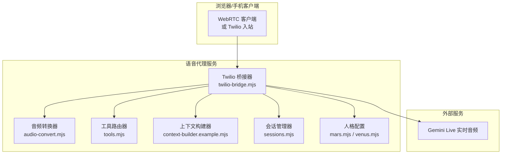
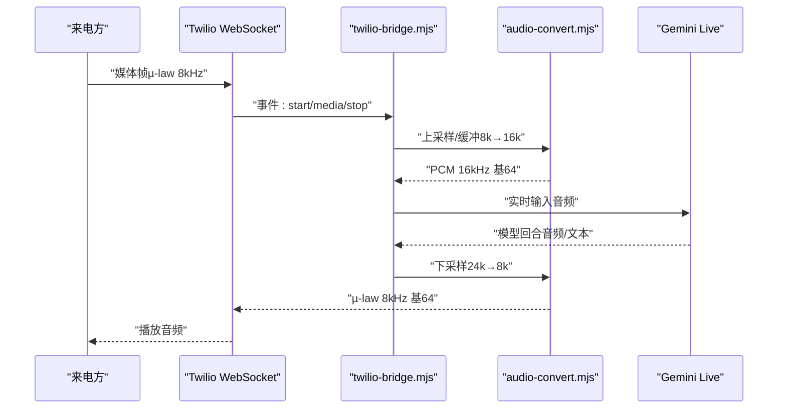
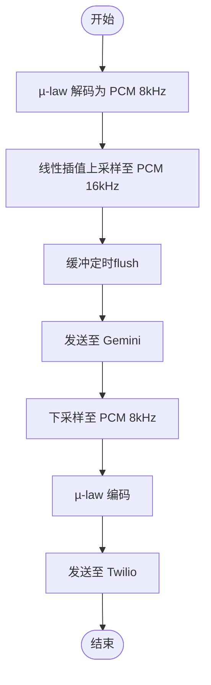
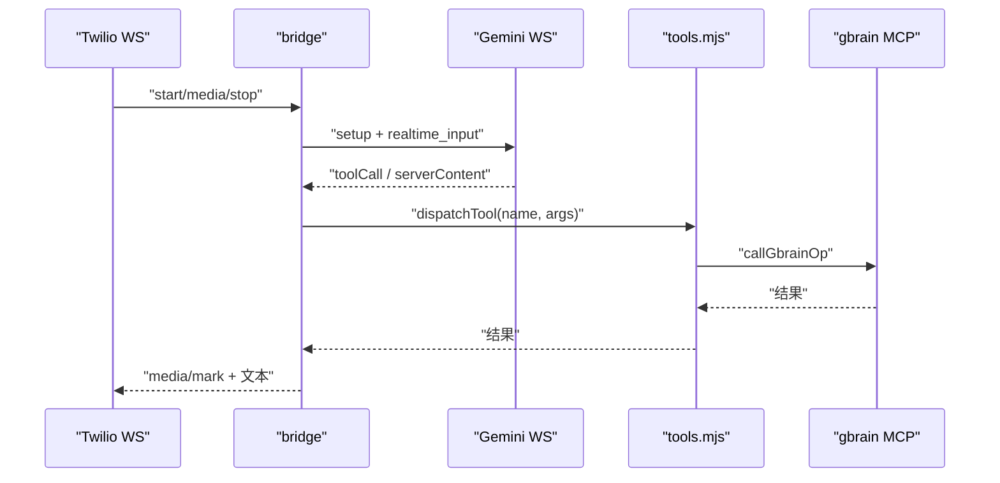
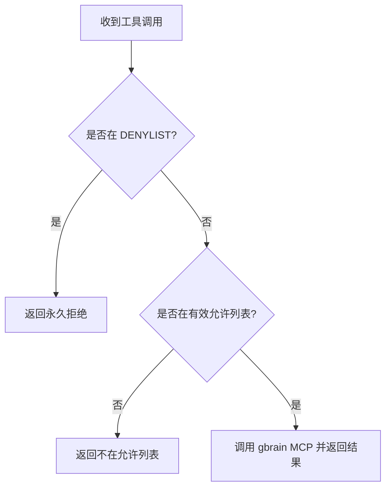
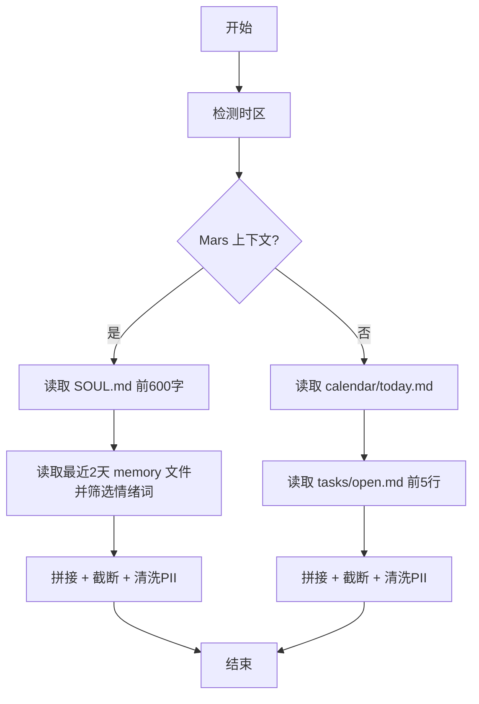
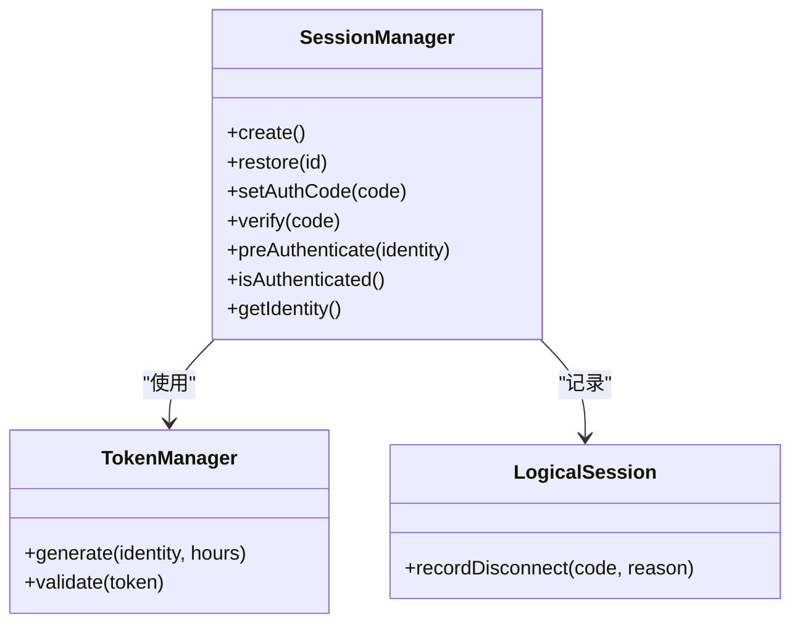
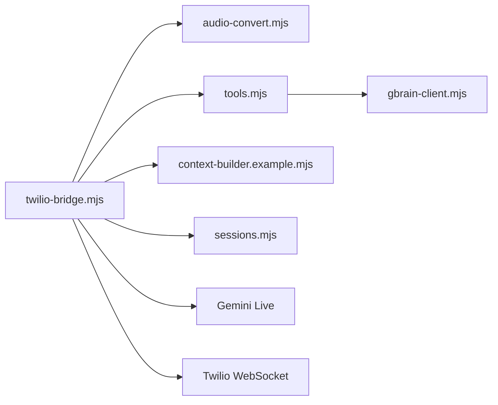

# 语音代理Recipe

<cite>
**本文引用的文件**
- [agent-voice.md](file://recipes/agent-voice.md)
- [twilio-voice-brain.md](file://recipes/twilio-voice-brain.md)
- [twilio-bridge.mjs](file://recipes/agent-voice/code/lib/twilio-bridge.mjs)
- [audio-convert.mjs](file://recipes/agent-voice/code/lib/audio-convert.mjs)
- [sessions.mjs](file://recipes/agent-voice/code/lib/sessions.mjs)
- [tools.mjs](file://recipes/agent-voice/code/tools.mjs)
- [context-builder.example.mjs](file://recipes/agent-voice/code/lib/context-builder.example.mjs)
- [mars.mjs](file://recipes/agent-voice/code/lib/personas/mars.mjs)
- [venus.mjs](file://recipes/agent-voice/code/lib/personas/venus.mjs)
</cite>

## 目录
1. [简介](#简介)
2. [项目结构](#项目结构)
3. [核心组件](#核心组件)
4. [架构总览](#架构总览)
5. [详细组件分析](#详细组件分析)
6. [依赖关系分析](#依赖关系分析)
7. [性能考量](#性能考量)
8. [故障排查指南](#故障排查指南)
9. [结论](#结论)
10. [附录](#附录)

## 简介
本文件为“语音代理Recipe”的技术文档，聚焦于基于Twilio与Gemini Live的电话入站语音代理实现。该Recipe提供两个可选的人格（Mars与Venus），支持两阶段认证（门禁→全功能）与工具路由，具备音频转换、会话管理、上下文构建与Twilio桥接等能力。文档覆盖架构设计、组件职责、数据流、错误处理、性能优化、测试策略与部署建议，并给出定制化与扩展指引。

## 项目结构
- Recipe以“复制到宿主仓库”的方式分发参考代码，安装后代码进入使用者仓库，便于按需演进。
- 关键模块分布：
  - 音频处理：audio-convert.mjs
  - Twilio桥接：twilio-bridge.mjs
  - 工具路由：tools.mjs（只读默认集，支持本地扩展）
  - 上下文构建：context-builder.example.mjs（示例实现）
  - 会话与评分：sessions.mjs
  - 人格定义：mars.mjs、venus.mjs
  - 安装与架构说明：agent-voice.md；已弃用的Twilio-voice-brain参考：twilio-voice-brain.md

图表来源
- [twilio-bridge.mjs:1-282](file://recipes/agent-voice/code/lib/twilio-bridge.mjs#L1-L282)
- [audio-convert.mjs:1-217](file://recipes/agent-voice/code/lib/audio-convert.mjs#L1-L217)
- [tools.mjs:1-176](file://recipes/agent-voice/code/tools.mjs#L1-L176)
- [context-builder.example.mjs:1-264](file://recipes/agent-voice/code/lib/context-builder.example.mjs#L1-L264)
- [sessions.mjs:1-209](file://recipes/agent-voice/code/lib/sessions.mjs#L1-L209)
- [mars.mjs:1-130](file://recipes/agent-voice/code/lib/personas/mars.mjs#L1-L130)
- [venus.mjs:1-52](file://recipes/agent-voice/code/lib/personas/venus.mjs#L1-L52)

章节来源
- [agent-voice.md:1-162](file://recipes/agent-voice.md#L1-L162)

## 核心组件
- 音频转换器（audio-convert.mjs）
  - 负责µ-law↔PCM互转与重采样，支撑Twilio（8kHz）与Gemini（16kHz/24kHz）之间的音频桥接。
  - 提供状态化上采样（8k→16k）与下采样（24k→8k）处理器，支持缓冲与定时flush。
- Twilio桥接器（twilio-bridge.mjs）
  - 建立Twilio媒体流WebSocket与Gemini实时音频WebSocket，转发双向音频与文本。
  - 支持两阶段升级：门禁模式（仅认证工具）→全功能Venus（含完整上下文与工具）。
  - 处理工具调用、转写记录、断连与关闭清理。
- 工具路由器（tools.mjs）
  - 默认只读工具集，拒绝高风险写操作；允许通过本地覆盖文件追加有限写操作。
  - 统一错误返回，避免异常中断通话。
- 上下文构建器（context-builder.example.mjs）
  - 示例实现从脑库加载情感、日程、任务等上下文，进行PII清洗与长度截断。
  - 提供主题上下文注入入口，支持话题内快速上下文注入。
- 会话管理（sessions.mjs）
  - 生成一次性验证码、预认证、令牌签发与校验、逻辑会话追踪与质量评分。
- 人格配置（mars.mjs、venus.mjs）
  - 定义双模式Mars与高效Venus的提示词、语音与工具表面，强调不读出PII与即时响应。

章节来源
- [audio-convert.mjs:1-217](file://recipes/agent-voice/code/lib/audio-convert.mjs#L1-L217)
- [twilio-bridge.mjs:1-282](file://recipes/agent-voice/code/lib/twilio-bridge.mjs#L1-L282)
- [tools.mjs:1-176](file://recipes/agent-voice/code/tools.mjs#L1-L176)
- [context-builder.example.mjs:1-264](file://recipes/agent-voice/code/lib/context-builder.example.mjs#L1-L264)
- [sessions.mjs:1-209](file://recipes/agent-voice/code/lib/sessions.mjs#L1-L209)
- [mars.mjs:1-130](file://recipes/agent-voice/code/lib/personas/mars.mjs#L1-L130)
- [venus.mjs:1-52](file://recipes/agent-voice/code/lib/personas/venus.mjs#L1-L52)

## 架构总览
- 电话入站路径（Twilio）
  - 客户端拨入→Twilio WebSocket→本地twilio-bridge.mjs→Gemini Live实时音频→回传音频与文本→Twilio播放。
- 浏览器/WebRTC路径（可选）
  - 浏览器发起WebRTC SDP交换→OpenAI Realtime API（Recipe中另有参考实现文档）。
- 两阶段认证与工具面
  - 初期仅认证工具（发送验证码、验证验证码），升级后开放全量工具与上下文。

图表来源
- [twilio-bridge.mjs:83-198](file://recipes/agent-voice/code/lib/twilio-bridge.mjs#L83-L198)
- [audio-convert.mjs:160-216](file://recipes/agent-voice/code/lib/audio-convert.mjs#L160-L216)

章节来源
- [agent-voice.md:98-127](file://recipes/agent-voice.md#L98-L127)
- [twilio-bridge.mjs:1-282](file://recipes/agent-voice/code/lib/twilio-bridge.mjs#L1-L282)
- [audio-convert.mjs:1-217](file://recipes/agent-voice/code/lib/audio-convert.mjs#L1-L217)

## 详细组件分析

### 音频转换器（audio-convert.mjs）
- 功能要点
  - µ-law解码至PCM 8kHz，再线性插值上采样至PCM 16kHz用于Gemini输入。
  - Gemini输出PCM 24kHz经低通平均下采样至PCM 8kHz，再编码为µ-law回传Twilio。
  - 提供状态化处理器，跨块边界保持平滑重采样。
- 性能与复杂度
  - 重采样为O(n)，缓冲flush阈值控制端到端延迟与带宽占用。
- 错误处理
  - 输入为空或格式异常时安全返回空串；下采样丢弃尾部不足样本。

图表来源
- [audio-convert.mjs:103-216](file://recipes/agent-voice/code/lib/audio-convert.mjs#L103-L216)

章节来源
- [audio-convert.mjs:1-217](file://recipes/agent-voice/code/lib/audio-convert.mjs#L1-L217)

### Twilio桥接器（twilio-bridge.mjs）
- 功能要点
  - 维护Twilio与Gemini的双向WS连接，转发媒体帧与文本。
  - 两阶段升级：先以门禁提示与工具集建立会话，再在认证后切换为全功能Venus。
  - 记录转写、统计音频块数、处理工具调用取消与异常。
- 数据流
  - 接收Twilio媒体帧→上采样→发送至Gemini；接收Gemini音频/文本→下采样→发送Twilio；工具调用通过router转发至gbrain MCP。
- 错误处理
  - 工具调用异常捕获并返回结构化错误；工具取消时中止当前请求；断开时记录时长与转写。

图表来源
- [twilio-bridge.mjs:83-198](file://recipes/agent-voice/code/lib/twilio-bridge.mjs#L83-L198)
- [tools.mjs:138-163](file://recipes/agent-voice/code/tools.mjs#L138-L163)

章节来源
- [twilio-bridge.mjs:1-282](file://recipes/agent-voice/code/lib/twilio-bridge.mjs#L1-L282)
- [tools.mjs:1-176](file://recipes/agent-voice/code/tools.mjs#L1-L176)

### 工具路由器（tools.mjs）
- 设计原则
  - 默认只读，永久拒绝高风险写操作；允许通过本地覆盖追加有限写操作。
  - 统一错误返回，保证通话不中断。
- 扩展方式
  - 在同目录放置tools-allowlist.local.json，声明extend数组，仅允许OPTIONAL_OPS内的操作。
- 安全边界
  - DENYLIST绝对不可通过覆盖启用；任何不在允许列表的操作均被拒绝。

图表来源
- [tools.mjs:138-163](file://recipes/agent-voice/code/tools.mjs#L138-L163)

章节来源
- [tools.mjs:1-176](file://recipes/agent-voice/code/tools.mjs#L1-L176)

### 上下文构建器（context-builder.example.mjs）
- 能力
  - 为Mars/Venus分别构建情感与日程类上下文，自动检测时区，进行PII清洗与长度截断。
  - 支持主题上下文注入（通过topicId定位文件），防御路径穿越。
- 性能
  - 输出上限2500字符，截断在换行边界；读取失败静默降级。
- 安全
  - 使用正则清洗邮箱与电话号码；对主题ID进行严格slug校验。

图表来源
- [context-builder.example.mjs:116-263](file://recipes/agent-voice/code/lib/context-builder.example.mjs#L116-L263)

章节来源
- [context-builder.example.mjs:1-264](file://recipes/agent-voice/code/lib/context-builder.example.mjs#L1-L264)

### 会话管理（sessions.mjs）
- 会话生命周期
  - 创建会话→生成验证码→验证→预认证→令牌签发（短时效）→清理过期会话。
- 逻辑会话
  - 记录重连次数与断连原因，提供通话质量评分与emoji映射。
- 安全
  - 默认身份来自环境变量或参数，避免硬编码真实姓名。

图表来源
- [sessions.mjs:20-165](file://recipes/agent-voice/code/lib/sessions.mjs#L20-L165)

章节来源
- [sessions.mjs:1-209](file://recipes/agent-voice/code/lib/sessions.mjs#L1-L209)

### 人格配置（mars.mjs、venus.mjs）
- Mars（双模式）
  - 孤独模式（思考伙伴）与演示模式（工具驱动展示），根据对话信号自动切换。
  - 支持多语言，强调不读出PII与即时响应。
- Venus（执行助理）
  - 快速物流助手，强调速度与直接，英文单一语言配置。
  - 默认只读工具集，写工具需显式开启。

章节来源
- [mars.mjs:1-130](file://recipes/agent-voice/code/lib/personas/mars.mjs#L1-L130)
- [venus.mjs:1-52](file://recipes/agent-voice/code/lib/personas/venus.mjs#L1-L52)

## 依赖关系分析
- 组件耦合
  - twilio-bridge.mjs依赖audio-convert.mjs完成编解码；依赖tools.mjs进行工具调度；依赖context-builder.example.mjs与sessions.mjs提供上下文与会话信息。
  - tools.mjs依赖gbrain-client.mjs（通过callGbrainOp）访问MCP。
- 外部依赖
  - Gemini Live WebSocket（实时音频）。
  - Twilio WebSocket（媒体流）。
- 循环依赖
  - 无直接循环；各模块职责清晰，通过回调与消息传递交互。

图表来源
- [twilio-bridge.mjs:12-13](file://recipes/agent-voice/code/lib/twilio-bridge.mjs#L12-L13)
- [tools.mjs:34-34](file://recipes/agent-voice/code/tools.mjs#L34-L34)

章节来源
- [twilio-bridge.mjs:1-282](file://recipes/agent-voice/code/lib/twilio-bridge.mjs#L1-L282)
- [tools.mjs:1-176](file://recipes/agent-voice/code/tools.mjs#L1-L176)

## 性能考量
- 音频缓冲与延迟
  - Twilio→Gemini缓冲阈值控制（约200ms flush），平衡延迟与带宽占用。
  - 下采样采用简单平均，兼顾实时性与音质。
- 工具调用
  - 统一错误返回避免阻塞；并发工具调用通过Promise聚合处理。
- 上下文构建
  - 限制输出长度与时间预算，确保提示注入不影响通话延迟。
- 会话与评分
  - 评分综合通话时长、重连次数与对话轮次，辅助质量监控。

## 故障排查指南
- Twilio入站无声音
  - 检查Twilio WebSocket事件是否到达；确认音频缓冲是否flush；核对Gemini连接状态。
- 工具调用失败
  - 查看tools.mjs返回的错误包；确认工具是否在允许列表；检查gbrain MCP可用性。
- 通话中断
  - 检查断连记录与重连次数；关注转写中是否出现“重连”标记。
- 两阶段升级失败
  - 确认门禁会话setupComplete；检查upgrade调用时机与新提示/工具集合法性。

章节来源
- [twilio-bridge.mjs:191-246](file://recipes/agent-voice/code/lib/twilio-bridge.mjs#L191-L246)
- [tools.mjs:138-163](file://recipes/agent-voice/code/tools.mjs#L138-L163)
- [sessions.mjs:161-164](file://recipes/agent-voice/code/lib/sessions.mjs#L161-L164)

## 结论
该Recipe提供了生产级的Twilio+Gemini语音代理实现，具备清晰的模块划分、安全的工具路由、可扩展的上下文与会话管理，以及稳健的音频桥接。通过两阶段认证与只读默认工具集，系统在易用性与安全性之间取得良好平衡。建议在生产部署中补充签名验证、限流、CORS白名单与HTTPS等加固措施，并结合质量评分与日志持续优化体验。

## 附录

### Twilio桥接配置与部署要点
- 环境变量
  - OPENAI_API_KEY（Realtime API）
  - TWILIO_ACCOUNT_SID、TWILIO_AUTH_TOKEN（可选，仅入站）
- 生产加固清单
  - 对/Twilio入口添加签名验证
  - 对/session与/tool接口增加限流
  - CORS白名单限定来源
  - 对外暴露/tool时增加会话令牌鉴权
  - 强制HTTPS（浏览器麦克风权限要求）
  - 配置Twilio回退URL（如/Fallback）

章节来源
- [agent-voice.md:129-139](file://recipes/agent-voice.md#L129-L139)

### 语音技能系统与通话后处理
- 技能与工具
  - Mars/Venus作为人格技能，通过tools.mjs的只读默认集与可选写集协作。
  - 通话后处理由桥接器在call结束时触发，记录时长与转写。
- 上下文注入
  - 通过context-builder.example.mjs注入情感、日程与主题上下文，PII清洗与长度截断保障安全与性能。

章节来源
- [mars.mjs:1-130](file://recipes/agent-voice/code/lib/personas/mars.mjs#L1-L130)
- [venus.mjs:1-52](file://recipes/agent-voice/code/lib/personas/venus.mjs#L1-L52)
- [context-builder.example.mjs:1-264](file://recipes/agent-voice/code/lib/context-builder.example.mjs#L1-L264)
- [twilio-bridge.mjs:223-232](file://recipes/agent-voice/code/lib/twilio-bridge.mjs#L223-L232)

### 测试策略与评估方法
- 主机侧单元测试
  - 运行host-side测试套件，覆盖音频转换、工具路由、会话管理等。
- E2E与全链路测试
  - WebRTC往返测试与基于openclaw的全链路测试；上游不稳定时以“跳过”状态上报，避免阻塞CI。
- 评估指标
  - 通话时长、重连次数、转写轮次与质量评分；结合摩擦通道日志进行定性评估。

章节来源
- [agent-voice.md:141-150](file://recipes/agent-voice.md#L141-L150)

### 定制化与扩展选项
- 自定义上下文
  - 替换context-builder.example.mjs为自定义实现，满足不同脑库布局与隐私策略。
- 工具集扩展
  - 在tools-allowlist.local.json中追加OPTIONAL_OPS内的操作；严禁添加DENYLIST项。
- 会话与评分
  - 可调整会话有效期与清理策略；结合评分函数完善质量度量。
- 语音与提示
  - 根据业务场景调整Mars/Venus提示词与工具表面；注意不读出PII与即时响应约束。

章节来源
- [tools.mjs:23-28](file://recipes/agent-voice/code/tools.mjs#L23-L28)
- [context-builder.example.mjs:1-264](file://recipes/agent-voice/code/lib/context-builder.example.mjs#L1-L264)
- [sessions.mjs:120-187](file://recipes/agent-voice/code/lib/sessions.mjs#L120-L187)
- [mars.mjs:1-130](file://recipes/agent-voice/code/lib/personas/mars.mjs#L1-L130)
- [venus.mjs:1-52](file://recipes/agent-voice/code/lib/personas/venus.mjs#L1-L52)