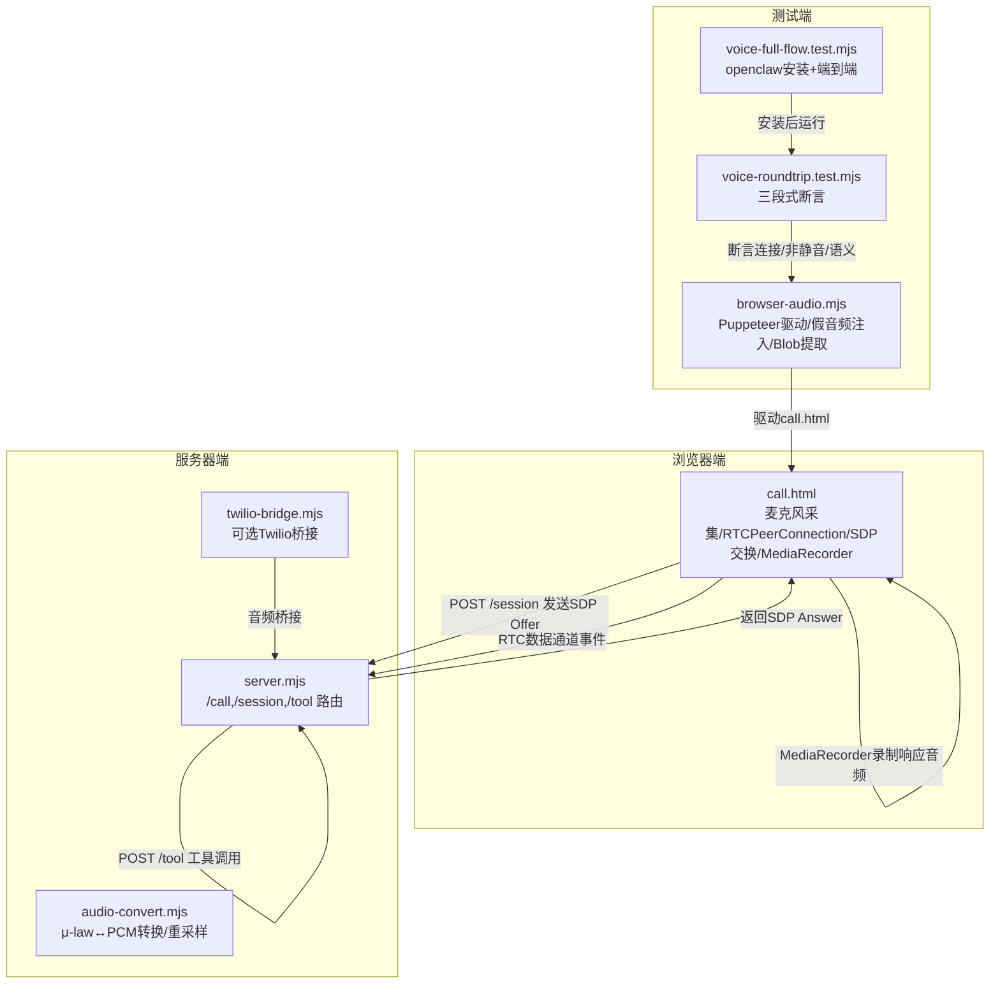
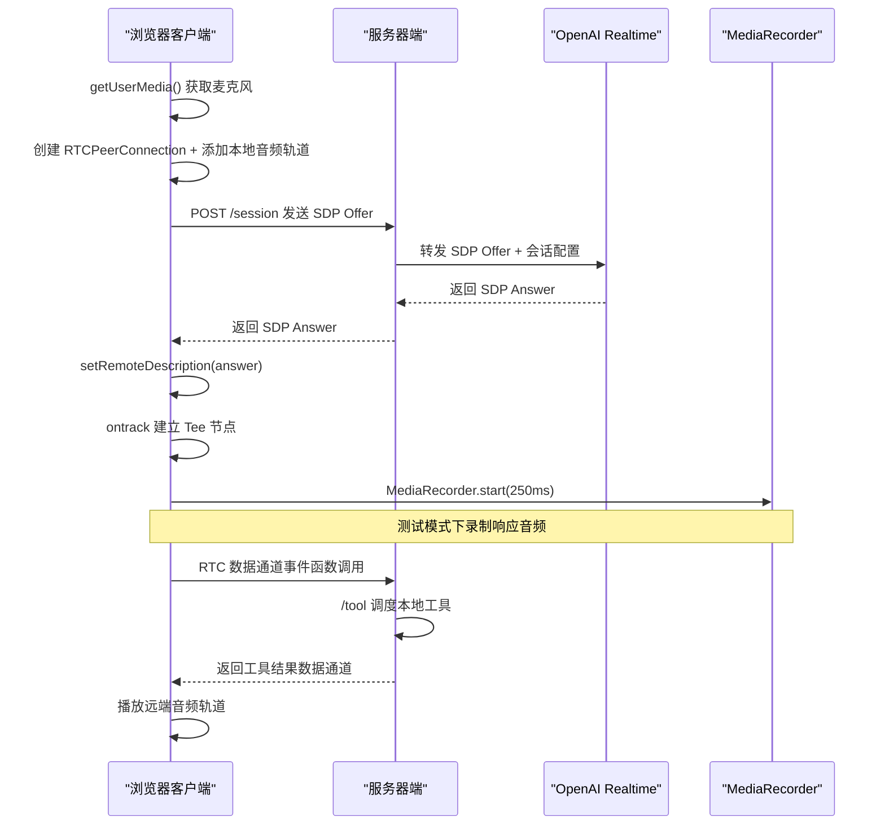
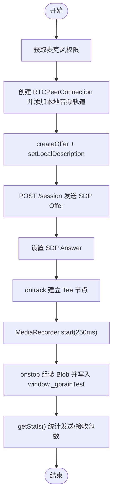
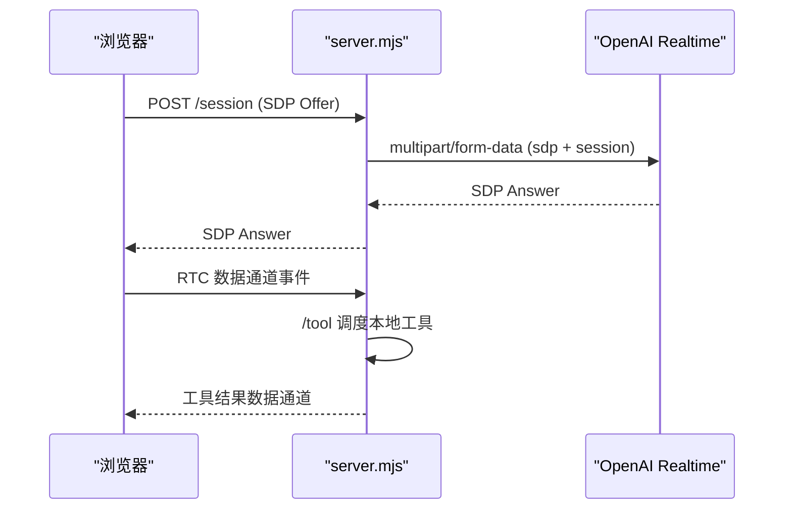
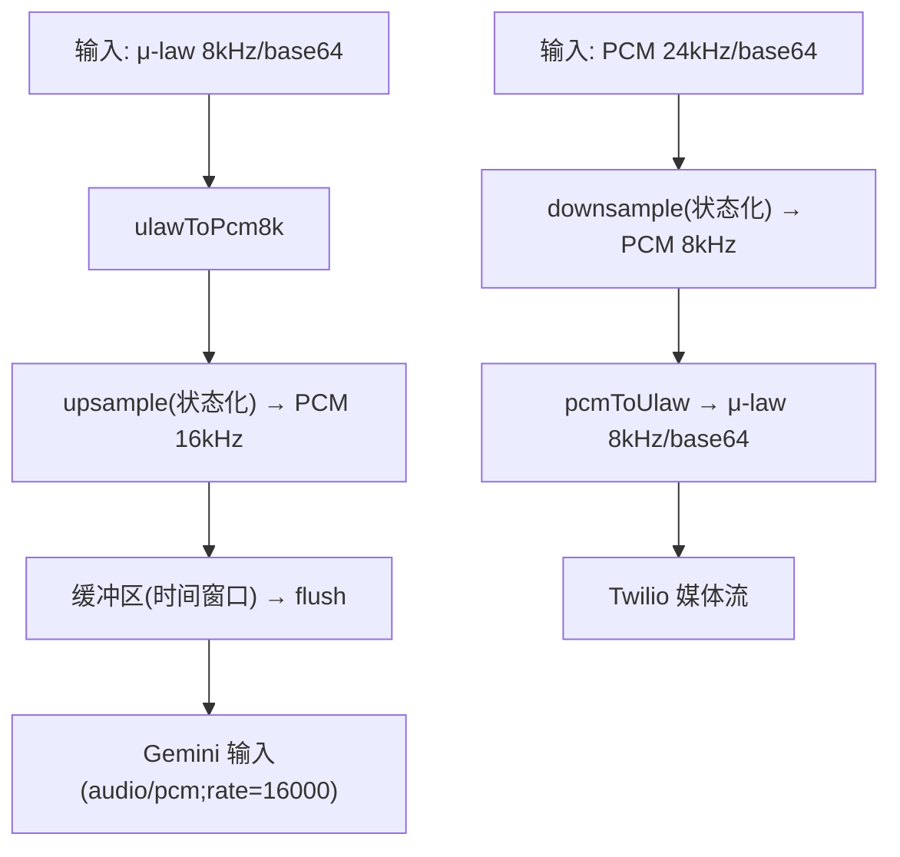
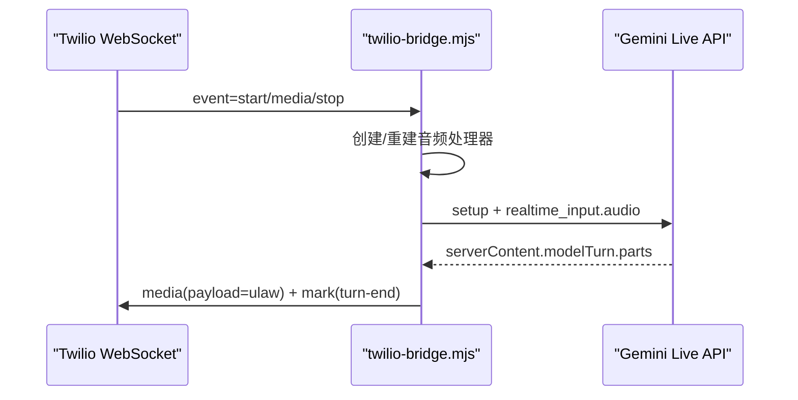
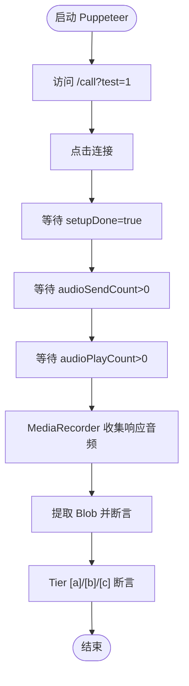
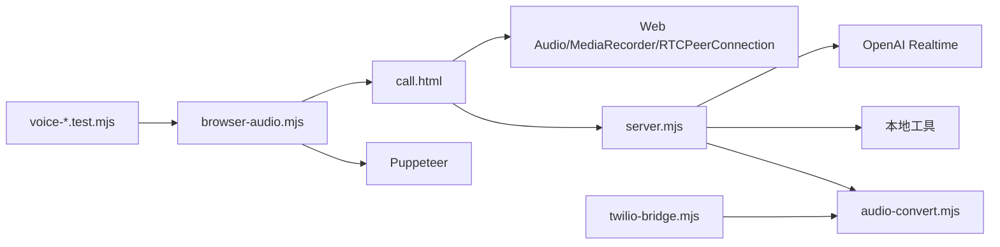

# 音频处理管道

<cite>
**本文档引用的文件**
- [call.html](file://recipes/agent-voice/code/public/call.html)
- [server.mjs](file://recipes/agent-voice/code/server.mjs)
- [audio-convert.mjs](file://recipes/agent-voice/code/lib/audio-convert.mjs)
- [twilio-bridge.mjs](file://recipes/agent-voice/code/lib/twilio-bridge.mjs)
- [browser-audio.mjs](file://recipes/agent-voice/tests/e2e/lib/browser-audio.mjs)
- [voice-roundtrip.test.mjs](file://recipes/agent-voice/tests/e2e/voice-roundtrip.test.mjs)
- [voice-full-flow.test.mjs](file://recipes/agent-voice/tests/e2e/voice-full-flow.test.mjs)
- [README.md](file://recipes/agent-voice/README.md)
- [README.md](file://README.md)
</cite>

## 目录
1. [简介](#简介)
2. [项目结构](#项目结构)
3. [核心组件](#核心组件)
4. [架构总览](#架构总览)
5. [详细组件分析](#详细组件分析)
6. [依赖关系分析](#依赖关系分析)
7. [性能考虑](#性能考虑)
8. [故障排除指南](#故障排除指南)
9. [结论](#结论)

## 简介
本技术文档聚焦于音频处理管道的设计与实现，涵盖浏览器端 WebRTC 音频采集与播放、MediaRecorder 实时录制、双向音频流处理、以及在测试模式下的录制与端到端验证流程。文档详细解释了以下关键点：
- 浏览器端麦克风权限获取、RTCPeerConnection 建立、SDP 交换与媒体轨道处理
- Web Audio API 的 Tee 节点用于在不破坏回放的情况下录制响应音频
- MediaRecorder 对响应音频进行分块录制，支持测试模式下的 Blob 提取
- 服务器端与 OpenAI Realtime 的 SDP 会话对接与工具调用转发
- Twilio 入站音频桥接（可选）：μ-law 与 PCM 之间的编解码与重采样
- E2E 测试框架：基于 Puppeteer 的浏览器驱动、假音频注入与三段式质量断言

## 项目结构
该功能位于 recipes/agent-voice 目录下，采用“参考配方”形式，通过 gbrain integrations install 将代码复制到宿主仓库中运行。核心目录与文件如下：
- code/public/call.html：浏览器客户端，负责麦克风采集、WebRTC 连接、SDP 交换、响应音频录制与播放
- code/server.mjs：HTTP 服务器，提供 /call、/session、/tool 等路由，与 OpenAI Realtime 协作
- code/lib/audio-convert.mjs：音频格式转换与重采样（μ-law ↔ PCM）
- code/lib/twilio-bridge.mjs：可选的 Twilio 入站桥接，连接 Twilio 媒体流与 Gemini Live API
- tests/e2e/lib/browser-audio.mjs：E2E 测试驱动脚本，使用 Puppeteer 注入假音频并提取响应 Blob
- tests/e2e/voice-roundtrip.test.mjs 与 tests/e2e/voice-full-flow.test.mjs：端到端测试用例

**图表来源**
- [call.html:138-271](file://recipes/agent-voice/code/public/call.html#L138-L271)
- [server.mjs:107-207](file://recipes/agent-voice/code/server.mjs#L107-L207)
- [audio-convert.mjs:1-217](file://recipes/agent-voice/code/lib/audio-convert.mjs#L1-L217)
- [twilio-bridge.mjs:1-282](file://recipes/agent-voice/code/lib/twilio-bridge.mjs#L1-L282)
- [browser-audio.mjs:44-189](file://recipes/agent-voice/tests/e2e/lib/browser-audio.mjs#L44-L189)
- [voice-roundtrip.test.mjs:90-154](file://recipes/agent-voice/tests/e2e/voice-roundtrip.test.mjs#L90-L154)
- [voice-full-flow.test.mjs:148-233](file://recipes/agent-voice/tests/e2e/voice-full-flow.test.mjs#L148-L233)

**章节来源**
- [README.md:1-73](file://recipes/agent-voice/README.md#L1-L73)

## 核心组件
- 浏览器客户端（call.html）
  - 获取麦克风权限，创建 RTCPeerConnection 并添加本地音频轨道
  - 创建 RTC 数据通道用于工具调用事件传递
  - 在 ontrack 回调中建立 Web Audio Tee 节点，将远端音频流同时输出到 <audio> 播放与 MediaRecorder 录制
  - 使用 MediaRecorder 分块录制响应音频，测试模式下将 Blob 写入 window._gbrainTest.lastResponseBlob
  - 通过 getStats() 统计 outbound-rtp/inbound-rtp 包数作为发送/接收计数
  - 发起 SDP Offer 至 /session，并解析 Answer 完成信令交换
- 服务器端（server.mjs）
  - 提供静态页面 /call
  - 处理 /session：从请求体读取 SDP Offer，构建系统提示与工具清单，向 OpenAI Realtime 发起 multipart/form-data 请求，返回 SDP Answer
  - 处理 /tool：从 RTC 数据通道收到函数调用事件后，转发至本地工具执行并返回结果
  - 提供 /health 健康检查
- 音频转换（audio-convert.mjs）
  - 提供 μ-law 与 PCM 的互转函数，以及状态化的上采样（8kHz→16kHz）与下采样（24kHz→8kHz）
  - 支持缓冲区聚合与定时 flush，确保 Gemini 所需的采样率与帧长度
- Twilio 桥接（twilio-bridge.mjs）
  - 可选的 Twilio 媒体流桥接到 Gemini Live API
  - 在升级阶段（两阶段认证）保持 WebSocket 连接，重建音频处理器以清理状态
- E2E 测试（browser-audio.mjs + voice-*.test.mjs）
  - Puppeteer 启动 Chromium，注入假音频文件，驱动 call.html 完成 WebRTC 往返
  - 三段式断言：连接性（发送/接收计数）、非静音（Blob 大小与 RMS 方差）、语义（Whisper 转录 + LLM 判定）

**章节来源**
- [call.html:138-271](file://recipes/agent-voice/code/public/call.html#L138-L271)
- [server.mjs:107-207](file://recipes/agent-voice/code/server.mjs#L107-L207)
- [audio-convert.mjs:153-216](file://recipes/agent-voice/code/lib/audio-convert.mjs#L153-L216)
- [twilio-bridge.mjs:30-282](file://recipes/agent-voice/code/lib/twilio-bridge.mjs#L30-L282)
- [browser-audio.mjs:44-189](file://recipes/agent-voice/tests/e2e/lib/browser-audio.mjs#L44-L189)
- [voice-roundtrip.test.mjs:90-154](file://recipes/agent-voice/tests/e2e/voice-roundtrip.test.mjs#L90-L154)
- [voice-full-flow.test.mjs:148-233](file://recipes/agent-voice/tests/e2e/voice-full-flow.test.mjs#L148-L233)

## 架构总览
音频处理管道分为三层：
- 浏览器层：麦克风采集 → WebRTC 编码 → 服务器端实时模型处理 → WebRTC 解码播放
- 服务器层：/session 与 OpenAI Realtime 协作，/tool 路由工具调用
- 可选桥接层：Twilio 媒体流 → μ-law/PCM 转换 → Gemini Live API

**图表来源**
- [call.html:138-271](file://recipes/agent-voice/code/public/call.html#L138-L271)
- [server.mjs:107-207](file://recipes/agent-voice/code/server.mjs#L107-L207)
- [browser-audio.mjs:96-130](file://recipes/agent-voice/tests/e2e/lib/browser-audio.mjs#L96-L130)

## 详细组件分析

### 组件一：浏览器端音频采集与录制（Web Audio Tee + MediaRecorder）
- 麦克风权限与本地轨道
  - 使用 navigator.mediaDevices.getUserMedia({ audio: true }) 获取本地音频流
  - 通过 RTCPeerConnection.addTrack 将本地音频轨道加入连接
- Web Audio Tee 节点
  - 在 ontrack 中创建 MediaStreamSource → MediaStreamDestination 的 Tee
  - 将 Tee 输出连接到 MediaRecorder，避免重复连接到音频上下文目的地导致回放叠加
- MediaRecorder 录制
  - 使用 audio/webm; codecs=opus MIME 类型，250ms 分块
  - ondataavailable 收集 Blob 片段，onstop 组装为 Blob 并写入 window._gbrainTest.lastResponseBlob
- 统计计数
  - 通过 getStats() 轮询 outbound-rtp/inbound-rtp 包数，映射为发送/接收计数
- SDP 交换
  - createOffer → setLocalDescription → POST /session → setRemoteDescription

**图表来源**
- [call.html:138-271](file://recipes/agent-voice/code/public/call.html#L138-L271)
- [browser-audio.mjs:105-130](file://recipes/agent-voice/tests/e2e/lib/browser-audio.mjs#L105-L130)

**章节来源**
- [call.html:138-271](file://recipes/agent-voice/code/public/call.html#L138-L271)
- [browser-audio.mjs:105-130](file://recipes/agent-voice/tests/e2e/lib/browser-audio.mjs#L105-L130)

### 组件二：服务器端 SDP 会话与工具调用（OpenAI Realtime）
- /session 路由
  - 读取请求体中的 SDP Offer，构建系统提示与工具清单
  - 以 multipart/form-data 形式向 OpenAI Realtime /v1/realtime/calls 发送 sdp 与 session 参数
  - 返回 SDP Answer 给浏览器
- /tool 路由
  - 接收来自 RTC 数据通道的函数调用事件
  - 调用本地工具并返回结果，再通过数据通道回传给浏览器
- /health 健康检查

**图表来源**
- [server.mjs:107-207](file://recipes/agent-voice/code/server.mjs#L107-L207)

**章节来源**
- [server.mjs:107-207](file://recipes/agent-voice/code/server.mjs#L107-L207)

### 组件三：音频格式转换与重采样（μ-law ↔ PCM）
- 无状态转换（测试友好）
  - ulawToPcm8k：μ-law 8kHz 字节 → PCM 16位样本
  - ulawToGemini：线性插值 8kHz→16kHz（简单但非生产最优）
  - geminiToUlaw：PCM 24kHz → μ-law 8kHz（每3个样本平均）
  - gemini16kToUlaw：PCM 16kHz → μ-law 8kHz（每2个样本取样）
- 状态化转换（生产使用）
  - createUpsampler：带跨块状态的线性插值，平滑首尾衔接
  - createDownsampler24to8：低通滤波式 3:1 下采样，保留余量到下一帧
  - createTwilioToGeminiProcessor：按时间窗口缓冲并 flush，适配 Gemini 输入采样率
  - createGeminiToTwilioProcessor：将 24kHz PCM 转换为 μ-law 8kHz

**图表来源**
- [audio-convert.mjs:153-216](file://recipes/agent-voice/code/lib/audio-convert.mjs#L153-L216)

**章节来源**
- [audio-convert.mjs:1-217](file://recipes/agent-voice/code/lib/audio-convert.mjs#L1-L217)

### 组件四：Twilio 入站桥接（可选）
- 保持 WebSocket 连接贯穿升级过程
- 两阶段认证：门控器（零上下文，仅工具）→ 全量 Venus（完整上下文+工具）
- 音频处理器在升级时重建，确保状态干净
- 将 Gemini 的音频片段转换为 Twilio 可接受的 μ-law 8kHz 格式并发送

**图表来源**
- [twilio-bridge.mjs:30-282](file://recipes/agent-voice/code/lib/twilio-bridge.mjs#L30-L282)
- [audio-convert.mjs:195-216](file://recipes/agent-voice/code/lib/audio-convert.mjs#L195-L216)

**章节来源**
- [twilio-bridge.mjs:1-282](file://recipes/agent-voice/code/lib/twilio-bridge.mjs#L1-L282)
- [audio-convert.mjs:195-216](file://recipes/agent-voice/code/lib/audio-convert.mjs#L195-L216)

### 组件五：测试模式与端到端验证
- 测试模式开关
  - 通过 ?test=1 触发，注入 window._gbrainTest 计数器与日志
- Puppeteer 驱动
  - 启动 Chromium，注入假音频文件（--use-file-for-fake-audio-capture）
  - 点击连接按钮，等待 setupDone、audioSendCount>0、audioPlayCount>0
  - 等待一段时间让 MediaRecorder 收集响应音频，提取 Blob
- 三段式断言
  - 连接性（Tier [a]）：发送/接收计数必须大于 0
  - 非静音（Tier [b]）：响应 Blob ≥ 5KB；若为 WAV 则计算 RMS 方差 > 0.001
  - 语义（Tier [c]）：Whisper 转录 + LLM 判定回答是否符合预期

**图表来源**
- [browser-audio.mjs:96-189](file://recipes/agent-voice/tests/e2e/lib/browser-audio.mjs#L96-L189)
- [voice-roundtrip.test.mjs:119-153](file://recipes/agent-voice/tests/e2e/voice-roundtrip.test.mjs#L119-L153)

**章节来源**
- [browser-audio.mjs:44-189](file://recipes/agent-voice/tests/e2e/lib/browser-audio.mjs#L44-L189)
- [voice-roundtrip.test.mjs:90-154](file://recipes/agent-voice/tests/e2e/voice-roundtrip.test.mjs#L90-L154)
- [voice-full-flow.test.mjs:148-233](file://recipes/agent-voice/tests/e2e/voice-full-flow.test.mjs#L148-L233)

## 依赖关系分析
- call.html 依赖
  - Web Audio API（AudioContext、MediaStreamSource、MediaStreamDestination）
  - MediaRecorder API（录制响应音频）
  - RTCPeerConnection（WebRTC 信令与媒体）
  - fetch（POST /session 与 /tool）
- server.mjs 依赖
  - OpenAI Realtime API（/v1/realtime/calls）
  - 本地工具调度（dispatchTool）
- audio-convert.mjs 依赖
  - Buffer 与 Int16Array（PCM 处理）
  - 状态变量（跨块重采样）
- twilio-bridge.mjs 依赖
  - ws WebSocket 库
  - audio-convert.mjs（音频格式转换）
- 测试依赖
  - Puppeteer（浏览器自动化）
  - 假音频文件（Chromium 注入）

**图表来源**
- [call.html:138-271](file://recipes/agent-voice/code/public/call.html#L138-L271)
- [server.mjs:107-207](file://recipes/agent-voice/code/server.mjs#L107-L207)
- [audio-convert.mjs:1-217](file://recipes/agent-voice/code/lib/audio-convert.mjs#L1-L217)
- [twilio-bridge.mjs:1-282](file://recipes/agent-voice/code/lib/twilio-bridge.mjs#L1-L282)
- [browser-audio.mjs:63-77](file://recipes/agent-voice/tests/e2e/lib/browser-audio.mjs#L63-L77)
- [voice-roundtrip.test.mjs:90-154](file://recipes/agent-voice/tests/e2e/voice-roundtrip.test.mjs#L90-L154)
- [voice-full-flow.test.mjs:148-233](file://recipes/agent-voice/tests/e2e/voice-full-flow.test.mjs#L148-L233)

**章节来源**
- [call.html:138-271](file://recipes/agent-voice/code/public/call.html#L138-L271)
- [server.mjs:107-207](file://recipes/agent-voice/code/server.mjs#L107-L207)
- [audio-convert.mjs:1-217](file://recipes/agent-voice/code/lib/audio-convert.mjs#L1-L217)
- [twilio-bridge.mjs:1-282](file://recipes/agent-voice/code/lib/twilio-bridge.mjs#L1-L282)
- [browser-audio.mjs:63-77](file://recipes/agent-voice/tests/e2e/lib/browser-audio.mjs#L63-L77)
- [voice-roundtrip.test.mjs:90-154](file://recipes/agent-voice/tests/e2e/voice-roundtrip.test.mjs#L90-L154)
- [voice-full-flow.test.mjs:148-233](file://recipes/agent-voice/tests/e2e/voice-full-flow.test.mjs#L148-L233)

## 性能考虑
- 采样率与缓冲策略
  - Twilio→Gemini：8kHz→16kHz 上采样，使用状态化线性插值保证跨块平滑
  - Gemini→Twilio：24kHz→8kHz 低通滤波式下采样（3:1），减少混叠
  - 缓冲窗口（约 200ms）平衡延迟与稳定性
- 带宽与编码
  - 响应音频使用 audio/webm; codecs=opus，便于录制与后续处理
  - 若平台不支持 opus，MediaRecorder 默认可能生成 WAV，测试工具提供 WAV RMS 方差校验
- 统计计数
  - 通过 getStats() 的 outbound-rtp/inbound-rtp 包数近似帧计数，避免直接监听“帧发送”事件的兼容性问题
- 资源释放
  - 结束通话时及时关闭 MediaRecorder、RTCPeerConnection、音频上下文与本地轨道，防止资源泄漏

[本节为通用指导，无需特定文件引用]

## 故障排除指南
- 浏览器端
  - 无法获取麦克风：检查权限与 HTTPS 环境；确认 getUserMedia 成功后再创建 RTCPeerConnection
  - WebRTC 建连失败：检查 STUN 服务器可达性与防火墙；确认 SDP Offer/Answer 正确交换
  - 响应音频无声：确认 ontrack 是否触发；检查 Tee 节点连接与 MediaRecorder MIME 类型
  - 统计计数为 0：确认 getStats() 轮询逻辑与连接状态未关闭
- 服务器端
  - /session 返回错误：检查 OPENAI_API_KEY 设置与网络连通性；核对 multipart/form-data 格式
  - /tool 返回异常：检查工具名称与参数合法性；确认 dispatchTool 返回结构一致
- 音频转换
  - 质量不佳：确认使用状态化重采样器而非简单插值；调整缓冲窗口大小
  - 格式不匹配：确保输入 MIME 与采样率与处理器期望一致
- 测试端
  - Puppeteer 启动失败：检查 Chromium 参数（假音频注入、自动播放策略等）
  - 非静音断言失败：确认 Blob 大小阈值与 WAV RMS 方差计算路径
  - 语义断言不确定：检查 Whisper 转录与 LLM 判定配置

**章节来源**
- [call.html:138-271](file://recipes/agent-voice/code/public/call.html#L138-L271)
- [server.mjs:107-207](file://recipes/agent-voice/code/server.mjs#L107-L207)
- [browser-audio.mjs:172-189](file://recipes/agent-voice/tests/e2e/lib/browser-audio.mjs#L172-L189)
- [voice-roundtrip.test.mjs:119-153](file://recipes/agent-voice/tests/e2e/voice-roundtrip.test.mjs#L119-L153)

## 结论
本音频处理管道以 WebRTC 为核心，结合浏览器端 Web Audio Tee 与 MediaRecorder，实现了从麦克风采集到实时响应播放的完整链路，并提供了测试模式下的录制与端到端验证能力。服务器端通过 /session 与 OpenAI Realtime 协作，/tool 路由工具调用，形成闭环。可选的 Twilio 桥接进一步扩展了入站音频处理能力。通过状态化音频转换与严格的 E2E 断言，系统在易用性与质量保障之间取得了良好平衡。