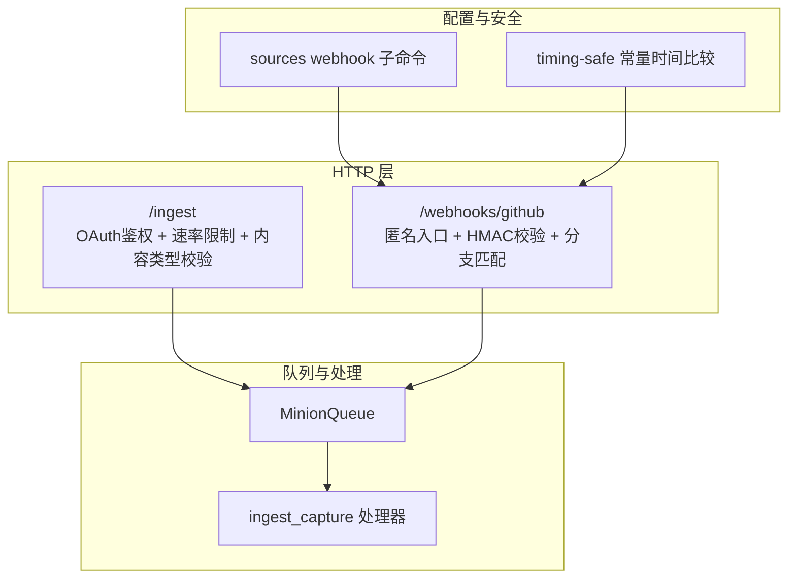
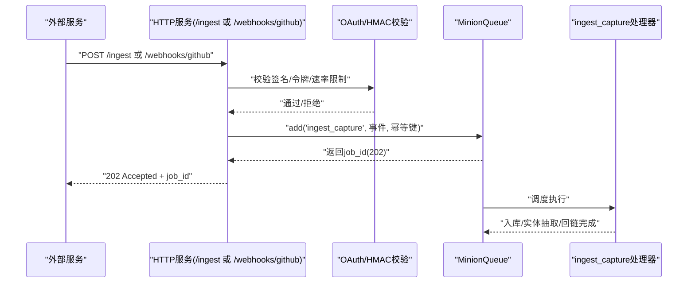
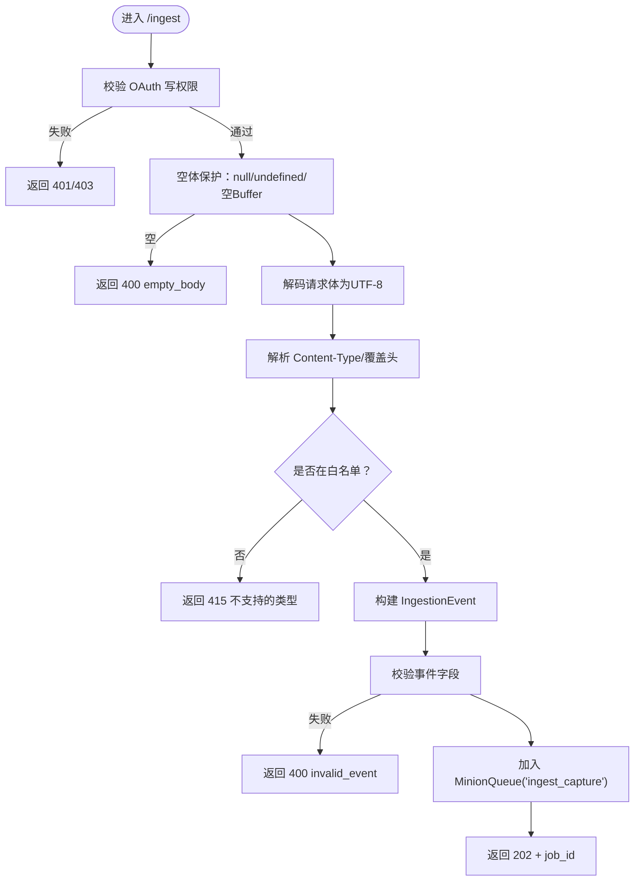
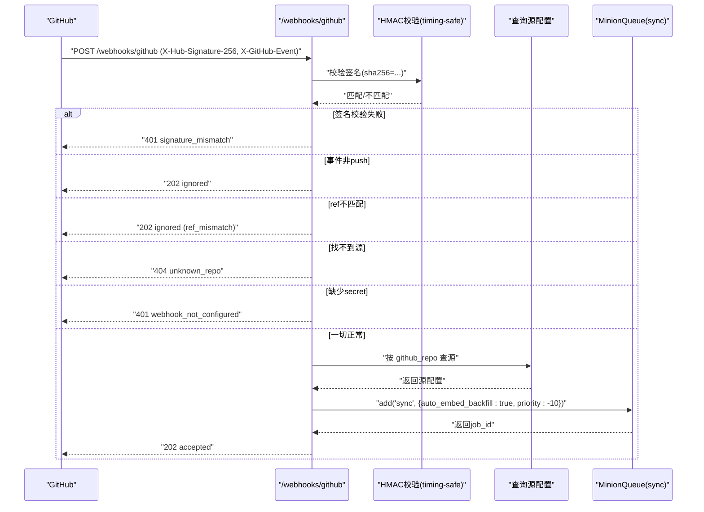
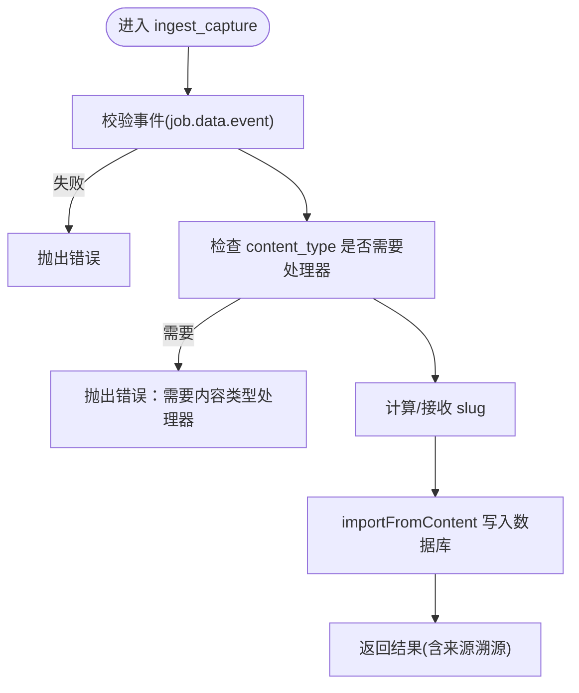
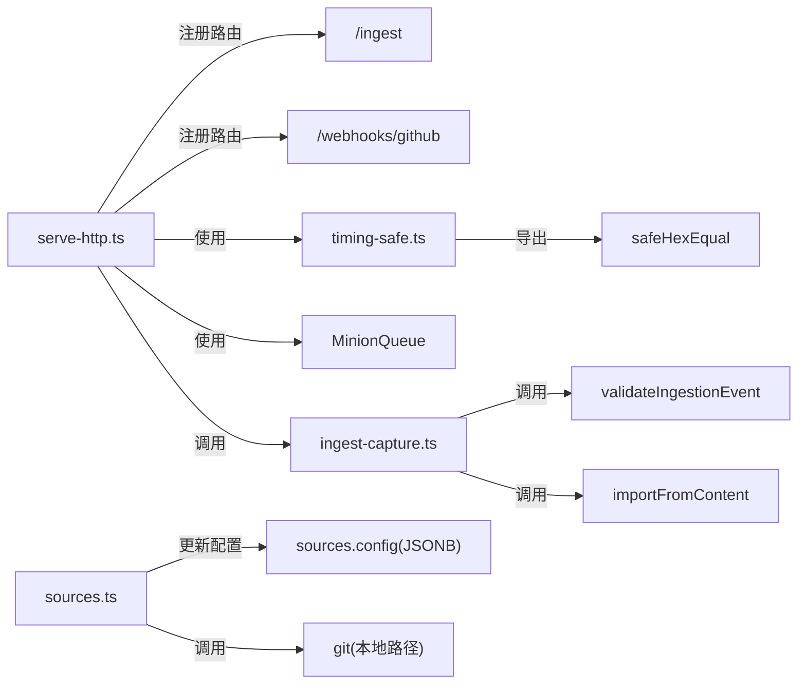

# Webhook集成

<cite>
**本文引用的文件**
- [serve-http.ts](file://src/commands/serve-http.ts)
- [sources.ts](file://src/commands/sources.ts)
- [timing-safe.ts](file://src/core/timing-safe.ts)
- [ingest-capture.ts](file://src/core/minions/handlers/ingest-capture.ts)
- [meeting-webhooks.md](file://docs/integrations/meeting-webhooks.md)
- [SKILL.md（webhook-transforms）](file://skills/webhook-transforms/README.md)
- [serve-http-ingest-webhook.test.ts](file://test/e2e/serve-http-ingest-webhook.test.ts)
- [sources-webhook.test.ts](file://test/sources-webhook.test.ts)
- [timing-safe.test.ts](file://test/timing-safe.test.ts)
- [ingest-capture.test.ts](file://test/ingestion/ingest-capture.test.ts)
</cite>

## 目录
1. [简介](#简介)
2. [项目结构](#项目结构)
3. [核心组件](#核心组件)
4. [架构总览](#架构总览)
5. [组件详解](#组件详解)
6. [依赖关系分析](#依赖关系分析)
7. [性能与容量规划](#性能与容量规划)
8. [故障排除指南](#故障排除指南)
9. [结论](#结论)
10. [附录：配置模板与最佳实践](#附录配置模板与最佳实践)

## 简介
本文件系统性阐述 gbrain 的 Webhook 集成方案，覆盖以下主题：
- Webhook 工作原理与接入路径：HTTP 接收器、OAuth 认证、速率限制、幂等与队列化处理
- 数据流与格式：允许的内容类型、头部覆盖、事件模型、入脑写入与实体抽取
- 安全与验证：签名验证（HMAC-SHA256）、常量时间比较、凭据管理
- 实战配置：GitHub 推送触发同步、第三方会议/短信/社交事件的抓取与转换
- 故障排除与性能优化：常见错误码、日志定位、限流与超时调优

## 项目结构
围绕 Webhook 的关键代码分布在如下模块：
- HTTP 服务端：提供 /ingest（通用 Webhook 入口）与 /webhooks/github（推送触发同步）
- 源配置 CLI：管理 webhook_secret、tracked_branch 等源级配置
- 常量时间比较工具：统一 HMAC 校验语义
- 入脑捕获处理器：将事件转化为页面并进行实体抽取与回链

图表来源
- [serve-http.ts:1723-1967](file://src/commands/serve-http.ts#L1723-L1967)
- [serve-http.ts:1969-2100](file://src/commands/serve-http.ts#L1969-L2100)
- [sources.ts:828-966](file://src/commands/sources.ts#L828-L966)
- [timing-safe.ts:1-35](file://src/core/timing-safe.ts#L1-L35)
- [ingest-capture.ts:1-120](file://src/core/minions/handlers/ingest-capture.ts#L1-L120)

章节来源
- [serve-http.ts:1723-1967](file://src/commands/serve-http.ts#L1723-L1967)
- [serve-http.ts:1969-2100](file://src/commands/serve-http.ts#L1969-L2100)
- [sources.ts:828-966](file://src/commands/sources.ts#L828-L966)
- [timing-safe.ts:1-35](file://src/core/timing-safe.ts#L1-L35)
- [ingest-capture.ts:1-120](file://src/core/minions/handlers/ingest-capture.ts#L1-L120)

## 核心组件
- HTTP 接收器
  - /ingest：OAuth 写权限校验、速率限制、内容类型白名单、请求体解析与 UTF-8 校验、事件对象构造、队列化提交
  - /webhooks/github：匿名入口，基于 HMAC-SHA256 校验签名，按仓库与分支过滤，命中后提交同步任务
- 队列与处理器
  - MinionQueue：统一的任务去重与等待上限控制
  - ingest_capture：校验事件、路由到导入管线、生成默认 slug、写入数据库并返回结果
- 配置与安全
  - sources webhook：设置/显示/轮换/清除 webhook_secret；支持 tracked_branch 自动检测
  - timing-safe：常量时间十六进制字符串比较，避免时序侧信道

章节来源
- [serve-http.ts:1723-1967](file://src/commands/serve-http.ts#L1723-L1967)
- [serve-http.ts:1969-2100](file://src/commands/serve-http.ts#L1969-L2100)
- [sources.ts:828-966](file://src/commands/sources.ts#L828-L966)
- [timing-safe.ts:1-35](file://src/core/timing-safe.ts#L1-L35)
- [ingest-capture.ts:1-120](file://src/core/minions/handlers/ingest-capture.ts#L1-L120)

## 架构总览
下图展示从外部服务到 gbrain 的完整 Webhook 流程。

图表来源
- [serve-http.ts:1723-1967](file://src/commands/serve-http.ts#L1723-L1967)
- [serve-http.ts:1969-2100](file://src/commands/serve-http.ts#L1969-L2100)
- [ingest-capture.ts:1-120](file://src/core/minions/handlers/ingest-capture.ts#L1-L120)

## 组件详解

### 通用 Webhook 入口：/ingest
- 身份与权限
  - 使用 OAuth Bearer 令牌，要求具备 write 权限
  - 速率限制：每 IP 10 秒内最多 100 次
- 请求体与内容类型
  - 支持 text/markdown、text/plain、text/html、application/json
  - 未知 text/* 子类型透传为 text/plain
  - 其他二进制类型直接拒绝（415），提示使用内容类型处理器技能包
- 头部覆盖
  - X-Gbrain-Content-Type：覆盖请求头的 Content-Type（仅对 JSON 有效）
  - X-Gbrain-Slug、X-Gbrain-Source-Id、X-Gbrain-Source-Uri：用于标注事件来源与目标路径
- 事件对象与幂等
  - 事件包含 source_id/source_kind/source_uri/received_at/content_type/content/content_hash/untrusted_payload/metadata
  - 幂等键：ingest:webhook:{clientId}:{contentHash}
  - 最大等待任务数：50，防止单客户端占满队列
- 返回
  - 成功：202 + {job_id, content_hash, source_id, message}

图表来源
- [serve-http.ts:1746-1967](file://src/commands/serve-http.ts#L1746-L1967)

章节来源
- [serve-http.ts:1746-1967](file://src/commands/serve-http.ts#L1746-L1967)
- [serve-http-ingest-webhook.test.ts:167-194](file://test/e2e/serve-http-ingest-webhook.test.ts#L167-L194)
- [serve-http-ingest-webhook.test.ts:200-237](file://test/e2e/serve-http-ingest-webhook.test.ts#L200-L237)
- [serve-http-ingest-webhook.test.ts:243-294](file://test/e2e/serve-http-ingest-webhook.test.ts#L243-L294)
- [serve-http-ingest-webhook.test.ts:303-355](file://test/e2e/serve-http-ingest-webhook.test.ts#L303-L355)
- [serve-http-ingest-webhook.test.ts:361-394](file://test/e2e/serve-http-ingest-webhook.test.ts#L361-L394)

### GitHub 推送触发同步：/webhooks/github
- 身份与安全
  - 匿名入口，必须携带 X-Hub-Signature-256（sha256=...）
  - 使用常量时间比较校验签名
  - 未提供签名或签名不匹配返回 401
- 过滤与匹配
  - 仅处理 push 事件
  - 仅当 ref 与源配置的 tracked_branch 完全一致时才继续
- 源查找与配置
  - 通过 config->>'github_repo' 快速定位源
  - 若未配置 webhook_secret，则返回 401 提示先设置
- 作业提交
  - 提交 sync 作业，优先级高于普通 autopilot（-10）

图表来源
- [serve-http.ts:1985-2100](file://src/commands/serve-http.ts#L1985-L2100)
- [timing-safe.ts:1-35](file://src/core/timing-safe.ts#L1-L35)
- [sources-webhook.test.ts:23-84](file://test/sources-webhook.test.ts#L23-L84)
- [sources-webhook.test.ts:86-125](file://test/sources-webhook.test.ts#L86-L125)

章节来源
- [serve-http.ts:1985-2100](file://src/commands/serve-http.ts#L1985-L2100)
- [timing-safe.ts:1-35](file://src/core/timing-safe.ts#L1-L35)
- [sources-webhook.test.ts:23-84](file://test/sources-webhook.test.ts#L23-L84)
- [sources-webhook.test.ts:86-125](file://test/sources-webhook.test.ts#L86-L125)

### 入脑捕获处理器：ingest_capture
- 输入校验：确保事件存在且字段合法
- 内容类型约束：二进制类型需经内容类型处理器（当前 v1 拒绝）
- 默认 slug：若未提供则按日期+哈希前缀生成 inbox 路径
- 导入与回链：调用导入子系统，生成页面、实体抽取、回链与时间线
- 结果字段：slug/status/chunks/untrusted_payload/source_kind/source_uri

图表来源
- [ingest-capture.ts:1-120](file://src/core/minions/handlers/ingest-capture.ts#L1-L120)
- [ingest-capture.test.ts:105-167](file://test/ingestion/ingest-capture.test.ts#L105-L167)

章节来源
- [ingest-capture.ts:1-120](file://src/core/minions/handlers/ingest-capture.ts#L1-L120)
- [ingest-capture.test.ts:105-167](file://test/ingestion/ingest-capture.test.ts#L105-L167)

### 第三方集成示例：会议与短信 Webhook
- Circleback（会议）
  - URL：{your_agent_gateway}/hooks/circleback-meetings
  - 签名：X-Circleback-Signature: sha256=<hex>，使用 HMAC-SHA256 验证
  - 流程：签名校验与规范化 -> 触发代理拉取完整转录 -> 创建会议页 -> 同步至实体页 -> 提交 gbrain sync
- Quo（短信/通话）
  - URL：{your_agent_gateway}/hooks/quo-events
  - 事件：message.received、call.completed、call.summary.completed、call.transcript.completed
  - 认证：Authorization: API Key（无 Bearer 前缀）
  - 流程：入站短信/通话 -> 查找发送方身份 -> 生成回复草稿（需人工批准）

章节来源
- [meeting-webhooks.md:1-64](file://docs/integrations/meeting-webhooks.md#L1-L64)

### 通用 Webhook 转换框架：webhook-transforms 技能
- 合同保证：事件转换为带引用的入脑页面；原始载荷保留；每次转换运行实体抽取；输入净化；失败重试一次
- 流程：定义转换函数 -> 注册 Webhook URL -> 接收事件 -> 解析/转换 -> 写入脑页 -> 实体抽取/回链 -> 同步
- 输出：报告“Webhook: {event_type} from {source} -> {brain_page_path}”
- 反模式：向脑页传递原始 HTML/脚本；失败静默丢弃事件；省略实体抽取；未净化外部输入

章节来源
- [SKILL.md（webhook-transforms）:1-84](file://skills/webhook-transforms/README.md#L1-L84)

## 依赖关系分析
- serve-http.ts
  - 依赖：Express、rateLimit、OAuth 提供者、MinionQueue、事件校验器
  - 关键路由：/ingest、/webhooks/github
- sources.ts
  - 依赖：BrainEngine、node:crypto、git（检测分支）
  - 关键子命令：webhook set/show/rotate/clear
- timing-safe.ts
  - 依赖：node:crypto.timingSafeEqual
  - 导出：safeHexEqual
- ingest-capture.ts
  - 依赖：validateIngestionEvent、importFromContent
  - 输出：IngestCaptureResult

图表来源
- [serve-http.ts:1723-1967](file://src/commands/serve-http.ts#L1723-L1967)
- [serve-http.ts:1969-2100](file://src/commands/serve-http.ts#L1969-L2100)
- [sources.ts:828-966](file://src/commands/sources.ts#L828-L966)
- [timing-safe.ts:1-35](file://src/core/timing-safe.ts#L1-L35)
- [ingest-capture.ts:1-120](file://src/core/minions/handlers/ingest-capture.ts#L1-L120)

章节来源
- [serve-http.ts:1723-1967](file://src/commands/serve-http.ts#L1723-L1967)
- [serve-http.ts:1969-2100](file://src/commands/serve-http.ts#L1969-L2100)
- [sources.ts:828-966](file://src/commands/sources.ts#L828-L966)
- [timing-safe.ts:1-35](file://src/core/timing-safe.ts#L1-L35)
- [ingest-capture.ts:1-120](file://src/core/minions/handlers/ingest-capture.ts#L1-L120)

## 性能与容量规划
- 速率限制
  - /ingest：IP 粒度 100 次/10s
  - /webhooks/github：60 次/60s
- 队列与幂等
  - MinionQueue 对相同 (clientId, contentHash) 的重复事件进行去重
  - 单客户端最大等待任务数：50，避免队列被刷爆
- 负载与伸缩
  - 将 gbrain serve --http 作为网络入口，daemon 专注本地源；通过多实例横向扩展
- 日志与可观测性
  - 成功写入 mcp_request_log，记录操作、延迟、状态与参数
  - 广播事件上报，便于集中监控

章节来源
- [serve-http.ts:1746-1752](file://src/commands/serve-http.ts#L1746-L1752)
- [serve-http.ts:1985-1991](file://src/commands/serve-http.ts#L1985-L1991)
- [serve-http.ts:1905-1914](file://src/commands/serve-http.ts#L1905-L1914)
- [serve-http.ts:1917-1934](file://src/commands/serve-http.ts#L1917-L1934)

## 故障排除指南
- 常见错误与排查
  - 401 缺失/无效令牌：确认 Bearer 令牌 scope 包含 write
  - 403 令牌范围不足：使用具备 write 的令牌
  - 400 empty_body：检查请求体是否为空或未正确设置 Content-Length
  - 400 invalid_event：检查事件字段（如 content_hash 长度）
  - 400 malformed_json：/webhooks/github 的 JSON 解析失败
  - 400 missing_fields：缺少 repository.full_name/ref
  - 401 missing_signature：/webhooks/github 未提供 X-Hub-Signature-256
  - 401 signature_mismatch：签名格式或值不匹配；确认 sha256= 前缀与 secret 正确
  - 401 webhook_not_configured：未在源配置中设置 webhook_secret
  - 404 unknown_repo：找不到对应 github_repo 的源
  - 415 unsupported_content_type：当前 /ingest 不支持该 Content-Type
  - 202 ignored：/webhooks/github 非 push 事件或 ref 不匹配
- 定位手段
  - 查看 HTTP 响应体中的 error/message 字段
  - 检查服务端日志与 mcp_request_log
  - 使用测试用例参考行为：[serve-http-ingest-webhook.test.ts](file://test/e2e/serve-http-ingest-webhook.test.ts)、[sources-webhook.test.ts](file://test/sources-webhook.test.ts)
- 安全回归防护
  - 确保 HMAC 校验使用 safeHexEqual，避免时序攻击
  - 源配置中的 webhook_secret 仅一次性显示，后续使用 rotate 更新

章节来源
- [serve-http.ts:1803-1809](file://src/commands/serve-http.ts#L1803-L1809)
- [serve-http.ts:1826-1829](file://src/commands/serve-http.ts#L1826-L1829)
- [serve-http.ts:1848-1854](file://src/commands/serve-http.ts#L1848-L1854)
- [serve-http.ts:2000-2013](file://src/commands/serve-http.ts#L2000-L2013)
- [serve-http.ts:2021-2034](file://src/commands/serve-http.ts#L2021-L2034)
- [serve-http.ts:2074-2077](file://src/commands/serve-http.ts#L2074-L2077)
- [timing-safe.test.ts:44-52](file://test/timing-safe.test.ts#L44-L52)
- [sources-webhook.test.ts:23-84](file://test/sources-webhook.test.ts#L23-L84)

## 结论
gbrain 的 Webhook 集成以“HTTP 接收器 + 队列化处理 + 入脑捕获”为核心，结合 OAuth/HMAC 安全、速率限制与幂等设计，既满足第三方服务的快速接入，又保障了数据质量与系统稳定性。通过 webhook-transforms 技能与 sources webhook 子命令，用户可灵活地将邮件、会议、短信、社交等事件转化为结构化知识并沉淀到脑库中。

## 附录：配置模板与最佳实践

- /ingest 配置要点
  - Content-Type 白名单：text/markdown、text/plain、text/html、application/json
  - 头部覆盖：X-Gbrain-Content-Type（对 JSON 有效）、X-Gbrain-Slug、X-Gbrain-Source-Id、X-Gbrain-Source-Uri
  - 幂等键：ingest:webhook:{clientId}:{contentHash}
  - 速率限制：100 次/10s（IP）
- GitHub Webhook 配置
  - Payload URL：<your gbrain serve --http>/webhooks/github
  - Content type：application/json
  - Secret：在源配置中设置 webhook_secret
  - Events：仅勾选 push
  - 分支策略：tracked_branch 与期望分支完全一致
- 安全最佳实践
  - webhook_secret 仅一次性显示，妥善保存；定期 rotate
  - 使用常量时间比较校验签名，避免时序侧信道
  - 严格净化外部输入，禁止将原始 HTML/脚本写入脑页
  - 对二进制内容使用专用处理器技能包，不要直接走 /ingest
- 第三方集成模板
  - Circleback：签名校验（sha256=...）-> 拉取完整转录 -> 创建会议页 -> 同步
  - Quo：注册多个事件回调 -> 识别来电/短信 -> 查找身份 -> 生成回复草稿 -> 人工审批

章节来源
- [serve-http.ts:1762-1770](file://src/commands/serve-http.ts#L1762-L1770)
- [serve-http.ts:1831-1855](file://src/commands/serve-http.ts#L1831-L1855)
- [serve-http.ts:1909-1910](file://src/commands/serve-http.ts#L1909-L1910)
- [serve-http.ts:1985-1991](file://src/commands/serve-http.ts#L1985-L1991)
- [sources.ts:854-898](file://src/commands/sources.ts#L854-L898)
- [timing-safe.ts:19-35](file://src/core/timing-safe.ts#L19-L35)
- [meeting-webhooks.md:1-64](file://docs/integrations/meeting-webhooks.md#L1-L64)
- [SKILL.md（webhook-transforms）:23-51](file://skills/webhook-transforms/README.md#L23-L51)