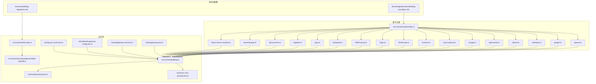
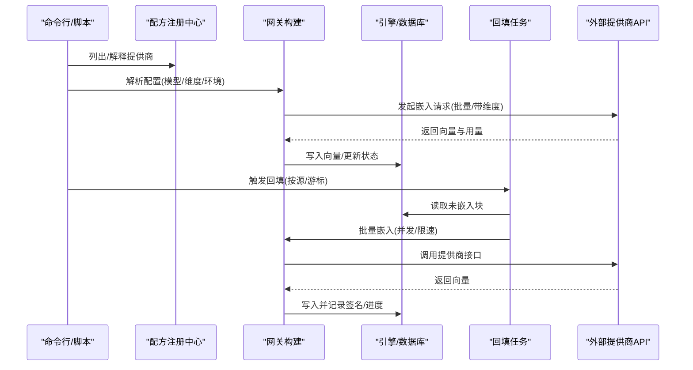
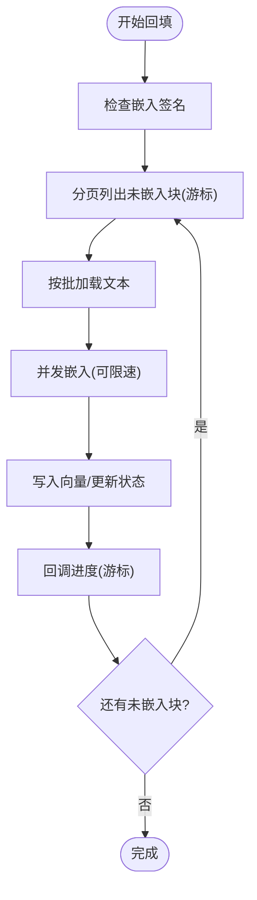
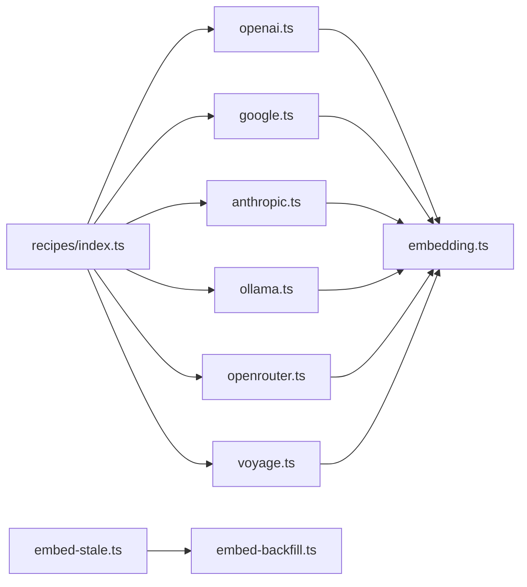

# 嵌入提供商

<cite>
**本文引用的文件**
- [embedding-providers.md](file://docs/integrations/embedding-providers.md)
- [embedding-migrations.md](file://docs/embedding-migrations.md)
- [recipes/index.ts](file://src/core/ai/recipes/index.ts)
- [openai.ts](file://src/core/ai/recipes/openai.ts)
- [google.ts](file://src/core/ai/recipes/google.ts)
- [anthropic.ts](file://src/core/ai/recipes/anthropic.ts)
- [ollama.ts](file://src/core/ai/recipes/ollama.ts)
- [openrouter.ts](file://src/core/ai/recipes/openrouter.ts)
- [voyage.ts](file://src/core/ai/recipes/voyage.ts)
- [embed-stale.ts](file://src/core/embed-stale.ts)
- [embed-backfill.ts](file://src/core/minions/handlers/embed-backfill.ts)
- [embedding.ts](file://src/core/embedding.ts)
- [gateway.test.ts](file://test/ai/gateway.test.ts)
- [gateway-chat.test.ts](file://test/ai/gateway-chat.test.ts)
- [gateway-build-config.test.ts](file://test/ai/build-gateway-config.test.ts)
- [query-cache.test.ts](file://test/query-cache.test.ts)
- [model-pricing.test.ts](file://test/model-pricing.test.ts)
- [sync-cost-preview.test.ts](file://test/sync-cost-preview.test.ts)
- [capabilities.test.ts](file://test/ai/capabilities.test.ts)
- [think-gateway-adapter.test.ts](file://test/think-gateway-adapter.test.ts)
- [op-checkpoint.ts](file://src/core/op-checkpoint.ts)
- [oauth-provider.ts](file://src/core/oauth-provider.ts)
- [operations-trust-boundary.test.ts](file://test/operations-trust-boundary.test.ts)
</cite>

## 目录
1. [简介](#简介)
2. [项目结构](#项目结构)
3. [核心组件](#核心组件)
4. [架构总览](#架构总览)
5. [详细组件分析](#详细组件分析)
6. [依赖关系分析](#依赖关系分析)
7. [性能与成本考量](#性能与成本考量)
8. [故障排查指南](#故障排查指南)
9. [结论](#结论)
10. [附录](#附录)

## 简介
本文件面向需要在系统中集成与使用多种嵌入提供商（如 OpenAI、Anthropic、Google、Voyage、OpenRouter、Azure OpenAI、MiniMax、DashScope、Zhipu、Ollama、llama-server、LiteLLM、Together、DeepSeek、Groq、ZeroEntropy、以及专用重排序器）的技术读者与运维人员。内容覆盖：
- 16 种嵌入提供商的配置与使用方法
- 提供商选择标准、性能对比与成本考量
- 完整配置示例与 API 密钥管理
- 嵌入维度设置、批量处理与缓存策略
- 提供商切换与迁移路径（含 PGLite 与 Postgres）
- 故障转移与可用性检测
- 安全与访问控制
- 性能优化与成本控制建议

## 项目结构
与嵌入提供商相关的核心目录与文件：
- 文档：docs/integrations/embedding-providers.md、docs/embedding-migrations.md
- 提供商配方注册：src/core/ai/recipes/index.ts
- 各提供商配方实现：src/core/ai/recipes/*.ts
- 批量嵌入与回填：src/core/embed-stale.ts、src/core/minions/handlers/embed-backfill.ts
- 嵌入成本估算与定价表：src/core/embedding.ts、test/model-pricing.test.ts、test/sync-cost-preview.test.ts
- 可用性与环境变量检测：test/ai/gateway.test.ts、test/ai/gateway-chat.test.ts、test/ai/build-gateway-config.test.ts
- 查询缓存：test/query-cache.test.ts
- 能力与别名：test/ai/capabilities.test.ts、test/think-gateway-adapter.test.ts
- 操作与信任边界：src/core/op-checkpoint.ts、src/core/oauth-provider.ts、test/operations-trust-boundary.test.ts

**图表来源**
- [recipes/index.ts:1-57](file://src/core/ai/recipes/index.ts#L1-L57)
- [openai.ts:1-45](file://src/core/ai/recipes/openai.ts#L1-L45)
- [google.ts:1-38](file://src/core/ai/recipes/google.ts#L1-L38)
- [anthropic.ts:1-49](file://src/core/ai/recipes/anthropic.ts#L1-L49)
- [ollama.ts:1-27](file://src/core/ai/recipes/ollama.ts#L1-L27)
- [openrouter.ts:25-54](file://src/core/ai/recipes/openrouter.ts#L25-L54)
- [voyage.ts:1-35](file://src/core/ai/recipes/voyage.ts#L1-L35)
- [embed-stale.ts:25-156](file://src/core/embed-stale.ts#L25-L156)
- [embed-backfill.ts:142-177](file://src/core/minions/handlers/embed-backfill.ts#L142-L177)
- [embedding.ts:128-161](file://src/core/embedding.ts#L128-L161)
- [gateway.test.ts:63-370](file://test/ai/gateway.test.ts#L63-L370)
- [gateway-chat.test.ts:137-178](file://test/ai/gateway-chat.test.ts#L137-L178)
- [gateway-build-config.test.ts:56-87](file://test/ai/build-gateway-config.test.ts#L56-L87)
- [query-cache.test.ts:142-260](file://test/query-cache.test.ts#L142-L260)
- [model-pricing.test.ts:1-27](file://test/model-pricing.test.ts#L1-L27)
- [sync-cost-preview.test.ts:55-76](file://test/sync-cost-preview.test.ts#L55-L76)

**章节来源**
- [embedding-providers.md:1-188](file://docs/integrations/embedding-providers.md#L1-L188)
- [embedding-migrations.md:1-185](file://docs/embedding-migrations.md#L1-L185)
- [recipes/index.ts:1-57](file://src/core/ai/recipes/index.ts#L1-L57)

## 核心组件
- 配方注册中心：集中注册所有提供商配方，确保静态可编译、可枚举。
- 各提供商配方：定义提供商 ID、名称、认证所需环境变量、默认模型与维度、成本、批次限制、别名与提示等。
- 运行时嵌入管线：批量获取未嵌入块、并发与限速、预算跟踪、失败重试与进度回调。
- 成本与定价：基于当前配置模型的单价进行成本预估；测试确保不同模型预估不回退到硬编码 OpenAI 价格。
- 可用性检测：根据环境变量与模型能力判断是否可用，支持聊天与嵌入两类触点。
- 缓存：查询语义向量缓存命中判定与统计。

**章节来源**
- [recipes/index.ts:1-57](file://src/core/ai/recipes/index.ts#L1-L57)
- [openai.ts:1-45](file://src/core/ai/recipes/openai.ts#L1-L45)
- [google.ts:1-38](file://src/core/ai/recipes/google.ts#L1-L38)
- [anthropic.ts:1-49](file://src/core/ai/recipes/anthropic.ts#L1-L49)
- [ollama.ts:1-27](file://src/core/ai/recipes/ollama.ts#L1-L27)
- [openrouter.ts:25-54](file://src/core/ai/recipes/openrouter.ts#L25-L54)
- [voyage.ts:1-35](file://src/core/ai/recipes/voyage.ts#L1-L35)
- [embed-stale.ts:25-156](file://src/core/embed-stale.ts#L25-L156)
- [embedding.ts:128-161](file://src/core/embedding.ts#L128-L161)
- [gateway.test.ts:63-370](file://test/ai/gateway.test.ts#L63-L370)
- [query-cache.test.ts:142-260](file://test/query-cache.test.ts#L142-L260)

## 架构总览
嵌入提供商的运行时架构围绕“配方驱动 + 网关适配 + 批处理回填 + 成本与缓存”的闭环展开：

**图表来源**
- [recipes/index.ts:1-57](file://src/core/ai/recipes/index.ts#L1-L57)
- [embed-stale.ts:109-177](file://src/core/embed-stale.ts#L109-L177)
- [embed-backfill.ts:142-177](file://src/core/minions/handlers/embed-backfill.ts#L142-L177)
- [embedding.ts:144-161](file://src/core/embedding.ts#L144-L161)

## 详细组件分析

### OpenAI
- 认证：OPENAI_API_KEY（可选 OPENAI_ORG_ID、OPENAI_PROJECT）
- 嵌入模型：text-embedding-3-large（默认 1536）、text-embedding-3-small（1536）
- 维度：支持 256/512/768/1024/1536/3072（Matryoshka）
- 批次上限：保守 100K token/批
- 成本：约 0.13 美元/百万 tokens
- 使用要点：默认模型与维度持久化至配置文件；切换维度需迁移。

**章节来源**
- [openai.ts:1-45](file://src/core/ai/recipes/openai.ts#L1-L45)
- [embedding-providers.md:76-78](file://docs/integrations/embedding-providers.md#L76-L78)

### Google（Gemini）
- 认证：GOOGLE_GENERATIVE_AI_API_KEY
- 嵌入模型：gemini-embedding-001，默认 768，支持 768/1536/3072
- 成本：约 0.025 美元/百万 tokens
- 使用要点：可通过环境变量覆盖基础 URL；聊天与扩展模型能力见配方。

**章节来源**
- [google.ts:1-38](file://src/core/ai/recipes/google.ts#L1-L38)
- [embedding-providers.md:96-100](file://docs/integrations/embedding-providers.md#L96-L100)

### Anthropic
- 说明：仅提供语言模型（Expansion/Chat），无嵌入模型
- 使用：若需嵌入，请配合其他提供商或通过代理路由
- 别名与兼容：支持日期后缀到新 ID 的映射

**章节来源**
- [anthropic.ts:1-49](file://src/core/ai/recipes/anthropic.ts#L1-L49)
- [gateway-chat.test.ts:168-178](file://test/ai/gateway-chat.test.ts#L168-L178)

### Ollama（本地）
- 认证：本地无密钥；可选 OLLAMA_BASE_URL、OLLAMA_API_KEY
- 嵌入模型：nomic-embed-text（推荐，768d）、mxbai-embed-large（1024d）、all-minilm（384d）
- 成本：0
- 使用要点：无批次上限（由本地模型与并发决定）

**章节来源**
- [ollama.ts:1-27](file://src/core/ai/recipes/ollama.ts#L1-L27)
- [embedding-providers.md:140-144](file://docs/integrations/embedding-providers.md#L140-L144)

### OpenRouter
- 认证：OPENROUTER_API_KEY；可选 OPENROUTER_BASE_URL、OPENROUTER_REFERER、OPENROUTER_TITLE
- 特性：单 Key 多模型；嵌入目录包含 OpenAI、Google、Qwen、BGE-M3 等
- 使用要点：聊天与工具调用能力随上游模型而异；子代理循环强制直连 Anthropic

**章节来源**
- [openrouter.ts:25-54](file://src/core/ai/recipes/openrouter.ts#L25-L54)
- [embedding-providers.md:102-114](file://docs/integrations/embedding-providers.md#L102-L114)

### Voyage AI
- 认证：VOYAGE_API_KEY
- 模型族：voyage-4 系列（共享嵌入空间，可索引与查询混用）、voyage-code-3（代码优化）、voyage-multimodal-3（文本+图像）
- 维度：256/512/1024/2048（2048 超过 HNSW 上限，走精确扫描）
- 使用要点：支持输出维度参数；多模态模型需显式选择；测试覆盖维度合法性与请求体透传

**章节来源**
- [voyage.ts:1-35](file://src/core/ai/recipes/voyage.ts#L1-L35)
- [embedding-providers.md:80-95](file://docs/integrations/embedding-providers.md#L80-L95)
- [gateway.test.ts:198-370](file://test/ai/gateway.test.ts#L198-L370)

### Azure OpenAI
- 认证：AZURE_OPENAI_API_KEY、AZURE_OPENAI_ENDPOINT、AZURE_OPENAI_DEPLOYMENT；可选 AZURE_OPENAI_API_VERSION
- 特性：使用 api-key 头与模板 URL；配方覆盖认证与兼容配置解析
- 模型：text-embedding-3-large/3-small/ada-002（需部署支持）

**章节来源**
- [embedding-providers.md:116-122](file://docs/integrations/embedding-providers.md#L116-L122)

### 其他提供商（快速概览）
- MiniMax：MINIMAX_API_KEY（可选 MINIMAX_GROUP_ID），模型 embo-01（1536d）
- DashScope：DASHSCOPE_API_KEY；国际端点默认 dashscope-intl.aliyuncs.com；支持 text-embedding-v3（Matryoshka 64–1024）
- Zhipu：ZHIPUAI_API_KEY；embedding-3（Matryoshka 256–2048），2048 维走精确扫描
- Together：TOGETHER_API_KEY；模型列表见配方
- DeepSeek/Groq：当前无嵌入模型（仅聊天/扩展）
- ZeroEntropy：zembed-1（Matryoshka 至 1280/640/320/…），成本低
- LiteLLM：作为通用代理，统一 OpenAI 兼容接口，支持 Bedrock/Vertex/Cohere/Jina/Fireworks 等
- llama-server：本地推理服务，无密钥；用户自定义模型与维度

**章节来源**
- [embedding-providers.md:24-42](file://docs/integrations/embedding-providers.md#L24-L42)
- [recipes/index.ts:27-45](file://src/core/ai/recipes/index.ts#L27-L45)

### 批量处理与回填
- 批大小与并发：默认 2000/批、20 并发；可配置；支持游标续跑
- 失败策略：单页嵌入失败不中断整体流程，保留 NULL 待下次重试
- 预算与限速：回填任务内集成预算跟踪与数据库内容节流
- 签名与再嵌入：v0.41.31+ 支持按“提供商:模型:维度”签名，签名漂移触发无效化与再嵌入

**图表来源**
- [embed-stale.ts:109-177](file://src/core/embed-stale.ts#L109-L177)
- [embed-backfill.ts:142-177](file://src/core/minions/handlers/embed-backfill.ts#L142-L177)

**章节来源**
- [embed-stale.ts:25-156](file://src/core/embed-stale.ts#L25-L156)
- [embed-backfill.ts:142-177](file://src/core/minions/handlers/embed-backfill.ts#L142-L177)

### 查询缓存
- 命中条件：余弦相似度高于阈值（例如 >0.92）视为命中
- 行为：命中返回结果与相似度；禁用时退化为纯 Miss
- 统计：命中次数、新鲜行数、陈旧行数等指标

**章节来源**
- [query-cache.test.ts:142-260](file://test/query-cache.test.ts#L142-L260)

### API 密钥与环境变量
- 自动检测：init 会依据已设置的环境变量自动选择提供商；多个密钥存在时交互选择
- 环境优先级：配置文件覆盖环境变量；部分提供商允许通过 provider_base_urls 覆盖默认基础 URL
- 可用性检测：isAvailable('embedding'|'chat') 基于密钥与模型能力返回布尔值

**章节来源**
- [embedding-providers.md:16-21](file://docs/integrations/embedding-providers.md#L16-L21)
- [gateway.test.ts:63-95](file://test/ai/gateway.test.ts#L63-L95)
- [gateway-build-config.test.ts:56-87](file://test/ai/build-gateway-config.test.ts#L56-L87)

### 维度设置与 HNSW 限制
- 三要素：模型原生维度、Matryoshka 下采样、HNSW 最大维度（2000）
- 建议：多数场景保持 1024 或 1536；更大维度可能带来存储与检索开销
- 超限处理：超过 2000 维自动走精确扫描，仍正确但较慢

**章节来源**
- [embedding-providers.md:158-166](file://docs/integrations/embedding-providers.md#L158-L166)

## 依赖关系分析
- 配方注册：recipes/index.ts 将所有提供商配方静态导入并注册，便于 CLI 与运行时枚举
- 网关构建：根据配置与环境变量解析提供商、认证与基础 URL
- 成本与定价：currentEmbeddingPricePerMTok 与 estimateEmbeddingCostUsd 基于当前配置模型查表
- 回填链路：embed-stale 与 embed-backfill 协作，结合预算与节流保障稳定性

**图表来源**
- [recipes/index.ts:1-57](file://src/core/ai/recipes/index.ts#L1-L57)
- [embedding.ts:144-161](file://src/core/embedding.ts#L144-L161)
- [embed-stale.ts:109-177](file://src/core/embed-stale.ts#L109-L177)
- [embed-backfill.ts:142-177](file://src/core/minions/handlers/embed-backfill.ts#L142-L177)

**章节来源**
- [recipes/index.ts:1-57](file://src/core/ai/recipes/index.ts#L1-L57)
- [embedding.ts:128-161](file://src/core/embedding.ts#L128-L161)

## 性能与成本考量
- 成本预估：基于当前配置模型单价计算，避免硬编码回退到 OpenAI 价格
- 批量与并发：合理设置批次大小与并发，结合数据库节流与预算控制
- 维度选择：在召回与资源之间权衡；Matryoshka 下采样降低存储与检索成本
- 缓存命中：提升查询性能，减少重复嵌入与外部调用

**章节来源**
- [embedding.ts:144-161](file://src/core/embedding.ts#L144-L161)
- [sync-cost-preview.test.ts:55-76](file://test/sync-cost-preview.test.ts#L55-L76)
- [model-pricing.test.ts:1-27](file://test/model-pricing.test.ts#L1-L27)
- [query-cache.test.ts:142-260](file://test/query-cache.test.ts#L142-L260)

## 故障排查指南
- 初始化失败（维度不匹配）：使用 doctor 输出的修复命令重建或迁移
- 切换提供商/维度：遵循 PGLite 或 Postgres 的迁移步骤，避免 schema 不一致
- 可用性检测：确认对应 PROVIDER_API_KEY 已设置且模型可用
- 多模态错误：确保选择了正确的多模态模型，否则抛出 AIConfigError 并给出修复建议
- 子代理循环：OpenRouter 代理的 Anthropic 不支持稳定工具调用，应直连 Anthropic

**章节来源**
- [embedding-providers.md:45-60](file://docs/integrations/embedding-providers.md#L45-L60)
- [embedding-migrations.md:1-53](file://docs/embedding-migrations.md#L1-L53)
- [gateway.test.ts:63-95](file://test/ai/gateway.test.ts#L63-L95)
- [gateway-chat.test.ts:137-178](file://test/ai/gateway-chat.test.ts#L137-L178)
- [think-gateway-adapter.test.ts:56-80](file://test/think-gateway-adapter.test.ts#L56-L80)

## 结论
通过配方化的提供商集成、完善的可用性检测、稳健的批量回填与预算控制、以及清晰的成本与维度策略，系统可在多云与本地环境下灵活选择最优嵌入方案，并在大规模语料上保持高效与可控的成本。迁移与切换流程已在文档与测试中明确，确保平滑演进。

## 附录

### 配置示例与最佳实践
- 快速开始：查看文档中的 gbrain providers list/env/test/init 示例
- 环境变量：按提供商要求设置 KEY 与可选 BASE_URL/Org/Project 等
- 维度选择：优先 1024/1536；代码类脑建议 Voyage code-tuned 模型
- 多模态：仅 Voyage-multimodal-3 支持文本+图像；其他模型需单独选择

**章节来源**
- [embedding-providers.md:7-14](file://docs/integrations/embedding-providers.md#L7-L14)
- [embedding-providers.md:86-95](file://docs/integrations/embedding-providers.md#L86-L95)

### 提供商切换与迁移
- 同维切换：v0.41.31+ 支持相同维度下自动再嵌入（基于签名漂移）
- 维度变更：PGLite 使用 reinit-pglite；Postgres 执行 SQL 步骤（删索引→清空→ALTER→重建索引）
- doctor 与迁移助手：提供替代提供商提示与一致性校验

**章节来源**
- [embedding-migrations.md:13-40](file://docs/embedding-migrations.md#L13-L40)
- [embedding-migrations.md:54-106](file://docs/embedding-migrations.md#L54-L106)
- [embedding-migrations.md:107-153](file://docs/embedding-migrations.md#L107-L153)

### 安全与访问控制
- OAuth 2.1 实现：支持客户端注册、授权码（PKCE）、机密凭据、令牌刷新与撤销
- 信任边界：过滤 localOnly 操作，防止泄露到 HTTP MCP 表面
- 参数校验：MCP 参数类型与必填项校验，避免越权与误用

**章节来源**
- [oauth-provider.ts:1-28](file://src/core/oauth-provider.ts#L1-L28)
- [operations-trust-boundary.test.ts:117-138](file://test/operations-trust-boundary.test.ts#L117-L138)
- [src/mcp/dispatch.ts:147-181](file://src/mcp/dispatch.ts#L147-L181)