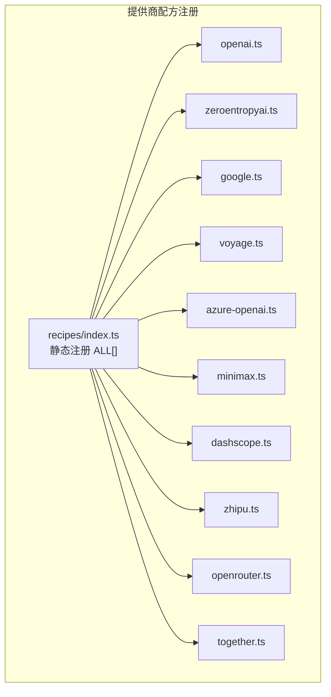
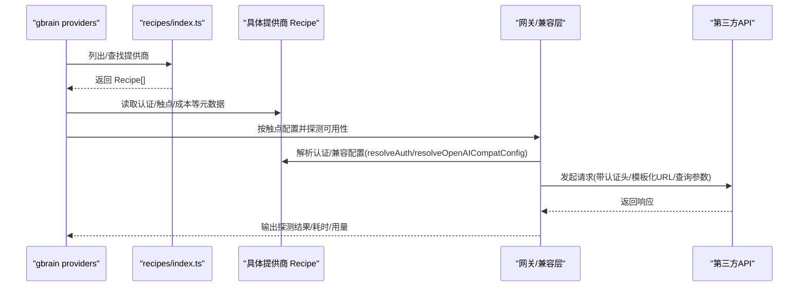
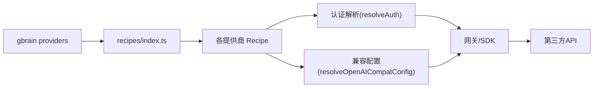

# 托管提供商

<cite>
**本文引用的文件**
- [src/core/ai/recipes/index.ts](file://src/core/ai/recipes/index.ts)
- [src/core/ai/recipes/openai.ts](file://src/core/ai/recipes/openai.ts)
- [src/core/ai/recipes/zeroentropyai.ts](file://src/core/ai/recipes/zeroentropyai.ts)
- [src/core/ai/recipes/google.ts](file://src/core/ai/recipes/google.ts)
- [src/core/ai/recipes/voyage.ts](file://src/core/ai/recipes/voyage.ts)
- [src/core/ai/recipes/azure-openai.ts](file://src/core/ai/recipes/azure-openai.ts)
- [src/core/ai/recipes/minimax.ts](file://src/core/ai/recipes/minimax.ts)
- [src/core/ai/recipes/dashscope.ts](file://src/core/ai/recipes/dashscope.ts)
- [src/core/ai/recipes/zhipu.ts](file://src/core/ai/recipes/zhipu.ts)
- [src/core/ai/recipes/openrouter.ts](file://src/core/ai/recipes/openrouter.ts)
- [src/core/ai/recipes/together.ts](file://src/core/ai/recipes/together.ts)
- [src/commands/providers.ts](file://src/commands/providers.ts)
- [docs/integrations/embedding-providers.md](file://docs/integrations/embedding-providers.md)
- [test/ai/zeroentropy-recipe.test.ts](file://test/ai/zeroentropy-recipe.test.ts)
- [test/ai/recipe-dashscope.test.ts](file://test/ai/recipe-dashscope.test.ts)
- [test/ai/recipe-zhipu.test.ts](file://test/ai/recipe-zhipu.test.ts)
- [src/core/minions/handlers/shell-inherit.ts](file://src/core/minions/handlers/shell-inherit.ts)
- [src/core/brain-score-recommendations.ts](file://src/core/brain-score-recommendations.ts)
- [CHANGELOG.md](file://CHANGELOG.md)
</cite>

## 目录
1. [简介](#简介)
2. [项目结构](#项目结构)
3. [核心组件](#核心组件)
4. [架构总览](#架构总览)
5. [详细组件分析](#详细组件分析)
6. [依赖关系分析](#依赖关系分析)
7. [性能考量](#性能考量)
8. [故障排查指南](#故障排查指南)
9. [结论](#结论)
10. [附录](#附录)

## 简介
本文件面向需要在系统中集成与使用托管AI提供商的工程师与产品人员，系统性梳理了OpenAI、ZeroEntropy、Google、Voyage、Azure OpenAI、MiniMax、DashScope、Zhipu、OpenRouter、Together等10个托管提供商的配置与使用方法。内容涵盖API密钥设置、模型选择、默认维度、成本价格、已知限制、认证方式、特色功能（如Voyage的代码优化模型、OpenRouter的多模型聚合、Azure OpenAI的企业合规性）、环境变量配置示例以及提供商选择决策树与性能对比表。

## 项目结构
- 提供商注册与清单：所有托管提供商以“配方（Recipe）”形式集中注册于静态索引，便于统一管理与扩展。
- 命令行工具：通过命令行工具对提供商进行列表、测试、环境检查与推荐矩阵生成。
- 文档与测试：配套的人类可读文档与完备的端到端/单元测试覆盖关键行为与回归。

**图表来源**
- [src/core/ai/recipes/index.ts:27-45](file://src/core/ai/recipes/index.ts#L27-L45)

**章节来源**
- [src/core/ai/recipes/index.ts:1-57](file://src/core/ai/recipes/index.ts#L1-L57)

## 核心组件
- 配方（Recipe）：描述提供商的ID、名称、层级、实现方式、默认基础URL、认证所需环境变量、触点（embedding/expansion/chat/reranker）能力与约束、成本与价格更新时间、自定义认证或兼容配置解析器等。
- 命令行工具 providers：提供列表、测试、环境检查、推荐矩阵等功能；支持按触点（embedding/chat）探测可用性并输出耗时与用量摘要。
- 文档与测试：人类可读的集成文档与针对各提供商配方的行为测试，确保关键字段与行为稳定。

**章节来源**
- [src/commands/providers.ts:1-449](file://src/commands/providers.ts#L1-L449)
- [docs/integrations/embedding-providers.md:1-188](file://docs/integrations/embedding-providers.md#L1-L188)

## 架构总览
下图展示了从命令行到提供商配方、再到网关调用的整体流程，包括环境变量注入、认证解析与兼容层处理。

**图表来源**
- [src/commands/providers.ts:91-236](file://src/commands/providers.ts#L91-L236)
- [src/core/ai/recipes/openrouter.ts:1-27](file://src/core/ai/recipes/openrouter.ts#L1-L27)
- [src/core/ai/recipes/azure-openai.ts:56-108](file://src/core/ai/recipes/azure-openai.ts#L56-L108)

## 详细组件分析

### OpenAI
- 认证与设置
  - 必需：OPENAI_API_KEY
  - 可选：OPENAI_ORG_ID、OPENAI_PROJECT
  - 设置指引：在平台获取API密钥后导出环境变量
- 触点能力
  - embedding：默认1536维，支持Matryoshka收缩至256/512/768/1024/1536/3072；批令牌上限保守为100K
  - expansion：模型列表含gpt-5.2、gpt-4o-mini
  - chat：支持工具调用与子代理循环；最大上下文约200K；输入/输出成本按模型基准定价
- 成本与价格
  - embedding：$0.13/1M tokens
  - expansion：$0.15/1M tokens
  - chat：gpt-5.2基准输入$1.25/1M，输出$10.0/1M
- 已知限制
  - 单次请求硬上限300K tokens；免费/Tier-1 TPM为1M；批处理保守至100K tokens以应对高密度内容
- 特色功能
  - 默认且广泛兼容；与现有1536维向量方案兼容性最佳

**章节来源**
- [src/core/ai/recipes/openai.ts:1-45](file://src/core/ai/recipes/openai.ts#L1-L45)
- [docs/integrations/embedding-providers.md:76-78](file://docs/integrations/embedding-providers.md#L76-L78)

### ZeroEntropy
- 认证与设置
  - 必需：ZEROENTROPY_API_KEY
  - 设置指引：在仪表板获取密钥后导出环境变量
- 触点能力
  - embedding：模型zembed-1，默认2560维；批令牌上限120K；字符/令牌估算为1，安全系数0.5
  - reranker：模型集zerank-2、zerank-1、zerank-1-small，默认zerank-2；单请求体限制5MB
- 成本与价格
  - embedding：$0.05/1M tokens
  - reranker：$0.025/1M tokens
- 已知限制
  - 免费版每分钟输入上限约500KB；请求体大小限制5MB
- 特色功能
  - 与Voyage类似的稠密负载策略（字符/令牌≈1，安全系数0.5），适合混合内容预切分

**章节来源**
- [src/core/ai/recipes/zeroentropyai.ts:31-67](file://src/core/ai/recipes/zeroentropyai.ts#L31-L67)
- [test/ai/zeroentropy-recipe.test.ts:27-62](file://test/ai/zeroentropy-recipe.test.ts#L27-L62)

### Google（Gemini）
- 认证与设置
  - 必需：GOOGLE_GENERATIVE_AI_API_KEY
  - 设置指引：在AI Studio获取公共API密钥后导出环境变量
- 触点能力
  - embedding：模型gemini-embedding-001，默认768维，Matryoshka至3072
  - expansion：gemini-2.0-flash、gemini-2.0-flash-lite
  - chat：gemini-2.0-flash-exp、gemini-2.0-flash、gemini-1.5-pro；最大上下文达1M
- 成本与价格
  - embedding：$0.025/1M tokens
  - expansion：$0.10/1M tokens
  - chat：gemini-1.5-pro输入$0.30/1M，输出$1.20/1M
- 已知限制
  - 无公开批令牌上限声明；默认768维
- 特色功能
  - 上下文长、成本低；适合大文本场景

**章节来源**
- [src/core/ai/recipes/google.ts:1-38](file://src/core/ai/recipes/google.ts#L1-L38)
- [docs/integrations/embedding-providers.md:96-101](file://docs/integrations/embedding-providers.md#L96-L101)

### Voyage
- 认证与设置
  - 必需：VOYAGE_API_KEY
  - 设置指引：在仪表板获取密钥后导出环境变量
- 触点能力
  - embedding：模型族voyage-4系列（共享嵌入空间，可跨变体检索），默认1024维；批令牌上限120K；字符/令牌估算为1，安全系数0.5；支持多模态（仅voyage-multimodal-3）
- 成本与价格
  - embedding：$0.18/1M tokens
- 已知限制
  - 单批120K tokens；tokenizer在混合内容（代码/JSON/CJK）上更稠密，预切分采用1字符≈1 token、0.5利用率策略
- 特色功能
  - 代码优化模型（voyage-code-3）专为编程语言优化；多模态支持；共享嵌入空间允许跨变体检索无需重索引

**章节来源**
- [src/core/ai/recipes/voyage.ts:21-63](file://src/core/ai/recipes/voyage.ts#L21-L63)
- [docs/integrations/embedding-providers.md:80-95](file://docs/integrations/embedding-providers.md#L80-L95)

### Azure OpenAI
- 认证与设置
  - 必需：AZURE_OPENAI_API_KEY、AZURE_OPENAI_ENDPOINT、AZURE_OPENAI_DEPLOYMENT
  - 可选：AZURE_OPENAI_API_VERSION（默认2024-10-21）
  - 设置指引：在Azure门户获取资源与部署信息后导出环境变量
- 触点能力
  - embedding：支持text-embedding-3-large/3-small/ada-002，默认1536维；Matryoshka收缩；批令牌上限8192
- 成本与价格
  - embedding：$0.13/1M tokens
- 已知限制
  - 使用自定义头部“api-key:”而非“Authorization: Bearer”；URL模板化并注入“api-version”查询参数
- 特色功能
  - 企业合规与数据驻留；私有端点支持；通过自定义认证与兼容配置适配Azure特有要求

**章节来源**
- [src/core/ai/recipes/azure-openai.ts:25-112](file://src/core/ai/recipes/azure-openai.ts#L25-L112)
- [docs/integrations/embedding-providers.md:116-123](file://docs/integrations/embedding-providers.md#L116-L123)

### MiniMax
- 认证与设置
  - 必需：MINIMAX_API_KEY
  - 可选：MINIMAX_GROUP_ID
  - 设置指引：在平台获取密钥后导出环境变量
- 触点能力
  - embedding：模型embo-01，默认1536维；批令牌上限4096
- 成本与价格
  - embedding：$0.07/1M tokens
- 已知限制
  - 未公开单次批令牌上限；保守声明4096以避免未知服务端限制
- 特色功能
  - 支持异构检索类型（db/query）；当前路由为对称检索（db）

**章节来源**
- [src/core/ai/recipes/minimax.ts:18-45](file://src/core/ai/recipes/minimax.ts#L18-L45)
- [docs/integrations/embedding-providers.md:124-129](file://docs/integrations/embedding-providers.md#L124-L129)

### DashScope（阿里）
- 认证与设置
  - 必需：DASHSCOPE_API_KEY
  - 设置指引：在帮助文档获取密钥后导出环境变量
- 触点能力
  - embedding：模型text-embedding-v3（当前，Matryoshka 64-1024）、text-embedding-v2；默认1024维；批令牌上限8192
- 成本与价格
  - embedding：价格因模型而异
- 已知限制
  - 未公开单次批令牌上限；保守声明8192
- 特色功能
  - 国际端点默认；可通过配置覆盖为国内端点；CJK内容token更稠密，字符/令牌估算为2

**章节来源**
- [src/core/ai/recipes/dashscope.ts:15-33](file://src/core/ai/recipes/dashscope.ts#L15-L33)
- [test/ai/recipe-dashscope.test.ts:10-31](file://test/ai/recipe-dashscope.test.ts#L10-L31)
- [docs/integrations/embedding-providers.md:130-135](file://docs/integrations/embedding-providers.md#L130-L135)

### Zhipu（智谱）
- 认证与设置
  - 必需：ZHIPUAI_API_KEY
  - 设置指引：在平台获取密钥后导出环境变量
- 触点能力
  - embedding：模型embedding-3（当前，Matryoshka 256-2048）、embedding-2；默认1024维（HNSW兼容）；批令牌上限8192
- 成本与价格
  - embedding：价格因模型而异
- 已知限制
  - 2048维超出HNSW上限，回落到精确扫描（仍正确但较慢）
- 特色功能
  - 支持更高维度Matryoshka；默认1024维兼顾性能与兼容

**章节来源**
- [src/core/ai/recipes/zhipu.ts:17-40](file://src/core/ai/recipes/zhipu.ts#L17-L40)
- [test/ai/recipe-zhipu.test.ts:21-34](file://test/ai/recipe-zhipu.test.ts#L21-L34)
- [docs/integrations/embedding-providers.md:136-139](file://docs/integrations/embedding-providers.md#L136-L139)

### OpenRouter
- 认证与设置
  - 必需：OPENROUTER_API_KEY
  - 可选：OPENROUTER_BASE_URL（自托管代理）、OPENROUTER_REFERER、OPENROUTER_TITLE（归属标识）
  - 设置指引：在平台获取密钥后导出环境变量；使用“openrouter:<provider>/<model>”格式指定模型
- 触点能力
  - embedding：默认openai/text-embedding-3-small（1536维，Matryoshka收缩至512/768/1024）
  - chat：通过单一OpenAI兼容端点代理多家提供商（OpenAI、Anthropic、Google、DeepSeek、Meta Llama、Qwen等）
- 成本与价格
  - embedding：$0.02/1M tokens（OpenAI text-embedding-3-small）
- 已知限制
  - 归属相关头部需正确设置；部分模型工具调用能力依上游而定
- 特色功能
  - 单键多模型聚合；支持自托管代理；工具调用由OR端点封装，但具体模型能力以上游为准

**章节来源**
- [src/core/ai/recipes/openrouter.ts:1-27](file://src/core/ai/recipes/openrouter.ts#L1-L27)
- [docs/integrations/embedding-providers.md:102-115](file://docs/integrations/embedding-providers.md#L102-L115)

### Together AI
- 认证与设置
  - 必需：TOGETHER_API_KEY
  - 设置指引：在平台获取密钥后导出环境变量
- 触点能力
  - chat：支持工具调用与子代理循环；模型集含Qwen、Llama-3.3-70B-Turbo、DeepSeek-V3、Mixtral-8x22B-Instruct-v0.1；最大上下文131072
- 成本与价格
  - chat：Llama-3.3-70B-Turbo基准输入/输出均为$0.88/1M
- 已知限制
  - 无公开批令牌上限声明
- 特色功能
  - 开源权重托管；在价格与速度之间提供平衡

**章节来源**
- [src/core/ai/recipes/together.ts:8-36](file://src/core/ai/recipes/together.ts#L8-L36)
- [docs/integrations/embedding-providers.md:152-157](file://docs/integrations/embedding-providers.md#L152-L157)

## 依赖关系分析
- providers命令行工具依赖recipes索引与具体Recipe元数据，用于生成推荐矩阵、检测环境变量、探测可用性与成本信息。
- Azure OpenAI通过自定义认证与兼容配置解析器适配其特有头部与URL模板化需求。
- OpenRouter通过单一OpenAI兼容端点聚合多家提供商，简化多键管理。

**图表来源**
- [src/commands/providers.ts:91-236](file://src/commands/providers.ts#L91-L236)
- [src/core/ai/recipes/azure-openai.ts:56-108](file://src/core/ai/recipes/azure-openai.ts#L56-L108)
- [src/core/ai/recipes/openrouter.ts:1-27](file://src/core/ai/recipes/openrouter.ts#L1-L27)

**章节来源**
- [src/commands/providers.ts:277-394](file://src/commands/providers.ts#L277-L394)

## 性能考量
- 维度与索引
  - HNSW上限2000维；超过将回落到精确扫描，影响检索性能。建议优先选择1024或1536维。
- 批处理与预切分
  - 各提供商对批令牌上限采取保守声明，结合字符/令牌估算与安全系数，减少超限风险。
- 成本与性价比
  - OpenRouter在embedding端具备较低单价；Azure OpenAI与OpenAI同价；DashScope/Zhipu价格因模型而异；MiniMax与ZeroEntropy在embedding端具有竞争力。

[本节为通用指导，不直接分析具体文件]

## 故障排查指南
- 环境变量缺失
  - providers命令会检测必需环境变量是否就绪；缺失时提示具体变量名与设置指引。
- 探测失败
  - 对embedding执行embedOne，对chat执行一次简短对话；输出耗时、模型、停止原因、token用量与预览文本；错误分类为配置错误或瞬时错误。
- 维度不匹配
  - 若出现“期望N维，实际M维”，使用doctor修复；空脑可重建，非空脑可迁移重索引。
- Azure特有问题
  - 确认使用“api-key”头部与正确的端点/部署/版本参数；URL模板化与查询参数注入由兼容配置处理。

**章节来源**
- [src/commands/providers.ts:142-236](file://src/commands/providers.ts#L142-L236)
- [docs/integrations/embedding-providers.md:45-60](file://docs/integrations/embedding-providers.md#L45-L60)

## 结论
- 选择建议
  - 成本敏感且英文为主：Ollama（本地免费）或Voyage（付费，性价比高）
  - 质量优先：Voyage 4系列（共享嵌入空间，跨变体检索）
  - 代码密集：Voyage code-tuned模型
  - 企业合规：Azure OpenAI（数据驻留与私有端点）
  - 多模型聚合：OpenRouter（单键多模型）
  - 中国地区：DashScope（国际端点默认，可覆盖为国内端点）或Zhipu
  - 本地可控：llama-server/Ollama
  - 任意供应商：LiteLLM代理
- 配置要点
  - 明确环境变量与默认基础URL
  - 依据批令牌上限与字符/令牌估算进行预切分
  - 优先1024/1536维以保持HNSW性能

[本节为总结性内容，不直接分析具体文件]

## 附录

### 环境变量与认证方式一览
- OpenAI：OPENAI_API_KEY（可选OPENAI_ORG_ID、OPENAI_PROJECT）
- ZeroEntropy：ZEROENTROPY_API_KEY
- Google：GOOGLE_GENERATIVE_AI_API_KEY
- Voyage：VOYAGE_API_KEY
- Azure OpenAI：AZURE_OPENAI_API_KEY、AZURE_OPENAI_ENDPOINT、AZURE_OPENAI_DEPLOYMENT（可选AZURE_OPENAI_API_VERSION）
- MiniMax：MINIMAX_API_KEY（可选MINIMAX_GROUP_ID）
- DashScope：DASHSCOPE_API_KEY
- Zhipu：ZHIPUAI_API_KEY
- OpenRouter：OPENROUTER_API_KEY（可选OPENROUTER_BASE_URL、OPENROUTER_REFERER、OPENROUTER_TITLE）
- Together AI：TOGETHER_API_KEY

**章节来源**
- [src/core/ai/recipes/openai.ts:8-12](file://src/core/ai/recipes/openai.ts#L8-L12)
- [src/core/ai/recipes/zeroentropyai.ts:37-40](file://src/core/ai/recipes/zeroentropyai.ts#L37-L40)
- [src/core/ai/recipes/google.ts:8-11](file://src/core/ai/recipes/google.ts#L8-L11)
- [src/core/ai/recipes/voyage.ts:27-30](file://src/core/ai/recipes/voyage.ts#L27-L30)
- [src/core/ai/recipes/azure-openai.ts:31-40](file://src/core/ai/recipes/azure-openai.ts#L31-L40)
- [src/core/ai/recipes/minimax.ts:24-28](file://src/core/ai/recipes/minimax.ts#L24-L28)
- [src/core/ai/recipes/dashscope.ts:21-24](file://src/core/ai/recipes/dashscope.ts#L21-L24)
- [src/core/ai/recipes/zhipu.ts:23-26](file://src/core/ai/recipes/zhipu.ts#L23-L26)
- [src/core/ai/recipes/openrouter.ts:46-50](file://src/core/ai/recipes/openrouter.ts#L46-L50)
- [src/core/ai/recipes/together.ts:14-17](file://src/core/ai/recipes/together.ts#L14-L17)

### 提供商选择决策树
- 成本敏感且英文为主：Ollama（本地免费）或Voyage（付费，性价比高）
- 质量优先：Voyage 4系列（共享嵌入空间，跨变体检索）
- 代码密集：Voyage code-tuned模型
- 企业合规：Azure OpenAI（数据驻留与私有端点）
- 多模型聚合：OpenRouter（单键多模型）
- 中国地区：DashScope（国际端点默认，可覆盖为国内端点）或Zhipu
- 本地可控：llama-server/Ollama
- 任意供应商：LiteLLM代理

**章节来源**
- [docs/integrations/embedding-providers.md:61-73](file://docs/integrations/embedding-providers.md#L61-L73)

### 性能对比表（单位：$/1M tokens，维度：默认/可收缩，批令牌上限保守值）
- OpenAI：embedding $0.13（1536，默认3072 Matryoshka），批上限100K
- ZeroEntropy：embedding $0.05（2560，默认2560 Matryoshka），批上限120K
- OpenRouter：embedding $0.02（1536，默认Matryoshka收缩），批上限未公开
- Voyage：embedding $0.18（1024，默认1024 Matryoshka），批上限120K
- Google：embedding $0.025（768，默认3072 Matryoshka），批上限未公开
- Azure OpenAI：embedding $0.13（1536，默认Matryoshka），批上限8192
- MiniMax：embedding $0.07（1536），批上限4096
- DashScope：embedding 价格因模型而异（默认1024 Matryoshka 64-1024），批上限8192
- Zhipu：embedding 价格因模型而异（默认1024 Matryoshka 256-2048），批上限8192

**章节来源**
- [docs/integrations/embedding-providers.md:24-42](file://docs/integrations/embedding-providers.md#L24-L42)
- [src/core/ai/recipes/openai.ts:18-26](file://src/core/ai/recipes/openai.ts#L18-L26)
- [src/core/ai/recipes/zeroentropyai.ts:52-54](file://src/core/ai/recipes/zeroentropyai.ts#L52-L54)
- [src/core/ai/recipes/openrouter.ts:13-18](file://src/core/ai/recipes/openrouter.ts#L13-L18)
- [src/core/ai/recipes/voyage.ts:40-47](file://src/core/ai/recipes/voyage.ts#L40-L47)
- [src/core/ai/recipes/google.ts:17-19](file://src/core/ai/recipes/google.ts#L17-L19)
- [src/core/ai/recipes/azure-openai.ts:51-54](file://src/core/ai/recipes/azure-openai.ts#L51-L54)
- [src/core/ai/recipes/minimax.ts:33-40](file://src/core/ai/recipes/minimax.ts#L33-L40)
- [src/core/ai/recipes/dashscope.ts:28-33](file://src/core/ai/recipes/dashscope.ts#L28-L33)
- [src/core/ai/recipes/zhipu.ts:33-36](file://src/core/ai/recipes/zhipu.ts#L33-L36)

### 环境变量派生规则（用于子进程继承）
- 大多数配置键通过全大写派生为环境键（如anthropic_api_key → ANTHROPIC_API_KEY）
- 少数gbrain特有名（如database_url）使用gbrain前缀（GBRAIN_DATABASE_URL）避免冲突

**章节来源**
- [src/core/minions/handlers/shell-inherit.ts:40-53](file://src/core/minions/handlers/shell-inherit.ts#L40-L53)

### 配置平面与网关环境变量映射
- 当前仅OPENAI_API_KEY与ZEROENTROPY_API_KEY会从配置平面折叠到网关环境；其余提供商（如VOYAGE_API_KEY、GOOGLE_GENERATIVE_AI_API_KEY）仍需通过process.env生效

**章节来源**
- [src/core/brain-score-recommendations.ts:14-23](file://src/core/brain-score-recommendations.ts#L14-L23)

### 变更日志中的相关片段
- OpenRouter：支持单键多模型聚合，设置OPENROUTER_API_KEY后使用openrouter:<provider>/<model>
- Azure OpenAI：首次引入自定义认证头与URL模板化fetch包装
- DashScope：国际端点默认；CJK内容字符/令牌估算为2
- ZeroEntropy：默认embedding与reranker，提供批量令牌上限与安全系数策略

**章节来源**
- [CHANGELOG.md:9909-9916](file://CHANGELOG.md#L9909-L9916)
- [CHANGELOG.md:13640-13642](file://CHANGELOG.md#L13640-L13642)
- [CHANGELOG.md:15488-15599](file://CHANGELOG.md#L15488-L15599)