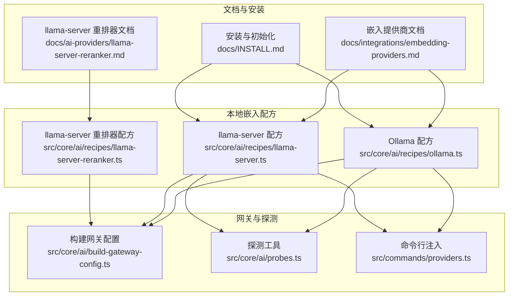
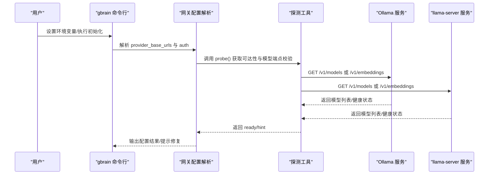
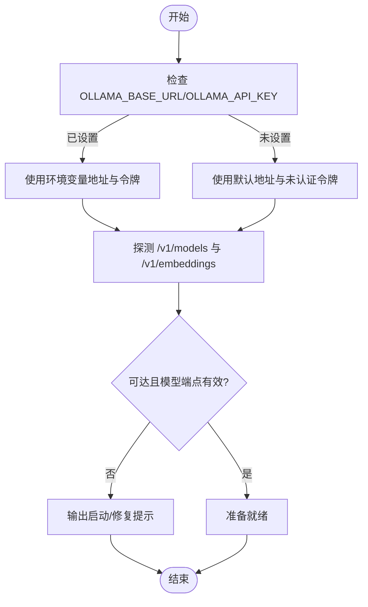
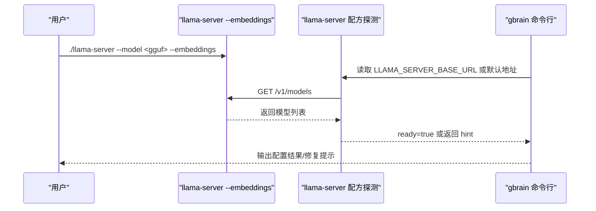
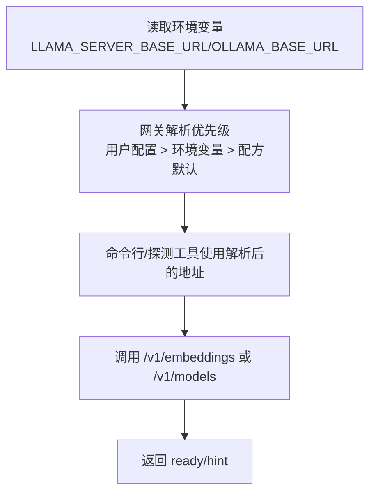
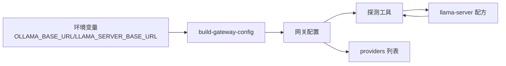

# 本地提供商

<cite>
**本文引用的文件**   
- [src/core/ai/recipes/ollama.ts](file://src/core/ai/recipes/ollama.ts)
- [src/core/ai/recipes/llama-server.ts](file://src/core/ai/recipes/llama-server.ts)
- [src/core/ai/recipes/llama-server-reranker.ts](file://src/core/ai/recipes/llama-server-reranker.ts)
- [docs/integrations/embedding-providers.md](file://docs/integrations/embedding-providers.md)
- [docs/ai-providers/llama-server-reranker.md](file://docs/ai-providers/llama-server-reranker.md)
- [docs/INSTALL.md](file://docs/INSTALL.md)
- [src/core/ai/build-gateway-config.ts](file://src/core/ai/build-gateway-config.ts)
- [src/core/ai/probes.ts](file://src/core/ai/probes.ts)
- [src/commands/providers.ts](file://src/commands/providers.ts)
- [CHANGELOG.md](file://CHANGELOG.md)
- [test/ai/recipe-llama-server.test.ts](file://test/ai/recipe-llama-server.test.ts)
- [test/ai/recipes-existing-regression.test.ts](file://test/ai/recipes-existing-regression.test.ts)
- [test/ai/build-gateway-config.test.ts](file://test/ai/build-gateway-config.test.ts)
</cite>

## 目录
1. [简介](#简介)
2. [项目结构](#项目结构)
3. [核心组件](#核心组件)
4. [架构总览](#架构总览)
5. [详细组件分析](#详细组件分析)
6. [依赖关系分析](#依赖关系分析)
7. [性能考量](#性能考量)
8. [故障排除指南](#故障排除指南)
9. [结论](#结论)
10. [附录](#附录)

## 简介
本文件面向需要在本地部署与运行嵌入向量服务的用户，系统性说明两类本地AI提供商的安装、配置与使用：Ollama 与 llama.cpp 的 llama-server。内容涵盖：
- 部署优势：隐私保护、离线可用、零成本
- 安装与启动步骤：Ollama 的模型拉取与服务启动；llama-server 的 GGUF 模型加载与嵌入端点
- 环境变量与认证：OLLAMA_BASE_URL、LLAMA_SERVER_BASE_URL、LLAMA_SERVER_RERANKER_BASE_URL 及相关 API 密钥
- 模型选择建议：nomic-embed-text、mxbai-embed-large 等
- 故障排除与性能优化建议

## 项目结构
围绕本地嵌入提供商的核心代码与文档分布如下：
- 本地嵌入提供商配方定义：Ollama 与 llama-server 的配方位于 src/core/ai/recipes 下
- 本地重排器配方：llama-server-reranker 的配方位于同一目录
- 使用指南与环境变量说明：docs/integrations/embedding-providers.md 与 docs/ai-providers/llama-server-reranker.md
- 安装与初始化流程：docs/INSTALL.md
- 网关基础地址解析与探测逻辑：src/core/ai/build-gateway-config.ts、src/core/ai/probes.ts
- 命令行与环境注入：src/commands/providers.ts
- 变更日志与测试用例：CHANGELOG.md、test/ai/* 相关测试

**图表来源**
- [src/core/ai/recipes/ollama.ts:1-27](file://src/core/ai/recipes/ollama.ts#L1-L27)
- [src/core/ai/recipes/llama-server.ts:1-68](file://src/core/ai/recipes/llama-server.ts#L1-L68)
- [src/core/ai/recipes/llama-server-reranker.ts:1-84](file://src/core/ai/recipes/llama-server-reranker.ts#L1-L84)
- [docs/integrations/embedding-providers.md:140-151](file://docs/integrations/embedding-providers.md#L140-L151)
- [docs/ai-providers/llama-server-reranker.md:1-162](file://docs/ai-providers/llama-server-reranker.md#L1-L162)
- [docs/INSTALL.md:1-114](file://docs/INSTALL.md#L1-L114)
- [src/core/ai/build-gateway-config.ts:39-50](file://src/core/ai/build-gateway-config.ts#L39-L50)
- [src/core/ai/probes.ts:39-61](file://src/core/ai/probes.ts#L39-L61)
- [src/commands/providers.ts:348-352](file://src/commands/providers.ts#L348-L352)

**章节来源**
- [src/core/ai/recipes/ollama.ts:1-27](file://src/core/ai/recipes/ollama.ts#L1-L27)
- [src/core/ai/recipes/llama-server.ts:1-68](file://src/core/ai/recipes/llama-server.ts#L1-L68)
- [docs/integrations/embedding-providers.md:140-151](file://docs/integrations/embedding-providers.md#L140-L151)
- [docs/INSTALL.md:1-114](file://docs/INSTALL.md#L1-L114)

## 核心组件
- Ollama 本地嵌入配方
  - 默认端口与实现：OpenAI 兼容接口，默认基础地址为本地 11434 端口
  - 认证环境变量：可选 OLLAMA_BASE_URL 与 OLLAMA_API_KEY
  - 支持模型：nomic-embed-text（默认 768 维）、mxbai-embed-large（1024 维）、all-minilm（384 维）
  - 成本：0 美元/百万 tokens
  - 批处理容量：无静态上限（受本地模型与并发参数影响）

- llama.cpp llama-server 本地嵌入配方
  - 默认端口与实现：OpenAI 兼容接口，默认基础地址为本地 8080 端口
  - 认证环境变量：可选 LLAMA_SERVER_BASE_URL 与 LLAMA_SERVER_API_KEY
  - 模型策略：用户驱动模型，需显式指定 --embedding-model llama-server:<id> 与 --embedding-dimensions <N>
  - 成本：0 美元/百万 tokens
  - 批处理容量：无静态上限（受启动时上下文大小等参数影响）

- llama-server 本地重排器配方
  - 默认端口：8081，与嵌入版分离
  - 认证环境变量：可选 LLAMA_SERVER_RERANKER_BASE_URL 与 LLAMA_SERVER_RERANKER_API_KEY
  - 支持请求/响应形态：与 ZeroEntropy 的 rerank 接口一致，便于替换
  - 冷启动超时：默认 30 秒，避免首次调用失败

**章节来源**
- [src/core/ai/recipes/ollama.ts:3-26](file://src/core/ai/recipes/ollama.ts#L3-L26)
- [src/core/ai/recipes/llama-server.ts:18-67](file://src/core/ai/recipes/llama-server.ts#L18-L67)
- [src/core/ai/recipes/llama-server-reranker.ts:34-84](file://src/core/ai/recipes/llama-server-reranker.ts#L34-L84)

## 架构总览
本地嵌入提供商通过“配方”抽象统一到 OpenAI 兼容层，由网关根据环境变量与配置解析最终调用地址，并通过探测函数验证可达性与模型端点有效性。

**图表来源**
- [src/core/ai/build-gateway-config.ts:39-50](file://src/core/ai/build-gateway-config.ts#L39-L50)
- [src/core/ai/probes.ts:39-61](file://src/core/ai/probes.ts#L39-L61)
- [src/core/ai/recipes/ollama.ts:8-13](file://src/core/ai/recipes/ollama.ts#L8-L13)
- [src/core/ai/recipes/llama-server.ts:23-29](file://src/core/ai/recipes/llama-server.ts#L23-L29)

## 详细组件分析

### Ollama 本地嵌入提供商
- 安装与启动
  - 安装 Ollama 并拉取推荐模型后启动服务
  - 初始化时可直接选择 ollama:nomic-embed-text 进行烟雾测试
- 环境变量与认证
  - OLLAMA_BASE_URL：覆盖默认基础地址（默认 http://localhost:11434/v1）
  - OLLAMA_API_KEY：用于启用认证的部署场景
  - 未设置时默认以“未认证”方式访问
- 模型与维度
  - 默认模型 nomic-embed-text（768 维），适合大多数英文场景
  - mxbai-embed-large（1024 维）与 all-minilm（384 维）可按需选择
- 批处理与成本
  - 无静态批上限，受本地模型与并发参数影响
  - 成本为 0 美元/百万 tokens

**图表来源**
- [src/core/ai/recipes/ollama.ts:8-13](file://src/core/ai/recipes/ollama.ts#L8-L13)
- [src/core/ai/probes.ts:39-44](file://src/core/ai/probes.ts#L39-L44)
- [docs/integrations/embedding-providers.md:140-145](file://docs/integrations/embedding-providers.md#L140-L145)

**章节来源**
- [src/core/ai/recipes/ollama.ts:1-27](file://src/core/ai/recipes/ollama.ts#L1-L27)
- [docs/integrations/embedding-providers.md:140-145](file://docs/integrations/embedding-providers.md#L140-L145)
- [test/ai/recipes-existing-regression.test.ts:79-113](file://test/ai/recipes-existing-regression.test.ts#L79-L113)

### llama.cpp llama-server 本地嵌入提供商
- 启动与模型管理
  - 通过 --model <gguf 路径> 与 --embeddings 启动嵌入服务
  - 必须显式设置 --embedding-model llama-server:<id> 与 --embedding-dimensions <N>
- 环境变量与认证
  - LLAMA_SERVER_BASE_URL：覆盖默认基础地址（默认 http://localhost:8080/v1）
  - LLAMA_SERVER_API_KEY：可选 Bearer 令牌
- 探测与错误提示
  - 若未监听或 /v1/models 形状异常，返回明确的启动/修复提示
- 重排器独立部署
  - 与嵌入版互斥，需在不同端口分别启动
  - 重排器配方默认端口 8081，支持与 ZeroEntropy 相同的请求/响应形态

**图表来源**
- [src/core/ai/recipes/llama-server.ts:42-67](file://src/core/ai/recipes/llama-server.ts#L42-L67)
- [src/core/ai/probes.ts:51-61](file://src/core/ai/probes.ts#L51-L61)
- [docs/ai-providers/llama-server-reranker.md:60-91](file://docs/ai-providers/llama-server-reranker.md#L60-L91)

**章节来源**
- [src/core/ai/recipes/llama-server.ts:1-68](file://src/core/ai/recipes/llama-server.ts#L1-L68)
- [docs/ai-providers/llama-server-reranker.md:1-162](file://docs/ai-providers/llama-server-reranker.md#L1-L162)
- [test/ai/recipe-llama-server.test.ts:1-61](file://test/ai/recipe-llama-server.test.ts#L1-L61)

### 网关配置与环境变量注入
- 网关配置解析
  - 从环境变量读取 LLAMA_SERVER_BASE_URL 与 OLLAMA_BASE_URL，优先级高于配方默认值
  - 当用户提供 cfg.provider_base_urls 时，以用户配置为准
- 命令行注入
  - 在 providers 列表中展示各提供商的基础地址可达性与模型端点有效性
- 测试覆盖
  - 测试确保 envVar 与 recipeId 的映射正确，以及默认回退行为符合预期

**图表来源**
- [src/core/ai/build-gateway-config.ts:39-50](file://src/core/ai/build-gateway-config.ts#L39-L50)
- [src/commands/providers.ts:348-352](file://src/commands/providers.ts#L348-L352)
- [test/ai/build-gateway-config.test.ts:26-27](file://test/ai/build-gateway-config.test.ts#L26-L27)

**章节来源**
- [src/core/ai/build-gateway-config.ts:39-50](file://src/core/ai/build-gateway-config.ts#L39-L50)
- [src/commands/providers.ts:348-352](file://src/commands/providers.ts#L348-L352)
- [test/ai/build-gateway-config.test.ts:26-27](file://test/ai/build-gateway-config.test.ts#L26-L27)

## 依赖关系分析
- 配方对探测工具的依赖：llama-server 配方通过 probeLlamaServer 验证服务可达与模型端点有效性
- 网关对环境变量的依赖：build-gateway-config 将环境变量映射为 provider_base_urls，供网关调用
- 命令行对网关配置的依赖：providers 列表展示基于网关解析后的地址与可达性

**图表来源**
- [src/core/ai/build-gateway-config.ts:39-50](file://src/core/ai/build-gateway-config.ts#L39-L50)
- [src/core/ai/probes.ts:51-61](file://src/core/ai/probes.ts#L51-L61)
- [src/core/ai/recipes/llama-server.ts:42-67](file://src/core/ai/recipes/llama-server.ts#L42-L67)
- [src/commands/providers.ts:348-352](file://src/commands/providers.ts#L348-L352)

**章节来源**
- [src/core/ai/recipes/llama-server.ts:1-68](file://src/core/ai/recipes/llama-server.ts#L1-L68)
- [src/core/ai/build-gateway-config.ts:39-50](file://src/core/ai/build-gateway-config.ts#L39-L50)
- [src/core/ai/probes.ts:39-61](file://src/core/ai/probes.ts#L39-L61)
- [src/commands/providers.ts:348-352](file://src/commands/providers.ts#L348-L352)

## 性能考量
- 批处理容量
  - 两类本地提供商均声明无静态批上限，实际容量取决于本地模型加载情况与并发参数（例如 Ollama 的 OLLAMA_NUM_PARALLEL 与 llama.cpp 的 --ctx-size）
- 重排器冷启动
  - llama-server 重排器默认超时 30 秒，避免首次调用失败；可通过配置项调整
- 成本与预算
  - 本地嵌入与重排均为零成本；预算跟踪对本地重排提供豁免，避免硬性失败

**章节来源**
- [src/core/ai/recipes/ollama.ts:20-22](file://src/core/ai/recipes/ollama.ts#L20-L22)
- [src/core/ai/recipes/llama-server.ts:37-40](file://src/core/ai/recipes/llama-server.ts#L37-L40)
- [docs/ai-providers/llama-server-reranker.md:125-151](file://docs/ai-providers/llama-server-reranker.md#L125-L151)

## 故障排除指南
- 无法连接本地服务
  - 检查 LLAMA_SERVER_BASE_URL 是否指向正确的主机与端口；若未监听或端口不正确，配方探测会返回明确的启动/修复提示
- 模型端点形状异常
  - 若 /v1/models 返回结构不符合预期，探测会提示检查服务是否处于嵌入模式
- Ollama 未设置 API 密钥
  - 本地未认证部署下，未设置 OLLAMA_API_KEY 将使用“未认证”令牌；若部署启用了认证，请设置 OLLAMA_API_KEY
- 环境变量优先级问题
  - 用户提供的 cfg.provider_base_urls 优先于环境变量；若仅设置了环境变量但未生效，请确认是否在配置中覆盖了基础地址
- 版本变更与回归
  - 变更日志记录了环境变量与认证行为的演进；若出现行为差异，请参考对应版本说明

**章节来源**
- [src/core/ai/recipes/llama-server.ts:48-64](file://src/core/ai/recipes/llama-server.ts#L48-L64)
- [src/core/ai/probes.ts:51-61](file://src/core/ai/probes.ts#L51-L61)
- [test/ai/recipes-existing-regression.test.ts:79-113](file://test/ai/recipes-existing-regression.test.ts#L79-L113)
- [CHANGELOG.md:13672-13696](file://CHANGELOG.md#L13672-L13696)

## 结论
- Ollama 与 llama.cpp llama-server 提供了低成本、可控、可离线的本地嵌入能力
- 通过环境变量与网关配置，可灵活覆盖默认地址与认证方式
- llama-server 重排器可无缝替换为本地部署，保持与现有 rerank 接口一致
- 建议优先选择 nomic-embed-text（768 维）作为默认模型，兼顾成本与召回质量；在需要更高密度向量时再考虑 1024 维模型

## 附录

### 安装与初始化步骤
- Ollama
  - 安装 Ollama 并拉取推荐模型后启动服务
  - 初始化时可直接选择 ollama:nomic-embed-text 进行烟雾测试
- llama.cpp llama-server
  - 编译或下载 llama.cpp，拉取 GGUF 模型，使用 --model <gguf 路径> 与 --embeddings 启动嵌入服务
  - 显式设置 --embedding-model llama-server:<id> 与 --embedding-dimensions <N>

**章节来源**
- [docs/integrations/embedding-providers.md:140-151](file://docs/integrations/embedding-providers.md#L140-L151)
- [docs/ai-providers/llama-server-reranker.md:29-91](file://docs/ai-providers/llama-server-reranker.md#L29-L91)
- [docs/INSTALL.md:1-114](file://docs/INSTALL.md#L1-L114)

### 环境变量与认证
- Ollama
  - OLLAMA_BASE_URL：覆盖默认基础地址
  - OLLAMA_API_KEY：用于启用认证的部署场景
- llama-server
  - LLAMA_SERVER_BASE_URL：覆盖默认基础地址
  - LLAMA_SERVER_API_KEY：可选 Bearer 令牌
- llama-server 重排器
  - LLAMA_SERVER_RERANKER_BASE_URL：覆盖默认基础地址
  - LLAMA_SERVER_RERANKER_API_KEY：可选 Bearer 令牌

**章节来源**
- [src/core/ai/recipes/ollama.ts:9-12](file://src/core/ai/recipes/ollama.ts#L9-L12)
- [src/core/ai/recipes/llama-server.ts:24-29](file://src/core/ai/recipes/llama-server.ts#L24-L29)
- [src/core/ai/recipes/llama-server-reranker.ts:42-47](file://src/core/ai/recipes/llama-server-reranker.ts#L42-L47)

### 模型选择建议
- 英文为主、成本敏感：nomic-embed-text（768 维）
- 更高密度向量需求：mxbai-embed-large（1024 维）
- 资源受限或小模型场景：all-minilm（384 维）

**章节来源**
- [src/core/ai/recipes/ollama.ts:16-17](file://src/core/ai/recipes/ollama.ts#L16-L17)
- [docs/integrations/embedding-providers.md:140-145](file://docs/integrations/embedding-providers.md#L140-L145)