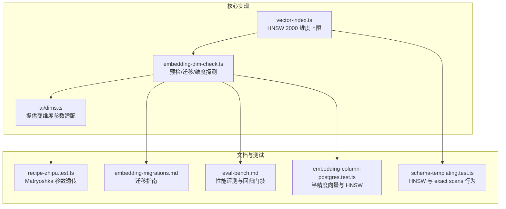
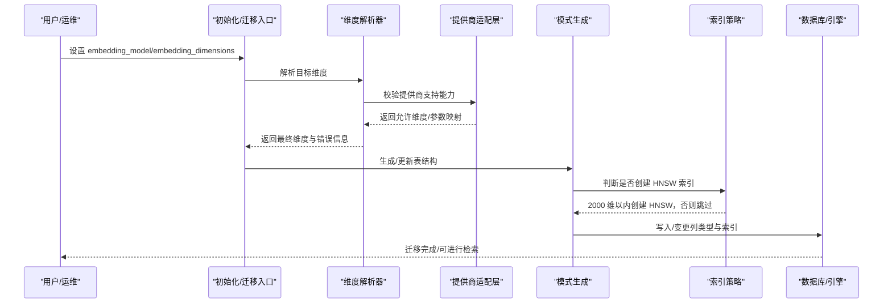
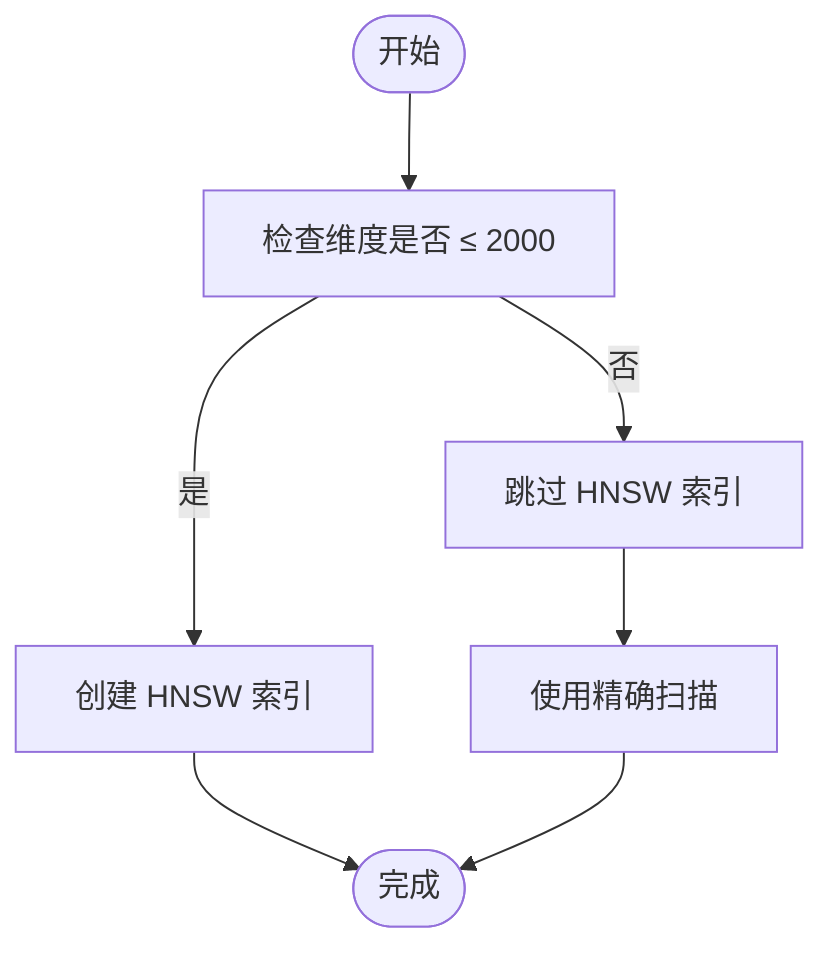
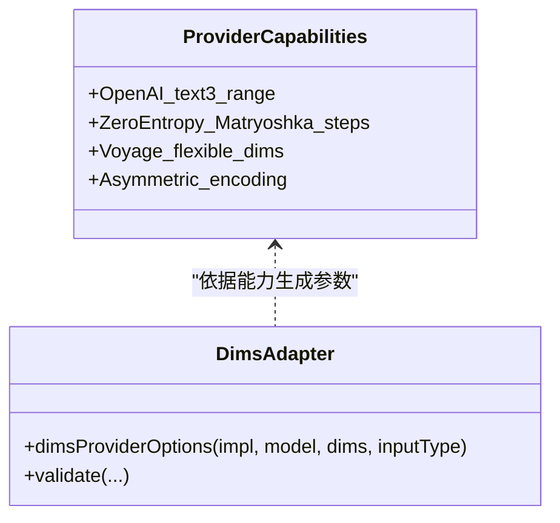
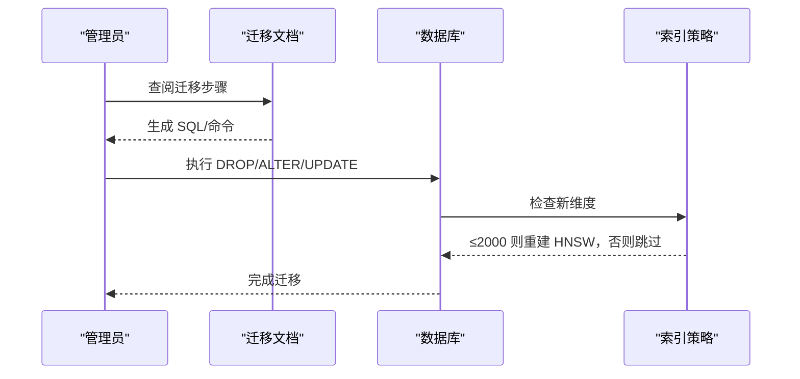
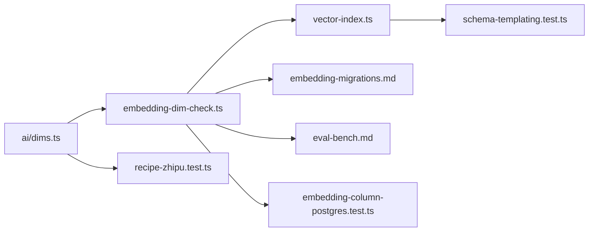

# 维度选择策略

<cite>
**本文引用的文件**
- [vector-index.ts](file://src/core/vector-index.ts)
- [embedding-dim-check.ts](file://src/core/embedding-dim-check.ts)
- [dims.ts](file://src/core/ai/dims.ts)
- [embedding-migrations.md](file://docs/embedding-migrations.md)
- [eval-bench.md](file://docs/eval-bench.md)
- [schema-templating.test.ts](file://test/ai/schema-templating.test.ts)
- [embedding-column-postgres.test.ts](file://test/e2e/embedding-column-postgres.test.ts)
- [recipe-zhipu.test.ts](file://test/ai/recipe-zhipu.test.ts)
- [CHANGELOG.md](file://CHANGELOG.md)
</cite>

## 目录
1. [简介](#简介)
2. [项目结构与相关模块](#项目结构与相关模块)
3. [核心组件](#核心组件)
4. [架构总览](#架构总览)
5. [详细组件分析](#详细组件分析)
6. [依赖关系分析](#依赖关系分析)
7. [性能考量](#性能考量)
8. [故障排查指南](#故障排查指南)
9. [结论](#结论)
10. [附录](#附录)

## 简介
本文件围绕“嵌入维度选择”这一主题，系统阐述以下三类关键维度：
- 提供商原生维度：由具体嵌入模型决定的输出维度（如 OpenAI text-embedding-3 的默认 1536/3072，Voyage 的灵活 256/512/1024/2048，ZeroEntropy zembed-1 的 Matryoshka 步进序列）。
- Matryoshka 降维：在支持的提供商上通过参数请求更小维度，以换取存储与带宽节省；同时保留更高维度的回退路径。
- HNSW 索引上限：pgvector 对 HNSW 索引支持的最大维度为 2000；超过该阈值时自动回退到精确扫描（exact vector scans），搜索性能下降但功能可用。

此外，文档还提供：
- pgvector HNSW 2000 维度限制对索引与查询的影响；
- exact vector scans 的性能影响与适用场景；
- 1024 与 1536 维度的推荐理由；
- Matryoshka 嵌套向量的优势与典型应用；
- 维度迁移指南与性能测试方法；
- 面向不同使用场景（如代码检索、多语言内容）的维度选择建议。

## 项目结构与相关模块
围绕嵌入维度选择的关键代码与文档分布在如下位置：
- 核心实现与策略：
  - 索引与维度上限：src/core/vector-index.ts
  - 维度解析与校验：src/core/embedding-dim-check.ts
  - 提供商维度参数适配：src/core/ai/dims.ts
- 文档与迁移指南：
  - 维度迁移与切换：docs/embedding-migrations.md
  - 性能评测与回归门禁：docs/eval-bench.md
- 测试用例与行为验证：
  - 模式模板与 HNSW 行为：test/ai/schema-templating.test.ts
  - Postgres 下半精度向量与 HNSW 可见性：test/e2e/embedding-column-postgres.test.ts
  - Matryoshka 参数透传与输入类型：test/ai/recipe-zhipu.test.ts
- 变更日志中的背景信息与历史演进：CHANGELOG.md

图表来源
- [vector-index.ts:1-31](file://src/core/vector-index.ts#L1-L31)
- [embedding-dim-check.ts:1-708](file://src/core/embedding-dim-check.ts#L1-L708)
- [dims.ts:1-234](file://src/core/ai/dims.ts#L1-L234)
- [embedding-migrations.md:1-185](file://docs/embedding-migrations.md#L1-L185)
- [eval-bench.md:1-599](file://docs/eval-bench.md#L1-L599)
- [schema-templating.test.ts:25-49](file://test/ai/schema-templating.test.ts#L25-L49)
- [embedding-column-postgres.test.ts:1-149](file://test/e2e/embedding-column-postgres.test.ts#L1-L149)
- [recipe-zhipu.test.ts:60-85](file://test/ai/recipe-zhipu.test.ts#L60-L85)

章节来源
- [vector-index.ts:1-31](file://src/core/vector-index.ts#L1-L31)
- [embedding-dim-check.ts:1-708](file://src/core/embedding-dim-check.ts#L1-L708)
- [dims.ts:1-234](file://src/core/ai/dims.ts#L1-L234)
- [embedding-migrations.md:1-185](file://docs/embedding-migrations.md#L1-L185)
- [eval-bench.md:1-599](file://docs/eval-bench.md#L1-L599)
- [schema-templating.test.ts:25-49](file://test/ai/schema-templating.test.ts#L25-L49)
- [embedding-column-postgres.test.ts:1-149](file://test/e2e/embedding-column-postgres.test.ts#L1-L149)
- [recipe-zhipu.test.ts:60-85](file://test/ai/recipe-zhipu.test.ts#L60-L85)

## 核心组件
- HNSW 索引与维度上限
  - pgvector 对 HNSW 索引支持的最大维度为 2000。当维度超过 2000 时，索引创建被跳过，系统回退到精确扫描（exact vector scans）。该策略在模式模板与单元测试中均有体现。
- 维度解析与迁移
  - 在初始化或迁移前，系统会解析并校验目标维度是否符合提供商能力与 pgvector 能力上限，并生成相应的迁移/重建索引方案。
- 提供商维度参数适配
  - 不同提供商对维度的支持方式不同：部分支持固定维度，部分支持 Matryoshka 步进或任意范围裁剪。系统通过 dimsProviderOptions 将用户配置转换为提供商可接受的请求参数。

章节来源
- [vector-index.ts:19-30](file://src/core/vector-index.ts#L19-L30)
- [embedding-dim-check.ts:35-43](file://src/core/embedding-dim-check.ts#L35-L43)
- [embedding-dim-check.ts:275-401](file://src/core/embedding-dim-check.ts#L275-L401)
- [dims.ts:112-234](file://src/core/ai/dims.ts#L112-L234)

## 架构总览
下图展示了从“配置/提供商选择”到“模式生成/索引决策/迁移执行”的端到端流程，以及维度选择对索引与查询路径的影响。

图表来源
- [embedding-dim-check.ts:275-401](file://src/core/embedding-dim-check.ts#L275-L401)
- [dims.ts:112-234](file://src/core/ai/dims.ts#L112-L234)
- [vector-index.ts:24-30](file://src/core/vector-index.ts#L24-L30)
- [embedding-migrations.md:107-152](file://docs/embedding-migrations.md#L107-L152)

## 详细组件分析

### 组件一：HNSW 索引与 2000 维度上限
- 关键点
  - 当维度 ≤ 2000 时，创建 HNSW 索引以提升检索性能。
  - 当维度 > 2000 时，跳过 HNSW 创建，系统自动回退到精确扫描（exact vector scans），保持功能可用但性能下降。
  - 单元测试覆盖了 1024 维返回 HNSW、2048 维跳过 HNSW 并提示 exact scans 可用的行为。
- 影响
  - 大维度（>2000）场景下，查询计划可能不再使用 HNSW，导致扫描成本上升；需要结合 exact scans 的代价评估与业务容忍度权衡。

图表来源
- [vector-index.ts:19-30](file://src/core/vector-index.ts#L19-L30)
- [schema-templating.test.ts:37-44](file://test/ai/schema-templating.test.ts#L37-L44)

章节来源
- [vector-index.ts:19-30](file://src/core/vector-index.ts#L19-L30)
- [schema-templating.test.ts:28-44](file://test/ai/schema-templating.test.ts#L28-L44)

### 组件二：提供商原生维度与 Matryoshka 降维
- 关键点
  - OpenAI text-embedding-3 支持任意不超过模型原生大小的维度裁剪（1..1536 或 1..3072）。
  - ZeroEntropy zembed-1 支持 Matryoshka 步进（2560/1280/640/320/160/80/40），适合按需降维。
  - Voyage 灵活模型支持 256/512/1024/2048 四个离散维度，超出范围将被拒绝。
  - 对称/非对称编码：部分提供商支持 input_type=query/document 的异构编码，用于查询与文档的差异化优化。
- 应用场景
  - 存储/带宽敏感场景：优先选择较小 Matryoshka 步进（如 1280/640/320）。
  - 代码检索：Voyage 发布了专门的代码模型（voyage-code-3），在代码检索上优于通用旗舰模型。
  - 多语言内容：ZeroEntropy 的 reranker（zerank-2）具备跨语言能力，可配合小维度嵌入使用。

图表来源
- [dims.ts:15-91](file://src/core/ai/dims.ts#L15-L91)
- [dims.ts:112-234](file://src/core/ai/dims.ts#L112-L234)

章节来源
- [dims.ts:15-91](file://src/core/ai/dims.ts#L15-L91)
- [dims.ts:112-234](file://src/core/ai/dims.ts#L112-L234)
- [recipe-zhipu.test.ts:72-84](file://test/ai/recipe-zhipu.test.ts#L72-L84)

### 组件三：维度迁移与索引重建
- 关键点
  - 同维度模型切换：无需 ALTER/重建，仅通过签名差异触发增量重嵌。
  - 不同维度切换：需要重建索引、清空旧向量、ALTER 列类型（Postgres），或在 PGLite 上执行 wipe-and-reinit。
  - HNSW 重建条件：仅当新维度 ≤ 2000 时重建；>2000 时跳过索引，依赖精确扫描。
- 流程
  - Postgres：先删除 HNSW，再清空向量，ALTER 列类型，最后根据维度是否 ≤ 2000 决定是否重建索引。
  - PGLite：不支持 ALTER 列类型，采用单命令 reinit-pglite 或手工备份/重建/同步/重嵌。

图表来源
- [embedding-migrations.md:107-152](file://docs/embedding-migrations.md#L107-L152)
- [embedding-dim-check.ts:200-234](file://src/core/embedding-dim-check.ts#L200-L234)

章节来源
- [embedding-migrations.md:1-185](file://docs/embedding-migrations.md#L1-L185)
- [embedding-dim-check.ts:125-234](file://src/core/embedding-dim-check.ts#L125-L234)

### 组件四：性能测试与回归门禁
- 关键点
  - 使用 eval-bench 提供的回归门禁与正确性门禁，确保维度变化不会引入检索质量退化。
  - 通过 replay against baseline 与 qrels gate，量化 Mean Jaccard、Top-1 稳定性与延迟变化。
  - 针对长文本/多语言/代码检索等场景，可使用 LongMemEval 等公开基准进行端到端评估。
- 建议
  - 在合并前运行 eval gate，确保 Mean Jaccard ≥ 0.85、Top-1 稳定率 ≥ 85%，延迟变化在 ±50ms 内。

章节来源
- [eval-bench.md:1-599](file://docs/eval-bench.md#L1-L599)

## 依赖关系分析
- 维度解析依赖提供商能力表与 pgvector 能力上限，再结合索引策略生成最终的模式与索引决策。
- 迁移逻辑依赖引擎类型（PGLite vs Postgres）分支，分别给出不同的 SQL/命令路径。
- 测试覆盖了模式模板、Postgres 下 HNSW 可见性、Matryoshka 参数透传等关键行为。

图表来源
- [dims.ts:1-234](file://src/core/ai/dims.ts#L1-L234)
- [embedding-dim-check.ts:1-708](file://src/core/embedding-dim-check.ts#L1-L708)
- [vector-index.ts:1-31](file://src/core/vector-index.ts#L1-L31)
- [embedding-migrations.md:1-185](file://docs/embedding-migrations.md#L1-L185)
- [eval-bench.md:1-599](file://docs/eval-bench.md#L1-L599)
- [schema-templating.test.ts:25-49](file://test/ai/schema-templating.test.ts#L25-L49)
- [embedding-column-postgres.test.ts:1-149](file://test/e2e/embedding-column-postgres.test.ts#L1-L149)
- [recipe-zhipu.test.ts:60-85](file://test/ai/recipe-zhipu.test.ts#L60-L85)

章节来源
- [embedding-dim-check.ts:1-708](file://src/core/embedding-dim-check.ts#L1-L708)
- [vector-index.ts:1-31](file://src/core/vector-index.ts#L1-L31)
- [embedding-migrations.md:1-185](file://docs/embedding-migrations.md#L1-L185)
- [eval-bench.md:1-599](file://docs/eval-bench.md#L1-L599)
- [schema-templating.test.ts:25-49](file://test/ai/schema-templating.test.ts#L25-L49)
- [embedding-column-postgres.test.ts:1-149](file://test/e2e/embedding-column-postgres.test.ts#L1-L149)
- [recipe-zhipu.test.ts:60-85](file://test/ai/recipe-zhipu.test.ts#L60-L85)

## 性能考量
- HNSW 与 exact scans 的权衡
  - 维度 ≤ 2000：HNSW 显著降低查询时间复杂度，适合高 QPS 场景。
  - 维度 > 2000：跳过 HNSW，使用精确扫描；查询成本随数据规模线性增长，需结合业务容忍度评估。
- 存储与带宽
  - Matryoshka 步进（如 1280/640/320）显著减少存储占用与网络传输，适合大规模部署。
- 代码检索与多语言
  - 代码检索优先考虑专用模型（如 voyage-code-3）；多语言场景可结合 ZeroEntropy reranker（zerank-2）提升排序质量。
- 评测指标
  - 使用 Mean Jaccard、Top-1 稳定性与延迟 Δ 作为回归门禁的核心指标，确保变更可控。

[本节为通用指导，不直接分析特定文件]

## 故障排查指南
- 维度不匹配
  - 现象：初始化/医生检查提示现有列维度与请求不一致。
  - 处理：根据引擎类型（PGLite/Postgres）执行相应迁移/重建索引；参考迁移文档与错误消息中的修复建议。
- HNSW 未创建
  - 现象：维度 > 2000 时索引未创建，系统提示 exact scans 可用。
  - 处理：确认业务可接受精确扫描的性能影响；若必须使用 HNSW，需选择 ≤2000 的维度。
- Provider 参数不合法
  - 现象：设置的维度不在提供商允许范围内，抛出 AIConfigError。
  - 处理：调整至允许范围（如 Voyage 的 256/512/1024/2048，ZeroEntropy 的 2560/1280/640/320/160/80/40）。

章节来源
- [embedding-dim-check.ts:165-234](file://src/core/embedding-dim-check.ts#L165-L234)
- [embedding-migrations.md:1-185](file://docs/embedding-migrations.md#L1-L185)
- [dims.ts:180-189](file://src/core/ai/dims.ts#L180-L189)

## 结论
- 选择维度时应综合考虑提供商能力、pgvector HNSW 限制、存储/带宽成本与查询性能。
- 1024/1536 维度在多数场景下平衡良好：前者更利于 HNSW，后者在通用任务中表现稳健。
- Matryoshka 降维为大模型提供了灵活的成本控制手段；结合异构编码与 reranker 可进一步优化检索质量。
- 迁移与性能测试是保障变更安全的关键：务必在合并前运行回归门禁与正确性门禁。

[本节为总结性内容，不直接分析特定文件]

## 附录

### 最佳实践与推荐
- 通用场景
  - 推荐 1536 维：兼顾通用检索质量与 HNSW 性能。
  - 存储敏感场景：优先 1024 维或更低 Matryoshka 步进（如 640/320）。
- 代码检索
  - 使用专用代码模型（如 voyage-code-3），并结合较低维度（如 1024）以获得更好性价比。
- 多语言内容
  - 使用 ZeroEntropy reranker（zerank-2）提升跨语言排序质量，搭配合适的嵌入维度（如 1280/640）。
- 迁移步骤
  - Postgres：先删除 HNSW，清空向量，ALTER 列类型，再按维度是否 ≤2000 决定是否重建索引。
  - PGLite：使用 reinit-pglite 或手工备份/重建/同步/重嵌。

章节来源
- [embedding-migrations.md:107-152](file://docs/embedding-migrations.md#L107-L152)
- [CHANGELOG.md:11980-11990](file://CHANGELOG.md#L11980-L11990)
- [CHANGELOG.md:12504-12507](file://CHANGELOG.md#L12504-L12507)