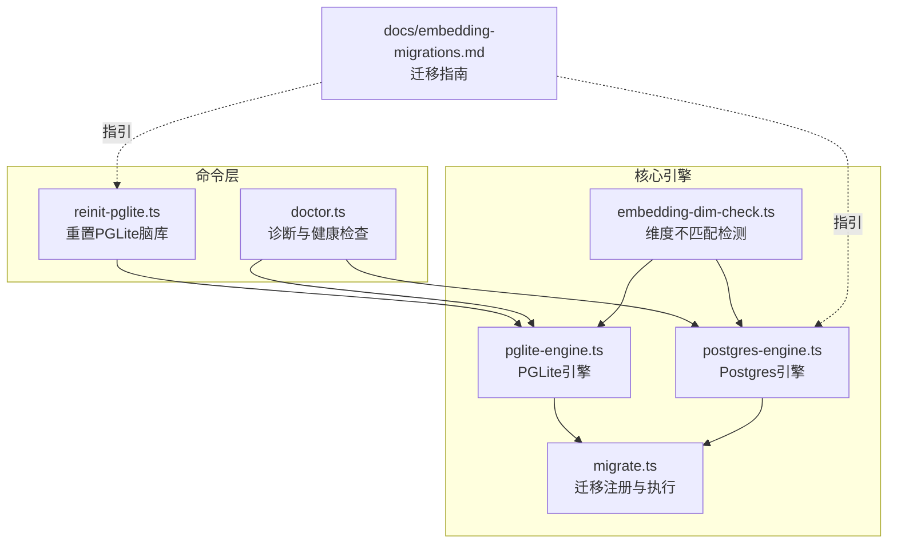
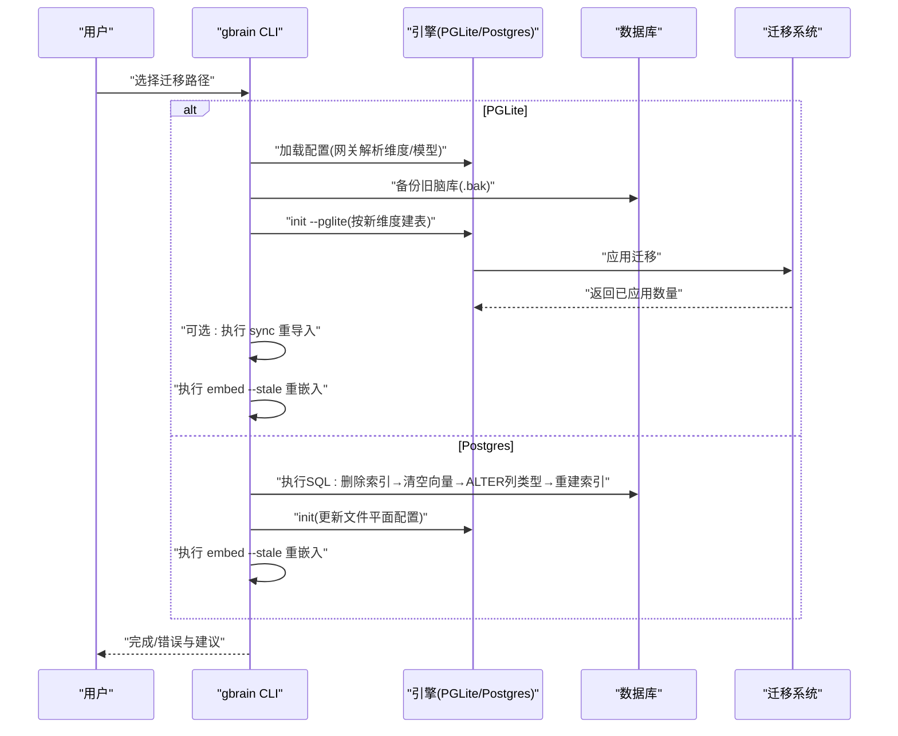
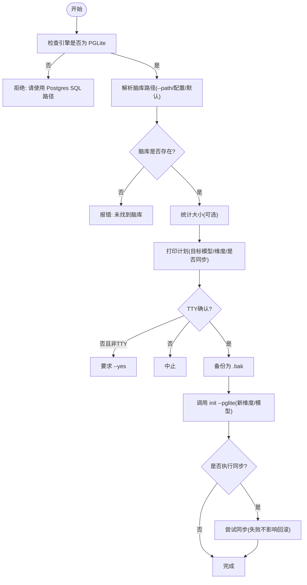
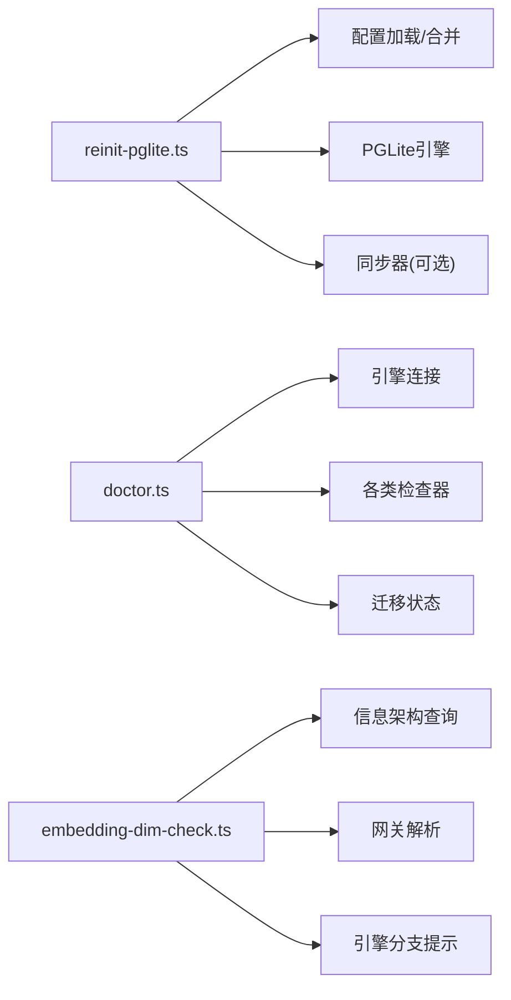

# 迁移与切换

<cite>
**本文引用的文件**
- [embedding-migrations.md](file://docs/embedding-migrations.md)
- [reinit-pglite.ts](file://src/commands/reinit-pglite.ts)
- [doctor.ts](file://src/commands/doctor.ts)
- [pglite-engine.ts](file://src/core/pglite-engine.ts)
- [postgres-engine.ts](file://src/core/postgres-engine.ts)
- [migrate.ts](file://src/core/migrate.ts)
- [embedding-dim-check.ts](file://src/core/embedding-dim-check.ts)
- [v0.37_fix_wave.serial.test.ts](file://test/v0_37_fix_wave.serial.test.ts)
- [fresh-install-pglite.test.ts](file://test/e2e/fresh-install-pglite.test.ts)
- [mechanical.test.ts](file://test/mechanical.test.ts)
</cite>

## 目录
1. [简介](#简介)
2. [项目结构](#项目结构)
3. [核心组件](#核心组件)
4. [架构总览](#架构总览)
5. [详细组件分析](#详细组件分析)
6. [依赖关系分析](#依赖关系分析)
7. [性能考量](#性能考量)
8. [故障排查指南](#故障排查指南)
9. [结论](#结论)
10. [附录](#附录)

## 简介
本文件面向在现有知识库上进行嵌入提供商迁移与切换的技术人员，系统性阐述以下内容：
- 在现有知识库上切换嵌入提供商（或维度）的完整流程与注意事项
- PGLite 与 Postgres 两种数据库后端的差异化迁移路径
- reinit-pglite 命令的详细用法、参数与行为
- SQL 迁移脚本的执行步骤与注意事项
- doctor 命令的诊断能力与修复建议
- 完整的迁移检查清单与回滚策略
- 迁移过程中的数据完整性保障与性能影响评估

## 项目结构
围绕“嵌入迁移”的关键代码分布在如下模块：
- 文档：docs/embedding-migrations.md 提供迁移背景、差异对比与操作指引
- 命令行：src/commands/reinit-pglite.ts 实现一键重置 PGLite 脑库；src/commands/doctor.ts 提供诊断与健康检查
- 引擎层：src/core/pglite-engine.ts 与 src/core/postgres-engine.ts 分别实现 PGLite 与 Postgres 的初始化、模式与迁移
- 核心逻辑：src/core/migrate.ts 定义迁移注册表与运行机制；src/core/embedding-dim-check.ts 提供维度不匹配检测与提示

图示来源
- [reinit-pglite.ts:1-294](file://src/commands/reinit-pglite.ts#L1-L294)
- [doctor.ts:1-800](file://src/commands/doctor.ts#L1-L800)
- [pglite-engine.ts:1-800](file://src/core/pglite-engine.ts#L1-L800)
- [postgres-engine.ts:1-800](file://src/core/postgres-engine.ts#L1-L800)
- [migrate.ts:1-800](file://src/core/migrate.ts#L1-L800)
- [embedding-dim-check.ts:1-708](file://src/core/embedding-dim-check.ts#L1-L708)
- [embedding-migrations.md:1-185](file://docs/embedding-migrations.md#L1-L185)

章节来源
- [embedding-migrations.md:1-185](file://docs/embedding-migrations.md#L1-L185)
- [reinit-pglite.ts:1-294](file://src/commands/reinit-pglite.ts#L1-L294)
- [doctor.ts:1-800](file://src/commands/doctor.ts#L1-L800)
- [pglite-engine.ts:1-800](file://src/core/pglite-engine.ts#L1-L800)
- [postgres-engine.ts:1-800](file://src/core/postgres-engine.ts#L1-L800)
- [migrate.ts:1-800](file://src/core/migrate.ts#L1-L800)
- [embedding-dim-check.ts:1-708](file://src/core/embedding-dim-check.ts#L1-L708)

## 核心组件
- reinit-pglite 命令：对 PGLite 脑库执行“擦除 + 重新初始化 + 可选重同步”的一次性操作，用于在不破坏 Postgres 数据的前提下快速切换嵌入模型/维度
- doctor 命令：对当前连接的数据库执行全面健康检查，包括模式版本、索引状态、队列健康、同步失败、嵌入维度一致性等，并输出可操作的修复建议
- PGLite/Postgres 引擎：负责根据网关配置解析嵌入维度与模型，生成对应引擎的模式（含向量列尺寸），并在初始化时自动应用迁移
- 迁移系统：集中管理版本化迁移，确保模式演进与数据一致性
- 维度不匹配检测：在初始化、医生检查与嵌入写入前，检测 content_chunks.embedding 列的实际宽度与请求宽度是否一致，必要时给出明确的修复路径

章节来源
- [reinit-pglite.ts:1-294](file://src/commands/reinit-pglite.ts#L1-L294)
- [doctor.ts:1-800](file://src/commands/doctor.ts#L1-L800)
- [pglite-engine.ts:356-388](file://src/core/pglite-engine.ts#L356-L388)
- [postgres-engine.ts:273-359](file://src/core/postgres-engine.ts#L273-L359)
- [migrate.ts:1-800](file://src/core/migrate.ts#L1-L800)
- [embedding-dim-check.ts:1-234](file://src/core/embedding-dim-check.ts#L1-L234)

## 架构总览
下图展示“切换嵌入提供商/维度”的总体流程，涵盖 PGLite 与 Postgres 的不同路径。

图示来源
- [embedding-migrations.md:54-152](file://docs/embedding-migrations.md#L54-L152)
- [pglite-engine.ts:356-388](file://src/core/pglite-engine.ts#L356-L388)
- [postgres-engine.ts:273-359](file://src/core/postgres-engine.ts#L273-L359)
- [migrate.ts:1-800](file://src/core/migrate.ts#L1-L800)

## 详细组件分析

### PGLite 脑库重置与切换（reinit-pglite）
- 功能定位：针对 PGLite 脑库的一键“擦除 + 初始化 + 同步”流程，避免直接 ALTER vector 列类型（WASM 不支持）
- 关键行为
  - 仅允许在 PGLite 引擎上运行；若检测到 Postgres 引擎则拒绝并引导至 SQL 路径
  - 自动备份现有脑库目录为 .bak，防止误删
  - 通过 init 流程以新维度/模型重建模式，保留其他配置项
  - 可选跳过同步（--no-sync），便于后续手动控制
  - 支持 JSON 输出（--json），便于自动化集成
  - 非交互环境需显式 --yes 以确认销毁
- 参数说明
  - --embedding-model <provider:model>：必填，目标嵌入模型
  - --embedding-dimensions <N>：必填，目标维度数
  - --path <path>：可选，覆盖默认脑库路径
  - --yes/-y：非交互确认
  - --no-sync：跳过同步阶段
  - --json：结构化输出
- 失败处理
  - 若 .bak 已存在则拒绝覆盖，保护上次回滚目标
  - 备份失败、同步失败等场景会打印警告但不中断整体流程

图示来源
- [reinit-pglite.ts:34-196](file://src/commands/reinit-pglite.ts#L34-L196)

章节来源
- [reinit-pglite.ts:1-294](file://src/commands/reinit-pglite.ts#L1-L294)
- [v0.37_fix_wave.serial.test.ts:282-320](file://test/v0_37_fix_wave.serial.test.ts#L282-L320)

### Postgres SQL 路径（ALTER 列类型）
- 适用场景：需要在 Postgres 上原地变更向量列维度
- 步骤
  - 删除 HNSW 索引（ALTER 前必须删除）
  - 清空 embedding 与 embedded_at（pgvector 不接受跨维度转换）
  - ALTER COLUMN TYPE vector(新维度)
  - 条件重建索引（≤2000 维可用 HNSW；超过则走精确扫描）
  - 重新初始化配置（文件平面），再执行 embed --stale
- 注意事项
  - 跨维度 ALTER 会阻塞写入，建议在维护窗口执行
  - 索引重建可能耗时较长，需评估性能影响
  - 重嵌入成本与体量成正比，需预留 API 调用预算

章节来源
- [embedding-migrations.md:107-152](file://docs/embedding-migrations.md#L107-L152)
- [postgres-engine.ts:273-359](file://src/core/postgres-engine.ts#L273-L359)

### doctor 诊断与修复建议
- 诊断范围
  - 连接与页数统计
  - 模式版本与迁移楔形状态
  - 脑健康评分
  - 同步失败与多源漂移
  - 队列健康（Postgres）
  - 嵌入维度一致性（embedding_width_consistency）
  - 其他专项检查（链接提取滞后、reranker 健康、子代理健康等）
- 修复建议
  - 对于维度不一致：根据 doctor 输出与 embedding-migrations.md 提示，选择 reinit-pglite 或 Postgres SQL 路径
  - 对于迁移楔形：按提示执行 apply-migrations --force-retry 或 --yes
  - 对于同步失败：按提示执行 sync --skip-failed 或修复源状态
- 输出格式
  - 支持 --json 输出结构化报告，便于自动化消费

章节来源
- [doctor.ts:1-800](file://src/commands/doctor.ts#L1-L800)
- [mechanical.test.ts:1256-1279](file://test/mechanical.test.ts#L1256-L1279)

### 维度不匹配检测与提示
- 触发点
  - init 时解析 PGLite 模式维度
  - doctor 的 embedding_width_consistency 检查
  - 嵌入写入前的预检
- 行为
  - 读取 content_chunks.embedding 实际宽度
  - 对比请求宽度与模型，输出一致/不一致提示
  - PGLite 分支：推荐 reinit-pglite；Postgres 分支：输出 SQL 修复脚本
- 例外
  - 同维度模型切换：无需 ALTER，直接重嵌入签名漂移页面
  - 配置延迟设置（--no-embedding）：需先启用嵌入再初始化

章节来源
- [embedding-dim-check.ts:1-234](file://src/core/embedding-dim-check.ts#L1-L234)
- [pglite-engine.ts:356-388](file://src/core/pglite-engine.ts#L356-L388)
- [fresh-install-pglite.test.ts:90-155](file://test/e2e/fresh-install-pglite.test.ts#L90-L155)

### 迁移系统与模式演进
- 迁移注册表
  - 每个迁移包含版本号、名称、SQL 与处理器函数
  - 支持引擎特定 SQL（如 Postgres 使用 CONCURRENTLY）
  - 支持幂等性声明与验证钩子
- 运行机制
  - initSchema 时自动应用未执行的迁移
  - 迁移失败时回滚并重试，直至成功或达到最大尝试次数
  - 验证钩子用于检测部分执行导致的模式漂移

章节来源
- [migrate.ts:1-800](file://src/core/migrate.ts#L1-L800)
- [pglite-engine.ts:356-388](file://src/core/pglite-engine.ts#L356-L388)
- [postgres-engine.ts:273-359](file://src/core/postgres-engine.ts#L273-L359)

## 依赖关系分析
- reinit-pglite 依赖
  - 配置加载与合并（保留原有配置）
  - PGLite 引擎初始化（按新维度重建模式）
  - 可选同步器（重导入脑库）
- doctor 依赖
  - 引擎连接与统计
  - 多类检查器（同步失败、队列健康、维度一致性等）
  - 迁移状态与版本信息
- 维度检测依赖
  - 信息架构查询获取列类型
  - 网关解析模型与维度
  - 针对不同引擎的分支提示

图示来源
- [reinit-pglite.ts:1-294](file://src/commands/reinit-pglite.ts#L1-L294)
- [doctor.ts:1-800](file://src/commands/doctor.ts#L1-L800)
- [embedding-dim-check.ts:1-234](file://src/core/embedding-dim-check.ts#L1-L234)

章节来源
- [reinit-pglite.ts:1-294](file://src/commands/reinit-pglite.ts#L1-L294)
- [doctor.ts:1-800](file://src/commands/doctor.ts#L1-L800)
- [embedding-dim-check.ts:1-234](file://src/core/embedding-dim-check.ts#L1-L234)

## 性能考量
- PGLite
  - 重置流程涉及磁盘 IO 与重嵌入，建议在低峰时段执行
  - 重嵌入成本与页数规模线性相关，需预留时间与 API 费用
- Postgres
  - ALTER 列类型与重建索引期间写入阻塞，建议维护窗口
  - 索引重建时间与数据量、维度数相关，需评估 SLA
- doctor
  - 多数检查为轻量 SQL 查询，对生产影响较小
  - 链接提取滞后、队列健康等检查可能涉及全表扫描，建议在低负载时段运行

[本节为通用指导，不直接分析具体文件]

## 故障排查指南
- 常见问题与定位
  - 维度不一致：doctor 报告 embedding_width_consistency 失败；根据提示选择 reinit-pglite 或 Postgres SQL
  - 迁移楔形：doctor 报告 min/max 版本半安装；执行 apply-migrations --force-retry 或 --yes
  - 同步失败：doctor 报告 unresolved sync failure；执行 sync --skip-failed 或修复源状态
  - 队列停滞（Postgres）：doctor 报告 queue_health；执行 jobs cancel/retry
- 回滚策略
  - PGLite：mv <path>.bak <path> 恢复
  - Postgres：基于备份恢复（由数据库侧策略决定）
- 诊断工具
  - doctor --json 获取结构化报告
  - doctor --remediation-plan 生成修复清单
  - doctor --remediate 自动修复可自动修复的问题

章节来源
- [doctor.ts:1-800](file://src/commands/doctor.ts#L1-L800)
- [embedding-migrations.md:168-178](file://docs/embedding-migrations.md#L168-L178)

## 结论
- 当目标为 PGLite 时，优先使用 reinit-pglite 一键重置，避免无法 ALTER 列类型的限制
- 当目标为 Postgres 时，遵循 SQL 路径：删除索引→清空向量→ALTER 列类型→重建索引
- 在执行前务必使用 doctor 进行健康检查，识别潜在风险（迁移楔形、同步失败、队列健康、维度不一致）
- 制定回滚策略与维护窗口，确保业务连续性与数据完整性

[本节为总结性内容，不直接分析具体文件]

## 附录

### 迁移检查清单
- PGLite
  - 确认当前引擎为 PGLite（否则改用 Postgres SQL 路径）
  - 备份脑库为 .bak（不可覆盖已有 .bak）
  - 记录当前配置（模型/维度/路径）
  - 执行 reinit-pglite（可选 --no-sync）
  - 如未执行同步，后续执行 sync 并 embed --stale
- Postgres
  - 准备维护窗口
  - 执行 SQL：删除索引→清空向量→ALTER 列类型→重建索引
  - 重新初始化配置（文件平面）
  - 执行 embed --stale
- 通用
  - doctor --fast 与 doctor 确认无重大健康问题
  - 记录迁移前后指标（页数、索引状态、队列健康）

章节来源
- [embedding-migrations.md:54-152](file://docs/embedding-migrations.md#L54-L152)
- [reinit-pglite.ts:1-294](file://src/commands/reinit-pglite.ts#L1-L294)
- [doctor.ts:1-800](file://src/commands/doctor.ts#L1-L800)