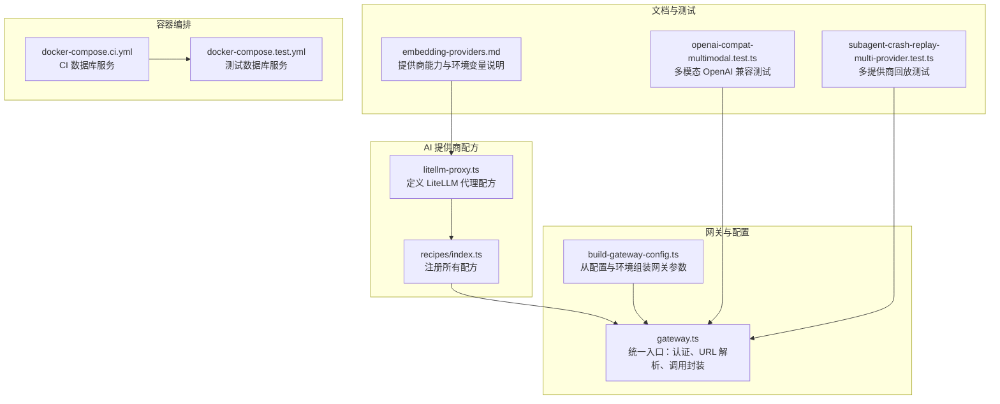
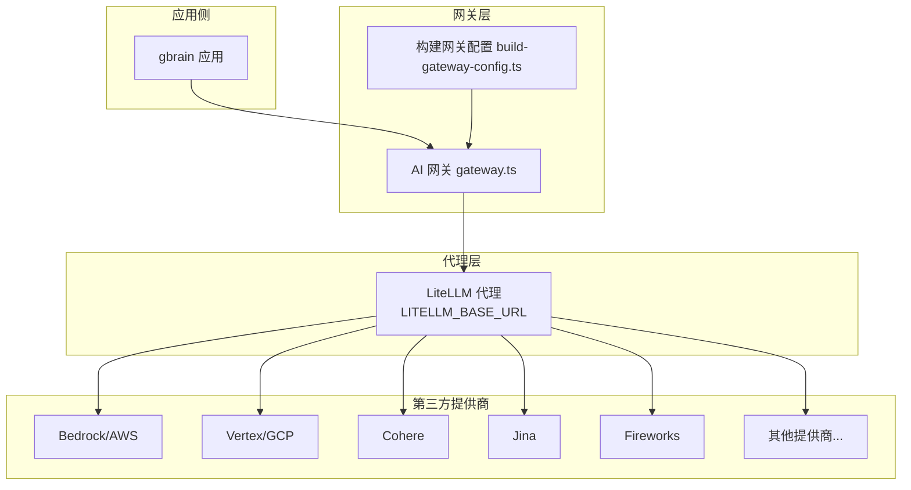
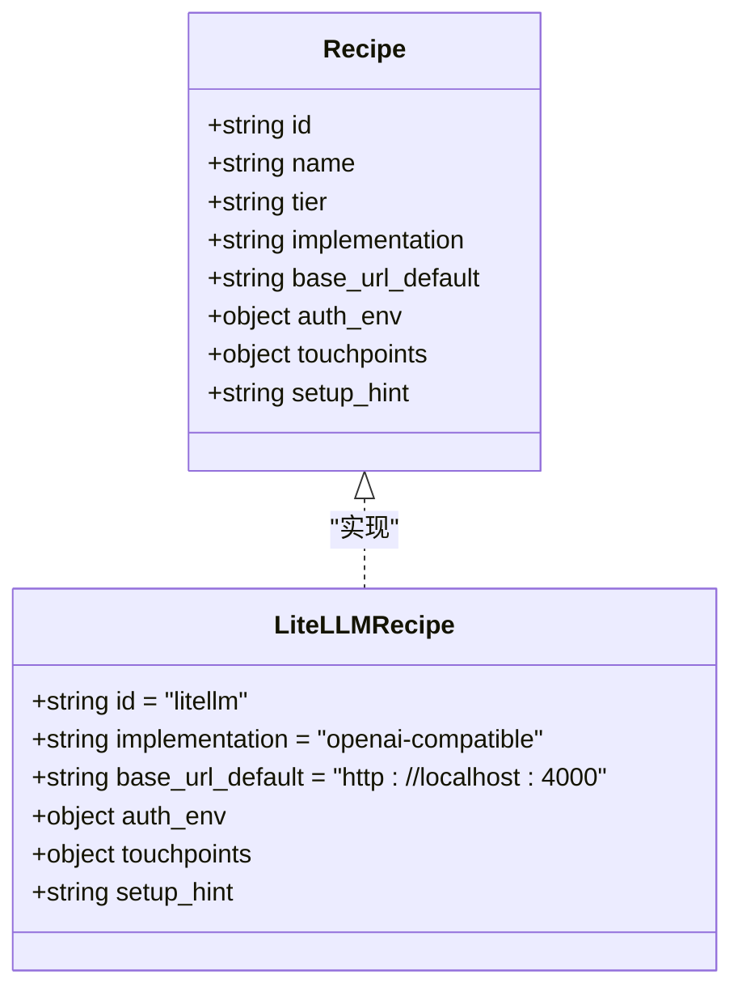
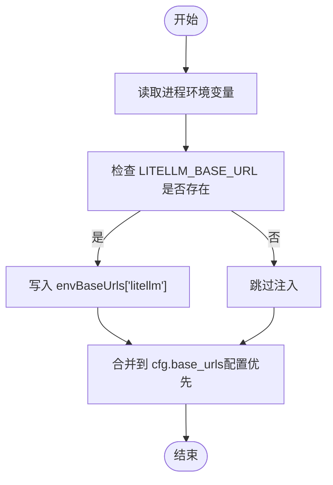
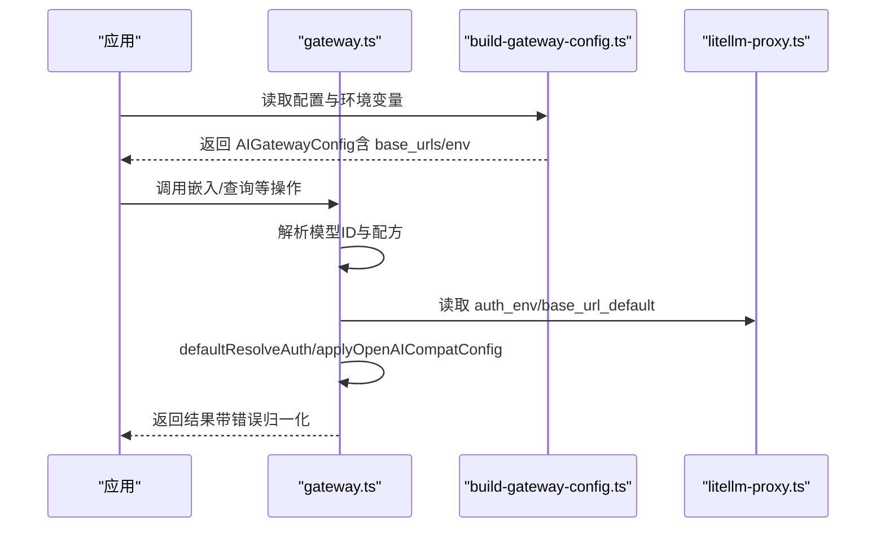
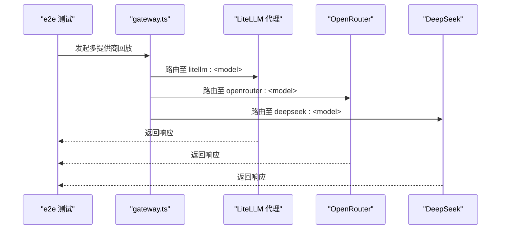
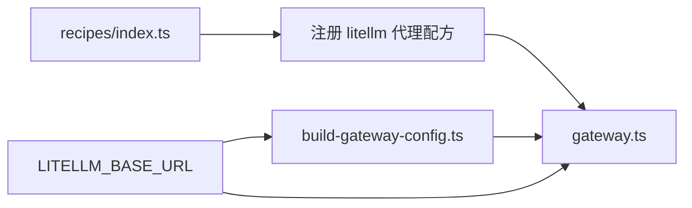

# 通用代理提供商

<cite>
**本文引用的文件**
- [src/core/ai/recipes/litellm-proxy.ts](file://src/core/ai/recipes/litellm-proxy.ts)
- [src/core/ai/recipes/index.ts](file://src/core/ai/recipes/index.ts)
- [src/core/ai/build-gateway-config.ts](file://src/core/ai/build-gateway-config.ts)
- [src/core/ai/gateway.ts](file://src/core/ai/gateway.ts)
- [docs/integrations/embedding-providers.md](file://docs/integrations/embedding-providers.md)
- [docker-compose.ci.yml](file://docker-compose.ci.yml)
- [docker-compose.test.yml](file://docker-compose.test.yml)
- [test/e2e/subagent-crash-replay-multi-provider.test.ts](file://test/e2e/subagent-crash-replay-multi-provider.test.ts)
- [test/openai-compat-multimodal.test.ts](file://test/openai-compat-multimodal.test.ts)
- [CHANGELOG.md](file://CHANGELOG.md)
</cite>

## 目录
1. [简介](#简介)
2. [项目结构](#项目结构)
3. [核心组件](#核心组件)
4. [架构总览](#架构总览)
5. [详细组件分析](#详细组件分析)
6. [依赖关系分析](#依赖关系分析)
7. [性能考虑](#性能考虑)
8. [故障排除指南](#故障排除指南)
9. [结论](#结论)
10. [附录](#附录)

## 简介
本文件面向在 gbrain 中使用通用代理提供商 LiteLLM 的工程师与运维人员，系统性阐述 LiteLLM 代理的作用、优势与集成方式，并给出安装、配置、路由与故障排除的实操指引。LiteLLM 在本项目中扮演“通用 escape hatch”的角色：通过在本地或边缘运行 LiteLLM 代理，将任意第三方 AI 提供商（如 Bedrock、Vertex、Cohere、Jina、Fireworks 等）统一为 OpenAI 兼容接口，从而让 gbrain 以一致的方式进行嵌入向量生成与多模态处理。

LiteLLM 的关键价值在于：
- 统一接口：屏蔽不同提供商的差异，统一走 OpenAI 兼容的 /embeddings 等端点。
- 快速接入：无需为每个新提供商编写适配层，只需在 LiteLLM 配置中声明后即可被 gbrain 使用。
- 多模态支持：在 LiteLLM 前置代理可转发到支持多模态的上游（如 OpenAI、Gemini），并由 gbrain 的 OpenAI 兼容路径统一处理。
- 可观测与治理：通过 LiteLLM 的日志、限流与路由策略，便于在企业内网中进行合规与成本控制。

## 项目结构
围绕 LiteLLM 的集成，gbrain 的相关模块主要分布在以下位置：
- 提供商配方注册与识别：src/core/ai/recipes/*
- 网关配置构建与路由：src/core/ai/build-gateway-config.ts、src/core/ai/gateway.ts
- 文档与示例：docs/integrations/embedding-providers.md
- 测试用例：test/openai-compat-multimodal.test.ts、test/e2e/subagent-crash-replay-multi-provider.test.ts
- 容器化样例：docker-compose.ci.yml、docker-compose.test.yml

**图示来源**
- [src/core/ai/recipes/litellm-proxy.ts:1-46](file://src/core/ai/recipes/litellm-proxy.ts#L1-L46)
- [src/core/ai/recipes/index.ts:1-56](file://src/core/ai/recipes/index.ts#L1-L56)
- [src/core/ai/build-gateway-config.ts:1-67](file://src/core/ai/build-gateway-config.ts#L1-L67)
- [src/core/ai/gateway.ts:1-800](file://src/core/ai/gateway.ts#L1-L800)
- [docs/integrations/embedding-providers.md:1-188](file://docs/integrations/embedding-providers.md#L1-L188)
- [test/openai-compat-multimodal.test.ts:33-141](file://test/openai-compat-multimodal.test.ts#L33-L141)
- [test/e2e/subagent-crash-replay-multi-provider.test.ts:130-164](file://test/e2e/subagent-crash-replay-multi-provider.test.ts#L130-L164)
- [docker-compose.ci.yml:1-154](file://docker-compose.ci.yml#L1-L154)
- [docker-compose.test.yml:1-15](file://docker-compose.test.yml#L1-L15)

**章节来源**
- [src/core/ai/recipes/litellm-proxy.ts:1-46](file://src/core/ai/recipes/litellm-proxy.ts#L1-L46)
- [src/core/ai/recipes/index.ts:1-56](file://src/core/ai/recipes/index.ts#L1-L56)
- [src/core/ai/build-gateway-config.ts:1-67](file://src/core/ai/build-gateway-config.ts#L1-L67)
- [src/core/ai/gateway.ts:1-800](file://src/core/ai/gateway.ts#L1-L800)
- [docs/integrations/embedding-providers.md:1-188](file://docs/integrations/embedding-providers.md#L1-L188)
- [docker-compose.ci.yml:1-154](file://docker-compose.ci.yml#L1-L154)
- [docker-compose.test.yml:1-15](file://docker-compose.test.yml#L1-L15)

## 核心组件
- LiteLLM 代理配方（litellm-proxy.ts）
  - 类型：OpenAI 兼容实现
  - 默认基础 URL：本地 4000 端口
  - 认证：可选 LITELLM_API_KEY；未设置时可无认证运行
  - 触点：仅嵌入（embedding），不声明具体模型列表，需用户显式提供
  - 多模态：支持通过 OpenAI 兼容路径传入图像内容数组
  - 批处理容量：动态取决于上游代理目标，不设静态上限
- 网关配置构建（build-gateway-config.ts）
  - 将进程环境中的 LITELLM_BASE_URL 注入到网关 base_urls 映射，确保探测与实际请求命中同一端口
  - 同时处理其他本地服务器（如 llama-server、ollama、lmstudio）的基础 URL 注入
- 网关统一入口（gateway.ts）
  - 负责解析模型 ID、选择配方、注入认证头、拼装 OpenAI 兼容 baseURL、执行批量分片与超时控制
  - 对 OpenAI 兼容配方采用统一的 createOpenAICompatible 客户端
  - 提供诊断函数用于定位嵌入不可用的具体原因（如未配置模型、未知提供商、缺少环境变量等）

**章节来源**
- [src/core/ai/recipes/litellm-proxy.ts:11-45](file://src/core/ai/recipes/litellm-proxy.ts#L11-L45)
- [src/core/ai/build-gateway-config.ts:44-66](file://src/core/ai/build-gateway-config.ts#L44-L66)
- [src/core/ai/gateway.ts:270-390](file://src/core/ai/gateway.ts#L270-L390)

## 架构总览
下图展示了 gbrain 如何通过 LiteLLM 代理对接任意第三方提供商，并最终统一走 OpenAI 兼容接口完成嵌入生成：

**图示来源**
- [src/core/ai/gateway.ts:392-425](file://src/core/ai/gateway.ts#L392-L425)
- [src/core/ai/build-gateway-config.ts:52-54](file://src/core/ai/build-gateway-config.ts#L52-L54)
- [src/core/ai/recipes/litellm-proxy.ts:16-21](file://src/core/ai/recipes/litellm-proxy.ts#L16-L21)

## 详细组件分析

### LiteLLM 代理配方（litellm-proxy.ts）
- 设计要点
  - 实现类型为 openai-compatible，确保与 gbrain 的 OpenAI 兼容路径无缝衔接
  - 不预置模型列表，要求用户在初始化时显式提供 --embedding-model litellm:<model> 与 --embedding-dimensions <N>
  - 支持多模态输入（图像 base64 数组），通过相同的 /embeddings 端点传输
  - 批处理上限不固定，取决于上游代理所连接的提供商与实例配置
- 适用场景
  - 当前清单中未覆盖的提供商（如 Bedrock、Vertex、Cohere、Jina、Fireworks 等）
  - 需要快速试用新提供商而无需等待官方配方上线

**图示来源**
- [src/core/ai/recipes/litellm-proxy.ts:11-45](file://src/core/ai/recipes/litellm-proxy.ts#L11-L45)

**章节来源**
- [src/core/ai/recipes/litellm-proxy.ts:11-45](file://src/core/ai/recipes/litellm-proxy.ts#L11-L45)

### 网关配置构建（build-gateway-config.ts）
- 关键行为
  - 将 LITELLM_BASE_URL 注入到 cfg.base_urls 中，确保探测与实际流量命中同一地址
  - 其他本地服务器（llama-server、ollama、lmstudio、openrouter）的基础 URL 同样注入
  - 进程环境优先级高于配置文件字段，保证启动脚本或守护进程能正确传递自定义端口
- 与 LiteLLM 的关系
  - 通过 envBaseUrls['litellm'] = LITELLM_BASE_URL，使 gateway.applyOpenAICompatConfig 能解析到正确的 baseURL

**图示来源**
- [src/core/ai/build-gateway-config.ts:44-66](file://src/core/ai/build-gateway-config.ts#L44-L66)

**章节来源**
- [src/core/ai/build-gateway-config.ts:44-66](file://src/core/ai/build-gateway-config.ts#L44-L66)

### 网关统一入口（gateway.ts）
- 认证与 URL 解析
  - defaultResolveAuth：对无要求的配方返回 "unauthenticated" 或从可选环境变量中取值
  - applyOpenAICompatConfig：优先使用 cfg.base_urls[recipe.id]，否则回退到配方默认值
- 诊断与可用性
  - diagnoseEmbedding：针对嵌入触点输出精确的不可用原因（如未配置模型、未知提供商、缺少环境变量等）
  - isAvailable：根据当前配置判断某触点是否可用
- OpenAI 兼容路径
  - 对于 openai-compatible 配方，统一通过 createOpenAICompatible 客户端发起请求
  - 对多模态输入，通过相同 /embeddings 端点传输图像内容数组

**图示来源**
- [src/core/ai/gateway.ts:270-390](file://src/core/ai/gateway.ts#L270-L390)
- [src/core/ai/build-gateway-config.ts:56-66](file://src/core/ai/build-gateway-config.ts#L56-L66)
- [src/core/ai/recipes/litellm-proxy.ts:17-21](file://src/core/ai/recipes/litellm-proxy.ts#L17-L21)

**章节来源**
- [src/core/ai/gateway.ts:270-390](file://src/core/ai/gateway.ts#L270-L390)
- [src/core/ai/gateway.ts:653-742](file://src/core/ai/gateway.ts#L653-L742)

### 多提供商与回放测试（e2e）
- 测试覆盖
  - 子代理回放多提供商场景，验证 LiteLLM 与其他提供商（如 OpenRouter、DeepSeek）在同一计划内的协同工作
  - 多模态 OpenAI 兼容测试，验证 LiteLLM 代理在未携带 API Key 时仍可正常工作（代理可本地无认证）

**图示来源**
- [test/e2e/subagent-crash-replay-multi-provider.test.ts:130-164](file://test/e2e/subagent-crash-replay-multi-provider.test.ts#L130-L164)
- [test/openai-compat-multimodal.test.ts:93-141](file://test/openai-compat-multimodal.test.ts#L93-L141)

**章节来源**
- [test/e2e/subagent-crash-replay-multi-provider.test.ts:130-164](file://test/e2e/subagent-crash-replay-multi-provider.test.ts#L130-L164)
- [test/openai-compat-multimodal.test.ts:93-141](file://test/openai-compat-multimodal.test.ts#L93-L141)

## 依赖关系分析
- 配方注册
  - litellm-proxy.ts 通过 recipes/index.ts 注册为可用配方之一，参与全局模型解析与路由
- 网关装配
  - build-gateway-config.ts 将 LITELLM_BASE_URL 注入 base_urls，gateway.ts 在运行时读取该映射
- 运行时解析
  - gateway.ts 在每次调用前解析模型 ID、配方与认证信息，再通过 OpenAI 兼容客户端发起请求

**图示来源**
- [src/core/ai/recipes/index.ts:14-34](file://src/core/ai/recipes/index.ts#L14-L34)
- [src/core/ai/build-gateway-config.ts:52-54](file://src/core/ai/build-gateway-config.ts#L52-L54)
- [src/core/ai/gateway.ts:375-390](file://src/core/ai/gateway.ts#L375-L390)

**章节来源**
- [src/core/ai/recipes/index.ts:14-34](file://src/core/ai/recipes/index.ts#L14-L34)
- [src/core/ai/build-gateway-config.ts:52-54](file://src/core/ai/build-gateway-config.ts#L52-L54)
- [src/core/ai/gateway.ts:375-390](file://src/core/ai/gateway.ts#L375-L390)

## 性能考虑
- 批处理与分片
  - LiteLLM 代理的批处理上限取决于其后端提供商与实例配置，不设静态上限；gateway.ts 会基于各配方的 max_batch_tokens 进行递归分片，避免单次请求过大导致失败
- 超时与重试
  - 网关层为聊天、嵌入与多模态请求设置了默认超时时间，防止长时间挂起阻塞线程
- 多模态输入
  - 通过 OpenAI 兼容端点传输图像内容数组，注意控制每条记录的大小与数量，避免超出上游限制

[本节为通用指导，不直接分析特定文件]

## 故障排除指南
- 嵌入不可用诊断
  - 使用 diagnoseEmbedding 输出的精确原因定位问题：如未配置模型、未知提供商、缺少环境变量等
- 常见问题
  - 未设置 LITELLM_BASE_URL：请在启动时或环境变量中设置 LITELLM_BASE_URL 指向 LiteLLM 代理地址
  - 未提供嵌入模型与维度：对于 litellm 代理配方，需显式提供 --embedding-model litellm:<model> 与 --embedding-dimensions <N>
  - 代理未认证但 gbrain 期望密钥：LiteLLM 代理可本地无认证运行；若上游提供商需要密钥，请在 LiteLLM 配置中注入
- 回放与多提供商
  - 若子代理回放出现异常，检查 LiteLLM 代理与上游提供商的连通性与模型可用性

**章节来源**
- [src/core/ai/gateway.ts:653-742](file://src/core/ai/gateway.ts#L653-L742)
- [src/core/ai/recipes/litellm-proxy.ts:25-27](file://src/core/ai/recipes/litellm-proxy.ts#L25-L27)
- [test/openai-compat-multimodal.test.ts:93-141](file://test/openai-compat-multimodal.test.ts#L93-L141)

## 结论
LiteLLM 代理为 gbrain 提供了强大的通用 escape hatch，能够在不改动上层逻辑的前提下快速接入 100+ 提供商，并通过 OpenAI 兼容接口实现统一的嵌入与多模态处理。结合网关层的认证、URL 解析、诊断与超时控制，LiteLLM 既降低了集成成本，又提升了可观测性与稳定性。建议在企业环境中配合 LiteLLM 的路由与限流策略，实现合规与成本可控的多提供商混合使用。

[本节为总结性内容，不直接分析特定文件]

## 附录

### 安装与配置步骤（概览）
- 运行 LiteLLM 代理
  - 参考官方文档启动 LiteLLM 代理，并将其暴露在本地或内网可访问的地址
- 设置环境变量
  - LITELLM_BASE_URL：指向 LiteLLM 代理地址（例如 http://localhost:4000）
  - LITELLM_API_KEY：可选，若代理启用了鉴权则需提供
- 初始化 gbrain
  - 使用 --embedding-model litellm:<your-model-id> 与 --embedding-dimensions <N> 指定模型与维度
- 验证
  - 运行提供商测试命令，确认嵌入可用且维度匹配

**章节来源**
- [docs/integrations/embedding-providers.md:152-156](file://docs/integrations/embedding-providers.md#L152-L156)
- [src/core/ai/recipes/litellm-proxy.ts:16-21](file://src/core/ai/recipes/litellm-proxy.ts#L16-L21)
- [src/core/ai/build-gateway-config.ts:52-54](file://src/core/ai/build-gateway-config.ts#L52-L54)

### Docker 部署参考
- 仓库提供了 CI 与测试用的 docker-compose 示例，可用于本地快速搭建数据库与运行环境
- 建议将 LiteLLM 代理作为独立服务加入 compose 文件，并通过 LITELLM_BASE_URL 指向其地址

**章节来源**
- [docker-compose.ci.yml:1-154](file://docker-compose.ci.yml#L1-L154)
- [docker-compose.test.yml:1-15](file://docker-compose.test.yml#L1-L15)

### 与直接提供商的成本与复杂度对比
- 成本
  - 直接提供商通常按调用次数或 token 数计费，价格透明但受单一供应商影响
  - 通过 LiteLLM 代理可在企业内部统一计费与预算，结合路由策略实现跨供应商比价与切换
- 复杂度
  - 直接提供商：每个新提供商需要单独适配、维护与升级
  - LiteLLM 代理：集中管理，新增提供商只需在代理配置中声明，减少上层改造成本
- 合规与可观测性
  - 代理层可统一接入审计、限流与路由策略，便于满足企业合规要求

[本节为通用指导，不直接分析特定文件]