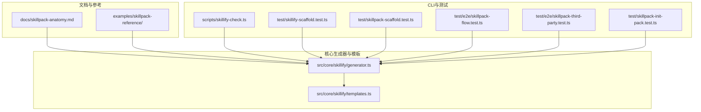
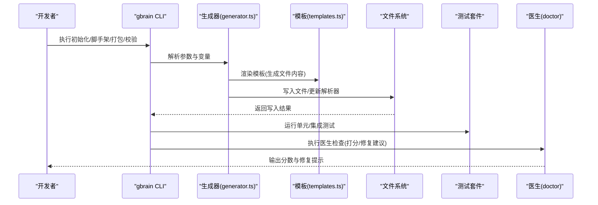
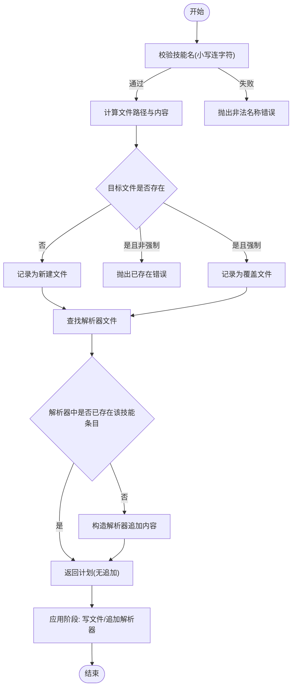
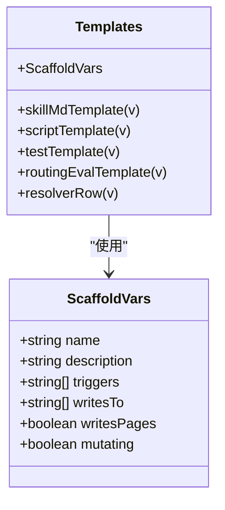
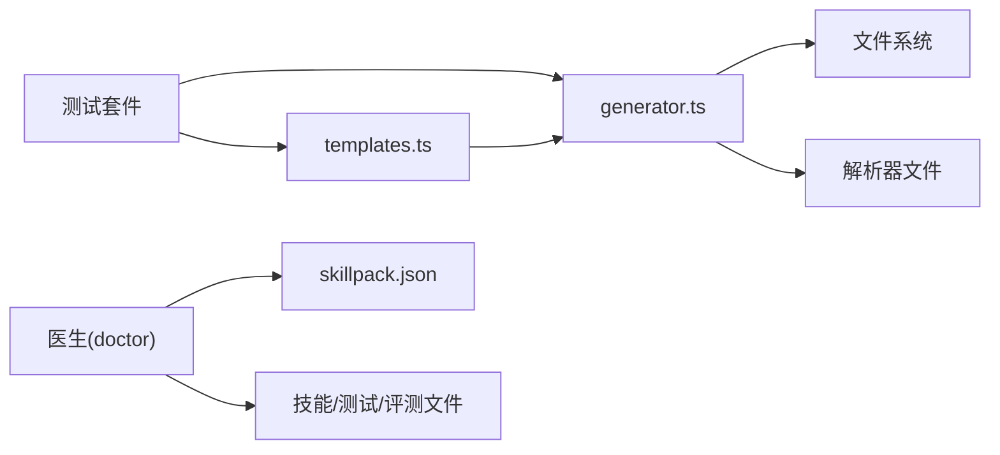

# 技能包创建

<cite>
**本文引用的文件**
- [README.md](file://README.md)
- [docs/GBRAIN_SKILLPACK.md](file://docs/GBRAIN_SKILLPACK.md)
- [docs/skillpack-anatomy.md](file://docs/skillpack-anatomy.md)
- [examples/skillpack-reference/README.md](file://examples/skillpack-reference/README.md)
- [examples/skillpack-reference/skillpack.json](file://examples/skillpack-reference/skillpack.json)
- [src/core/skillify/generator.ts](file://src/core/skillify/generator.ts)
- [src/core/skillify/templates.ts](file://src/core/skillify/templates.ts)
- [scripts/skillify-check.ts](file://scripts/skillify-check.ts)
- [test/skillify-scaffold.test.ts](file://test/skillify-scaffold.test.ts)
- [test/skillpack-scaffold.test.ts](file://test/skillpack-scaffold.test.ts)
- [test/e2e/skillpack-flow.test.ts](file://test/e2e/skillpack-flow.test.ts)
- [test/e2e/skillpack-third-party.test.ts](file://test/e2e/skillpack-third-party.test.ts)
- [test/skillpack-init-pack.test.ts](file://test/skillpack-init-pack.test.ts)
</cite>

## 目录
1. [简介](#简介)
2. [项目结构](#项目结构)
3. [核心组件](#核心组件)
4. [架构总览](#架构总览)
5. [详细组件分析](#详细组件分析)
6. [依赖关系分析](#依赖关系分析)
7. [性能考量](#性能考量)
8. [故障排查指南](#故障排查指南)
9. [结论](#结论)
10. [附录](#附录)

## 简介
本文件面向“技能包（Skillpack）”的创建与发布流程，系统化阐述以下主题：
- 技能包脚手架（Scaffold）的生成机制与模板系统
- 技能包初始化流程：目录结构、配置文件、依赖项与清单
- 技能包项目组织结构与命名约定
- 元数据配置、许可证管理与版本控制设置
- 自动化工具与 CLI 命令使用方法
- 本地开发环境搭建与配置验证

技能包是第三方可发布的“技能集合”，由清单文件、技能 Markdown、路由评估、测试与运行手册等组成；其创建与发布路径在仓库中提供了完整的端到端示例与测试保障。

## 项目结构
技能包相关能力主要分布在如下位置：
- 文档与参考：docs/skillpack-anatomy.md、examples/skillpack-reference/
- 核心生成器与模板：src/core/skillify/*
- CLI 辅助与测试：scripts/skillify-check.ts、test/* 对应的脚手架与技能包测试
- README 提供总体 CLI 使用入口与安装说明

图表来源
- [docs/skillpack-anatomy.md:1-113](file://docs/skillpack-anatomy.md#L1-L113)
- [examples/skillpack-reference/README.md:1-68](file://examples/skillpack-reference/README.md#L1-L68)
- [src/core/skillify/generator.ts:1-193](file://src/core/skillify/generator.ts#L1-L193)
- [src/core/skillify/templates.ts:1-197](file://src/core/skillify/templates.ts#L1-L197)
- [scripts/skillify-check.ts:1-14](file://scripts/skillify-check.ts#L1-L14)

章节来源
- [docs/skillpack-anatomy.md:1-113](file://docs/skillpack-anatomy.md#L1-L113)
- [examples/skillpack-reference/README.md:1-68](file://examples/skillpack-reference/README.md#L1-L68)
- [README.md:119-128](file://README.md#L119-L128)

## 核心组件
- 脚手架生成器（generator.ts）
  - 规划阶段：根据变量构建待写入文件列表与解析器追加内容，支持强制覆盖与幂等性
  - 应用阶段：按规划执行文件写入与解析器追加
- 模板系统（templates.ts）
  - 提供 SKILL.md、脚本、测试、路由评估等模板字符串
  - 包含“占位符”标记，用于审计与质量门禁
- 参考技能包（examples/skillpack-reference/）
  - 完整的第三方技能包树形布局与清单样例
- CLI 辅助（scripts/skillify-check.ts）
  - 旧版命令到新版命令的薄层桥接，确保兼容性
- 测试套件
  - 单元与端到端测试覆盖脚手架生成、幂等性、强制覆盖、解析器追加等关键行为

章节来源
- [src/core/skillify/generator.ts:1-193](file://src/core/skillify/generator.ts#L1-L193)
- [src/core/skillify/templates.ts:1-197](file://src/core/skillify/templates.ts#L1-L197)
- [examples/skillpack-reference/README.md:1-68](file://examples/skillpack-reference/README.md#L1-L68)
- [scripts/skillify-check.ts:1-14](file://scripts/skillify-check.ts#L1-L14)
- [test/skillify-scaffold.test.ts:1-448](file://test/skillify-scaffold.test.ts#L1-L448)
- [test/skillpack-scaffold.test.ts:65-168](file://test/skillpack-scaffold.test.ts#L65-L168)
- [test/e2e/skillpack-flow.test.ts:65-76](file://test/e2e/skillpack-flow.test.ts#L65-L76)
- [test/e2e/skillpack-third-party.test.ts:60-82](file://test/e2e/skillpack-third-party.test.ts#L60-L82)
- [test/skillpack-init-pack.test.ts:72-100](file://test/skillpack-init-pack.test.ts#L72-L100)

## 架构总览
技能包创建从“初始化—生成—校验—打包—发布”的闭环展开，CLI 作为入口，生成器与模板负责落地文件，测试与医生（doctor）保证质量门槛。

图表来源
- [src/core/skillify/generator.ts:66-116](file://src/core/skillify/generator.ts#L66-L116)
- [src/core/skillify/templates.ts:31-196](file://src/core/skillify/templates.ts#L31-L196)
- [test/skillify-scaffold.test.ts:120-136](file://test/skillify-scaffold.test.ts#L120-L136)
- [test/e2e/skillpack-flow.test.ts:66-72](file://test/e2e/skillpack-flow.test.ts#L66-L72)
- [docs/skillpack-anatomy.md:51-82](file://docs/skillpack-anatomy.md#L51-L82)

## 详细组件分析

### 组件A：脚手架生成器（generator.ts）
- 功能要点
  - 输入：目标 skills 目录、变量集（名称、描述、触发词、写入目录、是否变更、是否写页）
  - 幂等性：检测解析器中是否已存在该技能条目，避免重复追加
  - 强制覆盖：仅对脚手架文件生效，不破坏用户已有内容
  - 错误类型：名称非法、文件已存在、解析器缺失、写入失败
- 关键流程
  - 名称校验（小写连字符）
  - 计算文件路径与内容
  - 解析器追加：若不存在“未分类”段落则创建，否则直接追加一行
  - 应用阶段：逐文件写入，必要时追加解析器内容

图表来源
- [src/core/skillify/generator.ts:66-116](file://src/core/skillify/generator.ts#L66-L116)
- [src/core/skillify/generator.ts:130-148](file://src/core/skillify/generator.ts#L130-L148)
- [src/core/skillify/generator.ts:179-190](file://src/core/skillify/generator.ts#L179-L190)

章节来源
- [src/core/skillify/generator.ts:45-59](file://src/core/skillify/generator.ts#L45-L59)
- [src/core/skillify/generator.ts:66-116](file://src/core/skillify/generator.ts#L66-L116)
- [src/core/skillify/generator.ts:130-148](file://src/core/skillify/generator.ts#L130-L148)
- [src/core/skillify/generator.ts:179-190](file://src/core/skillify/generator.ts#L179-L190)

### 组件B：模板系统（templates.ts）
- 模板类型
  - SKILL.md：包含前端字段（名称、版本、描述、触发词、可选写页/变更标记、正文大纲）
  - 脚本模板：带“占位符”标记的最小可运行脚本骨架
  - 测试模板：基于 bun:test 的最小测试骨架
  - 路由评估模板：默认生成若干意图样本，便于路由评估
  - 解析器行模板：在“未分类”段落下插入表格行
- 占位符与审计
  - “占位符”用于在严格模式下拦截未替换的脚手架实现，防止空桩进入生产

图表来源
- [src/core/skillify/templates.ts:16-29](file://src/core/skillify/templates.ts#L16-L29)
- [src/core/skillify/templates.ts:31-120](file://src/core/skillify/templates.ts#L31-L120)
- [src/core/skillify/templates.ts:122-144](file://src/core/skillify/templates.ts#L122-L144)
- [src/core/skillify/templates.ts:146-164](file://src/core/skillify/templates.ts#L146-L164)
- [src/core/skillify/templates.ts:177-196](file://src/core/skillify/templates.ts#L177-L196)

章节来源
- [src/core/skillify/templates.ts:14-14](file://src/core/skillify/templates.ts#L14-L14)
- [src/core/skillify/templates.ts:31-120](file://src/core/skillify/templates.ts#L31-L120)
- [src/core/skillify/templates.ts:122-144](file://src/core/skillify/templates.ts#L122-L144)
- [src/core/skillify/templates.ts:146-164](file://src/core/skillify/templates.ts#L146-L164)
- [src/core/skillify/templates.ts:177-196](file://src/core/skillify/templates.ts#L177-L196)

### 组件C：参考技能包与清单（examples/skillpack-reference/）
- 结构与清单
  - skillpack.json：声明 API 版本、名称、版本、描述、作者、许可证、主页、最低兼容版本、技能列表、运行手册、变更日志、测试与评测路径等
  - skills/<slug>/：每个技能包含 SKILL.md 与路由评估文件
  - runbooks/bootstrap.md：安装后展示的引导说明（非自动执行）
  - test/、e2e/、evals/：测试与评测配置
- 用途
  - 作为第三方技能包的“10/10 参考模板”，可一键脚手架并立即通过快速医生检查

章节来源
- [examples/skillpack-reference/README.md:13-68](file://examples/skillpack-reference/README.md#L13-L68)
- [examples/skillpack-reference/skillpack.json:1-30](file://examples/skillpack-reference/skillpack.json#L1-L30)

### 组件D：CLI 与桥接（scripts/skillify-check.ts）
- 作用
  - 将旧命令形式（如 scripts/skillify-check.ts）桥接到新命令（如 gbrain skillify check），保持历史调用可用
- 影响
  - 保证现有测试与文档中的调用方式仍可工作，同时鼓励迁移到新的 CLI 子命令

章节来源
- [scripts/skillify-check.ts:1-14](file://scripts/skillify-check.ts#L1-L14)

### 组件E：测试与端到端验证
- 单元测试（skillify-scaffold.test.ts）
  - 验证脚手架计划与应用的幂等性、强制覆盖、解析器追加逻辑、占位符标记等
- 技能包脚手架测试（skillpack-scaffold.test.ts）
  - 验证消费者侧“脚手架到工作区”的复制行为、共享依赖保留、二次脚手架跳过等
- 端到端测试（skillpack-flow.test.ts、skillpack-third-party.test.ts）
  - 验证“脚手架—医生—打包—产物校验”的完整流程
- 初始化测试（skillpack-init-pack.test.ts）
  - 验证初始化脚手架的树形结构、干跑不写入、无效名称拒绝等

章节来源
- [test/skillify-scaffold.test.ts:120-136](file://test/skillify-scaffold.test.ts#L120-L136)
- [test/skillpack-scaffold.test.ts:91-168](file://test/skillpack-scaffold.test.ts#L91-L168)
- [test/e2e/skillpack-flow.test.ts:65-76](file://test/e2e/skillpack-flow.test.ts#L65-L76)
- [test/e2e/skillpack-third-party.test.ts:60-82](file://test/e2e/skillpack-third-party.test.ts#L60-L82)
- [test/skillpack-init-pack.test.ts:72-100](file://test/skillpack-init-pack.test.ts#L72-L100)

## 依赖关系分析
- 生成器依赖模板系统输出纯字符串，再由应用阶段写入文件系统
- 解析器追加依赖解析器文件的存在与内容形态（段落与表格）
- 测试覆盖生成器与模板的关键分支，确保错误处理与幂等性
- 医生检查依据清单与文件结构进行二值维度评分

图表来源
- [src/core/skillify/generator.ts:15-23](file://src/core/skillify/generator.ts#L15-L23)
- [src/core/skillify/templates.ts:31-196](file://src/core/skillify/templates.ts#L31-L196)
- [docs/skillpack-anatomy.md:51-82](file://docs/skillpack-anatomy.md#L51-L82)

章节来源
- [src/core/skillify/generator.ts:15-23](file://src/core/skillify/generator.ts#L15-L23)
- [src/core/skillify/templates.ts:31-196](file://src/core/skillify/templates.ts#L31-L196)
- [docs/skillpack-anatomy.md:51-82](file://docs/skillpack-anatomy.md#L51-L82)

## 性能考量
- 文件写入与解析器追加均为本地 I/O，规模以技能包内文件数量计，通常开销可忽略
- 幂等性与存在性检查避免重复写入，减少不必要的磁盘操作
- 测试驱动的快速反馈可在本地尽早发现结构性问题，降低后续返工成本

## 故障排查指南
- 名称不合法
  - 现象：初始化或脚手架时报错，提示名称需为小写连字符
  - 处理：修正名称后重试
- 文件已存在
  - 现象：目标文件已存在且未启用强制覆盖
  - 处理：启用强制覆盖或手动编辑既有文件
- 解析器缺失
  - 现象：无法追加解析器行
  - 处理：在 skills 目录或上层目录创建解析器文件后再重试
- 医生检查未通过
  - 现象：核心维度或徽章未满足要求
  - 处理：根据医生输出的修复提示补充清单、路由评估、测试、运行手册、许可证与变更日志

章节来源
- [src/core/skillify/generator.ts:47-59](file://src/core/skillify/generator.ts#L47-L59)
- [src/core/skillify/generator.ts:68-73](file://src/core/skillify/generator.ts#L68-L73)
- [src/core/skillify/generator.ts:85-96](file://src/core/skillify/generator.ts#L85-L96)
- [docs/skillpack-anatomy.md:51-82](file://docs/skillpack-anatomy.md#L51-L82)

## 结论
本仓库提供了从“脚手架—生成—校验—打包—发布”的完整技能包创建链路。通过严格的模板与占位符机制、幂等的生成器与详尽的测试覆盖，确保第三方技能包具备可维护性与可发布性。配合医生检查与参考技能包样例，开发者可以快速搭建高质量的技能包并稳定交付。

## 附录

### 技能包项目组织结构与命名约定
- 目录结构
  - skillpack.json：技能包清单
  - skills/<skill-slug>/SKILL.md：技能说明与触发词
  - skills/<skill-slug>/routing-eval.jsonl：路由评估样本
  - runbooks/bootstrap.md：安装后引导说明
  - test/*.test.ts、e2e/*.test.ts：单元与端到端测试
  - evals/*.judge.json：LLM 评测配置
  - CHANGELOG.md、LICENSE、README.md、.gitignore
- 命名约定
  - 技能名：小写连字符（lowercase-kebab-case）
  - 技能目录：skills/<skill-slug>/
  - 清单字段：必须声明 API 版本、名称、版本、描述、作者、许可证、主页、最低兼容版本、技能列表、运行手册、变更日志、测试与评测路径等

章节来源
- [docs/skillpack-anatomy.md:8-35](file://docs/skillpack-anatomy.md#L8-L35)
- [examples/skillpack-reference/README.md:32-53](file://examples/skillpack-reference/README.md#L32-L53)
- [examples/skillpack-reference/skillpack.json:1-30](file://examples/skillpack-reference/skillpack.json#L1-L30)

### 元数据配置、许可证管理与版本控制
- 元数据配置
  - 清单字段涵盖 API 版本、名称、版本、描述、作者、许可证、主页、最低兼容版本、技能列表、运行手册、变更日志、测试与评测路径
- 许可证管理
  - 在根目录提供与 SPDX 兼容的许可证文本文件
- 版本控制
  - 使用 Keep-a-Changelog 格式的变更日志，随版本更新

章节来源
- [examples/skillpack-reference/skillpack.json:1-30](file://examples/skillpack-reference/skillpack.json#L1-L30)
- [examples/skillpack-reference/README.md:48-50](file://examples/skillpack-reference/README.md#L48-L50)
- [docs/skillpack-anatomy.md:24-28](file://docs/skillpack-anatomy.md#L24-L28)

### 自动化工具与 CLI 命令使用方法
- 初始化与脚手架
  - gbrain skillpack init <name>：初始化技能包树形结构
  - gbrain skillpack scaffold <source>：将技能包文件复制到目标工作区
- 校验与修复
  - gbrain skillpack doctor <path> [--quick] [--fix --yes]：查看分数与修复建议
- 打包与发布
  - gbrain skillpack pack <path>：生成确定性的压缩包与哈希
- 参考命令
  - gbrain skillpack search / info / registry 等（见文档）

章节来源
- [docs/skillpack-anatomy.md:92-106](file://docs/skillpack-anatomy.md#L92-L106)
- [examples/skillpack-reference/README.md:18-24](file://examples/skillpack-reference/README.md#L18-L24)
- [README.md:119-128](file://README.md#L119-L128)

### 本地开发环境搭建与配置验证
- 开发环境
  - 使用 Bun 运行脚本与测试
  - 通过 gbrain doctor 快速验证清单与文件完整性
- 配置验证
  - 使用测试套件覆盖脚手架生成、幂等性、强制覆盖、解析器追加等场景
  - 参考参考技能包样例确保结构与清单符合要求

章节来源
- [test/skillify-scaffold.test.ts:120-136](file://test/skillify-scaffold.test.ts#L120-L136)
- [test/skillpack-scaffold.test.ts:91-168](file://test/skillpack-scaffold.test.ts#L91-L168)
- [test/e2e/skillpack-flow.test.ts:65-76](file://test/e2e/skillpack-flow.test.ts#L65-L76)
- [docs/skillpack-anatomy.md:51-82](file://docs/skillpack-anatomy.md#L51-L82)