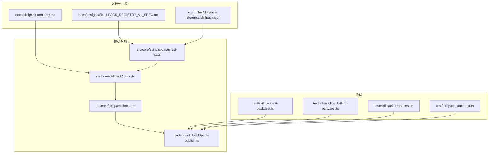
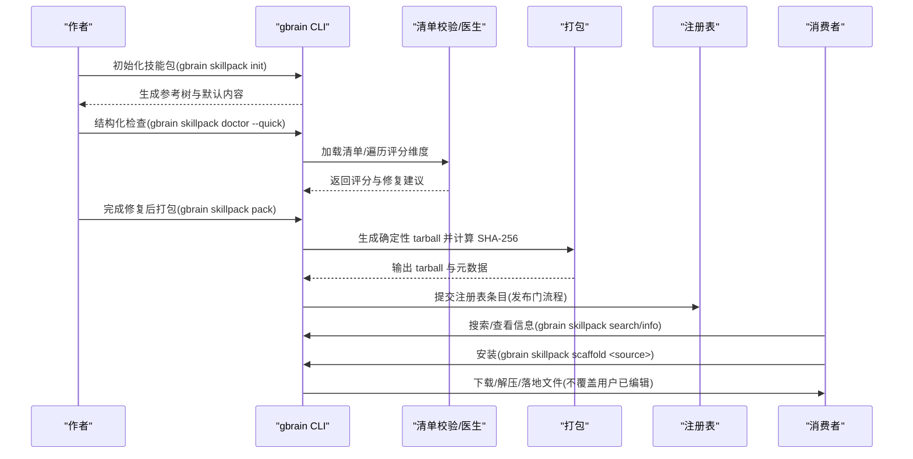
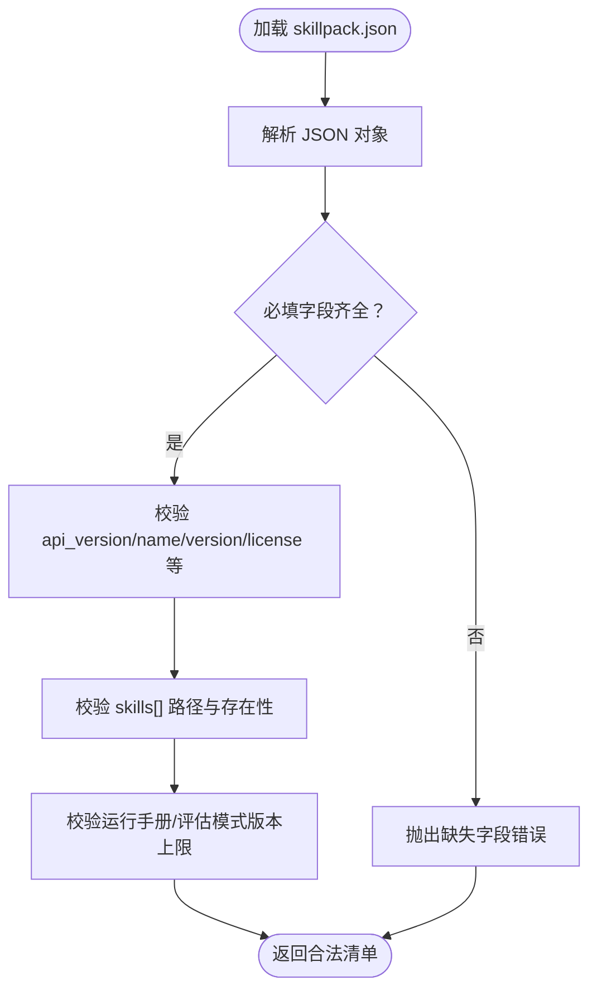
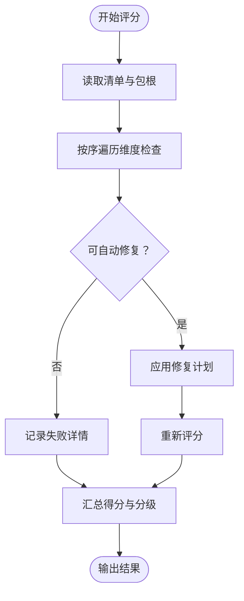
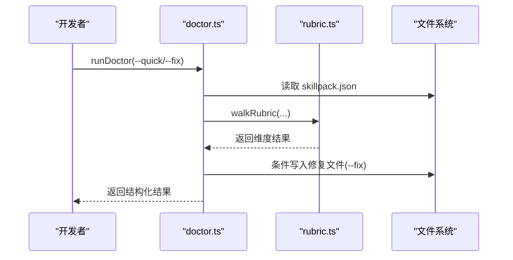
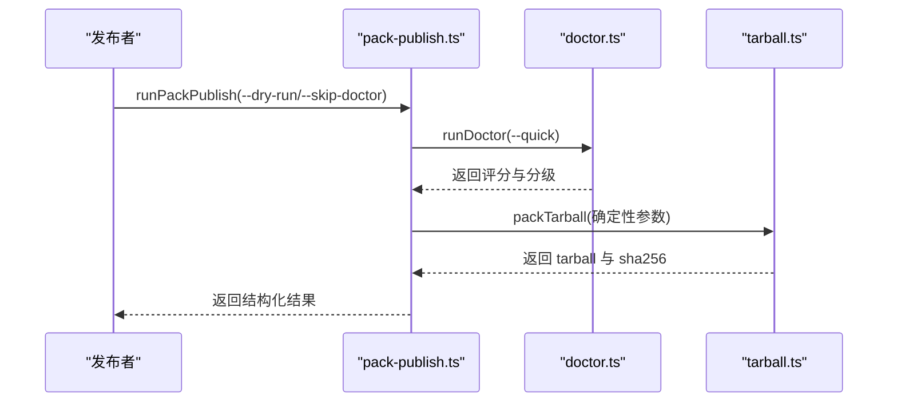
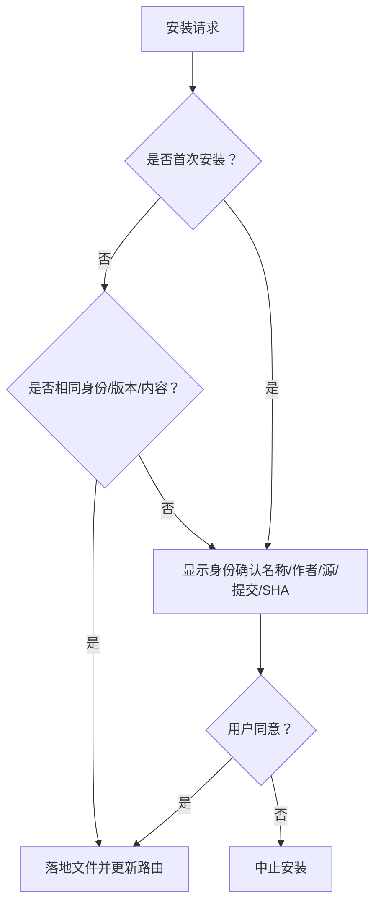
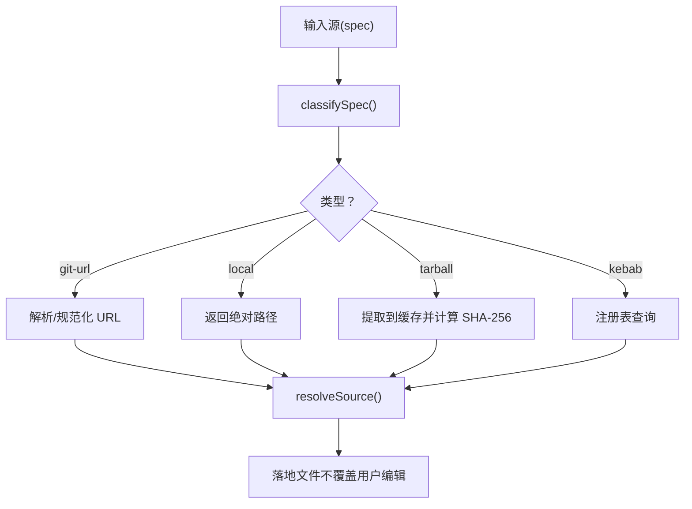
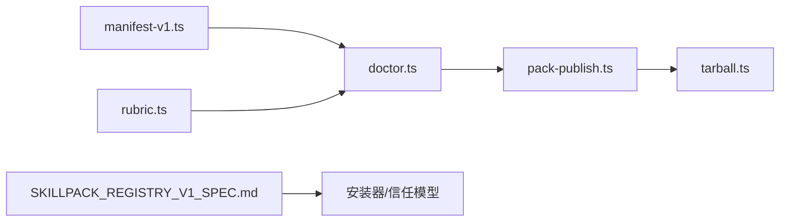

# 技能包管理

<cite>
**本文引用的文件**
- [skillpack-anatomy.md](file://docs/skillpack-anatomy.md)
- [GBRAIN_SKILLPACK.md](file://docs/GBRAIN_SKILLPACK.md)
- [SKILLPACK_REGISTRY_V1_SPEC.md](file://docs/designs/SKILLPACK_REGISTRY_V1_SPEC.md)
- [skillpack.json](file://examples/skillpack-reference/skillpack.json)
- [rubric.ts](file://src/core/skillpack/rubric.ts)
- [manifest-v1.ts](file://src/core/skillpack/manifest-v1.ts)
- [doctor.ts](file://src/core/skillpack/doctor.ts)
- [pack-publish.ts](file://src/core/skillpack/pack-publish.ts)
- [build-skillpack-anatomy.ts](file://scripts/build-skillpack-anatomy.ts)
- [skillpack-install.test.ts](file://test/skillpack-install.test.ts)
- [skillpack-state.test.ts](file://test/skillpack-state.test.ts)
- [post-install-advisory.test.ts](file://test/post-install-advisory.test.ts)
- [skillpack-remote-source.test.ts](file://test/skillpack-remote-source.test.ts)
- [e2e\skillpack-third-party.test.ts](file://test/e2e/skillpack-third-party.test.ts)
- [skillpack-init-pack.test.ts](file://test/skillpack-init-pack.test.ts)
- [skills-conformance.test.ts](file://test/skills-conformance.test.ts)
</cite>

## 目录
1. [简介](#简介)
2. [项目结构](#项目结构)
3. [核心组件](#核心组件)
4. [架构总览](#架构总览)
5. [详细组件分析](#详细组件分析)
6. [依赖分析](#依赖分析)
7. [性能考虑](#性能考虑)
8. [故障排除指南](#故障排除指南)
9. [结论](#结论)
10. [附录](#附录)

## 简介
本文件系统化阐述技能包（SkillPack）管理系统的完整技术方案：从技能包结构与 manifest.json 配置，到创建、安装、升级、卸载流程；覆盖版本管理、兼容性检查、冲突解决；给出打包、签名与发布指南；并提供验证、审计与故障排除方法，以及存储、分发与更新策略。

## 项目结构
技能包系统围绕“参考包”与“规范文档”构建，核心由以下部分组成：
- 参考包示例：examples/skillpack-reference 提供可直接克隆的 10/10 起点
- 规范文档：docs/skillpack-anatomy.md 描述树形结构与评分维度
- 核心实现：src/core/skillpack 下的清单校验、医生评分、打包发布等模块
- 测试用例：test 下覆盖初始化、打包、安装、状态信任、远程源解析等场景
- 设计文档：docs/designs/SKILLPACK_REGISTRY_V1_SPEC.md 定义发布、注册表、安装与信任模型

图表来源
- [skillpack-anatomy.md:1-113](file://docs/skillpack-anatomy.md#L1-L113)
- [SKILLPACK_REGISTRY_V1_SPEC.md:1-800](file://docs/designs/SKILLPACK_REGISTRY_V1_SPEC.md#L1-L800)
- [manifest-v1.ts:1-391](file://src/core/skillpack/manifest-v1.ts#L1-L391)
- [rubric.ts:1-512](file://src/core/skillpack/rubric.ts#L1-L512)
- [doctor.ts:1-364](file://src/core/skillpack/doctor.ts#L1-L364)
- [pack-publish.ts:1-142](file://src/core/skillpack/pack-publish.ts#L1-L142)

章节来源
- [skillpack-anatomy.md:1-113](file://docs/skillpack-anatomy.md#L1-L113)
- [SKILLPACK_REGISTRY_V1_SPEC.md:1-800](file://docs/designs/SKILLPACK_REGISTRY_V1_SPEC.md#L1-L800)

## 核心组件
- 清单校验器（manifest-v1.ts）
  - 校验 skillpack.json 的字段、格式、版本约束与技能目录存在性
  - 支持运行时/评估模式版本前向兼容声明
- 质量评分体系（rubric.ts）
  - 十项二元维度：5项必过核心 + 5项质量徽章
  - 自动生成评分表，支持自动修复提示
- 医生命令（doctor.ts）
  - 快速模式（结构扫描）与全量模式（沙箱执行）两层诊断
  - 支持自动修复可自动化的条目
- 打包发布（pack-publish.ts）
  - 本地验证 + 确定性 tarball 生成 + SHA-256 记录
  - 可跳过医生或仅干跑以适配发布门流程

章节来源
- [manifest-v1.ts:1-391](file://src/core/skillpack/manifest-v1.ts#L1-L391)
- [rubric.ts:1-512](file://src/core/skillpack/rubric.ts#L1-L512)
- [doctor.ts:1-364](file://src/core/skillpack/doctor.ts#L1-L364)
- [pack-publish.ts:1-142](file://src/core/skillpack/pack-publish.ts#L1-L142)

## 架构总览
技能包生命周期分为“作者侧”和“消费者侧”，通过统一的清单、评分与打包流程衔接：

图表来源
- [SKILLPACK_REGISTRY_V1_SPEC.md:1-800](file://docs/designs/SKILLPACK_REGISTRY_V1_SPEC.md#L1-L800)
- [doctor.ts:1-364](file://src/core/skillpack/doctor.ts#L1-L364)
- [pack-publish.ts:1-142](file://src/core/skillpack/pack-publish.ts#L1-L142)

## 详细组件分析

### 组件A：清单与版本管理（manifest-v1.ts）
- 字段与约束
  - 必填字段：api_version、name、version、description、author、license、homepage、gbrain_min_version、skills[]
  - 名称与版本采用严格正则与语义化版本校验
  - homepage 必须为 http(s) URL
  - skills[] 必须相对路径且以 skills/ 开头，不得包含路径穿越
- 前向兼容
  - 运行手册与评估模式版本号可声明，安装器按最大支持版本进行拒绝
- 依赖与存在性
  - 校验每个声明的技能目录在磁盘上存在
- 适配与扩展
  - 可选字段：shared_deps、excluded_from_install、runbooks、changelog、brain_resident、schema_pack
  - bundleManifestFromSkillpack 将第三方清单适配为内置包清单形状

图表来源
- [manifest-v1.ts:139-372](file://src/core/skillpack/manifest-v1.ts#L139-L372)

章节来源
- [manifest-v1.ts:1-391](file://src/core/skillpack/manifest-v1.ts#L1-L391)

### 组件B：质量评分与分级（rubric.ts）
- 维度设计
  - 核心（必过）：清单有效、技能均有 SKILL.md 且含必要 frontmatter、路由评估文件存在且数量达标、触发短语唯一、变更日志存在且包含当前版本
  - 徽章（获等级）：单元测试存在、端到端测试存在、LLM 评测存在、引导手册存在、许可证存在
- 自动修复
  - 对可自动修复的维度提供修复建议与脚手架模板
- 分级规则
  - 全部核心通过：blocked/endorsed/community/experimental 四档
  - 依据徽章通过数量决定社区/实验等级

图表来源
- [rubric.ts:449-494](file://src/core/skillpack/rubric.ts#L449-L494)

章节来源
- [rubric.ts:1-512](file://src/core/skillpack/rubric.ts#L1-L512)
- [build-skillpack-anatomy.ts:1-193](file://scripts/build-skillpack-anatomy.ts#L1-L193)

### 组件C：医生命令与自动修复（doctor.ts）
- 模式
  - quick：结构扫描，快速反馈
  - full：预留沙箱执行测试/评测/路由评估（v1 实现为提示）
- 自动修复
  - 针对可自动修复维度生成脚手架文件（路由评估、变更日志、测试、评测、引导手册、许可证）
  - 基于清单修改时间与目标文件修改时间判断是否覆盖
- 审计
  - 记录医生运行事件，便于审计与回溯

图表来源
- [doctor.ts:66-122](file://src/core/skillpack/doctor.ts#L66-L122)
- [rubric.ts:449-494](file://src/core/skillpack/rubric.ts#L449-L494)

章节来源
- [doctor.ts:1-364](file://src/core/skillpack/doctor.ts#L1-L364)

### 组件D：打包与发布（pack-publish.ts）
- 流程
  - 加载清单 → 医生快速检查 → 确定性打包 → 记录审计事件
  - 支持跳过医生（发布门已在服务端执行）与干跑模式
- 输出
  - tarball 路径、SHA-256、层级评级（未知/实验/社区/推荐）

图表来源
- [pack-publish.ts:55-141](file://src/core/skillpack/pack-publish.ts#L55-L141)

章节来源
- [pack-publish.ts:1-142](file://src/core/skillpack/pack-publish.ts#L1-L142)

### 组件E：安装与信任（安装器与状态）
- 安装模型
  - 新版采用“脚手架”模型：一次性添加、不覆盖用户已编辑文件、无托管块
  - 通过 RESOLVER.md/AGENTS.md 管理路由条目
- 信任与重用
  - 通过名称/作者/提交哈希/tarball SHA 进行首次信任确认
  - 后续同源同版本安装跳过确认
- 冲突与重命名
  - 触发短语唯一性由评分保证；命名冲突通过自动后缀处理，但保留触发路由不变

图表来源
- [SKILLPACK_REGISTRY_V1_SPEC.md:201-252](file://docs/designs/SKILLPACK_REGISTRY_V1_SPEC.md#L201-L252)
- [skillpack-state.test.ts:176-263](file://test/skillpack-state.test.ts#L176-L263)

章节来源
- [SKILLPACK_REGISTRY_V1_SPEC.md:1-800](file://docs/designs/SKILLPACK_REGISTRY_V1_SPEC.md#L1-L800)
- [skillpack-install.test.ts:377-417](file://test/skillpack-install.test.ts#L377-L417)
- [post-install-advisory.test.ts:43-85](file://test/post-install-advisory.test.ts#L43-L85)
- [skillpack-state.test.ts:176-263](file://test/skillpack-state.test.ts#L176-L263)

### 组件F：远程源与分发（git/tarball/local）
- 源分类
  - https URL、owner/repo（GitHub）、本地路径、.tgz/.tar.gz、简写名称（需注册表）
- 解析与缓存
  - 本地目录：直接返回绝对路径
  - tarball：提取至缓存目录，记录 SHA-256，命中缓存
  - git：使用安全克隆/拉取（仅 https，禁用子模块与重定向）
- 安装
  - 统一落地到工作区，拒绝覆盖用户已编辑文件

图表来源
- [SKILLPACK_REGISTRY_V1_SPEC.md:101-128](file://docs/designs/SKILLPACK_REGISTRY_V1_SPEC.md#L101-L128)
- [skillpack-remote-source.test.ts:31-81](file://test/skillpack-remote-source.test.ts#L31-L81)

章节来源
- [SKILLPACK_REGISTRY_V1_SPEC.md:1-800](file://docs/designs/SKILLPACK_REGISTRY_V1_SPEC.md#L1-L800)
- [skillpack-remote-source.test.ts:1-185](file://test/skillpack-remote-source.test.ts#L1-L185)

## 依赖分析
- 组件耦合
  - 清单校验器被医生与打包流程共同依赖
  - 医生依赖评分体系与清单加载
  - 打包发布依赖医生与 tarball 工具
  - 注册表规范驱动安装器的信任与展示逻辑
- 外部依赖
  - GNU tar（用于确定性打包）
  - 文件系统与进程环境（用于测试与发布门）

图表来源
- [manifest-v1.ts:1-391](file://src/core/skillpack/manifest-v1.ts#L1-L391)
- [rubric.ts:1-512](file://src/core/skillpack/rubric.ts#L1-L512)
- [doctor.ts:1-364](file://src/core/skillpack/doctor.ts#L1-L364)
- [pack-publish.ts:1-142](file://src/core/skillpack/pack-publish.ts#L1-L142)
- [SKILLPACK_REGISTRY_V1_SPEC.md:1-800](file://docs/designs/SKILLPACK_REGISTRY_V1_SPEC.md#L1-L800)

章节来源
- [manifest-v1.ts:1-391](file://src/core/skillpack/manifest-v1.ts#L1-L391)
- [rubric.ts:1-512](file://src/core/skillpack/rubric.ts#L1-L512)
- [doctor.ts:1-364](file://src/core/skillpack/doctor.ts#L1-L364)
- [pack-publish.ts:1-142](file://src/core/skillpack/pack-publish.ts#L1-L142)
- [SKILLPACK_REGISTRY_V1_SPEC.md:1-800](file://docs/designs/SKILLPACK_REGISTRY_V1_SPEC.md#L1-L800)

## 性能考虑
- 医生快速模式：仅结构扫描，适合迭代阶段高频调用
- 确定性打包：使用 GNU tar 的确定性选项，避免时间戳差异导致的哈希漂移
- 缓存命中：tarball 按 SHA-256 缓存，重复安装可复用缓存
- 并发与锁：安装器具备原子锁与过期检测，避免并发覆盖

## 故障排除指南
- 医生阻断
  - blocked 状态表示核心维度未通过，优先修复清单有效性与技能清单完整性
- 自动修复
  - 使用 doctor --fix 生成路由评估、变更日志、测试、评测、引导手册与许可证
  - 注意：若目标文件比清单更晚修改，将跳过覆盖
- 安装冲突
  - 若触发短语重复，先在评分维度中修正重复项
  - 若命名冲突，系统会自动后缀重命名，但不会影响触发路由
- 注册表与远程源
  - 确认源类型正确（URL/路径/tarball/简写），必要时使用注册表 URL 切换
  - tarball 安装若失败，检查 SHA 是否匹配与缓存是否被篡改

章节来源
- [doctor.ts:164-313](file://src/core/skillpack/doctor.ts#L164-L313)
- [rubric.ts:74-233](file://src/core/skillpack/rubric.ts#L74-L233)
- [skillpack-state.test.ts:176-263](file://test/skillpack-state.test.ts#L176-L263)
- [skillpack-remote-source.test.ts:1-185](file://test/skillpack-remote-source.test.ts#L1-L185)

## 结论
该技能包管理体系以“清单 + 评分 + 医生 + 打包”的闭环为核心，结合注册表与信任模型，实现了从作者创作到消费者安装的全链路治理。通过严格的版本与兼容性控制、自动修复与审计日志，既保障了生态质量，又降低了供应链风险。

## 附录

### 技能包结构与清单字段说明
- 树形结构
  - skillpack.json、skills/<slug>/SKILL.md、skills/<slug>/routing-eval.jsonl、runbooks/bootstrap.md、test/*、e2e/*、evals/*.judge.json、CHANGELOG.md、LICENSE、README.md、.gitignore
- 清单字段要点
  - api_version、name、version、description、author、license、homepage、gbrain_min_version、skills[]、runbooks.bootstrap、unit_tests[]、e2e_tests[]、llm_evals[]、routing_evals[]、changelog

章节来源
- [skillpack-anatomy.md:8-36](file://docs/skillpack-anatomy.md#L8-L36)
- [skillpack.json:1-30](file://examples/skillpack-reference/skillpack.json#L1-L30)
- [manifest-v1.ts:34-96](file://src/core/skillpack/manifest-v1.ts#L34-L96)

### 创建、安装、升级与卸载流程
- 创建
  - 使用 gbrain skillpack init 生成参考树，随后 doctor --quick 与 doctor --fix 逐步完善
- 安装
  - 使用 gbrain skillpack scaffold <source>，系统落地文件并更新路由；首次安装进行身份确认
- 升级
  - 通过注册表或直接源安装新版本；系统根据版本与路由评估进行升级引导
- 卸载
  - 由用户自行删除文件或通过 git 管理；系统不提供自动卸载命令

章节来源
- [SKILLPACK_REGISTRY_V1_SPEC.md:182-252](file://docs/designs/SKILLPACK_REGISTRY_V1_SPEC.md#L182-L252)
- [e2e\skillpack-third-party.test.ts:60-82](file://test/e2e/skillpack-third-party.test.ts#L60-L82)

### 版本管理与兼容性检查
- 语义化版本与最小 gbrain 版本
- 运行手册/评估模式版本上限控制，超限需升级 gbrain
- 变更日志与当前版本一致性检查

章节来源
- [manifest-v1.ts:169-210](file://src/core/skillpack/manifest-v1.ts#L169-L210)
- [manifest-v1.ts:292-328](file://src/core/skillpack/manifest-v1.ts#L292-L328)
- [rubric.ts:212-232](file://src/core/skillpack/rubric.ts#L212-L232)

### 冲突解决机制
- 触发短语唯一性：由评分维度强制要求
- 命名冲突：自动后缀（-2..-99），重命名映射持久化，卸载时按映射清理
- 路由冲突：通过评分与医生提示定位并修正

章节来源
- [rubric.ts:176-204](file://src/core/skillpack/rubric.ts#L176-L204)
- [SKILLPACK_REGISTRY_V1_SPEC.md:777-800](file://docs/designs/SKILLPACK_REGISTRY_V1_SPEC.md#L777-L800)

### 打包、签名与发布指南
- 本地验证
  - doctor --quick 确保 10/10 或至少核心全部通过
- 打包
  - 使用 gbrain skillpack pack 生成确定性 tarball，记录 SHA-256
- 发布
  - 在注册表仓库中提交 catalog 条目与 endorsements，遵循 tier 规则
- 签名
  - 通过 tarball SHA-256 与提交哈希进行内容固定与重用信任

章节来源
- [pack-publish.ts:55-141](file://src/core/skillpack/pack-publish.ts#L55-L141)
- [SKILLPACK_REGISTRY_V1_SPEC.md:270-336](file://docs/designs/SKILLPACK_REGISTRY_V1_SPEC.md#L270-L336)

### 验证、审计与故障排除
- 验证
  - doctor --quick/--full、评分维度、自动修复
- 审计
  - 医生运行事件记录，便于回溯与合规
- 故障排除
  - 核心维度阻断、自动修复、远程源解析、安装覆盖保护

章节来源
- [doctor.ts:113-121](file://src/core/skillpack/doctor.ts#L113-L121)
- [rubric.ts:449-494](file://src/core/skillpack/rubric.ts#L449-L494)
- [skillpack-remote-source.test.ts:83-185](file://test/skillpack-remote-source.test.ts#L83-L185)

### 存储、分发与更新策略
- 存储
  - 技能包作为 git 仓库与 tarball 两种形态；tarball 按 SHA-256 缓存
- 分发
  - git clone/tarball 下发；注册表 catalog 指向源与固定内容
- 更新
  - 通过安装新版本或注册表更新；系统根据版本与路由评估进行升级引导

章节来源
- [SKILLPACK_REGISTRY_V1_SPEC.md:101-128](file://docs/designs/SKILLPACK_REGISTRY_V1_SPEC.md#L101-L128)
- [SKILLPACK_REGISTRY_V1_SPEC.md:129-200](file://docs/designs/SKILLPACK_REGISTRY_V1_SPEC.md#L129-L200)