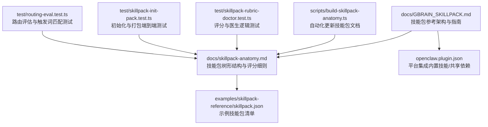
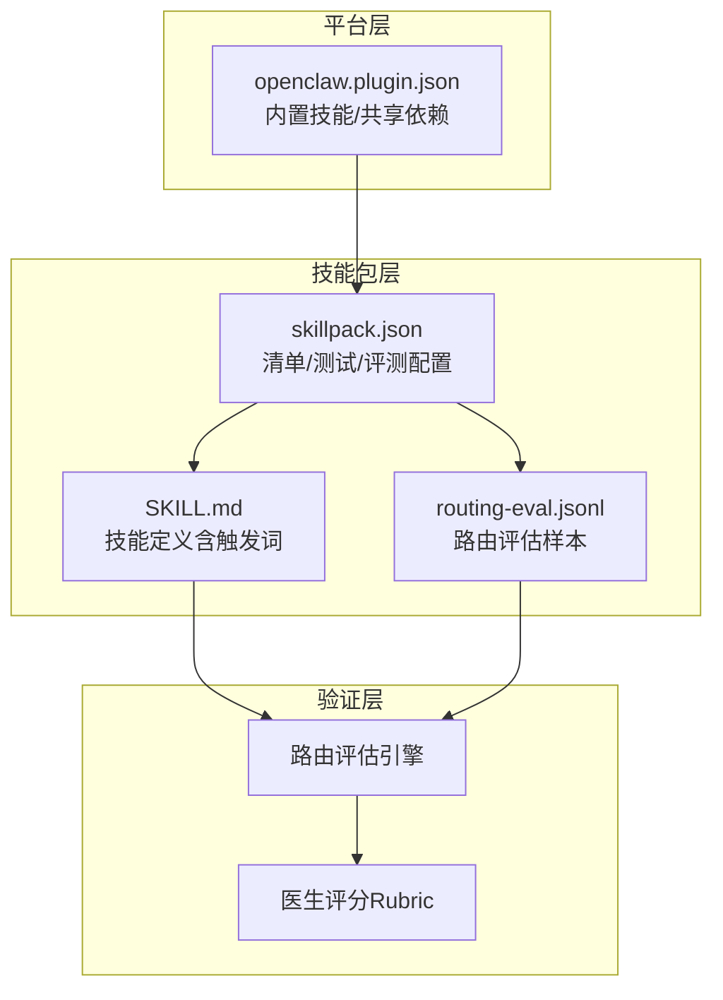
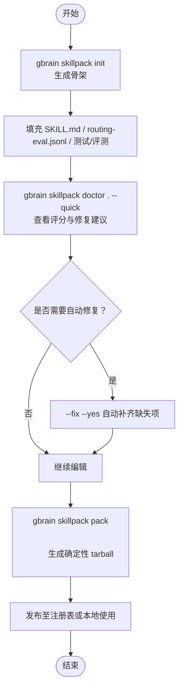
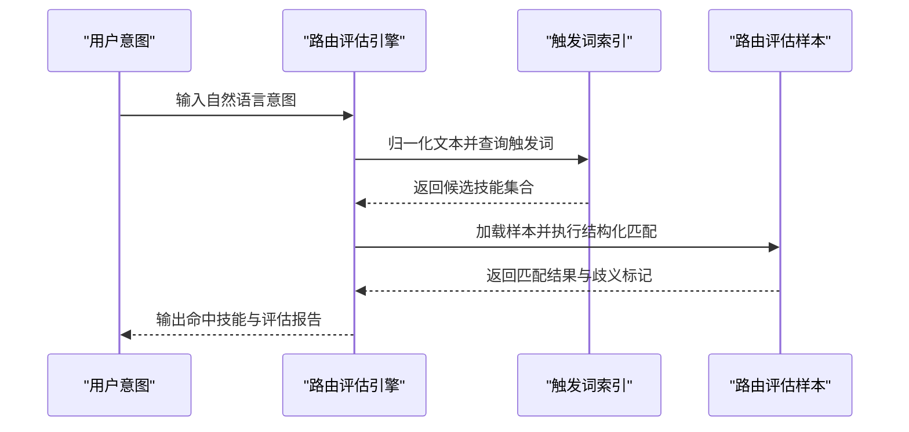
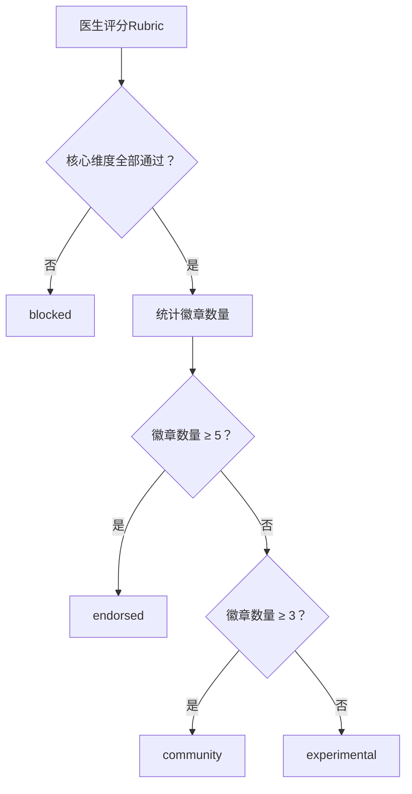
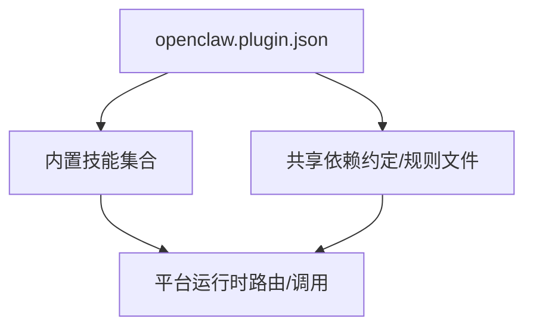
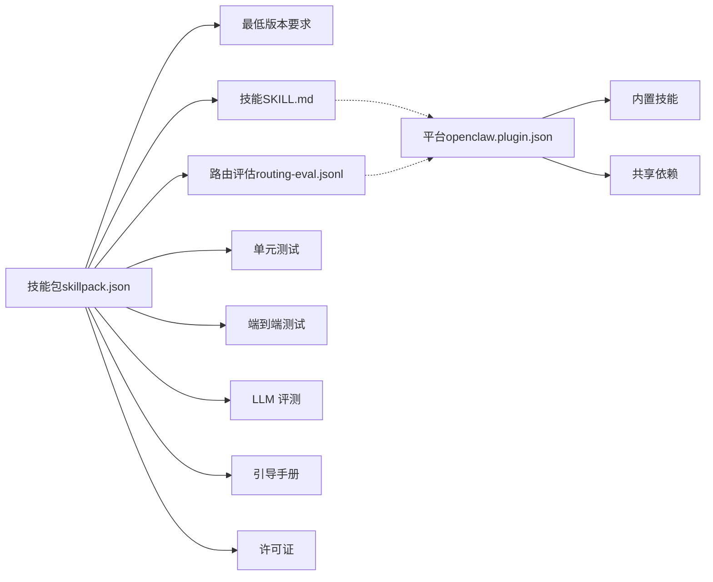

# 插件开发

<cite>
**本文引用的文件**   
- [README.md](file://README.md)
- [docs/GBRAIN_SKILLPACK.md](file://docs/GBRAIN_SKILLPACK.md)
- [docs/skillpack-anatomy.md](file://docs/skillpack-anatomy.md)
- [examples/skillpack-reference/skillpack.json](file://examples/skillpack-reference/skillpack.json)
- [openclaw.plugin.json](file://openclaw.plugin.json)
- [scripts/build-skillpack-anatomy.ts](file://scripts/build-skillpack-anatomy.ts)
- [test/skillpack-rubric-doctor.test.ts](file://test/skillpack-rubric-doctor.test.ts)
- [test/skillpack-init-pack.test.ts](file://test/skillpack-init-pack.test.ts)
- [test/routing-eval.test.ts](file://test/routing-eval.test.ts)
</cite>

## 目录
1. [简介](#简介)
2. [项目结构](#项目结构)
3. [核心组件](#核心组件)
4. [架构总览](#架构总览)
5. [详细组件分析](#详细组件分析)
6. [依赖关系分析](#依赖关系分析)
7. [性能考量](#性能考量)
8. [故障排查指南](#故障排查指南)
9. [结论](#结论)
10. [附录](#附录)

## 简介
本文件面向希望在 GBrain 平台上开发“技能包（SkillPack）”的开发者，系统阐述技能包的架构、工作原理与生命周期管理，覆盖技能定义、路由机制、依赖与版本管理、打包与分发、最佳实践与安全、调试与测试、以及与现有技能的集成与扩展路径。内容基于仓库中的官方文档、示例与测试用例进行归纳总结，帮助读者从模板生成到部署发布形成完整的开发闭环。

## 项目结构
围绕技能包开发的关键目录与文件如下：
- 文档与规范
  - 技能包参考架构与指南：docs/GBRAIN_SKILLPACK.md
  - 技能包树形结构与评分细则：docs/skillpack-anatomy.md
  - 示例技能包清单：examples/skillpack-reference/skillpack.json
- 开发与构建脚本
  - 自动化更新技能包文档的脚本：scripts/build-skillpack-anatomy.ts
- 平台集成
  - OpenClaw 插件声明：openclaw.plugin.json（含内置技能列表、共享依赖等）
- 测试与验证
  - 技能包评分与医生逻辑测试：test/skillpack-rubric-doctor.test.ts
  - 技能包初始化与打包端到端测试：test/skillpack-init-pack.test.ts
  - 路由评估与触发词匹配测试：test/routing-eval.test.ts

**图示来源**
- [docs/GBRAIN_SKILLPACK.md:1-144](file://docs/GBRAIN_SKILLPACK.md#L1-L144)
- [docs/skillpack-anatomy.md:1-113](file://docs/skillpack-anatomy.md#L1-L113)
- [examples/skillpack-reference/skillpack.json:1-30](file://examples/skillpack-reference/skillpack.json#L1-L30)
- [openclaw.plugin.json:1-95](file://openclaw.plugin.json#L1-L95)
- [scripts/build-skillpack-anatomy.ts:1-193](file://scripts/build-skillpack-anatomy.ts#L1-L193)
- [test/skillpack-rubric-doctor.test.ts:1-277](file://test/skillpack-rubric-doctor.test.ts#L1-L277)
- [test/skillpack-init-pack.test.ts:1-173](file://test/skillpack-init-pack.test.ts#L1-L173)
- [test/routing-eval.test.ts:1-372](file://test/routing-eval.test.ts#L1-L372)

**章节来源**
- [README.md:260-268](file://README.md#L260-L268)
- [docs/GBRAIN_SKILLPACK.md:1-144](file://docs/GBRAIN_SKILLPACK.md#L1-L144)
- [docs/skillpack-anatomy.md:1-113](file://docs/skillpack-anatomy.md#L1-L113)
- [examples/skillpack-reference/skillpack.json:1-30](file://examples/skillpack-reference/skillpack.json#L1-L30)
- [openclaw.plugin.json:1-95](file://openclaw.plugin.json#L1-L95)
- [scripts/build-skillpack-anatomy.ts:1-193](file://scripts/build-skillpack-anatomy.ts#L1-L193)
- [test/skillpack-rubric-doctor.test.ts:1-277](file://test/skillpack-rubric-doctor.test.ts#L1-L277)
- [test/skillpack-init-pack.test.ts:1-173](file://test/skillpack-init-pack.test.ts#L1-L173)
- [test/routing-eval.test.ts:1-372](file://test/routing-eval.test.ts#L1-L372)

## 核心组件
- 技能包清单（skillpack.json）
  - 定义技能包元数据、最低版本要求、技能清单、运行手册、变更日志、测试与评测配置等。
  - 参考：[examples/skillpack-reference/skillpack.json:1-30](file://examples/skillpack-reference/skillpack.json#L1-L30)
- 技能定义（SKILL.md）
  - 每个技能包含前置信息（frontmatter）与正文指令；前置信息中声明触发词（triggers），用于意图识别与路由。
  - 参考：[docs/skillpack-anatomy.md:37-50](file://docs/skillpack-anatomy.md#L37-L50)
- 路由评估（routing-eval.jsonl）
  - 每个技能至少包含若干意图样本，用于校验触发词与路由的准确性与一致性。
  - 参考：[docs/skillpack-anatomy.md:51-82](file://docs/skillpack-anatomy.md#L51-L82)
- 医生与评分（Rubric Doctor）
  - 十项二值维度评分，涵盖清单有效性、技能完整性、路由评估、唯一触发词、变更日志、单元/端到端测试、LLM 评测、引导手册与许可证等。
  - 参考：[docs/skillpack-anatomy.md:51-82](file://docs/skillpack-anatomy.md#L51-L82)，[test/skillpack-rubric-doctor.test.ts:1-277](file://test/skillpack-rubric-doctor.test.ts#L1-L277)
- 初始化与打包（Publisher Workflow）
  - 使用 gbrain skillpack init/scaffold/doctor/pack 完成模板生成、自检、打包与确定性产物输出。
  - 参考：[docs/skillpack-anatomy.md:92-106](file://docs/skillpack-anatomy.md#L92-L106)，[test/skillpack-init-pack.test.ts:1-173](file://test/skillpack-init-pack.test.ts#L1-L173)
- 路由评估引擎（Routing Eval）
  - 触词归一化、索引构建、结构化匹配、歧义检测、负面样例与允许列表支持。
  - 参考：[test/routing-eval.test.ts:1-372](file://test/routing-eval.test.ts#L1-L372)

**章节来源**
- [examples/skillpack-reference/skillpack.json:1-30](file://examples/skillpack-reference/skillpack.json#L1-L30)
- [docs/skillpack-anatomy.md:37-82](file://docs/skillpack-anatomy.md#L37-L82)
- [test/skillpack-rubric-doctor.test.ts:1-277](file://test/skillpack-rubric-doctor.test.ts#L1-L277)
- [test/skillpack-init-pack.test.ts:1-173](file://test/skillpack-init-pack.test.ts#L1-L173)
- [test/routing-eval.test.ts:1-372](file://test/routing-eval.test.ts#L1-L372)

## 架构总览
技能包在平台中的角色与交互如下：
- 平台通过 openclaw.plugin.json 声明内置技能集合与共享依赖，作为宿主环境的基础能力。
- 第三方技能包通过 skillpack.json 声明自身清单，经医生评分后可进入注册表或直接安装。
- 运行时，平台读取各技能的 SKILL.md 前置触发词，结合路由评估样本进行意图识别与路由决策。

**图示来源**
- [openclaw.plugin.json:1-95](file://openclaw.plugin.json#L1-L95)
- [examples/skillpack-reference/skillpack.json:1-30](file://examples/skillpack-reference/skillpack.json#L1-L30)
- [docs/skillpack-anatomy.md:37-82](file://docs/skillpack-anatomy.md#L37-L82)
- [test/routing-eval.test.ts:1-372](file://test/routing-eval.test.ts#L1-L372)
- [test/skillpack-rubric-doctor.test.ts:1-277](file://test/skillpack-rubric-doctor.test.ts#L1-L277)

## 详细组件分析

### 组件A：技能包清单与树形结构
- 清单字段职责
  - 元数据：名称、版本、描述、作者、许可证、主页、最低版本要求
  - 能力声明：skills、runbooks、changelog、unit_tests、e2e_tests、llm_evals、routing_evals
- 树形结构
  - 必备文件：skillpack.json、每个技能目录下的 SKILL.md 与 routing-eval.jsonl
  - 可选文件：runbooks/bootstrap.md、test/e2e/evals/CHANGELOG.md/LICENSE/README/.gitignore
- 初始化与自检
  - gbrain skillpack init 生成标准骨架，doctor 提供即时反馈与自动修复提示，pack 产出确定性 tarball

**图示来源**
- [docs/skillpack-anatomy.md:92-106](file://docs/skillpack-anatomy.md#L92-L106)
- [test/skillpack-init-pack.test.ts:1-173](file://test/skillpack-init-pack.test.ts#L1-L173)

**章节来源**
- [docs/skillpack-anatomy.md:8-36](file://docs/skillpack-anatomy.md#L8-L36)
- [docs/skillpack-anatomy.md:92-106](file://docs/skillpack-anatomy.md#L92-L106)
- [test/skillpack-init-pack.test.ts:1-173](file://test/skillpack-init-pack.test.ts#L1-L173)

### 组件B：技能定义与路由机制
- 触发词提取与索引
  - 从 SKILL.md 前置信息提取触发词，构建索引以支持意图匹配
- 结构化路由匹配
  - 对输入意图进行归一化与匹配，返回命中技能集合与歧义标记
- 路由评估样本
  - 每个技能至少提供若干意图样本，确保触发词与预期技能一致
- 评估流程
  - 加载解析器与样本 → 归一化与匹配 → 计算通过/误报/遗漏/歧义指标 → 输出报告

**图示来源**
- [test/routing-eval.test.ts:1-372](file://test/routing-eval.test.ts#L1-L372)

**章节来源**
- [docs/skillpack-anatomy.md:37-50](file://docs/skillpack-anatomy.md#L37-L50)
- [test/routing-eval.test.ts:1-372](file://test/routing-eval.test.ts#L1-L372)

### 组件C：医生评分与质量门槛
- 十项二值维度
  - 核心维度（必须全部通过）：清单有效、技能存在 SKILL.md 且前缀有效、路由评估样本齐全、触发词唯一、变更日志存在且包含当前版本
  - 质量徽章（决定分级）：单元测试、端到端测试、LLM 评测、引导手册、许可证
- 分级规则
  - endorsed：全部核心+全部徽章
  - community：全部核心+≥3徽章
  - experimental：全部核心+<3徽章
  - blocked：任一核心不通过

**图示来源**
- [docs/skillpack-anatomy.md:83-91](file://docs/skillpack-anatomy.md#L83-L91)
- [test/skillpack-rubric-doctor.test.ts:204-254](file://test/skillpack-rubric-doctor.test.ts#L204-L254)

**章节来源**
- [docs/skillpack-anatomy.md:51-91](file://docs/skillpack-anatomy.md#L51-L91)
- [test/skillpack-rubric-doctor.test.ts:1-277](file://test/skillpack-rubric-doctor.test.ts#L1-L277)

### 组件D：平台集成与共享依赖
- 平台通过 openclaw.plugin.json 声明内置技能与共享依赖，第三方技能包可复用这些约定
- 内置技能覆盖信号检测、检索、知识图谱、任务调度、迁移与发布等常见能力
- 共享依赖（如约定目录、通用规则文件）避免重复实现，提升一致性

**图示来源**
- [openclaw.plugin.json:1-95](file://openclaw.plugin.json#L1-L95)

**章节来源**
- [openclaw.plugin.json:1-95](file://openclaw.plugin.json#L1-L95)

## 依赖关系分析
- 技能包对平台的依赖
  - 通过 skillpack.json 声明最低版本要求，确保功能可用性与兼容性
  - 通过内置技能与共享依赖获得统一的路由、规则与工具
- 技能包内部依赖
  - 每个技能的 SKILL.md 与 routing-eval.jsonl 相互依赖，共同决定路由质量
  - 测试与评测文件为技能稳定性与正确性提供保障
- 外部依赖与集成点
  - 平台通过 MCP/HTTP 暴露工具接口，技能包通过平台提供的运行时环境执行

**图示来源**
- [examples/skillpack-reference/skillpack.json:1-30](file://examples/skillpack-reference/skillpack.json#L1-L30)
- [openclaw.plugin.json:1-95](file://openclaw.plugin.json#L1-L95)
- [docs/skillpack-anatomy.md:51-91](file://docs/skillpack-anatomy.md#L51-L91)

**章节来源**
- [examples/skillpack-reference/skillpack.json:1-30](file://examples/skillpack-reference/skillpack.json#L1-L30)
- [openclaw.plugin.json:1-95](file://openclaw.plugin.json#L1-L95)
- [docs/skillpack-anatomy.md:51-91](file://docs/skillpack-anatomy.md#L51-L91)

## 性能考量
- 路由评估的复杂度
  - 触词索引与结构化匹配在样本规模较小时开销可控；建议保持路由评估样本数量稳定增长，避免过度冗余导致误报与歧义
- 打包与分发
  - 确定性打包需依赖 GNU tar 等工具链；在 CI 环境中确保工具可用，避免打包失败
- 集成与回滚
  - 医生评分通过后再发布，有助于减少生产回归风险；若发现问题，可通过变更日志与版本回退策略快速处理

[本节为通用指导，无需特定文件引用]

## 故障排查指南
- 医生评分异常
  - 若清单无效或缺少必要文件，医生会明确指出失败维度与修复建议；可使用 --fix --yes 自动补齐可修复项
  - 参考：[test/skillpack-rubric-doctor.test.ts:256-277](file://test/skillpack-rubric-doctor.test.ts#L256-L277)
- 路由评估问题
  - 触词与样本不一致会导致误报/遗漏/歧义；应检查触发词归一化与样本质量
  - 参考：[test/routing-eval.test.ts:1-372](file://test/routing-eval.test.ts#L1-L372)
- 初始化与打包失败
  - 在无 GNU tar 的环境中打包会失败；请安装并使用 GNU tar 或在 CI 中启用相应工具
  - 参考：[test/skillpack-init-pack.test.ts:22-29](file://test/skillpack-init-pack.test.ts#L22-L29)

**章节来源**
- [test/skillpack-rubric-doctor.test.ts:256-277](file://test/skillpack-rubric-doctor.test.ts#L256-L277)
- [test/routing-eval.test.ts:1-372](file://test/routing-eval.test.ts#L1-L372)
- [test/skillpack-init-pack.test.ts:22-29](file://test/skillpack-init-pack.test.ts#L22-L29)

## 结论
技能包体系以“清单驱动 + 医生评分 + 路由评估 + 平台集成”为核心，既保证了第三方扩展的灵活性，又通过严格的规范与测试确保质量与安全。遵循本文档的开发流程与最佳实践，可在平台上高效完成从模板生成、自检、打包到部署发布的全链路开发。

[本节为总结性内容，无需特定文件引用]

## 附录
- 快速参考
  - 发布者侧命令：gbrain skillpack init/doctor/pack
  - 消费者侧命令：gbrain skillpack search/info/scaffold/registry
- 相关文档与示例
  - 技能包参考架构与指南：docs/GBRAIN_SKILLPACK.md
  - 技能包树形结构与评分细则：docs/skillpack-anatomy.md
  - 示例技能包清单：examples/skillpack-reference/skillpack.json
  - 平台集成声明：openclaw.plugin.json
  - 自动化更新脚本：scripts/build-skillpack-anatomy.ts

**章节来源**
- [docs/GBRAIN_SKILLPACK.md:105-134](file://docs/GBRAIN_SKILLPACK.md#L105-L134)
- [docs/skillpack-anatomy.md:92-106](file://docs/skillpack-anatomy.md#L92-L106)
- [examples/skillpack-reference/skillpack.json:1-30](file://examples/skillpack-reference/skillpack.json#L1-L30)
- [openclaw.plugin.json:1-95](file://openclaw.plugin.json#L1-L95)
- [scripts/build-skillpack-anatomy.ts:1-193](file://scripts/build-skillpack-anatomy.ts#L1-L193)