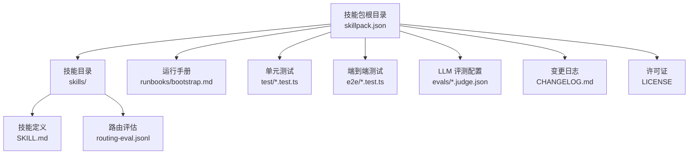
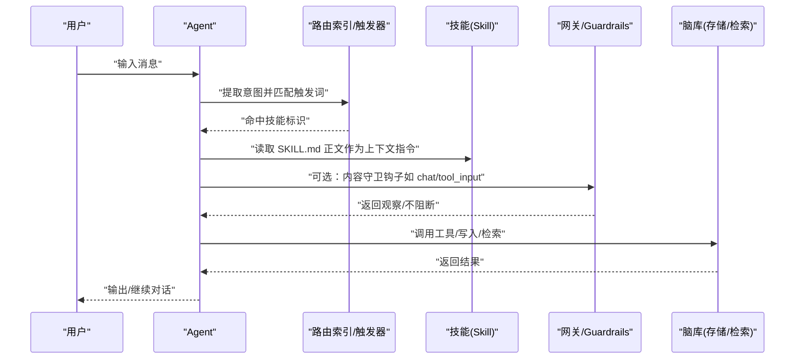
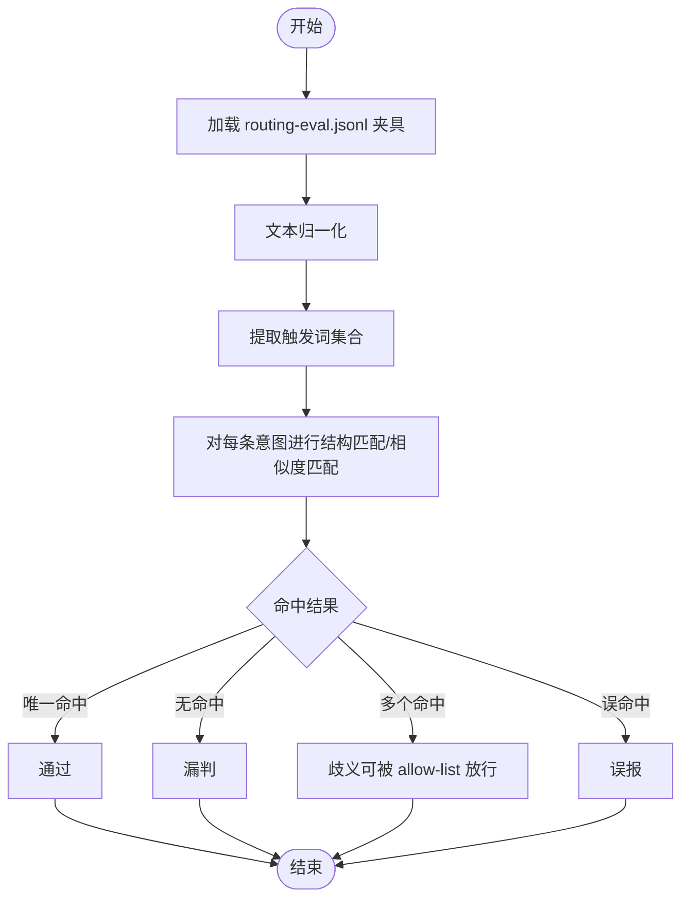
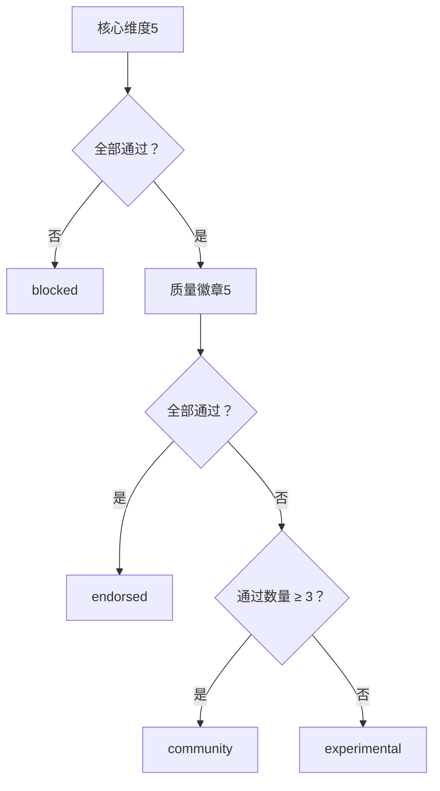
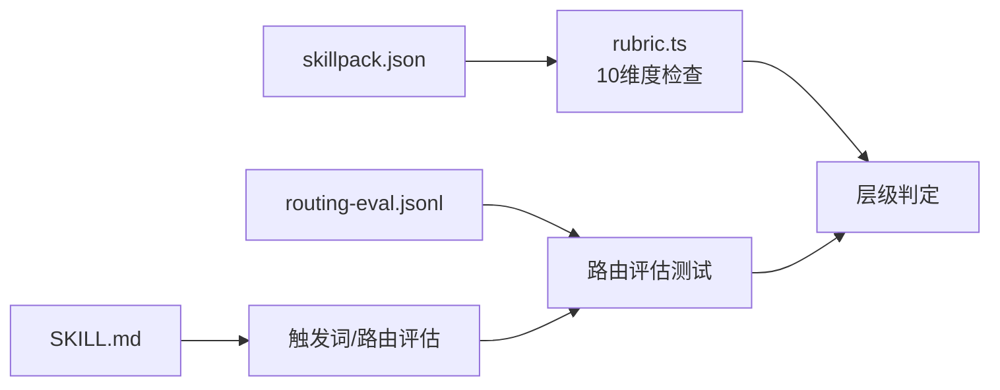

# 自定义技能开发

<cite>
**本文引用的文件**
- [skillpack-anatomy.md](file://docs/skillpack-anatomy.md)
- [GBRAIN_SKILLPACK.md](file://docs/GBRAIN_SKILLPACK.md)
- [guardrails.md](file://docs/guardrails.md)
- [skill-development.md](file://docs/guides/skill-development.md)
- [rubric.ts](file://src/core/skillpack/rubric.ts)
- [skillpack.json](file://examples/skillpack-reference/skillpack.json)
- [SKILL.md（参考包）](file://examples/skillpack-reference/skills/reference-pack/SKILL.md)
- [routing-eval.jsonl（参考包）](file://examples/skillpack-reference/skills/reference-pack/routing-eval.jsonl)
- [SKILL.md（ask-user）](file://skills/ask-user/SKILL.md)
- [SKILL.md（cold-start）](file://skills/cold-start/SKILL.md)
- [routing-eval.test.ts](file://test/routing-eval.test.ts)
</cite>

## 目录
1. 引言
2. 项目结构
3. 核心组件
4. 架构总览
5. 详细组件分析
6. 依赖关系分析
7. 性能考量
8. 故障排查指南
9. 结论
10. 附录

## 引言
本文件面向希望在 GBrain 生态中开发“自定义技能”的工程师与产品人员，系统阐述技能的定义格式、SKILL.md 文件结构、触发条件与执行逻辑；给出从模板生成到功能实现的完整工作流程；总结技能路由、参数处理与结果格式化的最佳实践；并覆盖测试、调试、性能优化、安全与异常管理、以及与外部 API 的集成与数据交换方式。

## 项目结构
围绕“技能”与“技能包”的核心目录与文件如下：
- 技能包（Skillpack）根目录：包含清单文件 skillpack.json、技能目录 skills/<slug>、运行手册 runbooks、测试与评测等。
- 技能（Skill）：每个技能由 SKILL.md 定义其元数据（名称、描述、触发词、工具声明等）与执行指令体；同时提供 skills/<slug>/routing-eval.jsonl 作为路由评估数据集。
- 参考技能包：examples/skillpack-reference 提供可直接克隆使用的 10/10 合格技能包骨架，便于快速上手与自检。

图示来源
- [skillpack-anatomy.md: 8-35:8-35](file://docs/skillpack-anatomy.md#L8-L35)
- [skillpack.json: 1-30:1-30](file://examples/skillpack-reference/skillpack.json#L1-L30)

章节来源
- [skillpack-anatomy.md: 1-113:1-113](file://docs/skillpack-anatomy.md#L1-L113)
- [skillpack.json: 1-30:1-30](file://examples/skillpack-reference/skillpack.json#L1-L30)

## 核心组件
- 技能包清单（skillpack.json）
  - 声明版本、名称、版本号、作者、许可证、主页、最低兼容版本、技能列表、运行手册、变更日志、测试与评测路径等。
  - 用于“医生”评分与打包发布。
- 技能定义（SKILL.md）
  - 使用 YAML 前言元数据（name、description、triggers 等），正文为“上下文内指令”，Agent 在匹配触发词后按顺序阅读。
- 路由评估（routing-eval.jsonl）
  - 每行一条意图样本，标注期望命中技能名，用于评估路由准确性与歧义性。
- 医生评分（Rubric）
  - 将技能包按 10 维度进行二值化检查，分为“核心必过”与“质量徽章”，决定可发布层级（endorsed/community/experimental/blocked）。

章节来源
- [skillpack-anatomy.md: 10-35:10-35](file://docs/skillpack-anatomy.md#L10-L35)
- [rubric.ts: 66-386:66-386](file://src/core/skillpack/rubric.ts#L66-L386)
- [SKILL.md（参考包）: 1-104:1-104](file://examples/skillpack-reference/skills/reference-pack/SKILL.md#L1-L104)

## 架构总览
下图展示“用户输入 → 触发词匹配 → 技能执行 → 输出/写入”的端到端流程，以及与“医生评分”“路由评估”“运行手册”的关系。

图示来源
- [skillpack-anatomy.md: 37-50:37-50](file://docs/skillpack-anatomy.md#L37-L50)
- [guardrails.md: 33-45:33-45](file://docs/guardrails.md#L33-L45)

## 详细组件分析

### 组件一：技能定义（SKILL.md）结构与字段
- 元数据（前言）
  - 必填：name、description、triggers（字符串或数组，至少一个非空）
  - 可选：version、mutating、writes_pages、writes_to、tools、priority 等
- 执行体（正文）
  - 以“上下文内指令”形式组织，Agent 按顺序阅读，决定如何调用工具、构造输出、是否等待用户选择等
- 示例参考
  - 参考技能包的 SKILL.md 展示了“什么是技能包契约”“医生评分维度”“如何使用该技能”等要点
  - ask-user 展示了“决策门”模式：呈现选项、停止当前回合、等待用户响应后再分支
  - cold-start 展示了“冷启动”序列：多阶段导入、实体检测与交叉链接、进度跟踪与恢复协议

章节来源
- [SKILL.md（参考包）: 1-104:1-104](file://examples/skillpack-reference/skills/reference-pack/SKILL.md#L1-L104)
- [SKILL.md（ask-user）: 1-254:1-254](file://skills/ask-user/SKILL.md#L1-L254)
- [SKILL.md（cold-start）: 1-507:1-507](file://skills/cold-start/SKILL.md#L1-L507)

### 组件二：技能包清单（skillpack.json）与打包
- 清单字段
  - api_version、name、version、description、author、license、homepage、gbrain_min_version
  - skills、runbooks、changelog、unit_tests、e2e_tests、llm_evals、routing_evals
- 工作流
  - 使用 gbrain skillpack init 生成骨架
  - 使用 gbrain skillpack doctor 检查 10 维度并通过 --fix 自动修复可自动修复项
  - 使用 gbrain skillpack pack 生成确定性压缩包与哈希

章节来源
- [skillpack-anatomy.md: 31-35:31-35](file://docs/skillpack-anatomy.md#L31-L35)
- [skillpack-anatomy.md: 92-106:92-106](file://docs/skillpack-anatomy.md#L92-L106)
- [skillpack.json: 1-30:1-30](file://examples/skillpack-reference/skillpack.json#L1-L30)

### 组件三：路由评估（routing-eval.jsonl）与校验
- 数据格式
  - 每行一个 JSON 对象，包含 intent（用户意图）、expected_skill（期望命中技能）、可选 ambiguous_with（允许共火技能白名单）
- 用途
  - 验证触发词与意图的结构性匹配、歧义检测、自然语义嵌入下的鲁棒性
- 测试覆盖
  - 单元测试覆盖归一化、触发词抽取、结构匹配、歧义与否定样例、夹具加载与运行

图示来源
- [routing-eval.test.ts: 14-372:14-372](file://test/routing-eval.test.ts#L14-L372)

章节来源
- [routing-eval.test.ts: 14-372:14-372](file://test/routing-eval.test.ts#L14-L372)
- [routing-eval.jsonl（参考包）: 1-6:1-6](file://examples/skillpack-reference/skills/reference-pack/routing-eval.jsonl#L1-L6)

### 组件四：医生评分（Rubric）与发布层级
- 核心维度（必过）
  - manifest_valid、skills_have_skill_md、routing_evals_present、skills_have_unique_triggers、changelog_present_and_current
- 质量徽章（影响层级）
  - unit_tests_present、e2e_tests_present、llm_eval_present、bootstrap_runbook_present、license_present
- 层级规则
  - blocked：任一核心未过
  - experimental：核心全过但徽章不足
  - community：核心全过且≥3徽章
  - endorsed：核心全过且全部徽章

图示来源
- [rubric.ts: 449-494:449-494](file://src/core/skillpack/rubric.ts#L449-L494)

章节来源
- [rubric.ts: 66-386:66-386](file://src/core/skillpack/rubric.ts#L66-L386)
- [rubric.ts: 449-494:449-494](file://src/core/skillpack/rubric.ts#L449-L494)

### 组件五：内容守卫（Guardrails）与安全边界
- 设计约束
  - 仅观察、失败放行、内联等待、不持久化、限定内容边界
- 五个钩子位置
  - file_storage.markdown、file_storage.code、ai_gateway.chat、ai_gateway.expand、ai_gateway.tool_input
- 开发者责任
  - 超时控制、密钥管理、脱敏日志、异步扇出

章节来源
- [guardrails.md: 12-32:12-32](file://docs/guardrails.md#L12-L32)
- [guardrails.md: 33-45:33-45](file://docs/guardrails.md#L33-L45)
- [guardrails.md: 52-103:52-103](file://docs/guardrails.md#L52-L103)

### 组件六：技能开发工作流程（从概念到上线）
- 五步循环
  - 概念化：输入/输出/触发/数据源/频率
  - 手工验证：小批量真实数据验证输出与边界
  - 评估反馈：用户评审与修订
  - 编码为技能：完善 SKILL.md，确保无桩代码、有引用与格式化
  - 上线与调度：若需自动执行，加入 Cron 并监控首次多次运行
- MECE 原则
  - 实体类型/信号来源单一职责，避免重复创建页面

章节来源
- [skill-development.md: 21-58:21-58](file://docs/guides/skill-development.md#L21-L58)
- [skill-development.md: 59-76:59-76](file://docs/guides/skill-development.md#L59-L76)
- [skill-development.md: 115-128:115-128](file://docs/guides/skill-development.md#L115-L128)

## 依赖关系分析
- 技能包清单驱动“医生评分”维度检查
- SKILL.md 的 triggers 决定路由评估夹具的构建与校验
- routing-eval.jsonl 与路由评估测试共同保障触发词鲁棒性
- 运行手册与测试/评测共同提升可维护性与可验证性

图示来源
- [rubric.ts: 66-386:66-386](file://src/core/skillpack/rubric.ts#L66-L386)
- [routing-eval.test.ts: 14-372:14-372](file://test/routing-eval.test.ts#L14-L372)

章节来源
- [rubric.ts: 66-386:66-386](file://src/core/skillpack/rubric.ts#L66-L386)
- [routing-eval.test.ts: 14-372:14-372](file://test/routing-eval.test.ts#L14-L372)

## 性能考量
- 路由评估
  - 保持 routing-eval.jsonl 中意图多样化与代表性，避免过度拟合触发词字面量
  - 使用自然语义嵌入与结构匹配双通道，减少误报与漏判
- 技能执行
  - 将大段指令拆分为清晰步骤，便于人类审阅与自动化校验
  - 对高成本外部 API 调用采用异步扇出与重试策略，结合守卫超时
- 医生评分
  - 优先补齐缺失的测试与评测，提高一次性通过率，降低反复打包成本

## 故障排查指南
- 医生评分未通过
  - 逐条查看维度详情与修复建议，优先解决核心维度（必过）
  - 使用 doctor --fix --yes 自动修复可自动修复项（如路由评估夹具、变更日志、许可证、运行手册、测试）
- 路由评估失败
  - 检查 routing-eval.jsonl 是否满足每技能≥5 条意图
  - 使用测试用例定位误报/漏判/歧义问题，必要时在夹具中标注 ambiguous_with 白名单
- 守卫未生效或异常
  - 确认注册时机与钩子位置正确，注意失败放行策略与超时控制
- 输出不符合预期
  - 回到 SKILL.md 正文，对照 ask-user 的“决策门”模式与 cold-start 的“进度跟踪/恢复协议”进行修正

章节来源
- [skillpack-anatomy.md: 51-82:51-82](file://docs/skillpack-anatomy.md#L51-L82)
- [rubric.ts: 449-494:449-494](file://src/core/skillpack/rubric.ts#L449-L494)
- [routing-eval.test.ts: 14-372:14-372](file://test/routing-eval.test.ts#L14-L372)
- [guardrails.md: 52-103:52-103](file://docs/guardrails.md#L52-L103)

## 结论
通过规范的技能包结构、严谨的医生评分与路由评估、完善的测试与评测体系，以及可观察的安全边界，开发者可以高效地将重复性任务转化为可维护、可验证、可自动化的技能。遵循 MECE 原则与“先手工再编码再上线”的五步循环，是规模化交付高质量技能的关键。

## 附录

### 最佳实践速查
- 路由与触发
  - triggers 保持简洁明确，避免重叠；每技能≥5 条意图样本
- 参数与分支
  - 使用“决策门”模式（ask-user）在关键节点等待用户确认
  - 输出格式化遵循示例风格，便于人类审阅与自动化校验
- 结果与写入
  - 对可能写入脑库的操作，先进行实体检测与去重，再落盘
- 测试与评测
  - 单测覆盖关键分支，端到端测试覆盖真实数据流，LLM 评测覆盖正负样例
- 安全与合规
  - 使用守卫钩子进行内容观察，失败放行；对外部 API 严格超时与重试；脱敏日志

### 外部 API 集成与数据交换
- 通过工具调用与外部服务交互，遵循“先观察、后执行”的原则
- 对高风险操作（如删除、写入）使用“决策门”与最小授权范围
- 对长耗时任务采用异步扇出与进度回传，避免阻塞主流程