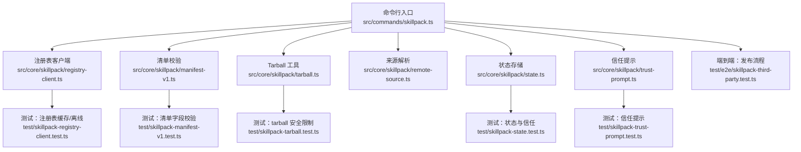
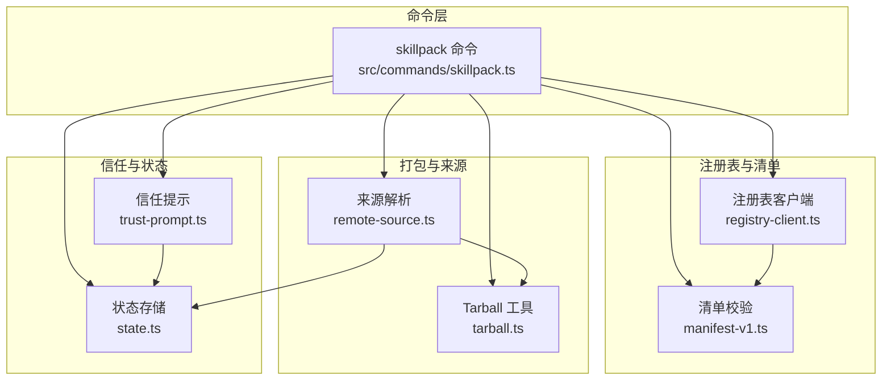
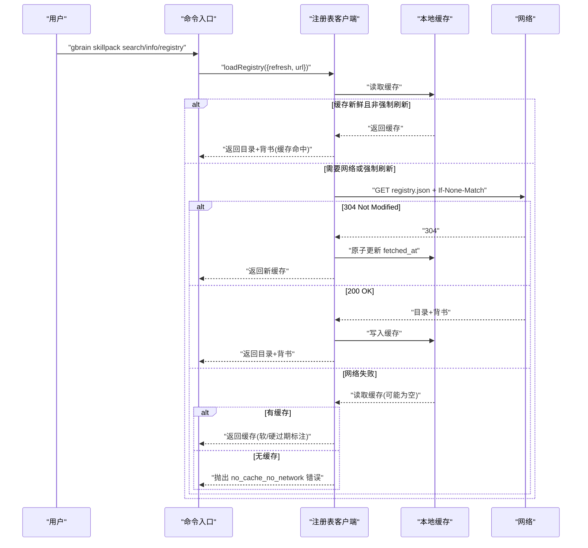
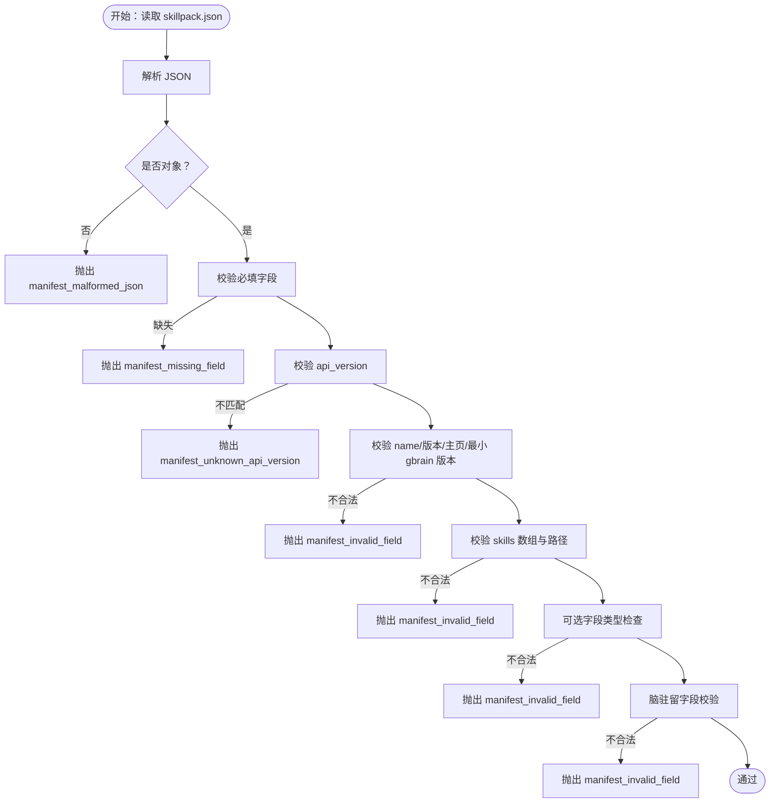
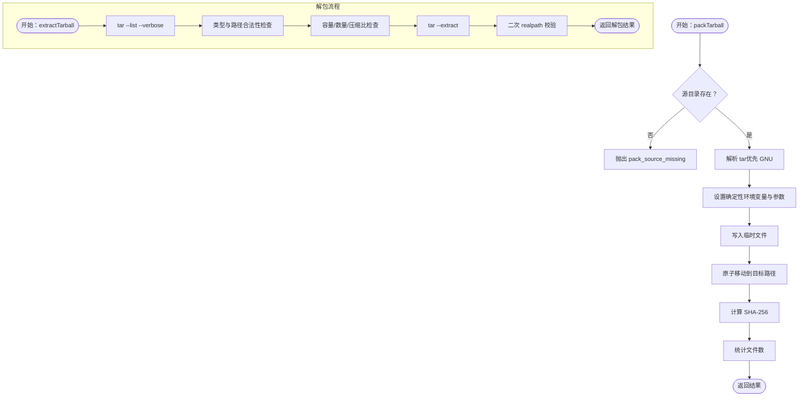
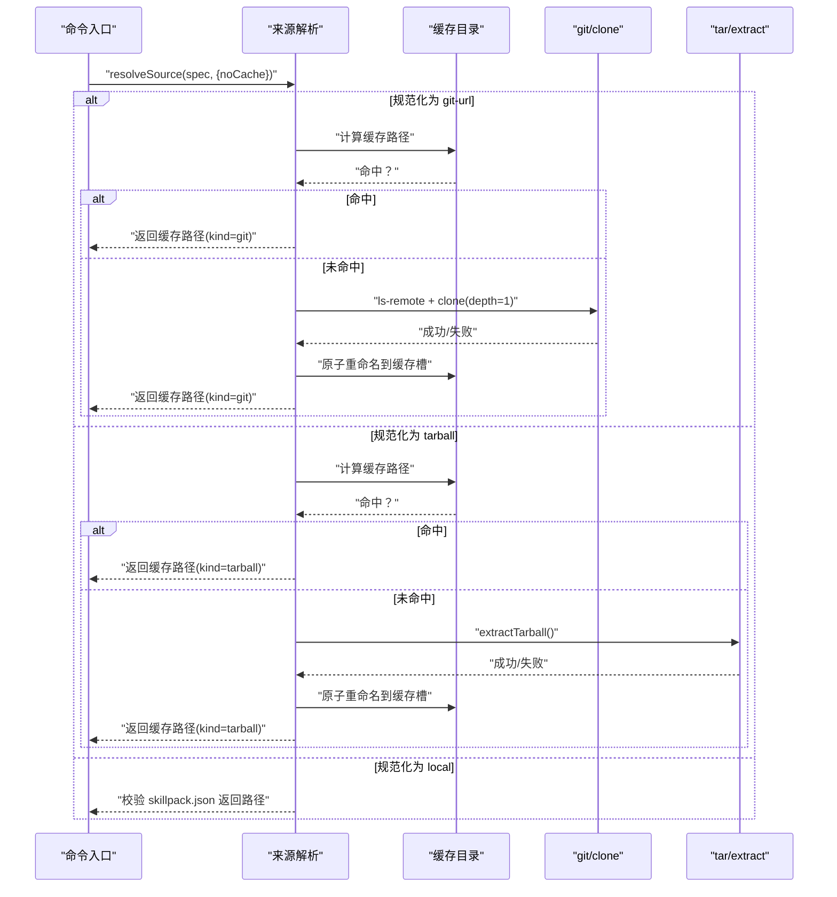
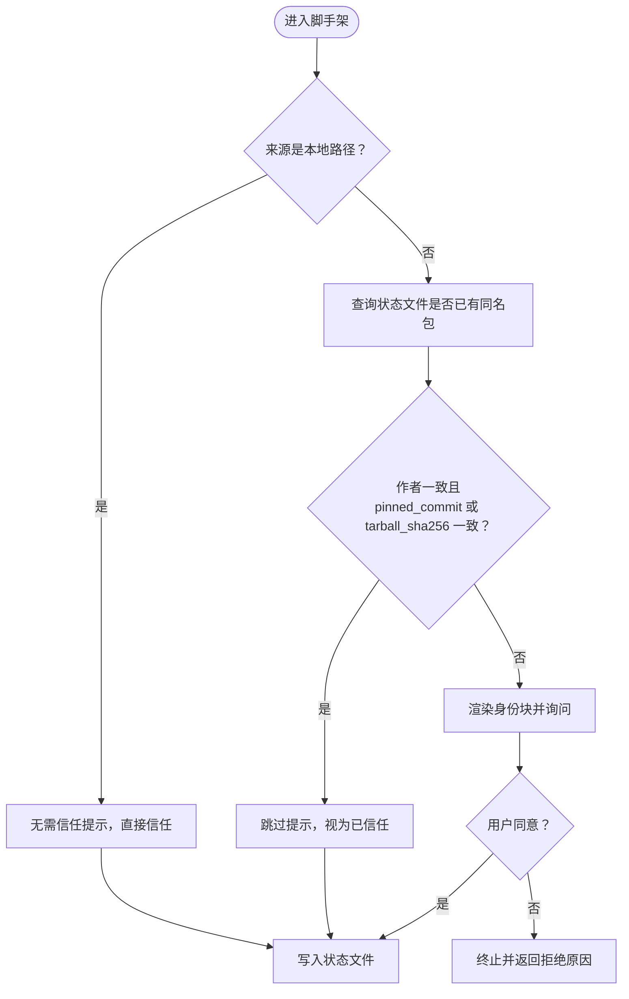
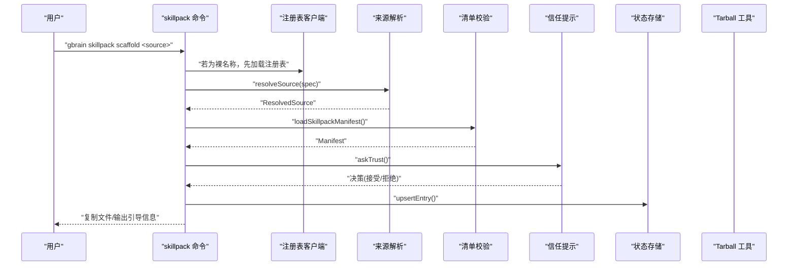
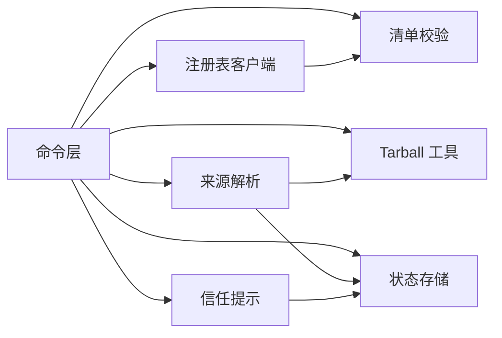

# 部署与发布

<cite>
**本文引用的文件**
- [src/core/skillpack/registry-client.ts](file://src/core/skillpack/registry-client.ts)
- [src/core/skillpack/manifest-v1.ts](file://src/core/skillpack/manifest-v1.ts)
- [src/core/skillpack/tarball.ts](file://src/core/skillpack/tarball.ts)
- [src/core/skillpack/remote-source.ts](file://src/core/skillpack/remote-source.ts)
- [src/core/skillpack/state.ts](file://src/core/skillpack/state.ts)
- [src/core/skillpack/trust-prompt.ts](file://src/core/skillpack/trust-prompt.ts)
- [src/commands/skillpack.ts](file://src/commands/skillpack.ts)
- [test/skillpack-registry-client.test.ts](file://test/skillpack-registry-client.test.ts)
- [test/skillpack-tarball.test.ts](file://test/skillpack-tarball.test.ts)
- [test/skillpack-remote-source.test.ts](file://test/skillpack-remote-source.test.ts)
- [test/skillpack-manifest-v1.test.ts](file://test/skillpack-manifest-v1.test.ts)
- [test/skillpack-state.test.ts](file://test/skillpack-state.test.ts)
- [test/skillpack-trust-prompt.test.ts](file://test/skillpack-trust-prompt.test.ts)
- [test/e2e/skillpack-third-party.test.ts](file://test/e2e/skillpack-third-party.test.ts)
- [docs/GBRAIN_SKILLPACK.md](file://docs/GBRAIN_SKILLPACK.md)
</cite>

## 目录
1. [简介](#简介)
2. [项目结构](#项目结构)
3. [核心组件](#核心组件)
4. [架构总览](#架构总览)
5. [详细组件分析](#详细组件分析)
6. [依赖关系分析](#依赖关系分析)
7. [性能考量](#性能考量)
8. [故障排查指南](#故障排查指南)
9. [结论](#结论)
10. [附录](#附录)

## 简介
本文件面向技能包（Skillpack）的“打包、注册与发布、下载安装与更新、缓存与增量、安全与信任”全流程，结合仓库中的实现与测试用例，系统化阐述以下主题：
- 技能包打包机制与 tarball 格式：确定性压缩、元数据嵌入与完整性校验
- 注册表客户端：离线可用、缓存与新鲜度控制、ETag 轮询
- 发布流程：从本地质量门禁到远程分发
- 下载、安装与更新：来源解析、信任提示、状态记录与增量参考
- 缓存策略、增量更新与回滚思路
- 安全验证、信任链与防攻击边界

## 项目结构
围绕技能包的“命令入口—核心模块—测试验证”的组织方式，关键路径如下：
- 命令层：gbrain skillpack 子命令入口，路由到具体功能（搜索、信息、注册表、医生、打包、脚手架等）
- 核心模块：注册表客户端、清单校验、tarball 打包/解压、来源解析、状态与信任提示
- 测试层：覆盖注册表拉取与缓存、tarball 安全限制、清单字段校验、状态与信任逻辑、端到端发布流程

图示来源
- [src/commands/skillpack.ts:100-174](file://src/commands/skillpack.ts#L100-L174)
- [src/core/skillpack/registry-client.ts:179-312](file://src/core/skillpack/registry-client.ts#L179-L312)
- [src/core/skillpack/manifest-v1.ts:139-372](file://src/core/skillpack/manifest-v1.ts#L139-L372)
- [src/core/skillpack/tarball.ts:151-241](file://src/core/skillpack/tarball.ts#L151-L241)
- [src/core/skillpack/remote-source.ts:397-421](file://src/core/skillpack/remote-source.ts#L397-L421)
- [src/core/skillpack/state.ts:88-148](file://src/core/skillpack/state.ts#L88-L148)
- [src/core/skillpack/trust-prompt.ts:89-133](file://src/core/skillpack/trust-prompt.ts#L89-L133)
- [test/skillpack-registry-client.test.ts:1-45](file://test/skillpack-registry-client.test.ts#L1-L45)
- [test/skillpack-tarball.test.ts:1-200](file://test/skillpack-tarball.test.ts#L1-L200)
- [test/skillpack-manifest-v1.test.ts:37-91](file://test/skillpack-manifest-v1.test.ts#L37-L91)
- [test/skillpack-state.test.ts:182-228](file://test/skillpack-state.test.ts#L182-L228)
- [test/skillpack-trust-prompt.test.ts:1-42](file://test/skillpack-trust-prompt.test.ts#L1-L42)
- [test/e2e/skillpack-third-party.test.ts:60-82](file://test/e2e/skillpack-third-party.test.ts#L60-L82)

章节来源
- [src/commands/skillpack.ts:100-174](file://src/commands/skillpack.ts#L100-L174)
- [docs/GBRAIN_SKILLPACK.md:1-144](file://docs/GBRAIN_SKILLPACK.md#L1-L144)

## 核心组件
- 注册表客户端：加载目录与背书文件、缓存与新鲜度控制、ETag 轮询、离线降级
- 清单校验：对 skillpack.json 的字段、格式、约束进行严格校验
- Tarball 工具：确定性打包与解包、安全上限与路径穿越防护
- 来源解析：支持 git、tarball、本地目录，统一输出解析结果并写入缓存
- 状态与信任：持久化记录已安装包，首次安装时基于身份三元组进行 TOFU 判定
- 命令入口：统一调度上述能力，提供搜索、信息、注册表、医生、打包、脚手架等子命令

章节来源
- [src/core/skillpack/registry-client.ts:179-312](file://src/core/skillpack/registry-client.ts#L179-L312)
- [src/core/skillpack/manifest-v1.ts:139-372](file://src/core/skillpack/manifest-v1.ts#L139-L372)
- [src/core/skillpack/tarball.ts:151-241](file://src/core/skillpack/tarball.ts#L151-L241)
- [src/core/skillpack/remote-source.ts:397-421](file://src/core/skillpack/remote-source.ts#L397-L421)
- [src/core/skillpack/state.ts:88-148](file://src/core/skillpack/state.ts#L88-L148)
- [src/core/skillpack/trust-prompt.ts:89-133](file://src/core/skillpack/trust-prompt.ts#L89-L133)
- [src/commands/skillpack.ts:100-174](file://src/commands/skillpack.ts#L100-L174)

## 架构总览
下图展示“注册表—来源解析—清单校验—Tarball—状态与信任—命令入口”的交互关系。

图示来源
- [src/commands/skillpack.ts:380-490](file://src/commands/skillpack.ts#L380-L490)
- [src/core/skillpack/registry-client.ts:179-312](file://src/core/skillpack/registry-client.ts#L179-L312)
- [src/core/skillpack/manifest-v1.ts:139-372](file://src/core/skillpack/manifest-v1.ts#L139-L372)
- [src/core/skillpack/tarball.ts:248-408](file://src/core/skillpack/tarball.ts#L248-L408)
- [src/core/skillpack/remote-source.ts:397-421](file://src/core/skillpack/remote-source.ts#L397-L421)
- [src/core/skillpack/state.ts:88-148](file://src/core/skillpack/state.ts#L88-L148)
- [src/core/skillpack/trust-prompt.ts:89-133](file://src/core/skillpack/trust-prompt.ts#L89-L133)

## 详细组件分析

### 组件一：注册表客户端（离线安全与缓存）
- 功能要点
  - 默认注册表与背书文件地址；支持配置覆盖
  - 缓存文件结构包含抓取时间、ETag、URL、目录与背书内容
  - 软 TTL（1 小时）优先使用缓存；超过 7 天标记为“过期”
  - 支持 ETag 条件请求，未变更时仅刷新 fetched_at 并原子写回缓存
  - 网络失败时按年龄分级降级：软过期/硬过期；无缓存则报错
- 错误码与降级策略
  - 无缓存且无网络：拒绝运行（首次安装需联网）
  - 缓存损坏：抛出错误；schema 不合法直接失败不回落到缓存
- 使用场景
  - 搜索、信息查询、注册表刷新、离线环境下的稳健运行

图示来源
- [src/core/skillpack/registry-client.ts:179-312](file://src/core/skillpack/registry-client.ts#L179-L312)
- [test/skillpack-registry-client.test.ts:1-45](file://test/skillpack-registry-client.test.ts#L1-L45)

章节来源
- [src/core/skillpack/registry-client.ts:179-312](file://src/core/skillpack/registry-client.ts#L179-L312)
- [test/skillpack-registry-client.test.ts:1-45](file://test/skillpack-registry-client.test.ts#L1-L45)

### 组件二：清单校验（skillpack.json）
- 功能要点
  - 必填字段校验（api_version、name、version、description、author、license、homepage、gbrain_min_version、skills）
  - 字段类型与格式约束（名称/版本/主页 URL/最小 gbrain 版本/技能路径等）
  - 可选字段（共享依赖、排除安装项、测试与评估配置、运行手册、变更日志、脑驻留标记与模式包名）
  - 正向兼容：未知字段容忍；schema 版本上限检查
- 错误分类
  - 缺失字段、非法值、未知 api_version、不支持的 schema 版本、技能路径不存在等

图示来源
- [src/core/skillpack/manifest-v1.ts:139-372](file://src/core/skillpack/manifest-v1.ts#L139-L372)
- [test/skillpack-manifest-v1.test.ts:37-91](file://test/skillpack-manifest-v1.test.ts#L37-L91)

章节来源
- [src/core/skillpack/manifest-v1.ts:139-372](file://src/core/skillpack/manifest-v1.ts#L139-L372)
- [test/skillpack-manifest-v1.test.ts:37-91](file://test/skillpack-manifest-v1.test.ts#L37-L91)

### 组件三：Tarball 打包与解包（确定性与安全）
- 功能要点
  - 打包：使用 GNU tar 的确定性标志（排序、归零时间、固定 UID/GID、去除非确定性 Pax 字段、禁用原始文件名与 mtime），生成稳定 SHA-256
  - 解包：严格允许列表（仅常规文件与目录）、路径穿越检测、大小/数量/压缩比上限、二次 realpath 校验
  - 容错：失败阶段原子化清理临时产物
- 安全边界
  - 禁止符号链接、硬链接、设备文件、FIFO
  - 路径长度与压缩炸弹阈值
  - 强制使用 GNU tar（macOS 默认 bsdtar 不满足要求）

图示来源
- [src/core/skillpack/tarball.ts:151-241](file://src/core/skillpack/tarball.ts#L151-L241)
- [src/core/skillpack/tarball.ts:248-408](file://src/core/skillpack/tarball.ts#L248-L408)
- [test/skillpack-tarball.test.ts:1-200](file://test/skillpack-tarball.test.ts#L1-L200)

章节来源
- [src/core/skillpack/tarball.ts:151-241](file://src/core/skillpack/tarball.ts#L151-L241)
- [src/core/skillpack/tarball.ts:248-408](file://src/core/skillpack/tarball.ts#L248-L408)
- [test/skillpack-tarball.test.ts:1-200](file://test/skillpack-tarball.test.ts#L1-L200)

### 组件四：来源解析（git/tarball/本地）
- 功能要点
  - 规范化输入：URL、owner/repo、本地路径、.tgz 文件、裸名称（由注册表解析后传入）
  - Git：解析远端 HEAD，缓存到 ~/.gbrain/skillpack-cache/git/<host>/<owner>/<repo>/<sha>/
  - Tarball：计算 SHA-256，缓存到 ~/.gbrain/skillpack-cache/tarball/<sha>/，解包后定位 skillpack.json 所在目录
  - 本地：直接校验 skillpack.json 存在
  - 缓存命中：直接返回路径与标识；缓存未命中：克隆/解包并原子落盘
- 错误分类
  - 规范化失败、本地缺失、tarball 缺失、克隆失败、rev-parse 失败等

图示来源
- [src/core/skillpack/remote-source.ts:397-421](file://src/core/skillpack/remote-source.ts#L397-L421)
- [src/core/skillpack/remote-source.ts:180-272](file://src/core/skillpack/remote-source.ts#L180-L272)
- [src/core/skillpack/remote-source.ts:274-339](file://src/core/skillpack/remote-source.ts#L274-L339)
- [src/core/skillpack/remote-source.ts:360-391](file://src/core/skillpack/remote-source.ts#L360-L391)
- [test/skillpack-remote-source.test.ts:149-185](file://test/skillpack-remote-source.test.ts#L149-L185)

章节来源
- [src/core/skillpack/remote-source.ts:397-421](file://src/core/skillpack/remote-source.ts#L397-L421)
- [test/skillpack-remote-source.test.ts:149-185](file://test/skillpack-remote-source.test.ts#L149-L185)

### 组件五：状态与信任（TOFU 与持久化）
- 功能要点
  - 状态文件：~/.gbrain/skillpack-state.json，记录每个已脚手架包的来源、版本、作者、提交/哈希、工作区、技能 slug 列表等
  - TOFU 判定：同一包同作者且相同 pinned_commit 或 tarball_sha256 时跳过首次确认
  - 信任提示：渲染身份块、TTY 交互、--trust 标记绕过、非 TTY 且无 --trust 拒绝
- 错误处理
  - 状态文件格式错误、未知 schema 版本、原子写失败

图示来源
- [src/core/skillpack/state.ts:88-148](file://src/core/skillpack/state.ts#L88-L148)
- [src/core/skillpack/state.ts:179-195](file://src/core/skillpack/state.ts#L179-L195)
- [src/core/skillpack/trust-prompt.ts:89-133](file://src/core/skillpack/trust-prompt.ts#L89-L133)
- [test/skillpack-state.test.ts:182-228](file://test/skillpack-state.test.ts#L182-L228)
- [test/skillpack-trust-prompt.test.ts:1-42](file://test/skillpack-trust-prompt.test.ts#L1-L42)

章节来源
- [src/core/skillpack/state.ts:88-148](file://src/core/skillpack/state.ts#L88-L148)
- [src/core/skillpack/state.ts:179-195](file://src/core/skillpack/state.ts#L179-L195)
- [src/core/skillpack/trust-prompt.ts:89-133](file://src/core/skillpack/trust-prompt.ts#L89-L133)
- [test/skillpack-state.test.ts:182-228](file://test/skillpack-state.test.ts#L182-L228)
- [test/skillpack-trust-prompt.test.ts:1-42](file://test/skillpack-trust-prompt.test.ts#L1-L42)

### 组件六：命令入口（子命令与路由）
- 主要子命令
  - list、scaffold、reference、migrate-fence、scrub-legacy-fence-rows、harvest、diff、check
  - search、info、registry、doctor、init、init-brain-pack、pack、endorse
- 关键路由
  - 第三方脚手架：先解析来源（git/tarball/本地），再执行清单校验、信任提示、复制、状态更新、引导输出
  - 医生与打包：doctor 通过质量门禁，通过后调用 pack 生成确定性 tarball

图示来源
- [src/commands/skillpack.ts:380-490](file://src/commands/skillpack.ts#L380-L490)
- [src/core/skillpack/registry-client.ts:179-312](file://src/core/skillpack/registry-client.ts#L179-L312)
- [src/core/skillpack/remote-source.ts:397-421](file://src/core/skillpack/remote-source.ts#L397-L421)
- [src/core/skillpack/manifest-v1.ts:338-372](file://src/core/skillpack/manifest-v1.ts#L338-L372)
- [src/core/skillpack/state.ts:160-171](file://src/core/skillpack/state.ts#L160-L171)
- [src/core/skillpack/trust-prompt.ts:89-133](file://src/core/skillpack/trust-prompt.ts#L89-L133)

章节来源
- [src/commands/skillpack.ts:380-490](file://src/commands/skillpack.ts#L380-L490)

## 依赖关系分析
- 命令层依赖所有核心模块以完成端到端流程
- 注册表客户端依赖清单校验用于 schema 校验
- 来源解析依赖 tarball 工具与 git 远端工具，产出统一 ResolvedSource
- 信任提示依赖状态存储进行 TOFU 判定
- 测试覆盖各模块的关键分支与错误路径

图示来源
- [src/commands/skillpack.ts:100-174](file://src/commands/skillpack.ts#L100-L174)
- [src/core/skillpack/registry-client.ts:179-312](file://src/core/skillpack/registry-client.ts#L179-L312)
- [src/core/skillpack/manifest-v1.ts:139-372](file://src/core/skillpack/manifest-v1.ts#L139-L372)
- [src/core/skillpack/tarball.ts:151-241](file://src/core/skillpack/tarball.ts#L151-L241)
- [src/core/skillpack/remote-source.ts:397-421](file://src/core/skillpack/remote-source.ts#L397-L421)
- [src/core/skillpack/state.ts:88-148](file://src/core/skillpack/state.ts#L88-L148)
- [src/core/skillpack/trust-prompt.ts:89-133](file://src/core/skillpack/trust-prompt.ts#L89-L133)

章节来源
- [src/commands/skillpack.ts:100-174](file://src/commands/skillpack.ts#L100-L174)

## 性能考量
- 注册表缓存
  - 软 TTL（1 小时）避免频繁网络请求；ETag 使未变更目录几乎零开销
  - 硬 TTL（7 天）触发升级提示，确保长期离线场景仍可工作
- Tarball 确定性
  - 固定时间戳、UID/GID、排序与压缩参数，保证相同输入产生相同 SHA，利于缓存与一致性
- 来源解析缓存
  - Git 按提交 SHA 缓存；tarball 按 SHA 缓存；命中即短路克隆/解包
- I/O 原子化
  - 缓存写入采用 .tmp + rename，避免部分写导致的后续读取失败

## 故障排查指南
- 注册表
  - 现象：网络失败且无缓存
  - 处理：首次安装必须联网；否则抛出 no_cache_no_network
  - 现象：schema 校验失败
  - 处理：修正目录/背书文件结构；不要回落到缓存
- 来源解析
  - 现象：本地路径不存在/非目录/非包根
  - 处理：确认路径正确且包含 skillpack.json
  - 现象：tarball 缺失/非文件
  - 处理：检查路径与权限
  - 现象：git 克隆失败/HEAD 变更
  - 处理：检查 URL、网络、权限；必要时禁用缓存重新解析
- Tarball
  - 现象：路径穿越/类型非法/超限
  - 处理：修正归档内容；调整 caps 参数（谨慎）
- 清单校验
  - 现象：必填字段缺失/非法值/技能路径不存在
  - 处理：补齐字段、修正格式、确保技能目录存在
- 信任与状态
  - 现象：TOFU 再确认/非 TTY 拒绝
  - 处理：使用 --trust；或在 TTY 环境交互确认；检查状态文件格式

章节来源
- [src/core/skillpack/registry-client.ts:264-292](file://src/core/skillpack/registry-client.ts#L264-L292)
- [src/core/skillpack/remote-source.ts:274-339](file://src/core/skillpack/remote-source.ts#L274-L339)
- [src/core/skillpack/tarball.ts:248-408](file://src/core/skillpack/tarball.ts#L248-L408)
- [src/core/skillpack/manifest-v1.ts:139-372](file://src/core/skillpack/manifest-v1.ts#L139-L372)
- [src/core/skillpack/state.ts:88-148](file://src/core/skillpack/state.ts#L88-L148)
- [src/core/skillpack/trust-prompt.ts:89-133](file://src/core/skillpack/trust-prompt.ts#L89-L133)

## 结论
该体系以“确定性打包 + 严格清单 + 安全来源 + 缓存与离线降级 + TOFU 信任”为核心，形成从本地质量门禁到远程分发、从下载安装到增量参考与升级的闭环。通过明确的错误码与测试覆盖，系统在安全性、可维护性与用户体验之间取得平衡。

## 附录
- 发布与端到端流程（来自 e2e 测试）
  - 初始化 → 医生（10 分/达标）→ 打包（生成确定性 tarball，含 SHA-256）
  - 建议在 CI 中启用 --skip-doctor 以加速但保留质量门禁选项

章节来源
- [test/e2e/skillpack-third-party.test.ts:60-82](file://test/e2e/skillpack-third-party.test.ts#L60-L82)