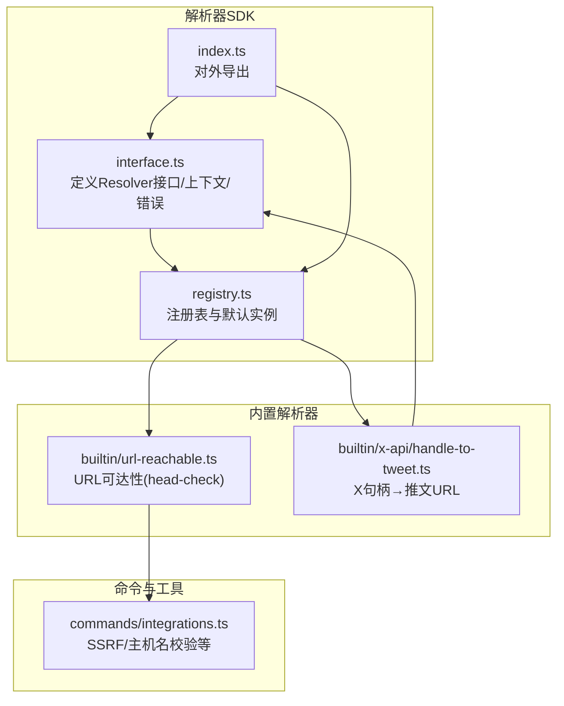
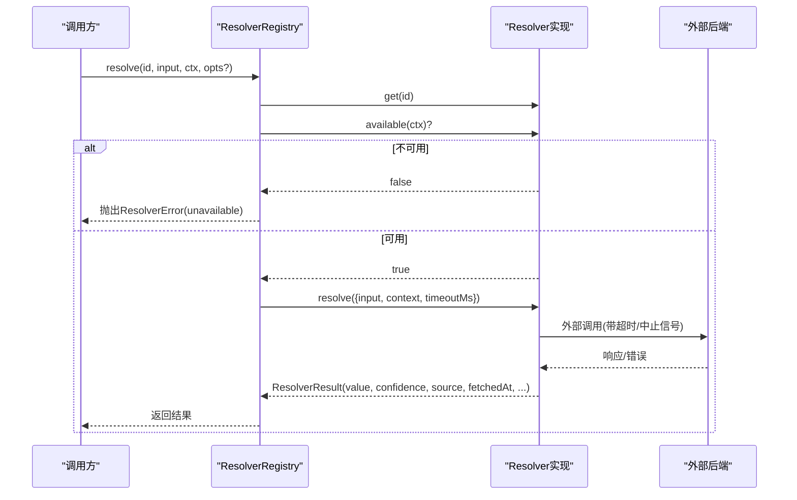
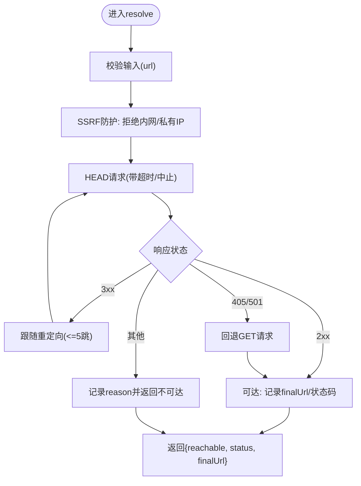
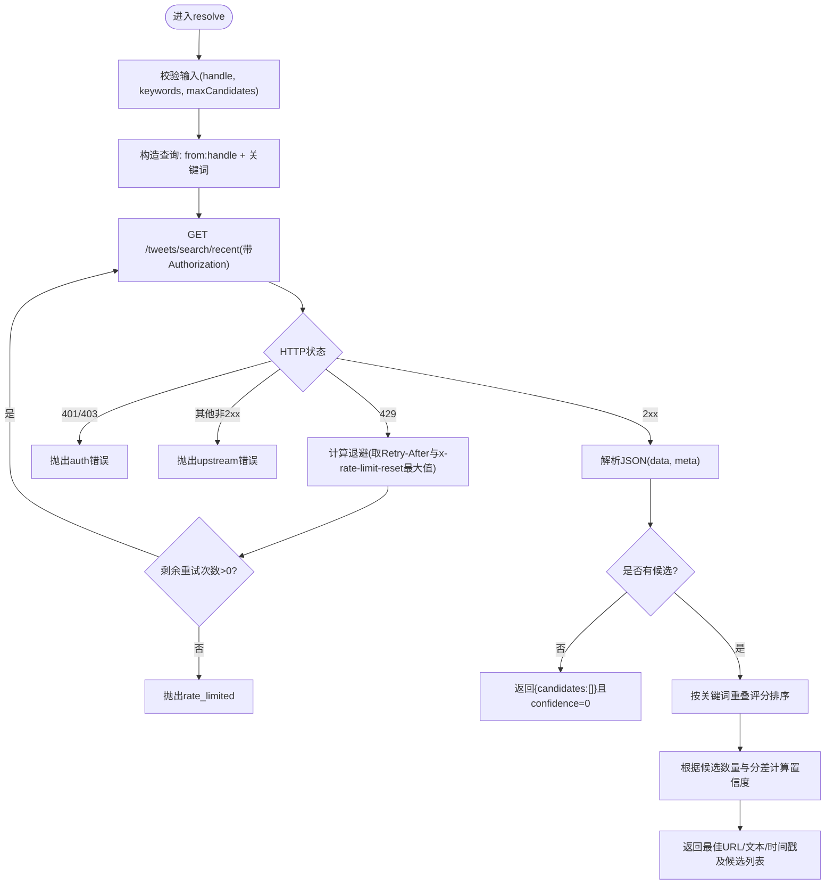
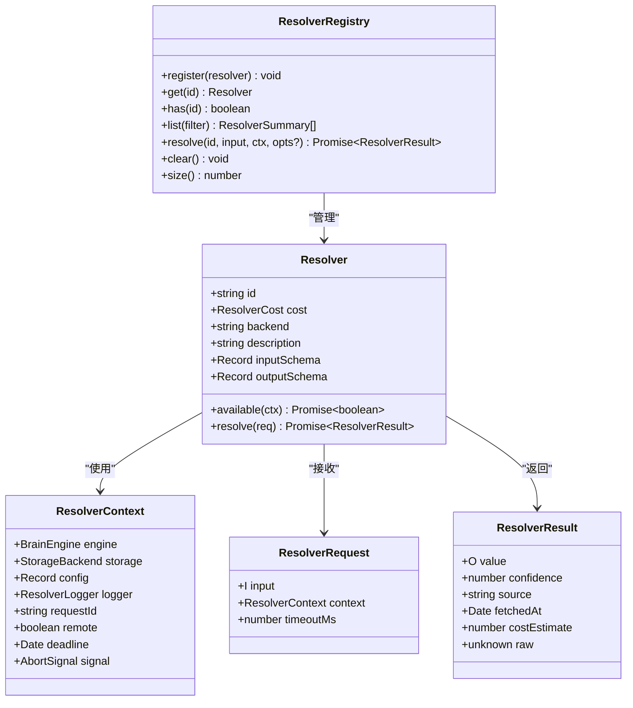
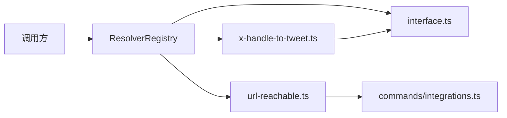

# API解析器系统

<cite>
**本文引用的文件**
- [src/core/resolvers/interface.ts](file://src/core/resolvers/interface.ts)
- [src/core/resolvers/registry.ts](file://src/core/resolvers/registry.ts)
- [src/core/resolvers/index.ts](file://src/core/resolvers/index.ts)
- [src/core/resolvers/builtin/url-reachable.ts](file://src/core/resolvers/builtin/url-reachable.ts)
- [src/core/resolvers/builtin/x-api/handle-to-tweet.ts](file://src/core/resolvers/builtin/x-api/handle-to-tweet.ts)
- [src/commands/integrations.ts](file://src/commands/integrations.ts)
- [test/resolvers.test.ts](file://test/resolvers.test.ts)
- [test/core/retry.test.ts](file://test/core/retry.test.ts)
- [test/timeout.test.ts](file://test/timeout.test.ts)
</cite>

## 目录
1. [引言](#引言)
2. [项目结构](#项目结构)
3. [核心组件](#核心组件)
4. [架构总览](#架构总览)
5. [详细组件分析](#详细组件分析)
6. [依赖关系分析](#依赖关系分析)
7. [性能考量](#性能考量)
8. [故障排除指南](#故障排除指南)
9. [结论](#结论)
10. [附录](#附录)

## 引言
本文件系统化阐述 gbrain 的 API 解析器（Resolver）体系：从设计原则、接口规范、内置与自定义解析器的开发模式，到注册、发现与调用流程；并覆盖 URL 可达性检查、外部 API 调用、数据格式转换、错误处理、重试与超时控制、性能优化与缓存策略，以及故障排除与调试技巧。目标是帮助开发者快速理解并扩展解析器生态。

## 项目结构
解析器相关代码集中在核心模块中，采用“接口 + 注册表 + 内置解析器”的分层组织方式：
- 接口与类型：定义统一的 Resolver 合约、上下文、请求、结果与错误码。
- 注册表：集中管理解析器的注册、查询、过滤与调用。
- 内置解析器：提供可直接使用的解析能力，如 URL 可达性检查、X/Twitter API 查询等。
- 命令与工具：集成安全防护（如 SSRF）、超时与中断信号组合等通用能力。

图表来源
- [src/core/resolvers/interface.ts:1-159](file://src/core/resolvers/interface.ts#L1-L159)
- [src/core/resolvers/registry.ts:1-152](file://src/core/resolvers/registry.ts#L1-L152)
- [src/core/resolvers/index.ts:1-27](file://src/core/resolvers/index.ts#L1-L27)
- [src/core/resolvers/builtin/url-reachable.ts:1-83](file://src/core/resolvers/builtin/url-reachable.ts#L1-L83)
- [src/core/resolvers/builtin/x-api/handle-to-tweet.ts:1-443](file://src/core/resolvers/builtin/x-api/handle-to-tweet.ts#L1-L443)
- [src/commands/integrations.ts](file://src/commands/integrations.ts)

章节来源
- [src/core/resolvers/interface.ts:1-159](file://src/core/resolvers/interface.ts#L1-L159)
- [src/core/resolvers/registry.ts:1-152](file://src/core/resolvers/registry.ts#L1-L152)
- [src/core/resolvers/index.ts:1-27](file://src/core/resolvers/index.ts#L1-L27)

## 核心组件
- 解析器接口与契约
  - 统一输入/输出模型，强制携带置信度与来源标识，便于上层决策与审计。
  - 成本层级（免费/限流/付费）与后端标签（如 head-check、x-api-v2）用于策略与计费。
- 上下文与请求
  - 上下文包含引擎、存储、配置、日志、请求ID、远程标记、截止时间与中止信号。
  - 请求支持每调用级超时覆盖。
- 错误模型
  - 细粒度错误码（未找到、重复注册、不可用、超时、限流、认证失败、模式不匹配、被中止、上游错误）。
- 注册表
  - 提供注册、查询、存在性判断、列表（支持按成本/后端过滤）、解析调用与清空。
  - 默认进程级单例，便于全局共享。

章节来源
- [src/core/resolvers/interface.ts:21-159](file://src/core/resolvers/interface.ts#L21-L159)
- [src/core/resolvers/registry.ts:22-152](file://src/core/resolvers/registry.ts#L22-L152)

## 架构总览
解析器系统遵循“接口抽象 + 注册表调度 + 具体实现”的分层架构。调用方通过注册表以解析器 ID 定位具体实现，解析器在可用性检查通过后执行业务逻辑，返回带置信度的结果。

图表来源
- [src/core/resolvers/registry.ts:96-112](file://src/core/resolvers/registry.ts#L96-L112)
- [src/core/resolvers/interface.ts:111-131](file://src/core/resolvers/interface.ts#L111-L131)

## 详细组件分析

### URL可达性解析器（url_reachable）
- 功能概述
  - 使用 HEAD 检查 URL，必要时回退到 GET；手动跟随最多 5 跳重定向链，逐跳验证。
  - 输出包含可达性、最终 URL、状态码与人类可读原因。
  - 防护：复用命令层的 isInternalUrl 等 SSRF 保护，拒绝内网地址。
- 关键点
  - 输入/输出模式严格定义，支持 schema 校验。
  - 默认超时 10 秒，支持请求级覆盖。
  - 中止信号贯穿网络调用，异常路径抛出明确错误码。
- 数据流与算法

图表来源
- [src/core/resolvers/builtin/url-reachable.ts:78-83](file://src/core/resolvers/builtin/url-reachable.ts#L78-L83)
- [src/core/resolvers/builtin/url-reachable.ts:12-20](file://src/core/resolvers/builtin/url-reachable.ts#L12-L20)
- [src/commands/integrations.ts](file://src/commands/integrations.ts)

章节来源
- [src/core/resolvers/builtin/url-reachable.ts:1-83](file://src/core/resolvers/builtin/url-reachable.ts#L1-L83)
- [src/commands/integrations.ts](file://src/commands/integrations.ts)

### X/Twitter 句柄→推文解析器（x_handle_to_tweet）
- 功能概述
  - 将 X 句柄与关键词提示转化为推文 URL，返回候选集与置信度，供完整性修复使用。
  - 支持关键词评分、候选排序与多级置信度阈值。
- 关键点
  - 输入严格校验（句柄长度/字符规则），关键词清洗与编码。
  - 使用 Bearer Token 进行鉴权，支持 429 自动退避重试（最多 2 次额外尝试）。
  - 超时与中止信号组合，确保长尾调用可控。
  - 置信度计算与 gbrain 审核流程对齐。
- 数据流与算法

图表来源
- [src/core/resolvers/builtin/x-api/handle-to-tweet.ts:125-255](file://src/core/resolvers/builtin/x-api/handle-to-tweet.ts#L125-L255)
- [src/core/resolvers/builtin/x-api/handle-to-tweet.ts:268-296](file://src/core/resolvers/builtin/x-api/handle-to-tweet.ts#L268-L296)
- [src/core/resolvers/builtin/x-api/handle-to-tweet.ts:383-412](file://src/core/resolvers/builtin/x-api/handle-to-tweet.ts#L383-L412)

章节来源
- [src/core/resolvers/builtin/x-api/handle-to-tweet.ts:1-443](file://src/core/resolvers/builtin/x-api/handle-to-tweet.ts#L1-L443)

### 解析器注册、发现与调用流程
- 注册
  - 通过注册表注册解析器，禁止重复 ID；注册时即刻生效。
- 发现
  - 列表支持按成本与后端过滤；摘要信息用于展示与插件发现。
- 调用
  - 通过 ID 获取解析器并执行 available(ctx)，通过后再调用 resolve。
  - 支持每调用级超时覆盖；默认使用解析器或上下文中的截止时间。
- 单元测试覆盖
  - 注册表行为、错误码、过滤与解析调用均有测试保障。

章节来源
- [src/core/resolvers/registry.ts:48-122](file://src/core/resolvers/registry.ts#L48-L122)
- [test/resolvers.test.ts:59-159](file://test/resolvers.test.ts#L59-L159)

### 类型与接口（类图）

图表来源
- [src/core/resolvers/interface.ts:111-131](file://src/core/resolvers/interface.ts#L111-L131)
- [src/core/resolvers/registry.ts:41-123](file://src/core/resolvers/registry.ts#L41-L123)

## 依赖关系分析
- 松耦合
  - 调用方仅依赖注册表与接口，不直接导入具体解析器，便于热插拔与扩展。
- 外部依赖
  - fetch、AbortSignal、AbortController 作为网络与取消控制的核心。
  - 命令层工具（如 SSRF 校验）被内置解析器复用，保证安全一致性。
- 循环依赖
  - 注册表尽量保持无副作用依赖，避免循环引入。

图表来源
- [src/core/resolvers/registry.ts:1-152](file://src/core/resolvers/registry.ts#L1-L152)
- [src/core/resolvers/builtin/url-reachable.ts:22-27](file://src/core/resolvers/builtin/url-reachable.ts#L22-L27)
- [src/core/resolvers/builtin/x-api/handle-to-tweet.ts:29-35](file://src/core/resolvers/builtin/x-api/handle-to-tweet.ts#L29-L35)
- [src/commands/integrations.ts](file://src/commands/integrations.ts)

## 性能考量
- 超时与中止
  - 解析器内部统一使用 AbortSignal 组合超时信号，避免资源泄漏与悬挂调用。
- 重试与退避
  - 对于 429 场景，解析器基于标准头与自定义头计算最大等待时间，限制最小/最大退避窗口，避免热自旋。
- 缓存策略
  - 仓库中存在语义检索缓存与模式开关哈希的跨模式隔离案例，体现对缓存键与失效策略的重视。
  - 解析器层面建议：对只读、低频、高开销的外部调用建立进程内/持久化缓存，结合 TTL 与失效策略。
- 并发与节流
  - 外部 API 调用建议由上层（如任务调度）进行并发与速率控制，解析器内部保留最小化重试与退避即可。

章节来源
- [test/core/retry.test.ts:180-307](file://test/core/retry.test.ts#L180-L307)
- [test/timeout.test.ts:59-83](file://test/timeout.test.ts#L59-L83)
- [src/core/resolvers/builtin/x-api/handle-to-tweet.ts:383-412](file://src/core/resolvers/builtin/x-api/handle-to-tweet.ts#L383-L412)

## 故障排除指南
- 常见错误码定位
  - not_found：解析器 ID 不存在。
  - already_registered：重复注册同一 ID。
  - unavailable：available(ctx) 返回 false（通常为环境变量/配置缺失）。
  - timeout：超过 deadline 或请求级超时。
  - rate_limited：外部服务限流（如 X API 429）。
  - auth：凭证无效（如 401/403）。
  - schema：输入/输出模式不匹配。
  - aborted：调用被中止（外部中止信号触发）。
  - upstream：网络/服务器错误。
- 调试技巧
  - 打印/记录 ResolverContext 中的 requestId、deadline、signal 状态。
  - 在解析器 resolve 前后记录关键步骤（如 fetch 前后的查询参数、头部）。
  - 使用单元测试覆盖边界条件（空输入、非法句柄、429、超时、中止）。
- 示例参考
  - URL 可达性解析器对 SSRF 的阻断与错误提示。
  - X 句柄解析器对 429 的退避与错误分类。

章节来源
- [src/core/resolvers/interface.ts:137-159](file://src/core/resolvers/interface.ts#L137-L159)
- [test/resolvers.test.ts:185-203](file://test/resolvers.test.ts#L185-L203)
- [src/core/resolvers/builtin/x-api/handle-to-tweet.ts:181-207](file://src/core/resolvers/builtin/x-api/handle-to-tweet.ts#L181-L207)

## 结论
该解析器系统以强类型接口与注册表为核心，提供了可扩展、可测试、可审计的解析能力框架。内置解析器展示了如何在安全、超时、重试与置信度计算方面达成工程平衡。通过统一的错误模型与上下文传递，解析器可在复杂场景中稳定运行，并为后续插件化与任务编排打下基础。

## 附录

### 开发自定义解析器的最佳实践
- 明确职责与输入输出：严格定义 JSON Schema，确保可验证与可文档化。
- 安全优先：复用命令层的 SSRF/路径校验工具；避免明文日志暴露敏感头与令牌。
- 超时与中止：始终组合 AbortSignal 与超时，避免悬挂请求。
- 重试与退避：对外部 429 等可恢复错误进行指数/全抖动退避，设置上限与下限。
- 置信度与来源：返回确定性结果时置信度设为 1.0，否则根据启发式设定区间；标注 source 以便追踪。
- 错误分类：区分认证失败、限流、上游错误、模式不匹配与被中止，便于上层策略处理。

### 常见第三方服务解析器实现思路（示例）
- GitHub/GitLab
  - 通过 REST API 获取仓库/议题/合并请求详情，解析 URL、作者、时间戳与状态字段。
  - 输入：owner/repo 或 group/project + 编号；输出：URL、标题、状态、作者、创建/更新时间、置信度。
  - 安全：使用访问令牌；对私有仓库与内网地址做 SSRF 限制。
  - 超时与重试：遵循服务端 Retry-After 或自定义退避。
- Notion
  - 通过数据库/页面查询接口获取块内容与元数据，映射为统一的数据结构。
  - 输入：数据库ID/页面ID + 可选筛选条件；输出：条目列表与置信度。
  - 安全：令牌注入与 URL 白名单；避免递归抓取深层嵌套。
  - 转换：将 Notion 时间戳、用户ID映射为本地统一格式。

### 解析器注册与默认实例
- 使用 getDefaultRegistry 获取进程级单例，集中注册内置解析器与插件解析器。
- 测试中可通过_resetDefaultRegistry 清理状态，确保用例隔离。

章节来源
- [src/core/resolvers/index.ts:1-27](file://src/core/resolvers/index.ts#L1-L27)
- [src/core/resolvers/registry.ts:143-151](file://src/core/resolvers/registry.ts#L143-L151)