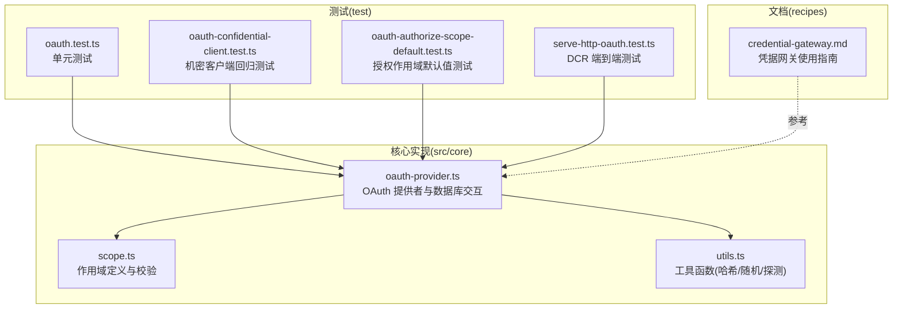
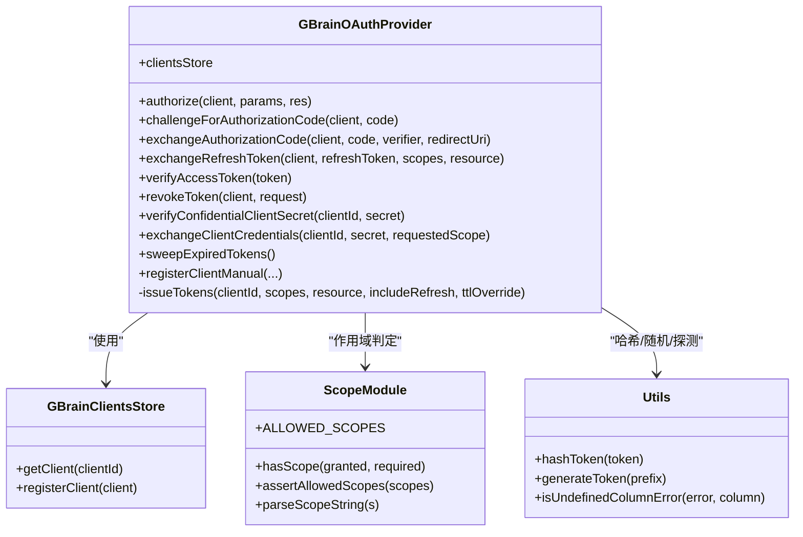
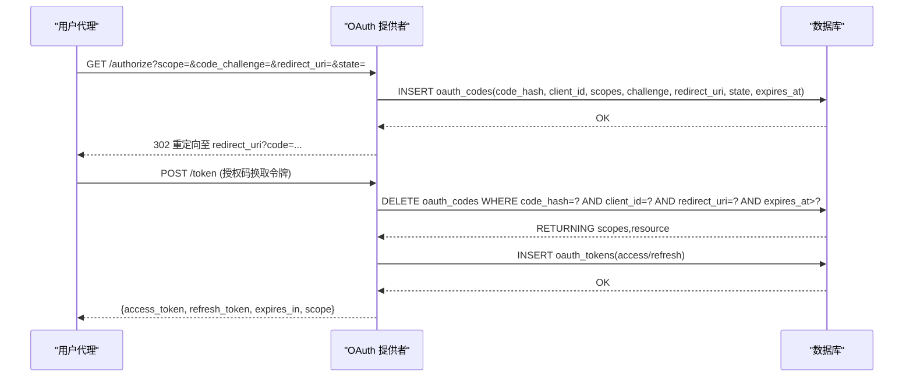
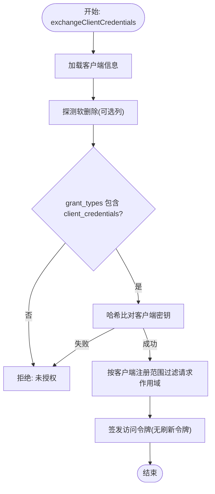
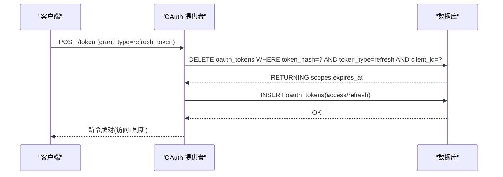
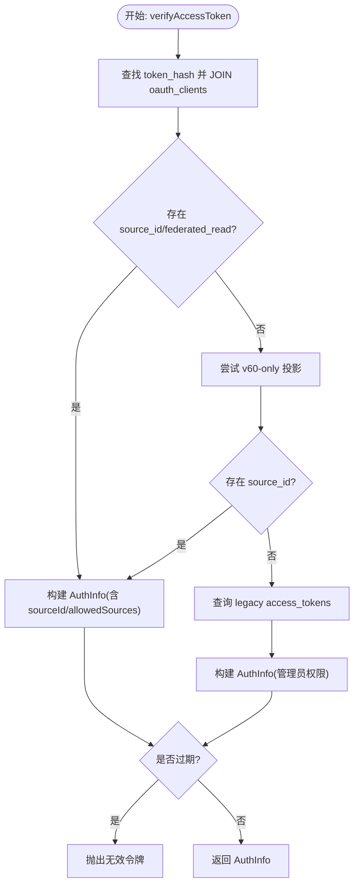
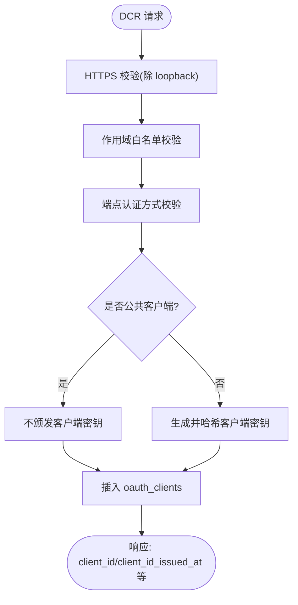
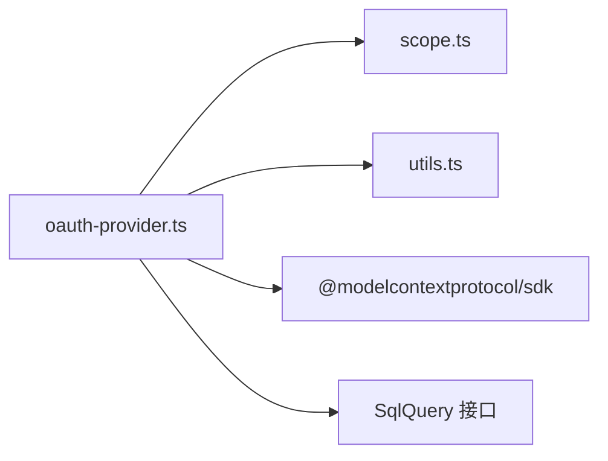

# OAuth认证机制

<cite>
**本文档引用的文件**
- [oauth-provider.ts](file://src/core/oauth-provider.ts)
- [scope.ts](file://src/core/scope.ts)
- [utils.ts](file://src/core/utils.ts)
- [oauth.test.ts](file://test/oauth.test.ts)
- [oauth-confidential-client.test.ts](file://test/oauth-confidential-client.test.ts)
- [oauth-authorize-scope-default.test.ts](file://test/oauth-authorize-scope-default.test.ts)
- [serve-http-oauth.test.ts](file://test/e2e/serve-http-oauth.test.ts)
- [credential-gateway.md](file://recipes/credential-gateway.md)
</cite>

## 目录
1. [简介](#简介)
2. [项目结构](#项目结构)
3. [核心组件](#核心组件)
4. [架构总览](#架构总览)
5. [详细组件分析](#详细组件分析)
6. [依赖关系分析](#依赖关系分析)
7. [性能考量](#性能考量)
8. [故障排除指南](#故障排除指南)
9. [结论](#结论)
10. [附录](#附录)

## 简介
本文件系统性阐述 gbrain 的 OAuth 2.1 认证机制实现，覆盖以下关键主题：
- OAuth 服务器提供者：客户端注册、授权码流程（含 PKCE）、客户端凭证流程、令牌刷新与轮换、令牌撤销
- 凭据网关安全架构：令牌哈希存储、客户端密钥验证、令牌撤销与维护清理
- 动态客户端注册（DCR）：安全边界、限制与合规校验
- 令牌生命周期管理：生成、验证、过期处理、轮换策略
- 作用域控制：层次化作用域模型、授权范围钳制、刷新时子集约束
- 安全审计与合规：跨租户隔离、原子删除、重定向 URI 校验、列缺失降级兼容
- 配置示例与最佳实践：客户端类型选择、端点认证方式、令牌 TTL 设置
- 故障排除与性能优化：常见问题定位、维护任务与调优建议

## 项目结构
围绕 OAuth 的核心代码位于 src/core，配套测试位于 test，凭据网关使用文档位于 recipes。

**图表来源**
- [oauth-provider.ts:1-990](file://src/core/oauth-provider.ts#L1-L990)
- [scope.ts:1-194](file://src/core/scope.ts#L1-L194)
- [utils.ts:1-405](file://src/core/utils.ts#L1-L405)
- [oauth.test.ts:1-1501](file://test/oauth.test.ts#L1-L1501)
- [oauth-confidential-client.test.ts:1-144](file://test/oauth-confidential-client.test.ts#L1-L144)
- [oauth-authorize-scope-default.test.ts:1-90](file://test/oauth-authorize-scope-default.test.ts#L1-L90)
- [serve-http-oauth.test.ts:423-454](file://test/e2e/serve-http-oauth.test.ts#L423-L454)
- [credential-gateway.md:1-189](file://recipes/credential-gateway.md#L1-L189)

**章节来源**
- [oauth-provider.ts:1-990](file://src/core/oauth-provider.ts#L1-L990)
- [scope.ts:1-194](file://src/core/scope.ts#L1-L194)
- [utils.ts:1-405](file://src/core/utils.ts#L1-L405)
- [oauth.test.ts:1-1501](file://test/oauth.test.ts#L1-L1501)
- [oauth-confidential-client.test.ts:1-144](file://test/oauth-confidential-client.test.ts#L1-L144)
- [oauth-authorize-scope-default.test.ts:1-90](file://test/oauth-authorize-scope-default.test.ts#L1-L90)
- [serve-http-oauth.test.ts:423-454](file://test/e2e/serve-http-oauth.test.ts#L423-L454)
- [credential-gateway.md:1-189](file://recipes/credential-gateway.md#L1-L189)

## 核心组件
- OAuth 提供者（GBrainOAuthProvider）
  - 负责授权码（PKCE）、客户端凭证、刷新令牌、令牌验证、撤销、维护清理等
  - 使用哈希存储令牌与密钥，支持可插拔 SQL 查询接口
- 客户端存储（GBrainClientsStore）
  - 实现 OAuth 已注册客户端存储接口，支持 DCR 与手动注册
  - 强制 HTTPS 重定向 URI 校验、作用域白名单、端点认证方式允许列表
- 作用域模块（scope.ts）
  - 定义允许的作用域集合与层级关系，提供 hasScope 判断与规范化
- 工具模块（utils.ts）
  - 提供 SHA-256 哈希、随机令牌生成、列缺失探测等通用能力

**章节来源**
- [oauth-provider.ts:344-990](file://src/core/oauth-provider.ts#L344-L990)
- [scope.ts:25-194](file://src/core/scope.ts#L25-L194)
- [utils.ts:8-17](file://src/core/utils.ts#L8-L17)

## 架构总览
OAuth 服务由“提供者 + 存储 + 工具 + 作用域”构成，数据持久化通过 SQL 接口抽象，支持 PGLite 与 Postgres。

**图表来源**
- [oauth-provider.ts:344-990](file://src/core/oauth-provider.ts#L344-L990)
- [scope.ts:25-194](file://src/core/scope.ts#L25-L194)
- [utils.ts:8-22](file://src/core/utils.ts#L8-L22)

## 详细组件分析

### 授权码流程（含 PKCE）
- 授权阶段
  - 生成一次性授权码与哈希，记录 code_challenge、redirect_uri、state、资源与过期时间
  - 将授权码写入 oauth_codes 表，重定向回客户端回调地址
- 交换阶段
  - 使用 RETURNING 原子删除并读取 oauth_codes，绑定 client_id 与 redirect_uri，确保单次使用与重定向一致性
  - 检查过期后签发访问令牌与刷新令牌
- 安全强化
  - F1：授权码单次使用（原子 DELETE）
  - F7c：严格校验重定向 URI 与授权时一致
  - 作用域钳制：未指定 scope 时默认为客户端注册的完整作用域，且不超限

**图表来源**
- [oauth-provider.ts:377-488](file://src/core/oauth-provider.ts#L377-L488)
- [oauth.test.ts:387-412](file://test/oauth.test.ts#L387-L412)

**章节来源**
- [oauth-provider.ts:377-488](file://src/core/oauth-provider.ts#L377-L488)
- [oauth.test.ts:387-412](file://test/oauth.test.ts#L387-L412)
- [oauth-authorize-scope-default.test.ts:69-89](file://test/oauth-authorize-scope-default.test.ts#L69-L89)

### 客户端凭证流程（CC）
- 适用场景：机器对机器（M2M），如 Perplexity、Claude 后台服务
- 流程要点
  - 先验证客户端密钥（哈希比较），再检查 grant_types 是否包含 client_credentials
  - 作用域过滤：仅返回客户端注册范围内允许的作用域
  - 不发放刷新令牌（RFC 6749 4.4.3）

**图表来源**
- [oauth-provider.ts:771-827](file://src/core/oauth-provider.ts#L771-L827)

**章节来源**
- [oauth-provider.ts:771-827](file://src/core/oauth-provider.ts#L771-L827)
- [oauth.test.ts:148-194](file://test/oauth.test.ts#L148-L194)

### 刷新令牌流程与轮换
- 核心安全特性
  - F2：原子删除刷新令牌，检测二次使用（RFC 6749 §10.4）
  - F3：刷新时请求的作用域必须是原始授权范围的子集
  - F4：撤销绑定到 client_id，防止越权撤销他人令牌
- 轮换策略
  - 成功刷新后同时签发新的访问令牌与刷新令牌，原刷新令牌作废

**图表来源**
- [oauth-provider.ts:494-546](file://src/core/oauth-provider.ts#L494-L546)
- [oauth.test.ts:548-605](file://test/oauth.test.ts#L548-L605)

**章节来源**
- [oauth-provider.ts:494-546](file://src/core/oauth-provider.ts#L494-L546)
- [oauth.test.ts:548-605](file://test/oauth.test.ts#L548-L605)

### 令牌验证与降级投影
- 优先从 oauth_tokens 验证访问令牌，JOIN oauth_clients 获取 client_name、source_id、federated_read
- 对于旧版本脑（缺少列）进行降级投影，保证向后兼容
- 旧版 access_tokens（遗留令牌）仍受支持，赋予管理员权限并设置较长有效期

**图表来源**
- [oauth-provider.ts:552-702](file://src/core/oauth-provider.ts#L552-L702)

**章节来源**
- [oauth-provider.ts:552-702](file://src/core/oauth-provider.ts#L552-L702)

### 令牌撤销与维护清理
- 撤销：基于 token_hash 与 client_id 删除 oauth_tokens 中对应行
- 维护：定期清理过期 oauth_tokens 与 oauth_codes，返回实际删除数量

**章节来源**
- [oauth-provider.ts:708-724](file://src/core/oauth-provider.ts#L708-L724)
- [oauth-provider.ts:833-846](file://src/core/oauth-provider.ts#L833-L846)

### 机密客户端密钥验证（自定义中间件路径）
- 为避免 SDK 客户端在哈希存储场景下进行明文比较，提供 verifyConfidentialClientSecret
- 用于 /token 自定义处理器在授权码/刷新流程中先做密钥验证再执行兑换
- 对软删除客户端进行探测，非“列不存在”错误需向上抛出

**章节来源**
- [oauth-provider.ts:743-769](file://src/core/oauth-provider.ts#L743-L769)
- [oauth-confidential-client.test.ts:43-107](file://test/oauth-confidential-client.test.ts#L43-L107)

### 动态客户端注册（DCR）
- 注册入口
  - CLI：信任操作员，绕过 HTTPS 与作用域白名单校验
  - 管理端：同 CLI
  - DCR 端点：强制 HTTPS 重定向 URI 校验、作用域白名单、端点认证方式允许列表
- 安全边界
  - 允许的端点认证方式：client_secret_post、client_secret_basic、none
  - 公共客户端（token_endpoint_auth_method=none）不颁发客户端密钥
  - 支持 dcrDisabled 构造选项禁用 DCR 端点（不影响 registerClientManual）

**图表来源**
- [oauth-provider.ts:223-338](file://src/core/oauth-provider.ts#L223-L338)
- [oauth-provider.ts:105-112](file://src/core/oauth-provider.ts#L105-L112)
- [serve-http-oauth.test.ts:423-454](file://test/e2e/serve-http-oauth.test.ts#L423-L454)

**章节来源**
- [oauth-provider.ts:223-338](file://src/core/oauth-provider.ts#L223-L338)
- [oauth-provider.ts:105-112](file://src/core/oauth-provider.ts#L105-L112)
- [serve-http-oauth.test.ts:423-454](file://test/e2e/serve-http-oauth.test.ts#L423-L454)

### 作用域控制与层次化模型
- 允许的作用域：read、write、admin、sources_admin、users_admin、agent
- 层级关系：admin 下推所有；write 下推 read；sources_admin 与 users_admin 互不蕴含
- 授权钳制：未指定 scope 时默认为客户端注册范围；刷新时请求作用域必须为原始授权范围子集

**章节来源**
- [scope.ts:25-86](file://src/core/scope.ts#L25-L86)
- [oauth.test.ts:875-990](file://test/oauth.test.ts#L875-L990)

### 凭据网关安全架构（外部集成参考）
- 支持 ClawVisor 网关或直接 Google OAuth
- 建议：使用 ClawVisor 简化 OAuth、令牌刷新与加密；若直连 Google，注意令牌过期与自动刷新

**章节来源**
- [credential-gateway.md:1-189](file://recipes/credential-gateway.md#L1-L189)

## 依赖关系分析
- 内聚性
  - GBrainOAuthProvider 将授权、令牌签发、验证、撤销、维护集中在一个类中，职责清晰
  - GBrainClientsStore 专注客户端元数据与 DCR
- 耦合度
  - 与作用域模块、工具模块松耦合，通过函数调用交互
  - 数据库访问通过统一的 SqlQuery 接口抽象，便于替换引擎
- 外部依赖
  - MCP SDK 的 OAuth 接口与错误类型
  - PGLite/Postgres 的 SQL 执行器

**图表来源**
- [oauth-provider.ts:16-31](file://src/core/oauth-provider.ts#L16-L31)
- [scope.ts:1-25](file://src/core/scope.ts#L1-L25)
- [utils.ts:1-10](file://src/core/utils.ts#L1-L10)

**章节来源**
- [oauth-provider.ts:16-31](file://src/core/oauth-provider.ts#L16-L31)

## 性能考量
- 原子删除与 RETURNING
  - 授权码与刷新令牌交换均采用原子 DELETE RETURNING，避免竞态并提升可观测性
- 过期清理
  - sweepExpiredTokens 返回删除计数，便于监控与告警
- 时间戳处理
  - coerceTimestamp 统一处理 BIGINT 字符串与数字，避免 NaN 导致的无效令牌
- 建议
  - 定期运行 sweepExpiredTokens 清理过期令牌
  - 合理设置 tokenTtl 与 refreshTtl，平衡安全性与用户体验
  - 在高并发刷新场景下，利用原子删除减少“幽灵成功”概率

[本节为通用指导，无需特定文件来源]

## 故障排除指南
- 常见错误与定位
  - “无效令牌/已过期”：检查 token_hash 是否正确、expires_at 是否有效、是否被清理
  - “客户端未授权”：确认 grant_types 是否包含所需授权类型
  - “作用域超出授权范围”：刷新时请求的作用域必须为原始授权范围子集
  - “重定向 URI 不匹配”：交换授权码时提供的 redirect_uri 必须与授权时一致
  - “列不存在”：新安装或迁移中的列缺失，系统会进行降级投影；请执行迁移
- 诊断步骤
  - 核对 oauth_codes 与 oauth_tokens 表中对应行是否存在与过期状态
  - 使用 verifyAccessToken 检查令牌解析与来源（oauth_clients JOIN）
  - 若涉及 DCR，检查 redirect_uris 是否为 HTTPS（loopback 例外）

**章节来源**
- [oauth-provider.ts:552-702](file://src/core/oauth-provider.ts#L552-L702)
- [oauth.test.ts:1088-1186](file://test/oauth.test.ts#L1088-L1186)
- [oauth.test.ts:875-990](file://test/oauth.test.ts#L875-L990)

## 结论
gbrain 的 OAuth 2.1 实现通过严格的原子操作、作用域层次化模型与多层安全边界，提供了高可用、可审计且向前兼容的认证基础设施。结合 DCR 的安全约束与凭据网关的最佳实践，可在保障安全的同时简化集成与运维成本。

[本节为总结性内容，无需特定文件来源]

## 附录

### OAuth 客户端配置示例与最佳实践
- 机密客户端（授权码/刷新）
  - 端点认证方式：client_secret_basic 或 client_secret_post
  - 重定向 URI：生产环境使用 HTTPS，本地开发可使用 loopback
  - 作用域：最小授权原则，按需申请
- 公共客户端（PKCE）
  - 端点认证方式：none
  - 不颁发客户端密钥，使用浏览器端 PKCE 流程
- 客户端凭证
  - 适用于后台服务，不发放刷新令牌
  - 严格过滤作用域，避免过度授权

**章节来源**
- [oauth-provider.ts:56-81](file://src/core/oauth-provider.ts#L56-L81)
- [oauth-provider.ts:223-338](file://src/core/oauth-provider.ts#L223-L338)
- [oauth.test.ts:148-194](file://test/oauth.test.ts#L148-L194)

### 令牌生命周期管理清单
- 生成：issueTokens 生成访问令牌与可选刷新令牌，记录 scopes、expires_at、resource
- 验证：verifyAccessToken 优先从 oauth_tokens 解析，必要时降级到 legacy access_tokens
- 刷新：原子删除并轮换，请求作用域不得扩大
- 撤销：按 client_id 与 token_hash 删除
- 清理：定期 sweepExpiredTokens

**章节来源**
- [oauth-provider.ts:947-990](file://src/core/oauth-provider.ts#L947-L990)
- [oauth-provider.ts:552-702](file://src/core/oauth-provider.ts#L552-L702)
- [oauth-provider.ts:494-546](file://src/core/oauth-provider.ts#L494-L546)
- [oauth-provider.ts:708-724](file://src/core/oauth-provider.ts#L708-L724)
- [oauth-provider.ts:833-846](file://src/core/oauth-provider.ts#L833-L846)