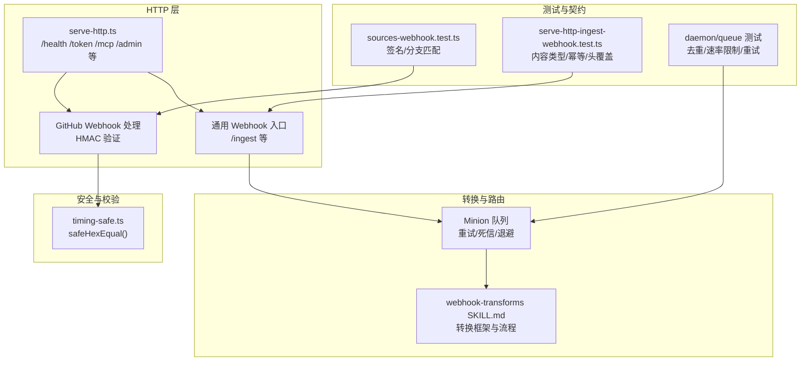
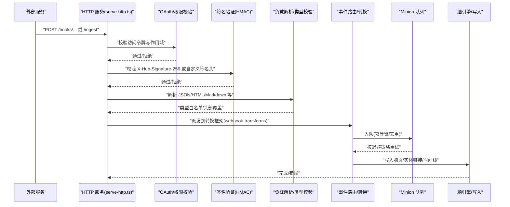
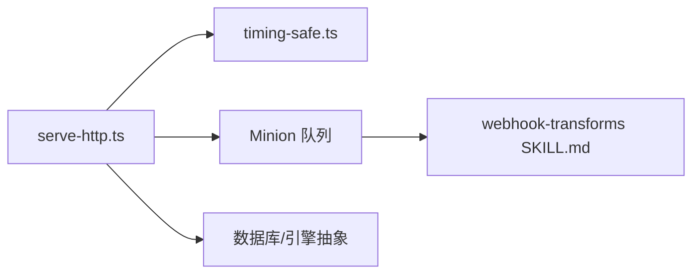

# Webhook集成

<cite>
**本文引用的文件**
- [serve-http.ts](file://src/commands/serve-http.ts)
- [timing-safe.ts](file://src/core/timing-safe.ts)
- [webhook-transforms SKILL.md](file://skills/webhook-transforms/README.md)
- [meeting-webhooks 文档](file://docs/integrations/meeting-webhooks.md)
- [sources-webhook.test.ts](file://test/sources-webhook.test.ts)
- [serve-http-ingest-webhook.test.ts](file://test/e2e/serve-http-ingest-webhook.test.ts)
- [minions 队列测试](file://test/minions.test.ts)
- [dedup 去重测试](file://test/ingestion/dedup.test.ts)
- [daemon 管理器测试](file://test/ingestion/daemon.test.ts)
</cite>

## 目录
1. [简介](#简介)
2. [项目结构](#项目结构)
3. [核心组件](#核心组件)
4. [架构总览](#架构总览)
5. [详细组件分析](#详细组件分析)
6. [依赖关系分析](#依赖关系分析)
7. [性能考量](#性能考量)
8. [故障排除指南](#故障排除指南)
9. [结论](#结论)
10. [附录](#附录)

## 简介
本文件系统化阐述 gbrain 的 Webhook 集成方案，覆盖接收与处理机制（签名验证、负载解析、事件路由）、会议同步与邮件导入等典型场景、配置模板与安全最佳实践、事件过滤/去重与幂等性保障、错误重试/死信队列与监控告警、第三方服务集成示例与排障建议。读者可据此在生产环境中安全、可靠地接入外部系统的 Webhook 事件，并将其转化为 gbrain 内部的“可索引事实”。

## 项目结构
围绕 Webhook 的关键代码与文档分布如下：
- HTTP 服务与路由：位于命令层，提供健康检查、OAuth、MCP 工具调用、以及 Webhook 接收端点。
- 安全工具：常量时间比较函数，用于 HMAC 签名验证。
- 转换框架：通用的 webhook-transforms 技能，定义了从外部事件到脑内页面的标准流程。
- 集成指南：会议/通话 Webhook 的官方集成文档。
- 测试与契约：端到端与单元测试，覆盖签名验证、内容类型白名单、幂等性、去重与队列重试策略。

图表来源
- [serve-http.ts](file://src/commands/serve-http.ts)
- [timing-safe.ts](file://src/core/timing-safe.ts)
- [webhook-transforms SKILL.md](file://skills/webhook-transforms/README.md)
- [sources-webhook.test.ts](file://test/sources-webhook.test.ts)
- [serve-http-ingest-webhook.test.ts](file://test/e2e/serve-http-ingest-webhook.test.ts)
- [minions 队列测试](file://test/minions.test.ts)

章节来源
- [serve-http.ts](file://src/commands/serve-http.ts)
- [timing-safe.ts](file://src/core/timing-safe.ts)
- [webhook-transforms SKILL.md](file://skills/webhook-transforms/README.md)
- [meeting-webhooks 文档](file://docs/integrations/meeting-webhooks.md)
- [sources-webhook.test.ts](file://test/sources-webhook.test.ts)
- [serve-http-ingest-webhook.test.ts](file://test/e2e/serve-http-ingest-webhook.test.ts)
- [minions 队列测试](file://test/minions.test.ts)
- [dedup 去重测试](file://test/ingestion/dedup.test.ts)
- [daemon 管理器测试](file://test/ingestion/daemon.test.ts)

## 核心组件
- HTTP 服务与路由
  - 提供健康检查、OAuth 授权与令牌发放、MCP 工具调用入口，以及 Webhook 接收端点。
  - Webhook 入口支持内容类型白名单、头部覆盖（如 X-Gbrain-Slug、X-Gbrain-Content-Type）与幂等性键生成。
- 签名验证
  - 使用常量时间比较函数进行 HMAC-SHA256 校验，确保拒绝格式不正确或被篡改的请求。
- 转换框架
  - webhook-transforms 技能定义“输入原始负载 → 输出脑页 + 引用”的标准流程；失败时写入死信目录并重试一次。
- 队列与重试
  - 基于 Minion 队列的作业模型，支持指数/固定退避、抖动、挂起检测与死信处理，保障可靠性与可观测性。

章节来源
- [serve-http.ts](file://src/commands/serve-http.ts)
- [timing-safe.ts](file://src/core/timing-safe.ts)
- [webhook-transforms SKILL.md](file://skills/webhook-transforms/README.md)
- [minions 队列测试](file://test/minions.test.ts)

## 架构总览
下图展示 Webhook 从外部服务到 gbrain 内部的事实注入路径，包括鉴权、签名验证、负载解析、路由与持久化。

图表来源
- [serve-http.ts](file://src/commands/serve-http.ts)
- [timing-safe.ts](file://src/core/timing-safe.ts)
- [webhook-transforms SKILL.md](file://skills/webhook-transforms/README.md)
- [minions 队列测试](file://test/minions.test.ts)

## 详细组件分析

### Webhook 接收与路由（HTTP 层）
- 端点职责
  - /health：健康探针，带超时保护。
  - /token：OAuth 客户端凭证发放，支持客户端凭据授权。
  - /mcp：MCP 工具调用入口，基于 Bearer Token 与作用域控制。
  - /ingest：通用 Webhook 入口，支持内容类型白名单、头部覆盖与幂等性。
- 关键行为
  - 内容类型白名单：仅接受特定 MIME 类型；未知 text/* 子类型映射为 text/plain；二进制类型返回 415 并提示后续处理器。
  - 头部覆盖：X-Gbrain-Content-Type 可覆盖请求的 Content-Type；X-Gbrain-Slug 作为页面 slug 提示。
  - 幂等性：基于 (client_id, content_hash) 计算队列幂等键，重复内容返回相同 job_id。
- 错误与状态码
  - 缺失/无效令牌：401/403。
  - 空体/非法 JSON：400。
  - 不在白名单的内容类型：415。
  - 成功：200/202，返回 job_id。

章节来源
- [serve-http.ts](file://src/commands/serve-http.ts)
- [serve-http-ingest-webhook.test.ts](file://test/e2e/serve-http-ingest-webhook.test.ts)

### 签名验证（HMAC-SHA256）
- GitHub 风格签名
  - 格式为 sha256=<64 十六进制>；必须以 sha256= 前缀开头，否则直接拒绝。
  - 使用常量时间比较函数避免时序攻击。
- 分支/引用匹配
  - 对推送事件，仅当 incoming ref 精确匹配 tracked_branch 的 refs/heads/<branch> 时才处理，防止跨分支误触发。

章节来源
- [sources-webhook.test.ts](file://test/sources-webhook.test.ts)
- [timing-safe.ts](file://src/core/timing-safe.ts)

### 负载解析与事件路由
- 解析策略
  - JSON：严格解析；非法 JSON 返回 400。
  - HTML/Markdown：按白名单接受；HTML 进行安全剥离与大小限制。
  - 自定义头部覆盖：允许在请求中通过 X-Gbrain-Content-Type 指定实际内容类型。
- 路由与转换
  - 将标准化后的事件交由 webhook-transforms 技能进行转换：输出脑页内容、元数据、引用与实体提取。
  - 失败时记录原始负载至死信目录，并重试一次。

章节来源
- [webhook-transforms SKILL.md](file://skills/webhook-transforms/README.md)
- [serve-http-ingest-webhook.test.ts](file://test/e2e/serve-http-ingest-webhook.test.ts)

### 事件过滤、去重与幂等性
- 过滤
  - 内容类型白名单；未知 text/* 映射为 text/plain；二进制类型 415。
  - GitHub 推送事件仅接受精确匹配的 refs/heads/<branch>。
- 去重
  - 基于 DedupWindow 的 24 小时窗口与 content_hash 去重，窗口内重复静默丢弃。
- 幂等性
  - 队列幂等键：ingest:webhook:{clientId}:{contentHash}，相同输入与客户端返回相同 job_id。

章节来源
- [dedup 去重测试](file://test/ingestion/dedup.test.ts)
- [daemon 管理器测试](file://test/ingestion/daemon.test.ts)
- [serve-http-ingest-webhook.test.ts](file://test/e2e/serve-http-ingest-webhook.test.ts)

### 错误重试、死信队列与监控告警
- 重试策略
  - 支持指数/固定退避与抖动；最大尝试次数可配置；挂起检测自动重入等待队列。
- 死信处理
  - 达到最大尝试次数或挂起计数阈值后进入死信；墙钟超时路径视为不可恢复，直接死信。
- 监控与可观测性
  - 队列作业状态（waiting/delayed/running/dead/stalled）与重试统计可用于告警。
  - 去重命中率与速率限制状态可用于健康检查与运维仪表盘。

章节来源
- [minions 队列测试](file://test/minions.test.ts)
- [daemon 管理器测试](file://test/ingestion/daemon.test.ts)

### 典型集成场景

#### 会议同步（Circleback/Quo）
- Circleback
  - Webhook URL：{your_agent_gateway}/hooks/circleback-meetings
  - 签名：X-Circleback-Signature: sha256=<hex>
  - 流程：签名校验 → 转换规范化 → 拉取完整转录 → 创建会议页 → 实体链接 → 提交仓库 → gbrain sync
- Quo（OpenPhone）
  - Webhook 事件：message.received、call.completed、call.summary.completed、call.transcript.completed
  - API：Authorization 使用裸 API Key（无 Bearer 前缀），提供发送短信、查询消息与通话转录等端点
  - 流程：签名校验 → 转换 → 写入脑页/实体链接 → 同步

章节来源
- [meeting-webhooks 文档](file://docs/integrations/meeting-webhooks.md)

#### 邮件导入
- HTML 邮件正文剥离采用六阶段管道，限制输入大小以防范 ReDoS。
- 典型流程：签名校验 → 解析/剥离 HTML → 写入脑页 → 实体提取与交叉链接 → 同步。

章节来源
- [serve-http.ts](file://src/commands/serve-http.ts)

## 依赖关系分析
- 组件耦合
  - serve-http.ts 依赖 timing-safe.ts 进行签名验证；依赖 Minion 队列实现重试与死信。
  - webhook-transforms 技能依赖 gbrain 的写页与实体抽取能力。
- 外部依赖
  - Express、CORS、速率限制中间件、MCP SDK、PostgreSQL（通过引擎抽象）。
- 循环依赖
  - 未见循环依赖迹象；模块边界清晰。

图表来源
- [serve-http.ts](file://src/commands/serve-http.ts)
- [timing-safe.ts](file://src/core/timing-safe.ts)
- [webhook-transforms SKILL.md](file://skills/webhook-transforms/README.md)

章节来源
- [serve-http.ts](file://src/commands/serve-http.ts)
- [timing-safe.ts](file://src/core/timing-safe.ts)
- [webhook-transforms SKILL.md](file://skills/webhook-transforms/README.md)

## 性能考量
- 健康检查超时与探活分离：/health 使用较短超时，避免与编排器超时竞争；纯 SQL 探活用于快速就绪判断。
- 队列并发与租约压力：对速率租约不足的场景，应避免将 attempts_made 递增，减少不必要的死信。
- 内容类型与解析成本：白名单与头部覆盖降低解析歧义；HTML 剥离设置上限，避免大体积输入导致内存与 CPU 峰值。
- 去重窗口：24 小时窗口平衡重复防护与内存占用；可根据业务调整 TTL。

章节来源
- [serve-http.ts](file://src/commands/serve-http.ts)
- [minions 队列测试](file://test/minions.test.ts)
- [daemon 管理器测试](file://test/ingestion/daemon.test.ts)

## 故障排除指南
- 401/403：确认 OAuth 客户端凭据与作用域；客户端凭据需具备写入权限。
- 400：检查请求体是否为空或 JSON 非法；确保必要的字段存在。
- 415：确认 Content-Type 在白名单内；未知 text/* 会映射为 text/plain；二进制类型需后续处理器。
- 签名失败：核对签名前缀与算法；使用常量时间比较函数；确保密钥一致且未被篡改。
- 幂等性问题：确认同一内容与客户端是否产生相同 content_hash；检查队列幂等键生成逻辑。
- 去重未生效：检查 DedupWindow 的 TTL 与来源种类；确保 content_hash 一致。
- 队列死信：查看 attempts_made 与 stalled_counter；评估退避参数与最大尝试次数；关注挂起与墙钟超时路径。

章节来源
- [serve-http-ingest-webhook.test.ts](file://test/e2e/serve-http-ingest-webhook.test.ts)
- [sources-webhook.test.ts](file://test/sources-webhook.test.ts)
- [dedup 去重测试](file://test/ingestion/dedup.test.ts)
- [minions 队列测试](file://test/minions.test.ts)

## 结论
gbrain 的 Webhook 集成以 HTTP 服务为核心，结合严格的签名验证、内容类型白名单、头部覆盖与幂等性设计，配合 Minion 队列的重试/死信与可观测性，形成一套安全、可靠且可扩展的事件处理流水线。通过 webhook-transforms 技能，外部事件可被统一转换为脑内页面与实体链接，支撑后续检索与推理。建议在生产部署中遵循本文的安全最佳实践与排障指引，持续优化队列退避与去重策略，确保高吞吐下的稳定性。

## 附录

### Webhook 配置模板（示例）
- 通用 Webhook 入口
  - URL：{your_agent_gateway}/ingest
  - 认证：Bearer Token（写作用域）
  - 头部覆盖：
    - X-Gbrain-Content-Type：强制内容类型（如 text/markdown）
    - X-Gbrain-Slug：目标页面 slug 提示
- GitHub 集成
  - URL：{your_agent_gateway}/webhooks/github
  - 签名头：X-Hub-Signature-256
  - 密钥：在服务端存储并用于常量时间比较
- Circleback 集成
  - URL：{your_agent_gateway}/hooks/circleback-meetings
  - 签名头：X-Circleback-Signature
  - 密钥：在服务端存储并用于 HMAC-SHA256 校验
- Quo（OpenPhone）集成
  - URL：{your_agent_gateway}/hooks/quo-events
  - 事件类型：message.received、call.completed、call.summary.completed、call.transcript.completed
  - API 认证：Authorization: {api_key}

章节来源
- [serve-http.ts](file://src/commands/serve-http.ts)
- [meeting-webhooks 文档](file://docs/integrations/meeting-webhooks.md)

### 安全最佳实践
- 始终启用 HTTPS 与强签名（HMAC-SHA256），拒绝无前缀或格式错误的签名。
- 使用最小权限的 OAuth 客户端凭据，仅授予必要作用域。
- 对 HTML 输入进行剥离与大小限制，防范 XSS 与 ReDoS。
- 保留原始负载副本（死信目录）以便审计与重放。
- 监控队列状态与健康指标，设置告警阈值（重试次数、挂起计数、去重命中率）。

章节来源
- [timing-safe.ts](file://src/core/timing-safe.ts)
- [webhook-transforms SKILL.md](file://skills/webhook-transforms/README.md)
- [serve-http.ts](file://src/commands/serve-http.ts)