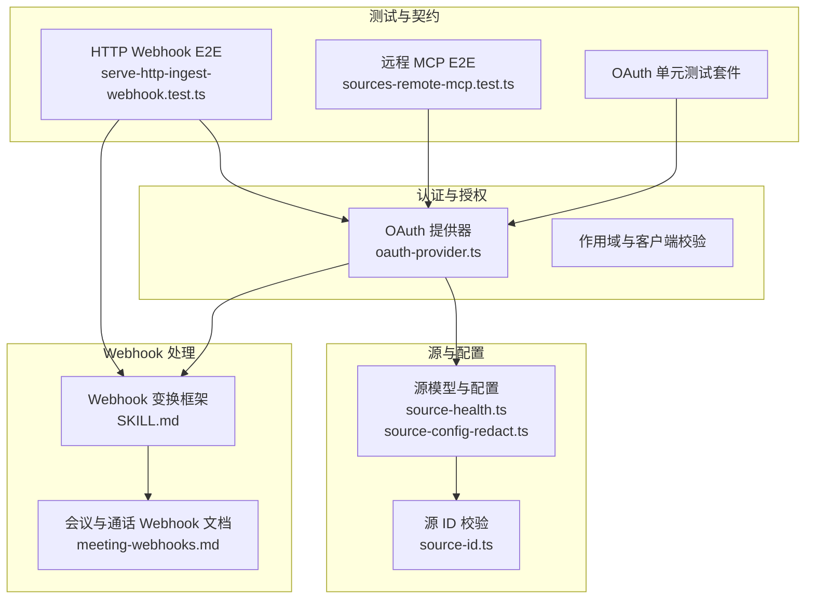
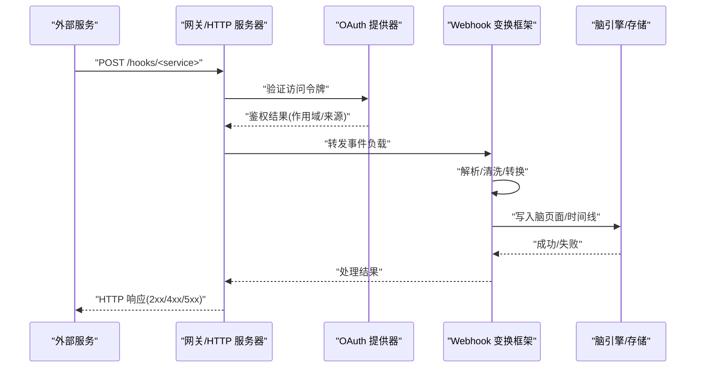
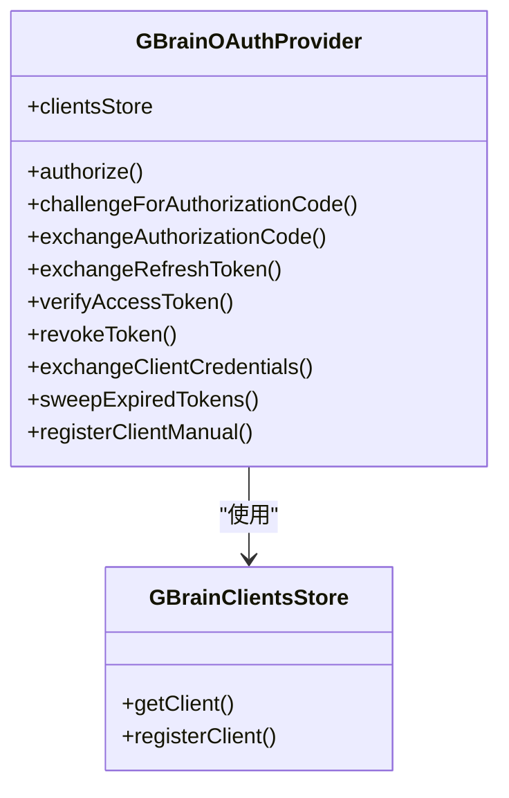
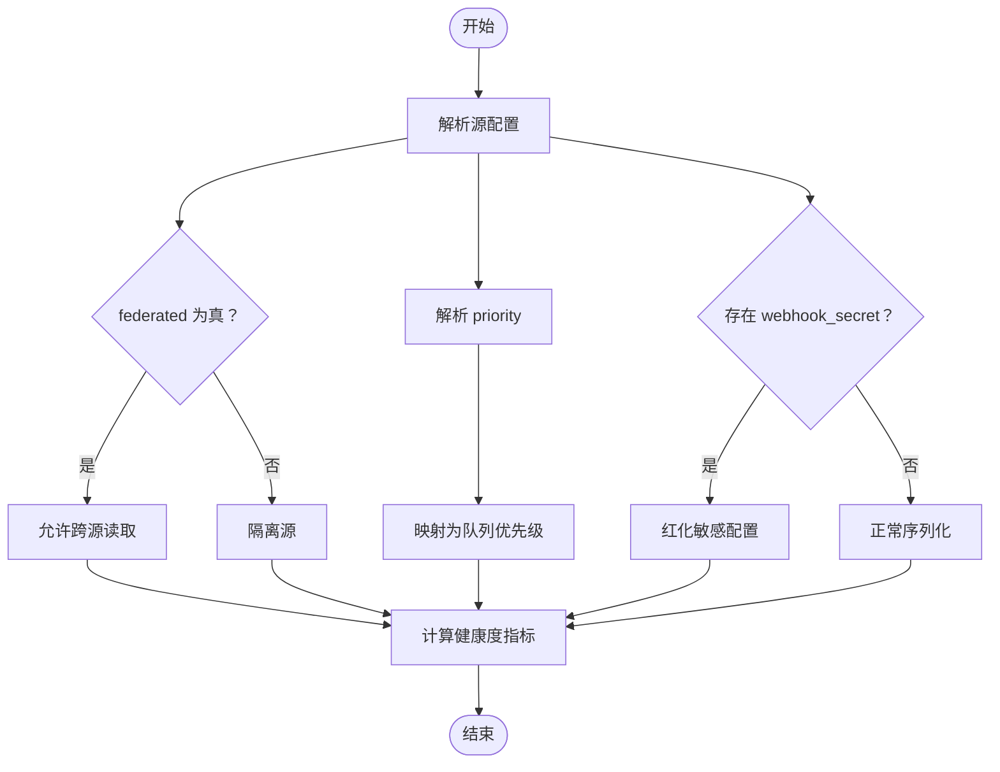
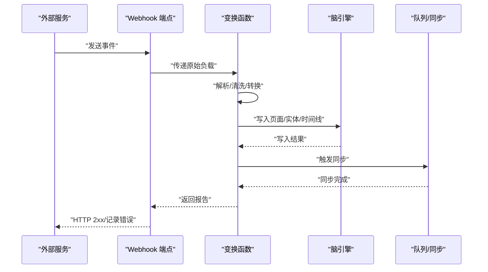
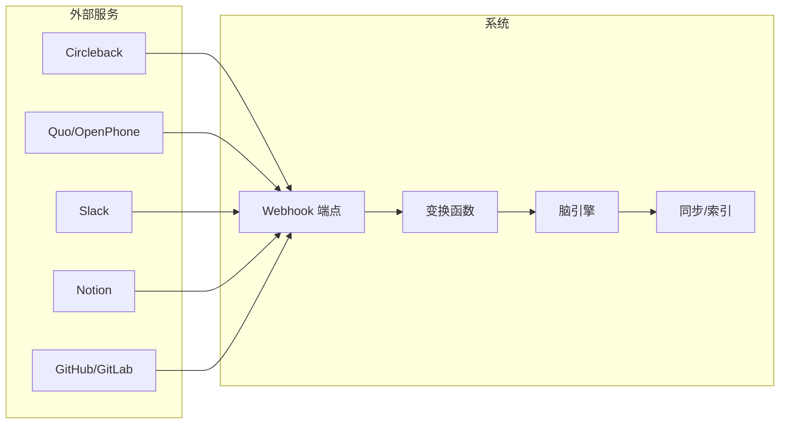
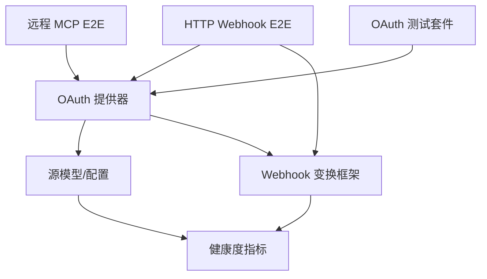

# 第三方服务集成

<cite>
**本文档引用的文件**
- [oauth-provider.ts](file://src/core/oauth-provider.ts)
- [source-config-redact.ts](file://src/core/source-config-redact.ts)
- [source-health.ts](file://src/core/source-health.ts)
- [source-id.ts](file://src/core/source-id.ts)
- [meeting-webhooks.md](file://docs/integrations/meeting-webhooks.md)
- [SKILL.md](file://skills/webhook-transforms/SKILL.md)
- [serve-http-ingest-webhook.test.ts](file://test/e2e/serve-http-ingest-webhook.test.ts)
- [sources-remote-mcp.test.ts](file://test/e2e/sources-remote-mcp.test.ts)
- [oauth.test.ts](file://test/oauth.test.ts)
- [oauth-authorize-scope-default.test.ts](file://test/oauth-authorize-scope-default.test.ts)
- [oauth-confidential-client.test.ts](file://test/oauth-confidential-client.test.ts)
- [oauth-scope-probe.test.ts](file://test/oauth-scope-probe.test.ts)
- [multi-source.test.ts](file://test/e2e/multi-source.test.ts)
- [source-config-redact.test.ts](file://test/source-config-redact.test.ts)
</cite>

## 目录
1. [简介](#简介)
2. [项目结构](#项目结构)
3. [核心组件](#核心组件)
4. [架构总览](#架构总览)
5. [详细组件分析](#详细组件分析)
6. [依赖关系分析](#依赖关系分析)
7. [性能考虑](#性能考虑)
8. [故障排除指南](#故障排除指南)
9. [结论](#结论)
10. [附录](#附录)

## 简介
本文件面向需要在系统中集成第三方服务（如 GitHub、GitLab、Notion、Slack 等）的工程师与运维人员，提供从认证授权、API 调用、数据同步到可观测性与错误处理的完整技术文档。文档基于仓库中的 OAuth 提供器、Webhook 处理框架、源配置与健康检查等核心能力，给出可复用的集成范式、配置模板与最佳实践。

## 项目结构
围绕第三方服务集成的关键模块包括：
- 认证与授权：OAuth 2.1 提供器，支持客户端凭证流与 PKCE 授权码流，令牌发放、刷新与吊销。
- 源与配置：统一的源模型、配置红化、优先级与健康度指标。
- Webhook 处理：通用事件转换框架，标准化外部事件到脑内页面的流程。
- 测试与契约：端到端测试覆盖 HTTP 入口、OAuth 合约与 Webhook 行为。

**图表来源**
- [oauth-provider.ts:1-990](file://src/core/oauth-provider.ts#L1-L990)
- [source-health.ts:1-336](file://src/core/source-health.ts#L1-L336)
- [source-config-redact.ts:1-48](file://src/core/source-config-redact.ts#L1-L48)
- [source-id.ts:1-55](file://src/core/source-id.ts#L1-L55)
- [SKILL.md:1-84](file://skills/webhook-transforms/SKILL.md#L1-L84)
- [meeting-webhooks.md:1-64](file://docs/integrations/meeting-webhooks.md#L1-L64)
- [serve-http-ingest-webhook.test.ts:1-295](file://test/e2e/serve-http-ingest-webhook.test.ts#L1-L295)
- [sources-remote-mcp.test.ts:109-198](file://test/e2e/sources-remote-mcp.test.ts#L109-L198)
- [oauth.test.ts](file://test/oauth.test.ts)

**章节来源**
- [oauth-provider.ts:1-990](file://src/core/oauth-provider.ts#L1-L990)
- [source-health.ts:1-336](file://src/core/source-health.ts#L1-L336)
- [source-config-redact.ts:1-48](file://src/core/source-config-redact.ts#L1-L48)
- [source-id.ts:1-55](file://src/core/source-id.ts#L1-L55)
- [SKILL.md:1-84](file://skills/webhook-transforms/SKILL.md#L1-L84)
- [meeting-webhooks.md:1-64](file://docs/integrations/meeting-webhooks.md#L1-L64)
- [serve-http-ingest-webhook.test.ts:1-295](file://test/e2e/serve-http-ingest-webhook.test.ts#L1-L295)
- [sources-remote-mcp.test.ts:109-198](file://test/e2e/sources-remote-mcp.test.ts#L109-L198)
- [oauth.test.ts](file://test/oauth.test.ts)

## 核心组件
- OAuth 2.1 提供器：支持客户端凭证流与 PKCE 授权码流；令牌发放、刷新与吊销；兼容旧版访问令牌回退。
- 源与配置：统一的源模型，支持联邦读取、隔离与优先级；配置红化防止敏感信息泄露；健康度指标用于可观测性。
- Webhook 处理框架：定义事件转换契约，保证输入清洗、实体抽取与错误重试；提供多种外部服务集成示例。
- 测试与契约：通过端到端测试覆盖 HTTP 入口、OAuth 合约与 Webhook 行为，确保集成稳定性。

**章节来源**
- [oauth-provider.ts:1-990](file://src/core/oauth-provider.ts#L1-L990)
- [source-health.ts:1-336](file://src/core/source-health.ts#L1-L336)
- [source-config-redact.ts:1-48](file://src/core/source-config-redact.ts#L1-L48)
- [SKILL.md:1-84](file://skills/webhook-transforms/SKILL.md#L1-L84)

## 架构总览
下图展示了第三方服务集成的整体架构：外部服务通过 Webhook 或 API 发起请求，系统使用 OAuth 进行认证与授权，随后通过 Webhook 变换框架进行事件转换并写入脑内页面，最终由同步流程完成持久化与索引。

**图表来源**
- [oauth-provider.ts:552-702](file://src/core/oauth-provider.ts#L552-L702)
- [SKILL.md:39-51](file://skills/webhook-transforms/SKILL.md#L39-L51)
- [serve-http-ingest-webhook.test.ts:184-194](file://test/e2e/serve-http-ingest-webhook.test.ts#L184-L194)

## 详细组件分析

### OAuth 2.1 提供器
- 支持的授权方式
  - 客户端凭证流：适用于机器对机器场景（如 Perplexity、Claude），无需用户交互。
  - 授权码流（PKCE）：适用于浏览器或桌面应用，增强安全性。
- 令牌管理
  - 访问令牌与刷新令牌发放；支持按客户端配置的 TTL 覆盖。
  - 刷新令牌严格绑定客户端 ID，防止跨客户端滥用。
  - 过期令牌清理与吊销。
- 客户端注册
  - 动态客户端注册（DCR）支持，限制允许的 token_endpoint_auth_method 与 redirect_uri。
  - 兼容旧版 access_tokens 回退，确保平滑迁移。
- 作用域与来源隔离
  - 验证与限制请求的作用域，确保不超过客户端注册范围。
  - 支持 source_id 与 federated_read 的来源隔离，满足多源联邦读取需求。

**图表来源**
- [oauth-provider.ts:344-990](file://src/core/oauth-provider.ts#L344-L990)

**章节来源**
- [oauth-provider.ts:344-990](file://src/core/oauth-provider.ts#L344-L990)
- [oauth.test.ts](file://test/oauth.test.ts)
- [oauth-authorize-scope-default.test.ts](file://test/oauth-authorize-scope-default.test.ts)
- [oauth-confidential-client.test.ts](file://test/oauth-confidential-client.test.ts)
- [oauth-scope-probe.test.ts](file://test/oauth-scope-probe.test.ts)

### 源与配置管理
- 源模型与配置
  - 支持 federated 字段控制是否启用联邦读取，默认新源为隔离。
  - 支持 tracked_branch、priority 等配置项，影响同步与队列调度。
- 配置红化
  - 对 webhook_secret 等敏感键进行红化输出，避免在日志或 API 中泄露。
- 健康度指标
  - 统计页面数、块数、嵌入覆盖率、最近同步时间、队列深度、失败任务数等。
  - 支持本地与远程两种滞后计算路径，兼顾性能与准确性。

**图表来源**
- [source-health.ts:208-277](file://src/core/source-health.ts#L208-L277)
- [source-config-redact.ts:25-47](file://src/core/source-config-redact.ts#L25-L47)
- [multi-source.test.ts:421-452](file://test/e2e/multi-source.test.ts#L421-L452)

**章节来源**
- [source-health.ts:1-336](file://src/core/source-health.ts#L1-L336)
- [source-config-redact.ts:1-48](file://src/core/source-config-redact.ts#L1-L48)
- [multi-source.test.ts:421-452](file://test/e2e/multi-source.test.ts#L421-L452)
- [source-config-redact.test.ts:1-54](file://test/source-config-redact.test.ts#L1-L54)

### Webhook 处理框架
- 事件转换契约
  - 输入：外部事件原始负载（JSON）
  - 输出：脑页面内容（Markdown）+ 元数据（slug、类型、引用）
  - 必须进行输入清洗，禁止将原始 HTML/脚本写入脑页面
- 处理流程
  - 解析负载 → 执行转换函数 → 写入脑页面 → 实体抽取与丰富 → 添加时间线条目 → 同步
- 错误处理
  - 转换失败时记录原始负载至死信队列，上报错误类型并重试一次
  - 不丢失事件

**图表来源**
- [SKILL.md:39-51](file://skills/webhook-transforms/SKILL.md#L39-L51)
- [meeting-webhooks.md:1-64](file://docs/integrations/meeting-webhooks.md#L1-L64)

**章节来源**
- [SKILL.md:1-84](file://skills/webhook-transforms/SKILL.md#L1-L84)
- [meeting-webhooks.md:1-64](file://docs/integrations/meeting-webhooks.md#L1-L64)

### 外部服务集成示例与规范
- 会议与通话 Webhook（Circleback、Quo/OpenPhone）
  - Circleback：会议完成后触发 Webhook，使用 HMAC-SHA256 签名验证；支持动态客户端注册获取访问令牌。
  - Quo/OpenPhone：短信与通话事件触发 Webhook，使用裸 API Key（无 Bearer 前缀）进行认证。
- Slack 集成
  - 使用 Webhook 将消息事件转换为脑内页面，结合实体抽取与时间线更新。
- Notion 集成
  - 通过 Webhook 或 API 将页面变更事件转换为脑内页面，支持引用与反向链接。
- Git 仓库集成（GitHub/GitLab）
  - 通过 Webhook 获取提交事件，转换为脑内页面并触发同步；支持签名验证与错误重试。

**图表来源**
- [meeting-webhooks.md:1-64](file://docs/integrations/meeting-webhooks.md#L1-L64)
- [SKILL.md:53-71](file://skills/webhook-transforms/SKILL.md#L53-L71)

**章节来源**
- [meeting-webhooks.md:1-64](file://docs/integrations/meeting-webhooks.md#L1-L64)
- [SKILL.md:53-71](file://skills/webhook-transforms/SKILL.md#L53-L71)

## 依赖关系分析
- 认证层依赖于源模型与来源隔离配置，确保令牌携带正确的 source_id 与 federated_read。
- Webhook 处理框架依赖于 OAuth 提供器进行访问控制，依赖源健康度指标进行优先级调度。
- 测试用例覆盖了 OAuth 合约、HTTP Webhook 行为与远程 MCP 场景，确保集成稳定性。

**图表来源**
- [oauth-provider.ts:552-702](file://src/core/oauth-provider.ts#L552-L702)
- [source-health.ts:208-277](file://src/core/source-health.ts#L208-L277)
- [serve-http-ingest-webhook.test.ts:1-295](file://test/e2e/serve-http-ingest-webhook.test.ts#L1-L295)
- [sources-remote-mcp.test.ts:109-198](file://test/e2e/sources-remote-mcp.test.ts#L109-L198)
- [oauth.test.ts](file://test/oauth.test.ts)

**章节来源**
- [oauth-provider.ts:552-702](file://src/core/oauth-provider.ts#L552-L702)
- [source-health.ts:208-277](file://src/core/source-health.ts#L208-L277)
- [serve-http-ingest-webhook.test.ts:1-295](file://test/e2e/serve-http-ingest-webhook.test.ts#L1-L295)
- [sources-remote-mcp.test.ts:109-198](file://test/e2e/sources-remote-mcp.test.ts#L109-L198)
- [oauth.test.ts](file://test/oauth.test.ts)

## 性能考虑
- 批量查询与聚合
  - 健康度指标采用批量 GROUP BY 查询，减少 N 次往返开销，显著提升仪表盘与诊断工具的响应速度。
- 队列优先级与资源控制
  - 通过源配置的 priority 映射到队列优先级，结合最大并发与预算上限，避免单源占用过多资源。
- 同步策略
  - 支持增量同步与回填作业分离，降低高峰时段压力；失败任务与队列深度监控帮助快速定位瓶颈。
- 缓存与去重
  - Webhook 队列对相同内容进行去重，避免重复处理；HTTP 入口对空体与不支持的 Content-Type 进行快速拒绝，减少无效负载。

**章节来源**
- [source-health.ts:8-23](file://src/core/source-health.ts#L8-L23)
- [source-health.ts:208-277](file://src/core/source-health.ts#L208-L277)

## 故障排除指南
- OAuth 认证失败
  - 检查客户端注册的 token_endpoint_auth_method 与 redirect_uri 是否符合要求。
  - 确认作用域未超出客户端注册范围；刷新令牌的作用域必须为原授予范围的子集。
  - 若使用旧版访问令牌，请确认权限字段包含正确的 source_id 或数组形式的 allowedSources。
- Webhook 处理异常
  - 转换失败会记录原始负载至死信队列，检查该队列以定位问题；确保输入清洗与实体抽取步骤正确执行。
  - 对于 Circleback 等服务，确认签名验证头与密钥配置正确。
- 源健康度异常
  - 关注 failed_jobs_24h 与 queue_depth 指标，必要时调整源的 priority 与同步频率。
  - 对于 Git 仓库源，检查 tracked_branch 与本地路径可达性，确保 git 子进程可用。
- 权限与来源隔离
  - 确保客户端具备所需的 federated_read 权限；对于隔离源，仅能访问其自身数据。

**章节来源**
- [oauth-provider.ts:552-702](file://src/core/oauth-provider.ts#L552-L702)
- [SKILL.md:47-51](file://skills/webhook-transforms/SKILL.md#L47-L51)
- [source-health.ts:29-52](file://src/core/source-health.ts#L29-L52)

## 结论
通过统一的 OAuth 提供器、源模型与 Webhook 处理框架，系统能够安全、稳定地集成多种第三方服务。配合健康度指标与测试用例，可以实现可观测性、可维护性与可扩展性的平衡。建议在生产环境中遵循本文档的配置模板与最佳实践，确保认证安全、数据一致性与性能表现。

## 附录

### 集成配置模板与环境变量
- OAuth 客户端注册
  - 必填：client_name、grant_types、scope、token_endpoint_auth_method
  - 可选：redirect_uris、source_id、federated_read、token_ttl
- Webhook 源配置
  - webhook_secret：用于签名验证或访问控制
  - priority：'high'/'normal'/'low'
  - tracked_branch：Git 仓库跟踪分支
- 环境变量（示例）
  - GBRAIN_OAUTH_CLIENT_ID
  - GBRAIN_OAUTH_CLIENT_SECRET
  - GBRAIN_WEBHOOK_SECRET
  - GBRAIN_SOURCE_ID

**章节来源**
- [oauth-provider.ts:223-337](file://src/core/oauth-provider.ts#L223-L337)
- [source-config-redact.ts:13-15](file://src/core/source-config-redact.ts#L13-L15)
- [source-health.ts:81-105](file://src/core/source-health.ts#L81-L105)

### 数据映射、字段转换与冲突解决
- 数据映射
  - 将外部事件的字段映射到脑页面的 slug、type、标题、标签与正文。
  - 引用与反向链接自动建立，确保实体关联。
- 字段转换
  - 清洗输入：移除 HTML 标签与脚本内容，转义特殊字符。
  - 标准化时间戳与来源标识，保持一致的数据格式。
- 冲突解决
  - Webhook 队列基于内容哈希去重，避免重复处理。
  - 同步阶段采用增量策略，保留最新版本并合并变更。

**章节来源**
- [SKILL.md:32-51](file://skills/webhook-transforms/SKILL.md#L32-L51)

### 服务可用性监控与降级策略
- 监控指标
  - 健康度：页面数、块数、嵌入覆盖率、最近同步时间、失败任务数、队列深度。
  - OAuth：令牌发放/刷新成功率、吊销次数、过期清理数量。
- 降级策略
  - 当上游服务不可用时，Webhook 变换框架将事件放入死信队列并延迟重试。
  - 降低非关键源的优先级，保障关键源的同步与检索性能。

**章节来源**
- [source-health.ts:29-52](file://src/core/source-health.ts#L29-L52)
- [oauth-provider.ts:833-846](file://src/core/oauth-provider.ts#L833-L846)

### 错误处理与重试机制
- OAuth
  - 令牌过期与刷新失败：重新发起授权或检查客户端状态。
  - 客户端被软删除：拒绝后续请求并提示恢复流程。
- Webhook
  - 转换失败：记录原始负载至死信队列，重试一次后进入人工干预。
  - 不支持的内容类型：返回 415 并提示可接受的媒体类型。

**章节来源**
- [oauth-provider.ts:771-827](file://src/core/oauth-provider.ts#L771-L827)
- [serve-http-ingest-webhook.test.ts:199-294](file://test/e2e/serve-http-ingest-webhook.test.ts#L199-L294)