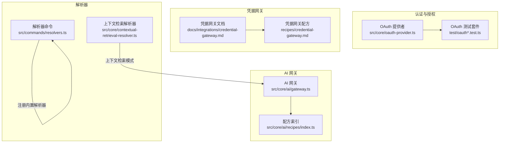
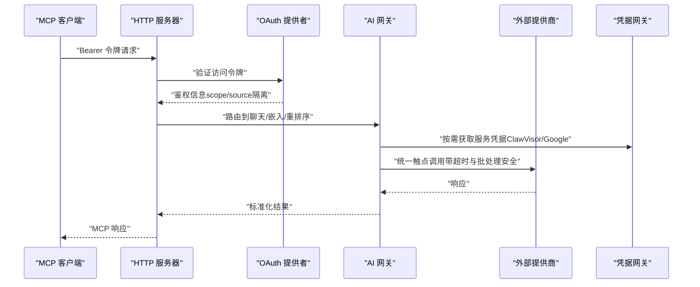
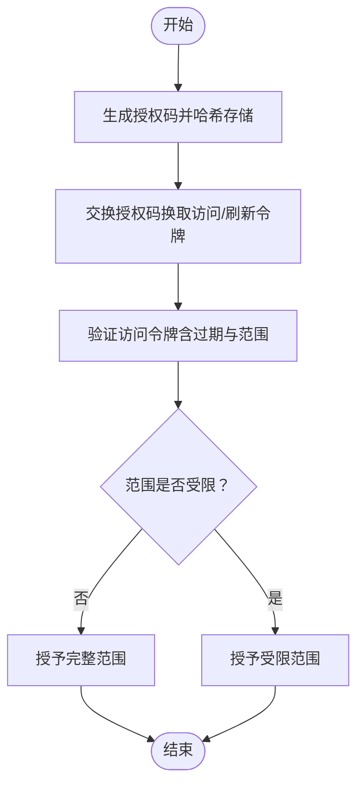
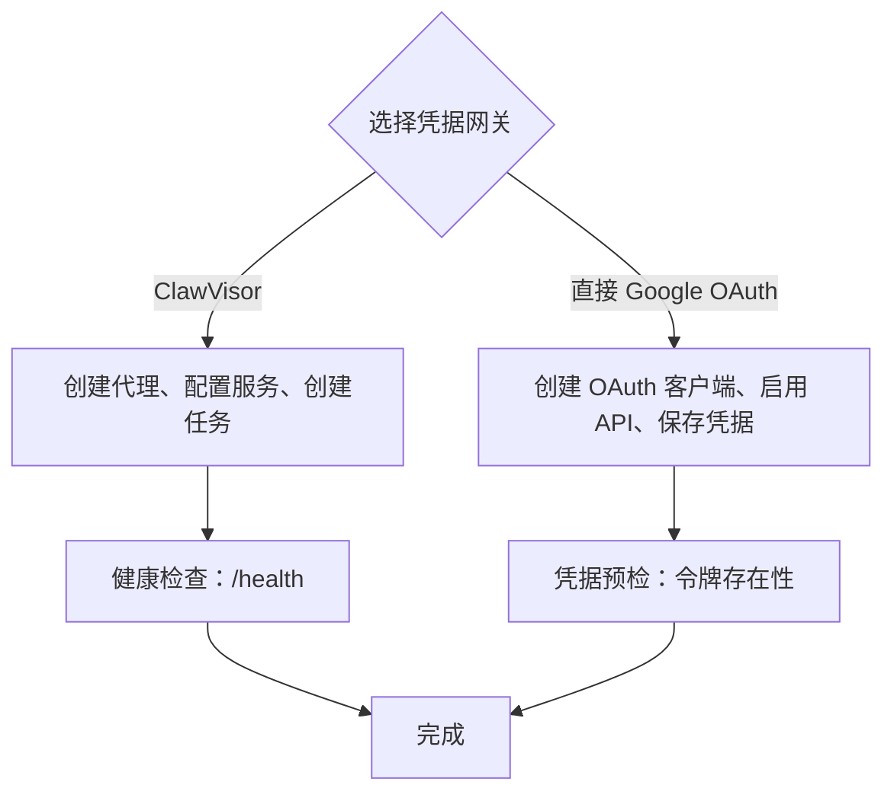
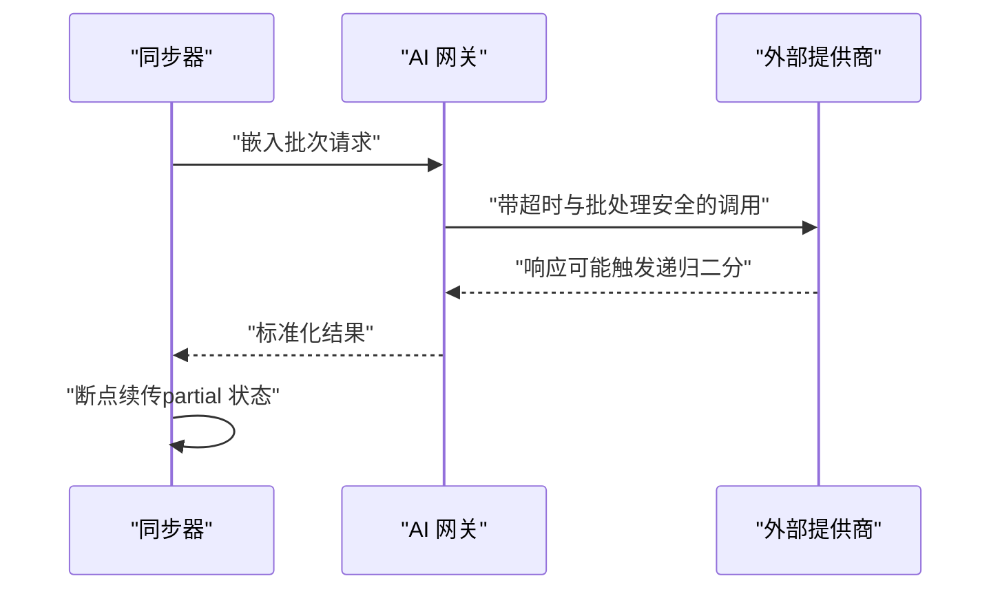
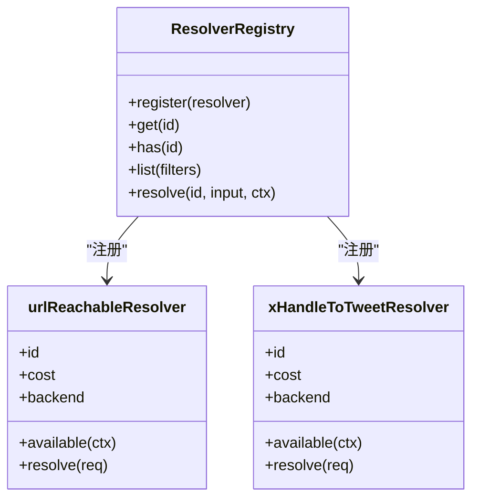
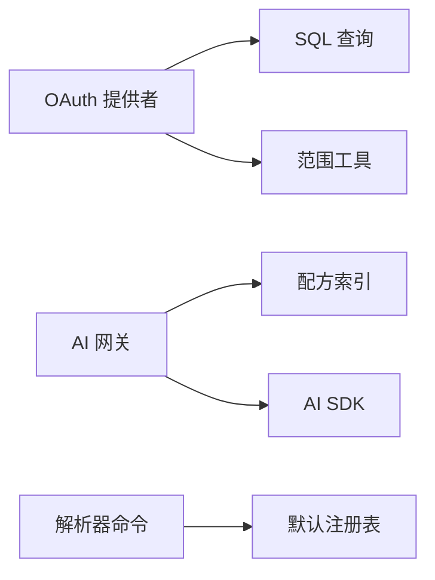

# 第三方集成

<cite>
**本文引用的文件**
- [README.md](file://README.md)
- [oauth-provider.ts](file://src/core/oauth-provider.ts)
- [credential-gateway.md（文档）](file://docs/integrations/credential-gateway.md)
- [credential-gateway.md（配方）](file://recipes/credential-gateway.md)
- [gateway.ts](file://src/core/ai/gateway.ts)
- [recipes/index.ts](file://src/core/ai/recipes/index.ts)
- [resolvers.ts](file://src/commands/resolvers.ts)
- [brain-resolver.ts](file://src/core/brain-resolver.ts)
- [contextual-retrieval-resolver.ts](file://src/core/contextual-retrieval-resolver.ts)
- [oauth.test.ts](file://test/oauth.test.ts)
- [oauth-authorize-scope-default.test.ts](file://test/oauth-authorize-scope-default.test.ts)
- [oauth-confidential-client.test.ts](file://test/oauth-confidential-client.test.ts)
- [oauth-scope-probe.test.ts](file://test/oauth-scope-probe.test.ts)
- [serve-http-oauth.test.ts](file://test/e2e/serve-http-oauth.test.ts)
- [import-credential-preflight.test.ts](file://test/e2e/import-credential-preflight.test.ts)
- [sync-credential-preflight.test.ts](file://test/e2e/sync-credential-preflight.test.ts)
- [voyage-multimodal.test.ts](file://test/voyage-multimodal.test.ts)
</cite>

## 目录
1. [简介](#简介)
2. [项目结构](#项目结构)
3. [核心组件](#核心组件)
4. [架构总览](#架构总览)
5. [详细组件分析](#详细组件分析)
6. [依赖关系分析](#依赖关系分析)
7. [性能考量](#性能考量)
8. [故障排除指南](#故障排除指南)
9. [结论](#结论)
10. [附录](#附录)

## 简介
本文件面向需要在 GBrain 中集成第三方服务的工程师与平台团队，系统性阐述以下主题：
- OAuth 认证机制与凭据管理：支持授权码（含 PKCE）、客户端凭证、令牌刷新与吊销；动态客户端注册（DCR）可按需启用；范围（scope）与来源隔离（source isolation）控制。
- 凭据网关（Credential Gateway）：ClawVisor 与直接 Google OAuth 的两种接入路径，任务级授权与最小权限原则。
- 外部 API 调用模式与数据同步：统一的 AI 网关（gateway）封装多提供商模型，嵌入、扩展、对话与重排序的触点（touchpoint）统一调度；同步流程的断点续传与超时治理。
- 解析器（Resolver）系统：内置解析器注册、可用性检查与描述输出；上下文检索模式解析器保障安全覆盖。
- 常见第三方服务集成示例与配置模板：GitHub、GitLab、Notion 等服务的对接思路与最佳实践。
- 数据映射、转换与冲突解决：前端元数据到页面类型、实体链接与图谱自动补全；跨源一致性与矛盾检测。
- 安全最佳实践与风险控制：令牌安全、SSRF 防护、范围限制、来源隔离与最小权限。
- 故障排除与性能优化：OAuth 流程问题、令牌过期与刷新、同步卡顿与批量重试策略。

## 项目结构
围绕“第三方服务集成”的关键目录与文件：
- 认证与授权：src/core/oauth-provider.ts 提供 OAuth 服务器能力；测试覆盖授权码、范围默认值、机密客户端与作用域探测。
- 凭据网关：docs/integrations/credential-gateway.md 与 recipes/credential-gateway.md 提供 ClawVisor 与 Google OAuth 的设置步骤与健康检查。
- AI 网关：src/core/ai/gateway.ts 统一嵌入、扩展、对话与重排序调用；recipes/index.ts 注册各提供商配方。
- 解析器：src/commands/resolvers.ts 提供解析器清单与描述命令；内置解析器如 URL 可达性与 X API 处理。
- 同步与检索：contextual-retrieval-resolver.ts 控制上下文检索模式生效链路；brain-resolver.ts 决定命令执行所选脑库。

图表来源
- [oauth-provider.ts:1-990](file://src/core/oauth-provider.ts#L1-L990)
- [credential-gateway.md（文档）:1-53](file://docs/integrations/credential-gateway.md#L1-L53)
- [credential-gateway.md（配方）:1-189](file://recipes/credential-gateway.md#L1-L189)
- [gateway.ts:1-3392](file://src/core/ai/gateway.ts#L1-L3392)
- [recipes/index.ts:1-56](file://src/core/ai/recipes/index.ts#L1-L56)
- [resolvers.ts:1-196](file://src/commands/resolvers.ts#L1-L196)
- [contextual-retrieval-resolver.ts:1-152](file://src/core/contextual-retrieval-resolver.ts#L1-L152)

章节来源
- [README.md:269-279](file://README.md#L269-L279)
- [README.md:412-426](file://README.md#L412-L426)

## 核心组件
- OAuth 提供者（GBrainOAuthProvider）
  - 支持授权码（PKCE）、客户端凭证、令牌刷新与吊销；动态客户端注册（DCR）可禁用以降低攻击面；范围校验与来源隔离（source_id、federated_read）贯穿令牌发放与验证。
  - 关键特性：授权码单次使用（DELETE RETURNING 原子校验）、刷新令牌防窃取（绑定 client_id）、范围收紧（refresh 仅允许子集）、遗留令牌回退兼容。
- 凭据网关（ClawVisor / 直接 Google OAuth）
  - ClawVisor：集中处理 OAuth、令牌刷新与加密，无需用户自行管理令牌；适合多服务场景。
  - 直接 Google OAuth：无额外依赖，但需自行管理令牌生命周期与刷新。
- AI 网关（gateway）
  - 统一触点：嵌入（embedding）、查询扩展（expansion）、对话（chat）、重排序（reranker）；按提供商配方路由；带超时保护与批量安全回退。
  - 配方注册：openai、google、anthropic、ollama、openrouter、voyage、litellm、azure、zeroentropy 等。
- 解析器（Resolver）
  - 注册内置解析器（如 URL 可达性、X API 处理），支持按成本与后端过滤；提供解析器清单与描述命令。
- 上下文检索模式解析器
  - 页面 frontmatter > 源行覆盖 > 全局模式；主机源始终信任；未知值回退并记录诊断信息。

章节来源
- [oauth-provider.ts:344-800](file://src/core/oauth-provider.ts#L344-L800)
- [credential-gateway.md（文档）:1-53](file://docs/integrations/credential-gateway.md#L1-L53)
- [credential-gateway.md（配方）:1-189](file://recipes/credential-gateway.md#L1-L189)
- [gateway.ts:1-800](file://src/core/ai/gateway.ts#L1-L800)
- [recipes/index.ts:1-56](file://src/core/ai/recipes/index.ts#L1-L56)
- [resolvers.ts:1-196](file://src/commands/resolvers.ts#L1-L196)
- [contextual-retrieval-resolver.ts:1-152](file://src/core/contextual-retrieval-resolver.ts#L1-L152)

## 架构总览
下图展示“HTTP MCP 服务器 + OAuth + 凭据网关 + AI 网关 + 解析器”的端到端交互：

图表来源
- [oauth-provider.ts:344-800](file://src/core/oauth-provider.ts#L344-L800)
- [gateway.ts:1-800](file://src/core/ai/gateway.ts#L1-L800)
- [credential-gateway.md（文档）:1-53](file://docs/integrations/credential-gateway.md#L1-L53)
- [credential-gateway.md（配方）:1-189](file://recipes/credential-gateway.md#L1-L189)

## 详细组件分析

### OAuth 认证与令牌管理
- 授权码（PKCE）流程
  - 生成一次性授权码并哈希存储，限定过期时间；交换时原子校验 client_id 与 redirect_uri，防止重放与跨客户端滥用。
- 刷新令牌
  - 原子删除并返回行，严格校验过期时间与范围收缩（refresh 仅允许子集）。
- 客户端凭证
  - 机密客户端秘密哈希存储，验证时进行常量时间比较；公开客户端（PKCE-only）不颁发密钥。
- 动态客户端注册（DCR）
  - 可通过构造函数开关禁用；注册时强制 HTTPS 重定向 URI 与允许的作用域列表。
- 令牌验证与回退
  - 优先 OAuth 令牌，失败则回退至遗留 access_tokens 表；保留来源隔离字段（source_id、federated_read）。

图表来源
- [oauth-provider.ts:377-488](file://src/core/oauth-provider.ts#L377-L488)
- [oauth-provider.ts:494-546](file://src/core/oauth-provider.ts#L494-L546)
- [oauth-provider.ts:552-702](file://src/core/oauth-provider.ts#L552-L702)

章节来源
- [oauth-provider.ts:344-800](file://src/core/oauth-provider.ts#L344-L800)
- [oauth.test.ts](file://test/oauth.test.ts)
- [oauth-authorize-scope-default.test.ts](file://test/oauth-authorize-scope-default.test.ts)
- [oauth-confidential-client.test.ts](file://test/oauth-confidential-client.test.ts)
- [oauth-scope-probe.test.ts](file://test/oauth-scope-probe.test.ts)
- [serve-http-oauth.test.ts](file://test/e2e/serve-http-oauth.test.ts)

### 凭据网关（ClawVisor / 直接 Google OAuth）
- ClawVisor
  - 代理 OAuth、令牌刷新与加密；每个任务声明目的、授权动作与生命周期；建议目的描述尽量宽泛以避免误判。
- 直接 Google OAuth
  - 自行管理令牌，注意短期访问令牌与长期刷新令牌差异；在“测试”应用状态下存在用户数量与令牌有效期限制。
- 健康检查与验证
  - ClawVisor 健康端点；Google OAuth 凭据存在性检查；邮件与日历同步验证。

图表来源
- [credential-gateway.md（文档）:1-53](file://docs/integrations/credential-gateway.md#L1-L53)
- [credential-gateway.md（配方）:1-189](file://recipes/credential-gateway.md#L1-L189)

章节来源
- [credential-gateway.md（文档）:1-53](file://docs/integrations/credential-gateway.md#L1-L53)
- [credential-gateway.md（配方）:1-189](file://recipes/credential-gateway.md#L1-L189)
- [import-credential-preflight.test.ts](file://test/e2e/import-credential-preflight.test.ts)
- [sync-credential-preflight.test.ts](file://test/e2e/sync-credential-preflight.test.ts)

### 外部 API 调用模式与数据同步
- AI 网关
  - 统一触点：嵌入、扩展、对话、重排序；按提供商配方解析模型与认证头；带默认超时与批量安全回退；支持测试桩替换。
  - 批量安全：缺失批次令牌上限时发出警告；递归二分回退；对特定提供商响应大小进行 OOM 防御。
- 数据同步
  - 断点续传：超时退出返回 partial 状态且保留 last_commit；下次重试从差异处继续。
  - 并发与锁：PGLite 单写锁与同步并发注意事项；Supabase 场景下的批量写入重试与连接自愈。

图表来源
- [gateway.ts:1-800](file://src/core/ai/gateway.ts#L1-L800)
- [README.md:294-316](file://README.md#L294-L316)
- [README.md:377-399](file://README.md#L377-L399)

章节来源
- [gateway.ts:1-800](file://src/core/ai/gateway.ts#L1-L800)
- [README.md:294-316](file://README.md#L294-L316)
- [README.md:377-399](file://README.md#L377-L399)
- [voyage-multimodal.test.ts:30-71](file://test/voyage-multimodal.test.ts#L30-L71)

### 解析器系统与自定义解析器开发
- 内置解析器
  - 注册内置解析器（如 URL 可达性、X API 处理）；支持按成本与后端过滤；提供解析器清单与描述命令。
- 上下文检索模式解析器
  - 生效链：页面 frontmatter > 源行覆盖 > 全局模式；主机源始终信任；未知值回退并记录诊断信息。

图表来源
- [resolvers.ts:1-196](file://src/commands/resolvers.ts#L1-L196)

章节来源
- [resolvers.ts:1-196](file://src/commands/resolvers.ts#L1-L196)
- [contextual-retrieval-resolver.ts:1-152](file://src/core/contextual-retrieval-resolver.ts#L1-L152)

### 常见第三方服务集成示例与配置模板
- GitHub/GitLab/Notion 集成思路
  - 使用 HTTP Webhook 或 OAuth 2.1 + MCP 连接器接入；为每类服务建立独立客户端与最小权限范围；通过凭据网关或直接 OAuth 管理令牌。
  - 配置模板要点：客户端注册（DCR 可选）、回调地址 HTTPS、范围最小化、令牌刷新与吊销。
- 示例流程（示意）
  - GitHub：授权码（PKCE）+ webhook 回推；范围仅读取仓库内容。
  - GitLab：授权码（PKCE）+ webhook 回推；范围仅读取项目与合并请求。
  - Notion：授权码（PKCE）+ webhook 回推；范围仅读取数据库块与页面。

[本节为概念性说明，未直接分析具体源码文件]

## 依赖关系分析
- OAuth 提供者依赖 SQL 存储与范围工具；AI 网关依赖配方注册表与模型解析；解析器命令依赖默认注册表。
- 外部依赖：AI SDK（@ai-sdk/*）、fetch 超时信号、测试桩替换。

图表来源
- [oauth-provider.ts:16-31](file://src/core/oauth-provider.ts#L16-L31)
- [gateway.ts:24-54](file://src/core/ai/gateway.ts#L24-L54)
- [recipes/index.ts:8-26](file://src/core/ai/recipes/index.ts#L8-L26)
- [resolvers.ts:14-20](file://src/commands/resolvers.ts#L14-L20)

章节来源
- [oauth-provider.ts:16-31](file://src/core/oauth-provider.ts#L16-L31)
- [gateway.ts:24-54](file://src/core/ai/gateway.ts#L24-L54)
- [recipes/index.ts:8-26](file://src/core/ai/recipes/index.ts#L8-L26)
- [resolvers.ts:14-20](file://src/commands/resolvers.ts#L14-L20)

## 性能考量
- AI 网关超时与批处理安全
  - 默认聊天、嵌入与多模态请求超时；嵌入递归二分回退；特定提供商响应大小 OOM 防御。
- 同步并发与锁
  - PGLite 单写锁与同步并发；Supabase 批量写入重试与连接自愈；长时间运行的同步建议断点续传。
- 检索与重排序
  - 重排序模型按需启用；默认重排序模型可在配置中覆盖。

[本节为通用指导，未直接分析具体源码文件]

## 故障排除指南
- OAuth 授权码无效或过期
  - 核查授权码哈希与过期时间；确认 redirect_uri 与 client_id 绑定；检查范围是否被裁剪。
- 刷新令牌失败
  - 核查令牌哈希与过期时间；确认请求范围不得超出原始授权范围。
- 令牌吊销
  - 确认仅能吊销自身客户端的令牌；核对客户端状态（软删除）。
- 凭据网关不可达
  - ClawVisor：检查 /health；Google OAuth：检查令牌文件存在性与权限。
- 同步卡顿或无进度
  - 开启同步追踪；定位阻塞文件；必要时禁用 schema-pack 以排除正则回溯问题；PGLite 场景停止 MCP 服务再运行大同步。
- 批量写入丢失
  - 检查批量重试健康检查与连接自愈；调整批量重试参数。

章节来源
- [oauth-provider.ts:424-488](file://src/core/oauth-provider.ts#L424-L488)
- [oauth-provider.ts:494-546](file://src/core/oauth-provider.ts#L494-L546)
- [oauth-provider.ts:708-724](file://src/core/oauth-provider.ts#L708-L724)
- [credential-gateway.md（配方）:172-178](file://recipes/credential-gateway.md#L172-L178)
- [README.md:294-316](file://README.md#L294-L316)
- [README.md:377-399](file://README.md#L377-L399)
- [README.md:317-354](file://README.md#L317-L354)

## 结论
本文件系统化梳理了 GBrain 在第三方服务集成方面的认证、凭据管理、API 调用与解析器体系，并提供了常见服务的对接思路与故障排除建议。通过 OAuth 的细粒度范围控制、凭据网关的任务级授权与最小权限原则、AI 网关的统一触点与批处理安全，以及解析器与上下文检索模式的可配置性，平台能够在保证安全的前提下高效整合外部数据源与服务。

[本节为总结性内容，未直接分析具体源码文件]

## 附录
- 常用命令参考
  - 解析器清单与描述：gbrain resolvers list / describe
  - OAuth 客户端注册：gbrain auth register-client（DCR 可选）
  - 同步断点续传：gbrain sync --timeout / --max-age
- 安全清单
  - 回调地址必须 HTTPS（环回例外）；范围最小化；令牌轮换与吊销；来源隔离；SSRF 防护。

[本节为补充说明，未直接分析具体源码文件]