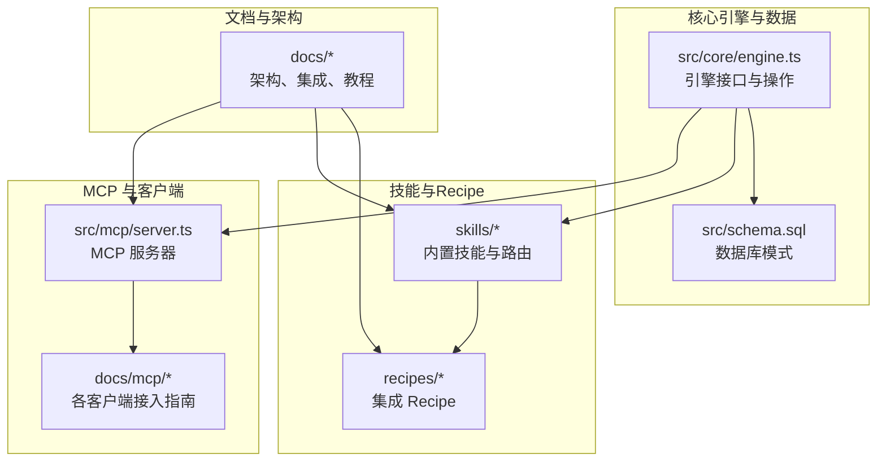
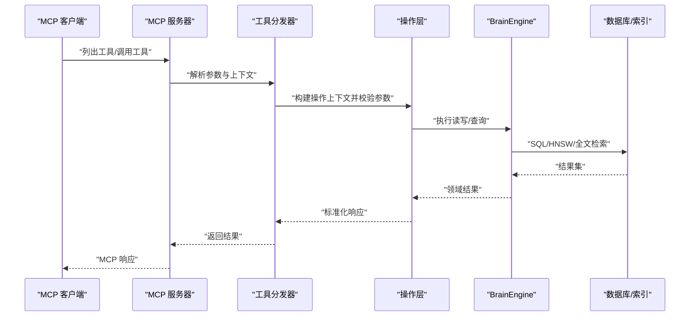
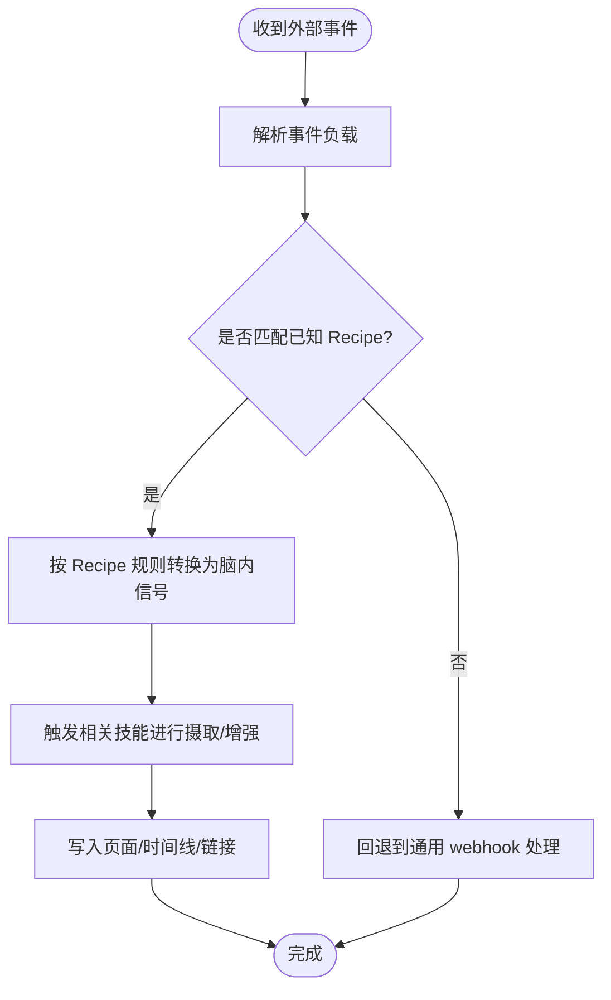
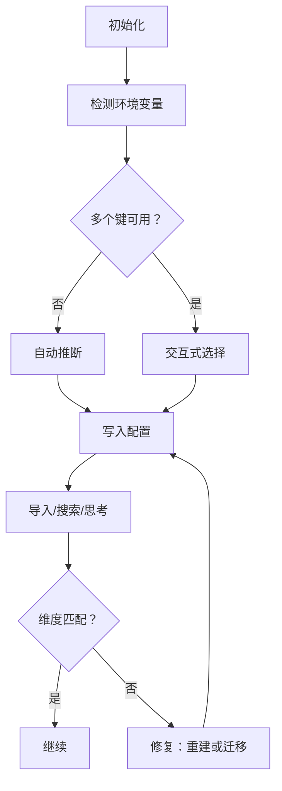
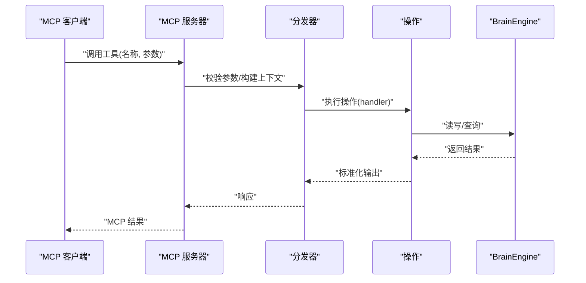
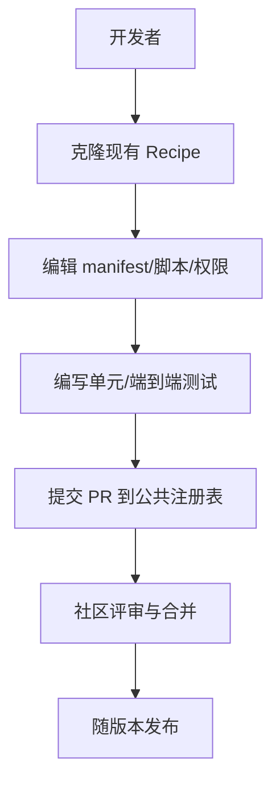
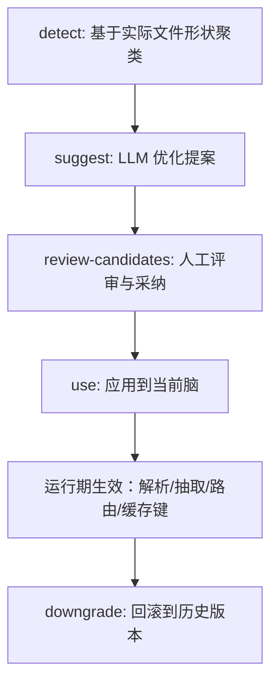
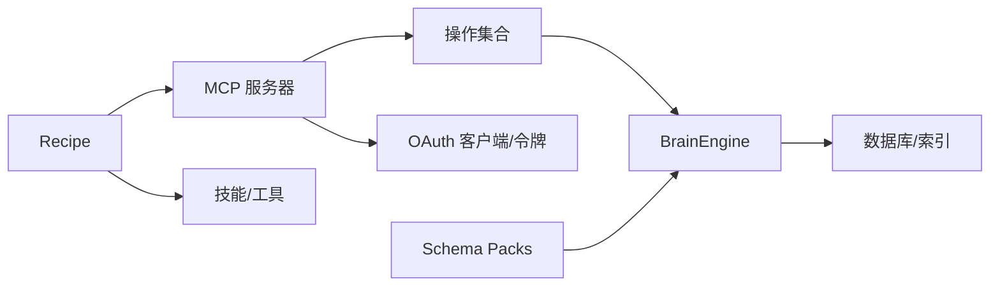

# 集成与扩展

<cite>
**本文引用的文件**
- [README.md](file://README.md)
- [DESIGN.md](file://DESIGN.md)
- [src/schema.sql](file://src/schema.sql)
- [docs/integrations/embedding-providers.md](file://docs/integrations/embedding-providers.md)
- [docs/mcp/CLAUDE_CODE.md](file://docs/mcp/CLAUDE_CODE.md)
- [docs/architecture/schema-packs.md](file://docs/architecture/schema-packs.md)
- [src/core/engine.ts](file://src/core/engine.ts)
- [src/mcp/server.ts](file://src/mcp/server.ts)
- [skills/RESOLVER.md](file://skills/RESOLVER.md)
- [recipes/agent-voice.md](file://recipes/agent-voice.md)
- [recipes/twilio-voice-brain.md](file://recipes/twilio-voice-brain.md)
- [recipes/email-to-brain.md](file://recipes/email-to-brain.md)
- [recipes/calendar-to-brain.md](file://recipes/calendar-to-brain.md)
- [recipes/ngrok-tunnel.md](file://recipes/ngrok-tunnel.md)
- [recipes/retrieval-reflex.md](file://recipes/retrieval-reflex.md)
- [recipes/restart-sweep.md](file://recipes/restart-sweep.md)
- [recipes/x-to-brain.md](file://recipes/x-to-brain.md)
- [recipes/meeting-sync.md](file://recipes/meeting-sync.md)
- [recipes/credential-gateway.md](file://recipes/credential-gateway.md)
- [docs/INSTALL.md](file://docs/INSTALL.md)
- [docs/what-schemas-unlock.md](file://docs/what-schemas-unlock.md)
- [docs/schema-author-tutorial.md](file://docs/schema-author-tutorial.md)
- [docs/architecture/topologies.md](file://docs/architecture/topologies.md)
- [docs/architecture/brains-and-sources.md](file://docs/architecture/brains-and-sources.md)
- [docs/architecture/serve-sync-concurrency.md](file://docs/architecture/serve-sync-concurrency.md)
- [docs/ethos/ORIGIN.md](file://docs/ethos/ORIGIN.md)
- [SECURITY.md](file://SECURITY.md)
</cite>

## 目录
1. [简介](#简介)
2. [项目结构](#项目结构)
3. [核心组件](#核心组件)
4. [架构总览](#架构总览)
5. [详细组件分析](#详细组件分析)
6. [依赖关系分析](#依赖关系分析)
7. [性能考量](#性能考量)
8. [故障排除指南](#故障排除指南)
9. [结论](#结论)
10. [附录](#附录)

## 简介
本文件面向需要在 GBrain 上进行集成与扩展的工程师与平台团队，系统化阐述以下主题：
- Webhook 集成与第三方服务连接（邮件、日历、语音、凭证网关等）
- 16 种嵌入提供商的配置与使用方法
- MCP 工具扩展与 API 接口设计
- Recipe 系统工作原理与自定义 Recipe 开发指南
- Schema Packs 的扩展机制与自定义页面类型创建
- 安全考虑、认证机制与访问控制
- 集成示例、配置模板与最佳实践
- 故障排除与性能优化建议

## 项目结构
仓库采用“功能域+分层”的组织方式：核心引擎与数据模型位于 src/，文档与教程位于 docs/，技能包与 Recipe 位于 skills/ 与 recipes/，管理端前端位于 admin/，脚本与测试位于 scripts/ 与 test/。

图表来源
- [src/core/engine.ts](file://src/core/engine.ts)
- [src/schema.sql](file://src/schema.sql)
- [src/mcp/server.ts](file://src/mcp/server.ts)
- [docs/mcp/CLAUDE_CODE.md](file://docs/mcp/CLAUDE_CODE.md)
- [skills/RESOLVER.md](file://skills/RESOLVER.md)
- [docs/architecture/schema-packs.md](file://docs/architecture/schema-packs.md)

章节来源
- [README.md](file://README.md)
- [docs/architecture/topologies.md](file://docs/architecture/topologies.md)

## 核心组件
- 引擎层（BrainEngine）：统一抽象 PGLite 与 Postgres 引擎，提供页、块、链接、事实、轨迹等读写与查询能力；支持事务、保留连接、批处理重试等工程特性。
- MCP 服务器：基于 Model Context Protocol（MCP），暴露工具清单与调用分发，支持本地 stdio 与 HTTP 两种传输。
- Schema Packs：动态页面类型与链接语义定义，贯穿所有读写路径，支持多级解析链与版本化演进。
- 嵌入提供商：通过 Recipe 注册与发现，覆盖主流云厂商与本地推理栈，支持维度与质量矩阵选择。
- 技能与路由：RESOLVER.md 定义触发词到技能的路由规则，支撑从信号检测、内容摄取、知识图谱构建到运营维护的完整闭环。

章节来源
- [src/core/engine.ts](file://src/core/engine.ts)
- [src/mcp/server.ts](file://src/mcp/server.ts)
- [docs/architecture/schema-packs.md](file://docs/architecture/schema-packs.md)
- [docs/integrations/embedding-providers.md](file://docs/integrations/embedding-providers.md)
- [skills/RESOLVER.md](file://skills/RESOLVER.md)

## 架构总览
下图展示 GBrain 的核心交互：MCP 客户端通过 stdio 或 HTTP 调用工具，服务器将请求分发至共享的操作层，再由引擎执行数据库与向量操作；Schema Packs 决定页面类型与专家路由；Recipe 提供第三方集成入口。

图表来源
- [src/mcp/server.ts](file://src/mcp/server.ts)
- [src/core/engine.ts](file://src/core/engine.ts)

章节来源
- [src/mcp/server.ts](file://src/mcp/server.ts)
- [src/core/engine.ts](file://src/core/engine.ts)

## 详细组件分析

### Webhook 集成与第三方服务连接
- 邮件与日历：通过 webhook 处理器将外部事件转化为脑内信号，配合技能进行路由与增强。
- 语音：Twilio + 实时语音/文本/音频流水线，实现电话转写与摘要。
- 凭证网关：集中式密钥分发与最小权限作用域，保障第三方集成的安全性。
- 公共 Recipe：提供 ngrok 隧道、X 平台抓取、重启扫描等可复用集成方案。

图表来源
- [recipes/email-to-brain.md](file://recipes/email-to-brain.md)
- [recipes/calendar-to-brain.md](file://recipes/calendar-to-brain.md)
- [recipes/twilio-voice-brain.md](file://recipes/twilio-voice-brain.md)
- [recipes/credential-gateway.md](file://recipes/credential-gateway.md)
- [recipes/ngrok-tunnel.md](file://recipes/ngrok-tunnel.md)
- [recipes/x-to-brain.md](file://recipes/x-to-brain.md)

章节来源
- [recipes/email-to-brain.md](file://recipes/email-to-brain.md)
- [recipes/calendar-to-brain.md](file://recipes/calendar-to-brain.md)
- [recipes/twilio-voice-brain.md](file://recipes/twilio-voice-brain.md)
- [recipes/credential-gateway.md](file://recipes/credential-gateway.md)
- [recipes/ngrok-tunnel.md](file://recipes/ngrok-tunnel.md)
- [recipes/x-to-brain.md](file://recipes/x-to-brain.md)

### 16 种嵌入提供商配置与使用
- 自动检测：首次初始化时根据环境变量自动选择提供商与维度，并持久化到配置。
- 维度与质量：不同提供商默认维度不同，部分支持 Matryoshka 缩减；超过 HNSW 上限将回落为精确向量扫描。
- 切换路径：提供 PGLite 一键重建与 Postgres SQL 迁移两条路径，确保非空脑的平滑升级。
- 决策树：按成本、质量、代码场景、企业合规等维度给出选型建议。

图表来源
- [docs/integrations/embedding-providers.md](file://docs/integrations/embedding-providers.md)

章节来源
- [docs/integrations/embedding-providers.md](file://docs/integrations/embedding-providers.md)

### MCP 工具扩展与 API 设计
- 工具注册：MCP 服务器从操作集合动态生成工具清单，保证 CLI 与 HTTP 后端一致。
- 参数校验与上下文：分发器负责参数校验、构建操作上下文（含来源、远程标记、可见性过滤等）。
- 访问控制：stdio 默认仅对世界可见内容开放；HTTP 支持 OAuth 客户端与令牌，具备范围与配额控制。
- IPC 推荐反射：在 PGLite 场景下通过本地 IPC 将实体指针注入上下文，提升检索质量。

图表来源
- [src/mcp/server.ts](file://src/mcp/server.ts)
- [src/core/engine.ts](file://src/core/engine.ts)

章节来源
- [src/mcp/server.ts](file://src/mcp/server.ts)
- [docs/mcp/CLAUDE_CODE.md](file://docs/mcp/CLAUDE_CODE.md)

### Recipe 系统工作原理与自定义开发
- 工作原理：Recipe 是“配方”式的集成模板，包含安装清单、运行脚本、权限与路由规则，通过 gbrain integrations list 发现。
- 自定义 Recipe：复制现有 Recipe 模板，修改 manifest 与脚本，添加测试，提交 PR 即可贡献到公共注册表。
- 示例：agent-voice、twilio-voice-brain、email-to-brain、calendar-to-brain、ngrok-tunnel、retrieval-reflex、restart-sweep、x-to-brain、meeting-sync、credential-gateway。

图表来源
- [recipes/agent-voice.md](file://recipes/agent-voice.md)
- [recipes/twilio-voice-brain.md](file://recipes/twilio-voice-brain.md)
- [recipes/email-to-brain.md](file://recipes/email-to-brain.md)
- [recipes/calendar-to-brain.md](file://recipes/calendar-to-brain.md)
- [recipes/ngrok-tunnel.md](file://recipes/ngrok-tunnel.md)
- [recipes/retrieval-reflex.md](file://recipes/retrieval-reflex.md)
- [recipes/restart-sweep.md](file://recipes/restart-sweep.md)
- [recipes/x-to-brain.md](file://recipes/x-to-brain.md)
- [recipes/meeting-sync.md](file://recipes/meeting-sync.md)
- [recipes/credential-gateway.md](file://recipes/credential-gateway.md)

章节来源
- [recipes/agent-voice.md](file://recipes/agent-voice.md)
- [recipes/twilio-voice-brain.md](file://recipes/twilio-voice-brain.md)
- [recipes/email-to-brain.md](file://recipes/email-to-brain.md)
- [recipes/calendar-to-brain.md](file://recipes/calendar-to-brain.md)
- [recipes/ngrok-tunnel.md](file://recipes/ngrok-tunnel.md)
- [recipes/retrieval-reflex.md](file://recipes/retrieval-reflex.md)
- [recipes/restart-sweep.md](file://recipes/restart-sweep.md)
- [recipes/x-to-brain.md](file://recipes/x-to-brain.md)
- [recipes/meeting-sync.md](file://recipes/meeting-sync.md)
- [recipes/credential-gateway.md](file://recipes/credential-gateway.md)

### Schema Packs 扩展机制与自定义页面类型
- 动态类型与链接：Schema Pack 决定页面类型、别名、抽取开关、专家路由、链接类型等，贯穿所有读写路径。
- 解析链：支持多级解析（调用级、环境变量、源级、脑级、gbrain.yml、用户配置、默认），优先级明确。
- 自定义流程：detect → suggest → review-candidates → use，支持降级恢复与历史记录。
- 分发与版本：以 tarball 形式与技能包共享发布管线，支持 semver 兼容检查与跨 pack 参考声明。

图表来源
- [docs/architecture/schema-packs.md](file://docs/architecture/schema-packs.md)
- [docs/schema-author-tutorial.md](file://docs/schema-author-tutorial.md)
- [docs/what-schemas-unlock.md](file://docs/what-schemas-unlock.md)

章节来源
- [docs/architecture/schema-packs.md](file://docs/architecture/schema-packs.md)
- [docs/schema-author-tutorial.md](file://docs/schema-author-tutorial.md)
- [docs/what-schemas-unlock.md](file://docs/what-schemas-unlock.md)

### 插件开发机制（技能与工具）
- 技能路由：RESOLVER.md 定义触发词到技能的路由规则，支持链式调用与消歧策略。
- 工具注册：MCP 服务器从操作集合动态生成工具清单，CLI 与 HTTP 后端共享同一套工具定义。
- 最佳实践：遵循“脑优先”原则，先查脑再调外部 API；严格使用来源隔离与可见性过滤；在子代理中使用最小权限作用域。

章节来源
- [skills/RESOLVER.md](file://skills/RESOLVER.md)
- [src/mcp/server.ts](file://src/mcp/server.ts)

## 依赖关系分析
- 引擎依赖：BrainEngine 依赖数据库模式（src/schema.sql）与向量索引；提供事务、保留连接、批处理重试等能力。
- MCP 依赖：MCP 服务器依赖操作集合与分发器；HTTP 模式引入 OAuth 客户端与令牌表；stdion 模式无每令牌鉴权。
- Schema Packs 依赖：运行期解析链决定页面类型与抽取行为；缓存键折叠 pack 名称与版本，避免跨 pack 污染。
- Recipe 依赖：Recipe 通过 manifest 与脚本定义安装与运行逻辑；与技能/工具解耦，便于复用与演进。

图表来源
- [src/core/engine.ts](file://src/core/engine.ts)
- [src/schema.sql](file://src/schema.sql)
- [src/mcp/server.ts](file://src/mcp/server.ts)
- [docs/architecture/schema-packs.md](file://docs/architecture/schema-packs.md)

章节来源
- [src/core/engine.ts](file://src/core/engine.ts)
- [src/schema.sql](file://src/schema.sql)
- [src/mcp/server.ts](file://src/mcp/server.ts)
- [docs/architecture/schema-packs.md](file://docs/architecture/schema-packs.md)

## 性能考量
- 向量检索：HNSW 索引支持余弦距离；超过 2000 维将回落为精确扫描，但系统自动处理。
- 批处理重试：批量写入（链接、时间线、块）具备自适应重试与审计，降低瞬时错误影响。
- 并发与锁：PGLite 单写者模型与 MCP 服务竞争写锁时，建议停止服务后再执行大规模同步。
- 查询限制：搜索结果上限受控，避免超大返回量；缓存键折叠 pack 信息，减少跨 pack 污染导致的无效命中。

章节来源
- [src/core/engine.ts](file://src/core/engine.ts)
- [docs/architecture/serve-sync-concurrency.md](file://docs/architecture/serve-sync-concurrency.md)

## 故障排除指南
- 嵌入维度不匹配：运行 doctor 输出的修复命令，空脑可重建，非空脑走迁移路径。
- 同步超时与挂起：采用 per-source 循环 + 超时策略；启用禁用 schema-pack 的方式定位正则回溯问题。
- 数据库连接中断：引擎具备重连回调与批处理重试层，确保 mid-cycle 断连后的自愈。
- MCP 远程连接：使用 connect 子命令生成粘贴块，或手动添加 bearer token；stdion 模式无每令牌鉴权。
- 安装与部署：参考 INSTALL 文档与各拓扑说明，结合 ngrok/隧道 Recipe 快速上线。

章节来源
- [README.md](file://README.md)
- [docs/INSTALL.md](file://docs/INSTALL.md)
- [recipes/ngrok-tunnel.md](file://recipes/ngrok-tunnel.md)
- [docs/architecture/serve-sync-concurrency.md](file://docs/architecture/serve-sync-concurrency.md)

## 结论
GBrain 通过统一的引擎抽象、灵活的 Schema Packs、完善的 MCP 工具体系与可复用的 Recipe 模板，提供了从个人到企业级的“脑层”能力。依托清晰的解析链、访问控制与安全边界，以及稳健的批处理重试与并发治理，可在多种部署形态与第三方集成场景中稳定运行。建议在生产环境中优先采用 HTTP + OAuth 的远端 MCP 模式，结合 ngrok/隧道 Recipe 快速落地，并通过 doctor 与评估框架持续监控健康状态。

## 附录
- 安全与合规：OAuth 2.1 + 范围控制、令牌配额、审计日志；管理员仪表盘用于可视化与治理。
- 设计语言：深色主题、简洁排版、可访问性与对比度要求；UI 表达贴近用户数据与结果。
- 起步与教程：个人/公司脑设置、连接编码器、Schema 作者入门、架构拓扑与集成示例。

章节来源
- [SECURITY.md](file://SECURITY.md)
- [DESIGN.md](file://DESIGN.md)
- [docs/ethos/ORIGIN.md](file://docs/ethos/ORIGIN.md)
- [docs/schema-author-tutorial.md](file://docs/schema-author-tutorial.md)
- [docs/architecture/topologies.md](file://docs/architecture/topologies.md)
- [docs/architecture/brains-and-sources.md](file://docs/architecture/brains-and-sources.md)