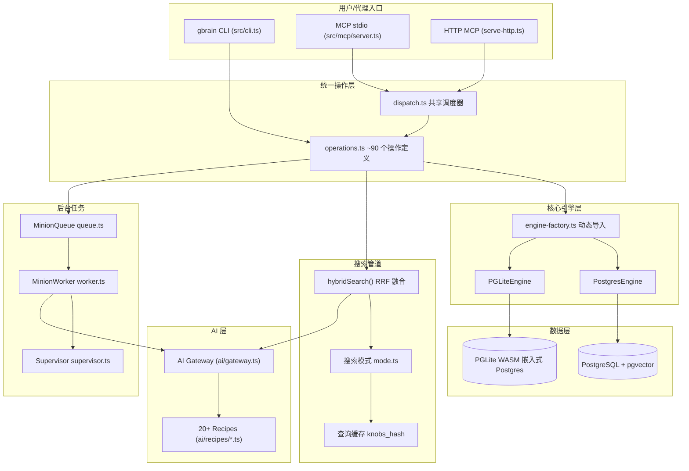

# GBrain 项目架构全景分析

> v0.42.52.0 · TypeScript + Bun · 混合 RAG 知识图谱引擎

GBrain 是一个 **Postgres 原生的个人知识图谱引擎**，为 AI 代理提供混合 RAG 检索、实体图谱遍历和知识进化能力。核心设计哲学：**Contract-First（契约优先）**——CLI 和 MCP 服务器从同一份操作定义自动生成。

**参考文件**：[gbrain-architecture.html](file://gbrain-architecture.html)

---

## 1. 整体架构概览



### 分层架构

| 层级 | 职责 | 关键文件 |
|------|------|----------|
| 传输层 | CLI 解析、MCP stdio/HTTP 协议、认证 | `src/cli.ts`, `src/mcp/server.ts`, `src/commands/serve-http.ts` |
| 操作层 | ~90 个 Contract-First 操作定义，统一 CLI+MCP | `src/core/operations.ts`, `src/mcp/dispatch.ts` |
| 引擎层 | BrainEngine 接口，双引擎实现 | `src/core/engine.ts`, `postgres-engine.ts`, `pglite-engine.ts` |
| AI 层 | 嵌入、查询扩展、文本生成、模型路由 | `src/core/ai/gateway.ts`, `src/core/ai/recipes/` |
| 搜索层 | 混合检索、RRF 融合、缓存、模式管理 | `src/core/search/` |
| 任务层 | 后台作业队列、锁管理、监督器 | `src/core/minions/` |
| 技能层 | Markdown 技能文件、路由表、约定 | `skills/` |

---

## 2. BrainEngine 双引擎抽象层

### 引擎接口

BrainEngine 接口覆盖：生命周期（connect/disconnect/initSchema）、页面 CRUD、搜索、图谱遍历、分块、原始 SQL。

### 两种实现

- **PostgresEngine**：ConnectionManager 读写分离路由，postgres.js + PgBouncer 兼容，连接池
- **PGLiteEngine**：PGLite WASM 嵌入式 Postgres 17，内存模式或文件持久化

### 关键设计决策

- **动态导入（按需加载）**：`engine-factory.ts` 根据配置动态 import，PGLite WASM 不会为 Postgres 用户加载
- **引擎对等保障**：`test/e2e/engine-parity.test.ts` 对比两引擎结果；`test/schema-bootstrap-coverage.test.ts` 前向引用列覆盖

### 多源隔离机制

所有数据表的核心唯一约束为 `(source_id, slug)`。两个组织轴：
- **Brain（大脑）** = 哪个数据库。路由: `--brain`, `GBRAIN_BRAIN_ID`。默认: `host`
- **Source（源）** = 数据库内的哪个内容仓库。路由: `--source`, `GBRAIN_SOURCE`。默认: `default`

---

## 3. Contract-First 统一操作层

`operations.ts` 是唯一数据源，~90 个操作定义。CLI 命令和 MCP 工具均从此文件自动生成。

### Operation 接口结构

```ts
interface Operation {
  name: string;              // 操作唯一名 (e.g. 'search', 'put_page')
  description: string;       // MCP 工具描述
  params: Record<string, ParamDef>;  // 参数 schema
  handler: (ctx: OperationContext, params) => Promise<unknown>;
  mutating?: boolean;        // 是否写操作
  scope: 'read' | 'write' | 'admin' | 'sources_admin';
  localOnly?: boolean;       // 仅本地 (protected-name 任务)
  cliHints?: { name: string; hidden?: boolean };
}
```

### OperationContext 信任边界

核心安全字段 `remote`：
- `false`：可信本地 CLI 调用者（`src/cli.ts`, `gbrain call <op>`）
- `true`：不可信远程调用者（MCP stdio, HTTP/OAuth）
- **Fail-closed 原则**：`ctx.remote === undefined` 被视为远程/不可信

---

## 4. MCP 服务器与传输层

### stdio 传输 (`gbrain serve`)
MCP SDK StdioServerTransport → server.ts → dispatch.ts

### HTTP 传输 (`gbrain serve --http`)
Express 5 服务器 + Bearer Token / OAuth 2.1 + CORS 白名单 + 双桶速率限制

### 特殊机制

- **检索反射 IPC**：PGLite 模式通过 Unix socket 暴露实体解析服务
- **热记忆注入**：每次工具调用成功后，通过 `metaHook` 注入大脑热记忆到 `_meta` 字段

---

## 5. 搜索与检索管道

### 搜索流程

用户查询 → 意图分类（entity/temporal/event/general） → 向量搜索 + 关键词搜索 + 关系召回 + 查询扩展(tokenmax) → RRF 融合 → compiled truth boost(2.0x) → 余弦重排(0.7*rrf + 0.3*cosine) → 源感知去重 → 源加权 → 自适应截断 → Token 预算 → 最终结果

### 三种搜索模式

| 旋钮 | conservative | balanced | tokenmax |
|------|:---:|:---:|:---:|
| tokenBudget | 4,000 | 12,000 | off |
| expansion (LLM 多查询) | false | false | **true** |
| relationalRetrieval | false | **true** | **true** |
| searchLimit | 10 | 25 | 50 |

### 缓存防污染

`knobs_hash`（当前 v=10）折叠搜索旋钮、嵌入列名、嵌入提供商、关系召回深度到缓存键，防止跨模式/跨提供商污染。

---

## 6. AI 网关与模型路由

### AI Gateway (`gateway.ts` ~3400行)

核心能力：`embed()`/`embedOne()` 文本嵌入、`embedMultimodal()` 多模态嵌入、`expand()` 查询扩展、`generateText/Object` 文本生成、`rerank()` 交叉编码器重排

### Recipe 系统（20+ 提供商）

每个提供商适配器（`src/core/ai/recipes/*.ts`）定义：模型创建映射、维度处理、错误归一化、按用途声明的 Touchpoints。

支持提供商：OpenAI, Anthropic, Google, Voyage, Ollama, OpenRouter, DeepSeek 等 20+。

---

## 7. Minions 任务队列与编排

### 提交入口
CLI (`gbrain jobs submit shell`)、CLI Agent (`gbrain agent run`)、MCP (`submit_job`，含 protected-name 检查)

### Worker 执行流程
`launchJob(job, lockToken)` → 创建 AbortController → 启动锁续约（lockDuration/2 间隔）→ grace-eviction timer (30s) → per-job timeout → executeJob() → handler(context)

### Protected Names 安全机制
`shell`, `synthesize`, `patterns`, `consolidate` — 仅本地 CLI 允许，MCP 远程拒绝。

---

## 8. 技能系统与路由

技能文件（`skills/` 目录下的 `SKILL.md`）采用 YAML frontmatter + Contract/Phases/Output Format/Anti-Patterns 结构。

路由消歧规则：最具体优先 → 内容类型分流 → 链式调用 → signal-detector 和 brain-ops 始终并行触发。

约定层（`skills/conventions/`）：brain-first（先查脑再查外部）、model-routing、quality、schema-evolution、subagent-routing。

---

## 9. 记忆与知识系统

### 数据摄入管道
Markdown 文件/URL/音频 → parseMarkdown() → 三级分块器(recursive/semantic/code) → embedBatch() → extractPageLinks() → writePageThrough() 原子写入

### 数据模型
`pages`、`chunks`、`links`、`timeline_entries`、`takes`、`facts`、`files`

### 知识进化
`gbrain extract`（链接/时间线回填）、dream 周期（synthesize/patterns/consolidate）、enrich 技能、schema-author。

---

## 10. 生命周期与部署

### 初始化流程
`gbrain init` → 选择引擎(PGLite/Postgres) → initSchema() → applyMigrations() → 选择搜索模式 → 写入配置 → 生成身份模板

### 部署方式
- **开发**：`bun run src/cli.ts <command>`
- **生产**：`bun build --compile --outfile bin/gbrain src/cli.ts`（二进制）或 Supabase（大规模）
- **MCP 服务**：`gbrain serve` (stdio) / `gbrain serve --http` (HTTP+OAuth)
- **后台任务**：`gbrain autopilot --install --repo ~/brain`
