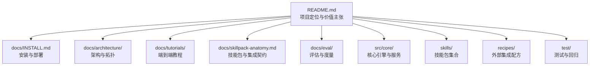
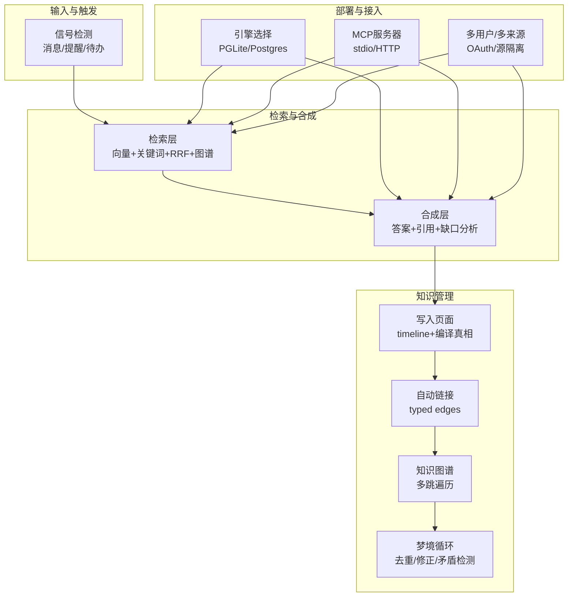
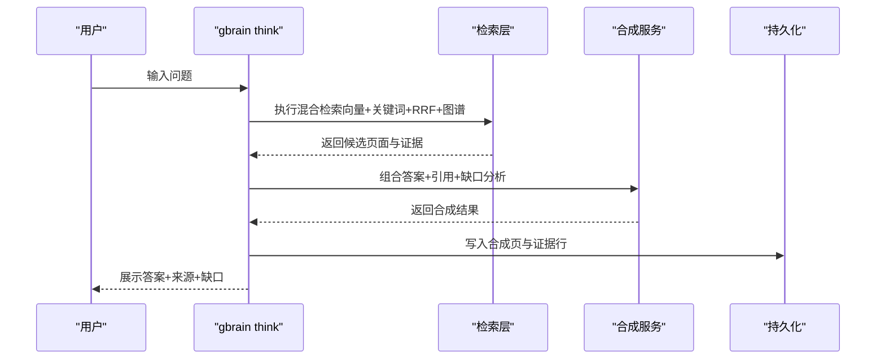
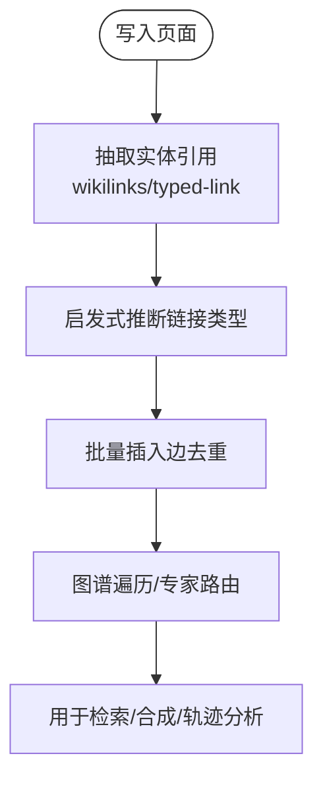
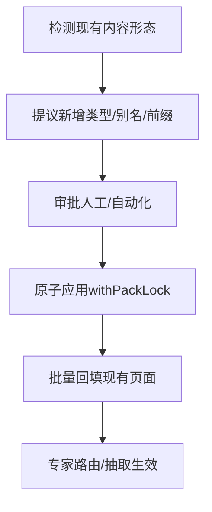
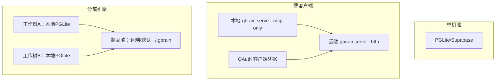
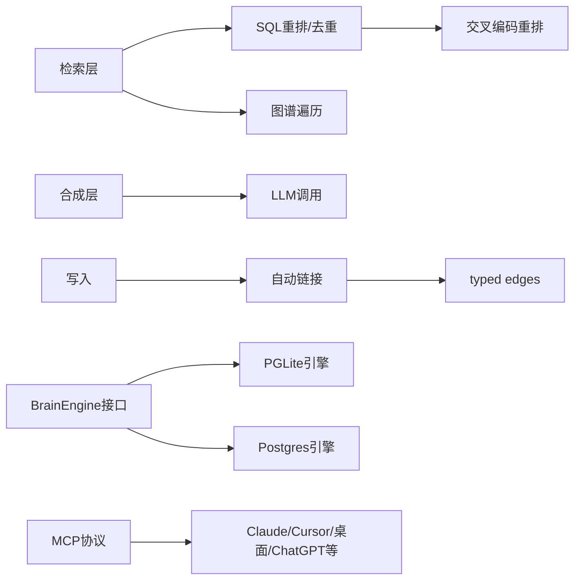
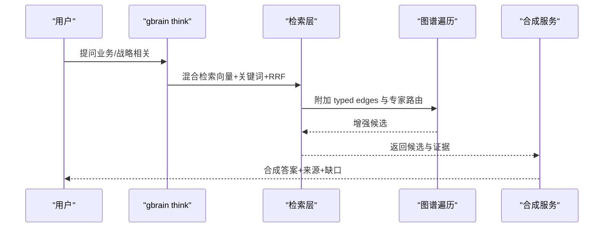

# 什么是GBrain

<cite>
**本文引用的文件**
- [README.md](file://README.md)
- [docs/GBRAIN_V0.md](file://docs/GBRAIN_V0.md)
- [docs/what-schemas-unlock.md](file://docs/what-schemas-unlock.md)
- [docs/architecture/RETRIEVAL.md](file://docs/architecture/RETRIEVAL.md)
- [docs/architecture/topologies.md](file://docs/architecture/topologies.md)
- [docs/tutorials/personal-brain.md](file://docs/tutorials/personal-brain.md)
- [docs/tutorials/company-brain.md](file://docs/tutorials/company-brain.md)
- [src/core/page-summary.ts](file://src/core/page-summary.ts)
- [src/core/link-extraction.ts](file://src/core/link-extraction.ts)
- [test/think-pipeline.serial.test.ts](file://test/think-pipeline.serial.test.ts)
- [test/link-extraction.test.ts](file://test/link-extraction.test.ts)
- [test/traverse-graph-dedup.test.ts](file://test/traverse-graph-dedup.test.ts)
- [test/skill-brain-first.test.ts](file://test/skill-brain-first.test.ts)
</cite>

## 目录
1. [引言](#引言)
2. [项目结构](#项目结构)
3. [核心组件](#核心组件)
4. [架构总览](#架构总览)
5. [详细组件分析](#详细组件分析)
6. [依赖关系分析](#依赖关系分析)
7. [性能考量](#性能考量)
8. [故障排查指南](#故障排查指南)
9. [结论](#结论)
10. [附录](#附录)

## 引言
GBrain 是一个“个人知识大脑”系统，其根本使命是让智能体与人类在知识层面实现“真正记忆”。它不是简单的笔记应用或“聊天你的笔记”，而是通过“编译式智能”把知识页（compiled truth）与证据时间线（timeline）结合，形成可随证据更新而重写、可被检索、可被合成、可被图谱化自连接的知识系统。

与传统搜索引擎不同，GBrain 不仅返回“原始页面列表”，而是提供“合成答案”（synthesis），并在答案中明确标注来源与“尚未掌握”的缺口（gap analysis）。与普通知识管理系统不同，GBrain 的独特价值在于：
- 提供“合成答案”而非“页面列表”
- 自动链接、自组织知识图谱（typed edges）
- 脑层（think）与检索层（search）双通道，满足不同任务场景
- 多用户、多来源、多拓扑部署，既可个人用也可团队用

GBrain 的价值主张：以“脑层”为AI代理提供“战略记忆”，以“图谱+检索+合成”三位一体，构建可持续的知识能力边界。

**章节来源**
- [README.md:1-100](file://README.md#L1-L100)
- [README.md:153-172](file://README.md#L153-L172)

## 项目结构
仓库采用“模块化+教程化”的组织方式：
- 根目录 README 提供总体定位与快速入门
- docs 下按主题拆分：架构、安装、教程、评估、集成等
- src 下为核心引擎与命令行实现
- skills 与 recipes 提供技能包与集成配方
- test 与 evals 提供测试框架与评估套件

下面给出一个概览性结构图，帮助理解各模块职责与关系。

**图表来源**
- [README.md:1-120](file://README.md#L1-L120)
- [docs/INSTALL.md](file://docs/INSTALL.md)
- [docs/architecture/topologies.md:1-120](file://docs/architecture/topologies.md#L1-L120)
- [docs/tutorials/personal-brain.md:1-80](file://docs/tutorials/personal-brain.md#L1-L80)
- [docs/skillpack-anatomy.md](file://docs/skillpack-anatomy.md)
- [docs/eval/SEARCH_MODE_METHODOLOGY.md](file://docs/eval/SEARCH_MODE_METHODOLOGY.md)

**章节来源**
- [README.md:1-120](file://README.md#L1-L120)
- [docs/INSTALL.md](file://docs/INSTALL.md)

## 核心组件
- 检索与合成引擎
  - 检索层：向量（HNSW）+ 关键词（BM25）+ 反秩融合（RRF）+ 图谱遍历 + 重排器（reranker）
  - 合成层：基于检索结果生成“合成答案 + 来源引用 + 缺口分析”
- 知识图谱
  - 每次写入自动抽取实体引用，建立 typed edges（如 attended、works_at、invested_in、founded、advises 等）
  - 支持多跳遍历与专家路由（expert routing）
- 架构与拓扑
  - 三种部署拓扑：单机脑、跨机薄客户端、每工作树分离引擎
  - 两种运行时引擎：PGLite（本地嵌入式）与 Postgres（生产级）
- 语义模型与事实抽取
  - 基于 schema 的类型体系（schema pack）驱动事实抽取与专家路由
  - 事实抽取（extract-facts）与链接推理（auto-link）零 LLM 成本
- 客户端协议
  - MCP（stdio/HTTP）统一暴露工具接口，支持 Claude Code、Cursor、Claude Desktop、ChatGPT 等

**章节来源**
- [README.md:253-268](file://README.md#L253-L268)
- [docs/architecture/RETRIEVAL.md:1-166](file://docs/architecture/RETRIEVAL.md#L1-L166)
- [docs/architecture/topologies.md:1-120](file://docs/architecture/topologies.md#L1-L120)
- [docs/what-schemas-unlock.md:1-178](file://docs/what-schemas-unlock.md#L1-L178)

## 架构总览
下图展示了 GBrain 的核心数据流与处理阶段：信号检测 → 脑优先查询 → 写入与自动链接 → 增强与同步 → 梦境循环（夜间）。

**图表来源**
- [README.md:238-251](file://README.md#L238-L251)
- [docs/architecture/RETRIEVAL.md:112-146](file://docs/architecture/RETRIEVAL.md#L112-L146)
- [docs/architecture/topologies.md:365-404](file://docs/architecture/topologies.md#L365-L404)

**章节来源**
- [README.md:238-251](file://README.md#L238-L251)
- [docs/architecture/RETRIEVAL.md:112-146](file://docs/architecture/RETRIEVAL.md#L112-L146)
- [docs/architecture/topologies.md:365-404](file://docs/architecture/topologies.md#L365-L404)

## 详细组件分析

### 组件A：检索与合成（search vs think）
- 检索（search）：返回“最相关的页面清单”，适合“先看材料再做判断”的场景（如上下文窗口、引用定位、寻找特定引述）
- 合成（think）：在检索基础上，生成“合成答案 + 来源引用 + 缺口分析”，适合“需要直接答案”的场景（如会议准备、战略决策）

合成答案的关键产出包括：
- 答案正文（基于检索结果整合）
- 引用来源（每个要点指向具体页面与行号）
- 缺口分析（指出“尚无记录/信息过期/存在矛盾/未覆盖到的维度”）

**图表来源**
- [README.md:153-172](file://README.md#L153-L172)
- [test/think-pipeline.serial.test.ts:220-250](file://test/think-pipeline.serial.test.ts#L220-L250)
- [src/core/page-summary.ts:117-148](file://src/core/page-summary.ts#L117-L148)

**章节来源**
- [README.md:153-172](file://README.md#L153-L172)
- [test/think-pipeline.serial.test.ts:220-250](file://test/think-pipeline.serial.test.ts#L220-L250)
- [src/core/page-summary.ts:117-148](file://src/core/page-summary.ts#L117-L148)

### 组件B：自连接知识图谱（auto-link 与 typed edges）
- 写入页面时自动抽取实体引用，建立 typed edges（如 attended、works_at、invested_in、founded、advises 等）
- 链接类型推断具备启发规则（如基于句式与全局角色_prior），支持多跳遍历与专家路由
- 图谱质量可通过 doctor 检查与 rerank 优化

**图表来源**
- [docs/architecture/RETRIEVAL.md:35-46](file://docs/architecture/RETRIEVAL.md#L35-L46)
- [src/core/link-extraction.ts:660-675](file://src/core/link-extraction.ts#L660-L675)
- [test/link-extraction.test.ts:528-590](file://test/link-extraction.test.ts#L528-L590)
- [test/traverse-graph-dedup.test.ts:86-106](file://test/traverse-graph-dedup.test.ts#L86-L106)

**章节来源**
- [docs/architecture/RETRIEVAL.md:35-46](file://docs/architecture/RETRIEVAL.md#L35-L46)
- [src/core/link-extraction.ts:660-675](file://src/core/link-extraction.ts#L660-L675)
- [test/link-extraction.test.ts:528-590](file://test/link-extraction.test.ts#L528-L590)
- [test/traverse-graph-dedup.test.ts:86-106](file://test/traverse-graph-dedup.test.ts#L86-L106)

### 组件C：类型体系与事实抽取（schema pack）
- schema pack 决定“页面类型”“链接语义”“事实抽取规则”“专家路由”
- 典型用例：将大量“会议”类页面从通用 note 类型中“显性化”，从而获得专家路由、自动抽取与图谱遍历
- agent 可安全地对 schema 进行演进（原子锁、审计日志、跨进程失效）

**图表来源**
- [docs/what-schemas-unlock.md:132-141](file://docs/what-schemas-unlock.md#L132-L141)
- [docs/what-schemas-unlock.md:106-131](file://docs/what-schemas-unlock.md#L106-L131)

**章节来源**
- [docs/what-schemas-unlock.md:132-141](file://docs/what-schemas-unlock.md#L132-L141)
- [docs/what-schemas-unlock.md:106-131](file://docs/what-schemas-unlock.md#L106-L131)

### 组件D：部署拓扑与多用户接入
- 单机脑：默认拓扑，适合个人或小团队
- 薄客户端：远程 HTTP MCP，适合多终端接入
- 分离引擎：每工作树独立代码索引，共享制品脑
- 多用户：OAuth 客户端 + 源级读写范围控制，确保隐私隔离

**图表来源**
- [docs/architecture/topologies.md:38-120](file://docs/architecture/topologies.md#L38-L120)
- [docs/architecture/topologies.md:206-323](file://docs/architecture/topologies.md#L206-L323)

**章节来源**
- [docs/architecture/topologies.md:38-120](file://docs/architecture/topologies.md#L38-L120)
- [docs/architecture/topologies.md:206-323](file://docs/architecture/topologies.md#L206-L323)

## 依赖关系分析
- 检索层依赖：向量索引（HNSW）、关键词索引（tsvector/pg_trgm）、SQL 层重排与去重、可选 reranker
- 合成层依赖：检索结果 + LLM（用于合成与摘要生成），并进行审计与失败降级
- 图谱依赖：写入时抽取实体引用，建立 typed edges；查询时进行多跳遍历
- 架构依赖：BrainEngine 接口抽象，PGLite/Postgres 引擎实现；MCP 作为统一客户端协议

**图表来源**
- [docs/architecture/RETRIEVAL.md:112-146](file://docs/architecture/RETRIEVAL.md#L112-L146)
- [src/core/page-summary.ts:117-148](file://src/core/page-summary.ts#L117-L148)
- [docs/architecture/topologies.md:365-404](file://docs/architecture/topologies.md#L365-L404)

**章节来源**
- [docs/architecture/RETRIEVAL.md:112-146](file://docs/architecture/RETRIEVAL.md#L112-L146)
- [src/core/page-summary.ts:117-148](file://src/core/page-summary.ts#L117-L148)
- [docs/architecture/topologies.md:365-404](file://docs/architecture/topologies.md#L365-L404)

## 性能考量
- 检索延迟：搜索中位数约 122ms；合成答案受 LLM 调用主导
- 嵌入成本：ZeroEntropy 默认配置下约 $0.05/百万 tokens；OpenAI 约 $0.13，Voyage 约 $0.18
- 同步速度：首次导入约 22 秒/164 页；增量同步秒级完成
- 图谱收益：在关系型查询上显著优于向量检索（P@5 提升 +31.4）

这些指标来自官方评测与基准测试，可用于规划资源与预算。

**章节来源**
- [docs/tutorials/company-brain.md:489-502](file://docs/tutorials/company-brain.md#L489-L502)
- [docs/architecture/RETRIEVAL.md:22-34](file://docs/architecture/RETRIEVAL.md#L22-L34)

## 故障排查指南
- 初始化/嵌入不匹配：运行 doctor 并按提示修复嵌入模型配置
- 同步超时：采用 per-source 循环 + 超时保护，避免长时间挂起
- 连接中断：引擎内置批写入重试与重连回调，减少中间态断开影响
- 重索引标签丢失：v0.41.37 起 tag 对齐策略改为仅追加，避免误删
- 大脑同步卡住：启用 trace 与禁用 schema-pack 检测可疑正则回溯
- Windows 迁移失败：v0.41.37 起 schema 迁移改为进程内执行，避免子进程 DNS 解析失败

以上均为官方诊断与修复建议，便于快速定位与恢复。

**章节来源**
- [README.md:290-411](file://README.md#L290-L411)

## 结论
GBrain 的差异化优势体现在“合成答案 + 自连接图谱 + 多用户/多来源部署”的组合：
- 传统搜索引擎只返回“原始页面”，GBrain 提供“合成答案 + 来源 + 缺口”
- 传统知识管理缺乏“自组织图谱”，GBrain 在每次写入时自动抽取实体并建立 typed edges
- 通过“脑层”与“检索层”双通道，GBrain 能覆盖从“会议准备”到“战略决策”的全链路价值

对于个人用户，GBrain 可以成为“全天候的个人知识大脑”；对于团队，它可作为“公司大脑”实现共享记忆与隐私隔离。

**章节来源**
- [README.md:1-100](file://README.md#L1-L100)
- [README.md:153-172](file://README.md#L153-L172)
- [docs/architecture/RETRIEVAL.md:1-166](file://docs/architecture/RETRIEVAL.md#L1-166)

## 附录

### 使用场景与工作流程示例（会议准备 → 战略决策）
- 场景一：会议准备
  - 触发：gbrain think “我明天与 Alice 的会前需要了解什么？”
  - 输出：合成答案（人物关系、最近对话、未决事项、缺口提醒）
  - 差异化：不是“列出相关页面”，而是“告诉我该问什么、该做什么”
- 场景二：战略决策
  - 触发：gbrain think “Acme AI 的最新进展与竞品对比如何？”
  - 输出：基于多来源页面的合成结论 + 来源引用 + 缺口分析
  - 差异化：图谱遍历揭示“投资—任职—共事”等关系链，向量检索无法捕捉的事实关联

**图表来源**
- [README.md:22-64](file://README.md#L22-L64)
- [docs/architecture/RETRIEVAL.md:112-146](file://docs/architecture/RETRIEVAL.md#L112-L146)

**章节来源**
- [README.md:22-64](file://README.md#L22-L64)
- [docs/architecture/RETRIEVAL.md:112-146](file://docs/architecture/RETRIEVAL.md#L112-L146)

### 术语对照（与代码库一致）
- 检索层：search
- 合成层：think
- 页面类型：type（由 schema pack 定义）
- 事实抽取：extract-facts
- 专家路由：expert routing
- typed edges：带语义类型的链接（如 works_at、invested_in）
- 图谱遍历：graph-query
- 源（source）：brain 内部的数据来源（如 customers、shared、internal）
- 拓扑（topology）：单机脑/薄客户端/分离引擎
- MCP：Model Context Protocol，统一客户端协议

**章节来源**
- [docs/architecture/RETRIEVAL.md:1-166](file://docs/architecture/RETRIEVAL.md#L1-L166)
- [docs/architecture/topologies.md:1-120](file://docs/architecture/topologies.md#L1-L120)
- [docs/what-schemas-unlock.md:1-178](file://docs/what-schemas-unlock.md#L1-L178)