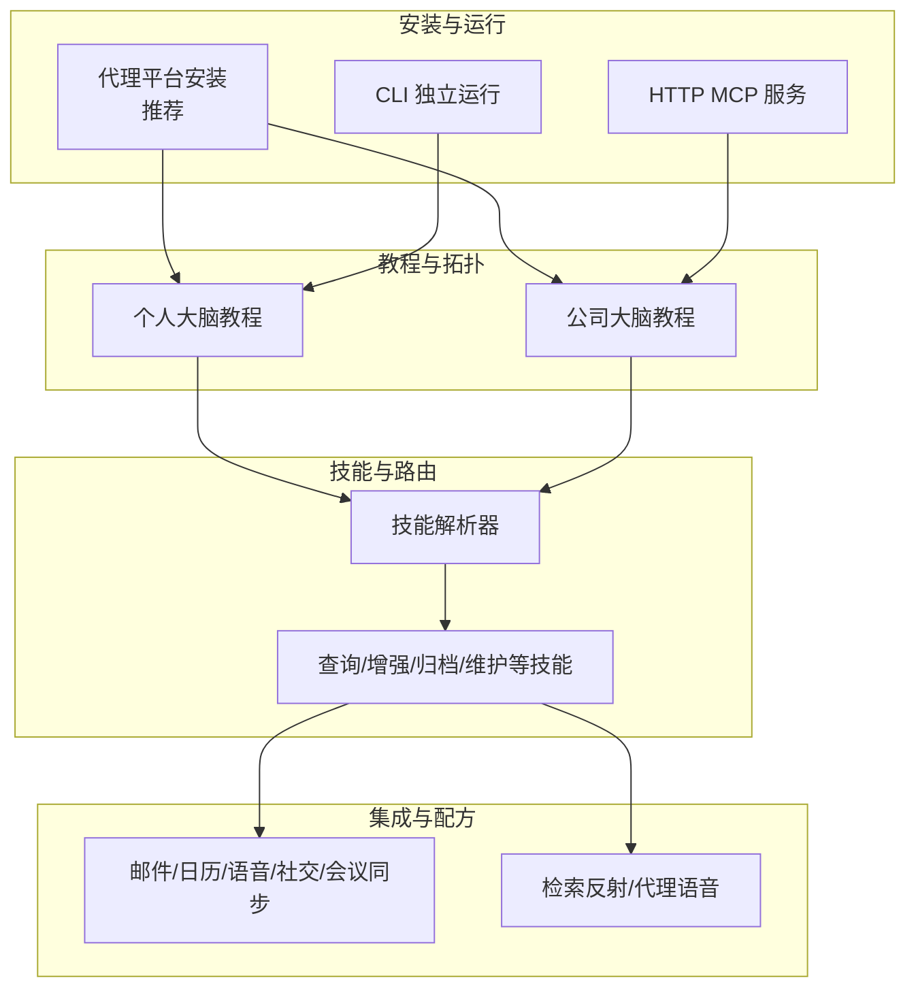
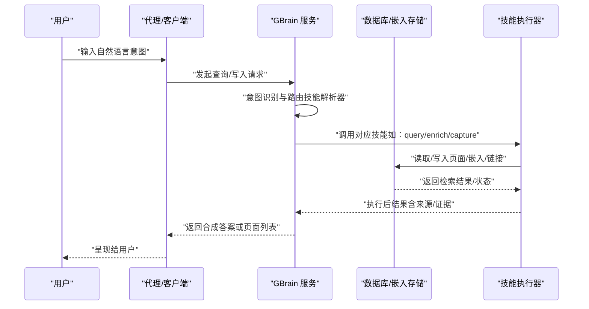
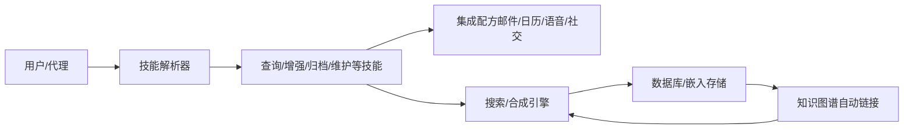

# 使用场景与案例

<cite>
**本文引用的文件**
- [README.md](file://README.md)
- [docs/INSTALL.md](file://docs/INSTALL.md)
- [docs/tutorials/personal-brain.md](file://docs/tutorials/personal-brain.md)
- [docs/tutorials/company-brain.md](file://docs/tutorials/company-brain.md)
- [skills/RESOLVER.md](file://skills/RESOLVER.md)
- [docs/guides/skillopt.md](file://docs/guides/skillopt.md)
- [recipes/meeting-sync.md](file://recipes/meeting-sync.md)
- [recipes/email-to-brain.md](file://recipes/email-to-brain.md)
- [recipes/calendar-to-brain.md](file://recipes/calendar-to-brain.md)
- [recipes/twilio-voice-brain.md](file://recipes/twilio-voice-brain.md)
- [recipes/x-to-brain.md](file://recipes/x-to-brain.md)
- [recipes/retrieval-reflex.md](file://recipes/retrieval-reflex.md)
- [recipes/agent-voice.md](file://recipes/agent-voice.md)
</cite>

## 目录
1. [简介](#简介)
2. [项目结构](#项目结构)
3. [核心组件](#核心组件)
4. [架构总览](#架构总览)
5. [详细场景与案例](#详细场景与案例)
6. [依赖关系分析](#依赖关系分析)
7. [性能考量](#性能考量)
8. [故障排查指南](#故障排查指南)
9. [结论](#结论)
10. [附录](#附录)

## 简介
本文件面向希望系统化使用 GBrain 的用户，围绕“从个人知识管理到团队协作”的完整应用生态，提供可落地的使用场景与实操案例。内容覆盖会议准备、研究分析、项目管理、战略决策等典型工作流，并配套步骤指南、预期结果、最佳实践与常见模式。同时结合真实数据指标（例如检索质量基准中的 P@5 49.1%、R@5 97.9%），帮助读者理解 GBrain 在检索与合成层面的性能优势。

## 项目结构
- 安装与运行路径：支持“由代理平台安装”“CLI 独立运行”“HTTP MCP 服务”三种方式，满足个人与团队部署需求。
- 教程体系：从“个人大脑”到“公司大脑”，提供端到端搭建流程与运维要点。
- 技能与路由：通过技能解析器将自然语言意图路由至具体技能，形成可扩展的能力矩阵。
- 集成与配方：提供邮件、日历、语音通话、社交媒体等多源数据接入配方，快速实现“信号捕获—写入—自动链接—同步”的闭环。

**图表来源**
- [docs/INSTALL.md:1-114](file://docs/INSTALL.md#L1-L114)
- [docs/tutorials/personal-brain.md:1-271](file://docs/tutorials/personal-brain.md#L1-L271)
- [docs/tutorials/company-brain.md:1-558](file://docs/tutorials/company-brain.md#L1-L558)
- [skills/RESOLVER.md:1-137](file://skills/RESOLVER.md#L1-L137)

**章节来源**
- [docs/INSTALL.md:1-114](file://docs/INSTALL.md#L1-L114)
- [docs/tutorials/personal-brain.md:1-271](file://docs/tutorials/personal-brain.md#L1-L271)
- [docs/tutorials/company-brain.md:1-558](file://docs/tutorials/company-brain.md#L1-L558)
- [skills/RESOLVER.md:1-137](file://skills/RESOLVER.md#L1-L137)

## 核心组件
- 检索与合成引擎
  - 原始检索：基于混合打分（向量 + 关键词 + RRF + 来源层级 + 重排器）返回页面列表，适合快速浏览与引文定位。
  - 脑层合成：在检索基础上生成带来源标注与“缺口分析”的综合答案，突出“已知/未知/过期/矛盾”等信息，帮助做决策与补充。
- 自动链接与知识图谱
  - 写入即自动抽取实体引用并建立类型化边，无需大模型参与；跨源/多跳查询能力显著提升关系检索效果。
- 技能与路由
  - 以“触发词 + 技能”映射的方式，将自然语言意图转化为具体操作链路，覆盖信号捕获、内容归档、增强、查询、维护、报告等。
- 多源与多用户隔离
  - 支持在同一数据库内划分多个“源”，并通过 OAuth 控制读写范围，确保每人的上下文独立且安全。
- 运维与自愈
  - 提供健康检查、自动修复、后台守护、审计与事件流等能力，保障长期稳定运行。

**章节来源**
- [README.md:253-268](file://README.md#L253-L268)
- [README.md:11-12](file://README.md#L11-L12)
- [skills/RESOLVER.md:1-137](file://skills/RESOLVER.md#L1-L137)
- [docs/tutorials/company-brain.md:14-36](file://docs/tutorials/company-brain.md#L14-L36)

## 架构总览
下图展示了从“信号输入”到“写入与同步”的闭环，以及“脑层合成”在查询阶段的介入位置。

**图表来源**
- [skills/RESOLVER.md:1-137](file://skills/RESOLVER.md#L1-L137)
- [README.md:238-251](file://README.md#L238-L251)

**章节来源**
- [README.md:238-251](file://README.md#L238-L251)
- [skills/RESOLVER.md:1-137](file://skills/RESOLVER.md#L1-L137)

## 详细场景与案例

### 场景一：会议准备（个人）
目标：在会前快速整合背景、历史对话与待办事项，输出一份“可直接使用的会议摘要”。

- 典型输入
  - “我明天要和 Alice 开会，请告诉我需要准备什么？”
- 预期输出
  - 合成答案：包括 Alice 的角色与最新互动时间、最近讨论的关键议题、遗留待办、以及“脑层缺口提示”（例如：近期没有跟进记录，建议当面确认）。
- 步骤指南
  1) 确保本地或远程 GBrain 已连通（参考安装路径）。
  2) 使用“脑层合成”查询（think），获得带来源标注的答案。
  3) 若发现缺口，可在会前补充相关页面或提醒事项。
- 性能与收益
  - 通过“脑层合成 + 缺口分析”，避免重复阅读与拼接页面，节省准备时间并降低遗漏风险。

**章节来源**
- [README.md:22-64](file://README.md#L22-L64)
- [docs/INSTALL.md:57-64](file://docs/INSTALL.md#L57-L64)

### 场景二：研究分析（个人/团队）
目标：围绕某一主题进行跨源、跨时间的系统性梳理，产出可溯源的综述。

- 典型输入
  - “关于 AI agents 在投资组合公司的进展，有哪些关键人物、公司、交易与观点？”
- 预期输出
  - 页面级检索结果（search）用于快速浏览；脑层合成（think）给出整合后的答案，标注来源与不确定性。
- 步骤指南
  1) 使用 search 获取高相关度页面清单。
  2) 使用 think 生成综合答案，并关注“缺口分析”提示。
  3) 对缺失信息，通过 capture 或 signal-detector 触发后续采集。
- 性能与收益
  - 混合检索 + 图谱遍历显著提升关系命中率；合成层减少信息拼接成本。

**章节来源**
- [README.md:153-172](file://README.md#L153-L172)
- [README.md:11-12](file://README.md#L11-L12)

### 场景三：项目管理（团队）
目标：在多源资料中提取任务、责任人、里程碑与风险点，形成可追踪的项目视图。

- 典型输入
  - “请汇总本季度客户成功团队的交付情况与待办事项。”
- 预期输出
  - 结合“谁在做什么”“最近更新”“遗留问题”等维度，输出可发布/分享的摘要。
- 步骤指南
  1) 将会议纪要、Slack 讨论、邮件等通过集成配方自动归档至对应源。
  2) 使用 graph-query 与 think 组合，定位关键人员与项目节点。
  3) 通过 cron 与每日简报技能，定期产出团队视图。
- 性能与收益
  - 多源并行同步 + 自动链接，保证项目视图的一致性与可追溯性。

**章节来源**
- [docs/tutorials/company-brain.md:242-277](file://docs/tutorials/company-brain.md#L242-L277)
- [recipes/meeting-sync.md](file://recipes/meeting-sync.md)
- [recipes/email-to-brain.md](file://recipes/email-to-brain.md)
- [recipes/calendar-to-brain.md](file://recipes/calendar-to-brain.md)

### 场景四：战略决策（团队）
目标：在大量历史资料中提炼趋势、对比与矛盾，辅助高层决策。

- 典型输入
  - “我们如何评估某家公司的价值主张？有哪些公开信息、历史交易与专家观点支撑？”
- 预期输出
  - 合成答案包含事实依据、来源页与“缺口/矛盾”提示，帮助判断是否需要进一步调查。
- 步骤指南
  1) 使用 find_trajectory（若可用）串联时间线与指标变化。
  2) 通过 whoknows 定位内部专家，结合脑层合成形成多视角结论。
  3) 利用 contradiction 检测与 gap 分析，识别潜在偏差。
- 性能与收益
  - 图谱关系 + 混合检索 + 合成层，显著提升复杂问题的洞察深度。

**章节来源**
- [README.md:169-171](file://README.md#L169-L171)
- [README.md:11-12](file://README.md#L11-L12)
- [docs/tutorials/company-brain.md:491-501](file://docs/tutorials/company-brain.md#L491-L501)

### 场景五：知识图谱驱动的专家寻址（团队）
目标：快速定位“谁对某个话题最了解”，并生成定向沟通建议。

- 典型输入
  - “谁在 AI agents 方面有经验？”
- 预期输出
  - 基于图谱遍历与实体链接，给出高置信度的专家列表与相关页面。
- 步骤指南
  1) 确保页面写入时自动链接实体，保持图谱新鲜度。
  2) 使用 graph-query 或 whoknows 技能进行专家寻址。
  3) 通过 publish 将结论以链接形式分享给团队。

**章节来源**
- [README.md:257-258](file://README.md#L257-L258)
- [skills/RESOLVER.md:16-25](file://skills/RESOLVER.md#L16-L25)

### 场景六：语音/电话信号捕获（团队）
目标：将电话/语音内容转录并归档为可检索的知识条目，自动链接相关人与公司。

- 典型输入
  - 电话结束或通话转录完成。
- 预期输出
  - 自动生成页面，自动抽取实体并建立链接，纳入知识图谱。
- 步骤指南
  1) 部署 Twilio 语音桥接配方，配置 STT/LLM/TTS。
  2) 通过 voice-note-ingest 技能完成转录与归档。
  3) 通过 autopilot 的夜间清洗，完善链接与去重。

**章节来源**
- [recipes/twilio-voice-brain.md](file://recipes/twilio-voice-brain.md)
- [skills/RESOLVER.md:34-38](file://skills/RESOLVER.md#L34-L38)

### 场景七：社交媒体与外部信号（个人/团队）
目标：将社交媒体动态、网页内容等外部信号纳入大脑，形成统一的知识视图。

- 典型输入
  - 分享链接、截图、推文等。
- 预期输出
  - 自动归档为页面，抽取实体并建立链接，纳入检索与图谱。
- 步骤指南
  1) 使用 x-to-brain 或 media-ingest 技能处理多媒体与链接。
  2) 通过 signal-detector 捕获关键实体与行动项。
  3) 通过 autopilot 的每日清洗，完善引用与一致性。

**章节来源**
- [recipes/x-to-brain.md](file://recipes/x-to-brain.md)
- [skills/RESOLVER.md:34-38](file://skills/RESOLVER.md#L34-L38)

### 场景八：检索反射与回溯（个人/团队）
目标：在复杂查询中，通过“检索反射”机制回溯与验证检索过程，提升可解释性与稳定性。

- 典型输入
  - 复杂检索查询。
- 预期输出
  - 返回检索过程的解释、各阶段得分与证据来源，便于复核与优化。
- 步骤指南
  1) 使用 retrieval-reflex 技能对检索过程进行诊断与解释。
  2) 根据解释调整查询策略或检索模式。

**章节来源**
- [recipes/retrieval-reflex.md](file://recipes/retrieval-reflex.md)

### 场景九：代理语音交互（团队）
目标：通过代理语音配方构建可定制的人格化语音助手，实现“听—记—联—查”的闭环。

- 典型输入
  - 语音指令或通话。
- 预期输出
  - 自动生成页面、抽取实体、建立链接，并支持后续查询与报告。
- 步骤指南
  1) 部署 agent-voice 配方，配置 persona 与工具。
  2) 通过 post-call 技能完成通话后处理与归档。
  3) 通过 cron 与每日简报技能，定期产出总结。

**章节来源**
- [recipes/agent-voice.md](file://recipes/agent-voice.md)

## 依赖关系分析
- 技能解析器是中枢：将自然语言意图映射到具体技能，决定后续执行链路。
- 数据来源与写入：通过集成配方将外部信号写入大脑，触发自动链接与同步。
- 查询路径：search 用于原始页面检索，think 用于合成答案与缺口分析。
- 多源与多用户：通过源与 OAuth 控制读写范围，确保隐私与一致性。

**图表来源**
- [skills/RESOLVER.md:1-137](file://skills/RESOLVER.md#L1-L137)
- [README.md:253-268](file://README.md#L253-L268)

**章节来源**
- [skills/RESOLVER.md:1-137](file://skills/RESOLVER.md#L1-L137)
- [README.md:253-268](file://README.md#L253-L268)

## 性能考量
- 检索质量指标
  - 在 240 页的 Opus 生成富文本语料上，P@5 49.1%、R@5 97.9%；相比关闭图谱的变体 +31.4 点；优于 ripgrep-BM25 + 向量 RAG 的类似组合。
- 成本与速度
  - 零拷贝嵌入（ZeroEntropy 默认）：约 $0.05/百万 tokens；首次嵌入约 22 秒/164 页；查询延迟约 122 ms（search）。
- 可扩展性
  - 多源并行同步、连接池与自愈机制，保障大规模部署下的稳定性与吞吐。

**章节来源**
- [README.md:11-12](file://README.md#L11-L12)
- [docs/tutorials/company-brain.md:489-501](file://docs/tutorials/company-brain.md#L489-L501)

## 故障排查指南
- 嵌入维度不匹配
  - 使用健康检查命令定位并修复嵌入配置，避免删除本地配置。
- 同步超时与锁竞争
  - 采用 per-source 循环 + 超时控制，确保部分完成与幂等重试。
- 连接池波动导致批量写失败
  - 引擎内置重试与自愈回调，必要时可调整重试参数。
- 重索引标签丢失
  - v0.41.37 起标签合并仅追加，避免误删；必要时重新导入并执行重索引。
- 大脑同步卡住
  - 打开跟踪开关定位卡住文件；必要时禁用 schema-pack 排查正则回溯风险。
- Windows 迁移失败
  - v0.41.37 起改为进程内迁移，避免子进程 DNS 解析失败。

**章节来源**
- [README.md:290-411](file://README.md#L290-L411)

## 结论
GBrain 通过“检索 + 合成 + 图谱 + 技能”的一体化设计，覆盖从个人知识管理到团队协作的全场景。其在检索质量上的显著优势（P@5/R@5 指标）、零 LLM 成本的原始检索、以及“缺口分析”等差异化能力，使它既能作为“记忆增强器”，也能成为“决策支持系统”。配合完善的安装路径、教程与运维工具，用户可以快速落地并持续演进自己的知识基础设施。

## 附录
- 快速开始
  - 个人：选择代理平台安装或 CLI 独立运行，随后连接 MCP 客户端。
  - 团队：在公司大脑教程基础上，按部就班完成多源划分、OAuth 注册与 per-person cron/技能配置。
- 最佳实践
  - 优先使用“脑层合成”进行决策类查询，保留“原始检索”用于引文定位。
  - 通过集成配方与信号捕获，将外部输入统一归档，保持图谱新鲜度。
  - 定期运行健康检查与自动修复，确保检索质量与系统稳定性。
  - 使用技能优化工具对关键技能进行迭代，持续提升输出质量。

**章节来源**
- [docs/INSTALL.md:1-114](file://docs/INSTALL.md#L1-L114)
- [docs/tutorials/personal-brain.md:1-271](file://docs/tutorials/personal-brain.md#L1-L271)
- [docs/tutorials/company-brain.md:1-558](file://docs/tutorials/company-brain.md#L1-L558)
- [docs/guides/skillopt.md:1-148](file://docs/guides/skillopt.md#L1-L148)