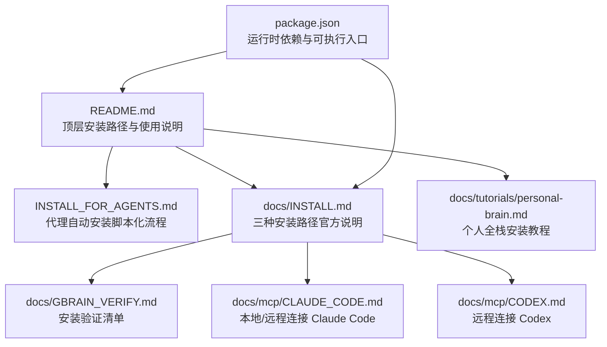
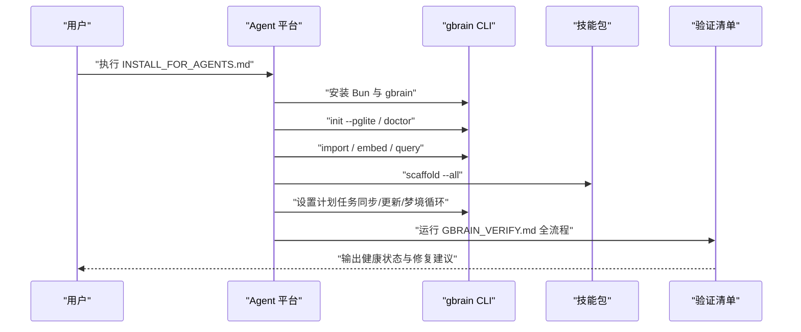
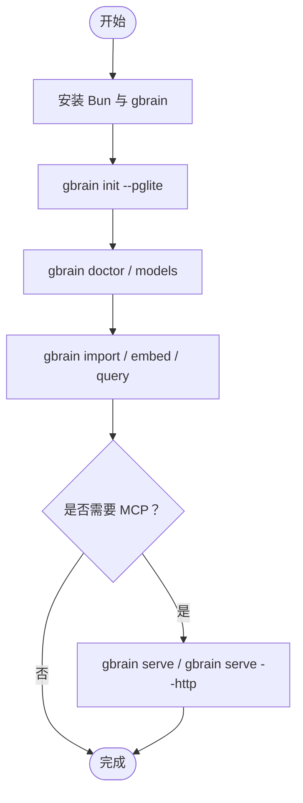
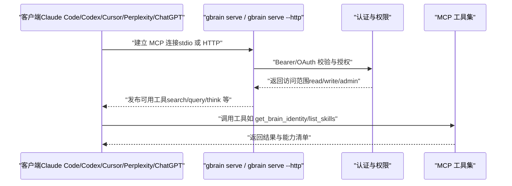
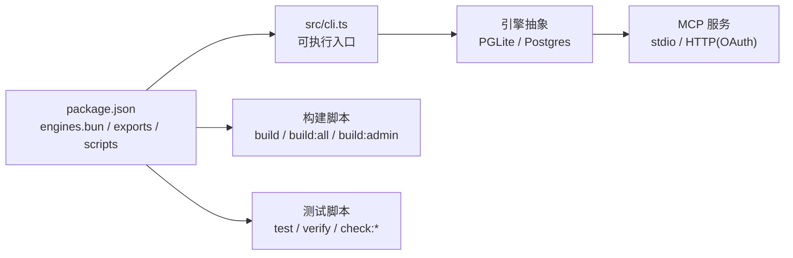

# 安装与快速开始

<cite>
**本文引用的文件**
- [README.md](file://README.md)
- [INSTALL_FOR_AGENTS.md](file://INSTALL_FOR_AGENTS.md)
- [docs/INSTALL.md](file://docs/INSTALL.md)
- [package.json](file://package.json)
- [docs/GBRAIN_VERIFY.md](file://docs/GBRAIN_VERIFY.md)
- [docs/mcp/CLAUDE_CODE.md](file://docs/mcp/CLAUDE_CODE.md)
- [docs/mcp/CODEX.md](file://docs/mcp/CODEX.md)
- [docs/tutorials/personal-brain.md](file://docs/tutorials/personal-brain.md)
- [scripts/check-cli-executable.sh](file://scripts/check-cli-executable.sh)
</cite>

## 目录
1. [简介](#简介)
2. [项目结构](#项目结构)
3. [核心组件](#核心组件)
4. [架构总览](#架构总览)
5. [详细组件分析](#详细组件分析)
6. [依赖关系分析](#依赖关系分析)
7. [性能考虑](#性能考虑)
8. [故障排除指南](#故障排除指南)
9. [结论](#结论)
10. [附录](#附录)

## 简介
本指南面向三类用户：个人用户、团队与企业。围绕三种主要安装路径提供从零到一的完整操作步骤，包括代理自动安装（推荐）、命令行独立安装以及MCP协议集成。文档覆盖环境要求、依赖安装、初始配置、端到端验证与常见问题排查，并给出不同用户群体的落地建议。

## 项目结构
- 根目录提供顶层说明与入口文档，其中 README.md 概述安装路径与使用方式；INSTALL_FOR_AGENTS.md 提供“由代理平台安装”的完整脚本化流程；docs/INSTALL.md 提供三种安装路径的官方说明。
- package.json 描述运行时依赖、构建脚本与可执行入口，明确 Bun 运行时要求。
- docs/GBRAIN_VERIFY.md 提供安装后健康检查清单与端到端验证流程。
- docs/mcp/* 提供与各客户端（Claude Code、Codex 等）的 MCP 集成指引。
- docs/tutorials/personal-brain.md 提供“个人全栈安装”教程，适合首次部署整套系统（含代理平台、托管与聊天界面）。

**图表来源**
- [README.md:66-152](file://README.md#L66-L152)
- [INSTALL_FOR_AGENTS.md:1-355](file://INSTALL_FOR_AGENTS.md#L1-L355)
- [docs/INSTALL.md:1-114](file://docs/INSTALL.md#L1-L114)
- [docs/GBRAIN_VERIFY.md:1-296](file://docs/GBRAIN_VERIFY.md#L1-L296)
- [docs/mcp/CLAUDE_CODE.md:1-91](file://docs/mcp/CLAUDE_CODE.md#L1-L91)
- [docs/mcp/CODEX.md:1-72](file://docs/mcp/CODEX.md#L1-L72)
- [docs/tutorials/personal-brain.md:1-271](file://docs/tutorials/personal-brain.md#L1-L271)
- [package.json:1-148](file://package.json#L1-L148)

**章节来源**
- [README.md:66-152](file://README.md#L66-L152)
- [docs/INSTALL.md:1-114](file://docs/INSTALL.md#L1-L114)
- [package.json:1-148](file://package.json#L1-L148)

## 核心组件
- 可执行入口与运行时
  - CLI 可执行入口位于 src/cli.ts，通过 package.json 的 bin 字段注册为 gbrain 命令；Bun 版本要求在 engines.bun 中声明。
  - 构建产物与脚本在 package.json 的 scripts 节点中定义，便于本地开发与 CI 校验。
- 安装与初始化
  - 支持 PGLite（默认，无需服务器）与 Postgres/Supabase（用于共享/大规模部署）两种引擎形态。
  - 初始化流程会检测仓库规模并建议迁移至 Supabase；可通过 migrate 子命令切换引擎。
- MCP 协议服务
  - 支持 stdio（本地子进程，适用于 Claude Code/Cursor/Windsurf）与 HTTP（OAuth 2.1 + 管理后台）两种模式。
  - 提供 connect/auth 等工具简化远端客户端接入。

**章节来源**
- [package.json:6-8](file://package.json#L6-L8)
- [package.json:142-144](file://package.json#L142-L144)
- [docs/INSTALL.md:22-76](file://docs/INSTALL.md#L22-L76)
- [README.md:131-151](file://README.md#L131-L151)

## 架构总览
下图展示三种安装路径与关键交互节点，帮助理解“代理自动安装”“命令行独立安装”“MCP 协议集成”的边界与衔接。

```mermaid
graph TB
subgraph "代理自动安装推荐"
AG1["Agent 平台OpenClaw/Hermes"] --> AG2["拉取 INSTALL_FOR_AGENTS.md"]
AG2 --> AG3["执行安装脚本Bun、初始化、导入、索引、技能加载、计划任务"]
AG3 --> AG4["生成本地/远程 MCP 连接配置"]
end
subgraph "命令行独立安装"
CL1["Bun 安装 gbrain"] --> CL2["gbrain init --pglite"]
CL2 --> CL3["gbrain doctor 验证"]
CL3 --> CL4["gbrain import / embed / query"]
CL4 --> CL5["本地 MCPstdio或 HTTPOAuth"]
end
subgraph "MCP 协议集成"
MC1["客户端Claude Code/Codex/Cursor/Perplexity/ChatGPT"] --> MC2["MCP 客户端配置"]
MC2 --> MC3["gbrain serve / gbrain serve --http"]
MC3 --> MC4["认证与权限Bearer/OAuth"]
end
```

**图表来源**
- [INSTALL_FOR_AGENTS.md:17-26](file://INSTALL_FOR_AGENTS.md#L17-L26)
- [docs/INSTALL.md:22-94](file://docs/INSTALL.md#L22-L94)
- [docs/mcp/CLAUDE_CODE.md:8-16](file://docs/mcp/CLAUDE_CODE.md#L8-L16)
- [docs/mcp/CODEX.md:8-11](file://docs/mcp/CODEX.md#L8-L11)

## 详细组件分析

### 代理自动安装（推荐）
- 适用对象：希望“让代理平台完成安装与配置”的用户，尤其是首次部署整套系统的个人或团队。
- 关键步骤
  - 安装 Bun 并全局安装 gbrain。
  - 执行初始化（默认 PGLite，无需服务器），随后进行健康检查。
  - 导入知识库（Markdown 文件），生成向量嵌入，执行查询验证。
  - 加载 43 个内置技能包，按需开启自动更新与夜间“梦境循环”等计划任务。
  - 可选：启用知识图谱回填（对已有内容进行链接与时间线抽取）。
  - 可选：根据用户偏好确认检索模式（保守/平衡/tokenmax）。
- 优势
  - 一键完成安装、配置与验证，减少手工操作与错误。
  - 与代理平台（OpenClaw/Hermes）深度集成，便于后续扩展与运维。

**图表来源**
- [INSTALL_FOR_AGENTS.md:17-26](file://INSTALL_FOR_AGENTS.md#L17-L26)
- [INSTALL_FOR_AGENTS.md:57-62](file://INSTALL_FOR_AGENTS.md#L57-L62)
- [INSTALL_FOR_AGENTS.md:132-138](file://INSTALL_FOR_AGENTS.md#L132-L138)
- [INSTALL_FOR_AGENTS.md:187-207](file://INSTALL_FOR_AGENTS.md#L187-L207)
- [INSTALL_FOR_AGENTS.md:232-246](file://INSTALL_FOR_AGENTS.md#L232-L246)
- [docs/GBRAIN_VERIFY.md:1-296](file://docs/GBRAIN_VERIFY.md#L1-L296)

**章节来源**
- [INSTALL_FOR_AGENTS.md:17-26](file://INSTALL_FOR_AGENTS.md#L17-L26)
- [INSTALL_FOR_AGENTS.md:57-62](file://INSTALL_FOR_AGENTS.md#L57-L62)
- [INSTALL_FOR_AGENTS.md:132-138](file://INSTALL_FOR_AGENTS.md#L132-L138)
- [INSTALL_FOR_AGENTS.md:187-207](file://INSTALL_FOR_AGENTS.md#L187-L207)
- [INSTALL_FOR_AGENTS.md:232-246](file://INSTALL_FOR_AGENTS.md#L232-L246)
- [docs/GBRAIN_VERIFY.md:1-296](file://docs/GBRAIN_VERIFY.md#L1-L296)

### 命令行独立安装（无代理）
- 适用对象：不需要代理平台、仅需在本地或服务器上运行 GBrain 的个人或开发者。
- 关键步骤
  - 安装 Bun 并全局安装 gbrain。
  - 初始化（PGLite，默认极快，无需服务器）。
  - 健康检查（doctor）与模型连通性探测。
  - 导入知识库、增量嵌入、查询验证。
  - 可选：将本地脑体接入 MCP 客户端（stdio 或 HTTP）。
- 与代理自动安装差异
  - 该路径更贴近“自管”场景，适合对安装过程有更强掌控力的用户。

**图表来源**
- [docs/INSTALL.md:22-76](file://docs/INSTALL.md#L22-L76)
- [docs/INSTALL.md:95-114](file://docs/INSTALL.md#L95-L114)

**章节来源**
- [docs/INSTALL.md:22-76](file://docs/INSTALL.md#L22-L76)
- [docs/INSTALL.md:95-114](file://docs/INSTALL.md#L95-L114)

### MCP 协议集成
- 适用对象：希望将 GBrain 作为“记忆层”接入现有 AI 客户端（如 Claude Code、Codex、Cursor 等）的用户。
- 两种模式
  - stdio（本地子进程）：适用于 Claude Code、Cursor、Windsurf 等，无需服务器或隧道。
  - HTTP（OAuth 2.1 + 管理后台）：适用于 Claude Desktop/Cowork、Perplexity、ChatGPT 等，支持细粒度权限与速率限制。
- 客户端适配要点
  - Claude Code：本地推荐；远程可通过 gbrain connect 生成粘贴块或直接 --install 自动配置。
  - Codex：远程通过 bearer token 注入，token 来源于环境变量；本地也可用 stdio。
  - Cursor/Windsurf：本地 stdio。
  - Claude Desktop/Cowork：HTTP 模式，组织级配置。
  - Perplexity/ChatGPT：HTTP 模式，OAuth 2.1（PKCE 对于 ChatGPT 必须）。

**图表来源**
- [docs/mcp/CLAUDE_CODE.md:8-44](file://docs/mcp/CLAUDE_CODE.md#L8-L44)
- [docs/mcp/CODEX.md:8-37](file://docs/mcp/CODEX.md#L8-L37)
- [README.md:131-151](file://README.md#L131-L151)

**章节来源**
- [docs/mcp/CLAUDE_CODE.md:8-44](file://docs/mcp/CLAUDE_CODE.md#L8-L44)
- [docs/mcp/CODEX.md:8-37](file://docs/mcp/CODEX.md#L8-L37)
- [README.md:131-151](file://README.md#L131-L151)

## 依赖关系分析
- 运行时与工具链
  - Bun 版本要求：engines.bun >= 1.3.10。
  - CLI 可执行位：src/cli.ts 必须以 100755 执行权限被 git 跟踪，CI 脚本提供校验。
- 核心依赖
  - PGLite 引擎：零配置，适合个人/小规模部署。
  - Postgres/pgvector：用于共享/大规模部署，配合 Supabase 时注意连接池与 IPv4/IPv6 配置。
  - MCP SDK：支持标准 MCP 协议，提供工具发布与权限控制。
- 构建与测试
  - 构建脚本包含二进制编译、Schema 与 LLM 文档生成、Admin 嵌入等。
  - 测试与验证脚本覆盖单元测试、慢速测试、CI 选择性执行与多项静态检查。

**图表来源**
- [package.json:142-144](file://package.json#L142-L144)
- [package.json:31-86](file://package.json#L31-L86)
- [scripts/check-cli-executable.sh:1-24](file://scripts/check-cli-executable.sh#L1-L24)

**章节来源**
- [package.json:142-144](file://package.json#L142-L144)
- [package.json:31-86](file://package.json#L31-L86)
- [scripts/check-cli-executable.sh:1-24](file://scripts/check-cli-executable.sh#L1-L24)

## 性能考虑
- 引擎选择
  - PGLite：极快初始化（约 2 秒），适合个人与小规模知识库。
  - Postgres/Supabase：支持多用户、横向扩展与大规模数据，注意连接池与网络可达性。
- 同步与嵌入
  - 大脑内容增长时，合理安排增量嵌入与同步频率，避免长时间锁竞争。
  - 在 PGLite 上运行 MCP 服务时，建议先停止服务再执行大型同步，避免单写锁争用。
- 检查与诊断
  - 使用 doctor 与 repair-jsonb 等工具定期维护数据库一致性与完整性。
  - 对于超大体量内容，启用 per-source 同步循环并设置超时保护，避免长时间挂起。

[本节为通用指导，不直接分析具体文件，故无“章节来源”]

## 故障排除指南
- 常见问题与修复
  - 嵌入维度不匹配：运行 doctor 获取精确修复命令，或在 init 时显式指定嵌入模型。
  - Cron 同步超时：采用 per-source 循环 + timeout 的模式，结合 break-lock 与 max-age 参数。
  - Supabase 连接异常：优先使用事务池器连接字符串；若主机仅 IPv4，可通过会话池器或直接连接覆盖变量修复。
  - 数据库断连：引擎层具备重试与自愈回调，必要时调整批量重试参数。
  - 重建/回填：对于历史内容缺失链接/时间线，使用 extract links/timeline 回填；对 JSONB 列进行修复。
- 安装后验证
  - 使用 docs/GBRAIN_VERIFY.md 的八步验证清单，重点检查同步覆盖率、嵌入覆盖率、端到端同步与知识图谱回填。
  - 若 doctor 输出黄色提示，按提示逐项修复；若为 schema 版本问题，执行升级或强制迁移。

**章节来源**
- [README.md:290-411](file://README.md#L290-L411)
- [docs/GBRAIN_VERIFY.md:1-296](file://docs/GBRAIN_VERIFY.md#L1-L296)

## 结论
- 代理自动安装（INSTALL_FOR_AGENTS.md）是“零门槛、高可靠”的首选路径，适合首次部署整套系统。
- 命令行独立安装适合对安装过程有更强掌控力的用户，强调本地自管与最小化依赖。
- MCP 协议集成打通了 GBrain 与主流 AI 客户端，实现“记忆层即插即用”。

[本节为总结性内容，不直接分析具体文件，故无“章节来源”]

## 附录

### 不同用户群体的安装方案建议
- 个人用户
  - 推荐：代理自动安装（OpenClaw/Hermes）+ 本地 MCP（stdio）。
  - 若仅需记忆层：命令行独立安装 + Claude Code/Cursor 本地 stdio。
- 团队
  - 推荐：代理自动安装 + HTTP MCP（OAuth）+ 组织级权限管理。
  - 可选：将 GBrain 作为“公司大脑”，按教程搭建多用户、多源、联邦式知识库。
- 企业
  - 推荐：HTTP MCP + OAuth + Supabase/自建 Postgres + 管理后台与审计日志。
  - 注意：生产部署需关注网络可达性（IPv4/IPv6）、连接池配置与安全策略。

**章节来源**
- [docs/tutorials/personal-brain.md:1-271](file://docs/tutorials/personal-brain.md#L1-L271)
- [README.md:66-152](file://README.md#L66-L152)

### 端到端安装验证流程（摘要）
- 健康检查：doctor --json，确认连接、扩展、RLS、schema 版本与嵌入覆盖率。
- 技能加载：确认 agent 已加载技能包并能描述“脑-代理循环”。
- 自动更新：check-update --json，确认计划任务已注册。
- 实时同步：对比 gbrain stats 与仓库文件数，执行一次真实修改并验证搜索命中最新版本。
- 嵌入覆盖率：若嵌入不足，执行 embed --stale 并再次检查。
- 脑优先查找：询问 agent 关于脑内实体的问题，确认其优先使用 gbrain search/query。
- 知识图谱：确认 links 与 timeline_entries 非零；必要时回填 extract links/timeline。
- JSONB 前言完整性：对 v0.12.2 之前的 Postgres 脑体执行 repair-jsonb 并验证。

**章节来源**
- [docs/GBRAIN_VERIFY.md:1-296](file://docs/GBRAIN_VERIFY.md#L1-L296)