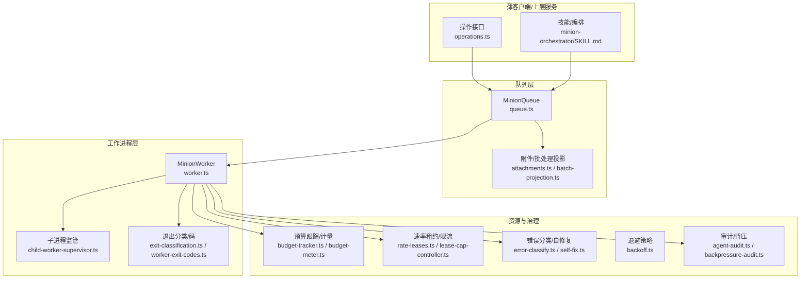
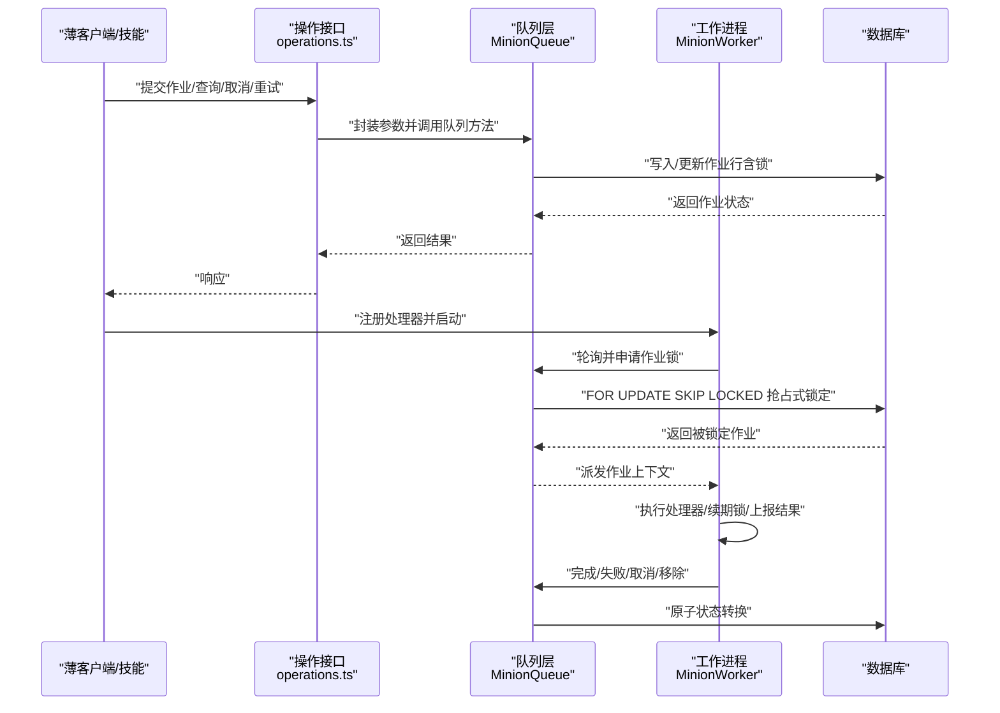
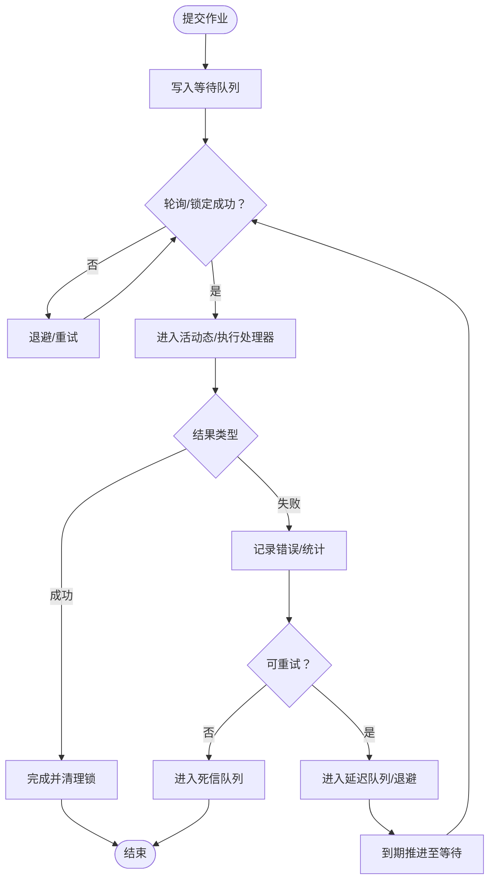
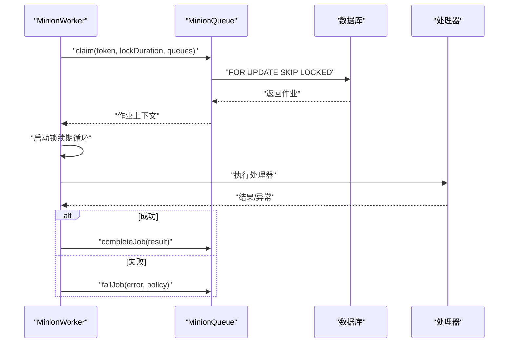
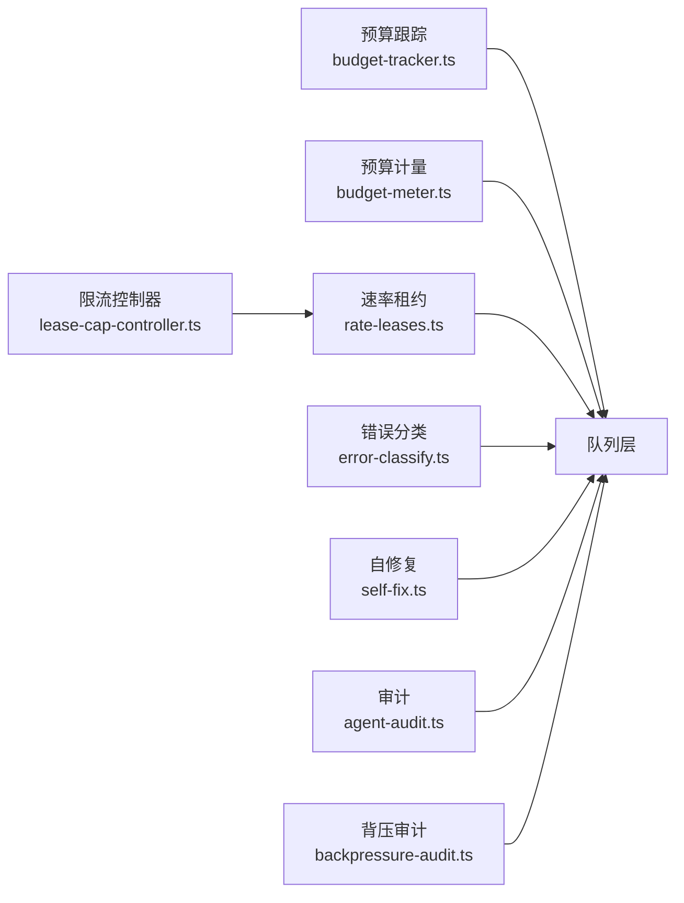
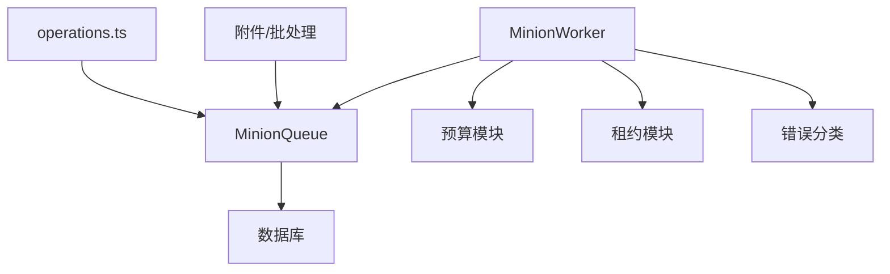

# 作业队列架构

<cite>
**本文引用的文件**
- [src/core/minions/queue.ts](file://src/core/minions/queue.ts)
- [src/core/minions/worker.ts](file://src/core/minions/worker.ts)
- [src/core/operations.ts](file://src/core/operations.ts)
- [test/minions.test.ts](file://test/minions.test.ts)
- [test/e2e/minions-concurrency.test.ts](file://test/e2e/minions-concurrency.test.ts)
- [test/e2e/worker-abort-recovery.test.ts](file://test/e2e/worker-abort-recovery.test.ts)
- [test/wait-for-completion.test.ts](file://test/wait-for-completion.test.ts)
- [src/core/minions/backoff.ts](file://src/core/minions/backoff.ts)
- [src/core/minions/error-classify.ts](file://src/core/minions/error-classify.ts)
- [src/core/minions/budget-tracker.ts](file://src/core/minions/budget-tracker.ts)
- [src/core/minions/budget-meter.ts](file://src/core/minions/budget-meter.ts)
- [src/core/minions/lease-cap-controller.ts](file://src/core/minions/lease-cap-controller.ts)
- [src/core/minions/self-fix.ts](file://src/core/minions/self-fix.ts)
- [src/core/minions/child-worker-supervisor.ts](file://src/core/minions/child-worker-supervisor.ts)
- [src/core/minions/exit-classification.ts](file://src/core/minions/exit-classification.ts)
- [src/core/minions/agent-audit.ts](file://src/core/minions/agent-audit.ts)
- [src/core/minions/attachments.ts](file://src/core/minions/attachments.ts)
- [src/core/minions/batch-projection.ts](file://src/core/minions/batch-projection.ts)
- [src/core/minions/backpressure-audit.ts](file://src/core/minions/backpressure-audit.ts)
- [src/core/minions/niceness.ts](file://src/core/minions/niceness.ts)
- [src/core/minions/worker-exit-codes.ts](file://src/core/minions/worker-exit-codes.ts)
- [src/core/minions/supervisor-pid.ts](file://src/core/minions/supervisor-pid.ts)
- [src/core/minions/rate-leases.ts](file://src/core/minions/rate-leases.ts)
- [docs/guides/minions-deployment.md](file://docs/guides/minions-deployment.md)
- [docs/guides/minions-shell-jobs.md](file://docs/guides/minions-shell-jobs.md)
- [skills/conventions/cron-via-minions.md](file://skills/conventions/cron-via-minions.md)
- [skills/minion-orchestrator/SKILL.md](file://skills/minion-orchestrator/SKILL.md)
</cite>

## 目录
1. [简介](#简介)
2. [项目结构](#项目结构)
3. [核心组件](#核心组件)
4. [架构总览](#架构总览)
5. [详细组件分析](#详细组件分析)
6. [依赖关系分析](#依赖关系分析)
7. [性能考量](#性能考量)
8. [故障排查指南](#故障排查指南)
9. [结论](#结论)
10. [附录](#附录)

## 简介
本文件系统化阐述 GBrain 的 Minions 作业队列架构，覆盖分布式作业调度、工作进程管理、任务队列设计与生命周期；详述错误处理、重试与自修复、资源预算与配额、优先级与并发控制、负载均衡与故障恢复；并提供监控、性能调优与扩展性建议，以及薄客户端模式下的作业执行与状态同步机制。

## 项目结构
Minions 架构由“队列层”和“工作进程层”构成，并辅以资源与错误治理、审计与部署指南等支撑模块。下图给出高层视图：

图表来源
- [src/core/operations.ts:3015-3087](file://src/core/operations.ts#L3015-L3087)
- [src/core/minions/queue.ts:44-200](file://src/core/minions/queue.ts#L44-L200)
- [src/core/minions/worker.ts:150-350](file://src/core/minions/worker.ts#L150-L350)
- [src/core/minions/attachments.ts:1-200](file://src/core/minions/attachments.ts#L1-L200)
- [src/core/minions/batch-projection.ts:1-200](file://src/core/minions/batch-projection.ts#L1-L200)
- [src/core/minions/budget-tracker.ts:1-200](file://src/core/minions/budget-tracker.ts#L1-L200)
- [src/core/minions/budget-meter.ts:1-200](file://src/core/minions/budget-meter.ts#L1-L200)
- [src/core/minions/rate-leases.ts:1-200](file://src/core/minions/rate-leases.ts#L1-L200)
- [src/core/minions/lease-cap-controller.ts:1-200](file://src/core/minions/lease-cap-controller.ts#L1-L200)
- [src/core/minions/error-classify.ts:1-200](file://src/core/minions/error-classify.ts#L1-L200)
- [src/core/minions/self-fix.ts:1-200](file://src/core/minions/self-fix.ts#L1-L200)
- [src/core/minions/backoff.ts:1-200](file://src/core/minions/backoff.ts#L1-L200)
- [src/core/minions/agent-audit.ts:1-200](file://src/core/minions/agent-audit.ts#L1-L200)
- [src/core/minions/backpressure-audit.ts:1-200](file://src/core/minions/backpressure-audit.ts#L1-L200)
- [src/core/minions/child-worker-supervisor.ts:1-200](file://src/core/minions/child-worker-supervisor.ts#L1-L200)
- [src/core/minions/exit-classification.ts:1-200](file://src/core/minions/exit-classification.ts#L1-L200)
- [src/core/minions/worker-exit-codes.ts:1-200](file://src/core/minions/worker-exit-codes.ts#L1-L200)

章节来源
- [src/core/minions/queue.ts:44-200](file://src/core/minions/queue.ts#L44-L200)
- [src/core/minions/worker.ts:150-350](file://src/core/minions/worker.ts#L150-L350)
- [src/core/operations.ts:3015-3087](file://src/core/operations.ts#L3015-L3087)

## 核心组件
- 队列层（MinionQueue）
  - 负责作业提交、查询、状态变更、锁管理、附件与批处理投影、延迟/重试、父子依赖与孤儿处理等。
  - 关键能力：FOR UPDATE SKIP LOCKED 抢占式锁定、延迟作业推进、完成/失败/取消/移除等原子状态转换。
- 工作进程层（MinionWorker）
  - 负责轮询队列、申请作业锁、执行处理器、续期锁、上报进度/结果、异常处理与超时恢复。
  - 关键能力：并发控制、锁续期、信号中断、inbox 读取、令牌更新、子进程监管。
- 操作接口（operations.ts）
  - 提供管理员级作业查询、列表、取消、重试、进度获取等操作，统一入口对接队列层。
- 资源与治理
  - 预算跟踪/计量：按作业树进行预算预留与回退，防止超支。
  - 速率租约/限流：基于上游反馈动态调整租约上限，避免拥塞。
  - 错误分类/自修复：对可恢复错误进行自动重试或降级处理。
  - 退避策略：指数/线性退避，结合抖动与上限。
  - 审计与背压：作业审计日志与背压观测，保障稳定性。
- 附件与批处理
  - 作业附件存储与校验；批处理成本预估与预算投影，指导提交决策。

章节来源
- [src/core/minions/queue.ts:44-200](file://src/core/minions/queue.ts#L44-L200)
- [src/core/minions/worker.ts:150-350](file://src/core/minions/worker.ts#L150-L350)
- [src/core/operations.ts:3015-3087](file://src/core/operations.ts#L3015-L3087)
- [src/core/minions/budget-tracker.ts:1-200](file://src/core/minions/budget-tracker.ts#L1-L200)
- [src/core/minions/budget-meter.ts:1-200](file://src/core/minions/budget-meter.ts#L1-L200)
- [src/core/minions/rate-leases.ts:1-200](file://src/core/minions/rate-leases.ts#L1-L200)
- [src/core/minions/lease-cap-controller.ts:1-200](file://src/core/minions/lease-cap-controller.ts#L1-L200)
- [src/core/minions/error-classify.ts:1-200](file://src/core/minions/error-classify.ts#L1-L200)
- [src/core/minions/self-fix.ts:1-200](file://src/core/minions/self-fix.ts#L1-L200)
- [src/core/minions/backoff.ts:1-200](file://src/core/minions/backoff.ts#L1-L200)
- [src/core/minions/agent-audit.ts:1-200](file://src/core/minions/agent-audit.ts#L1-L200)
- [src/core/minions/backpressure-audit.ts:1-200](file://src/core/minions/backpressure-audit.ts#L1-L200)
- [src/core/minions/attachments.ts:1-200](file://src/core/minions/attachments.ts#L1-L200)
- [src/core/minions/batch-projection.ts:1-200](file://src/core/minions/batch-projection.ts#L1-L200)

## 架构总览
下图展示从薄客户端到队列与工作进程的端到端流程，包括状态同步与薄客户端路由：

图表来源
- [src/core/operations.ts:3015-3087](file://src/core/operations.ts#L3015-L3087)
- [src/core/minions/queue.ts:44-200](file://src/core/minions/queue.ts#L44-L200)
- [src/core/minions/worker.ts:150-350](file://src/core/minions/worker.ts#L150-L350)

## 详细组件分析

### 队列层（MinionQueue）
- 数据模型与状态机
  - 作业状态：waiting、active、completed、failed、delayed、dead、cancelled。
  - 原子状态转换：completeJob、failJob、cancelJob、removeJob、promoteDelayed。
  - 锁管理：claim 时生成 lock_token 并设置 lock_until；支持续期 renewLock。
- 并发与锁
  - 使用 FOR UPDATE SKIP LOCKED 实现无阻塞抢占式锁定，避免热点竞争导致的阻塞。
  - 支持延迟作业推进与过期清理。
- 依赖与拓扑
  - 支持父子依赖、孤儿处理（ON DELETE SET NULL）、子完成收集（child_done）。
- 附件与批处理
  - 附件存储与校验；批处理成本预估用于预算与速率决策。
- 管理接口
  - getJob、getJobs、cancelJob、retryJob、getJobProgress 等。

图表来源
- [src/core/minions/queue.ts:44-200](file://src/core/minions/queue.ts#L44-L200)
- [src/core/minions/backoff.ts:1-200](file://src/core/minions/backoff.ts#L1-L200)
- [src/core/minions/error-classify.ts:1-200](file://src/core/minions/error-classify.ts#L1-L200)

章节来源
- [src/core/minions/queue.ts:44-200](file://src/core/minions/queue.ts#L44-L200)
- [test/minions.test.ts:110-1422](file://test/minions.test.ts#L110-L1422)
- [test/wait-for-completion.test.ts:37-71](file://test/wait-for-completion.test.ts#L37-L71)

### 工作进程层（MinionWorker）
- 生命周期与并发
  - 启动前必须注册至少一个处理器；支持并发度配置与轮询间隔。
  - 执行期间通过信号中断优雅停止；支持超时与死锁检测（stalled）。
- 锁续期与可靠性
  - 在执行过程中周期性续期作业锁，避免被其他实例抢占。
  - 支持子进程监管与退出码分类，便于故障定位。
- 上下文能力
  - 提供 readInbox、updateTokens 等上下文方法，增强处理器灵活性。
- 测试验证
  - 并发冲突去重、超时回收、孤儿传播、深度树 fan-in 等场景均有端到端测试覆盖。

图表来源
- [src/core/minions/worker.ts:150-350](file://src/core/minions/worker.ts#L150-L350)
- [src/core/minions/queue.ts:44-200](file://src/core/minions/queue.ts#L44-L200)
- [test/e2e/minions-concurrency.test.ts:62-103](file://test/e2e/minions-concurrency.test.ts#L62-L103)
- [test/e2e/worker-abort-recovery.test.ts:150-178](file://test/e2e/worker-abort-recovery.test.ts#L150-L178)

章节来源
- [src/core/minions/worker.ts:150-350](file://src/core/minions/worker.ts#L150-L350)
- [src/core/minions/child-worker-supervisor.ts:1-200](file://src/core/minions/child-worker-supervisor.ts#L1-L200)
- [src/core/minions/exit-classification.ts:1-200](file://src/core/minions/exit-classification.ts#L1-L200)
- [src/core/minions/worker-exit-codes.ts:1-200](file://src/core/minions/worker-exit-codes.ts#L1-L200)
- [test/minions.test.ts:540-610](file://test/minions.test.ts#L540-L610)

### 资源与治理
- 预算与配额
  - 预算预留/结算/撤销，支持作业树级预算继承与根节点隔离。
  - 通过 advisory locks 保证跨事务一致性。
- 速率租约与自适应
  - 基于上游 429/不稳定响应动态下调，健康时上调，避免人工瓶颈。
- 错误分类与自修复
  - 对可恢复错误进行自动重试或降级；不可恢复错误直接进入死信。
- 审计与背压
  - 作业审计日志与背压观测，辅助容量规划与问题定位。

图表来源
- [src/core/minions/budget-tracker.ts:1-200](file://src/core/minions/budget-tracker.ts#L1-L200)
- [src/core/minions/budget-meter.ts:1-200](file://src/core/minions/budget-meter.ts#L1-L200)
- [src/core/minions/rate-leases.ts:1-200](file://src/core/minions/rate-leases.ts#L1-L200)
- [src/core/minions/lease-cap-controller.ts:1-200](file://src/core/minions/lease-cap-controller.ts#L1-L200)
- [src/core/minions/error-classify.ts:1-200](file://src/core/minions/error-classify.ts#L1-L200)
- [src/core/minions/self-fix.ts:1-200](file://src/core/minions/self-fix.ts#L1-L200)
- [src/core/minions/agent-audit.ts:1-200](file://src/core/minions/agent-audit.ts#L1-L200)
- [src/core/minions/backpressure-audit.ts:1-200](file://src/core/minions/backpressure-audit.ts#L1-L200)

章节来源
- [src/core/minions/budget-tracker.ts:1-200](file://src/core/minions/budget-tracker.ts#L1-L200)
- [src/core/minions/budget-meter.ts:1-200](file://src/core/minions/budget-meter.ts#L1-L200)
- [src/core/minions/lease-cap-controller.ts:1-200](file://src/core/minions/lease-cap-controller.ts#L1-L200)
- [src/core/minions/error-classify.ts:1-200](file://src/core/minions/error-classify.ts#L1-L200)
- [src/core/minions/self-fix.ts:1-200](file://src/core/minions/self-fix.ts#L1-L200)
- [src/core/minions/agent-audit.ts:1-200](file://src/core/minions/agent-audit.ts#L1-L200)
- [src/core/minions/backpressure-audit.ts:1-200](file://src/core/minions/backpressure-audit.ts#L1-L200)

### 附件与批处理投影
- 附件
  - 作业级二进制附件存储、校验与检索，支持内容类型与大小约束。
- 批处理投影
  - 提交时的成本估算（价格/延迟），用于预算与速率门控。

章节来源
- [src/core/minions/attachments.ts:1-200](file://src/core/minions/attachments.ts#L1-L200)
- [src/core/minions/batch-projection.ts:1-200](file://src/core/minions/batch-projection.ts#L1-L200)

### 薄客户端模式与状态同步
- 薄客户端通过操作接口（operations.ts）提交作业并查询状态，无需直接连接工作进程。
- waitForCompletion 提供阻塞等待与超时控制，支持在薄客户端侧进行状态轮询与事件驱动。

章节来源
- [src/core/operations.ts:3015-3087](file://src/core/operations.ts#L3015-L3087)
- [test/wait-for-completion.test.ts:37-71](file://test/wait-for-completion.test.ts#L37-L71)

## 依赖关系分析
- 组件耦合
  - 队列层与工作进程层通过数据库共享状态，低耦合高内聚。
  - 资源治理模块（预算/租约/错误分类）作为横切关注点注入队列与工作进程。
- 外部依赖
  - 数据库（Postgres/PGLite）提供 ACID 事务与锁原语。
  - 可选的直接池路由（dual-pool）在特定场景下优化锁路径。

图表来源
- [src/core/minions/queue.ts:44-200](file://src/core/minions/queue.ts#L44-L200)
- [src/core/minions/worker.ts:150-350](file://src/core/minions/worker.ts#L150-L350)
- [src/core/operations.ts:3015-3087](file://src/core/operations.ts#L3015-L3087)

章节来源
- [src/core/minions/queue.ts:44-200](file://src/core/minions/queue.ts#L44-L200)
- [src/core/minions/worker.ts:150-350](file://src/core/minions/worker.ts#L150-L350)
- [src/core/operations.ts:3015-3087](file://src/core/operations.ts#L3015-L3087)

## 性能考量
- 并发与锁
  - 使用 FOR UPDATE SKIP LOCKED 降低争用；合理设置并发与轮询间隔，避免过度扫描。
- 锁续期
  - 为长任务配置合适的 lockDuration 与续期节奏，避免被抢占或僵尸锁。
- 退避与重试
  - 结合指数退避与抖动，设置最大重试次数与上限时间，防止雪崩。
- 预算与速率
  - 通过预算预留与租约自适应，平衡吞吐与成本；对突发流量设置合理的峰值窗口。
- 监控与观测
  - 利用审计与背压观测指标，持续优化阈值与参数。

## 故障排查指南
- 常见问题
  - 作业长时间处于 active 且无进展：检查锁续期是否正常、是否存在死锁或长时间阻塞。
  - 重复执行同一作业：确认 FOR UPDATE SKIP LOCKED 是否生效、并发配置是否正确。
  - 失败后未重试：核对错误分类与重试策略、退避参数与最大尝试次数。
  - 预算超支或速率受限：检查预算预留/结算逻辑与租约控制器行为。
- 排查步骤
  - 使用 operations 接口查询作业状态与进度。
  - 查看审计日志与背压观测，定位异常时段与热点。
  - 检查子进程监管与退出码分类，识别致命错误与可恢复错误。

章节来源
- [src/core/operations.ts:3015-3087](file://src/core/operations.ts#L3015-L3087)
- [src/core/minions/agent-audit.ts:1-200](file://src/core/minions/agent-audit.ts#L1-L200)
- [src/core/minions/backpressure-audit.ts:1-200](file://src/core/minions/backpressure-audit.ts#L1-L200)
- [src/core/minions/child-worker-supervisor.ts:1-200](file://src/core/minions/child-worker-supervisor.ts#L1-L200)
- [src/core/minions/exit-classification.ts:1-200](file://src/core/minions/exit-classification.ts#L1-L200)

## 结论
GBrain 的 Minions 作业队列以“队列层+工作进程层”为核心，配合预算、租约、错误分类与审计等治理模块，实现了高可用、可观测、可扩展的分布式作业调度体系。通过 FOR UPDATE SKIP LOCKED、锁续期、自适应租约与自修复机制，系统在复杂生产环境中保持稳定与高效。薄客户端通过统一的操作接口即可完成作业提交与状态查询，满足多样化使用场景。

## 附录
- 部署与运维
  - 参考部署指南与示例环境变量，确保锁续期、并发与速率参数与硬件能力匹配。
- 最佳实践
  - 明确作业优先级与队列分组；为长耗时作业设置合理的超时与续期；启用预算与租约保护；定期审查错误分类与自修复策略。

章节来源
- [docs/guides/minions-deployment.md](file://docs/guides/minions-deployment.md)
- [docs/guides/minions-shell-jobs.md](file://docs/guides/minions-shell-jobs.md)
- [skills/conventions/cron-via-minions.md](file://skills/conventions/cron-via-minions.md)
- [skills/minion-orchestrator/SKILL.md](file://skills/minion-orchestrator/SKILL.md)