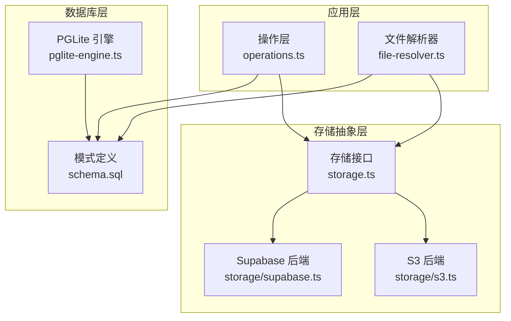
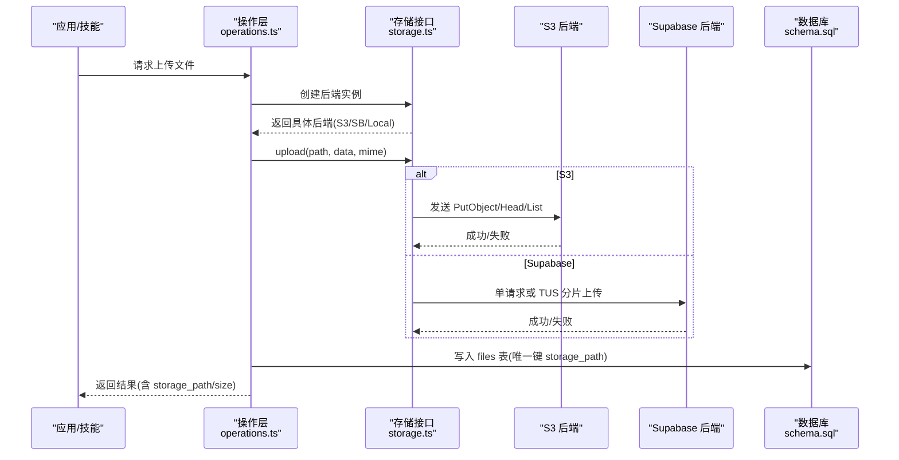
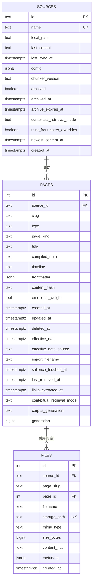
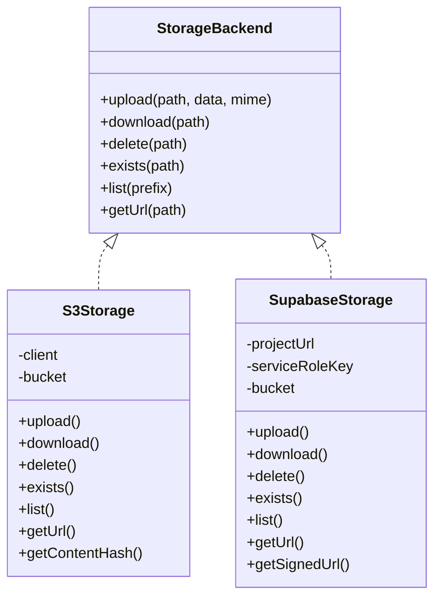
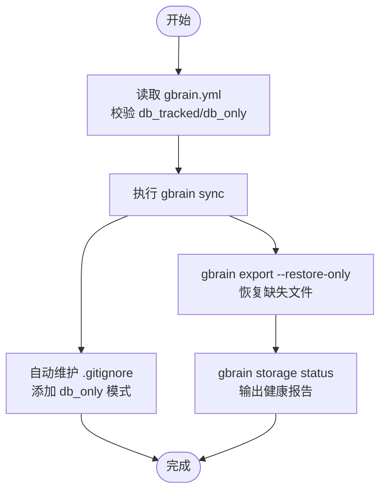
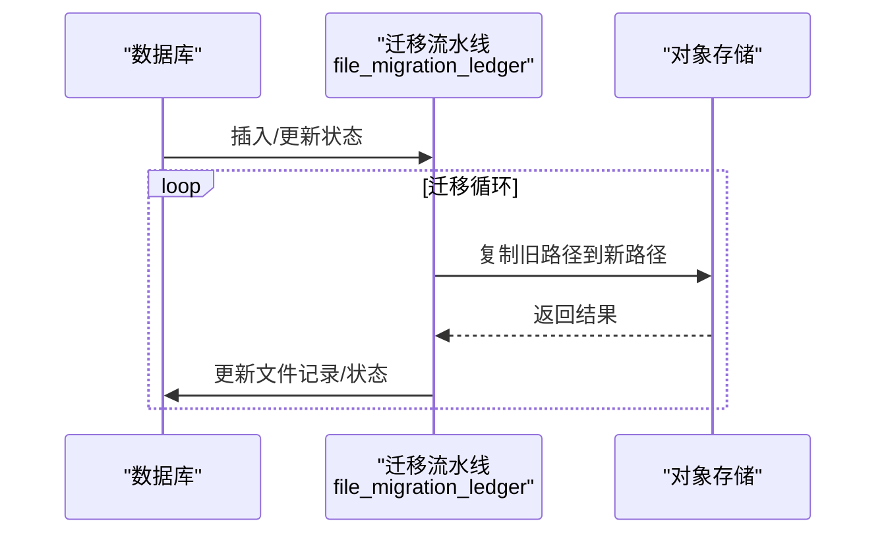
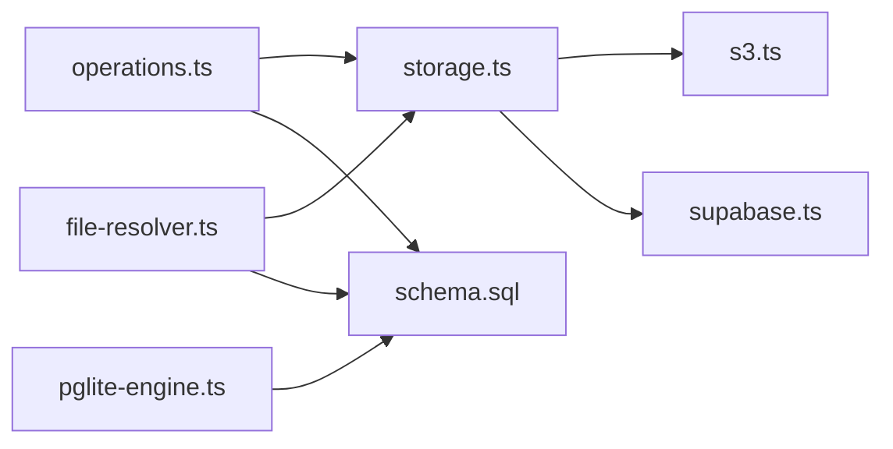

# 存储架构

<cite>
**本文引用的文件**
- [storage-tiering.md](file://docs/storage-tiering.md)
- [schema.sql](file://src/schema.sql)
- [pglite-engine.ts](file://src/core/pglite-engine.ts)
- [storage.ts](file://src/core/storage.ts)
- [s3.ts](file://src/core/storage/s3.ts)
- [supabase.ts](file://src/core/storage/supabase.ts)
- [file-resolver.ts](file://src/core/file-resolver.ts)
- [operations.ts](file://src/core/operations.ts)
- [INSTALL.md](file://docs/INSTALL.md)
- [schema-diff.ts](file://test/helpers/schema-diff.ts)
- [multi-source.test.ts](file://test/e2e/multi-source.test.ts)
- [storage-tiering.test.ts](file://test/e2e/storage-tiering.test.ts)
- [storage-backfill.test.ts](file://test/storage-backfill.test.ts)
</cite>

## 目录
1. [简介](#简介)
2. [项目结构](#项目结构)
3. [核心组件](#核心组件)
4. [架构总览](#架构总览)
5. [组件详解](#组件详解)
6. [依赖关系分析](#依赖关系分析)
7. [性能考量](#性能考量)
8. [故障排除指南](#故障排除指南)
9. [结论](#结论)
10. [附录](#附录)

## 简介
本文件系统性梳理 GBrain 的存储架构，覆盖数据库模式设计、表结构与索引策略、本地存储、S3 对象存储与 Supabase 存储的实现与使用场景，并给出数据持久化策略、备份与恢复、存储配额管理、数据迁移方案、性能优化建议以及多租户数据隔离与访问控制机制。

## 项目结构
围绕存储相关的关键目录与文件：
- 文档：存储分层与配置说明（docs/storage-tiering.md）
- 数据库模式：核心表、索引与扩展（src/schema.sql）
- 引擎与快照：PGLite 引擎初始化与快照加载（src/core/pglite-engine.ts）
- 存储抽象与后端：统一接口与 S3/Supabase/本地实现（src/core/storage.ts、src/core/storage/s3.ts、src/core/storage/supabase.ts）
- 文件解析与路由：从磁盘到对象存储的映射与校验（src/core/file-resolver.ts）
- 操作层：文件上传、下载、URL 获取等操作（src/core/operations.ts）
- 安装与迁移：引擎切换与部署路径（docs/INSTALL.md）
- 测试与校验：模式差异快照、多源一致性、存储回填与分层状态（test/*）

图示来源
- [storage.ts:1-53](file://src/core/storage.ts#L1-L53)
- [s3.ts:1-110](file://src/core/storage/s3.ts#L1-L110)
- [supabase.ts:1-211](file://src/core/storage/supabase.ts#L1-L211)
- [operations.ts:2711-2750](file://src/core/operations.ts#L2711-L2750)
- [file-resolver.ts:76-104](file://src/core/file-resolver.ts#L76-L104)
- [schema.sql:766-789](file://src/schema.sql#L766-L789)
- [pglite-engine.ts:1-200](file://src/core/pglite-engine.ts#L1-L200)

章节来源
- [storage-tiering.md:1-211](file://docs/storage-tiering.md#L1-L211)
- [schema.sql:1-800](file://src/schema.sql#L1-L800)
- [pglite-engine.ts:1-200](file://src/core/pglite-engine.ts#L1-L200)
- [storage.ts:1-53](file://src/core/storage.ts#L1-L53)
- [s3.ts:1-110](file://src/core/storage/s3.ts#L1-L110)
- [supabase.ts:1-211](file://src/core/storage/supabase.ts#L1-L211)
- [file-resolver.ts:76-104](file://src/core/file-resolver.ts#L76-L104)
- [operations.ts:2711-2750](file://src/core/operations.ts#L2711-L2750)
- [INSTALL.md:1-114](file://docs/INSTALL.md#L1-L114)

## 核心组件
- 存储抽象接口与工厂：定义统一的上传/下载/删除/存在性检查/列举/获取 URL 能力，并按配置动态选择后端（S3、Supabase、本地）。
- S3 兼容后端：基于 @aws-sdk/client-s3，支持标准上传与自定义 endpoint（如 R2/MinIO），并进行内容类型与错误处理。
- Supabase 后端：根据文件大小自动选择单请求或 TUS 断点续传上传，支持签名 URL 与公开 URL 回退。
- 文件解析器：在本地磁盘与对象存储之间建立映射，支持 .supabase 前缀标记与重定向文件，执行路径遍历防护。
- 数据库模式：以 pages/content_chunks/files 等为核心，配合索引与触发器支撑检索、缓存失效与多模态向量检索。
- 引擎与快照：PGLite 引擎负责本地嵌入式数据库生命周期管理与可选快照加速初始化；支持分类初始化失败原因并给出修复提示。
- 操作层：封装文件上传、URL 获取等操作，保证数据库与对象存储的一致性（失败时回滚对象存储）。

章节来源
- [storage.ts:1-53](file://src/core/storage.ts#L1-L53)
- [s3.ts:1-110](file://src/core/storage/s3.ts#L1-L110)
- [supabase.ts:1-211](file://src/core/storage/supabase.ts#L1-L211)
- [file-resolver.ts:76-104](file://src/core/file-resolver.ts#L76-L104)
- [schema.sql:766-789](file://src/schema.sql#L766-L789)
- [pglite-engine.ts:1-200](file://src/core/pglite-engine.ts#L1-L200)
- [operations.ts:2711-2750](file://src/core/operations.ts#L2711-L2750)

## 架构总览
下图展示 GBrain 存储子系统的整体交互：应用通过操作层调用存储抽象，再由具体后端对接对象存储；文件元数据同时写入数据库；文件解析器在本地与对象存储间做路径映射与安全校验。

图示来源
- [operations.ts:2711-2750](file://src/core/operations.ts#L2711-L2750)
- [storage.ts:1-53](file://src/core/storage.ts#L1-L53)
- [s3.ts:1-110](file://src/core/storage/s3.ts#L1-L110)
- [supabase.ts:1-211](file://src/core/storage/supabase.ts#L1-L211)
- [schema.sql:766-789](file://src/schema.sql#L766-L789)

## 组件详解

### 数据库模式与表结构
- sources：多源/多脑多租户基础表，记录每个逻辑 brain 的标识、名称、本地路径、配置与归档字段，支持联邦搜索与访问策略槽位。
- pages：核心内容表，按 source_id 进行多租户隔离，slug 在 source_id 下唯一；包含页面类型、编译真相、时间线、前端元数据、情感权重、软删除、salience/recency 等字段；带 generation 计数器与多类索引。
- content_chunks：分块文本与嵌入，支持语言/符号信息、FTS 向量、多模态向量；提供 HNSW 索引与部分索引加速检索与过期嵌入扫描。
- code_edges_chunk / code_edges_symbol：代码结构边，分别面向已解析与未解析目标，提供多维索引支撑符号级关系查询。
- links：跨页链接，支持来源标签、类型、解析方式、前因字段等，带多索引保障查询效率。
- tags：页面标签，支持快速筛选。
- raw_data：侧车数据，按 page_id+source 唯一。
- timeline_entries：结构化时间线，带去重索引。
- page_versions：compiled_truth 快照历史。
- ingest_log：按 source_id 聚合的导入日志。
- config：脑级设置（版本、嵌入模型、维度、分块策略）。
- access_tokens / mcp_request_log：令牌与远程 MCP 使用日志。
- oauth_clients / oauth_tokens / oauth_codes：OAuth 2.1 客户端、令牌与授权码。
- op_checkpoints / op_checkpoint_paths：长任务断点与增量记录。
- context_volunteer_events：上下文自愿事件日志。
- files：二进制附件，记录 source_id/page_id/filename/storage_path/mime/size/content_hash/metadata；storage_path 唯一；迁移 ledger 驱动对象重写。

图示来源
- [schema.sql:26-58](file://src/schema.sql#L26-L58)
- [schema.sql:85-153](file://src/schema.sql#L85-L153)
- [schema.sql:766-789](file://src/schema.sql#L766-L789)

章节来源
- [schema.sql:1-800](file://src/schema.sql#L1-L800)

### 索引策略与查询优化
- pages：类型、前端元数据(GIN)、标题 trigram(GIN)、更新时间降序(B-tree)、source_id、软删除过滤索引、最近检索时间(B-tree)、链接提取水印(source_id+links_extracted_at 复合)、有效日期表达式索引(COALESCE)。
- content_chunks：page_id+chunk_index 唯一、page_id、embedding(HNSW)、语言/符号部分索引、图像向量部分索引、FTS 向量(GIN)、过期嵌入(stale)部分索引。
- links：from/to/source/origin 多索引。
- tags：page_id/tag 唯一。
- raw_data：page_id。
- timeline_entries：page_id/date/summary/source 唯一。
- files：page_slug/page_id/source_id/content_hash。
- 其他：config、access_tokens、oauth_*、op_checkpoints、context_volunteer_events 等均有针对性索引。

章节来源
- [schema.sql:256-291](file://src/schema.sql#L256-L291)
- [schema.sql:331-352](file://src/schema.sql#L331-L352)
- [schema.sql:497-500](file://src/schema.sql#L497-L500)
- [schema.sql:512-513](file://src/schema.sql#L512-L513)
- [schema.sql:542-547](file://src/schema.sql#L542-L547)
- [schema.sql:558-560](file://src/schema.sql#L558-L560)
- [schema.sql:578-581](file://src/schema.sql#L578-L581)
- [schema.sql:591-596](file://src/schema.sql#L591-L596)
- [schema.sql:611-611](file://src/schema.sql#L611-L611)
- [schema.sql:657-660](file://src/schema.sql#L657-L660)
- [schema.sql:672-673](file://src/schema.sql#L672-L673)
- [schema.sql:713-714](file://src/schema.sql#L713-L714)
- [schema.sql:748-751](file://src/schema.sql#L748-L751)

### 本地存储、S3 对象存储与 Supabase 存储
- 存储抽象与工厂：统一接口定义上传/下载/删除/存在性/列举/获取 URL；按配置选择后端。
- S3 兼容：支持自定义 endpoint（R2/MinIO），自动 path-style；校验凭据；返回 ETag 作为内容哈希。
- Supabase：小文件单请求上传，大文件采用 TUS 断点续传（6MB 分片 + 指数回退）；支持签名 URL 与公开 URL 回退。
- 文件解析器：支持 .supabase 前缀标记与重定向文件，执行路径遍历防护；当检测到对象存储镜像目录时，构造 storage_path 并下载。
- 操作层：上传成功后写入 files 表（storage_path 唯一），失败则尝试删除对象存储中的文件以保持一致。

图示来源
- [storage.ts:1-53](file://src/core/storage.ts#L1-L53)
- [s3.ts:1-110](file://src/core/storage/s3.ts#L1-L110)
- [supabase.ts:1-211](file://src/core/storage/supabase.ts#L1-L211)

章节来源
- [storage.ts:1-53](file://src/core/storage.ts#L1-L53)
- [s3.ts:1-110](file://src/core/storage/s3.ts#L1-L110)
- [supabase.ts:1-211](file://src/core/storage/supabase.ts#L1-L211)
- [file-resolver.ts:76-104](file://src/core/file-resolver.ts#L76-L104)
- [operations.ts:2711-2750](file://src/core/operations.ts#L2711-L2750)

### 存储分层与配置
- 存储分层：db_tracked（版本控制）与 db_only（仅数据库持久化，容器重启不丢失，可通过导出恢复）。
- 配置项：gbrain.yml 中 storage.db_tracked/db_only 目录列表；路径需以 “/” 结尾；同一目录不可同时出现在两个层级。
- 自动 .gitignore 管理：同步成功后自动维护受控注释块，避免 db_only 内容进入 git。
- 导出恢复：--restore-only 只恢复缺失文件；支持按类型与 slug 前缀过滤。
- 存储状态：统计各层页面数量、磁盘用量、缺失文件清单等。

图示来源
- [storage-tiering.md:11-86](file://docs/storage-tiering.md#L11-L86)
- [storage-tiering.md:87-144](file://docs/storage-tiering.md#L87-L144)

章节来源
- [storage-tiering.md:1-211](file://docs/storage-tiering.md#L1-L211)

### 多租户数据隔离与访问控制
- 多源隔离：所有核心表均携带 source_id，确保不同逻辑 brain 的数据相互独立。
- 多租户锁：构建带数据库名的锁 ID，避免共享集群中不同数据库实例间的竞争。
- 访问令牌与 OAuth：access_tokens 支持作用域与最后使用时间；oauth_clients/oauth_tokens/oauth_codes 提供客户端与令牌管理，支持每日预算、工具绑定、源/脑/页前缀绑定与并发限制。
- 权限默认值：迁移回填 access_tokens 默认 takes_holders 权限，确保新令牌具备最小可用权限集。

章节来源
- [schema.sql:26-58](file://src/schema.sql#L26-L58)
- [schema.sql:601-611](file://src/schema.sql#L601-L611)
- [schema.sql:631-670](file://src/schema.sql#L631-L670)
- [db-lock.ts:916-928](file://src/core/db-lock.ts#L916-L928)
- [auth-permissions.test.ts:47-67](file://test/e2e/auth-permissions.test.ts#L47-L67)

### 数据持久化策略、备份与恢复
- 文件迁移流水线：v0.18.0 引入 file_migration_ledger 状态机（pending → copy_done → db_updated → complete），驱动对象存储重写与数据库更新，支持崩溃恢复。
- 存储回填测试：验证迁移阶段的幂等性与错误恢复语义。
- 快照与恢复：PGLite 支持快照（tar.gz + 版本文件）匹配与热加载，不匹配时回退正常初始化流程。

图示来源
- [schema.sql:798-800](file://src/schema.sql#L798-L800)
- [storage-backfill.test.ts:1-34](file://test/storage-backfill.test.ts#L1-L34)
- [multi-source.test.ts:508-539](file://test/e2e/multi-source.test.ts#L508-L539)

章节来源
- [schema.sql:798-800](file://src/schema.sql#L798-L800)
- [storage-backfill.test.ts:1-34](file://test/storage-backfill.test.ts#L1-L34)
- [multi-source.test.ts:508-539](file://test/e2e/multi-source.test.ts#L508-L539)
- [pglite-engine.ts:70-113](file://src/core/pglite-engine.ts#L70-L113)

### 存储配额管理与数据迁移
- 配额与预算：OAuth 客户端支持每日预算上限、并发限制与资源绑定，用于控制外部服务消费。
- 引擎迁移：安装文档提供从 PGLite 切换到 Supabase 的命令与建议，适用于大规模部署与多用户场景。
- 模式差异校验：通过快照对比 Postgres 与 PGLite 的索引差异，确保双引擎一致性。

章节来源
- [schema.sql:644-651](file://src/schema.sql#L644-L651)
- [INSTALL.md:33-40](file://docs/INSTALL.md#L33-L40)
- [schema-diff.ts:94-113](file://test/helpers/schema-diff.ts#L94-L113)

## 依赖关系分析
- 存储抽象层依赖于具体后端实现；操作层依赖存储抽象与数据库连接；文件解析器依赖存储抽象与配置。
- 数据库层通过外键约束与唯一约束保障数据完整性；索引覆盖常见查询路径。
- 多源/多租户通过 source_id 实现强隔离；锁机制避免跨实例竞争。

图示来源
- [operations.ts:2711-2750](file://src/core/operations.ts#L2711-L2750)
- [storage.ts:1-53](file://src/core/storage.ts#L1-L53)
- [s3.ts:1-110](file://src/core/storage/s3.ts#L1-L110)
- [supabase.ts:1-211](file://src/core/storage/supabase.ts#L1-L211)
- [file-resolver.ts:76-104](file://src/core/file-resolver.ts#L76-L104)
- [schema.sql:766-789](file://src/schema.sql#L766-L789)
- [pglite-engine.ts:1-200](file://src/core/pglite-engine.ts#L1-L200)

章节来源
- [operations.ts:2711-2750](file://src/core/operations.ts#L2711-L2750)
- [storage.ts:1-53](file://src/core/storage.ts#L1-L53)
- [s3.ts:1-110](file://src/core/storage/s3.ts#L1-L110)
- [supabase.ts:1-211](file://src/core/storage/supabase.ts#L1-L211)
- [file-resolver.ts:76-104](file://src/core/file-resolver.ts#L76-L104)
- [schema.sql:766-789](file://src/schema.sql#L766-L789)
- [pglite-engine.ts:1-200](file://src/core/pglite-engine.ts#L1-L200)

## 性能考量
- 索引选择：对高频过滤列（type、frontmatter、updated_at、source_id、deleted_at、last_retrieved_at、links_extracted_at）建立合适索引；HNSW 用于向量相似度检索；FTS 向量加速符号级检索。
- 查询路径：生成器计数器与序列配合，避免热点行锁；表达式索引提升日期范围过滤性能。
- 上传策略：大文件采用 TUS 断点续传，减少网络抖动影响；小文件单请求上传，降低开销。
- 初始化加速：PGLite 支持快照加载，匹配失败自动回退；快照版本与迁移哈希校验确保一致性。
- 并发与锁：多租户锁加数据库名后缀；锁释放失败自动过期，避免死锁。

章节来源
- [schema.sql:195-251](file://src/schema.sql#L195-L251)
- [supabase.ts:42-148](file://src/core/storage/supabase.ts#L42-L148)
- [pglite-engine.ts:70-135](file://src/core/pglite-engine.ts#L70-L135)
- [db-lock.ts:916-928](file://src/core/db-lock.ts#L916-L928)

## 故障排除指南
- PGLite 初始化失败：根据错误特征（bunfs、macOS 26.3 WASM）给出修复建议；必要时释放锁并重试。
- 对象存储认证：S3 需要 accessKeyId/secretAccessKey；Supabase 需要 projectUrl/serviceRoleKey。
- 路径遍历防护：.supabase 前缀与文件名均进行严格校验，阻断非法路径。
- 上传一致性：操作层在数据库写入失败时尝试删除对象存储文件，避免悬挂对象。
- 模式漂移：通过索引快照对比发现差异，确保 Postgres 与 PGLite 一致性。

章节来源
- [pglite-engine.ts:159-196](file://src/core/pglite-engine.ts#L159-L196)
- [s3.ts:23-37](file://src/core/storage/s3.ts#L23-L37)
- [supabase.ts:21-28](file://src/core/storage/supabase.ts#L21-L28)
- [file-resolver.ts:93-102](file://src/core/file-resolver.ts#L93-L102)
- [operations.ts:2724-2733](file://src/core/operations.ts#L2724-L2733)
- [schema-diff.ts:94-113](file://test/helpers/schema-diff.ts#L94-L113)

## 结论
GBrain 的存储架构以“数据库为中心、对象存储为补充、本地缓存为加速”的三层设计实现高扩展与高可用。通过多源/多租户隔离、完善的索引体系、对象存储的断点续传与签名 URL、以及严格的路径校验与一致性保障，系统在个人知识库与企业级部署中均具备良好表现。配合存储分层与迁移工具链，可平滑演进至大规模与多环境场景。

## 附录
- 安装与迁移路径参考：[INSTALL.md:33-40](file://docs/INSTALL.md#L33-L40)
- 存储分层配置与行为参考：[storage-tiering.md:11-144](file://docs/storage-tiering.md#L11-L144)
- 数据库模式与索引参考：[schema.sql:256-291](file://src/schema.sql#L256-L291)