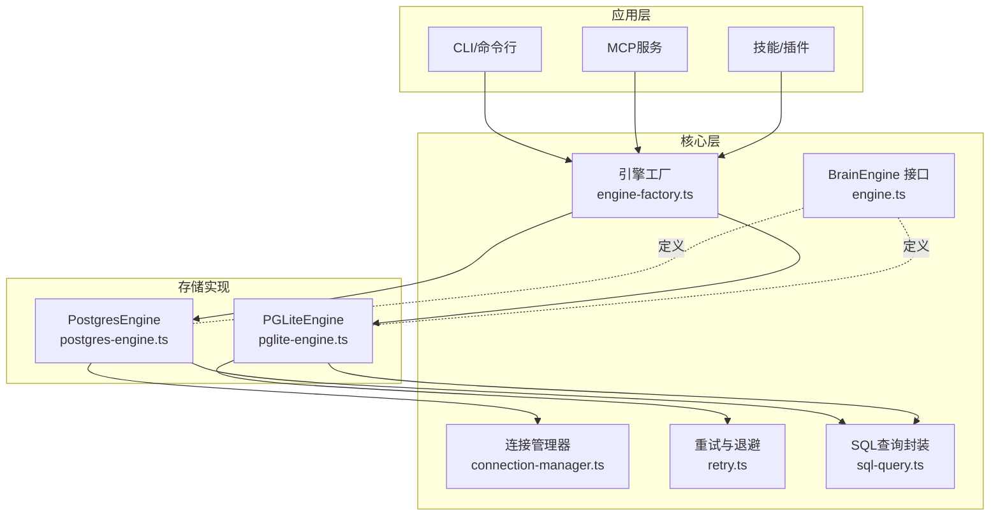
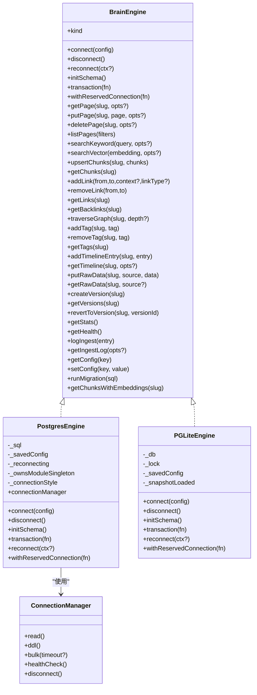
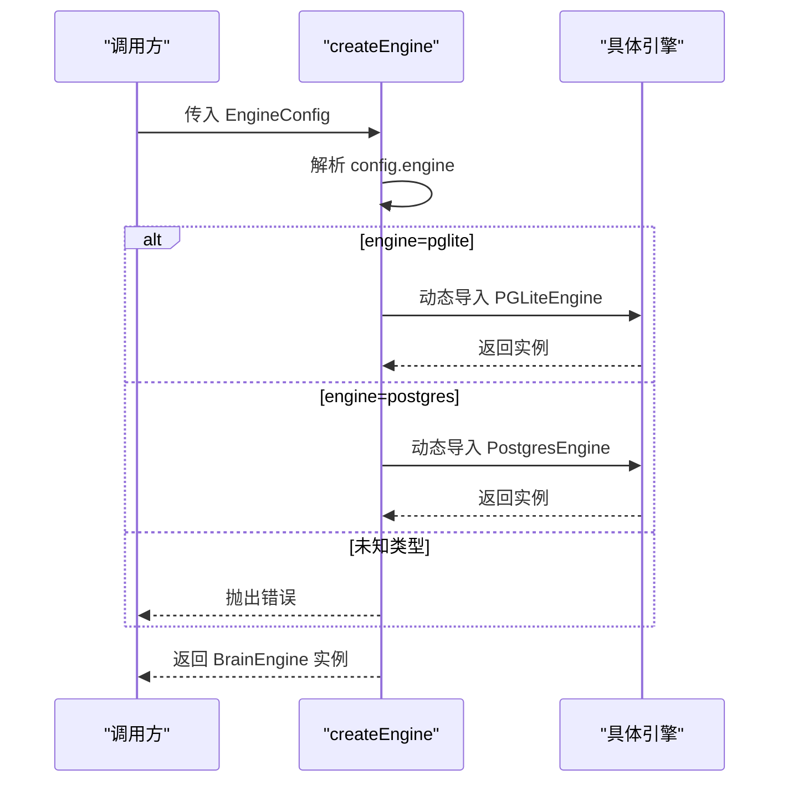
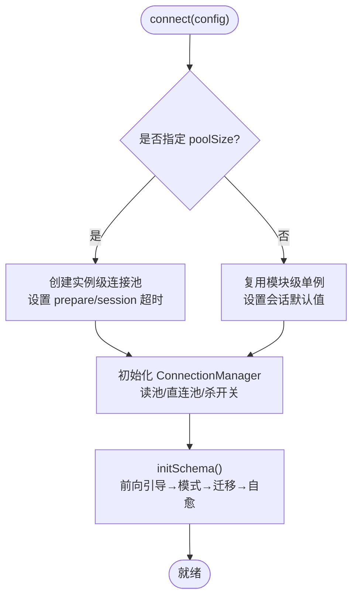
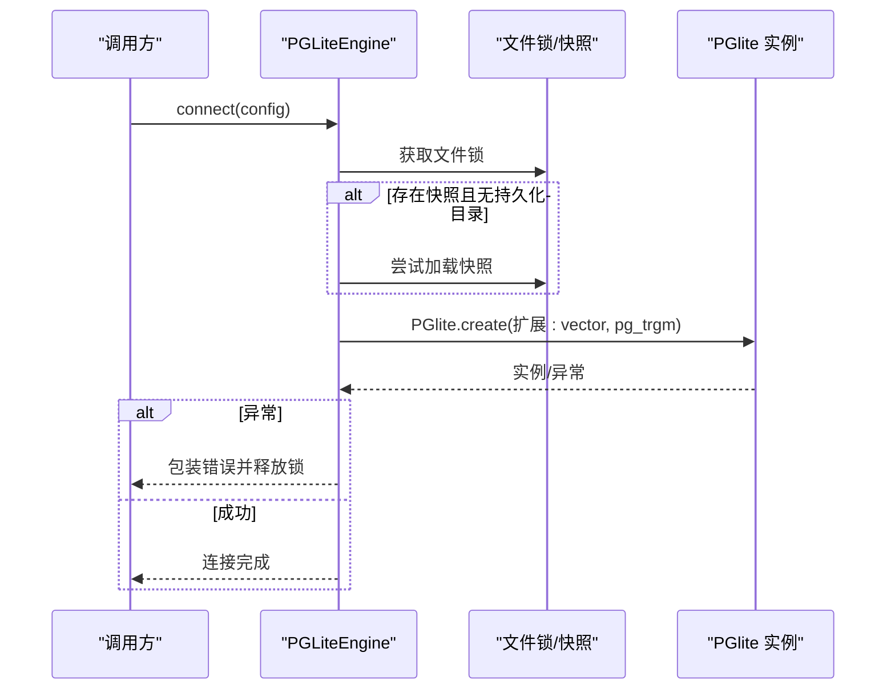
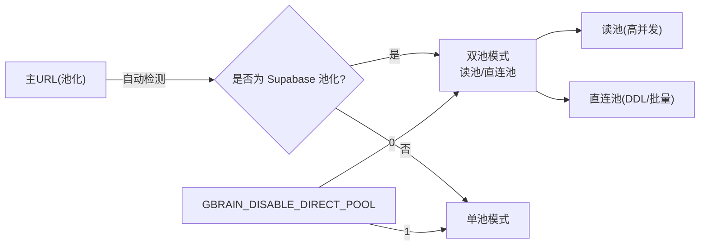
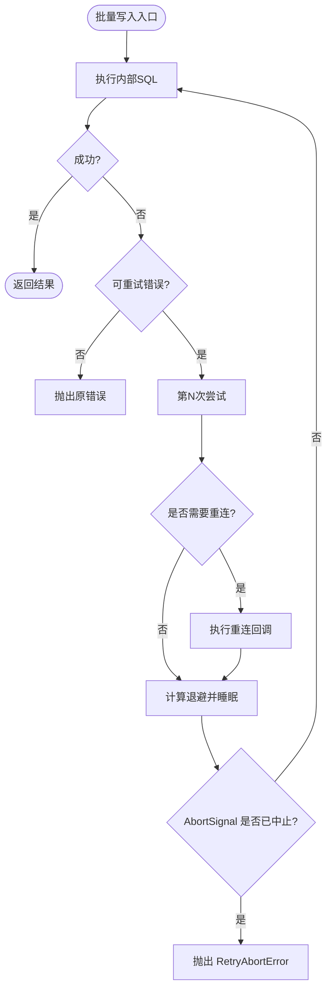
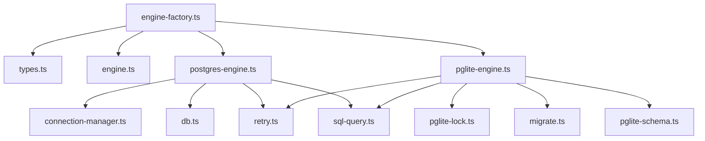

# 引擎架构

<cite>
**本文引用的文件**
- [ENGINES.md](file://docs/ENGINES.md)
- [engine.ts](file://src/core/engine.ts)
- [engine-factory.ts](file://src/core/engine-factory.ts)
- [postgres-engine.ts](file://src/core/postgres-engine.ts)
- [pglite-engine.ts](file://src/core/pglite-engine.ts)
- [connection-manager.ts](file://src/core/connection-manager.ts)
- [retry.ts](file://src/core/retry.ts)
- [types.ts](file://src/core/types.ts)
- [sql-query.ts](file://src/core/sql-query.ts)
- [pglite-lock.ts](file://src/core/pglite-lock.ts)
- [migrate.ts](file://src/core/migrate.ts)
- [pglite-schema.ts](file://src/core/pglite-schema.ts)
- [engine-factory.test.ts](file://test/engine-factory.test.ts)
- [postgres-engine.test.ts](file://test/postgres-engine.test.ts)
- [pglite-engine.test.ts](file://test/pglite-engine.test.ts)
- [engine-parity.test.ts](file://test/e2e/engine-parity.test.ts)
- [engine-parity-salience.test.ts](file://test/e2e/engine-parity-salience.test.ts)
- [postgres-engine-disconnect-idempotency.test.ts](file://test/e2e/postgres-engine-disconnect-idempotency.test.ts)
- [engine-resolve-slug-with-alias.test.ts](file://test/engine-resolve-slug-with-alias.test.ts)
- [engine-upsertFile.test.ts](file://test/engine-upsertFile.test.ts)
- [engine-find-trajectory.test.ts](file://test/engine-find-trajectory.test.ts)
</cite>

## 目录
1. [简介](#简介)
2. [项目结构](#项目结构)
3. [核心组件](#核心组件)
4. [架构总览](#架构总览)
5. [详细组件分析](#详细组件分析)
6. [依赖关系分析](#依赖关系分析)
7. [性能考量](#性能考量)
8. [故障排查指南](#故障排查指南)
9. [结论](#结论)
10. [附录](#附录)

## 简介
本文件系统化阐述 GBrain 的双引擎架构：以统一的 BrainEngine 接口抽象为核心，通过工厂模式动态选择 PostgresEngine 或 PGLiteEngine 实现，屏蔽底层存储差异，实现“换引擎不换上层”。文档覆盖接口设计、两种引擎的架构差异与性能特征、连接管理与事务模型、批量写入与重试机制、生命周期与错误恢复、以及跨引擎兼容性与迁移路径。

## 项目结构
- 核心接口与类型定义位于 src/core/engine.ts，定义了完整的 BrainEngine 接口、事务与保留连接语义、批量写入选项等。
- 工厂函数 src/core/engine-factory.ts 基于配置动态加载并实例化引擎，避免不必要的 WASM 加载。
- PostgresEngine 与 PGLiteEngine 分别实现在 src/core/postgres-engine.ts 与 src/core/pglite-engine.ts，均实现 BrainEngine 接口。
- 连接管理由 src/core/connection-manager.ts 提供，支持读/DDL/批量直连池分离与健康检查。
- 重试机制在 src/core/retry.ts 中集中实现，针对长批处理与池化场景优化退避与中止支持。
- SQL 查询封装与参数校验在 src/core/sql-query.ts 中，确保跨引擎一致性。
- 其他支撑模块包括迁移与模式构建（migrate.ts、pglite-schema.ts）、锁与快照（pglite-lock.ts、快照构建脚本）等。

图表来源
- [engine-factory.ts:1-27](file://src/core/engine-factory.ts#L1-L27)
- [engine.ts:646-669](file://src/core/engine.ts#L646-L669)
- [connection-manager.ts:192-453](file://src/core/connection-manager.ts#L192-L453)
- [retry.ts:246-291](file://src/core/retry.ts#L246-L291)
- [sql-query.ts:32-42](file://src/core/sql-query.ts#L32-L42)
- [postgres-engine.ts:94-135](file://src/core/postgres-engine.ts#L94-L135)
- [pglite-engine.ts:224-239](file://src/core/pglite-engine.ts#L224-L239)

章节来源
- [engine-factory.ts:1-27](file://src/core/engine-factory.ts#L1-L27)
- [engine.ts:646-669](file://src/core/engine.ts#L646-L669)
- [ENGINES.md:1-235](file://docs/ENGINES.md#L1-L235)

## 核心组件
- BrainEngine 接口：统一的 CRUD、搜索、图遍历、标签、时间线、原始数据、版本、统计与健康、配置、迁移与嵌入检索等能力；新增 ReservedConnection 与 withReservedConnection 支持会话级保留连接；提供 reconnect 以恢复断连。
- 工厂模式：根据配置选择引擎类型，延迟加载实现类，避免 PGLite WASM 对非使用场景的开销。
- 连接管理：PostgresEngine 使用 ConnectionManager 将读/DDL/批量路由到不同池或直连后端，支持 Supabase 池化与直接连接自动推断。
- 批量与重试：批量写入方法内置 withRetry 包装，采用装饰抖动与指数退避，支持 AbortSignal 中止与审计站点枚举。
- 生命周期：connect/initSchema/transaction/reconnect/disconnect，保证幂等与可恢复。

章节来源
- [engine.ts:646-669](file://src/core/engine.ts#L646-L669)
- [engine-factory.ts:8-25](file://src/core/engine-factory.ts#L8-L25)
- [connection-manager.ts:192-453](file://src/core/connection-manager.ts#L192-L453)
- [retry.ts:246-291](file://src/core/retry.ts#L246-L291)

## 架构总览
双引擎架构的关键在于“接口一致、实现隔离、运行时切换”。PostgresEngine 面向生产环境，具备连接池、DDL/批量直连、健康检查与多源治理；PGLiteEngine 面向本地与单机场景，以内存/WASM 运行，提供与 Postgres 同等 SQL 能力与迁移兼容。

图表来源
- [engine.ts:646-669](file://src/core/engine.ts#L646-L669)
- [postgres-engine.ts:94-135](file://src/core/postgres-engine.ts#L94-L135)
- [pglite-engine.ts:224-239](file://src/core/pglite-engine.ts#L224-L239)
- [connection-manager.ts:192-453](file://src/core/connection-manager.ts#L192-L453)

章节来源
- [engine.ts:646-669](file://src/core/engine.ts#L646-L669)
- [postgres-engine.ts:94-135](file://src/core/postgres-engine.ts#L94-L135)
- [pglite-engine.ts:224-239](file://src/core/pglite-engine.ts#L224-L239)
- [connection-manager.ts:192-453](file://src/core/connection-manager.ts#L192-L453)

## 详细组件分析

### 工厂模式与运行时选择
- 动态导入：工厂按配置选择引擎类型，仅在需要时加载对应实现，避免 PGLite WASM 对 Postgres 用户造成额外开销。
- 类型约束：当传入未知类型时抛出明确错误，并对已弃用的 sqlite 类型给出替代建议。
- 测试覆盖：测试用例验证工厂返回正确实现并抛出预期错误。

图表来源
- [engine-factory.ts:8-25](file://src/core/engine-factory.ts#L8-L25)
- [engine-factory.test.ts](file://test/engine-factory.test.ts)

章节来源
- [engine-factory.ts:8-25](file://src/core/engine-factory.ts#L8-L25)
- [engine-factory.test.ts](file://test/engine-factory.test.ts)

### PostgresEngine：生产级连接与治理
- 连接与池化：支持实例级连接池与模块级单例两种路径；通过 ConnectionManager 将读/DDL/批量路由至不同后端，自动识别 Supabase 池化并派生直连 URL。
- 初始化：initSchema 时先执行前向引导（bootstrap）以补齐旧版本缺失列，再执行模式与迁移，最后进行自愈与僵尸索引清理。
- 事务与保留连接：transaction 提供 ACID 语义；withReservedConnection 在 Postgres 上使用 postgres-js 的 reserve 会话，在 PGLite 上作为透传。
- 断连恢复：reconnect 统一恢复逻辑，结合 _reconnecting 防并发；disconnect 支持幂等与边界超时结束池。
- 健康检查：ConnectionManager.healthCheck 提供读/直连池延迟探测。

图表来源
- [postgres-engine.ts:160-230](file://src/core/postgres-engine.ts#L160-L230)
- [postgres-engine.ts:273-359](file://src/core/postgres-engine.ts#L273-L359)
- [connection-manager.ts:222-225](file://src/core/connection-manager.ts#L222-L225)
- [connection-manager.ts:289-307](file://src/core/connection-manager.ts#L289-L307)

章节来源
- [postgres-engine.ts:160-230](file://src/core/postgres-engine.ts#L160-L230)
- [postgres-engine.ts:273-359](file://src/core/postgres-engine.ts#L273-L359)
- [connection-manager.ts:192-453](file://src/core/connection-manager.ts#L192-L453)

### PGLiteEngine：内嵌 WASM 与一致性
- 初始化与锁：connect 时获取文件锁以避免并发访问崩溃；支持快照（GBRAIN_PGLITE_SNAPSHOT）加速初始化；失败时分类诊断并释放锁。
- 模式与迁移：initSchema 前执行前向引导，生成适配当前嵌入维度/模型的模式，再执行迁移。
- 事务与保留连接：与 PostgresEngine 保持一致的事务与保留连接语义；executeRaw 在 PGLite 上通过 Promise.race 支持 AbortSignal。
- 重连策略：reconnect 对内存引擎为 NO-OP，对持久化目录引擎重新打开；未连接则无操作。

图表来源
- [pglite-engine.ts:242-299](file://src/core/pglite-engine.ts#L242-L299)
- [pglite-engine.ts:335-354](file://src/core/pglite-engine.ts#L335-L354)
- [pglite-lock.ts](file://src/core/pglite-lock.ts)

章节来源
- [pglite-engine.ts:242-299](file://src/core/pglite-engine.ts#L242-L299)
- [pglite-engine.ts:335-354](file://src/core/pglite-engine.ts#L335-L354)
- [pglite-engine.ts:4977-5004](file://src/core/pglite-engine.ts#L4977-L5004)

### 连接管理与路由
- 双池/单池：当检测到 Supabase 池化且未禁用直连时启用 split 模式，读池用于高频查询，DDL/批量直连池用于长事务与 DDL。
- 杀开关：可通过环境变量禁用直连池，回退到单池模式。
- 健康检查：提供延迟探测，便于诊断路由与可用性。
- 父子继承：工作进程可继承父连接管理器，共享状态与直连池。

图表来源
- [connection-manager.ts:222-225](file://src/core/connection-manager.ts#L222-L225)
- [connection-manager.ts:174-177](file://src/core/connection-manager.ts#L174-L177)
- [connection-manager.ts:289-307](file://src/core/connection-manager.ts#L289-L307)

章节来源
- [connection-manager.ts:192-453](file://src/core/connection-manager.ts#L192-L453)

### 事务与批量写入
- 事务：Engine 接口要求 transaction 提供 ACID 语义；PostgresEngine 通过 ConnectionManager 的读池执行；PGLiteEngine 在其内部事务上下文中执行。
- 批量写入：Link/Timeline/Takes/Chunks 等批量方法内置 withRetry 包装，采用装饰抖动与指数退避，最大重试次数、基础延迟与最大延迟可由环境变量调整。
- 中止支持：AbortSignal 在重试睡眠期间触发可提前退出，避免长时间阻塞。
- 审计站点：所有批量重试事件记录在受控枚举的审计站点中，CI 校验防止漂移。

图表来源
- [retry.ts:246-291](file://src/core/retry.ts#L246-L291)
- [retry.ts:159-164](file://src/core/retry.ts#L159-L164)
- [postgres-engine.ts:1-100](file://src/core/postgres-engine.ts#L1-L100)

章节来源
- [retry.ts:246-291](file://src/core/retry.ts#L246-L291)
- [postgres-engine.ts:1-100](file://src/core/postgres-engine.ts#L1-L100)

### 生命周期与错误恢复
- 连接生命周期：connect → initSchema → 使用 → disconnect；PostgresEngine 支持模块单例与实例池两种路径，PGLiteEngine 支持快照与持久化目录。
- 断连恢复：reconnect 统一恢复，PostgresEngine 结合 ConnectionManager 与池状态，PGLiteEngine 对持久化目录引擎重开。
- 幂等断开：两次断开调用不会相互影响，PostgresEngine 通过标记区分模块/实例路径，PGLiteEngine 在关闭前后释放锁。
- 错误分类：重试基于 isRetryableConnError 分类，支持真实原因优先暴露（如认证失败），避免掩盖根因。

章节来源
- [postgres-engine.ts:232-271](file://src/core/postgres-engine.ts#L232-L271)
- [pglite-engine.ts:301-333](file://src/core/pglite-engine.ts#L301-L333)
- [retry.ts:66-68](file://src/core/retry.ts#L66-L68)

### 跨引擎兼容性与迁移
- 接口一致性：两种引擎实现同一 BrainEngine 接口，保证 CRUD、搜索、图遍历、批量写入等行为一致。
- 模式与迁移：initSchema 与 runMigration 在两种引擎上均可执行，PGLiteEngine 通过快照与前向引导提升兼容性。
- 性能与规模：PostgresEngine 适合大规模、高并发与多用户场景；PGLiteEngine 适合本地开发与单机使用，零配置、无服务器。
- 迁移工具：官方提供双向迁移命令，可在两种引擎间安全迁移数据。

章节来源
- [ENGINES.md:134-177](file://docs/ENGINES.md#L134-L177)
- [pglite-engine.ts:356-388](file://src/core/pglite-engine.ts#L356-L388)
- [postgres-engine.ts:273-359](file://src/core/postgres-engine.ts#L273-L359)

## 依赖关系分析
- 工厂依赖：engine-factory.ts 仅依赖 engine.ts 与 types.ts，动态导入具体实现，耦合度低。
- 引擎依赖：PostgresEngine 依赖 connection-manager.ts 与 db.ts（连接管理与会话默认值），PGLiteEngine 依赖 pglite、vector、pg_trgm 扩展与锁模块。
- 通用模块：retry.ts 与 sql-query.ts 被两类引擎广泛使用，形成横切关注点。

图表来源
- [engine-factory.ts:1-27](file://src/core/engine-factory.ts#L1-L27)
- [postgres-engine.ts:1-64](file://src/core/postgres-engine.ts#L1-L64)
- [pglite-engine.ts:1-62](file://src/core/pglite-engine.ts#L1-L62)
- [connection-manager.ts:39-42](file://src/core/connection-manager.ts#L39-L42)
- [retry.ts:66-68](file://src/core/retry.ts#L66-L68)
- [sql-query.ts:32-42](file://src/core/sql-query.ts#L32-L42)
- [pglite-lock.ts](file://src/core/pglite-lock.ts)
- [migrate.ts](file://src/core/migrate.ts)
- [pglite-schema.ts](file://src/core/pglite-schema.ts)

章节来源
- [engine-factory.ts:1-27](file://src/core/engine-factory.ts#L1-L27)
- [postgres-engine.ts:1-64](file://src/core/postgres-engine.ts#L1-L64)
- [pglite-engine.ts:1-62](file://src/core/pglite-engine.ts#L1-L62)

## 性能考量
- 连接池：PostgresEngine 通过 ConnectionManager 将高频读与长事务分离，减少池化电路断路器的影响；PGLiteEngine 单进程内核，无需池。
- 批量写入：装饰抖动与指数退避覆盖 Supavisor 电路断路器恢复窗口，避免重复丢失；AbortSignal 支持优雅中止。
- 搜索与向量：两种引擎均提供关键词与向量搜索，返回统一 SearchResult[]，混合排序与去重在上层完成。
- 快照与前向引导：PGLiteEngine 的快照与前向引导显著降低首次初始化成本，提升本地体验。

章节来源
- [connection-manager.ts:222-225](file://src/core/connection-manager.ts#L222-L225)
- [retry.ts:159-164](file://src/core/retry.ts#L159-L164)
- [ENGINES.md:105-133](file://docs/ENGINES.md#L105-L133)
- [pglite-engine.ts:71-113](file://src/core/pglite-engine.ts#L71-L113)
- [pglite-engine.ts:414-413](file://src/core/pglite-engine.ts#L414-L413)

## 故障排查指南
- 连接断开与恢复
  - PostgresEngine：使用 reconnect 统一恢复，注意 _reconnecting 防并发；disconnect 支持幂等与边界超时结束池。
  - PGLiteEngine：持久化目录引擎可重连，内存引擎重连为 NO-OP；关闭时务必释放锁。
- 批量写入失败
  - 检查重试日志与审计站点，确认是否为可重试错误；必要时调整环境变量以放宽重试上限或延迟。
  - 若为认证或网络问题，重试回调会优先暴露真实原因，避免掩盖根因。
- 初始化失败
  - PGLite：根据错误形态分类提示（如 Bun VFS、macOS 26.3 WASM 问题），参考诊断信息修复运行环境。
- 并发冲突
  - PGLite：确保文件锁获取成功；若提示被其他进程占用，等待或更换数据目录。

章节来源
- [postgres-engine.ts:232-271](file://src/core/postgres-engine.ts#L232-L271)
- [pglite-engine.ts:301-333](file://src/core/pglite-engine.ts#L301-L333)
- [pglite-engine.ts:281-298](file://src/core/pglite-engine.ts#L281-L298)
- [retry.ts:246-291](file://src/core/retry.ts#L246-L291)

## 结论
GBrain 的双引擎架构通过统一接口与工厂模式实现了“一次实现、处处运行”的目标。PostgresEngine 面向生产与多用户场景，具备完善的连接管理与治理能力；PGLiteEngine 面向本地与单机场景，提供零配置与高性能体验。批量重试、保留连接、前向引导与快照等机制共同保障了跨引擎的一致性与可靠性。在实际选型中，可根据规模、并发与运维偏好选择合适引擎，并通过官方迁移工具平滑切换。

## 附录
- 场景选型建议
  - 新手入门：优先 PGLiteEngine（零配置、单机友好）
  - 生产部署：PostgresEngine（连接池、多用户、审计）
  - 研究分析：可考虑未来扩展（DuckDBEngine/TursoEngine）以满足分析需求
- 关键接口与方法参考
  - 连接与生命周期：connect、disconnect、reconnect、initSchema
  - 事务与保留连接：transaction、withReservedConnection
  - 批量写入：addLinksBatch、addTimelineEntriesBatch、addTakesBatch、upsertChunks
  - 搜索与图遍历：searchKeyword、searchVector、traverseGraph
  - 迁移与嵌入：runMigration、getChunksWithEmbeddings

章节来源
- [engine.ts:646-669](file://src/core/engine.ts#L646-L669)
- [ENGINES.md:134-177](file://docs/ENGINES.md#L134-L177)