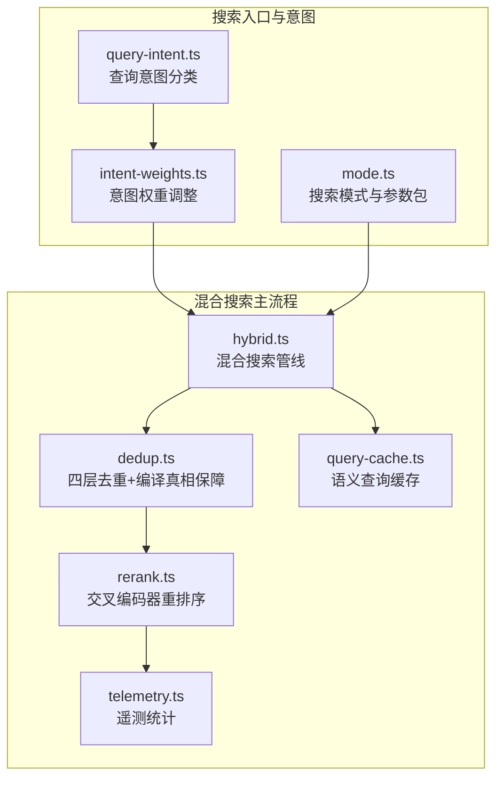
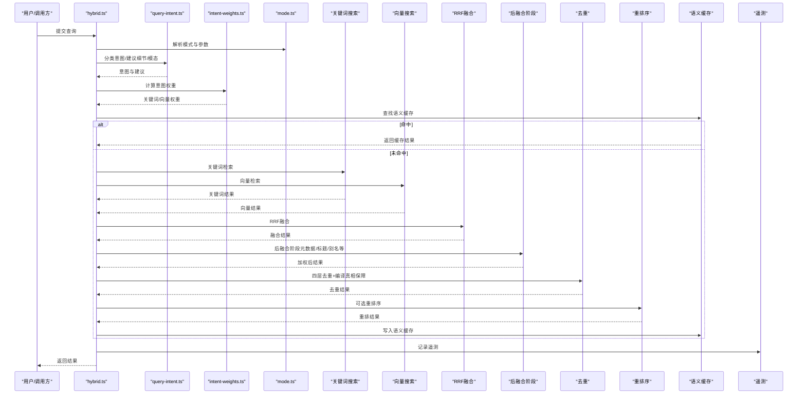
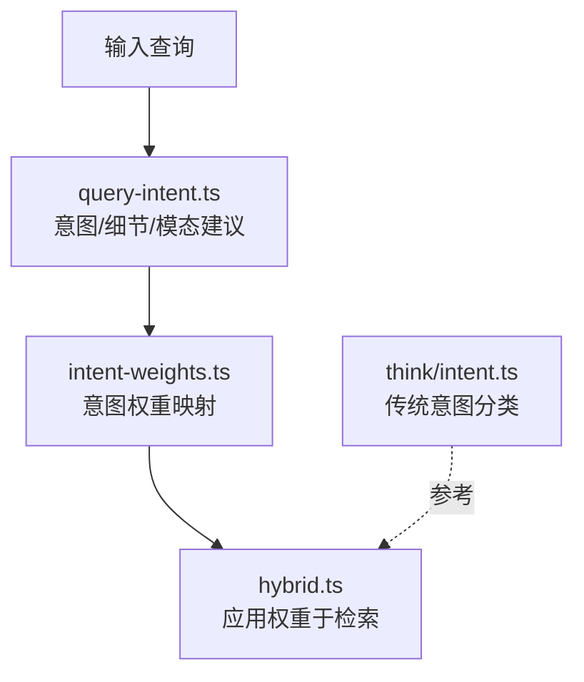
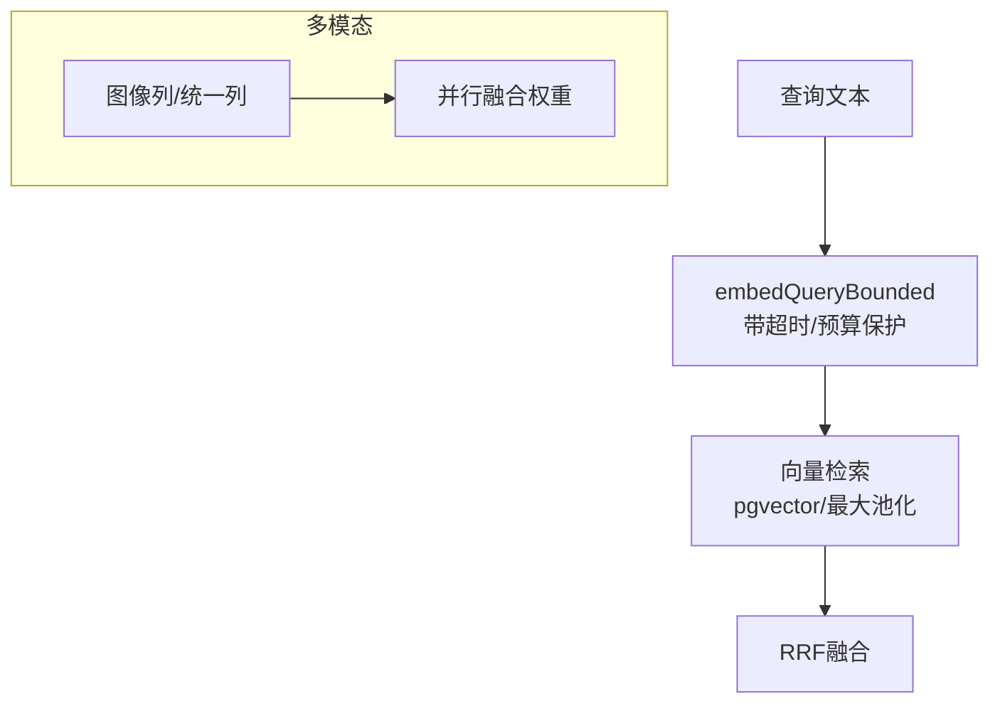
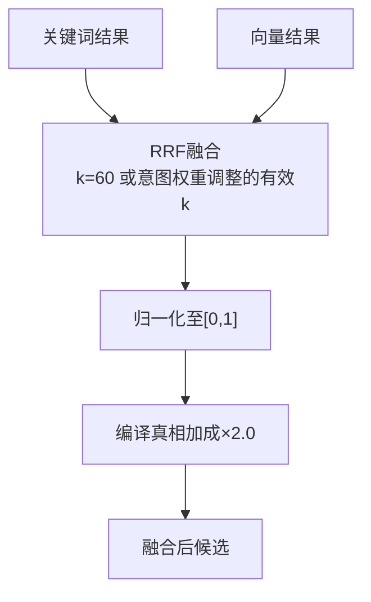
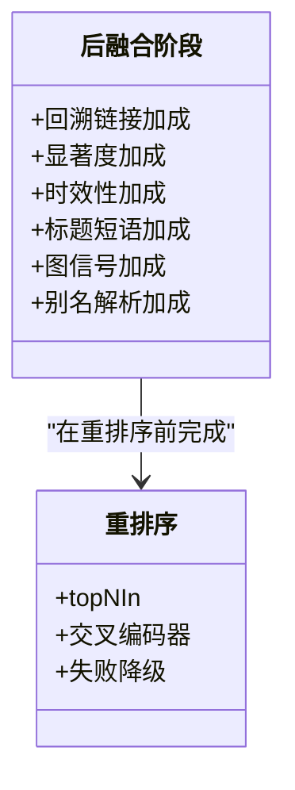
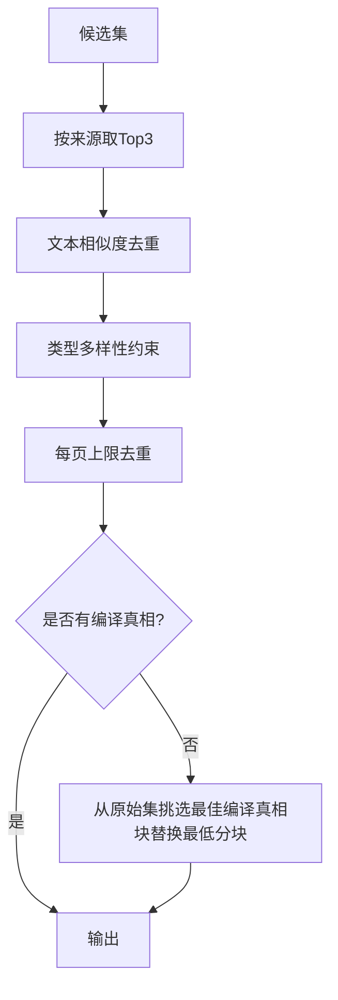
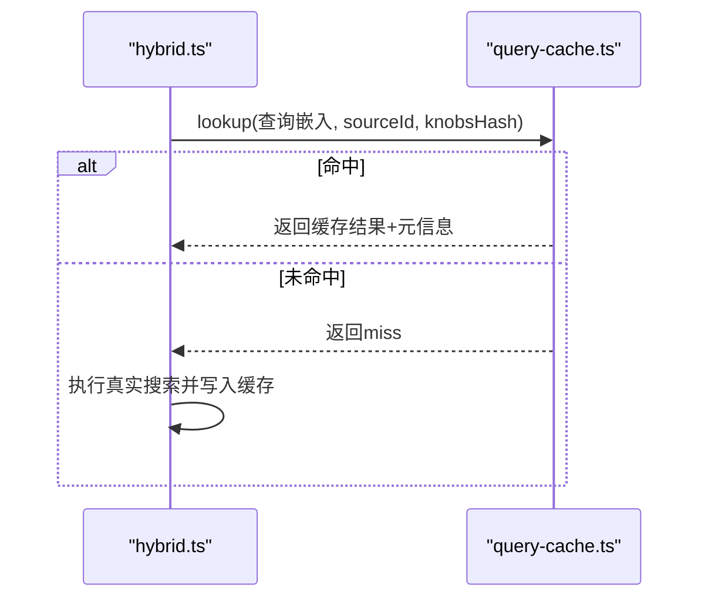
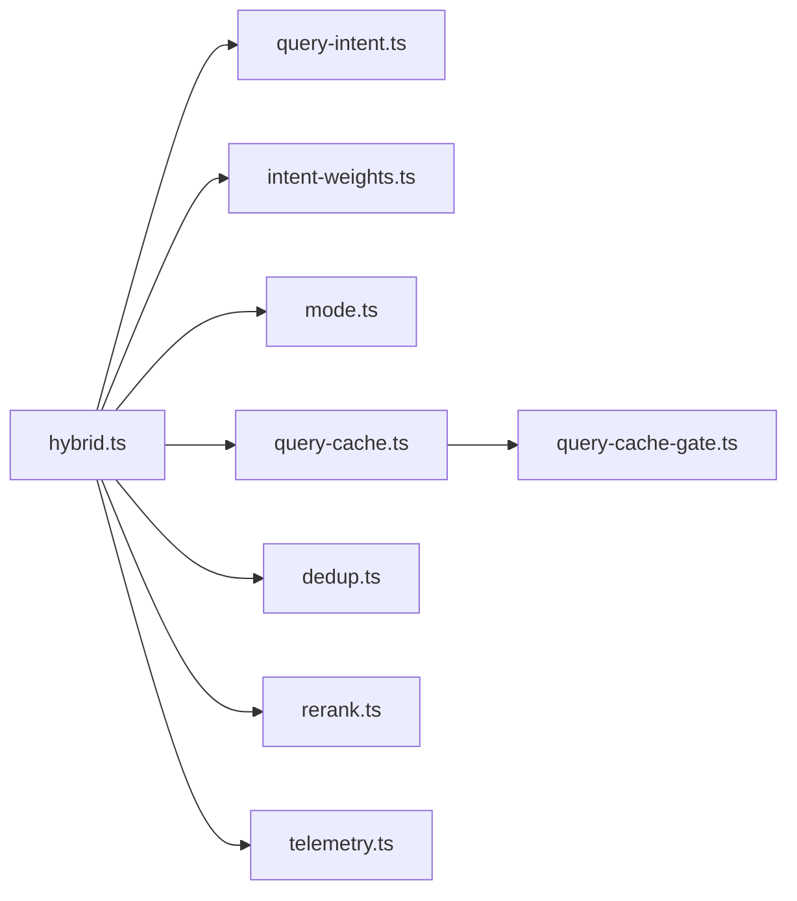

# 搜索架构

<cite>
**本文引用的文件**
- [hybrid.ts](file://src/core/search/hybrid.ts)
- [query-intent.ts](file://src/core/search/query-intent.ts)
- [intent-weights.ts](file://src/core/search/intent-weights.ts)
- [mode.ts](file://src/core/search/mode.ts)
- [query-cache.ts](file://src/core/search/query-cache.ts)
- [dedup.ts](file://src/core/search/dedup.ts)
- [rerank.ts](file://src/core/search/rerank.ts)
- [telemetry.ts](file://src/core/search/telemetry.ts)
- [intent.ts](file://src/core/think/intent.ts)
- [rrf-source-key.test.ts](file://test/rrf-source-key.test.ts)
- [search.test.ts](file://test/search.test.ts)
- [search-vector-maxpool.test.ts](file://test/search/searchvector-maxpool.test.ts)
- [search-quality.test.ts](file://test/e2e/search-quality.test.ts)
- [cache-gate-pglite.test.ts](file://test/e2e/cache-gate-pglite.test.ts)
- [search-telemetry.test.ts](file://test/search-telemetry.test.ts)
- [llm-intent-hybrid-integration.serial.test.ts](file://test/llm-intent-hybrid-integration.serial.test.ts)
- [search-mode.test.ts](file://test/search-mode.test.ts)
- [last-retrieved.ts](file://src/core/last-retrieved.ts)
- [hybrid-search.md](file://test/e2e/fixtures/concepts/hybrid-search.md)
</cite>

## 目录
1. [简介](#简介)
2. [项目结构](#项目结构)
3. [核心组件](#核心组件)
4. [架构总览](#架构总览)
5. [详细组件分析](#详细组件分析)
6. [依赖关系分析](#依赖关系分析)
7. [性能考量](#性能考量)
8. [故障排查指南](#故障排查指南)
9. [结论](#结论)
10. [附录](#附录)

## 简介
本技术文档系统性阐述 GBrain 的混合搜索架构，覆盖向量搜索、关键词搜索与 RRF 融合算法；解释查询意图识别、语义理解、结果重排序与证据聚合机制；并给出向量索引设计、嵌入模型集成、搜索性能优化与缓存策略。同时提供搜索质量评估方法与调试技巧，并讨论多模态搜索支持与实时搜索能力。

## 项目结构
GBrain 的搜索子系统位于 src/core/search 下，围绕“混合检索—意图权重—后融合阶段—重排序—去重—缓存—遥测”的流水线组织代码。核心模块包括：
- 查询意图与模式：query-intent.ts、intent-weights.ts、mode.ts
- 搜索主流程：hybrid.ts（含 RRF、去重、重排序、缓存、遥测）
- 结果去重与保证：dedup.ts
- 重排序器封装：rerank.ts
- 语义查询缓存：query-cache.ts
- 遥测统计：telemetry.ts
- 测试用例与端到端示例：test/* 与 test/e2e/fixtures/concepts/hybrid-search.md

图表来源
- [hybrid.ts:772-805](file://src/core/search/hybrid.ts#L772-L805)
- [query-intent.ts:248-287](file://src/core/search/query-intent.ts#L248-L287)
- [intent-weights.ts:94-112](file://src/core/search/intent-weights.ts#L94-L112)
- [mode.ts:571-639](file://src/core/search/mode.ts#L571-L639)
- [dedup.ts:37-70](file://src/core/search/dedup.ts#L37-L70)
- [rerank.ts:58-139](file://src/core/search/rerank.ts#L58-L139)
- [query-cache.ts:97-200](file://src/core/search/query-cache.ts#L97-L200)
- [telemetry.ts:61-257](file://src/core/search/telemetry.ts#L61-L257)

章节来源
- [hybrid.ts:1-120](file://src/core/search/hybrid.ts#L1-L120)
- [query-intent.ts:1-60](file://src/core/search/query-intent.ts#L1-L60)
- [intent-weights.ts:1-40](file://src/core/search/intent-weights.ts#L1-L40)
- [mode.ts:1-60](file://src/core/search/mode.ts#L1-L60)
- [dedup.ts:1-30](file://src/core/search/dedup.ts#L1-L30)
- [rerank.ts:1-40](file://src/core/search/rerank.ts#L1-L40)
- [query-cache.ts:1-40](file://src/core/search/query-cache.ts#L1-L40)
- [telemetry.ts:1-40](file://src/core/search/telemetry.ts#L1-L40)

## 核心组件
- 混合搜索管线（hybrid.ts）：串联关键词与向量两条检索分支，采用 RRF 融合、归一化、编译真相加成、余弦再打分、去重与可选重排序，最终输出候选集。
- 查询意图与权重（query-intent.ts、intent-weights.ts）：对查询进行意图分类（实体/时间/事件/一般），并映射到关键词/向量权重、回收期倾向与精确匹配加成。
- 模式配置（mode.ts）：定义保守/均衡/极致三种模式，统一管理缓存、意图权重、扩展、限制、重排序、图信号、上下文检索等开关与阈值。
- 去重与保障（dedup.ts）：按来源/文本相似度/类型分布/每页上限四层去重，并确保每页保留编译真相片段。
- 重排序（rerank.ts）：对前若干候选调用交叉编码器重排，失败时降级回原顺序。
- 语义查询缓存（query-cache.ts）：基于向量相似度命中缓存，避免重复计算；支持跨模式隔离键。
- 遥测（telemetry.ts）：异步聚合统计，记录命中率、平均结果数、预算丢弃、模式与意图分布等。

章节来源
- [hybrid.ts:772-805](file://src/core/search/hybrid.ts#L772-L805)
- [query-intent.ts:248-287](file://src/core/search/query-intent.ts#L248-L287)
- [intent-weights.ts:94-145](file://src/core/search/intent-weights.ts#L94-L145)
- [mode.ts:285-439](file://src/core/search/mode.ts#L285-L439)
- [dedup.ts:37-209](file://src/core/search/dedup.ts#L37-L209)
- [rerank.ts:58-139](file://src/core/search/rerank.ts#L58-L139)
- [query-cache.ts:97-200](file://src/core/search/query-cache.ts#L97-L200)
- [telemetry.ts:61-257](file://src/core/search/telemetry.ts#L61-L257)

## 架构总览
混合搜索以“意图—权重—检索—融合—后处理—缓存—遥测”为主线，形成可配置、可观测、可扩展的检索系统。

图表来源
- [hybrid.ts:772-805](file://src/core/search/hybrid.ts#L772-L805)
- [query-intent.ts:248-287](file://src/core/search/query-intent.ts#L248-L287)
- [intent-weights.ts:94-145](file://src/core/search/intent-weights.ts#L94-L145)
- [mode.ts:571-639](file://src/core/search/mode.ts#L571-L639)
- [query-cache.ts:127-196](file://src/core/search/query-cache.ts#L127-L196)
- [dedup.ts:37-70](file://src/core/search/dedup.ts#L37-L70)
- [rerank.ts:58-139](file://src/core/search/rerank.ts#L58-L139)
- [telemetry.ts:263-275](file://src/core/search/telemetry.ts#L263-L275)

## 详细组件分析

### 查询意图识别与语义理解
- 意图分类：query-intent.ts 将查询分为实体/时间/事件/一般，并给出建议细节（低/中/高）与建议回收期/显著度强度。
- 模态路由：新增跨模态建议（文本/图像/两者），用于后续多模态并行或细化。
- 意图权重：intent-weights.ts 将意图映射为关键词/向量权重、回收期倾向与精确匹配加成，且不覆盖显式传入选项。
- 传统意图：think/intent.ts 提供纯正则的意图分类（时间/知识更新/其他），作为长记忆评估等场景的参考。

图表来源
- [query-intent.ts:248-287](file://src/core/search/query-intent.ts#L248-L287)
- [intent-weights.ts:94-145](file://src/core/search/intent-weights.ts#L94-L145)
- [intent.ts:69-75](file://src/core/think/intent.ts#L69-L75)

章节来源
- [query-intent.ts:248-343](file://src/core/search/query-intent.ts#L248-L343)
- [intent-weights.ts:1-145](file://src/core/search/intent-weights.ts#L1-L145)
- [intent.ts:1-75](file://src/core/think/intent.ts#L1-L75)

### 向量搜索与嵌入模型集成
- 向量搜索：在向量空间内通过余弦相似度检索，支持“最大池化”选择页面最佳片段，避免弱片段污染。
- 嵌入维度：测试用例显示默认维度为 1536（OpenAI 文本嵌入常用维度）。
- 多模态：支持统一/双列嵌入列，以及图像查询的文本细化与并行融合权重；可配置是否启用统一多模态空间。
- 实时能力：通过查询嵌入超时控制与共享截止时间，避免慢提供者阻塞整体路径。

图表来源
- [hybrid.ts:748-770](file://src/core/search/hybrid.ts#L748-L770)
- [search-vector-maxpool.test.ts:112-130](file://test/search/searchvector-maxpool.test.ts#L112-L130)
- [search-quality.test.ts:163-187](file://test/e2e/search-quality.test.ts#L163-L187)

章节来源
- [hybrid.ts:748-770](file://src/core/search/hybrid.ts#L748-L770)
- [search-vector-maxpool.test.ts:112-130](file://test/search/searchvector-maxpool.test.ts#L112-L130)
- [search-quality.test.ts:163-187](file://test/e2e/search-quality.test.ts#L163-L187)

### 关键词搜索与全文索引
- 关键词搜索：使用 PostgreSQL tsquery 对 tsvector 列进行检索，返回按 ts_rank 排序的结果。
- 细节粒度：支持 low/medium/high 三档细节，影响返回来源（如仅编译真相或全源）。
- 多块返回：单页可返回多个块，便于更细粒度的上下文呈现。

章节来源
- [search-quality.test.ts:147-161](file://test/e2e/search-quality.test.ts#L147-L161)
- [search-quality.test.ts:189-198](file://test/e2e/search-quality.test.ts#L189-L198)

### RRF 融合算法与归一化
- 融合公式：对每个列表中的文档，计算其贡献分数之和（1/(k+rank)），k 默认 60；不同列表的权重可通过意图权重动态调整有效 k。
- 归一化：将融合得分归一至 0-1 区间；编译真相片段额外获得 2.0 倍加成。
- 源感知键：RRF 去重键包含 source_id，防止联邦脑中同 slug 页面在不同源被错误合并。

图表来源
- [hybrid.ts:47-48](file://src/core/search/hybrid.ts#L47-L48)
- [search.test.ts:40-123](file://test/search.test.ts#L40-L123)
- [rrf-source-key.test.ts:33-36](file://test/rrf-source-key.test.ts#L33-L36)

章节来源
- [hybrid.ts:47-48](file://src/core/search/hybrid.ts#L47-L48)
- [search.test.ts:40-123](file://test/search.test.ts#L40-L123)
- [rrf-source-key.test.ts:33-36](file://test/rrf-source-key.test.ts#L33-L36)

### 结果重排序与证据聚合
- 重排序：可选交叉编码器重排，仅对前 topNIn 进行，保持长尾原始顺序，失败时降级。
- 证据聚合：在后融合阶段对回溯链接、显著度、时效性、标题短语匹配、图信号、别名解析等进行加权与归因标注，便于解释输出。

图表来源
- [hybrid.ts:406-520](file://src/core/search/hybrid.ts#L406-L520)
- [rerank.ts:58-139](file://src/core/search/rerank.ts#L58-L139)

章节来源
- [hybrid.ts:406-520](file://src/core/search/hybrid.ts#L406-L520)
- [rerank.ts:58-139](file://src/core/search/rerank.ts#L58-L139)

### 去重与编译真相保障
- 四层去重：按来源取每页前 3 块；文本相似度去重（Jaccard 阈值）；类型多样性约束；每页最多 N 块。
- 编译真相保障：若去重后某页无编译真相块，则从原始集合中挑选该页最佳编译真相块替换最低分块。

图表来源
- [dedup.ts:37-209](file://src/core/search/dedup.ts#L37-L209)

章节来源
- [dedup.ts:37-209](file://src/core/search/dedup.ts#L37-L209)

### 语义查询缓存与跨模式隔离
- 命中条件：查询嵌入与缓存中最接近项的余弦距离小于阈值（默认 0.08），且未过期（默认 TTL 3600s）。
- 多源隔离：按 source_id 限定缓存作用域。
- 键哈希：knobsHash 包含模式、开关与配置，防止保守/均衡/极致模式之间的缓存污染。
- 新写入：命中后会异步提升命中计数与最近命中时间。

图表来源
- [query-cache.ts:127-196](file://src/core/search/query-cache.ts#L127-L196)
- [mode.ts:781-810](file://src/core/search/mode.ts#L781-L810)

章节来源
- [query-cache.ts:1-200](file://src/core/search/query-cache.ts#L1-L200)
- [mode.ts:781-810](file://src/core/search/mode.ts#L781-L810)
- [cache-gate-pglite.test.ts:81-110](file://test/e2e/cache-gate-pglite.test.ts#L81-L110)

### 搜索模式与参数包
- 三种模式：保守（成本敏感）、均衡（默认）、极致（召回优先）。每种模式定义缓存、意图权重、扩展、限制、重排序、图信号、上下文检索、自动截断、关系检索等。
- 参数解析链：调用参数 > 配置键 > 模式包 > 安全回退（均衡）。
- 键哈希版本：随着功能演进（重排序、图信号、标题加成、自动截断等）版本号递增，强制缓存失效以确保一致性。

章节来源
- [mode.ts:285-439](file://src/core/search/mode.ts#L285-L439)
- [mode.ts:571-639](file://src/core/search/mode.ts#L571-L639)
- [search-mode.test.ts:140-180](file://test/search-mode.test.ts#L140-L180)

### 多模态搜索支持与实时搜索
- 多模态路由：查询可建议文本/图像/两者；两者模式下可设置文本/图像分支的 RRF 权重；图像查询支持文本细化分支。
- 统一/双列：可配置统一多模态列或回退到双列；严格模式下禁用回退路径。
- 实时保护：查询嵌入超时与最小预算预留，避免慢提供者导致整体挂起；后台写入有超时排水，保证进程退出。

章节来源
- [query-intent.ts:32-44](file://src/core/search/query-intent.ts#L32-L44)
- [mode.ts:153-216](file://src/core/search/mode.ts#L153-L216)
- [hybrid.ts:712-770](file://src/core/search/hybrid.ts#L712-L770)
- [last-retrieved.ts:72-103](file://src/core/last-retrieved.ts#L72-L103)

## 依赖关系分析
- hybrid.ts 依赖 query-intent.ts、intent-weights.ts、mode.ts、query-cache.ts、dedup.ts、rerank.ts、telemetry.ts。
- query-cache.ts 依赖 query-cache-gate.ts（缓存门控）。
- telemetry.ts 依赖 engine 执行 SQL 写入统计表。
- 测试覆盖了 RRF、cosine 相似度、编译真相加成、去重键、跨源 RRF 键、缓存门控、遥测统计、跨模态意图、搜索模式等。

图表来源
- [hybrid.ts:12-46](file://src/core/search/hybrid.ts#L12-L46)
- [query-cache.ts:35-40](file://src/core/search/query-cache.ts#L35-L40)

章节来源
- [hybrid.ts:12-46](file://src/core/search/hybrid.ts#L12-L46)
- [query-cache.ts:35-40](file://src/core/search/query-cache.ts#L35-L40)

## 性能考量
- 向量检索：最大池化减少页面内弱块干扰；按页面取 Top3 降低去重复杂度。
- RRF：通过有效 k 抑制单一列表主导，结合归一化与编译真相加成稳定排序。
- 去重：Jaccard 文本相似度与类型多样性约束平衡召回与多样性。
- 重排序：仅对前 topNIn 排序，长尾保持原顺序，兼顾质量与召回。
- 缓存：阈值命中与 TTL 控制，knobsHash 防止跨模式污染，命中后异步提升命中计数。
- 模式：根据成本与质量目标选择模式，保守模式关闭重排序与关系检索以降低成本。

## 故障排查指南
- 缓存未命中/命中率低
  - 检查相似度阈值与 TTL 是否合理；确认 knobsHash 是否随模式变化正确传递。
  - 参考缓存门控测试，验证页面 generation 更新是否触发缓存失效。
- 结果排序异常
  - 意图权重是否被显式覆盖；检查有效 k 计算与归一化逻辑。
  - 编译真相加成是否生效；核对去重后是否保留编译真相块。
- 重排序失败
  - 检查网络/鉴权/超时；查看 rerank 审计日志；确认失败降级是否发生。
- 遥测缺失
  - 确认引擎已 setEngine；检查 flush 触发条件与定时器；注意进程退出时的非阻塞策略。
- 多模态意图误判
  - 检查跨模态正则与模糊指代标记；必要时开启 LLM 意图升级（需配置开关）。

章节来源
- [cache-gate-pglite.test.ts:81-110](file://test/e2e/cache-gate-pglite.test.ts#L81-L110)
- [search.test.ts:40-123](file://test/search.test.ts#L40-L123)
- [rerank.ts:85-101](file://src/core/search/rerank.ts#L85-L101)
- [telemetry.ts:139-187](file://src/core/search/telemetry.ts#L139-L187)
- [llm-intent-hybrid-integration.serial.test.ts:69-95](file://test/llm-intent-hybrid-integration.serial.test.ts#L69-L95)

## 结论
GBrain 的混合搜索架构以意图驱动的权重调整为核心，结合 RRF 融合、严格的去重与编译真相保障、可选重排序与语义缓存，形成高效、稳定、可观测的检索系统。通过模式包与键哈希实现跨形态一致性和可演进性；多模态与实时保护机制满足多样化场景需求。配合完善的遥测与测试覆盖，便于持续优化与问题定位。

## 附录
- 端到端概念说明：参见测试夹具对混合搜索工作原理的说明。
- 示例与回归测试：涵盖 RRF 正规化、编译真相加成、cosine 相似度、向量最大池化、关键词多块返回、缓存门控、遥测统计、跨模态意图与搜索模式等。

章节来源
- [hybrid-search.md:29-63](file://test/e2e/fixtures/concepts/hybrid-search.md#L29-L63)
- [search.test.ts:1-142](file://test/search.test.ts#L1-L142)
- [search-vector-maxpool.test.ts:112-130](file://test/search/searchvector-maxpool.test.ts#L112-L130)
- [search-quality.test.ts:147-217](file://test/e2e/search-quality.test.ts#L147-L217)
- [cache-gate-pglite.test.ts:81-110](file://test/e2e/cache-gate-pglite.test.ts#L81-L110)
- [search-telemetry.test.ts:182-212](file://test/search-telemetry.test.ts#L182-L212)
- [llm-intent-hybrid-integration.serial.test.ts:69-95](file://test/llm-intent-hybrid-integration.serial.test.ts#L69-L95)
- [search-mode.test.ts:140-180](file://test/search-mode.test.ts#L140-L180)