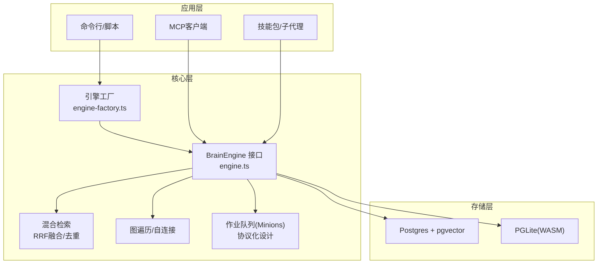
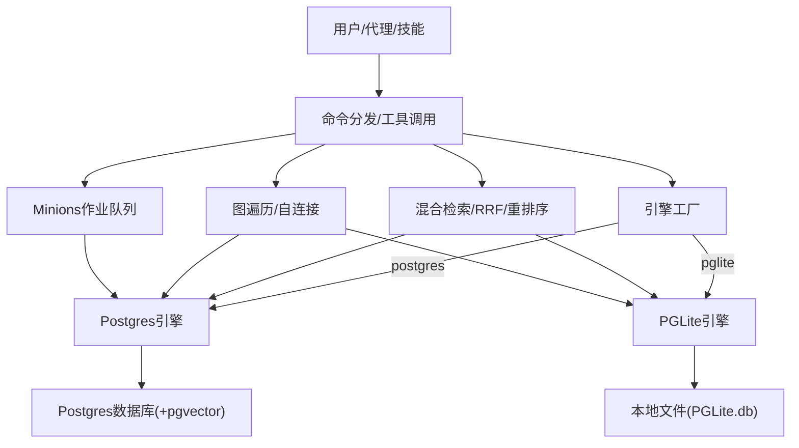
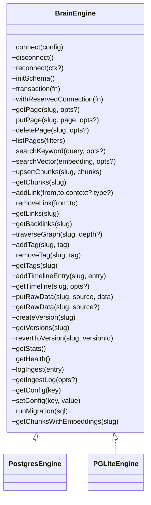
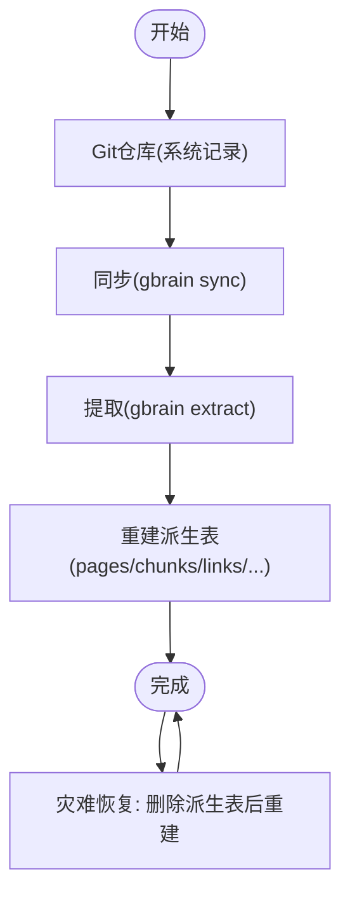
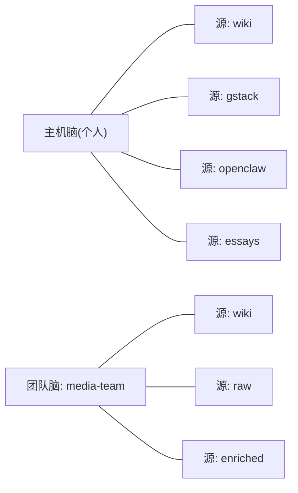
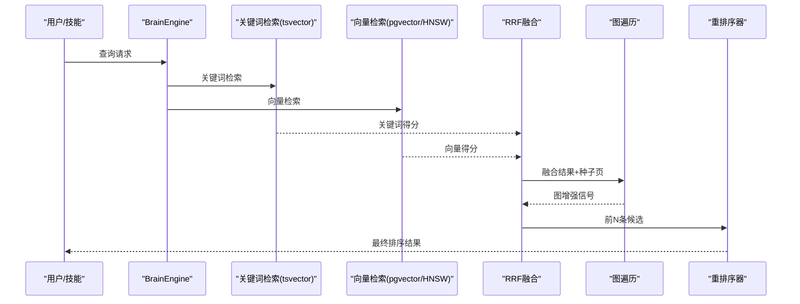
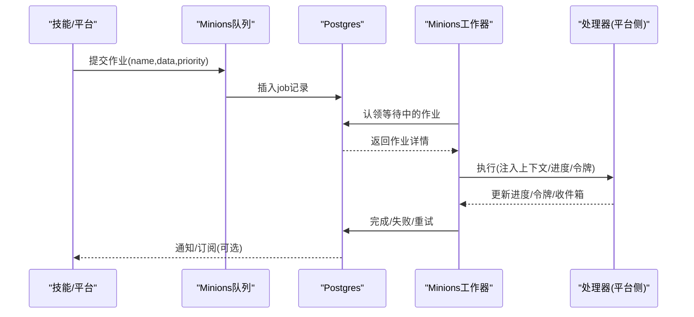
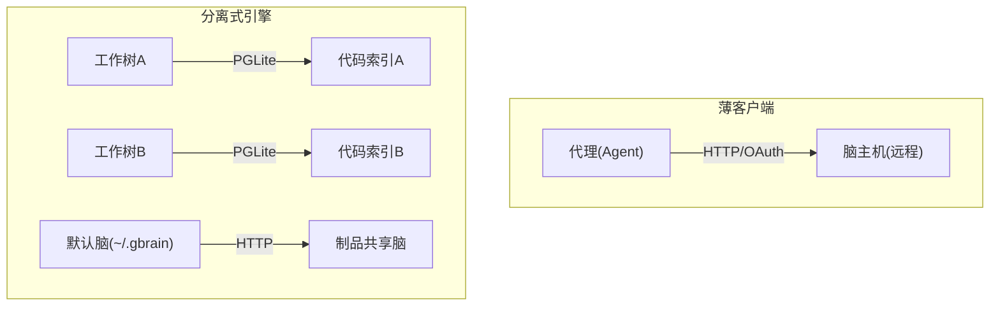
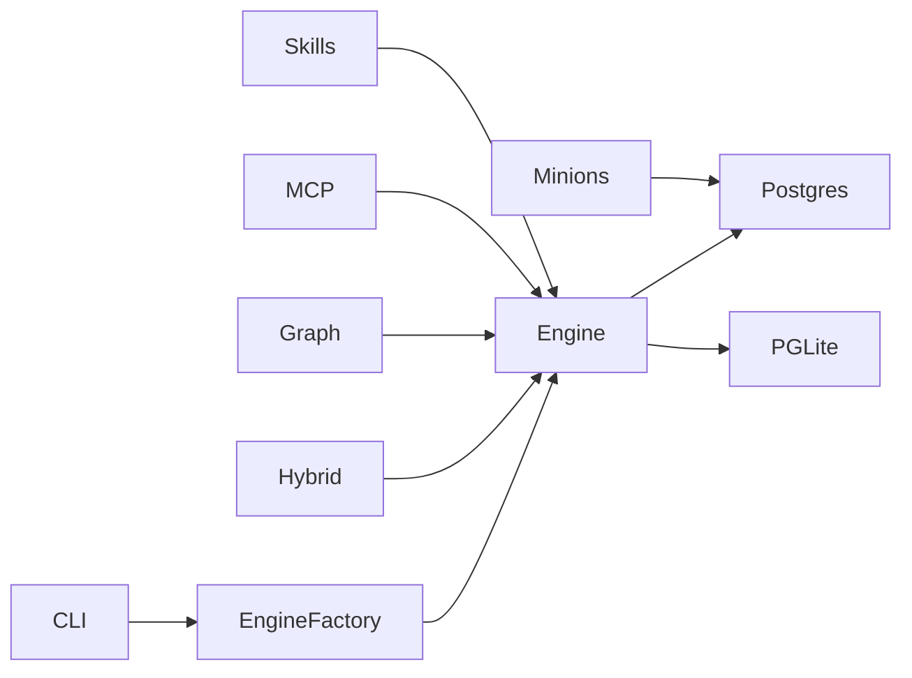

# 架构概览

<cite>
**本文引用的文件**
- [README.md](file://README.md)
- [ENGINES.md](file://docs/ENGINES.md)
- [system-of-record.md](file://docs/architecture/system-of-record.md)
- [brains-and-sources.md](file://docs/architecture/brains-and-sources.md)
- [topologies.md](file://docs/architecture/topologies.md)
- [RETRIEVAL.md](file://docs/architecture/RETRIEVAL.md)
- [MINIONS.md](file://docs/designs/MINIONS_AGENT_ORCHESTRATION.md)
- [engine.ts](file://src/core/engine.ts)
- [engine-factory.ts](file://src/core/engine-factory.ts)
</cite>

## 目录
1. [引言](#引言)
2. [项目结构](#项目结构)
3. [核心组件](#核心组件)
4. [架构总览](#架构总览)
5. [详细组件分析](#详细组件分析)
6. [依赖关系分析](#依赖关系分析)
7. [性能考量](#性能考量)
8. [故障排查指南](#故障排查指南)
9. [结论](#结论)
10. [附录](#附录)

## 引言
本文件面向GBrain系统的架构设计，聚焦以下关键主题：  
- 双引擎架构（PGLite与Postgres）的设计动机、边界与迁移路径  
- 脑仓库作为“系统记录”的存储契约与重建能力  
- “脑”与“源”的双重组织轴及其路由与隔离策略  
- 混合检索（向量+关键词+RRF+图遍历+重排序）与知识图谱自连接机制  
- 作业队列（Minions）的协议化设计与可扩展性  
- 系统边界、组件交互与数据流图  
- 技术选型权衡（为何选择Postgres+pgvector、PGLite优势等）

## 项目结构
GBrain采用“接口契约优先”的分层设计：  
- 核心接口定义于BrainEngine，屏蔽具体存储实现差异  
- 引擎工厂按配置动态加载Postgres或PGLite引擎  
- 检索、去重、推理、图遍历等上层逻辑与引擎解耦  
- 文档与指南明确系统记录契约、双轴组织、部署拓扑与检索理论

图表来源
- [engine-factory.ts:8-26](file://src/core/engine-factory.ts#L8-L26)
- [engine.ts:646-900](file://src/core/engine.ts#L646-L900)
- [ENGINES.md:24-91](file://docs/ENGINES.md#L24-L91)

章节来源
- [README.md:280-288](file://README.md#L280-L288)
- [ENGINES.md:1-235](file://docs/ENGINES.md#L1-L235)
- [engine.ts:646-900](file://src/core/engine.ts#L646-L900)
- [engine-factory.ts:8-26](file://src/core/engine-factory.ts#L8-L26)

## 核心组件
- 双引擎接口与工厂  
  - BrainEngine统一抽象页面CRUD、向量/关键词检索、链接/回链、时间线、原始数据、版本、健康统计、迁移与嵌入查询等能力  
  - 引擎工厂按配置动态导入，避免无谓加载PGLite WASM  
- 检索与图谱  
  - 混合检索：向量(HNSW/pgvector)+关键词(tsvector)+RRF融合+源因子重排+重排序器  
  - 图自连接：写入时自动抽取实体引用生成类型化边，支持多跳遍历  
- 作业队列（Minions）  
  - 基于Postgres的队列协议，支持暂停/恢复、令牌计费、收件箱、会话轨迹、资源治理等  
- 系统记录契约  
  - 以“脑仓库（Git仓库）为系统记录”，数据库为可重建的派生缓存；灾难恢复仅需一次命令重建

章节来源
- [engine.ts:646-900](file://src/core/engine.ts#L646-L900)
- [engine-factory.ts:8-26](file://src/core/engine-factory.ts#L8-L26)
- [ENGINES.md:24-91](file://docs/ENGINES.md#L24-L91)
- [system-of-record.md:1-199](file://docs/architecture/system-of-record.md#L1-L199)
- [RETRIEVAL.md:1-166](file://docs/architecture/RETRIEVAL.md#L1-L166)
- [MINIONS.md:1-449](file://docs/designs/MINIONS_AGENT_ORCHESTRATION.md#L1-L449)

## 架构总览
下图展示系统边界、组件交互与数据流：  
- 输入：用户命令/技能调用/MCP请求  
- 处理：引擎工厂选择引擎 → 上层逻辑（检索/图/队列） → 引擎执行  
- 输出：结果返回（检索/合成/图谱/作业状态）  
- 存储：Postgres（Supabase/自管）或PGLite（本地WASM），均通过BrainEngine访问

图表来源
- [engine-factory.ts:8-26](file://src/core/engine-factory.ts#L8-L26)
- [engine.ts:646-900](file://src/core/engine.ts#L646-L900)
- [ENGINES.md:134-178](file://docs/ENGINES.md#L134-L178)
- [RETRIEVAL.md:112-146](file://docs/architecture/RETRIEVAL.md#L112-L146)

## 详细组件分析

### 双引擎架构（PGLite vs Postgres）
- 设计目标  
  - 零配置默认（PGLite）与生产级扩展（Postgres+pgvector）并存，引擎可插拔，CLI/MCP/技能无需感知  
- 能力矩阵与差异  
  - 关键能力（CRUD/关键词/向量/模糊slug/图遍历/事务/JSONB）在两种引擎保持一致  
  - 并发与托管：Postgres支持连接池；PGLite单进程，便于本地与无服务器场景  
  - 迁移：双向导出/导入，无损切换  
- 何时选择  
  - 小规模/个人/零运维：PGLite  
  - 多用户/团队/高并发/托管：Postgres（Supabase或自管）

图表来源
- [engine.ts:646-900](file://src/core/engine.ts#L646-L900)
- [ENGINES.md:24-91](file://docs/ENGINES.md#L24-L91)

章节来源
- [ENGINES.md:134-178](file://docs/ENGINES.md#L134-L178)
- [engine.ts:646-900](file://src/core/engine.ts#L646-L900)

### 脑仓库与系统记录契约
- 核心原则  
  - 脑仓库（Git仓库）为系统记录；数据库是可重建的派生缓存  
  - 灾难恢复：删除派生表后，通过同步与提取即可完全重建  
  - 私密性：可通过.gitignore与隐私层策略控制敏感内容是否进入仓库  
- 三类数据域  
  - FS_canonical：以markdown为源的用户知识（如Facts/Takes/Links/Timeline/Tags）  
  - 派生自FS但非用户手写的：pages/content_chunks/page_versions等  
  - DB_only by design：运行时基础设施状态（如OAuth、作业队列、审计日志等）  
- 忘记与修订：通过修改围栏(fence)并重建派生表实现，保证可审计与可恢复

图表来源
- [system-of-record.md:141-164](file://docs/architecture/system-of-record.md#L141-L164)

章节来源
- [system-of-record.md:1-199](file://docs/architecture/system-of-record.md#L1-L199)

### 双轴组织：脑与源
- 轴一：脑（数据库）  
  - 一个脑对应一套数据库（PGLite文件/自管Postgres/Supabase）  
  - 支持多脑挂载（mounts），用于跨团队/跨项目隔离与共享  
- 轴二：源（仓库内内容）  
  - 每个脑内可有多个源（source），同一slug在不同源中独立  
  - 路由：--brain/--source或环境变量/点文件，最长前缀匹配  
- 使用场景  
  - 单人多源：个人脑内多仓库交叉检索  
  - 团队共享：挂载团队脑，按源隔离  
  - CEO级多归属：同时管理多个团队脑，按需查询

图表来源
- [brains-and-sources.md:60-187](file://docs/architecture/brains-and-sources.md#L60-L187)

章节来源
- [brains-and-sources.md:1-243](file://docs/architecture/brains-and-sources.md#L1-L243)

### 混合检索与知识图谱自连接
- 检索堆栈  
  - 向量：HNSW(pgvector)/cosine相似  
  - 关键词：tsvector+ts_rank  
  - RRF融合：不偏袒任一策略  
  - 源因子重排：对精选源加权，对排除前缀降权  
  - 重排序：ZeroEntropy交叉编码器（默认平衡模式启用）  
  - 结果：证据标签+创建安全提示，便于下游判断是否需要新增页面  
- 图谱自连接  
  - 写入页面时抽取实体引用，生成类型化边（如attended/works_at/…）  
  - 遍历：递归CTE（Postgres）或等价算法（PGLite）  
  - 价值：解决向量无法捕捉的事实链路问题，带来显著召回增益  

图表来源
- [RETRIEVAL.md:112-146](file://docs/architecture/RETRIEVAL.md#L112-L146)
- [ENGINES.md:105-133](file://docs/ENGINES.md#L105-L133)

章节来源
- [RETRIEVAL.md:1-166](file://docs/architecture/RETRIEVAL.md#L1-L166)
- [ENGINES.md:105-133](file://docs/ENGINES.md#L105-L133)

### 作业队列（Minions）设计
- 协议化与平台无关  
  - 通过Postgres原生队列承载任务生命周期：提交/认领/完成/失败/重试  
  - 支持暂停/恢复、令牌计费、收件箱（带已读回执）、会话轨迹、资源治理  
- 实时事件与兼容性  
  - Postgres使用LISTEN/NOTIFY推送变更；PGLite使用轮询回退  
- 扩展性  
  - 平台侧注册处理器，GBrain负责队列与可观测性，平台侧负责实际执行循环

图表来源
- [MINIONS.md:102-131](file://docs/designs/MINIONS_AGENT_ORCHESTRATION.md#L102-L131)
- [MINIONS.md:180-197](file://docs/designs/MINIONS_AGENT_ORCHESTRATION.md#L180-L197)
- [MINIONS.md:265-305](file://docs/designs/MINIONS_AGENT_ORCHESTRATION.md#L265-L305)

章节来源
- [MINIONS.md:1-449](file://docs/designs/MINIONS_AGENT_ORCHESTRATION.md#L1-L449)

### 部署拓扑与薄客户端
- 单机单脑（默认）：本地PGLite或Supabase  
- 薄客户端：代理在本地，脑在远程（HTTP MCP + OAuth），CLI被限制不可直接操作远程DB  
- 分离式引擎：每份工作树拥有独立PGLite代码索引，制品仍共享远程脑  
- 三种拓扑可组合，通过~/.gbrain与端口选择当前配置

图表来源
- [topologies.md:68-116](file://docs/architecture/topologies.md#L68-L116)
- [topologies.md:206-263](file://docs/architecture/topologies.md#L206-L263)

章节来源
- [topologies.md:1-404](file://docs/architecture/topologies.md#L1-L404)

## 依赖关系分析
- 组件耦合与内聚  
  - BrainEngine高度内聚：统一抽象所有存储相关操作  
  - 上层模块（检索/图/队列/技能）仅依赖接口，降低耦合  
- 直接与间接依赖  
  - 引擎工厂依赖动态导入，避免PGLite WASM在Postgres场景加载  
  - 检索与图谱依赖引擎提供的向量/关键词/图能力  
  - 队列依赖Postgres原生特性（LISTEN/NOTIFY在Postgres启用）  
- 外部依赖与集成点  
  - Postgres + pgvector（Supabase或自管）  
  - PGLite（WASM）  
  - MCP（HTTP/stdio）与OAuth  
  - 技能包（Markdown工具集）

图表来源
- [engine-factory.ts:8-26](file://src/core/engine-factory.ts#L8-L26)
- [engine.ts:646-900](file://src/core/engine.ts#L646-L900)
- [ENGINES.md:134-178](file://docs/ENGINES.md#L134-L178)

章节来源
- [engine-factory.ts:8-26](file://src/core/engine-factory.ts#L8-L26)
- [engine.ts:646-900](file://src/core/engine.ts#L646-L900)

## 性能考量
- 检索性能  
  - 向量：HNSW索引+余弦相似度，支持GPU加速的pgvector  
  - 关键词：GIN+tsvector/ts_rank，支持模糊slug匹配  
  - RRF融合与源因子重排在SQL层完成，减少上层开销  
  - 重排序器（ZeroEntropy）在平衡模式下启用，提升排序质量  
- 图遍历  
  - 递归CTE（Postgres）或等效算法（PGLite），结合边类型与上下文推断，避免LLM调用  
- 队列与并发  
  - LISTEN/NOTIFY提供近实时事件推送；PGLite使用轮询回退  
  - 资源治理（CPU/内存阈值）与电路断路保护，防止过载  
- 存储与迁移  
  - 双引擎能力矩阵一致，迁移无损；PGLite单进程适合本地与轻量场景  
  - Postgres连接池与Supabase托管优化高并发与可用性  

## 故障排查指南
- 初始化与嵌入模型  
  - 若维度不匹配，使用诊断命令输出修复建议；在非TTY环境可显式指定嵌入模型  
- 同步超时与锁竞争  
  - 使用per-source循环+超时控制；利用断锁清理与最大年龄参数自愈  
- 连接中断与重试  
  - 引擎层批量写入具备自恢复重试；PGLite无池化，重试极少触发  
- 诊断与验证  
  - 使用doctor检查隐藏策略、批量重试健康、断连审计等  
  - 使用长时评测与回放框架评估检索变化影响  

章节来源
- [README.md:290-399](file://README.md#L290-L399)

## 结论
GBrain通过“接口契约优先”的双引擎架构，实现了从个人到企业级的无缝扩展；以“脑仓库为系统记录”的重建契约，确保了数据可审计与可恢复；混合检索与知识图谱自连接共同构建了强召回与强理解的检索体系；Minions作业队列以协议化设计支撑多平台、多场景的代理编排。该架构在易用性、可维护性与性能之间取得良好平衡，并为未来扩展（如DuckDB分析引擎、Turso边缘同步等）预留空间。

## 附录
- 术语速查  
  - 脑：数据库实例  
  - 源：脑内的内容仓库  
  - 检索：向量+关键词+RRF融合+图增强+重排序  
  - 图谱：基于实体引用的类型化边网络  
  - Minions：基于Postgres的作业队列协议