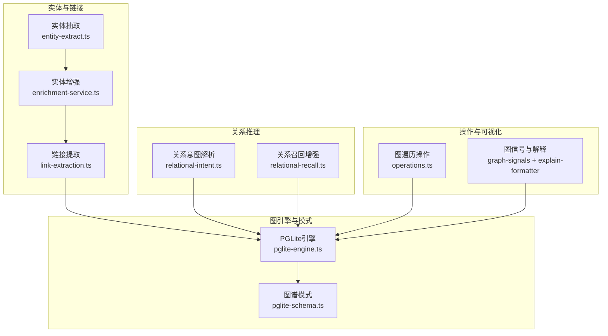
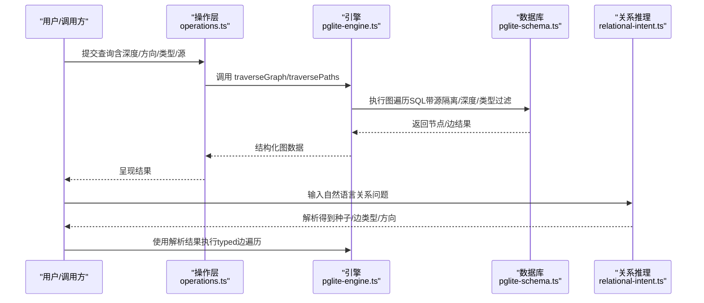
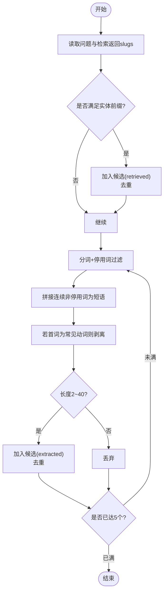
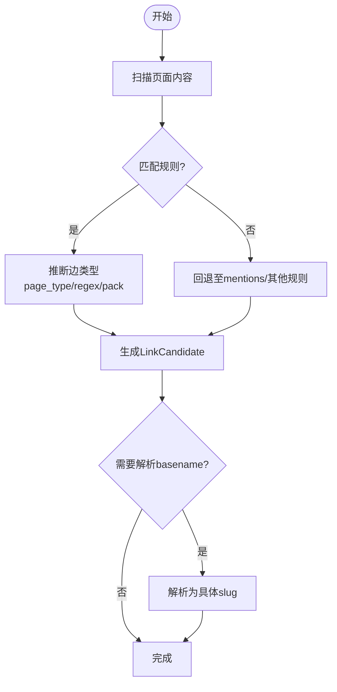
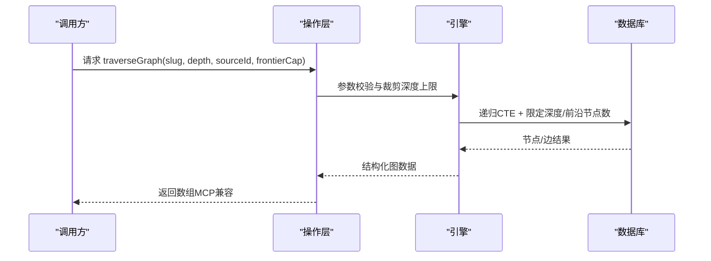
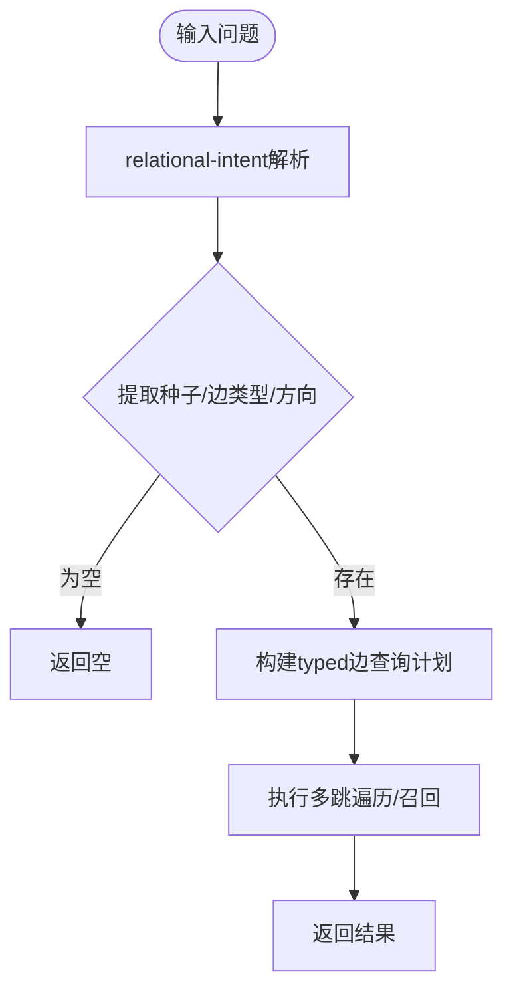
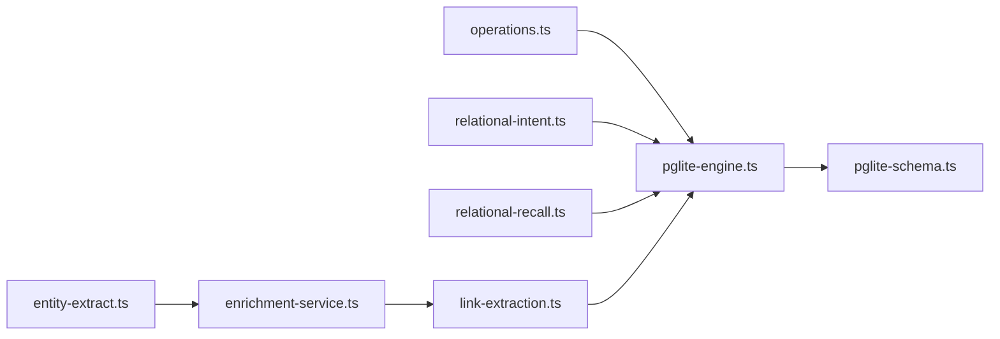
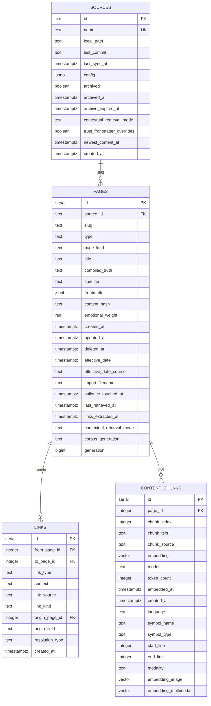

# 知识图谱架构

<cite>
**本文引用的文件**
- [src/core/think/entity-extract.ts](file://src/core/think/entity-extract.ts)
- [src/core/enrichment-service.ts](file://src/core/enrichment-service.ts)
- [src/core/link-extraction.ts](file://src/core/link-extraction.ts)
- [src/core/pglite-engine.ts](file://src/core/pglite-engine.ts)
- [src/core/pglite-schema.ts](file://src/core/pglite-schema.ts)
- [src/core/search/relational-intent.ts](file://src/core/search/relational-intent.ts)
- [src/core/search/relational-recall.ts](file://src/core/search/relational-recall.ts)
- [src/core/operations.ts](file://src/core/operations.ts)
- [src/core/takes-fence.ts](file://src/core/takes-fence.ts)
- [test/think-entity-extract.test.ts](file://test/think-entity-extract.test.ts)
- [test/pglite-engine.test.ts](file://test/pglite-engine.test.ts)
- [test/regressions/v0_36_frontier_cap.test.ts](file://test/regressions/v0_36_frontier_cap.test.ts)
- [test/e2e/source-isolation-pglite.test.ts](file://test/e2e/source-isolation-pglite.test.ts)
- [test/relational-intent.test.ts](file://test/relational-intent.test.ts)
- [test/relational-ab.test.ts](file://test/relational-ab.test.ts)
- [test/link-inference-pack.test.ts](file://test/link-inference-pack.test.ts)
- [test/search/graph-signals-wire-integration.test.ts](file://test/search/graph-signals-wire-integration.test.ts)
- [test/search/explain-formatter.test.ts](file://test/search/explain-formatter.test.ts)
- [test/fixtures/retrieval-quality/relational/corpus.ts](file://test/fixtures/retrieval-quality/relational/corpus.ts)
</cite>

## 目录
1. [引言](#引言)
2. [项目结构](#项目结构)
3. [核心组件](#核心组件)
4. [架构总览](#架构总览)
5. [详细组件分析](#详细组件分析)
6. [依赖分析](#依赖分析)
7. [性能考量](#性能考量)
8. [故障排查指南](#故障排查指南)
9. [结论](#结论)
10. [附录](#附录)

## 引言
本文件面向GBrain知识图谱架构，系统性阐述实体提取、类型化边创建、图遍历查询与关系推理机制；解释自连接知识图谱设计、实体消歧与关系推理能力；给出图数据模型、查询优化与大规模图处理策略，并提供可视化方法与性能调优建议，覆盖多跳查询、路径发现与知识推理。

## 项目结构
- 核心引擎与数据模型：以PGLite嵌入式数据库为核心，通过pglite-engine.ts实现图读写、遍历与查询；pglite-schema.ts定义图谱表结构（pages、links、content_chunks等）。
- 实体与链接：think/entity-extract.ts负责候选实体抽取；link-extraction.ts负责从内容中识别与规范化链接；enrichment-service.ts对实体进行增强与分类。
- 关系推理：search/relational-intent.ts解析“关系型”问题意图，relational-recall.ts提供基于typed edge的召回增强。
- 查询与操作：operations.ts定义对外暴露的图遍历操作参数与深度上限；测试用例覆盖遍历、源隔离、图信号等行为。
- 可信度与推理：takes-fence.ts规范持有者语义，避免归因错误；graph-signals与explain-formatter在检索阶段注入图信号并可解释。

**图表来源**
- [src/core/think/entity-extract.ts:1-197](file://src/core/think/entity-extract.ts#L1-L197)
- [src/core/enrichment-service.ts:150-273](file://src/core/enrichment-service.ts#L150-L273)
- [src/core/link-extraction.ts:53-82](file://src/core/link-extraction.ts#L53-L82)
- [src/core/pglite-engine.ts:2823-2855](file://src/core/pglite-engine.ts#L2823-L2855)
- [src/core/pglite-schema.ts:267-309](file://src/core/pglite-schema.ts#L267-L309)
- [src/core/search/relational-intent.ts](file://src/core/search/relational-intent.ts)
- [src/core/search/relational-recall.ts](file://src/core/search/relational-recall.ts)
- [src/core/operations.ts:2050-2073](file://src/core/operations.ts#L2050-L2073)
- [test/search/graph-signals-wire-integration.test.ts:29-53](file://test/search/graph-signals-wire-integration.test.ts#L29-L53)
- [test/search/explain-formatter.test.ts:81-124](file://test/search/explain-formatter.test.ts#L81-L124)

**章节来源**
- [src/core/pglite-engine.ts:1-200](file://src/core/pglite-engine.ts#L1-L200)
- [src/core/pglite-schema.ts:267-309](file://src/core/pglite-schema.ts#L267-L309)
- [src/core/operations.ts:2050-2073](file://src/core/operations.ts#L2050-L2073)

## 核心组件
- 实体抽取与消歧
  - 候选实体优先来自检索返回的实体前缀slug（高精度），其次从问题文本中抽取短语（中等精度）。通过停用词过滤、动词前缀剥离与上限控制，保证候选质量与数量。
  - 测试覆盖：重复slug去重、非实体前缀忽略、上限5个、大小写不敏感去重等。
- 链接与类型化边
  - 链接提取支持全局basename解析与正则/页面类型规则，生成类型化边（如works_at、invested_in、attended等），并标注来源与解析类型，便于审计与修剪。
- 图遍历与查询
  - 支持按方向（出/入/双向）、按边类型过滤、按源隔离、深度限制与前沿节点上限等参数；提供节点图与边路径两种输出形态。
- 关系推理与召回增强
  - 解析“谁/什么/如何”等关系型问题，自动推断种子实体、边类型集合与方向；结合relational-recall在无显式关键词时仍能召回由typed edge承载的关系。
- 实体增强与分类
  - 基于简单正则识别人名/公司名，提取上下文窗口，进行类型分类与批量增强，支持节流与进度回调。

**章节来源**
- [src/core/think/entity-extract.ts:1-197](file://src/core/think/entity-extract.ts#L1-L197)
- [test/think-entity-extract.test.ts:1-110](file://test/think-entity-extract.test.ts#L1-L110)
- [src/core/link-extraction.ts:53-82](file://src/core/link-extraction.ts#L53-L82)
- [src/core/pglite-engine.ts:2823-2855](file://src/core/pglite-engine.ts#L2823-L2855)
- [src/core/search/relational-intent.ts](file://src/core/search/relational-intent.ts)
- [src/core/search/relational-recall.ts](file://src/core/search/relational-recall.ts)
- [src/core/enrichment-service.ts:150-273](file://src/core/enrichment-service.ts#L150-L273)

## 架构总览
下图展示从“问题输入”到“图遍历/关系推理”的端到端流程，以及与图模式、引擎与外部包的交互。

**图表来源**
- [src/core/operations.ts:2050-2073](file://src/core/operations.ts#L2050-L2073)
- [src/core/pglite-engine.ts:2823-2855](file://src/core/pglite-engine.ts#L2823-L2855)
- [src/core/pglite-schema.ts:267-309](file://src/core/pglite-schema.ts#L267-L309)
- [src/core/search/relational-intent.ts](file://src/core/search/relational-intent.ts)

## 详细组件分析

### 组件A：实体提取与消歧
- 设计要点
  - 两路候选来源：检索返回的实体前缀slug（高置信）优先；问题文本中的名词短语次之。
  - 停用词过滤、动词前缀剥离、长度约束与上限控制，确保候选稳定且可控。
  - 输出包含来源标记（retrieved/extracted），便于后续轨迹/推理门控。
- 复杂度与性能
  - 抽取过程为线性扫描与短语拼接，整体O(n)；上限5个候选，显著降低下游轨迹/推理成本。
- 错误处理与边界
  - 非字符串输入/空输入安全处理；大小写不敏感去重；跨源去重策略明确。

**图表来源**
- [src/core/think/entity-extract.ts:114-173](file://src/core/think/entity-extract.ts#L114-L173)

**章节来源**
- [src/core/think/entity-extract.ts:1-197](file://src/core/think/entity-extract.ts#L1-L197)
- [test/think-entity-extract.test.ts:1-110](file://test/think-entity-extract.test.ts#L1-L110)

### 组件B：类型化边创建与链接提取
- 设计要点
  - 支持全局basename解析（wikilink-resolved）与正则/页面类型规则推断边类型；统一记录link_source与resolution_type，便于审计与修剪。
  - 边类型白名单与schema-pack扩展，允许用户声明额外动词与规则。
- 复杂度与性能
  - 正则匹配与规则扫描为线性代价；通过规则缓存与早期终止可进一步优化。
- 错误处理与边界
  - 未命中规则时回退至传统路径；多匹配时按源顺序确定首选目标。

**图表来源**
- [src/core/link-extraction.ts:53-82](file://src/core/link-extraction.ts#L53-L82)
- [test/link-inference-pack.test.ts:34-64](file://test/link-inference-pack.test.ts#L34-L64)

**章节来源**
- [src/core/link-extraction.ts:53-82](file://src/core/link-extraction.ts#L53-L82)
- [test/link-inference-pack.test.ts:34-64](file://test/link-inference-pack.test.ts#L34-L64)

### 组件C：图遍历查询与路径发现
- 设计要点
  - 支持方向（out/in/both）、边类型过滤、源隔离（单源或多源）、深度上限与前沿节点上限（frontierCap）。
  - traverseGraph返回节点邻接树，traversePaths返回边路径列表，两者均内置源作用域过滤，防止跨源泄漏。
- 复杂度与性能
  - 深度增长导致指数级扩展，需严格限制depth；frontierCap提供硬上限保护；源隔离索引与CTE递归限制减少无效扫描。
- 错误处理与边界
  - 不存在slug返回空集；并发调用各自独立受cap约束；MCP兼容数组输出形状。

**图表来源**
- [src/core/operations.ts:2050-2073](file://src/core/operations.ts#L2050-L2073)
- [src/core/pglite-engine.ts:2823-2855](file://src/core/pglite-engine.ts#L2823-L2855)
- [test/regressions/v0_36_frontier_cap.test.ts:70-126](file://test/regressions/v0_36_frontier_cap.test.ts#L70-L126)
- [test/e2e/source-isolation-pglite.test.ts:153-178](file://test/e2e/source-isolation-pglite.test.ts#L153-L178)

**章节来源**
- [src/core/pglite-engine.ts:2823-2855](file://src/core/pglite-engine.ts#L2823-L2855)
- [test/pglite-engine.test.ts:1172-1229](file://test/pglite-engine.test.ts#L1172-L1229)
- [test/regressions/v0_36_frontier_cap.test.ts:70-126](file://test/regressions/v0_36_frontier_cap.test.ts#L70-L126)
- [test/e2e/source-isolation-pglite.test.ts:153-178](file://test/e2e/source-isolation-pglite.test.ts#L153-L178)

### 组件D：关系推理与多跳查询
- 设计要点
  - relational-intent解析“who/what/how/where”等关系型问题，自动推断种子实体、边类型集合与方向；支持schema-pack扩展词汇。
  - relational-recall在无显式关键词时，利用typed edge提升召回率，特别适用于“词汇不可见”的关系问答。
- 复杂度与性能
  - 问题解析为常量时间；多跳查询受深度与frontierCap限制；relational召回通过边类型过滤与源隔离降低计算。
- 错误处理与边界
  - 非关系类问题返回空；过长/空输入拒绝；停用词/代词种子拒绝；默认仅使用已知边类型集合。

**图表来源**
- [src/core/search/relational-intent.ts](file://src/core/search/relational-intent.ts)
- [src/core/search/relational-recall.ts](file://src/core/search/relational-recall.ts)
- [test/relational-intent.test.ts:1-100](file://test/relational-intent.test.ts#L1-L100)
- [test/relational-ab.test.ts:27-58](file://test/relational-ab.test.ts#L27-L58)
- [test/fixtures/retrieval-quality/relational/corpus.ts:1-25](file://test/fixtures/retrieval-quality/relational/corpus.ts#L1-L25)

**章节来源**
- [src/core/search/relational-intent.ts](file://src/core/search/relational-intent.ts)
- [src/core/search/relational-recall.ts](file://src/core/search/relational-recall.ts)
- [test/relational-intent.test.ts:1-100](file://test/relational-intent.test.ts#L1-L100)
- [test/relational-ab.test.ts:27-58](file://test/relational-ab.test.ts#L27-L58)
- [test/fixtures/retrieval-quality/relational/corpus.ts:1-25](file://test/fixtures/retrieval-quality/relational/corpus.ts#L1-L25)

### 组件E：实体增强与类型化边增强
- 设计要点
  - enrichment-service对实体进行批量增强，支持节流与进度回调；实体识别采用简单正则，提取上下文窗口并进行类型分类。
- 复杂度与性能
  - 批量处理具备吞吐优势；节流与进度回调有助于资源控制与可观测性。
- 错误处理与边界
  - 无实体时直接返回空；重复实体去重；上下文截断避免过大。

**章节来源**
- [src/core/enrichment-service.ts:150-273](file://src/core/enrichment-service.ts#L150-L273)

## 依赖分析
- 模块耦合
  - operations依赖pglite-engine的遍历接口；pglite-engine依赖pglite-schema的表结构与索引；relational-intent与relational-recall依赖引擎的typed边查询能力。
- 外部依赖
  - PGLite提供向量扩展与pg_trgm索引，支撑HNSW与模糊匹配；测试覆盖了源隔离、frontierCap与MCP兼容性。
- 循环依赖
  - 未发现循环导入；各模块职责清晰，通过接口层解耦。

**图表来源**
- [src/core/operations.ts:2050-2073](file://src/core/operations.ts#L2050-L2073)
- [src/core/pglite-engine.ts:2823-2855](file://src/core/pglite-engine.ts#L2823-L2855)
- [src/core/pglite-schema.ts:267-309](file://src/core/pglite-schema.ts#L267-L309)
- [src/core/search/relational-intent.ts](file://src/core/search/relational-intent.ts)
- [src/core/search/relational-recall.ts](file://src/core/search/relational-recall.ts)
- [src/core/think/entity-extract.ts:1-197](file://src/core/think/entity-extract.ts#L1-L197)
- [src/core/enrichment-service.ts:150-273](file://src/core/enrichment-service.ts#L150-L273)
- [src/core/link-extraction.ts:53-82](file://src/core/link-extraction.ts#L53-L82)

**章节来源**
- [src/core/operations.ts:2050-2073](file://src/core/operations.ts#L2050-L2073)
- [src/core/pglite-engine.ts:2823-2855](file://src/core/pglite-engine.ts#L2823-L2855)
- [src/core/pglite-schema.ts:267-309](file://src/core/pglite-schema.ts#L267-L309)

## 性能考量
- 遍历深度与前沿节点上限
  - 深度上限（默认10）与frontierCap（可配置）共同限制输出规模，避免指数爆炸；并发调用各自独立受cap保护。
- 源隔离与索引
  - 源ID过滤贯穿种子、步进与最终选择，配合索引减少无效扫描；向量/HNSW索引加速相似度检索。
- 回调与节流
  - 实体增强支持节流与进度回调，避免突发负载；图信号在检索阶段注入，减少二次排序成本。
- 查询缓存与失效
  - 页面generation与时钟序列用于查询缓存失效与一致性控制，降低重复计算。

**章节来源**
- [src/core/operations.ts:2050-2073](file://src/core/operations.ts#L2050-L2073)
- [test/regressions/v0_36_frontier_cap.test.ts:70-126](file://test/regressions/v0_36_frontier_cap.test.ts#L70-L126)
- [test/e2e/source-isolation-pglite.test.ts:153-178](file://test/e2e/source-isolation-pglite.test.ts#L153-L178)
- [src/core/pglite-schema.ts:154-194](file://src/core/pglite-schema.ts#L154-L194)

## 故障排查指南
- 遍历结果为空
  - 检查slug是否存在；确认源ID过滤是否过于严格；验证深度与frontierCap设置。
- 跨源泄漏或权限异常
  - 确认sourceId/sourceIds参数正确；检查索引与过滤条件是否生效。
- 关系推理未命中
  - 确认问题是否符合关系型模式；检查schema-pack扩展是否正确；验证边类型集合与方向。
- 图信号未生效
  - 检查graph_signals开关与adjacencyFn配置；核对解释格式化输出中的meta字段。
- 初始化失败
  - 根据PGLite初始化失败分类提示修复（如bunfs/macos-26-3问题）。

**章节来源**
- [test/pglite-engine.test.ts:1172-1229](file://test/pglite-engine.test.ts#L1172-L1229)
- [test/e2e/source-isolation-pglite.test.ts:153-178](file://test/e2e/source-isolation-pglite.test.ts#L153-L178)
- [test/search/graph-signals-wire-integration.test.ts:29-53](file://test/search/graph-signals-wire-integration.test.ts#L29-L53)
- [test/search/explain-formatter.test.ts:81-124](file://test/search/explain-formatter.test.ts#L81-L124)
- [src/core/pglite-engine.ts:159-196](file://src/core/pglite-engine.ts#L159-L196)

## 结论
GBrain通过“实体抽取—链接提取—类型化边—图遍历—关系推理”的闭环，实现了高精度、可解释、可扩展的知识图谱。引擎侧的源隔离、深度上限、前沿节点上限与索引策略有效控制了大规模图的查询成本；关系推理与图信号增强了在无显式关键词场景下的召回质量。建议在生产中结合schema-pack扩展与图信号策略，持续评估与调优frontierCap与深度上限，以获得最佳的准确性与性能平衡。

## 附录
- 图数据模型（核心表）
  - pages：实体页，包含slug/type/title/frontmatter等；支持软删除、情感权重、salience/recency等列。
  - links：类型化边，from_page_id/to_page_id/link_type/context/link_source/resolution_type等。
  - content_chunks：内容分片与嵌入，支持HNSW索引与多模态向量。
  - 其他：sources、files、timeline_entries、page_versions、minion_jobs等支撑多源、任务队列与版本管理。

**图表来源**
- [src/core/pglite-schema.ts:36-119](file://src/core/pglite-schema.ts#L36-L119)
- [src/core/pglite-schema.ts:267-309](file://src/core/pglite-schema.ts#L267-L309)
- [src/core/pglite-schema.ts:219-245](file://src/core/pglite-schema.ts#L219-L245)