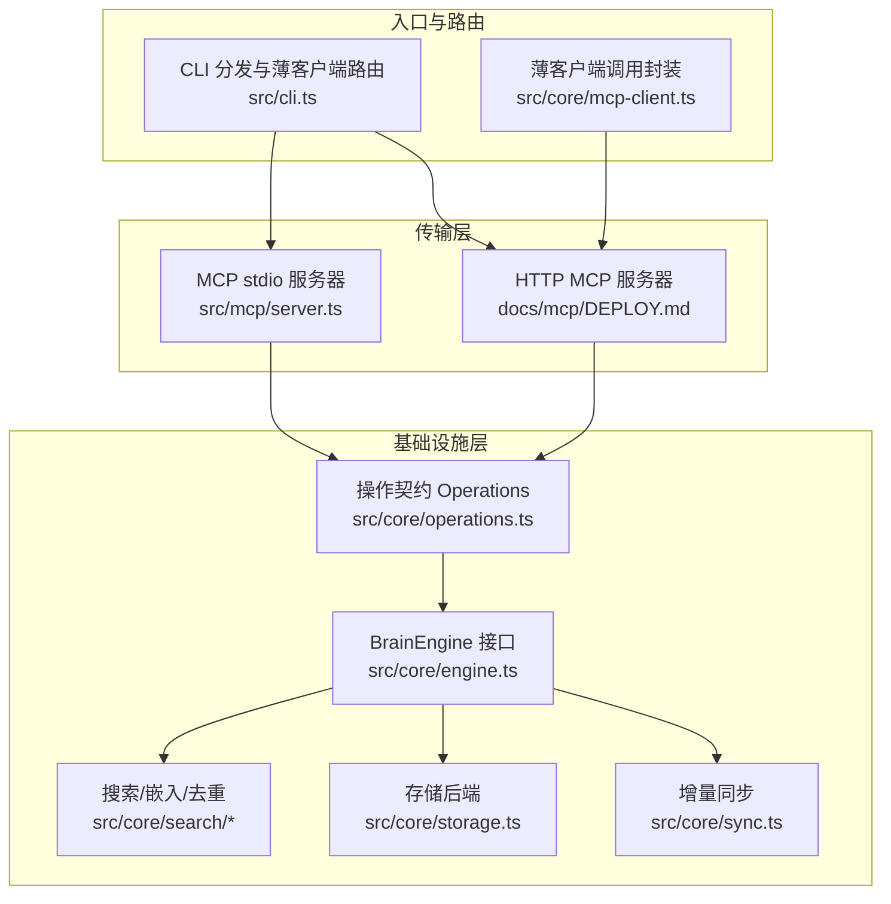
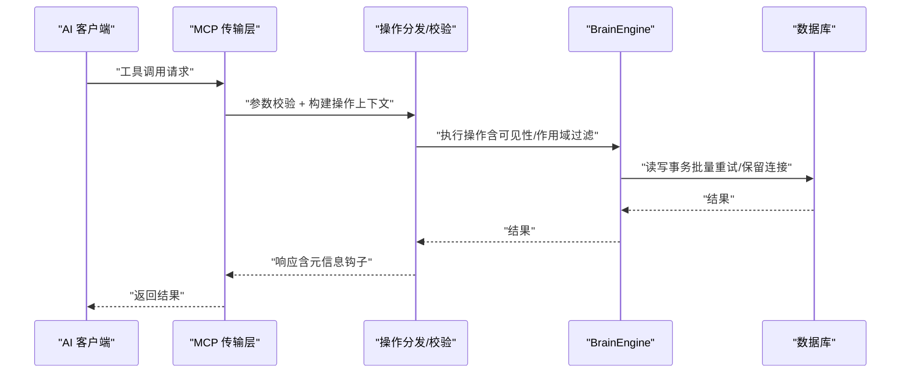
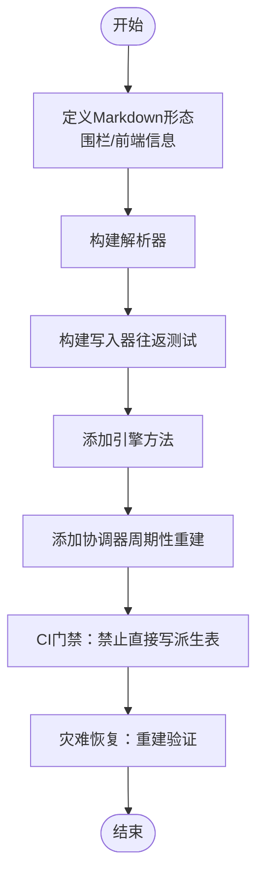
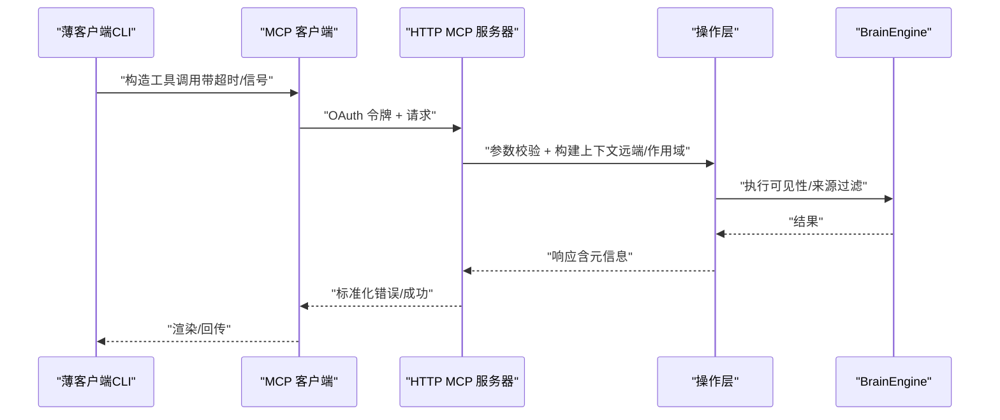
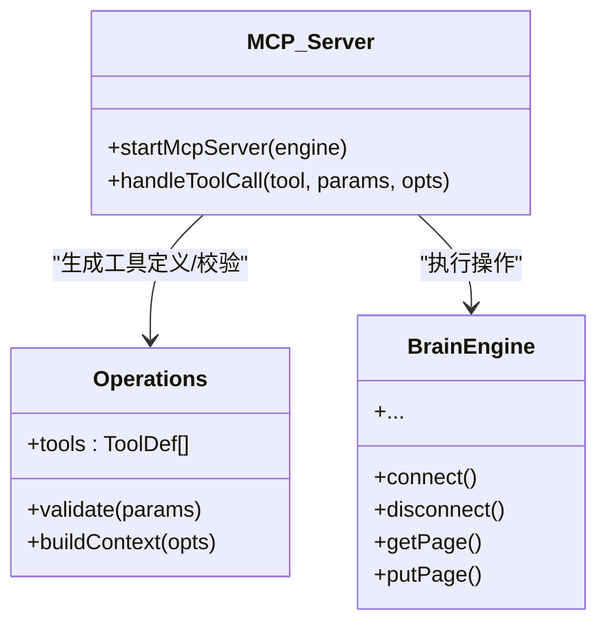
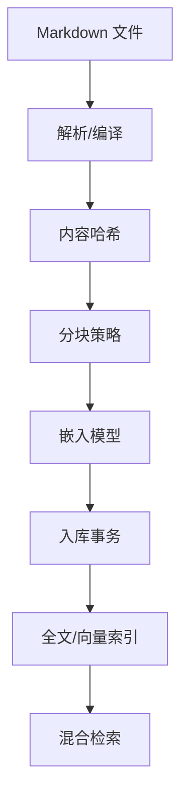
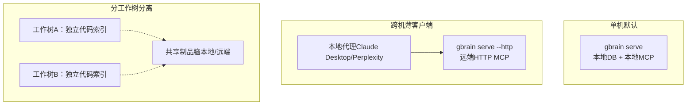
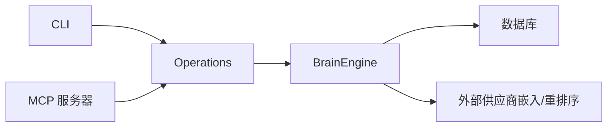

# 系统边界与集成

<cite>
**本文引用的文件**
- [README.md](file://README.md)
- [docs/INSTALL.md](file://docs/INSTALL.md)
- [docs/architecture/system-of-record.md](file://docs/architecture/system-of-record.md)
- [docs/architecture/thin-client.md](file://docs/architecture/thin-client.md)
- [docs/architecture/topologies.md](file://docs/architecture/topologies.md)
- [docs/architecture/infra-layer.md](file://docs/architecture/infra-layer.md)
- [docs/mcp/DEPLOY.md](file://docs/mcp/DEPLOY.md)
- [src/core/engine.ts](file://src/core/engine.ts)
- [src/mcp/server.ts](file://src/mcp/server.ts)
- [src/core/operations.ts](file://src/core/operations.ts)
- [src/cli.ts](file://src/cli.ts)
- [src/core/mcp-client.ts](file://src/core/mcp-client.ts)
- [src/core/doctor-remote.ts](file://src/core/doctor-remote.ts)
- [src/core/ssrf-validate.ts](file://src/core/ssrf-validate.ts)
- [src/core/search/query-intent.ts](file://src/core/search/query-intent.ts)
- [src/core/search/mode.ts](file://src/core/search/mode.ts)
- [src/core/search/hybrid.ts](file://src/core/search/hybrid.ts)
- [src/core/search/image-loader.ts](file://src/core/search/image-loader.ts)
- [src/core/search/by-image.ts](file://src/core/search/by-image.ts)
- [src/core/spend-log.ts](file://src/core/spend-log.ts)
- [src/core/search/llm-intent.ts](file://src/core/search/llm-intent.ts)
- [src/commands/reindex-multimodal.ts](file://src/commands/reindex-multimodal.ts)
- [src/core/backfill-registry.ts](file://src/core/backfill-registry.ts)
- [src/core/migrate.ts](file://src/core/migrate.ts)
- [src/commands/salience.ts](file://src/commands/salience.ts)
- [src/commands/anomalies.ts](file://src/commands/anomalies.ts)
- [src/commands/graph-query.ts](file://src/commands/graph-query.ts)
- [src/commands/think.ts](file://src/commands/think.ts)
</cite>

## 目录
1. [引言](#引言)
2. [项目结构](#项目结构)
3. [核心组件](#核心组件)
4. [架构总览](#架构总览)
5. [详细组件分析](#详细组件分析)
6. [依赖关系分析](#依赖关系分析)
7. [性能考量](#性能考量)
8. [故障排查指南](#故障排查指南)
9. [结论](#结论)
10. [附录](#附录)

## 引言
本文件面向GBrain的系统边界与集成，聚焦以下目标：
- 系统记录（System of Record）的设计理念与实现路径：以“脑仓库（Git仓库）为唯一事实来源”，数据库作为可重建的派生索引。
- 薄客户端架构的优势与实现细节：通过HTTP MCP与OAuth 2.1实现远程调用，结合路由守卫与安全边界，确保跨环境一致体验。
- MCP协议集成：工具定义生成、参数校验、操作上下文构建、远端调用与错误归一化。
- API边界设计与第三方服务集成策略：基于作用域（read/write/admin）、本地仅限操作限制、令牌与审计日志。
- 系统解耦、接口抽象与版本兼容性管理：通过BrainEngine接口、Operations契约、迁移与lint规则保障演进稳定。
- 微服务化原则与单体应用的权衡：在统一内核之上，通过拓扑组合实现多机部署、薄客户端与分工作树隔离。

## 项目结构
GBrain采用“薄外壳+厚技能”的分层设计：
- 基础设施层（Infra Layer）：引擎接口、搜索、嵌入、存储、同步等通用能力。
- 操作层（Operations）：30+工具/操作的契约定义，统一暴露给MCP与CLI。
- 传输层（MCP/HTTP）：stdio与HTTP两种传输，前者用于本地代理，后者用于远程OAuth接入。
- 部署拓扑（Topologies）：单机、跨机薄客户端、分工作树分离三类组合使用。

图示来源
- [src/core/engine.ts](file://src/core/engine.ts)
- [src/core/operations.ts](file://src/core/operations.ts)
- [src/mcp/server.ts](file://src/mcp/server.ts)
- [src/cli.ts](file://src/cli.ts)
- [src/core/mcp-client.ts](file://src/core/mcp-client.ts)
- [docs/mcp/DEPLOY.md](file://docs/mcp/DEPLOY.md)

章节来源
- [docs/architecture/infra-layer.md](file://docs/architecture/infra-layer.md)
- [docs/architecture/topologies.md](file://docs/architecture/topologies.md)
- [docs/mcp/DEPLOY.md](file://docs/mcp/DEPLOY.md)

## 核心组件
- 系统记录（System of Record）
  - 脑仓库（Git）为唯一事实来源；数据库为可重建的派生索引。破坏性测试与CI门禁确保写入路径严格遵循“先Markdown，再派生表”。
  - 私密性边界：三层剥离（chunker→get_page→git跟踪），并支持按目录或页面级忽略。
  - 复原流程：一键重建命令与端到端一致性测试覆盖。
- 薄客户端（Thin Client）
  - 通过HTTP MCP + OAuth 2.1实现远程调用；CLI在薄客户端模式下拒绝本地DB相关命令，并对远端错误进行归一化提示。
  - 远端诊断：OAuth探测、健康检查、作用域探针。
- MCP协议与操作层
  - 工具定义由Operations自动生成；参数校验与操作上下文构建保证远端可信调用。
  - 支持多模态检索与预算控制，以及跨模态路由与意图识别。
- 引擎与数据管道
  - BrainEngine抽象出Postgres与PGLite两套实现；数据从Markdown解析、内容哈希、分块、嵌入到入库，全程事务化。
- 拓扑与部署
  - 单机默认、跨机薄客户端、分工作树分离三种拓扑可叠加；HTTP服务器内置OAuth 2.1、DCR、仪表盘与SSE活动流。

章节来源
- [docs/architecture/system-of-record.md](file://docs/architecture/system-of-record.md)
- [docs/architecture/thin-client.md](file://docs/architecture/thin-client.md)
- [src/core/engine.ts](file://src/core/engine.ts)
- [src/core/operations.ts](file://src/core/operations.ts)
- [src/mcp/server.ts](file://src/mcp/server.ts)
- [docs/mcp/DEPLOY.md](file://docs/mcp/DEPLOY.md)

## 架构总览
下图展示从客户端到引擎的调用链路与安全边界：

图示来源
- [src/mcp/server.ts](file://src/mcp/server.ts)
- [src/core/operations.ts](file://src/core/operations.ts)
- [src/core/engine.ts](file://src/core/engine.ts)

章节来源
- [src/mcp/server.ts](file://src/mcp/server.ts)
- [src/core/operations.ts](file://src/core/operations.ts)
- [src/core/engine.ts](file://src/core/engine.ts)

## 详细组件分析

### 系统记录（System of Record）设计
- 写入契约
  - 新增用户知识类别必须先定义Markdown形态（围栏表格/前端信息），再实现解析器与写入器，并通过CI门禁禁止直接写派生表。
  - 派生表重建：删除后可通过同步与抽取阶段完全恢复，确保灾难恢复与多机同步。
- 私密性与隐私边界
  - 分层剥离：chunker预处理剔除私有事实；get_page在远端模式下剥离围栏；git层面可选择忽略敏感文件。
  - 忘记契约：通过围栏重写与有效期推导实现可重建的“遗忘”状态。
- CI与回归
  - 端到端一致性测试在每次CI运行中验证“删除+重建”字节级一致。

图示来源
- [docs/architecture/system-of-record.md](file://docs/architecture/system-of-record.md)

章节来源
- [docs/architecture/system-of-record.md](file://docs/architecture/system-of-record.md)

### 薄客户端架构（Thin Client）
- 路由与守卫
  - CLI在薄客户端模式下检测配置，优先拒绝本地DB相关命令；对远端错误进行原因码与细节归一化，提供可操作提示。
  - 远端诊断：OAuth发现、令牌往返、MCP初始化探针；支持跳过特定探测以便模拟测试。
- 安全加固
  - URL解析与SSRF防护：DNS解析与每条记录白名单比对，重定向链路逐跳验证；图片输入加载器对URL来源进行SSRF防御。
- 多模态与预算
  - 跨模态路由：根据查询建议与配置选择文本/图像/两者融合；统一列路由与意图识别；支出日志按客户端聚合并提供预算门禁。

图示来源
- [src/cli.ts](file://src/cli.ts)
- [src/core/mcp-client.ts](file://src/core/mcp-client.ts)
- [src/core/doctor-remote.ts](file://src/core/doctor-remote.ts)
- [src/core/ssrf-validate.ts](file://src/core/ssrf-validate.ts)
- [src/core/search/query-intent.ts](file://src/core/search/query-intent.ts)
- [src/core/search/mode.ts](file://src/core/search/mode.ts)
- [src/core/search/hybrid.ts](file://src/core/search/hybrid.ts)
- [src/core/search/image-loader.ts](file://src/core/search/image-loader.ts)
- [src/core/search/by-image.ts](file://src/core/search/by-image.ts)
- [src/core/spend-log.ts](file://src/core/spend-log.ts)
- [src/core/search/llm-intent.ts](file://src/core/search/llm-intent.ts)
- [src/commands/reindex-multimodal.ts](file://src/commands/reindex-multimodal.ts)
- [src/core/backfill-registry.ts](file://src/core/backfill-registry.ts)
- [src/core/migrate.ts](file://src/core/migrate.ts)

章节来源
- [docs/architecture/thin-client.md](file://docs/architecture/thin-client.md)
- [src/cli.ts](file://src/cli.ts)
- [src/core/mcp-client.ts](file://src/core/mcp-client.ts)
- [src/core/doctor-remote.ts](file://src/core/doctor-remote.ts)
- [src/core/ssrf-validate.ts](file://src/core/ssrf-validate.ts)
- [src/core/search/query-intent.ts](file://src/core/search/query-intent.ts)
- [src/core/search/mode.ts](file://src/core/search/mode.ts)
- [src/core/search/hybrid.ts](file://src/core/search/hybrid.ts)
- [src/core/search/image-loader.ts](file://src/core/search/image-loader.ts)
- [src/core/search/by-image.ts](file://src/core/search/by-image.ts)
- [src/core/spend-log.ts](file://src/core/spend-log.ts)
- [src/core/search/llm-intent.ts](file://src/core/search/llm-intent.ts)
- [src/commands/reindex-multimodal.ts](file://src/commands/reindex-multimodal.ts)
- [src/core/backfill-registry.ts](file://src/core/backfill-registry.ts)
- [src/core/migrate.ts](file://src/core/migrate.ts)

### MCP协议集成与API边界
- 工具定义与分发
  - 通过Operations自动生成工具清单；CallTool请求经参数校验与上下文构建后进入引擎执行。
  - 远端默认开启可见性过滤与持有者白名单，避免泄露私有内容。
- 作用域与本地仅限
  - 每个操作标注read/write/admin；file_*与sync_brain等本地仅限操作在HTTP路径上被拒绝。
- 审计与可观测
  - 请求日志参数默认脱敏；仪表盘提供实时SSE活动流与注册客户端管理。

图示来源
- [src/core/operations.ts](file://src/core/operations.ts)
- [src/mcp/server.ts](file://src/mcp/server.ts)
- [src/core/engine.ts](file://src/core/engine.ts)

章节来源
- [src/core/operations.ts](file://src/core/operations.ts)
- [src/mcp/server.ts](file://src/mcp/server.ts)
- [docs/mcp/DEPLOY.md](file://docs/mcp/DEPLOY.md)

### 数据管道与引擎抽象
- 引擎接口
  - BrainEngine定义统一的连接、事务、保留连接、批量写入与重连等能力；Postgres与PGLite实现保持行为一致。
- 数据管道
  - Markdown解析→内容哈希→分块→嵌入→入库事务；全文与向量索引并存，RRF融合与四层去重保障质量。
- 批量与可靠性
  - 批量写入具备自重试语义与审计站点标签；保留连接用于长会话任务与会话级锁。

图示来源
- [docs/architecture/infra-layer.md](file://docs/architecture/infra-layer.md)
- [src/core/engine.ts](file://src/core/engine.ts)

章节来源
- [docs/architecture/infra-layer.md](file://docs/architecture/infra-layer.md)
- [src/core/engine.ts](file://src/core/engine.ts)

### 部署拓扑与微服务化原则
- 三类拓扑
  - 单机默认：本地DB + 本地MCP。
  - 跨机薄客户端：本地代理消费远端HTTP MCP；适合重型脑与多机共享。
  - 分工作树分离：每棵工作树独立代码索引，制品仍共享；适合多Conductor工作树并行。
- 组合与权衡
  - 三类拓扑可叠加；薄客户端与本地引擎不应在同一GBRAIN_HOME混用，需通过GBRAIN_HOME分离。
  - 单机薄客户端与本地引擎的对比：前者适合远程协作与资源隔离，后者适合低延迟与完整功能。

图示来源
- [docs/architecture/topologies.md](file://docs/architecture/topologies.md)

章节来源
- [docs/architecture/topologies.md](file://docs/architecture/topologies.md)

## 依赖关系分析
- 组件耦合与内聚
  - Operations是MCP与CLI的共同契约，向上游引擎抽象解耦；MCP服务器与CLI仅负责路由与上下文构建。
  - 引擎层通过接口抽象屏蔽底层差异，便于PGLite与Postgres双栈演进。
- 外部依赖与集成点
  - OAuth 2.1（DCR可选）、ngrok/Tailscale/Fly.io等隧道；嵌入与重排序供应商通过网关适配。
- 可能的循环依赖
  - 通过“契约先行”的Operations与“工具定义生成”避免循环；CLI与MCP服务器均依赖Operations而非彼此。

图示来源
- [src/cli.ts](file://src/cli.ts)
- [src/core/operations.ts](file://src/core/operations.ts)
- [src/mcp/server.ts](file://src/mcp/server.ts)
- [src/core/engine.ts](file://src/core/engine.ts)

章节来源
- [src/cli.ts](file://src/cli.ts)
- [src/core/operations.ts](file://src/core/operations.ts)
- [src/mcp/server.ts](file://src/mcp/server.ts)
- [src/core/engine.ts](file://src/core/engine.ts)

## 性能考量
- 搜索与检索
  - 向量与关键词RRF融合、四层去重、源去重与多样性约束，平衡召回与多样性。
  - 批量嵌入与指数退避降低失败率；HNSW索引与tsvector提升检索效率。
- 写入与批处理
  - 批量写入具备自重试与审计站点标签，避免重复负载；保留连接用于长事务与会话级锁。
- 远端调用
  - 超时与信号组合、错误原因码与细节归一化，减少重试风暴与误判。
- 多模态
  - 统一列路由与意图识别，按需触发LLM打分，控制成本与延迟。

## 故障排查指南
- 常见问题定位
  - 远端薄客户端：使用doctor/remote命令进行OAuth与MCP探测；检查作用域与令牌有效期。
  - SSRF与URL加载：确认URL解析与每条记录白名单匹配；图片加载器对大小与格式进行限制。
  - 多模态与预算：检查跨模态权重配置与支出日志；必要时调整阈值或豁免。
- 关键命令与路径
  - 远端诊断：doctor/remote、get_brain_identity、get_health。
  - 薄客户端路由：think/salience/anomalies/graph-query等命令在薄客户端下的分支逻辑。
  - 多模态重索引：reindex --multimodal；检查checkpoint与覆盖率提示。

章节来源
- [src/core/doctor-remote.ts](file://src/core/doctor-remote.ts)
- [src/core/ssrf-validate.ts](file://src/core/ssrf-validate.ts)
- [src/core/search/image-loader.ts](file://src/core/search/image-loader.ts)
- [src/commands/reindex-multimodal.ts](file://src/commands/reindex-multimodal.ts)
- [src/commands/salience.ts](file://src/commands/salience.ts)
- [src/commands/anomalies.ts](file://src/commands/anomalies.ts)
- [src/commands/graph-query.ts](file://src/commands/graph-query.ts)
- [src/commands/think.ts](file://src/commands/think.ts)

## 结论
GBrain通过“脑仓库为唯一事实来源”的系统记录设计，确保了可重建性与隐私可控；薄客户端架构借助HTTP MCP与OAuth 2.1实现了跨设备、跨团队的安全协作；MCP协议与Operations契约提供了清晰的API边界与可观测性；在统一引擎抽象之上，通过多种部署拓扑满足不同规模与场景需求。整体设计在“薄外壳+厚技能”的哲学下，既保持单体内核的一致性，又支持多机与远程协作的微服务化扩展。

## 附录
- 安装与快速入门参考
  - [docs/INSTALL.md](file://docs/INSTALL.md)
  - [README.md](file://README.md)
- MCP部署与客户端对接
  - [docs/mcp/DEPLOY.md](file://docs/mcp/DEPLOY.md)
- 架构与拓扑
  - [docs/architecture/infra-layer.md](file://docs/architecture/infra-layer.md)
  - [docs/architecture/topologies.md](file://docs/architecture/topologies.md)
  - [docs/architecture/thin-client.md](file://docs/architecture/thin-client.md)
  - [docs/architecture/system-of-record.md](file://docs/architecture/system-of-record.md)