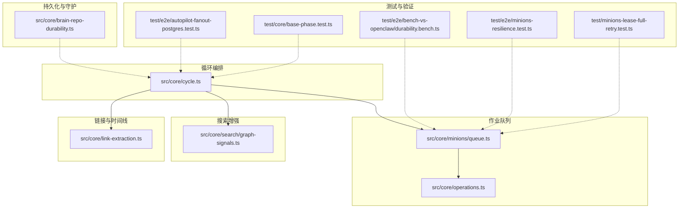
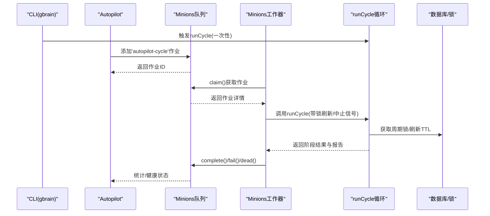
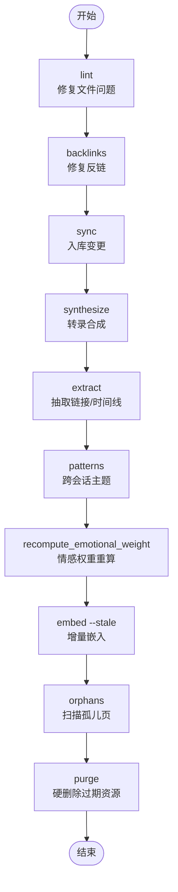
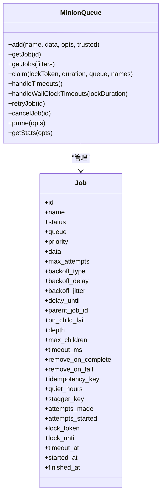
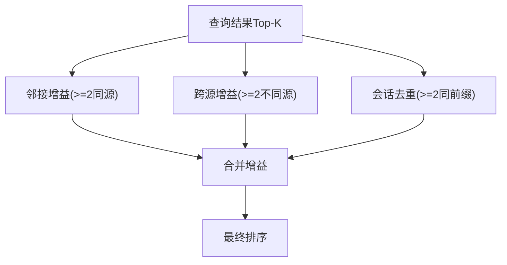
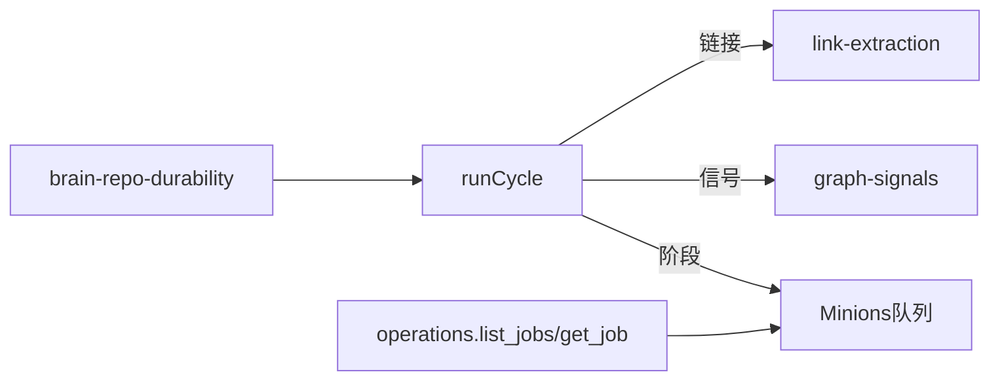

# 24/7自主循环

<cite>
**本文档引用的文件**
- [src/core/cycle.ts](file://src/core/cycle.ts)
- [src/core/minions/queue.ts](file://src/core/minions/queue.ts)
- [src/core/search/graph-signals.ts](file://src/core/search/graph-signals.ts)
- [src/core/link-extraction.ts](file://src/core/link-extraction.ts)
- [src/core/brain-repo-durability.ts](file://src/core/brain-repo-durability.ts)
- [src/core/operations.ts](file://src/core/operations.ts)
- [test/e2e/bench-vs-openclaw/durability.bench.ts](file://test/e2e/bench-vs-openclaw/durability.bench.ts)
- [test/e2e/minions-resilience.test.ts](file://test/e2e/minions-resilience.test.ts)
- [test/minions-lease-full-retry.test.ts](file://test/minions-lease-full-retry.test.ts)
- [test/e2e/autopilot-fanout-postgres.test.ts](file://test/e2e/autopilot-fanout-postgres.test.ts)
- [test/core/base-phase.test.ts](file://test/core/base-phase.test.ts)
</cite>

## 目录
1. [引言](#引言)
2. [项目结构](#项目结构)
3. [核心组件](#核心组件)
4. [架构总览](#架构总览)
5. [详细组件分析](#详细组件分析)
6. [依赖关系分析](#依赖关系分析)
7. [性能考量](#性能考量)
8. [故障排除指南](#故障排除指南)
9. [结论](#结论)
10. [附录](#附录)

## 引言
本文件面向GBrain的24/7自主循环系统，系统性阐述“信号检测—脑优先查找—自动链接—定时增强”等循环阶段的工作原理与执行顺序；深入解析Minions作业队列的Durable子代理机制、崩溃恢复与持久化策略；给出循环配置参数、性能监控指标与故障排除清单，并提供优化最佳实践与实际运行示例，展示自主循环如何持续优化知识库质量。

## 项目结构
围绕24/7自主循环的关键代码分布在以下模块：
- 循环编排与阶段：src/core/cycle.ts
- 作业队列与Durable子代理：src/core/minions/queue.ts
- 搜索信号增强（信号检测）：src/core/search/graph-signals.ts
- 自动链接与时间线：src/core/link-extraction.ts
- 脑仓库持久化与守护：src/core/brain-repo-durability.ts
- 队列管理操作接口：src/core/operations.ts
- 端到端与基准测试：多个test目录下的e2e与bench测试

**图示来源**
- [src/core/cycle.ts:1-200](file://src/core/cycle.ts#L1-L200)
- [src/core/minions/queue.ts:1-120](file://src/core/minions/queue.ts#L1-L120)
- [src/core/search/graph-signals.ts:1-80](file://src/core/search/graph-signals.ts#L1-L80)
- [src/core/link-extraction.ts:1173-1229](file://src/core/link-extraction.ts#L1173-L1229)
- [src/core/brain-repo-durability.ts:507-540](file://src/core/brain-repo-durability.ts#L507-L540)
- [src/core/operations.ts:3015-3044](file://src/core/operations.ts#L3015-L3044)
- [test/e2e/bench-vs-openclaw/durability.bench.ts:1-31](file://test/e2e/bench-vs-openclaw/durability.bench.ts#L1-L31)
- [test/e2e/minions-resilience.test.ts:40-63](file://test/e2e/minions-resilience.test.ts#L40-L63)
- [test/e2e/autopilot-fanout-postgres.test.ts:96-132](file://test/e2e/autopilot-fanout-postgres.test.ts#L96-L132)
- [test/minions-lease-full-retry.test.ts:58-61](file://test/minions-lease-full-retry.test.ts#L58-L61)
- [test/core/base-phase.test.ts:250-265](file://test/core/base-phase.test.ts#L250-L265)

**章节来源**
- [src/core/cycle.ts:1-200](file://src/core/cycle.ts#L1-L200)
- [src/core/minions/queue.ts:1-120](file://src/core/minions/queue.ts#L1-L120)

## 核心组件
- 自主循环编排器：负责阶段顺序、锁协调、预算与超时、错误分类与报告生成。
- Minions作业队列：提供Durable子代理、作业生命周期管理、重试与超时处理、父-子派生与健康检查。
- 搜索信号增强：在融合后阶段对Top-K结果应用邻接、跨源与会话去重增益，失败时可回退。
- 自动链接与时间线：基于配置开关控制是否启用自动链接与时间线解析。
- 脑仓库持久化：通过crontab或launchd确保脑仓库守护进程稳定运行。
- 运维操作接口：提供作业查询、列表与统计等管理能力。

**章节来源**
- [src/core/cycle.ts:101-186](file://src/core/cycle.ts#L101-L186)
- [src/core/minions/queue.ts:45-120](file://src/core/minions/queue.ts#L45-L120)
- [src/core/search/graph-signals.ts:1-60](file://src/core/search/graph-signals.ts#L1-L60)
- [src/core/link-extraction.ts:1173-1229](file://src/core/link-extraction.ts#L1173-L1229)
- [src/core/brain-repo-durability.ts:507-540](file://src/core/brain-repo-durability.ts#L507-L540)
- [src/core/operations.ts:3015-3044](file://src/core/operations.ts#L3015-L3044)

## 架构总览
24/7自主循环以“最小可行单元”贯穿多入口：
- CLI“gbrain dream”触发一次性循环；
- 守护“gbrain autopilot”按周期调度；
- Minions“autopilot-cycle”处理器通过队列实现Durable执行与可观测性。

**图示来源**
- [src/core/cycle.ts:558-566](file://src/core/cycle.ts#L558-L566)
- [src/core/minions/queue.ts:605-633](file://src/core/minions/queue.ts#L605-L633)
- [src/core/minions/queue.ts:792-800](file://src/core/minions/queue.ts#L792-L800)

## 详细组件分析

### 循环阶段与执行顺序
- 阶段顺序由语义驱动：先修复文件与链接，再同步入库，随后合成、抽取、模式、情感权重重算、嵌入、孤儿页扫描，最后清理与净化。
- 全局阶段与非全局阶段分离：全局阶段（如嵌入、孤儿页、净化、符号边解析、校准）在独立的“全局维护”作业中串行执行，避免并发写冲突导致内存膨胀。
- 锁策略：Postgres使用gbrain_cycle_locks表行级锁（含TTL刷新），PGLite使用文件锁；短TTL配合长阶段的周期刷新，降低崩溃恢复时间。

**图示来源**
- [src/core/cycle.ts:13-28](file://src/core/cycle.ts#L13-L28)
- [src/core/cycle.ts:258-259](file://src/core/cycle.ts#L258-L259)

**章节来源**
- [src/core/cycle.ts:13-44](file://src/core/cycle.ts#L13-L44)
- [src/core/cycle.ts:258-308](file://src/core/cycle.ts#L258-L308)

### Minions作业队列与Durable子代理机制
- 作业生命周期：提交→排队→claim→运行→完成/失败/死亡；支持父-子派生、延迟、幂等键、最大尝试次数与退避策略。
- 崩溃恢复：通过“活跃但锁已过期”的检测与重入队列，结合超时与墙钟超时处理，确保长时间卡死任务被终止并通知父任务。
- 持久化策略：作业状态与附件持久化于数据库；支持按状态清理与队列健康度统计（等待/活跃/停滞）。
- 并发与背压：命名作业的等待队列上限保护；父子并发受max_children限制；最大派生深度防止无限分支。

**图示来源**
- [src/core/minions/queue.ts:77-323](file://src/core/minions/queue.ts#L77-L323)
- [src/core/minions/queue.ts:605-800](file://src/core/minions/queue.ts#L605-L800)

**章节来源**
- [src/core/minions/queue.ts:77-323](file://src/core/minions/queue.ts#L77-L323)
- [src/core/minions/queue.ts:605-800](file://src/core/minions/queue.ts#L605-L800)

### 信号检测与定时增强
- 信号检测：在融合后阶段对Top-K页面应用“同源邻接”“跨源邻接”“会话去重”三类增益，失败时fail-open保持原结果。
- 定时增强：通过配置开关控制自动链接与自动时间线解析，减少手工维护成本。
- 性能观测：提供分数分布统计与信号元数据，支撑后续校准波。

**图示来源**
- [src/core/search/graph-signals.ts:289-418](file://src/core/search/graph-signals.ts#L289-L418)

**章节来源**
- [src/core/search/graph-signals.ts:1-60](file://src/core/search/graph-signals.ts#L1-L60)
- [src/core/search/graph-signals.ts:289-418](file://src/core/search/graph-signals.ts#L289-L418)
- [src/core/link-extraction.ts:1173-1229](file://src/core/link-extraction.ts#L1173-L1229)

### 脑优先查找与自动链接
- 自动链接开关：默认开启，可通过配置项关闭；支持大小写不敏感与空白裁剪的真值判断。
- 全局basename解析：当开启时，裸wikilink可匹配所有页面basename，形成全局边。
- 时间线解析：根据新写入内容解析时间线条目并批量插入。

**章节来源**
- [src/core/link-extraction.ts:1173-1229](file://src/core/link-extraction.ts#L1173-L1229)

### 脑仓库持久化与守护
- 通过crontab或launchd安装守护脚本，定期触发脑仓库维护任务，保证24/7可用性。
- 支持移除旧守护任务与清理包装脚本，确保环境整洁。

**章节来源**
- [src/core/brain-repo-durability.ts:507-540](file://src/core/brain-repo-durability.ts#L507-L540)

### 循环配置参数与预算
- 循环选项：干跑、阶段选择、拉取策略、合成输入范围、中止信号、源作用域锁等。
- 预算与配额：各阶段内置预算计量器，支持策略与追踪器双重上限，低优先级阶段可让路高优先级。
- 成本上限：通过策略与追踪器取较小者，确保整体预算可控。

**章节来源**
- [src/core/cycle.ts:409-482](file://src/core/cycle.ts#L409-L482)
- [test/core/base-phase.test.ts:250-265](file://test/core/base-phase.test.ts#L250-L265)

## 依赖关系分析
- 循环与队列：Minions作为Durable执行载体，向runCycle注入锁刷新与中止信号，确保长阶段可靠推进。
- 搜索增强与循环：信号增强在融合后阶段调用，影响最终排序与解释输出。
- 链接与时间线：自动链接与时间线解析在同步与合成之后进行，提升知识图谱完整性。
- 持久化与运维：脑仓库守护保障外部依赖稳定，避免因宿主服务中断导致的维护空窗。

**图示来源**
- [src/core/cycle.ts:558-566](file://src/core/cycle.ts#L558-L566)
- [src/core/minions/queue.ts:3015-3044](file://src/core/minions/queue.ts#L3015-L3044)
- [src/core/search/graph-signals.ts:289-418](file://src/core/search/graph-signals.ts#L289-L418)
- [src/core/link-extraction.ts:1173-1229](file://src/core/link-extraction.ts#L1173-L1229)
- [src/core/brain-repo-durability.ts:507-540](file://src/core/brain-repo-durability.ts#L507-L540)

## 性能考量
- 锁TTL缩短至5分钟，配合长阶段的周期刷新，显著降低崩溃恢复时间。
- 全局阶段分离：避免N次并发写入同一行，降低RSS峰值与锁竞争。
- 队列健康度：通过等待/活跃/停滞计数与“健康活跃”签名识别队列阻塞。
- 信号增强：保守增益倍率，fail-open设计避免异常放大重排风险。
- 并发与背压：命名作业等待上限与父子并发限制，防止风暴式提交。

**章节来源**
- [src/core/cycle.ts:492-501](file://src/core/cycle.ts#L492-L501)
- [src/core/minions/queue.ts:504-597](file://src/core/minions/queue.ts#L504-L597)
- [src/core/search/graph-signals.ts:22-39](file://src/core/search/graph-signals.ts#L22-L39)

## 故障排除指南
- 队列阻塞（Wedge）：若队列存在“健康活跃=0且仍有等待”，需检查工作器存活与锁回收。
- 超时与墙钟超时：优先处理stall→timeout→wall-clock timeout的顺序，确保不会重复处理。
- 作业取消：取消会递归更新后代并发送child_done消息，注意聚合器的等待条件。
- 幂等键冲突：提交时通过唯一索引避免重复插入，必要时使用返回的现有作业。
- 崩溃恢复对比：Minions在SIGKILL场景下可恢复未完成工作，OpenClaw本地模式则丢失。
- 并发风暴：利用命名作业等待上限与父子并发限制，避免同时提交过多作业。

**章节来源**
- [src/core/minions/queue.ts:504-597](file://src/core/minions/queue.ts#L504-L597)
- [src/core/minions/queue.ts:634-790](file://src/core/minions/queue.ts#L634-L790)
- [test/e2e/bench-vs-openclaw/durability.bench.ts:1-31](file://test/e2e/bench-vs-openclaw/durability.bench.ts#L1-L31)
- [test/e2e/minions-resilience.test.ts:55-63](file://test/e2e/minions-resilience.test.ts#L55-L63)

## 结论
24/7自主循环通过“阶段有序、锁协调、预算约束、信号增强、自动链接与守护持久化”构建了稳健的知识库维护闭环。Minions队列提供Durable执行与可观测性，结合严格的超时与背压策略，确保系统在长阶段与高负载下仍可自愈与收敛。建议在生产中启用全局维护分离、合理设置预算上限与队列容量，并持续关注信号增强的校准数据以优化检索质量。

## 附录

### 循环配置参数速查
- 干跑：dryRun
- 阶段选择：phases
- 同步拉取：pull
- 合成输入范围：synthInputFile/synthDate/synthFrom/synthTo
- 中止信号：signal
- 源作用域锁：sourceId
- 预算上限：策略与追踪器双重约束

**章节来源**
- [src/core/cycle.ts:409-482](file://src/core/cycle.ts#L409-L482)
- [test/core/base-phase.test.ts:250-265](file://test/core/base-phase.test.ts#L250-L265)

### 队列管理操作
- 查询作业：get_job
- 列出作业：list_jobs（支持按状态/队列/类型过滤）
- 统计健康：getStats（按状态/类型/队列健康度）

**章节来源**
- [src/core/operations.ts:3015-3044](file://src/core/operations.ts#L3015-L3044)

### 实际运行示例
- Minions韧性端到端测试：验证并发提交与最大子任务限制。
- 自动分发与幂等：每槽位内重复分发通过幂等键去重，仅保留一条作业。
- 崩溃恢复基准：模拟SIGKILL场景，评估Minions与OpenClaw差异。

**章节来源**
- [test/e2e/minions-resilience.test.ts:55-63](file://test/e2e/minions-resilience.test.ts#L55-L63)
- [test/e2e/autopilot-fanout-postgres.test.ts:106-129](file://test/e2e/autopilot-fanout-postgres.test.ts#L106-L129)
- [test/e2e/bench-vs-openclaw/durability.bench.ts:1-31](file://test/e2e/bench-vs-openclaw/durability.bench.ts#L1-L31)